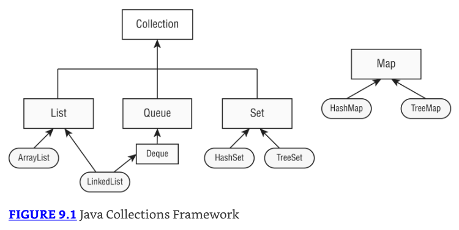
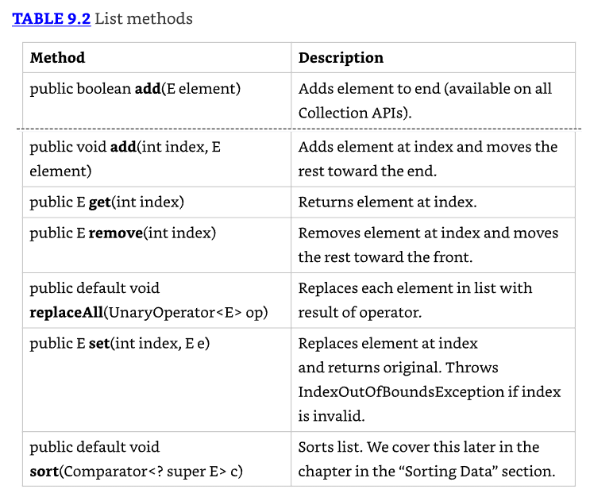

# Cap. 09 - Collections and Generics

## Usando la colección de API comunes

Una colección es un grupo de objetos contenidos en un único objeto. 

El Java Collections Framework es un conjunto de clases en `java.util` para almacenar colecciones.

El framework tiene cuatro interfaces principales:

* List (Lista):
  * Colección ordenada de elementos
  * Permite duplicados
  * Los elementos se acceden mediante un índice int
  * Ejemplo típico: mantener una lista de tareas donde el orden importa

* Set (Conjunto):
  * Colección que NO permite duplicados
  * No garantiza orden específico (depende de la implementación)
  * Útil cuando necesitas unicidad de elementos

* Queue (Cola):
  * Colección que ordena elementos en un orden específico para procesamiento
  * Normalmente FIFO (First-In-First-Out), pero puede variar
  * **Deque** es una sub interfaz que permite acceso en ambos extremos (como una cola de doble extremo)

* Map (Mapa):
  * NO implementa la interfaz Collection (detalle importante para el examen)
  * Mapea claves a valores
  * No permite claves duplicadas
  * Los elementos son par clave/valor
  * Es considerado parte del Collections Framework aunque técnicamente no sea una Collection 
    * Se tratan diferente porque necesitan métodos distintos debido a que trabajan con pares clave/valor, no con elementos individuales.



### Usando el operador diamante 

Inicialmente, al construir colecciones con generics, debes especificar el tipo:

```java
List<Integer> list = new ArrayList<Integer>();

// con anidamiento
Map<Long,List<Integer>> mapLists = new HashMap<Long,List<Integer>>();
```

El operador diamante (<>) es una notación abreviada que permite omitir el tipo genérico del lado derecho cuando puede inferirse:

* Se llama diamond operator porque <> parece un diamante
* Ambas declaraciones son equivalentes para el compilador
* La versión con `<>` es más corta y fácil de leer

```java
List<Integer> list = new ArrayList<>();
Map<Long,List<Integer>> mapOfLists = new HashMap<>();
```

El operador diamante NO puede usarse en el lado izquierdo de una declaración de variable. Solo en el lado derecho de una asignación.

```java
List<> list = new ArrayList<Integer>();  // DOES NOT COMPILE

class InvalidUse {
    void use(List<> data) {}  // DOES NOT COMPILE
}
```

### Agregando información

Método `add()`:
* Inserta un nuevo elemento en la Collection
* Retorna un boolean indicando si fue exitoso
* La firma del método es `public boolean add(E element)`
  * `E` representa el tipo genérico usado al crear la colección
* Para algunos tipos de Collection, `add()` siempre retorna `true`
* Para otros tipos, hay lógica sobre si la llamada fue exitosa

Ejemplo con List:

```java
3: Collection<String> list = new ArrayList<>();
4: System.out.println(list.add("Sparrow")); // true
5: System.out.println(list.add("Sparrow")); // true
```

Ejemplo con Set:

```java
7: Collection<String> set = new HashSet<>();
8: System.out.println(set.add("Sparrow")); // true
9: System.out.println(set.add("Sparrow")); // false
```

Diferencia:
* List permite duplicados → retorna `true` ambas veces
* Set NO permite duplicados → línea 9 retorna `false` al intentar agregar un duplicado

### Removiendo información

Método `remove()`:
* Remueve un único valor que coincida en la Collection
* Retorna un boolean indicando si fue exitoso
* La firma del método es `public boolean remove(Object object)`

Explicación: El valor boolean de retorno indica si se encontró y removió una coincidencia (solo remueve 1 por intento).

```java
3: Collection<String> birds = new ArrayList<>();
4: birds.add("hawk");  // [hawk]
5: birds.add("hawk");  // [hawk, hawk]
6: System.out.println(birds.remove("cardinal")); // false
7: System.out.println(birds.remove("hawk"));     // true
8: System.out.println(birds);                    // [hawk]
```

### Contando elementos

Métodos: `size()` y `isEmpty()`
* `size()` retorna el número de elementos en la Collection
* `isEmpty()` retorna `true` si la Collection no tiene elementos
* Su firma es:
  * `public int size()`
  * `public boolean isEmpty()`

```java
Collection<String> birds = new ArrayList<>();
System.out.println(birds.isEmpty()); // true
System.out.println(birds.size());    // 0
birds.add("hawk");                   // [hawk]
birds.add("hawk");                   // [hawk, hawk]

System.out.println(birds.isEmpty()); // false
System.out.println(birds.size());    // 2
```

### Limpiando colecciones

Método `clear()`:
* Proporciona una manera fácil de descartar todos los elementos de la Collection.
* Su firma es `public void clear()`

```java
Collection<String> birds = new ArrayList<>();
birds.add("hawk");                   // [hawk]
birds.add("hawk");                   // [hawk, hawk]
System.out.println(birds.isEmpty()); // false
System.out.println(birds.size());    // 2
birds.clear();                       // []
System.out.println(birds.isEmpty()); // true
System.out.println(birds.size());    // 0
```

Después de llamar `clear()`, birds vuelve a ser un ArrayList vacío de tamaño 0.

### Validando contenido

Método `contains()`:
* Verifica si un elemento específico está en la Collection
* Su firma es `public boolean contains(Object object)`
* Funcionamiento; el método `contains()` llama a `equals()` en los elementos del ArrayList para ver si hay coincidencias.

```java
Collection<String> birds = new ArrayList<>();
birds.add("hawk"); // [hawk]
System.out.println(birds.contains("hawk"));  // true
System.out.println(birds.contains("robin")); // false
```

### Removiendo con condiciones

Método `removeIf()`:
* Remueve todos los elementos que coinciden con una condición. 
* Podemos especificar qué debe eliminarse usando un bloque de código o incluso una referencia a método.
* Firma: `public boolean removeIf(Predicate<? super E> filter)`
  * Nota: La signatura parece así. (Se explica qué significa él `? super` más adelante en este capítulo)
* Funcionamiento; Usa un, `Predicate`, que toma un parámetro y retorna un boolean.

```java
4: Collection<String> list = new ArrayList<>();
5: list.add("Magician");
6: list.add("Assistant");
7: System.out.println(list);  // [Magician, Assistant]
8: list.removeIf(s -> s.startsWith("A"));
9: System.out.println(list);  // [Magician]
```

Explicación línea 8; Remueve todos los valores String que comienzan con la letra A.

```java
11: Collection<String> set = new HashSet<>();
12: set.add("Wand");
13: set.add("");
14: set.removeIf(String::isEmpty); // s -> s.isEmpty()
15: System.out.println(set);  // [Wand]
```

Explicación línea 14; Remueve todos los valores String que están vacíos usando una referencia a método.

### Iterando sobre colecciones

Método `forEach()`:
* Puedes llamarlo en una Collection en lugar de escribir un loop. Usa un Consumer que toma un único parámetro y no retorna nada.
* Firma: `public void forEach(Consumer<? super T> action)`

Ejemplo: A los gatos les gusta explorar, así que imprimamos dos de ellos usando tanto referencias a método como lambdas:

```java
Collection<String> cats = List.of("Annie", "Ripley");
cats.forEach(System.out::println);
cats.forEach(c -> System.out.println(c));
```

**Otras formas de iteración**

Hay otras maneras de iterar a través de una Collection cómo hacer loop a través de una lista usando un enhanced for loop.

```java
for (String element: coll)
    System.out.println(element);

// un enfoque más antiguo es: 
Iterator<String> iter = coll.iterator();
while(iter.hasNext()) {
String string = iter.next();
    System.out.println(string);
}
```

El método `hasNext()` verifica si hay un siguiente valor. En otras palabras, te dice si `next()` se ejecutará sin lanzar una excepción. 

El método `next()` realmente mueve el Iterator al siguiente elemento.

### Determinando igualdad

Implementación personalizada de equals():
* Permite comparar dos Collections y comparar el tipo y contenidos. La implementación varía. 
  * Por ejemplo, ArrayList verifica el orden, mientras que HashSet no.
* La firma es `public boolean equals(Object object)`

```java
23: var list1 = List.of(1, 2);
24: var list2 = List.of(2, 1);
25: var set1 = Set.of(1, 2);
26: var set2 = Set.of(2, 1);
27:
28: System.out.println(list1.equals(list2)); // false
29: System.out.println(set1.equals(set2));   // true
30: System.out.println(list1.equals(set1));  // false
```

* Línea 28 imprime false porque los elementos están en diferente orden, y una List se preocupa por el orden
* En contraste, línea 29 imprime true porque un Set no es sensible al orden
* Finalmente, línea 30 imprime false porque los tipos son diferentes

**Desempaquetando nulos**

Java nos protege de muchos problemas con Collections. Sin embargo, aún es posible escribir un NullPointerException:

```java
3: var heights = new ArrayList<Integer>();
4: heights.add(null);
5: int h = heights.get(0); // NullPointerException
```

* Línea 4: agregamos un null a la lista. Esto es legal porque una referencia null puede ser asignada a cualquier variable de referencia
* Línea 5: intentamos hacer unbox de ese `null` a un primitivo `int`. Esto es un problema
* Java intenta obtener el valor int de `null`. Como llamar cualquier método en null genera un `NullPointerException`, eso es justo lo que obtenemos

## Usando la interfaz List

Pasemos a interfaces específicas. Se usa una `list` cuando quieres una colección ordenada

En una lista de nombres puede contener duplicados, ya que dos animales pueden tener el mismo nombre. 
* Los elementos pueden ser recuperados e insertados en posiciones específicas en la lista basándose en un índice `int`, muy parecido a un `array`. 
* A diferencia de un array, sin embargo, muchas implementaciones de List pueden cambiar de tamaño después de ser declaradas.
* Uso común; Las listas se usan donde necesitas mantener un registro de una lista de objetos. 
  * Por ejemplo, podrías hacer una lista de lo que quieres ver en el zoológico: primero, ver los leones; segundo, ver los pandas y así sucesivamente.

* A veces no te importa el orden de elementos en una lista. List es como el tipo de datos "go to". 
* Cuando hacemos una lista de compras antes de ir a la tienda, el orden de la lista resulta ser el orden en el cual pensamos en los artículos. 
  * Probablemente, no estamos apegados a ese orden particular, pero no está haciendo daño.

### Comparando implementación de listas

ArrayList: Un ArrayList es como un array redimensionable. 
* Cuando se agregan elementos, el ArrayList crece automáticamente. Cuando no estás seguro qué colección usar, usa un ArrayList.
* El principal beneficio de un ArrayList es que puedes buscar cualquier elemento en tiempo constante. 
* Agregar o remover un elemento es más lento que acceder a un elemento. 
* Esto hace a un ArrayList una buena elección cuando estás leyendo más a menudo que (o la misma cantidad que) escribiendo al ArrayList.

LinkedList: Un LinkedList es especial porque implementa tanto List como Deque. 
* Tiene todos los métodos de una List. También tiene métodos adicionales para facilitar agregar o remover desde el principio y/o fin de la lista.
* Los principales beneficios de una LinkedList son que puedes acceder, agregar y remover desde el principio y fin de la lista en tiempo constante. 
* El trade-off es que tratar con un índice arbitrario toma tiempo lineal. 
* Esto hace a una LinkedList una buena elección cuando la usarás como Deque. 

### Creating una lista con Factory

Cuando creas una `List` de tipo ArrayList o LinkedList, conoces el tipo. 

Hay unos pocos métodos especiales donde obtienes una List de vuelta, pero no conoces el tipo. 

Estos métodos te permiten crear una List incluyendo datos en una línea usando un factory method. 

Esto es conveniente, especialmente cuando haces testing. 

Algunos de estos métodos retornan un immutable object. 

Como vimos en Chapter 6, "Class Design," un immutable object no puede ser cambiado o modificado. 


```java
16: String[] array = new String[] {"a", "b", "c"};
17: List<String> asList = Arrays.asList(array); // [a, b, c]
18: List<String> of = List.of(array);           // [a, b, c]
19: List<String> copy = List.copyOf(asList);    // [a, b, c]
20:
21: array[0] = "z";
22:
23: System.out.println(asList);  // [z, b, c]
24: System.out.println(of);      // [a, b, c]
25: System.out.println(copy);    // [a, b, c]
26:
27: asList.set(0, "x");
28: System.out.println(Arrays.toString(array)); // [x, b, c]
29:
30: copy.add("y");  // UnsupportedOperationException
```

* Línea 17 crea una List que está respaldada por un array
* Línea 21 cambia el array, y línea 23 refleja ese cambio
* Líneas 27 y 28 muestran la otra dirección donde cambiar la List actualiza el array subyacente
* Líneas 18 y 19 crean una immutable List
* Línea 30 muestra que es immutable al lanzar una excepción cuando se intenta agregar un valor
* Las tres listas lanzarían una excepción al agregar o remover un valor. Las listas of y copy también lanzarían una al intentar actualizar un elemento

### Creando una lista con un constructor

La mayoría de `Collections` tienen dos constructores. Lo siguiente los muestra para `LinkedList`:

```java
var linked1 = new LinkedList<String>();
var linked2 = new LinkedList<String>(linked1);
```

* El primero dice crear una LinkedList vacía conteniendo todos los defaults
* El segundo le dice a Java que queremos hacer una copia de otra LinkedList
* Dado que linked1 está vacío en este ejemplo, no es particularmente interesante

ArrayList tiene un constructor extra que necesitas conocer. Ahora mostramos los tres constructores:

```java
var list1 = new ArrayList<String>();
var list2 = new ArrayList<String>(list1);
var list3 = new ArrayList<String>(10);}
```

* Los primeros dos son los constructores comunes que necesitas conocer para todas las Collections. 
* El ejemplo final dice crear un ArrayList conteniendo un número específico de slots, pero nuevamente no asignar ninguno. 
* Puedes pensar en esto como el tamaño del array subyacente.

**Usando var con ArrayList**

Primer ejemplo - var con generics:
Considera este código, que mezcla var y generics:

```java
var strings = new ArrayList<String>();
strings.add("a");
for (String s: strings) { }
```

El tipo de var es `ArrayList<String>`. Esto significa que puedes agregar un String o hacer loop a través de los objetos String. 

¿Qué pasa si usamos el diamond operator con var?

```java
var list = new ArrayList<>();
```

Esto compila. El tipo del var es `ArrayList<Object>`. 

Como no hay un tipo especificado para él `generic`, Java tiene que asumir la última superclase. 

Esto es un poco tonto e inesperado, así que por favor no lo escribas. Pero si lo ves en el examen, sabrás qué esperar. 

```java
var list = new ArrayList<>();
list.add("a");
for (String s: list) { } // DOES NOT COMPILE
```

El tipo de var es `ArrayList<Object>`. Como no hay un tipo en el diamond operator, Java tiene que asumir la opción genérica más amplia que puede. 

Por lo tanto, elige `Object`, la última superclase. Agregar un String a la lista está bien. 

Puedes agregar cualquier subclase de Object. Sin embargo, en el loop, necesitamos usar el tipo Object en lugar de String.

### Trabajando con métodos de List

Los métodos en la interfaz List son para trabajar con índices. Además de los métodos heredados de Collection



Los siguientes statements demuestran la mayoría de estos métodos para trabajar con una List:

```java
3: List<String> list = new ArrayList<>();
4: list.add("SD");          // [SD]
5: list.add(0, "NY");       // [NY,SD]
6: list.set(1, "FL");       // [NY,FL]
7: System.out.println(list.get(0)); // NY
8: list.remove("NY");       // [FL]
9: list.remove(0);          // []
10: list.set(0, "?");       // IndexOutOfBoundsException
```

* Línea 3, list comienza vacía. 
* Línea 4 agrega un elemento al final de la lista. 
* Línea 5 agrega un elemento en index 0 que empuja el original index 0 a index 1. Nota cómo el ArrayList es ahora automáticamente uno más grande. 
* Línea 6 reemplaza el elemento en index 1 con un nuevo valor.
* Línea 7 usa el método `get()` para imprimir el elemento en un índice específico. 
* Línea 8 remueve el elemento que coincide con NY. 
* Finalmente, línea 9 remueve el elemento en index 0, y list está vacía de nuevo.
* Línea 10 lanza un `IndexOutOfBoundsException` porque no hay elementos en la List. Como no hay elementos para reemplazar, incluso el index 0 no está permitido. 
* Si línea 10 se moviera entre líneas 4 y 5, la llamada tendría éxito.

**Nota sobre LinkedList:** El output sería el mismo si intentaras estos ejemplos con LinkedList. 
Aunque el código sería menos eficiente, no sería notorio hasta que tuvieras listas muy grandes.

Método `replaceAll()`:
Ahora veamos el método `replaceAll()`. Usa un **UnaryOperator** que toma un parámetro y retorna un valor del mismo tipo:

```java
var numbers = Arrays.asList(1, 2, 3);
numbers.replaceAll(x -> x*2);
System.out.println(numbers); // [2, 4, 6]
```

Esta lambda duplica el valor de cada elemento en la lista. El método `replaceAll()` llama a la lambda en cada elemento de la lista y reemplaza el valor en ese índice.

**Método `remove()` sobrecargado**

* Hemos visto ahora dos métodos `remove()` sobrecargados. El de Collection remueve un objeto que coincide con el parámetro. 
* En contraste, el de List remueve un elemento en un índice especificado.

Problema con tipo Integer:
Esto se vuelve complicado cuando tienes un tipo Integer. ¿Qué crees que imprime lo siguiente?

```java
31: var list = new LinkedList<Integer>();
32: list.add(3);
33: list.add(2);
34: list.add(1);
35: list.remove(2);
36: list.remove(Integer.valueOf(2));
37: System.out.println(list);
```

* La respuesta correcta es [3]. Veamos cómo llegamos ahí. 
* Al final de línea 34, tenemos [3, 2, 1]. Línea 35 pasa un primitivo, lo que significa que estamos solicitando eliminación del elemento en index 2. 
* Esto nos deja con [3, 2]. Luego línea 36 pasa un objeto Integer, lo que significa que estamos eliminando el valor 2. Eso nos lleva a que quede [3].

* Cuando se llama a `remove()` con un `int` usa el índice, un índice que no existe lanzará una excepción. 
* Por ejemplo, list.remove(100) lanza un `IndexOutOfBoundsException`.

### Convirtiendo de una lista a un array

Como un array puede ser pasado como `vararg`, la tabla 9.1 cubrió cómo convertir un array a una List. 
Veamos como convertir una List en un array:

```java
13: List<String> list = new ArrayList<>();
14: list.add("hawk");
15: list.add("robin");
16: Object[] objectArray = list.toArray();
17: String[] stringArray = list.toArray(new String[0]);
18: list.clear();
19: System.out.println(objectArray.length);  // 2
20: System.out.println(stringArray.length);  // 2
```

* Línea 16 muestra que una List sabe cómo convertirse a sí misma en un array. 
* El único problema es que por defecto resulta en un array de clase Object. Esto usualmente no es lo que quieres. 
* Línea 17 especifica el tipo del array y hace lo que queremos. 
* La ventaja de especificar un tamaño de 0 para el parámetro es que Java creará un nuevo array del tamaño apropiado para el valor de retorno. 
* Si gustas, puedes sugerir un array más grande para ser usado en su lugar. 
* Si la List cabe en ese array, será retornado. De lo contrario, se creará un nuevo array.
* También, nota que línea 18 limpia la List original. Esto no afecta a ninguno de los arrays. 
* El array es un objeto recién creado sin relación con la List original. Es simplemente una copia.

## Usando la interfaz Set

* Usas un `Set` cuando no quieres permitir entradas duplicadas. 
* Por ejemplo, podrías querer mantener un registro de los animales únicos que quieres ver en el zoológico. 
* No te preocupa el orden en el cual ves estos animales, pero no hay tiempo para verlos más de una vez. Solo quieres asegurarte

