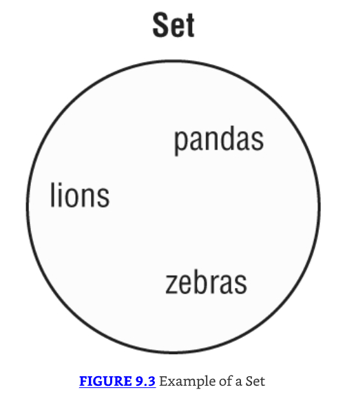
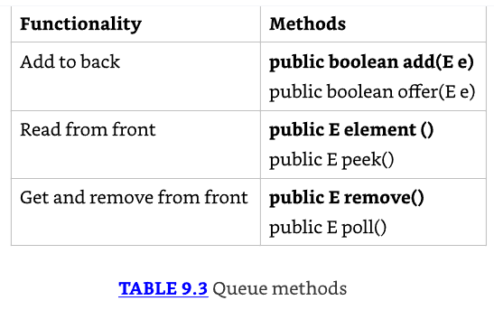
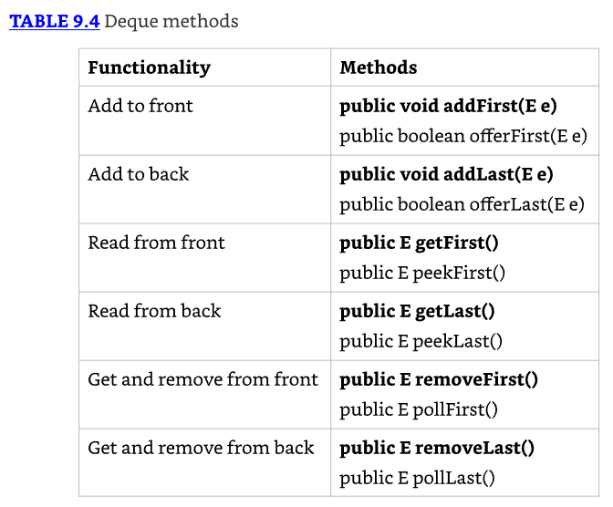
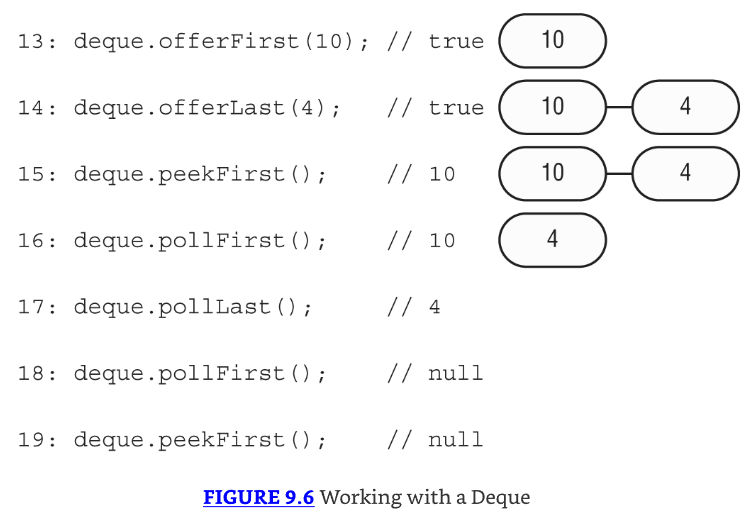
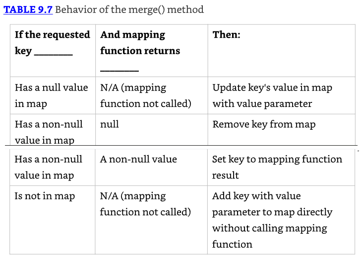

# Cap. 09 - Collections and Generics

## Usando la colección de API comunes

Una colección es un grupo de objetos contenidos en un único objeto. 

El Java Collections Framework es un conjunto de clases en `java.util` para almacenar colecciones.

El framework tiene cuatro interfaces principales:

* List (Lista):
  * Colección ordenada de elementos
  * Permite duplicados
  * Los elementos se acceden mediante un índice int
  * Ejemplo típico: mantener una lista de tareas donde el orden importa

* Set (Conjunto):
  * Colección que NO permite duplicados
  * No garantiza orden específico (depende de la implementación)
  * Útil cuando necesitas unicidad de elementos

* Queue (Cola):
  * Colección que ordena elementos en un orden específico para procesamiento
  * Normalmente FIFO (First-In-First-Out), pero puede variar
  * **Deque** es una sub interfaz que permite acceso en ambos extremos (como una cola de doble extremo)

* Map (Mapa):
  * NO implementa la interfaz Collection (detalle importante para el examen)
  * Mapea claves a valores
  * No permite claves duplicadas
  * Los elementos son par clave/valor
  * Es considerado parte del Collections Framework aunque técnicamente no sea una Collection 
    * Se tratan diferente porque necesitan métodos distintos debido a que trabajan con pares clave/valor, no con elementos individuales.


### Usando el operador diamante 

Inicialmente, al construir colecciones con generics, debes especificar el tipo:

```java
List<Integer> list = new ArrayList<Integer>();

// con anidamiento
Map<Long,List<Integer>> mapLists = new HashMap<Long,List<Integer>>();
```

El operador diamante (<>) es una notación abreviada que permite omitir el tipo genérico del lado derecho cuando puede inferirse:

* Se llama diamond operator porque <> parece un diamante
* Ambas declaraciones son equivalentes para el compilador
* La versión con `<>` es más corta y fácil de leer

```java
List<Integer> list = new ArrayList<>();
Map<Long,List<Integer>> mapOfLists = new HashMap<>();
```

El operador diamante NO puede usarse en el lado izquierdo de una declaración de variable. Solo en el lado derecho de una asignación.

```java
List<> list = new ArrayList<Integer>();  // DOES NOT COMPILE

class InvalidUse {
    void use(List<> data) {}  // DOES NOT COMPILE
}
```

### Agregando información

Método `add()`:
* Inserta un nuevo elemento en la Collection
* Retorna un boolean indicando si fue exitoso
* La firma del método es `public boolean add(E element)`
  * `E` representa el tipo genérico usado al crear la colección
* Para algunos tipos de Collection, `add()` siempre retorna `true`
* Para otros tipos, hay lógica sobre si la llamada fue exitosa

Ejemplo con List:

```java
3: Collection<String> list = new ArrayList<>();
4: System.out.println(list.add("Sparrow")); // true
5: System.out.println(list.add("Sparrow")); // true
```

Ejemplo con Set:

```java
7: Collection<String> set = new HashSet<>();
8: System.out.println(set.add("Sparrow")); // true
9: System.out.println(set.add("Sparrow")); // false
```

Diferencia:
* List permite duplicados → retorna `true` ambas veces
* Set NO permite duplicados → línea 9 retorna `false` al intentar agregar un duplicado

### Removiendo información

Método `remove()`:
* Remueve un único valor que coincida en la Collection
* Retorna un boolean indicando si fue exitoso
* La firma del método es `public boolean remove(Object object)`

Explicación: El valor boolean de retorno indica si se encontró y removió una coincidencia (solo remueve 1 por intento).

```java
3: Collection<String> birds = new ArrayList<>();
4: birds.add("hawk");  // [hawk]
5: birds.add("hawk");  // [hawk, hawk]
6: System.out.println(birds.remove("cardinal")); // false
7: System.out.println(birds.remove("hawk"));     // true
8: System.out.println(birds);                    // [hawk]
```

### Contando elementos

Métodos: `size()` y `isEmpty()`
* `size()` retorna el número de elementos en la Collection
* `isEmpty()` retorna `true` si la Collection no tiene elementos
* Su firma es:
  * `public int size()`
  * `public boolean isEmpty()`

```java
Collection<String> birds = new ArrayList<>();
System.out.println(birds.isEmpty()); // true
System.out.println(birds.size());    // 0
birds.add("hawk");                   // [hawk]
birds.add("hawk");                   // [hawk, hawk]

System.out.println(birds.isEmpty()); // false
System.out.println(birds.size());    // 2
```

### Limpiando colecciones

Método `clear()`:
* Proporciona una manera fácil de descartar todos los elementos de la Collection.
* Su firma es `public void clear()`

```java
Collection<String> birds = new ArrayList<>();
birds.add("hawk");                   // [hawk]
birds.add("hawk");                   // [hawk, hawk]
System.out.println(birds.isEmpty()); // false
System.out.println(birds.size());    // 2
birds.clear();                       // []
System.out.println(birds.isEmpty()); // true
System.out.println(birds.size());    // 0
```

Después de llamar `clear()`, birds vuelve a ser un ArrayList vacío de tamaño 0.

### Validando contenido

Método `contains()`:
* Verifica si un elemento específico está en la Collection
* Su firma es `public boolean contains(Object object)`
* Funcionamiento; el método `contains()` llama a `equals()` en los elementos del ArrayList para ver si hay coincidencias.

```java
Collection<String> birds = new ArrayList<>();
birds.add("hawk"); // [hawk]
System.out.println(birds.contains("hawk"));  // true
System.out.println(birds.contains("robin")); // false
```

### Removiendo con condiciones

Método `removeIf()`:
* Remueve todos los elementos que coinciden con una condición. 
* Podemos especificar qué debe eliminarse usando un bloque de código o incluso una referencia a método.
* Firma: `public boolean removeIf(Predicate<? super E> filter)`
  * Nota: La signatura parece así. (Se explica qué significa él `? super` más adelante en este capítulo)
* Funcionamiento; Usa un, `Predicate`, que toma un parámetro y retorna un boolean.

```java
4: Collection<String> list = new ArrayList<>();
5: list.add("Magician");
6: list.add("Assistant");
7: System.out.println(list);  // [Magician, Assistant]
8: list.removeIf(s -> s.startsWith("A"));
9: System.out.println(list);  // [Magician]
```

Explicación línea 8; Remueve todos los valores String que comienzan con la letra A.

```java
11: Collection<String> set = new HashSet<>();
12: set.add("Wand");
13: set.add("");
14: set.removeIf(String::isEmpty); // s -> s.isEmpty()
15: System.out.println(set);  // [Wand]
```

Explicación línea 14; Remueve todos los valores String que están vacíos usando una referencia a método.

### Iterando sobre colecciones

Método `forEach()`:
* Puedes llamarlo en una Collection en lugar de escribir un loop. Usa un Consumer que toma un único parámetro y no retorna nada.
* Firma: `public void forEach(Consumer<? super T> action)`

Ejemplo: A los gatos les gusta explorar, así que imprimamos dos de ellos usando tanto referencias a método como lambdas:

```java
Collection<String> cats = List.of("Annie", "Ripley");
cats.forEach(System.out::println);
cats.forEach(c -> System.out.println(c));
```

**Otras formas de iteración**

Hay otras maneras de iterar a través de una Collection cómo hacer loop a través de una lista usando un enhanced for loop.

```java
for (String element: coll)
    System.out.println(element);

// un enfoque más antiguo es: 
Iterator<String> iter = coll.iterator();
while(iter.hasNext()) {
String string = iter.next();
    System.out.println(string);
}
```

El método `hasNext()` verifica si hay un siguiente valor. En otras palabras, te dice si `next()` se ejecutará sin lanzar una excepción. 

El método `next()` realmente mueve el Iterator al siguiente elemento.

### Determinando igualdad

Implementación personalizada de equals():
* Permite comparar dos Collections y comparar el tipo y contenidos. La implementación varía. 
  * Por ejemplo, ArrayList verifica el orden, mientras que HashSet no.
* La firma es `public boolean equals(Object object)`

```java
23: var list1 = List.of(1, 2);
24: var list2 = List.of(2, 1);
25: var set1 = Set.of(1, 2);
26: var set2 = Set.of(2, 1);
27:
28: System.out.println(list1.equals(list2)); // false
29: System.out.println(set1.equals(set2));   // true
30: System.out.println(list1.equals(set1));  // false
```

* Línea 28 imprime false porque los elementos están en diferente orden, y una List se preocupa por el orden
* En contraste, línea 29 imprime true porque un Set no es sensible al orden
* Finalmente, línea 30 imprime false porque los tipos son diferentes

**Desempaquetando nulos**

Java nos protege de muchos problemas con Collections. Sin embargo, aún es posible escribir un NullPointerException:

```java
3: var heights = new ArrayList<Integer>();
4: heights.add(null);
5: int h = heights.get(0); // NullPointerException
```

* Línea 4: agregamos un null a la lista. Esto es legal porque una referencia null puede ser asignada a cualquier variable de referencia
* Línea 5: intentamos hacer unbox de ese `null` a un primitivo `int`. Esto es un problema
* Java intenta obtener el valor int de `null`. Como llamar cualquier método en null genera un `NullPointerException`, eso es justo lo que obtenemos

## Usando la interfaz List

Pasemos a interfaces específicas. Se usa una `list` cuando quieres una colección ordenada

En una lista de nombres puede contener duplicados, ya que dos animales pueden tener el mismo nombre. 
* Los elementos pueden ser recuperados e insertados en posiciones específicas en la lista basándose en un índice `int`, muy parecido a un `array`. 
* A diferencia de un array, sin embargo, muchas implementaciones de List pueden cambiar de tamaño después de ser declaradas.
* Uso común; Las listas se usan donde necesitas mantener un registro de una lista de objetos. 
  * Por ejemplo, podrías hacer una lista de lo que quieres ver en el zoológico: primero, ver los leones; segundo, ver los pandas y así sucesivamente.

* A veces no te importa el orden de elementos en una lista. List es como el tipo de datos "go to". 
* Cuando hacemos una lista de compras antes de ir a la tienda, el orden de la lista resulta ser el orden en el cual pensamos en los artículos. 
  * Probablemente, no estamos apegados a ese orden particular, pero no está haciendo daño.

### Comparando implementación de listas

ArrayList: Un ArrayList es como un array redimensionable. 
* Cuando se agregan elementos, el ArrayList crece automáticamente. Cuando no estás seguro qué colección usar, usa un ArrayList.
* El principal beneficio de un ArrayList es que puedes buscar cualquier elemento en tiempo constante. 
* Agregar o remover un elemento es más lento que acceder a un elemento. 
* Esto hace a un ArrayList una buena elección cuando estás leyendo más a menudo que (o la misma cantidad que) escribiendo al ArrayList.

LinkedList: Un LinkedList es especial porque implementa tanto List como Deque. 
* Tiene todos los métodos de una List. También tiene métodos adicionales para facilitar agregar o remover desde el principio y/o fin de la lista.
* Los principales beneficios de una LinkedList son que puedes acceder, agregar y remover desde el principio y fin de la lista en tiempo constante. 
* El trade-off es que tratar con un índice arbitrario toma tiempo lineal. 
* Esto hace a una LinkedList una buena elección cuando la usarás como Deque. 

### Creating una lista con Factory

Cuando creas una `List` de tipo ArrayList o LinkedList, conoces el tipo. 

Hay unos pocos métodos especiales donde obtienes una List de vuelta, pero no conoces el tipo. 

Estos métodos te permiten crear una List incluyendo datos en una línea usando un factory method. 

Esto es conveniente, especialmente cuando haces testing. 

Algunos de estos métodos retornan un immutable object. 

Como vimos en Chapter 6, "Class Design," un immutable object no puede ser cambiado o modificado. 


```java
16: String[] array = new String[] {"a", "b", "c"};
17: List<String> asList = Arrays.asList(array); // [a, b, c]
18: List<String> of = List.of(array);           // [a, b, c]
19: List<String> copy = List.copyOf(asList);    // [a, b, c]
20:
21: array[0] = "z";
22:
23: System.out.println(asList);  // [z, b, c]
24: System.out.println(of);      // [a, b, c]
25: System.out.println(copy);    // [a, b, c]
26:
27: asList.set(0, "x");
28: System.out.println(Arrays.toString(array)); // [x, b, c]
29:
30: copy.add("y");  // UnsupportedOperationException
```

* Línea 17 crea una List que está respaldada por un array
* Línea 21 cambia el array, y línea 23 refleja ese cambio
* Líneas 27 y 28 muestran la otra dirección donde cambiar la List actualiza el array subyacente
* Líneas 18 y 19 crean una immutable List
* Línea 30 muestra que es immutable al lanzar una excepción cuando se intenta agregar un valor
* Las tres listas lanzarían una excepción al agregar o remover un valor. Las listas of y copy también lanzarían una al intentar actualizar un elemento

### Creando una lista con un constructor

La mayoría de `Collections` tienen dos constructores. Lo siguiente los muestra para `LinkedList`:

```java
var linked1 = new LinkedList<String>();
var linked2 = new LinkedList<String>(linked1);
```

* El primero dice crear una LinkedList vacía conteniendo todos los defaults
* El segundo le dice a Java que queremos hacer una copia de otra LinkedList
* Dado que linked1 está vacío en este ejemplo, no es particularmente interesante

ArrayList tiene un constructor extra que necesitas conocer. Ahora mostramos los tres constructores:

```java
var list1 = new ArrayList<String>();
var list2 = new ArrayList<String>(list1);
var list3 = new ArrayList<String>(10);}
```

* Los primeros dos son los constructores comunes que necesitas conocer para todas las Collections. 
* El ejemplo final dice crear un ArrayList conteniendo un número específico de slots, pero nuevamente no asignar ninguno. 
* Puedes pensar en esto como el tamaño del array subyacente.

**Usando var con ArrayList**

Primer ejemplo - var con generics:
Considera este código, que mezcla var y generics:

```java
var strings = new ArrayList<String>();
strings.add("a");
for (String s: strings) { }
```

El tipo de var es `ArrayList<String>`. Esto significa que puedes agregar un String o hacer loop a través de los objetos String. 

¿Qué pasa si usamos el diamond operator con var?

```java
var list = new ArrayList<>();
```

Esto compila. El tipo del var es `ArrayList<Object>`. 

Como no hay un tipo especificado para él `generic`, Java tiene que asumir la última superclase. 

Esto es un poco tonto e inesperado, así que por favor no lo escribas. Pero si lo ves en el examen, sabrás qué esperar. 

```java
var list = new ArrayList<>();
list.add("a");
for (String s: list) { } // DOES NOT COMPILE
```

El tipo de var es `ArrayList<Object>`. Como no hay un tipo en el diamond operator, Java tiene que asumir la opción genérica más amplia que puede. 

Por lo tanto, elige `Object`, la última superclase. Agregar un String a la lista está bien. 

Puedes agregar cualquier subclase de Object. Sin embargo, en el loop, necesitamos usar el tipo Object en lugar de String.

### Trabajando con métodos de List

Los métodos en la interfaz List son para trabajar con índices. Además de los métodos heredados de Collection


Los siguientes statements demuestran la mayoría de estos métodos para trabajar con una List:

```java
3: List<String> list = new ArrayList<>();
4: list.add("SD");          // [SD]
5: list.add(0, "NY");       // [NY,SD]
6: list.set(1, "FL");       // [NY,FL]
7: System.out.println(list.get(0)); // NY
8: list.remove("NY");       // [FL]
9: list.remove(0);          // []
10: list.set(0, "?");       // IndexOutOfBoundsException
```

* Línea 3, list comienza vacía. 
* Línea 4 agrega un elemento al final de la lista. 
* Línea 5 agrega un elemento en index 0 que empuja el original index 0 a index 1. Nota cómo el ArrayList es ahora automáticamente uno más grande. 
* Línea 6 reemplaza el elemento en index 1 con un nuevo valor.
* Línea 7 usa el método `get()` para imprimir el elemento en un índice específico. 
* Línea 8 remueve el elemento que coincide con NY. 
* Finalmente, línea 9 remueve el elemento en index 0, y list está vacía de nuevo.
* Línea 10 lanza un `IndexOutOfBoundsException` porque no hay elementos en la List. Como no hay elementos para reemplazar, incluso el index 0 no está permitido. 
* Si línea 10 se moviera entre líneas 4 y 5, la llamada tendría éxito.

**Nota sobre LinkedList:** El output sería el mismo si intentaras estos ejemplos con LinkedList. 
Aunque el código sería menos eficiente, no sería notorio hasta que tuvieras listas muy grandes.

Método `replaceAll()`:
Ahora veamos el método `replaceAll()`. Usa un **UnaryOperator** que toma un parámetro y retorna un valor del mismo tipo:

```java
var numbers = Arrays.asList(1, 2, 3);
numbers.replaceAll(x -> x*2);
System.out.println(numbers); // [2, 4, 6]
```

Esta lambda duplica el valor de cada elemento en la lista. El método `replaceAll()` llama a la lambda en cada elemento de la lista y reemplaza el valor en ese índice.

**Método `remove()` sobrecargado**

* Hemos visto ahora dos métodos `remove()` sobrecargados. El de Collection remueve un objeto que coincide con el parámetro. 
* En contraste, el de List remueve un elemento en un índice especificado.

Problema con tipo Integer:
Esto se vuelve complicado cuando tienes un tipo Integer. ¿Qué crees que imprime lo siguiente?

```java
31: var list = new LinkedList<Integer>();
32: list.add(3);
33: list.add(2);
34: list.add(1);
35: list.remove(2);
36: list.remove(Integer.valueOf(2));
37: System.out.println(list);
```

* La respuesta correcta es [3]. Veamos cómo llegamos ahí. 
* Al final de línea 34, tenemos [3, 2, 1]. Línea 35 pasa un primitivo, lo que significa que estamos solicitando eliminación del elemento en index 2. 
* Esto nos deja con [3, 2]. Luego línea 36 pasa un objeto Integer, lo que significa que estamos eliminando el valor 2. Eso nos lleva a que quede [3].

* Cuando se llama a `remove()` con un `int` usa el índice, un índice que no existe lanzará una excepción. 
* Por ejemplo, list.remove(100) lanza un `IndexOutOfBoundsException`.

### Convirtiendo de una lista a un array

Como un array puede ser pasado como `vararg`, la tabla 9.1 cubrió cómo convertir un array a una List. 
Veamos como convertir una List en un array:

```java
13: List<String> list = new ArrayList<>();
14: list.add("hawk");
15: list.add("robin");
16: Object[] objectArray = list.toArray();
17: String[] stringArray = list.toArray(new String[0]);
18: list.clear();
19: System.out.println(objectArray.length);  // 2
20: System.out.println(stringArray.length);  // 2
```

* Línea 16 muestra que una List sabe cómo convertirse a sí misma en un array. 
* El único problema es que por defecto resulta en un array de clase Object. Esto usualmente no es lo que quieres. 
* Línea 17 especifica el tipo del array y hace lo que queremos. 
* La ventaja de especificar un tamaño de 0 para el parámetro es que Java creará un nuevo array del tamaño apropiado para el valor de retorno. 
* Si gustas, puedes sugerir un array más grande para ser usado en su lugar. 
* Si la List cabe en ese array, será retornado. De lo contrario, se creará un nuevo array.
* También, nota que línea 18 limpia la List original. Esto no afecta a ninguno de los arrays. 
* El array es un objeto recién creado sin relación con la List original. Es simplemente una copia.

## Usando la interfaz Set

* Usas un `Set` cuando no quieres permitir entradas duplicadas. 
* Tampoco es importante el orden de los elementos en un Set.



### Comparando implementaciones de Set

`HashSet`:
* Un HashSet almacena sus elementos en una hash table, lo que significa que las claves son un hash y los valores son un Object. 
* Esto significa que el HashSet usa el método `hashCode()` de los objetos para recuperarlos más eficientemente. 
* Recuerda que un `hashCode()` válido no significa que cada objeto obtendrá un valor único, pero el método a menudo está escrito de manera que los valores hash se distribuyan sobre un rango amplio para reducir colisiones.
* El principal beneficio es que agregar elementos y verificar si un elemento está en el set ambos tienen tiempo constante. 
* El trade-off es que pierdes el orden en el cual insertaste los elementos. La mayoría del tiempo, no te preocupa esto en un Set de todas formas, haciendo al HashSet el set más común.

`TreeSet`:
* Un TreeSet almacena sus elementos en una estructura de árbol ordenado. 
* El principal beneficio es que el set está siempre en orden ordenado. 
* El trade-off es que agregar y verificar si un elemento existe toma más tiempo que con un HashSet, especialmente a medida que el árbol crece.


### Trabajando con métodos Set

Como una `List`, puedes crear un `Set` inmutable en una línea o hacer una copia de uno existente.

```java
Set<Character> letters = Set.of('z', 'o', 'o');
Set<Character> copy = Set.copyOf(letters);
```

Tienes que saber cómo los sets se comportan con respecto a los métodos tradicionales de Collection. 

Comencemos con HashSet:

```java
3: Set<Integer> set = new HashSet<>();
4: boolean b1 = set.add(66);  // true
5: boolean b2 = set.add(10);  // true
6: boolean b3 = set.add(66);  // false
7: boolean b4 = set.add(8);   // true
8: set.forEach(System.out::println);
```

**Output:**
Este código imprime tres líneas:
```
66
8
10
```

* Los métodos `add()` son directos. Retornan `true` a menos que el Integer ya esté en él `set`. 
* Línea 6 retorna `false`, porque ya tenemos 66 en él `set`, y un `set` debe preservar unicidad. 
* Línea 8 imprime los elementos del `set` en un orden arbitrario. 
* En este caso, resulta no ser ni orden ordenado ni el orden en el cual agregamos los elementos.

* Recuerda que el método `equals()` se usa para determinar igualdad. 
* El método `hashCode()` se usa para saber en qué bucket buscar de manera que Java no tenga que buscar a través de todo el set para averiguar si un objeto está ahí. 
* El mejor caso es que los hashcode sean únicos y Java tenga que llamar a `equals()` solo en un objeto. 
* El peor caso es que todas las implementaciones retornen el mismo `hashCode()` y Java tenga que llamar a `equals()` en cada elemento del set de todas formas.

Comencemos con TreeSet:

```java
3: Set<Integer> set = new TreeSet<>();
4: boolean b1 = set.add(66);  // true
5: boolean b2 = set.add(10);  // true
6: boolean b3 = set.add(66);  // false
7: boolean b4 = set.add(8);   // true
8: set.forEach(System.out::println);
```

**Output:**

Esta vez, el código imprime lo siguiente:
```
8
10
66
```

* El texto menciona que los elementos se imprimen en su orden natural ordenado. 
* Los números implementan la interfaz `Comparable` en Java, usada para ordenamiento. 

## Usando las interfaces Queue y Deque

* Se usa una Queue cuando los elementos se agregan y remueven en un orden específico. 
* Se puede pensar en una cola como una línea. Por ejemplo, al entrar a un estadio y alguien está esperando en la fila, te pones detrás de esa persona. 
* Esta es una cola FIFO (first-in, first-out).
* Una Deque (cola de doble extremo), pronunciada "deck", es diferente de una cola regular en la que puedes insertar y remover elementos tanto del frente (head) como de la parte trasera (tail). 


### Comparando implementaciones de Deque

* Se vio `LinkedList` anteriormente en la sección de List. Además de ser una lista, es una Deque. 
* El beneficio principal de una `LinkedList` es que implementa tanto las interfaces List como Deque. 
* El trade-off es que no es tan eficiente como una cola "pura". 
* Puedes usar la clase `ArrayDeque` si no necesitas los métodos de List.

### Trabajando con métodos Deque y Queue 

* La interfaz Queue contiene seis métodos, mostrados en la Tabla 9.3. 
* Hay tres piezas de funcionalidad y versiones de los métodos que lanzan una excepción o usan el tipo de retorno, como `null`, para toda la información. 



```java
4: Queue<Integer> queue = new LinkedList<>();
5: queue.add(10);
6: queue.add(4);
7: System.out.println(queue.remove()); // 10
8: System.out.println(queue.peek());   // 4
```

* Las líneas 5 y 6 agregan elementos a la cola. 
* La línea 7 solicita que el primer elemento esperando más tiempo salga de la cola. 
* La línea 8 verifica la siguiente entrada en la cola mientras la deja en su lugar.

* A continuación, pasamos a la interfaz Deque. 
* Dado que la interfaz Deque soporta colas de doble extremo, hereda todos los métodos de Queue y agrega más para que esté claro si estamos trabajando con el frente o la parte trasera de la cola. 
* La Tabla 9.4 muestra los métodos cuando se usa como una cola de doble extremo.



Intentemos un ejemplo que trabaje con ambos extremos de la cola:

```java
Deque<Integer> deque = new LinkedList<>();
```



* Las líneas 13 y 14 agregan exitosamente un elemento al frente y atrás de la cola, respectivamente. 
* Algunas colas están limitadas en tamaño, lo que causaría que ofrecer un elemento a la cola falle. 
* La línea 15 mira el primer elemento en la cola, pero no lo remueve. 
* Las líneas 16 y 17 remueven los elementos de la cola, uno de cada extremo. Esto resulta en una cola vacía. 
* Las líneas 18 y 19 intentan mirar el primer elemento de la cola, lo que resulta en `null`.

* Además de las colas FIFO, existen colas LIFO (last-in, first-out), que comúnmente se denominan **stacks**. 
* Imagina una pila de platos. Siempre agregas o remueves desde la parte superior de la pila para evitar un desastre. 
* Afortunadamente, podemos usar las mismas implementaciones de cola de doble extremo. 
* Se usan diferentes métodos para mayor claridad, como se muestra en la Tabla 9.5.


Intentemos otro usando la Deque como stack:

```java
Deque<Integer> stack = new ArrayDeque<>();
```


* Esta vez, la Figura 9.7 muestra cómo se ve el stack en cada paso del código. 
* Las líneas 13 y 14 colocan exitosamente un elemento en el frente/top del stack. 
* El código restante mira el frente también.

* Al usar una Deque, es realmente importante determinar si se está usando como una cola FIFO, un stack LIFO, o una cola de doble extremo. 
* Para revisar, una cola FIFO es como una línea de personas. Entras por atrás y sales por el frente. 
* Un stack LIFO es como una pila de platos. Pones el plato en la parte superior y lo sacas de la parte superior. 
* Una cola de doble extremo usa ambos extremos.

## Usando la interfaz Map

* Usas un Map cuando quieres identificar valores por una clave. 
* Por ejemplo, cuando usas la lista de contactos en tu teléfono, buscas "George" en lugar de revisar cada número telefónico por turno.
* No necesitas conocer los nombres de las interfaces específicas que los diferentes maps implementan, pero sí necesitas saber que `TreeMap` es ordenado.
* La cosa principal que todas las clases `Map` tienen en común es que tienen claves y valores. 


**`Map.of()` y `Map.copyOf()`**

Así como `List` y `Set`, existe un método factory para crear un `Map`. Pasas cualquier número de pares de claves y valores.

```java
Map.of("key1", "value1", "key2", "value2");
```

A diferencia de List y Set, esto es menos que ideal.
Pasar claves y valores es más difícil de leer porque tienes que mantener registro de qué parámetro es cuál. 
Afortunadamente, existe una mejor manera. Map también proporciona un método que te permite suministrar pares clave/valor.

```java
Map.ofEntries(
   Map.entry("key1", "value1"),
   Map.entry("key2", "value2"));
```

* Ahora no podemos olvidar pasar un valor. 
* Si omitimos un parámetro, el método `entry()` no compilará. 
* Convenientemente, `Map.copyOf(map)` funciona igual que los métodos `copyOf()` de las interfaces `List` y `Set`.

### Comparando implementaciones de Map

* Un `HashMap` almacena las claves en una tabla hash. 
* Esto significa que usa el método `hashCode()` de las claves para recuperar sus valores de manera más eficiente.
* El beneficio principal es que agregar elementos y recuperar el elemento por clave ambos tienen tiempo constante. 
* El trade-off es que pierdes el orden en el cual insertaste los elementos. 
* La mayoría del tiempo, no te preocupa esto en un map de todas formas. 
* Si lo estuvieras, podrías usar `LinkedHashMap`.
* Un `TreeMap` almacena las claves en una estructura de árbol ordenado. 
* El beneficio principal es que las claves están siempre en orden ordenado. 
* Al igual que un `TreeSet`, el trade-off es que agregar y verificar si una clave está presente toma más tiempo a medida que el árbol crece más grande.

### Trabajando con métodos Map

* Dado que Map no extiende Collection, más métodos están especificados en la interfaz Map. 
* Debido a que hay tanto claves como valores, necesitamos parámetros de tipo genérico para ambos. 
* La clase usa K para clave y V para valor. 


### Llamando a métodos básicos

Comencemos comparando el mismo código con dos tipos de Map. Primero está `HashMap`:

```java
Map<String, String> map = new HashMap<>();
map.put("koala", "bamboo");
map.put("lion", "meat");
map.put("giraffe", "leaf");
String food = map.get("koala"); // bamboo
for (String key: map.keySet())
  System.out.print(key + ","); // koala,giraffe,lion,
```

* Aquí usamos el método `put()` para agregar pares clave/valor al map y `get()` para obtener un valor dada una clave. 
* También usamos el método `keySet()` para obtener todas las claves.
* Java usa el `hashCode()` de la clave para determinar el orden.

Ahora veamos `TreeMap`:

```java
Map<String, String> map = new TreeMap<>();
map.put("koala", "bamboo");
map.put("lion", "meat");
map.put("giraffe", "leaf");
String food = map.get("koala"); // bamboo
for (String key: map.keySet())
  System.out.print(key + ","); // giraffe,koala,lion,
```

* En `TreeMap` se ordena las claves como esperaríamos. 
* Si llamáramos `values()` en lugar de `keySet()`, el orden de los valores correspondería al orden de las claves.

Con nuestro mismo map, podemos intentar algunas verificaciones booleanas:

```java
System.out.println(map.contains("lion")); // DOES NOT COMPILE
System.out.println(map.containsKey("lion")); // true
System.out.println(map.containsValue("lion")); // false
System.out.println(map.size()); // 3
map.clear();
System.out.println(map.size()); // 0
System.out.println(map.isEmpty()); // true
```

* La primera línea es un poco complicada. El método `contains()` está en la interfaz Collection pero no en la interfaz Map. 
* Las siguientes dos líneas muestran que las claves y valores se verifican por separado. 
* Podemos ver que hay tres pares clave/valor en nuestro map. Luego limpiamos el contenido del map y vemos que hay cero elementos y está vacío.

### Iterando a través de Map

* Viste el método `forEach()` anteriormente en el capítulo. 
* Esta vez, la lambda usada por el método `forEach()` tiene dos parámetros: la clave y el valor. 

```java
Map<Integer, Character> map = new HashMap<>();
map.put(1, 'a');
map.put(2, 'b');
map.put(3, 'c');
map.forEach((k, v) -> System.out.println(v));
```

* La lambda tiene tanto la clave como el valor como parámetros. 
* Resulta que imprime el valor, pero podría hacer cualquier cosa con la clave y/o valor. 

Dado que no nos importa la clave, este código en particular podría haber sido escrito con el método `values()` y una referencia a método en su lugar.

```java
map.values().forEach(System.out::println);
```

Otra manera de recorrer todos los datos en un `map` es obtener los pares clave/valor en un `Set`. 

Java tiene una interfaz estática dentro de `Map` llamada `Entry`. Proporciona métodos para obtener la clave y el valor de cada par.

```java
map.entrySet().forEach(e ->
  System.out.println(e.getKey() + " " + e.getValue()));
```

### Obteniendo valores de forma segura

* El método `get()` retorna `null` si la clave solicitada no está en él `map`. 
* Afortunadamente, el método `getOrDefault()` hace esto fácil. Comparemos los dos métodos:

```java
3: Map<Character, String> map = new HashMap<>();
4: map.put('x', "spot");
5: System.out.println("X marks the " + map.get('x'));
6: System.out.println("X marks the " + map.getOrDefault('x', ""));
7: System.out.println("Y marks the " + map.get('y'));
8: System.out.println("Y marks the " + map.getOrDefault('y', ""));

// X marks the spot
// X marks the spot
// Y marks the null
// Y marks the
```

* Como puedes ver, las líneas 5 y 6 tienen la misma salida porque `get()` y `getOrDefault()` se comportan de la misma manera cuando la clave está presente.
* Retornan el valor mapeado por esa clave. Las líneas 7 y 8 dan salida diferente, mostrando que `get()` retorna `null` cuando la clave no está presente.
* Por el contrario, `getOrDefault()` retorna el string vacío que pasamos como parámetro.

### Reemplazando valores

Estos métodos son similares a la versión de `List`, excepto que una clave está involucrada:

```java
21: Map<Integer, Integer> map = new HashMap<>();
22: map.put(1, 2);
23: map.put(2, 4);
24: Integer original = map.replace(2, 10); // 4
25: System.out.println(map); // {1=2, 2=10}
26: map.replaceAll((k, v) -> k + v);
27: System.out.println(map); // {1=3, 2=12}
```

* La línea 24 reemplaza el valor para la clave 2 y retorna el valor original. 
* La línea 26 llama una función y establece el valor de cada elemento del `map` al resultado de esa función. En nuestro caso, sumamos la clave y el valor juntos.

### Poniendo lo ausente

El método `putIfAbsent()` establece un valor en él `map`, pero lo omite si el valor ya está establecido a un valor `no-null`.

```java
Map<String, String> favorites = new HashMap<>();
favorites.put("Jenny", "Bus Tour");
favorites.put("Tom", null);
favorites.putIfAbsent("Jenny", "Tram");
favorites.putIfAbsent("Sam", "Tram");
favorites.putIfAbsent("Tom", "Tram");
System.out.println(favorites); // {Tom=Tram, Jenny=Bus Tour, Sam=Tram}
```

* Como puedes ver, el valor de Jenny no se actualiza porque uno ya estaba presente. 
* Sam no estaba allí, así que fue agregado. 
* Tom estaba presente como clave, pero tenía un valor `null`. Por lo tanto, fue agregado también.

### Uniendo data

* El método `merge()` agrega lógica de qué elegir. Supongamos que queremos elegir el viaje con el nombre más largo. 
* Podemos escribir código para expresar esto pasando una función de mapeo al método `merge()`:

```java
11: BiFunction<String, String, String> mapper = (v1, v2)
12:   -> v1.length() > v2.length() ? v1 : v2;
13:
14: Map<String, String> favorites = new HashMap<>();
15: favorites.put("Jenny", "Bus Tour");
16: favorites.put("Tom", "Tram");
17:
18: String jenny = favorites.merge("Jenny", "Skyride", mapper);
19: String tom = favorites.merge("Tom", "Skyride", mapper);
20:
21: System.out.println(favorites); // {Tom=Skyride, Jenny=Bus Tour}
22: System.out.println(jenny);  // Bus Tour
23: System.out.println(tom);    // Skyride
```

* El código en las líneas 11 y 12 toma dos parámetros y retorna un valor. Nuestra implementación retorna el que tiene el nombre más largo. 
* La línea 18 llama esta función de mapeo, y ve que Bus Tour es más largo que Skyride, así que deja el valor como Bus Tour. 
* La línea 19 llama esta función de mapeo nuevamente. Esta vez, Tram es más corto que Skyride, así que el map se actualiza. 
* La línea 21 imprime el contenido del nuevo mapa. Las líneas 22 y 23 muestran que el resultado se devuelve desde `merge()`.

* El método `merge()` también tiene lógica para qué sucede si valores nulos o claves faltantes están involucradas. 
* En este caso, no llama a la `BiFunction` en absoluto, y simplemente usa el nuevo valor.

```java
BiFunction<String, String, String> mapper =
    (v1, v2) -> v1.length() > v2.length() ? v1 : v2;
Map<String, String> favorites = new HashMap<>();
favorites.put("Sam", null);
favorites.merge("Tom", "Skyride", mapper);
favorites.merge("Sam", "Skyride", mapper);
System.out.println(favorites); // {Tom=Skyride, Sam=Skyride}
```

* Observa que la función de mapeo no se llama. Si lo fuera, tendríamos una `NullPointerException`. 
* La función de mapeo se usa solo cuando hay dos valores reales para decidir entre ellos.
* Lo último a saber sobre `merge()` es qué sucede cuando la función de mapeo se llama y devuelve `null`. La clave se elimina del mapa cuando esto sucede:

```java
BiFunction<String, String, String> mapper = (v1, v2) -> null;
Map<String, String> favorites = new HashMap<>();
favorites.put("Jenny", "Bus Tour");
favorites.put("Tom", "Bus Tour");

favorites.merge("Jenny", "Skyride", mapper);
favorites.merge("Sam", "Skyride", mapper);
System.out.println(favorites); // {Tom=Bus Tour, Sam=Skyride}
```

* Tom se dejó solo, ya que no hubo llamada a `merge()` para esa clave. 
* Sam se agregó, ya que esa clave no estaba en la lista original. 
* Jenny fue eliminada porque la función de mapeo devolvió `null`.



## Comparando tipos de Collection

Concluimos esta sección con una revisión de todas las clases de colección.


Las estructuras de datos que involucran ordenamiento no permiten valores nulos.

**Colecciones viejas**

* Hay algunas colecciones que ya no están en el examen, pero que podrías encontrar en código más antiguo. 
* Las tres fueron estructuras de datos tempranas de Java que podrías usar con hilos:

* Vector: Implements List.
* Hashtable: Implements Map.
* Stack: Implements Queue.

Estas clases se usan raramente ahora, ya que hay alternativas concurrentes mucho mejores que cubrimos en Chapter 13.

## Ordenando Data

Discutimos "orden" para las clases `TreeSet` y `TreeMap`. Para números, el orden es obvio orden numérico. 
Para objetos String, el orden se define según el mapeo de caracteres Unicode.

* Cuando trabajas con un String, recuerda que los números se ordenan antes que las letras, y las letras en mayúsculas se ordenan antes que las letras en minúsculas.
* Usamos `Collections.sort()` en muchos de estos ejemplos. Devuelve void porque el parámetro del método es lo que se ordena.
* También puedes ordenar objetos que creas tú mismo. Java proporciona una interfaz llamada `Comparable`. 
* Si tu clase implementa `Comparable`, puede usarse en estructuras de datos que requieren comparación. 
* También hay una clase llamada `Comparator`, que se usa para especificar que quieres usar un orden diferente al que el objeto mismo proporciona.
* El elemento `Comparable` y `Comparator` son lo suficientemente similares como para ser complicados. 

### Creando una clase Comparable 

La interfaz Comparable tiene solo un método. De hecho, esta es la interfaz completa:

```java
public interface Comparable<T> {
    int compareTo(T o);
}
```

* El genérico **T** te permite implementar este método y especificar el tipo de tu objeto. 
* Esto te permite evitar un cast al implementar `compareTo()`. Cualquier objeto puede ser Comparable. 
* Por ejemplo, tenemos un grupo de patos y queremos ordenarlos por nombre. 
* Primero, actualizamos la declaración de la clase para heredar `Comparable<Duck>`, y luego implementamos el método `compareTo()`:

```java
import java.util.*;
public class Duck implements Comparable<Duck> {
    private String name;
    public Duck(String name) {
        this.name = name;
    }
    public String toString() {  // use readable output
        return name;
    }
    public int compareTo(Duck d) {
        return name.compareTo(d.name); // sorts ascendingly by name
    }
    public static void main(String[] args) {
        var ducks = new ArrayList<Duck>();
        ducks.add(new Duck("Quack"));
        ducks.add(new Duck("Puddles"));
        Collections.sort(ducks);  // sort by name
        System.out.println(ducks);  // [Puddles, Quack]
    }
}
```

* Sin implementar esa interfaz, todo lo que tendríamos es un método llamado `compareTo()`, pero no sería un objeto Comparable. 
* También podríamos implementar `Comparable<Object> `o alguna otra clase para **T**, pero esto no sería tan útil para ordenar un grupo de objetos Duck.

La clase Duck sobrescribe el método toString() de Object. Este override proporciona una salida útil al imprimir patos. Sin este override, 
la salida sería algo como [Duck@70dea4e, Duck@5c647e05] apenas útil para ver qué nombre de pato viene primero.

La clase Duck implementa `compareTo()`. Como Duck está comparando objetos de tipo String y la clase String ya tiene un método `compareTo()`, puede simplemente delegar.
Todavía necesitamos saber qué devuelve el método `compareTo()` para que podamos escribir el nuestro. Hay tres reglas que conocer:

* El número 0 se devuelve cuando el objeto actual es equivalente al argumento de `compareTo()`.
* Un número negativo (menor que 0) se devuelve cuando el objeto actual es más pequeño que el argumento de `compareTo()`.
* Un número positivo (mayor que 0) se devuelve cuando el objeto actual es más grande que el argumento de `compareTo()`.

Veamos una implementación de `compareTo()` que compara números en lugar de objetos String:

working with generics
summary