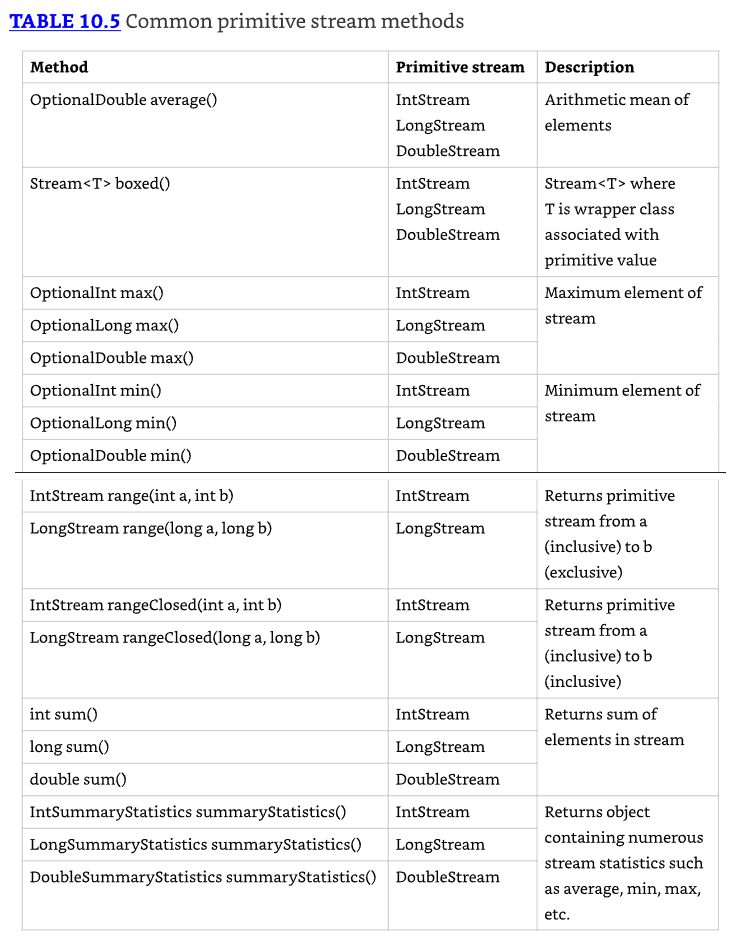
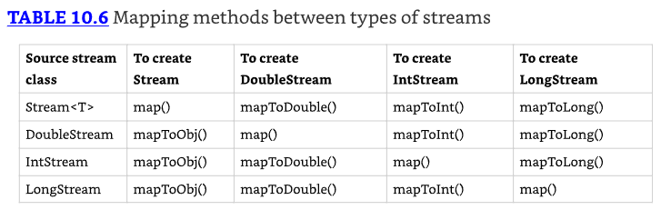
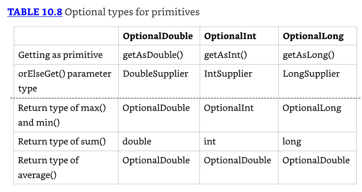

# Streams

## Retornando un Optional

* ¿Cómo expresamos esta respuesta "no sabemos" o "no aplicable" en Java?
* Usamos el tipo Optional. Un Optional se crea usando una factory. 
* Puedes solicitar un Optional vacío o pasar un valor para que el Optional lo envuelva. 
* Piensa en un Optional como una caja que podría tener algo dentro o podría estar vacía. Figure 10.1 muestra ambas opciones.


### Creando un Optional

Así es cómo codificar nuestro método average:

```java
10: public static Optional<Double> average(int... scores) {
11:   if(scores.length == 0) return Optional.empty();
12:   int sum = 0;
13:   for(int score: scores) sum += score;
14:   return Optional.of((double) sum / scores.length);
15: }
```

* La línea 11 retorna un Optional vacío cuando no podemos calcular un promedio. 
* Las líneas 12 y 13 suman las calificaciones. 
* De hecho, el método completo podría escribirse en una línea, pero eso no te enseñaría cómo funciona Optional. 
* La línea 14 crea un Optional para envolver el promedio.

Llamar al método muestra qué hay en nuestras dos cajas:

```java
System.out.println(average(90, 100)); // Optional[95.0]
System.out.println(average());        // Optional.empty
```

* Puedes ver que un Optional contiene un valor y el otro está vacío. 
* Normalmente, queremos verificar si un valor está presente y/o sacarlo de la caja. Aquí hay una manera de hacer eso:

```java
Optional<Double> opt = average(90, 100);
if(opt.isPresent())
  System.out.println(opt.get()); // 95.0
```

* Primero verificamos si el Optional contiene un valor. Luego lo imprimimos. 
* ¿Qué pasa si no hiciéramos la verificación, y el Optional estuviera vacío?

```java
Optional<Double> opt = average();
System.out.println(opt.get()); // NoSuchElementException
```

Obtendríamos una excepción, ya que no hay valor dentro del Optional.

`java.util.NoSuchElementException: No value present`

Al crear un Optional, es común querer usar `empty()` cuando el valor es `null`. 
Puedes hacer esto con un if statement o un operador ternario. 
Usamos el operador ternario `(? :)` para simplificar el código.

```java
Optional o = (value == null) ? Optional.empty() : Optional.of(value);
```

Si value es `null`, o se asigna el Optional vacío. De lo contrario, envolvemos el valor. 
Como este es un patrón tan común, Java proporciona un método factory para hacer lo mismo.

```java
Optional o = Optional.ofNullable(value);
```


* Los otros métodos te permiten escribir código que usa un `Optional` en una línea sin tener que usar el operador ternario. 
* En lugar de usar un `if statement`, que usamos cuando verificamos el average anteriormente, podemos especificar un `Consumer` para ejecutar cuando hay un valor dentro del `Optional`. 
* Cuando no lo hay, el método simplemente salta ejecutar él `Consumer`.

```java
Optional<Double> opt = average(90, 100);
opt.ifPresent(System.out::println);
```

`ifPresent()` expresa mejor la intención: ejecutar algo si un valor está presente. Es como un if sin else.

### Tratando con un Empty Optional (opcional vacío)

Los métodos restantes permiten especificar qué hacer si un valor NO está presente. Hay varias opciones. 
Las primeras dos permiten especificar un valor de retorno directamente o usando un `Supplier`.

```java
30: Optional<Double> opt = average();
31: System.out.println(opt.orElse(Double.NaN));
32: System.out.println(opt.orElseGet(() -> Math.random()));

// impime algo como
// NaN
// 0.3746499180811058
```

* La línea 31 muestra que puedes retornar un valor específico o variable. En este caso, imprimimos el valor "not a number". 
* La línea 32 muestra usar un `Supplier` para generar un valor en runtime para retornar. 

Alternativamente, podemos hacer que el código lance una excepción si el Optional está vacío.

```java
30: Optional<Double> opt = average();
31: System.out.println(opt.orElseThrow());

// arrojando algo como:
// Exception in thread "main" java.util.NoSuchElementException: No value present at java.base/java.util.Optional.orElseThrow(Optional.java:382)
```

* Sin especificar un `Supplier` para la excepción, Java lanzará una `NoSuchElementException`. 
* Alternativamente, podemos hacer que el código lance una excepción personalizada si él `Optional` está vacío. 
* Recuerda que el stack trace se ve extraño porque las lambdas se generan como clases en lugar de clases con nombre.

```java
30: Optional<Double> opt = average();
31: System.out.println(opt.orElseThrow(
32: () -> new IllegalStateException()));

// arrojando algo como:
// Exception in thread "main" java.lang.IllegalStateException at optionals.Methods.lambda$orElse$1(Methods.java:31) at java.base/java.util.Optional.orElseThrow(Optional.java:408)
```

* La línea 32 muestra usar un `Supplier` para crear una excepción que debería ser lanzada. 
* Nota que no escribimos `throw new IllegalStateException()`. El método `orElseThrow()` se encarga de realmente lanzar la excepción cuando lo ejecutamos.

Los dos métodos que toman un Supplier tienen nombres diferentes. ¿Ves por qué este código no compila?

```java
System.out.println(opt.orElseGet(
  () -> new IllegalStateException())); // DOES NOT COMPILE
```

* La variable `opt` es un `Optional<Double>`. Esto significa que el Supplier debe retornar un `Double`. 
* Ya que este `Supplier` retorna una excepción, el tipo no coincide.

El último ejemplo con `Optional` es realmente fácil. ¿Qué crees que hace esto?

```java
Optional<Double> opt = average(90, 100);
System.out.println(opt.orElse(Double.NaN));
System.out.println(opt.orElseGet(() -> Math.random()));
System.out.println(opt.orElseThrow());
```

Imprime 95.0 tres veces. Ya que el valor existe, no hay necesidad de usar la lógica "**or else**".

**Optional es igual a Null**

* Una alternativa a `Optional` es retornar `null`. Hay algunos inconvenientes con este enfoque. 
* Uno es que no hay una forma clara de expresar que `null` podría ser un valor especial. 
* Por contraste, retornar un `Optional` es un `statement` claro en el API de que podría no haber un valor.
* Otra ventaja de `Optional` es que puedes usar un estilo de programación funcional con `ifPresent()` y los otros métodos en lugar de necesitar una sentencia `if`. 
* Finalmente, verás hacia el final del capítulo que puedes encadenar llamadas a `Optional`.

## Usando Streams

Un stream en Java es una secuencia de datos. Un stream pipeline consiste de las operaciones que se ejecutan en un stream para producir un resultado. 

### Entendiendo el flujo de pipeline

* Piensa en un stream pipeline como una línea de ensamblaje en una fábrica. 
* Supongamos que estamos ejecutando una línea de ensamblaje para hacer letreros para las exhibiciones de animales en el zoológico. 
* Tenemos varios trabajos. Es el trabajo de una persona sacar los letreros de una caja. 
* Es el trabajo de una segunda persona pintar el letrero. 
* Es el trabajo de una tercera persona poner con stencil el nombre del animal en el letrero. 
* Es el trabajo de la última persona poner el letrero completado en una caja para ser llevado a la exhibición apropiada.

* Nota que la segunda persona no puede hacer nada hasta que un letrero haya sido sacado de la caja por la primera persona. 
* Similarmente, la tercera persona no puede hacer nada hasta que un letrero haya sido pintado, y la última persona no puede hacer nada hasta que esté con stencil.
* La línea de ensamblaje para hacer letreros es finita. Una vez que procesamos el contenido de nuestra caja de letreros, hemos terminado. 
* Los streams Finite tienen un límite. Otras líneas de ensamblaje esencialmente corren para siempre, como una para producción de alimentos. 
* Por supuesto, se detienen en algún punto cuando la fábrica cierra, pero pretendamos que eso no sucede. 
* O piensa en un ciclo de amanecer/atardecer como infinite, ya que no termina por un período de tiempo inordinadamente largo.
* Otra característica importante de una línea de ensamblaje es que cada persona toca cada elemento para hacer su operación, y luego esa pieza de datos se ha ido. 
* No regresa. La siguiente persona trata con ella en ese punto. Esto es diferente a las listas y colas que viste en el capítulo anterior. 
* Con una lista, puedes acceder a cualquier elemento en cualquier momento. Con una cola, estás limitado en cuáles elementos puedes acceder, pero todos los elementos están ahí. 
* Con streams, los datos no se generan por adelantado—se crean cuando se necesitan. Este es un ejemplo de `lazy evaluation`, que retrasa la ejecución hasta que sea necesaria.

* Muchas cosas pueden suceder en las estaciones de la línea de ensamblaje a lo largo del camino. 
* En programación funcional, estas se llaman `stream operations`. Justo como con la línea de ensamblaje, las operaciones ocurren en un pipeline. 
* Alguien tiene que comenzar y terminar el trabajo, y puede haber cualquier número de estaciones en el medio. 
* Después de todo, ¡un trabajo con una persona no es una línea de ensamblaje! Hay tres partes para un stream pipeline, como se muestra en Figure 10.2.


1. **Source**: De dónde viene el stream.
2. **Intermediate operations**: Transforma el stream en otro. Puede haber tan pocas o tantas operaciones intermedias como quieras. Ya que los streams usan `lazy evaluation`, las operaciones intermedias no se ejecutan hasta que la operación terminal se ejecuta.
3. **Terminal operation**: Produce un resultado. Ya que los streams solo pueden usarse una vez, el stream ya no es válido después de que una operación terminal se completa.

* Nota que las operaciones son desconocidas para nosotros. Al ver la línea de ensamblaje desde afuera, solo te importa qué entra y qué sale. 
* Lo que sucede en el medio es un detalle de implementación. Necesitarás conocer las diferencias entre operaciones intermedias y terminales bien. 


* Una fábrica típicamente tiene un capataz que supervisa el trabajo. 
* Java sirve como el capataz cuando trabaja con stream pipelines. 
* Este es un rol realmente importante, especialmente cuando se trata con `lazy evaluation` y streams infinitos. 
* Piensa en declarar el stream como dar instrucciones al capataz. 
* A medida que el capataz descubre qué necesita hacerse, configuran las estaciones y les dicen a los trabajadores cuáles serán sus deberes. 
* Sin embargo, los trabajadores no comienzan hasta que el capataz les dice que empiecen. 
* El capataz espera hasta que vean la operación terminal para iniciar el trabajo. 
* También observan el trabajo y detienen la línea tan pronto como el trabajo se completa.


No estamos usando código en estos ejemplos porque es realmente importante entender el concepto de stream pipeline antes de comenzar a escribir el código. 
Figure 10.3 muestra un stream pipeline con una operación intermedia.

* Veamos qué sucede desde el punto de vista del capataz. 
* Primero, ven que el source está sacando letreros de la caja. 
* El capataz configura un trabajador en la mesa para desempacar la caja y dice que espere una señal para comenzar. 
* Luego el capataz ve la operación intermedia para pintar el letrero. 
* Configuran un trabajador con pintura y le dicen que espere una señal para comenzar. 
* Finalmente, el capataz ve la operación terminal para poner los letreros en una pila. 
* Configuran un trabajador para hacer esto y gritan que los tres trabajadores deben comenzar.

* Supón que hay dos letreros en la caja. El Step 1 es el primer trabajador sacando un letrero de la caja y pasándolo al segundo trabajador. 
* El Step 2 es el segundo trabajador pintándolo y pasándolo al tercer trabajador. 
* El Step 3 es el tercer trabajador poniéndolo en la pila. Los Steps 4–6 son este mismo proceso para el otro letrero. 
* Luego el capataz ve que no quedan letreros y cierra toda la empresa.

El capataz es inteligente y puede tomar decisiones sobre cómo hacer mejor el trabajo basándose en lo que se necesita. 
Como ejemplo, exploremos el stream pipeline en Figure 10.4.


* El capataz todavía ve un source de sacar letreros de la caja y asigna un trabajador para hacer eso bajo comando. 
* Todavía ven una operación intermedia para pintar y configuran otro trabajador con instrucciones de esperar y luego pintar. 
* Luego ven un step intermedio de que necesitamos solo dos letreros. 
* Configuran un trabajador para contar los letreros que pasan y notificar al capataz cuando el trabajador haya visto dos. 
* Finalmente, configuran un trabajador para la operación terminal de poner los letreros en una pila.

* Esta vez, supón que hay 10 letreros en la caja. Empezamos como la última vez. El primer letrero avanza por el pipeline. 
* El segundo letrero también avanza por el pipeline. Cuando el trabajador encargado de contar ve el segundo letrero, le dice al capataz. 
* El capataz deja que el trabajador de la operación terminal termine su tarea y luego grita, "¡Detengan la línea!" No importa que haya ocho letreros más en la caja. 
* No los necesitamos, así que sería trabajo innecesario pintarlos. ¡Y todos queremos evitar trabajo innecesario!
* Similarmente, el capataz habría detenido la línea después del primer letrero si la operación terminal fuera encontrar el primer letrero que se crea.
* En las siguientes secciones, cubrimos las tres partes del pipeline. También discutimos tipos especiales de streams para primitivos y cómo imprimir un stream.

### Creando un Stream Source

En Java, los streams de los que hemos estado hablando están representados por la interfaz `Stream<T>`, definida en el paquete `java.util.stream.`

### Creando Streams finitos 

Por simplicidad, empezamos con finite streams. Hay algunas formas de crearlos.

```java
11: Stream<String> empty = Stream.empty();           // count = 0
12: Stream<Integer> singleElement = Stream.of(1);    // count = 1
13: Stream<Integer> fromArray = Stream.of(1, 2, 3);  // count = 3
```

La línea 11 muestra cómo crear un `stream` vacío. La línea 12 muestra cómo crear un stream con un solo elemento. 
La línea 13 muestra cómo crear un `stream` desde un `varargs`.
Java también proporciona una forma conveniente de convertir una `Collection` a un `stream`.

```java
14: var list = List.of("a", "b", "c");
15: Stream<String> fromList = list.stream();
```

La línea 15 muestra que es una simple llamada de método para crear un stream desde una lista. Esto es útil, ya que tales conversiones son comunes.

**Creando un Stream paralelo**

```java
24: var list = List.of("a", "b", "c");
25: Stream<String> fromListParallel = list.parallelStream();
```

* Esta es una gran característica porque puedes escribir código que usa concurrencia antes incluso de aprender qué es un thread. 
* Usar `parallel streams` es como configurar múltiples mesas de trabajadores que pueden hacer la misma tarea. 
* Pintar sería mucho más rápido si pudiéramos tener cinco pintores pintando letreros en lugar de solo uno. 
* Solo ten en cuenta que algunas tareas no pueden hacerse en paralelo, como poner los letreros en el orden en que fueron creados en el stream. 
* También ten presente que hay un costo en coordinar el trabajo, así que para streams más pequeños, podría ser más rápido hacerlo secuencialmente. 

### Creando Infinite Streams (streams infinitos)

* Hasta ahora, esto no es particularmente impresionante. Podríamos hacer todo esto con listas. 
* No podemos crear una lista infinita, sin embargo, lo cual hace a los streams más poderosos.

```java
17: Stream<Double> randoms = Stream.generate(Math::random);
18: Stream<Integer> oddNumbers = Stream.iterate(1, n -> n + 2);
```

* La línea 17 genera un stream de números aleatorios. ¿Cuántos números aleatorios? Los que necesites. 
* Si llamas `randoms.forEach(System.out::println)`, el programa imprimirá números aleatorios hasta que lo detengas. 
* Más adelante en el capítulo, aprenderás sobre operaciones como `limit()` para convertir el stream infinito en uno finito.

* La línea 18 te da más control. El método `iterate()` toma una semilla o valor inicial como primer parámetro. 
* Este es el primer elemento que será parte del stream. El otro parámetro es una expresión lambda que recibe el valor anterior y genera el siguiente valor. 
* Como con el ejemplo de números aleatorios, seguirá produciendo números impares mientras los necesites.

**Imprimiendo una referencia de Stream**

Si intentas llamar `System.out.print(stream)`, obtendrás algo como lo siguiente:

`java.util.stream.ReferencePipeline$3@4517d9a3`

Esto es diferente de una Collection, donde ves el contenido. Lo mencionamos para que no te sorprendas cuando escribas código para practicar.

¿Qué pasa si solo quieres números impares menores que 100? Hay una versión sobrecargada de `iterate()` que ayuda:

```java
19: Stream<Integer> oddNumberUnder100 = Stream.iterate(
20:     1,              // seed
21:     n -> n < 100,   // Predicate to specify when done
22:     n -> n + 2);    // UnaryOperator to get next value
```

Este método toma tres parámetros. Nota cómo están separados por comas `(,) `igual que en todos los otros métodos. 
El examen puede intentar engañarte usando punto y coma, ya que es similar a un for loop.

### Revisando métodos para crear streams


### Usando Common Terminal Operations (Operaciones terminales comunes)

Puedes realizar una operación terminal sin ninguna operación intermedia pero no al revés. 
Es por esto que hablamos de operaciones terminales primero. `Reductions` son un tipo especial de operación terminal donde todo el contenido del stream se combina en un solo primitivo u `Object`. 
Por ejemplo, podrías tener un int o una Collection.


### Counting

* El método `count()` determina el número de elementos en un stream finito. 
* Para un stream infinito, nunca termina. ¿Por qué? Cuenta del 1 al infinito, y avísanos cuando hayas terminado. 
* El método `count()` es una reducción porque mira cada elemento en el stream y retorna un solo valor. 
* La firma del método es la siguiente:

`public long count()`

Este ejemplo muestra llamar `count()` en un stream finito:

```java
Stream<String> s = Stream.of("monkey", "gorilla", "bonobo");
System.out.println(s.count()); // 3
```

### Encontrando el máximo y mínimo

* Los métodos `min()` y `max()` te permiten pasar un comparador personalizado y encontrar el valor más pequeño o más grande en un stream finito de acuerdo a ese orden de clasificación. 
* Como el método `count()`, `min()` y `max()` cuelgan en un stream infinito porque no pueden estar seguros de que un valor más pequeño o más grande no vendrá después en el stream. 
* Ambos métodos son reducciones porque retornan un solo valor después de mirar todo el stream. Las firmas de los métodos son las siguientes:

```java
public Optional<T> min(Comparator<? super T> comparator)
public Optional<T> max(Comparator<? super T> comparator)
```

Este ejemplo encuentra el animal con el menor número de letras en su nombre:

```java
Stream<String> s = Stream.of("monkey", "ape", "bonobo");
Optional<String> min = s.min((s1, s2) -> s1.length()-s2.length());
min.ifPresent(System.out::println); // ape
```

* Nota que el código retorna un `Optional` en lugar del valor. Esto permite que el método especifique que no se encontró ningún mínimo o máximo. 
* Usamos el método Optional `ifPresent()` y una referencia a método para imprimir el mínimo solo si se encuentra uno. 
* Como ejemplo de dónde no hay un mínimo, veamos un stream vacío:

```java
Optional<?> minEmpty = Stream.empty().min((s1, s2) -> 0);
System.out.println(minEmpty.isPresent()); // false
```

Como el stream está vacío, el comparador nunca se llama, y no hay valor presente en él `Optional`.

* ¿Qué pasa si necesitas tanto los valores de `min()` como de `max()` del mismo stream? 
* Por ahora, no puedes tener ambos, al menos no usando estos métodos. Recuerda, un stream puede tener solo una operación terminal. 
* Una vez que una operación terminal ha sido ejecutada, el stream no puede ser usado de nuevo. 
* Como verás más adelante en este capítulo, hay métodos de resumen incorporados para algunos streams numeric que calcularán un conjunto de valores para ti.

### Buscando un valor

* Los métodos `findAny()` y `findFirst()` retornan un elemento del stream a menos que el stream esté vacío. 
* Si el stream está vacío, retornan un `Optional` vacío. Este es el primer método que has visto que puede terminar con un stream infinito. 
* Como Java genera solo la cantidad de stream que necesitas, el stream infinito necesita generar solo un elemento.
* Como su nombre lo implica, el método `findAny()` puede retornar cualquier elemento del stream. 
* Cuando se llama sobre los streams que has visto hasta ahora, comúnmente retorna el primer elemento, aunque este comportamiento no está garantizado.
* Como tú verás en el Capítulo 13, el método `findAny()` es más probable que retorne un elemento aleatorio cuando se trabaja con streams paralelos.

* Estos métodos son operaciones terminales pero no reducciones. La razón es que a veces retornan sin procesar todos los elementos. 
* Esto significa que retornan un valor basado en el stream, pero no reducen el stream completo en un único valor.
* Las firmas de los métodos son las siguientes:

```java
public Optional<T> findAny()
public Optional<T> findFirst()
```

Este ejemplo encuentra un animal:

```java
Stream<String> s = Stream.of("monkey", "gorilla", "bonobo");
Stream<String> infinite = Stream.generate(() -> "chimp");

s.findAny().ifPresent(System.out::println); // monkey (usually)
infinite.findAny().ifPresent(System.out::println); // chimp
```

* Encontrar cualquier coincidencia es más útil de lo que suena. 
* A veces solo queremos muestrear los resultados y obtener un elemento representativo, pero no necesitamos desperdiciar el procesamiento generándolos todos. 
* Después de todo, si planeamos trabajar con solo un elemento, ¿por qué molestarse en mirar más?

### Matching 

Los métodos `allMatch()`, `anyMatch()`, y `noneMatch()` buscan en un stream y retornan información sobre cómo el stream se relaciona con el predicado. 
Estos pueden o no terminar para streams infinitos. Depende de los datos. Como los métodos `find`, no son reducciones porque no necesariamente miran todos los elementos.

Las firmas de los métodos son las siguientes:

```java
public boolean anyMatch(Predicate <? super T> predicate)
public boolean allMatch(Predicate <? super T> predicate)
public boolean noneMatch(Predicate <? super T> predicate)
```

Este ejemplo verifica si los nombres de animales comienzan con letras:

```java
var list = List.of("monkey", "2", "chimp");
Stream<String> infinite = Stream.generate(() -> "chimp");
Predicate<String> pred = x -> Character.isLetter(x.charAt(0));

System.out.println(list.stream().anyMatch(pred));    // true
System.out.println(list.stream().allMatch(pred));    // false
System.out.println(list.stream().noneMatch(pred));   // false
System.out.println(infinite.anyMatch(pred));         // true
```

* Esto muestra que podemos reutilizar el mismo predicado, pero necesitamos un stream diferente cada vez. 
* El método `anyMatch()` retorna `true` porque dos de los tres elementos coinciden. 
* El método `allMatch()` retorna false porque uno no coincide. El método `noneMatch()` también retorna false porque al menos uno coincide. 
* En el stream infinito, se encuentra una coincidencia, por lo que la llamada termina. Si llamáramos `allMatch()`, se ejecutaría hasta que matáramos el programa.

* Recuerda que `allMatch()`, `anyMatch()`, y `noneMatch()` retornan un boolean. 
* En contraste, los métodos `find` retornan un `Optional` porque retornan un elemento del stream.

### Iterating

* Como en el Java Collections Framework, es común iterar sobre los elementos de un stream. 
* Como se esperaba, llamar `forEach()` en un stream infinito no termina. Como no hay valor de retorno, no es una reducción.

* Antes de usarlo, considera si otro enfoque sería mejor. Los desarrolladores que aprendieron a escribir loops primero tienden a usarlos para todo. 
* Por ejemplo, un loop con un `if statement` podría ser escrito con un filter. Aprenderás sobre `filters` en la sección de operaciones intermedias.

La firma del método es la siguiente:

`public void forEach(Consumer<? super T> action)`

* Nota que esta es la única operación terminal con un tipo de retorno `void`. Si quieres que algo suceda, tienes que hacer que suceda en él `Consumer`. 
* Aquí hay una forma de imprimir los elementos en el stream (hay otras formas, que cubriremos más adelante en el capítulo):

```java
Stream<String> s = Stream.of("Monkey", "Gorilla", "Bonobo");
s.forEach(System.out::print); // MonkeyGorillaBonobo
```

Recuerda que puedes llamar `forEach()` directamente en una `Collection` o en un `Stream`. 

Nota que no puedes usar un loop for tradicional en un stream.

```java
Stream<Integer> s = Stream.of(1);
for (Integer i : s) {} // DOES NOT COMPILE
```

Aunque `forEach()` suena como un loop, es realmente un operador terminal para streams. 
Los streams no pueden ser usados como fuente en un for-each loop porque no implementan la interfaz `Iterable`.


### Reducing

* El método `reduce()` combina un stream en un único objeto. Es una reducción, lo que significa que procesa todos los elementos. 
* Las tres firmas de métodos son estas:

```java
public T reduce(T identity, BinaryOperator<T> accumulator)

public Optional<T> reduce(BinaryOperator<T> accumulator)

public <U> U reduce(U identity,
  BiFunction<U,? super T,U> accumulator,
  BinaryOperator<U> combiner)
```

* Tomémoslos uno a la vez. La forma más común de hacer una reducción es comenzar con un valor inicial y seguir fusionándolo con el siguiente valor. 
* Piensa en cómo concatenarías un array de objetos String en un único String sin programación funcional. Podría verse algo así:

```java
var array = new String[] { "w", "o", "l", "f" };
var result = "";
for (var s: array) result = result + s;
System.out.println(result); // wolf
```

* El **identity** es el valor inicial de la reducción, en este caso un String vacío. 
* El **accumulator** combina el resultado actual con el valor actual en el stream. 
* Con lambdas, podemos hacer lo mismo con un stream y reducción:

```java
Stream<String> stream = Stream.of("w", "o", "l", "f");
String word = stream.reduce("", (s, c) -> s + c);
System.out.println(word); // wolf
```

* Nota cómo todavía tenemos el `String` vacío como `identity`. 
* También seguimos concatenando los objetos String para obtener el siguiente valor. 
* Incluso podemos reescribir esto con una referencia a método:

```java
Stream<String> stream = Stream.of("w", "o", "l", "f");
String word = stream.reduce("", String::concat);
System.out.println(word); // wolf
```

Intentemos otro. ¿Puedes escribir una reducción para multiplicar todos los objetos `Integer` en un stream?  
Nuestra solución se muestra aquí:

```java
Stream<Integer> stream = Stream.of(3, 5, 6);
System.out.println(stream.reduce(1, (a, b) -> a*b)); // 90
```

* Establecemos el **identity** en 1 y el accumulator en multiplicación. 
* En muchos casos, el **identity** no es realmente necesario, por lo que Java nos permite omitirlo. 
* Cuando no especificas un **identity**, se retorna un **Optional** porque podría no haber ningún dato. 
* Hay tres opciones para lo que está en el Optional:
  * Si el stream está vacío, se retorna un Optional vacío.
  * Si el stream tiene un elemento, se retorna.
  * Si el stream tiene múltiples elementos, el accumulator se aplica para combinarlos.
* Lo siguiente ilustra cada uno de estos escenarios:

```java
BinaryOperator<Integer> op = (a, b) -> a * b;
Stream<Integer> empty = Stream.empty();
Stream<Integer> oneElement = Stream.of(3);
Stream<Integer> threeElements = Stream.of(3, 5, 6);

empty.reduce(op).ifPresent(System.out::println);        // no output
oneElement.reduce(op).ifPresent(System.out::println);   // 3
threeElements.reduce(op).ifPresent(System.out::println); // 90
```

* ¿Por qué hay dos métodos similares? ¿Por qué no simplemente siempre requerir el **identity**? Java podría haber hecho eso. 
* Sin embargo, a veces es bueno diferenciar el caso donde el stream está vacío en lugar del caso donde hay un valor que coincide con el identity siendo retornado del cálculo. 
* La firma que retorna un **Optional** nos permite diferenciar estos casos. 
* Por ejemplo, podríamos retornar `Optional.empty()` cuando el stream está vacío y `Optional.of(3)` cuando hay un valor.
* La tercera firma del método se usa cuando estamos tratando con diferentes tipos. 
* Permite a Java crear reducciones intermedias y luego combinarlas al final. 
* Veamos un ejemplo que cuenta el número de caracteres en cada `String`:

```java
Stream<String> stream = Stream.of("w", "o", "l", "f!");
int length = stream.reduce(0, (i, s) -> i + s.length(), (a, b) -> a + b);
System.out.println(length); // 5
```

* El primer parámetro `(0)` es el valor para el initializer. Si tuviéramos un stream vacío, esta sería la respuesta. 
* El segundo parámetro es el **accumulator**. A diferencia de los accumulators que viste previamente, este maneja tipos de datos mixtos. 
* En este ejemplo, el primer argumento, `i`, es un `Integer`, mientras que el segundo argumento, `s`, es un `String`. 
* Agrega la longitud del `String` actual a nuestro total acumulado. El tercer parámetro se llama el **combiner**, que combina cualquier total intermedio. 
* En este caso, a y b son ambos valores `Integer`.

* La operación `reduce()` de tres argumentos es útil cuando se trabaja con streams paralelos porque permite que el stream sea descompuesto y reensamblado por hilos separados. 
* Por ejemplo, si se necesita contar la longitud de cuatro strings de 100 caracteres, los primeros dos valores y los últimos dos valores podrían ser computados independientemente. 
* El resultado intermedio (200 + 200) sería entonces combinado en el valor final.

### Collecting

* El método `collect()` es un tipo especial de reducción llamado **mutable reduction**. 
* Es más eficiente que una reducción regular porque usa el mismo objeto mutable mientras se acumula. 
* Los objetos mutables comunes incluyen `StringBuilder` y `ArrayList`. 
* Este método permite obtener datos de los streams y convertirlos a otra forma.

La firma del método es:

```java
public <R> R collect(Supplier<R> supplier,
  BiConsumer<R, ? super T> accumulator,
  BiConsumer<R, R> combiner)

public <R,A> R collect(Collector<? super T, A,R> collector)
```

Ejemplo de la primera firma:

El ejemplo del "wolf" del `reduce` puede ser convertido para usar `collect()`:

```java
Stream<String> stream = Stream.of("w", "o", "l", "f");

StringBuilder word = stream.collect(
  StringBuilder::new,
  StringBuilder::append,
  StringBuilder::append);

System.out.println(word); // wolf
```

Primer parámetro - `supplier`: Crea el objeto que almacenará los resultados mientras se recolectan datos. Un `Supplier` no toma parámetros y retorna un valor. En este caso, construye un nuevo `StringBuilder`.
Segundo parámetro - `accumulator`: Es un `BiConsumer` que toma dos parámetros y no retorna nada. Es responsable de añadir un elemento más a la colección de datos. En este ejemplo, añade el siguiente `String` al `StringBuilder`.
Tercer parámetro - `combiner`: Es otro `BiConsumer`. Es responsable de tomar dos colecciones de datos y fusionarlas. Esto es útil cuando se está procesando en paralelo. Dos colecciones más pequeñas se forman y luego se fusionan en una. Esto funcionaría con `StringBuilder` solo si nos importara el orden de las letras. En este caso, él `accumulator` y `combiner` tienen lógica similar.

Ahora veamos un ejemplo donde la lógica es diferente en él `accumulator` y `combiner`:

```java
Stream<String> stream = Stream.of("w", "o", "l", "f");

TreeSet<String> set = stream.collect(
  TreeSet::new,
  TreeSet::add,
  TreeSet::addAll);

System.out.println(set); // [f, l, o, w]
```

El collector tiene tres partes como antes. El `supplier` crea un `TreeSet` vacío. El `accumulator` añade un único `String` del Stream al `TreeSet`. 
El combiner añade todos los elementos de un `TreeSet` a otro en caso de que las operaciones se hicieran en paralelo y necesitaran fusionarse.

* Se comenzó con la firma larga porque así es como se implementa un collector propio. Es importante saber cómo hacer esto para el examen y entender cómo funcionan los `collectors`. 
* En la práctica, muchos `collectors` comunes aparecen una y otra vez. En lugar de hacer que los desarrolladores sigan reimplementando los mismos, Java proporciona una clase con collectors comunes llamada `Collectors`. 
* Este enfoque también hace el código más fácil de leer porque es más expresivo. Por ejemplo, podríamos reescribir el ejemplo anterior como sigue:

```java
Stream<String> stream = Stream.of("w", "o", "l", "f");
TreeSet<String> set =
  stream.collect(Collectors.toCollection(TreeSet::new));
System.out.println(set); // [f, l, o, w]
```

Si no necesitáramos que él `set` esté ordenado, podríamos hacer el código aún más corto:

```java
Stream<String> stream = Stream.of("w", "o", "l", "f");
Set<String> set = stream.collect(Collectors.toSet());
System.out.println(set); // [f, w, l, o]
```

* Podrías obtener una salida diferente para este último, ya que `toSet()` no hace garantías sobre qué implementación de `Set` obtendrás. 
* Es probable que sea un `HashSet`, pero no deberías esperar ni confiar en eso.

### Usando Common Intermediate Operations

* A diferencia de una operación terminal, una operación intermedia produce un stream como su resultado. 
* Una operación intermedia también puede lidiar con un stream infinito simplemente retornando otro stream infinito. 
* Como los elementos son producidos solo cuando se necesitan, esto funciona bien. 
* El trabajador de la línea de ensamblaje no necesita preocuparse por cuántos elementos más están llegando y en su lugar puede enfocarse en el elemento actual.

### Filtering 

El método `filter()` retorna un Stream con elementos que coinciden con una expresión dada. Esta es la firma del método:

```java
public Stream<T> filter(Predicate<? super T> predicate)
```

* Esta operación es fácil de recordar y poderosa porque podemos pasar cualquier Predicate a ella. 
* Por ejemplo, esto retiene todos los elementos que comienzan con la letra m:

```java
Stream<String> s = Stream.of("monkey", "gorilla", "bonobo");
s.filter(x -> x.startsWith("m"))
  .forEach(System.out::print); // monkey
```

### Removiendo duplicados

* El método `distinct()` retorna un stream con valores duplicados removidos. 
* Los duplicados no necesitan estar adyacentes para ser removidos. Como podrías imaginar, Java llama a `equals()` para determinar si los objetos son equivalentes. 
* La firma del método es la siguiente:

```java
public Stream<T> distinct()
```

Aquí hay un ejemplo: 

```java
Stream<String> s = Stream.of("duck", "duck", "duck", "goose");
s.distinct()
  .forEach(System.out::print); // duckgoose
```

### Restricting by Position

* Los métodos `limit()` y `skip()` pueden hacer un Stream más pequeño, o `limit()` podría hacer un stream finito a partir de un stream infinito. 
* Las firmas de los métodos se muestran aquí:

```java
public Stream<T> limit(long maxSize)
public Stream<T> skip(long n)
```

El siguiente código crea un stream infinito de números contando desde 1. 
La operación `skip()` retorna un stream infinito comenzando con los números contando desde 6, ya que salta los primeros cinco elementos. 
La llamada `limit()` toma los primeros dos de esos. Ahora tenemos un stream finito con dos elementos, que luego podemos imprimir con el método `forEach()`:

```java
Stream<Integer> s = Stream.iterate(1, n -> n + 1);
s.skip(5)
  .limit(2)
  .forEach(System.out::print); // 67
```

### Mapping

* El método `map()` crea un mapeo uno-a-uno desde los elementos en el stream a los elementos del siguiente paso en el stream. 
* La firma del método es la siguiente:

```java
public <R> Stream<R> map(Function<? super T, ? extends R> mapper)
```

* Este se ve más complicado que los otros que has visto. Usa la expresión lambda para deducir el tipo pasado a esa función y el que es retornado. 
* El tipo de retorno es el stream que es retornado.

* NOTA: El método `map()` en streams es para transformar datos. No lo confundas con la interfaz `Map`, que mapea claves a valores.
* Como ejemplo, este código convierte una lista de objetos `String` a una lista de objetos `Integer` representando sus longitudes:

```java
Stream<String> s = Stream.of("monkey", "gorilla", "bonobo");
s.map(String::length)
  .forEach(System.out::print); // 676
```

Recuerda que `String::length` es abreviación para la `lambda x -> x.length()`, que claramente muestra que es una función que convierte un String en un Integer.

### Using flatMap

* El método `flatMap()` toma cada elemento en el stream y hace que cualquier elemento que contenga sea un elemento de nivel superior en un único stream. 
* Esto es útil cuando quieres remover elementos vacíos de un stream o combinar un stream de listas. 
* Estamos mostrando la firma del método por consistencia con los otros métodos, así que no pienses que estamos ocultando algo. 
* No se espera que puedas leer esto:

```java
public <R> Stream<R> flatMap(
  Function<? super T, ? extends Stream<? extends R>> mapper)
```

* Este galimatías básicamente dice que retorna un Stream del tipo que la función contiene en un nivel más bajo. 
* Lo que deberías entender es el ejemplo. Este obtiene todos los animales en el mismo nivel y remueve la lista vacía.

```java
List<String> zero = List.of();
var one = List.of("Bonobo");
var two = List.of("Mama Gorilla", "Baby Gorilla");
Stream<List<String>> animals = Stream.of(zero, one, two);
animals.flatMap(m -> m.stream())
  .forEach(System.out::println);

// Aquí está la salida:
// Bonobo
// Mama Gorilla
// Baby Gorilla
```

Como puedes ver, removió la lista vacía completamente y cambió todos los elementos de cada lista para que estén en el nivel superior del stream.

**Concatenando Streams**

Mientras `flatMap()` es bueno para el caso general, hay una forma más conveniente de concatenar dos streams:

```java
var one = Stream.of("Bonobo");
var two = Stream.of("Mama Gorilla", "Baby Gorilla");

Stream.concat(one, two)
  .forEach(System.out::println);
```

Esto produce las mismas tres líneas que el ejemplo anterior. Los dos streams son concatenados, y la operación terminal, `forEach()`, es llamada.

### Sorting

* El método `sorted()` retorna un stream con los elementos ordenados. 
* Al igual que ordenar arrays, Java usa ordenamiento natural a menos que especifiquemos un comparator. 
* Las firmas de los métodos son estas:

```java
public Stream<T> sorted()
public Stream<T> sorted(Comparator<? super T> comparator)
```

Llamar a la primera firma usa el orden de ordenamiento por defecto.

```java
Stream<String> s = Stream.of("brown-", "bear-");
s.sorted()
  .forEach(System.out::print); // bear-brown-
```

Opcionalmente, podemos usar una implementación de `Comparator` vía un método o una lambda. En este ejemplo, estamos usando un método:

```java
Stream<String> s = Stream.of("brown bear-", "grizzly-");
s.sorted(Comparator.reverseOrder())
  .forEach(System.out::print); // grizzly-brown bear-
```

Aquí pasamos un `Comparator` para especificar que queremos ordenar en el orden inverso del orden natural. ¿Listo para uno complicado? ¿Ves por qué este no compila?

```java
Stream<String> s = Stream.of("brown bear-", "grizzly-");
s.sorted(Comparator::reverseOrder); // DOES NOT COMPILE
```

* Echa un vistazo a la segunda firma del método `sorted()` nuevamente. Toma un `Comparator`, que es una interfaz funcional que toma dos parámetros y retorna un `int`. 
* Sin embargo, `Comparator::reverseOrder` no hace eso. Porque `reverseOrder()` no toma argumentos y retorna un valor, la referencia al método es equivalente a `() -> Comparator.reverseOrder()`, que es realmente un `Supplier<Comparator>`. 
* Esto no es compatible con `sorted()`. Mencionamos esto para recordarte que realmente necesitas conocer bien las referencias a métodos.

### Taking a peek

* El método `peek()` es nuestra operación intermedia final. Es útil para depuración porque nos permite realizar una operación de stream sin cambiar el stream. 
* La firma del método es la siguiente:

```java
public Stream<T> peek(Consumer<? super T> action)
```

Podrías notar que la operación intermedia `peek()` toma el mismo argumento que la operación terminal `forEach()`. 
Piensa en `peek()` como una versión intermedia de `forEach()` que te retorna el stream original.
El uso más común para `peek()` es mostrar los contenidos del stream a medida que pasa. 
Supón que cometimos un error tipográfico y contamos osos que comienzan con la letra g en lugar de b. 
Estamos desconcertados por qué el conteo es 1 en lugar de 2. Podemos añadir un método `peek()` para averiguar por qué.

```java
var stream = Stream.of("black bear", "brown bear", "grizzly");
long count = stream.filter(s -> s.startsWith("g"))
  .peek(System.out::println).count();     // grizzly
System.out.println(count);                 // 1
```

* En Chapter 9, viste que `peek()` solo mira el primer elemento cuando se trabaja con una Queue. 
* En un stream, `peek()` mira cada elemento que pasa a través de esa parte del pipeline del stream. 
* Es como tener un trabajador tomando notas sobre cómo está yendo un paso particular del proceso.

**Nota: Cambiando el estado con peek()**

Recuerda que `peek()` está pensado para realizar una operación sin cambiar el resultado. Aquí hay un pipeline de stream directo que no usa `peek()`:

```java
var numbers = new ArrayList<>();
var letters = new ArrayList<>();
numbers.add(1);
letters.add('a');
Stream<List<?>> stream = Stream.of(numbers, letters);
stream.map(List::size).forEach(System.out::print); // 11
```

Ahora añadimos una llamada `peek()` y notamos que Java no nos previene de escribir mal código peek:

```java
Stream<List<?>> bad = Stream.of(numbers, letters);
bad.peek(x -> x.remove(0))
  .map(List::size)
  .forEach(System.out::print); // 00
```

Este ejemplo es malo porque `peek()` está modificando la estructura de datos que se usa en el stream, lo cual causa que el resultado del pipeline del stream sea diferente que si el peek no estuviera presente.

### Putting Together the Pipeline

Los streams te permiten usar encadenamiento y expresar lo que quieres lograr en lugar de cómo hacerlo. 
Digamos que queríamos obtener los primeros dos nombres de nuestros amigos alfabéticamente que tienen cuatro caracteres de largo. 
Sin streams, tendríamos que escribir algo como lo siguiente:

```java
var list = List.of("Toby", "Anna", "Leroy", "Alex");
List<String> filtered = new ArrayList<>();
for (String name: list)
  if (name.length() == 4) filtered.add(name);

Collections.sort(filtered);
var iter = filtered.iterator();
if (iter.hasNext()) System.out.println(iter.next());
if (iter.hasNext()) System.out.println(iter.next());
```

Esto funciona. Requiere algo de lectura y pensamiento para descifrar qué está pasando. 
El problema que estamos tratando de resolver se pierde en la implementación. 
También está muy enfocado en el cómo en lugar de en el que. Con streams, el código equivalente es el siguiente:

```java
var list = List.of("Toby", "Anna", "Leroy", "Alex");
list.stream().filter(n -> n.length() == 4).sorted()
  .limit(2).forEach(System.out::println);
```

Antes de que digas que es más difícil de leer, podemos formatearlo.

```java
var list = List.of("Toby", "Anna", "Leroy", "Alex");
list.stream()
  .filter(n -> n.length() == 4)
  .sorted()
  .limit(2)
  .forEach(System.out::println);
```

* La diferencia es que expresamos lo que está ocurriendo. Nos importan objetos `String` de longitud 4. 
* Luego los queremos ordenados. Luego queremos los primeros dos. Luego queremos imprimirlos. 
* Se mapea mejor al problema que estamos tratando de resolver, y es más simple.
* Una vez que comienzas a usar streams en tu código, podrías encontrarte usándolos en muchos lugares. 
* Tener código más corto, más breve y más claro es definitivamente algo bueno.
* En este ejemplo, ves las tres partes del pipeline. 

Figure 10.5 muestra cómo cada operación intermedia en el pipeline alimenta a la siguiente.


* Recuerda que el capataz de la línea de ensamblaje está descubriendo cómo implementar mejor el pipeline del stream. 
* Configuran todas las mesas con instrucciones para esperar antes de comenzar. 
* Le dicen al trabajador de `limit()` que les informe cuando dos elementos pasen. 
* Le dicen al trabajador de `sorted()` que deberían simplemente recolectar todos los elementos a medida que llegan y ordenarlos todos de una vez. 
* Después de ordenar, deberían comenzar a pasarlos al trabajador de `limit()` uno a la vez. 

El flujo de datos se ve así:

1. El método `stream()` envía Toby a `filter()`. El método `filter()` ve que la longitud es buena y envía Toby a `sorted()`. El método `sorted()` no puede ordenar aún porque necesita todos los datos, así que retiene a Toby.
2. El método `stream()` envía Anna a `filter()`. El método `filter()` ve que la longitud es buena y envía Anna a `sorted()`. El método `sorted()` no puede ordenar aún porque necesita todos los datos, así que retiene a Anna.
3. El método `stream()` envía Leroy a `filter()`. El método `filter()` ve que la longitud no coincide, y saca a Leroy de la línea de ensamblado de procesamiento.
4. El método `stream()` envía Alex a `filter()`. El método `filter()` ve que la longitud es buena y envía Alex a `sorted()`. El método `sorted()` no puede ordenar aún porque necesita todos los datos, así que retiene a Alex. Resulta que `sorted()` sí tiene todos los datos requeridos, pero no lo sabe todavía.
5. El capataz le hace saber a `sorted()` que es tiempo de ordenar, y el ordenamiento ocurre.
6. El método `sorted()` envía Alex a `limit()`. El método `limit()` recuerda que ha visto un elemento y envía Alex a `forEach()`, imprimiendo Alex.
7. El método `sorted()` envía Anna a `limit()`. El método `limit()` recuerda que ha visto dos elementos y envía Anna a `forEach()`, imprimiendo Anna.
8. El método `limit()` ha visto ahora todos los elementos que se necesitan y le dice al capataz. El capataz detiene la línea, y no ocurre más procesamiento en el pipeline.

¿Tiene sentido? Intentemos algunos ejemplos más para asegurarnos de que entiendes esto bien. ¿Qué piensas que hace lo siguiente?

```java
Stream.generate(() -> "Elsa")
  .filter(n -> n.length() == 4)
  .sorted()
  .limit(2)
  .forEach(System.out::println);
```

* Se cuelga hasta que matas el programa, o lanza una excepción después de quedarse sin memoria. 
* El capataz ha instruido a `sorted()` a esperar hasta que todo lo que ordenar esté presente. 
* Eso nunca sucede porque hay un stream infinito. 

¿Qué tal este ejemplo?

```java
Stream.generate(() -> "Elsa")
  .filter(n -> n.length() == 4)
  .limit(2)
  .sorted()
  .forEach(System.out::println);
```

* Este imprime Elsa dos veces. El filtro deja pasar elementos, y `limit()` detiene las operaciones anteriores después de dos elementos. 
* Ahora `sorted()` puede ordenar porque tenemos una lista finita. 

Finalmente, ¿qué piensas que hace esto?

```java
Stream.generate(() -> "Olaf Lazisson")
  .filter(n -> n.length() == 4)
  .limit(2)
  .sorted()
  .forEach(System.out::println);
```

* Este también se cuelga hasta que matamos el programa. El filtro no permite que nada pase, así que `limit()` nunca ve dos elementos. 
* Esto significa que tenemos que seguir esperando y esperar que aparezcan.
* Incluso puedes encadenar dos pipelines juntos. Mira si puedes identificar las dos fuentes y dos operaciones terminales en este código.

```java
30: long count = Stream.of("goldfish", "finch")
31:   .filter(s -> s.length()> 5)
32:   .collect(Collectors.toList())
33:   .stream()
34:   .count();
35: System.out.println(count); // 1
```

* Las líneas 30–32 son un pipeline, y las líneas 33 y 34 son otro. Para el primer pipeline, la línea 30 es la fuente, y la línea 32 es la operación terminal. 
* Para el segundo pipeline, la línea 33 es la fuente, y la línea 34 es la operación terminal. 

Cuando ves pipelines encadenados, nota dónde están las operaciones fuente y terminal. 
Esto te ayudará a mantener el rastro de lo que está pasando. Incluso puedes reescribir el código en tu cabeza para tener una variable en el medio para que no sea tan largo y complicado. 

Nuestro ejemplo previo puede ser escrito como sigue:

```java
List<String> helper = Stream.of("goldfish", "finch")
  .filter(s -> s.length()> 5)
  .collect(Collectors.toList());
long count = helper.stream()
  .count();
System.out.println(count);
```

Qué estilo uses depende de ti. Sin embargo, necesitas ser capaz de leer ambos estilos antes de tomar el examen.

## Trabajando con streams primitivos

* Hasta ahora, todos los streams que hemos creado usaron la interfaz Stream con un tipo genérico, como `Stream<String>`, `Stream<Integer>`, y así sucesivamente. 
* Para valores numéricos, hemos estado usando clases wrapper. Hicimos esto con la API de Collections en Chapter 9, así que debería sentirse natural.
* Java en realidad incluye otras clases de stream además de Stream que puedes usar para trabajar con primitivos: `int`, `double`, y `long`. 
* Echemos un vistazo a por qué esto se necesita. Supón que queremos calcular la suma de números en un stream finito:

```java
Stream<Integer> stream = Stream.of(1, 2, 3);
System.out.println(stream.reduce(0, (s, n) -> s + n)); // 6
```

No está mal. No fue difícil escribir una reducción. Empezamos el acumulador con cero. 
Luego añadimos cada número a ese total acumulado a medida que surgió en el stream. Hay otra forma de hacer eso, mostrada aquí:

```java
Stream<Integer> stream = Stream.of(1, 2, 3);
System.out.println(stream.mapToInt(x -> x).sum()); // 6
```

* Esta vez, convertimos nuestro `Stream<Integer>` a un `IntStream` y pedimos al `IntStream` que calculara la suma por nosotros. 
* Un `IntStream` tiene muchos de los mismos métodos intermedios y terminales que un Stream, pero incluye métodos especializados para trabajar con datos numéricos. 
* Los **primitive streams** saben cómo realizar ciertas operaciones comunes automáticamente.

* Hasta ahora, esto parece una conveniencia agradable pero no terriblemente importante. 
* Ahora piensa sobre cómo calcularías un promedio. Necesitas dividir la suma por el número de elementos. 
* El problema es que los streams solo permiten un pase. Java reconoce que calcular un promedio es algo común de hacer, y proporciona un método para calcular el promedio en las clases de stream para primitivos.

```java
IntStream intStream = IntStream.of(1, 2, 3);
OptionalDouble avg = intStream.average();
System.out.println(avg.getAsDouble()); // 2.0
```

No solo es posible calcular el promedio, sino que también es fácil de hacer. Claramente, los primitive streams son importantes. 
Veremos cómo crear y usar tales streams, incluyendo optionals e interfaces funcionales.

### Creando streams primitivos (Creating Primitive Streams)

Aquí están los tres tipos de primitive streams:

* `IntStream`: Usado para los tipos primitivos `int`, `short`, `byte`, y `char`
* `LongStream`: Usado para el tipo primitivo `long`
* `DoubleStream`: Usado para los tipos primitivos `double` y `float`

¿Por qué no cada tipo primitivo tiene su propio primitive stream? Estos tres son los más comunes, así que los diseñadores de la API fueron con ellos.

* TIP: Cuando veas la palabra stream en el examen, presta atención a las mayúsculas/minúsculas. 
* Con una **S** mayúscula o en código, Stream es el nombre de una clase que contiene un tipo Object. 
* Con una **s** minúscula, un stream es un concepto que podría ser un `Stream`, `DoubleStream`, `IntStream`, o `LongStream`.



Algunos de los métodos para crear un primitive stream son equivalentes a cómo creamos la fuente para un Stream regular. 

Puedes crear un stream vacío con esto:

```java
DoubleStream empty = DoubleStream.empty();
```

Otra forma es usar el método factory `of()` desde un único valor o usando el overload varargs.

```java
DoubleStream oneValue = DoubleStream.of(3.14);
oneValue.forEach(System.out::println);

DoubleStream varargs = DoubleStream.of(1.0, 1.1, 1.2);
varargs.forEach(System.out::println);

// Este código produce la siguiente salida:
// 3.14
// 1.0
// 1.1
// 1.2
```

También puedes usar los dos métodos para crear streams infinitos, justo como hicimos con Stream.

```java
var random = DoubleStream.generate(Math::random);
var fractions = DoubleStream.iterate(.5, d -> d / 2);
random.limit(3).forEach(System.out::println);
fractions.limit(3).forEach(System.out::println);

// 0.07890654781186413
// 0.28564363465842346
// 0.6311403511266134
// 0.5
// 0.25
// 0.125
```

* Como los streams son infinitos, añadimos una operación intermedia limit para que la salida no imprima valores para siempre. 
* El primer stream llama un método estático en Math para obtener un double aleatorio. 
* Como los números son aleatorios, tu salida obviamente será diferente. 
* El segundo stream sigue creando números más pequeños, dividiendo el valor previo por dos cada vez. 

* No necesitas saber esto para el examen, pero la clase Random proporciona un método para obtener primitive streams de números aleatorios directamente. 
* ¡Dato curioso! Por ejemplo, `ints()` genera un IntStream infinito de primitivos.

* Funciona de la misma manera para cada tipo de primitive stream. Cuando se trabaja con primitivos `int` o `long`, es común contar. 
* Supón que queríamos un stream con los números del 1 al 5. Podríamos escribir esto usando lo que hemos explicado hasta ahora:

```java
IntStream count = IntStream.iterate(1, n -> n+1).limit(5);
count.forEach(System.out::print); // 12345
```

Este código imprime los números 1–5. Sin embargo, es mucho código para hacer algo tan simple. 
Java proporciona un método que puede generar un rango de números.

```java
IntStream range = IntStream.range(1, 6);
range.forEach(System.out::print); // 12345
```

Esto es mejor. Si queríamos números 1–5, ¿por qué pasamos 1–6? El primer parámetro del método `range()` es inclusive, lo que significa que incluye el número. 
El segundo parámetro del método `range()` es exclusive, lo que significa que se detiene justo antes de ese número. 
Sin embargo, aún podría ser más claro. Queremos los números 1–5 inclusive. Afortunadamente, hay otro método, `rangeClosed()`, que es inclusivo en ambos parámetros.

```java
IntStream rangeClosed = IntStream.rangeClosed(1, 5);
rangeClosed.forEach(System.out::print); // 12345
```

* Incluso mejor. Esta vez expresamos que queremos un rango cerrado o un rango inclusivo. 
* Este método coincide mejor con cómo expresamos un rango de números en inglés plano.

### Mapping Streams

* Otra forma de crear un primitive stream es mapeando desde otro stream tipo. 
* Table 10.6 muestra que hay un método para mapear entre cualquier tipo de stream.



* Obviamente, tienen que ser tipos compatibles para que esto funcione. 
* Java requiere que se proporcione una función de mapeo como parámetro, por ejemplo:

```java
Stream<String> objStream = Stream.of("penguin", "fish");
IntStream intStream = objStream.mapToInt(s -> s.length());
```

* Esta función toma un `Object`, que es un String en este caso. La función retorna un `int`. Los mapeos de función son intuitivos aquí. 
* Toman el tipo fuente y retornan el tipo objetivo. En este ejemplo, el tipo de función real es `ToIntFunction`. 
* Table 10.7 muestra los nombres de función de mapeo. Como puedes ver, hacen lo que podrías esperar.

Tienes que memorizar Table 10.6 y Table 10.7. No es tan difícil como podría parecer. 
Hay patrones en los nombres si recuerdas unas pocas reglas. 
Para Table 10.6, mapear al mismo tipo con el que empezaste se llama simplemente `map()`. 
Cuando retornas un object stream, el método es `mapToObj().` 
Más allá de eso, es el nombre del tipo primitivo en el nombre del método map.

* Para Table 10.7, puedes empezar pensando sobre los tipos fuente y objetivo. 
* Cuando el tipo objetivo es un object, eliminas el To del nombre. 
* Cuando el mapeo es al mismo tipo con el que empezaste, usas un operador unario en lugar de una función para los primitive streams.

**Using flatMap()**

* Podemos usar este enfoque en primitive streams también. 
* Funciona de la misma manera que en un Stream regular, excepto que el nombre del método es diferente. 
* Aquí hay un ejemplo:

```java
var integerList = new ArrayList<Integer>();
IntStream ints = integerList.stream()
  .flatMapToInt(x -> IntStream.of(x));
DoubleStream doubles = integerList.stream()
  .flatMapToDouble(x -> DoubleStream.of(x));
LongStream longs = integerList.stream()
  .flatMapToLong(x -> LongStream.of(x));
```


Adicionalmente, puedes crear un Stream desde un primitive stream. Estos métodos muestran dos formas de lograr esto:

```java
private static Stream<Integer> mapping(IntStream stream) {
  return stream.mapToObj(x -> x);
}

private static Stream<Integer> boxing(IntStream stream) {
  return stream.boxed();
}
```

* El primero usa el método `mapToObj()` que vimos anteriormente. El segundo es más sucinto. 
* No requiere una función de mapeo porque todo lo que hace es autoboxear cada primitivo al objeto wrapper correspondiente. 
* El método `boxed()` existe en los tres tipos de primitive streams.

### Using Optional with Primitive Streams

* Anteriormente en el capítulo, escribimos un método para calcular el promedio de un `int[]` y prometimos una mejor forma más adelante. 
* Ahora que sabes sobre primitive streams, puedes calcular el promedio en una línea.

```java
var stream = IntStream.rangeClosed(1,10);
OptionalDouble optional = stream.average();
```

* El tipo de retorno no es el Optional al que te has acostumbrado a usar. Es un nuevo tipo llamado OptionalDouble. 
* ¿Por qué tenemos un tipo separado, te preguntarás? ¿Por qué no simplemente usar `Optional<Double>`? 
* La diferencia es que `OptionalDouble` es para un primitivo y `Optional<Double>` es para la clase wrapper `Double`. 
* Trabajar con la clase optional primitiva se ve similar a trabajar con la clase Optional misma.

```java
optional.ifPresent(System.out::println); // 5.5
System.out.println(optional.getAsDouble()); // 5.5
System.out.println(optional.orElseGet(() -> Double.NaN)); // 5.5
```

* La única diferencia notable es que llamamos `getAsDouble()` en lugar de `get()`. 
* Esto deja claro que estamos trabajando con un primitivo. También, `orElseGet()` toma un `DoubleSupplier` en lugar de un `Supplier`.

* Como con los primitive streams, hay tres clases específicas de tipo para primitivos. 
* Table 10.8 muestra las diferencias menores entre los tres. Probablemente, no te sorprenderá que tengas que memorizar esta tabla también. 
* Esto es realmente fácil de recordar, ya que el nombre del primitivo es el único cambio. 
* Como deberías recordar de la sección de operaciones terminales, varios métodos de stream retornan un optional como min() o findAny(). 
* Estos retornan cada uno el tipo optional correspondiente. Las implementaciones de primitive stream también añaden dos métodos nuevos que necesitas conocer. 
* El método sum() no retorna un optional. Si intentas sumar un stream vacío, simplemente obtienes cero. 
* El método average() siempre retorna un OptionalDouble, ya que un promedio puede potencialmente tener datos fraccionarios para cualquier tipo.



Intentemos un ejemplo para asegurarnos de que entiendes esto:

```java
5: LongStream longs = LongStream.of(5, 10);
6: long sum = longs.sum();
7: System.out.println(sum); // 15
8: DoubleStream doubles = DoubleStream.generate(() -> Math.PI);
9: OptionalDouble min = doubles.min(); // runs infinitely
```

* La línea 5 crea un stream de primitivos long con dos elementos. 
* La línea 6 muestra que no usamos un optional para calcular una suma. La línea 8 crea un stream infinito de primitivos double. 
* La línea 9 está ahí para recordarte que una pregunta sobre código que se ejecuta infinitamente puede aparecer con primitive streams también.

### Summarizing Statistics

Has aprendido suficiente para poder obtener el valor máximo de un stream de primitivos `int`. Si el stream está vacío, queremos lanzar una excepción.

```java
private static int max(IntStream ints) {
  OptionalInt optional = ints.max();
  return optional.orElseThrow(RuntimeException::new);
}
```

* Esto debería ser pan comido para ahora. Obtuvimos un `OptionalInt` porque tenemos un `IntStream`. 
* Si el optional contiene un valor, lo retornamos. De lo contrario, lanzamos una nueva RuntimeException.
* Ahora queremos cambiar el método para tomar un `IntStream` y retornar un rango. El rango es el valor mínimo restado del valor máximo. 
* Uh-oh. Tanto `min()` como `max()` son operaciones terminales, lo que significa que usan el stream cuando se ejecutan. 
* No podemos ejecutar dos operaciones terminales contra el mismo stream. 
* Afortunadamente, esto es un problema común, y los primitive streams lo resuelven para nosotros con summary statistics. 
* Statistic es solo una palabra elegante para un número que fue calculado desde datos.

```java
private static int range(IntStream ints) {
  IntSummaryStatistics stats = ints.summaryStatistics();
  if (stats.getCount() == 0) throw new RuntimeException();
  return stats.getMax()-stats.getMin();
}
```

Aquí le pedimos a Java que realice muchos cálculos sobre el stream. Las summary statistics incluyen lo siguiente:

`getCount()`: Retorna un long representando el número de valores.
`getAverage()`: Retorna un double representando el promedio. Si el stream está vacío, retorna 0.
`getSum()`: Retorna la suma como un double para `DoubleSummaryStream` y `long` para `IntSummaryStream` y `LongSummaryStream`.
`getMin()`: Retorna el número más pequeño (mínimo) como un `double`, `int`, o `long`, dependiendo del tipo del stream. Si el stream está vacío, retorna el valor numérico más grande basado en el tipo.
`getMax()`: Retorna el número más grande (máximo) como un `double`, `int`, o `long` dependiendo del tipo del stream. Si el stream está vacío, retorna el valor numérico más pequeño basado en el tipo.

## Working with Advanced Stream Pipeline Concepts

* Felicidades, solo te quedan unos pocos temas más. En esta última sección de stream, aprendemos sobre la relación entre streams y los datos subyacentes, encadenamiento de `Optional`, y agrupación de `collectors`. 
* Después de esto, ¡deberías ser un profesional con streams!

### Linking Streams to the Underlying Data

¿Qué piensas que esto produce?

```java
25: var cats = new ArrayList<String>();
26: cats.add("Annie");
27: cats.add("Ripley");
28: var stream = cats.stream();
29: cats.add("KC");
30: System.out.println(stream.count());
```

* La respuesta correcta es 3. Las líneas 25–27 crean una List con dos elementos. La línea 28 solicita que se cree un stream desde esa `List`. 
* Recuerda que los streams se evalúan de forma perezosa. Esto significa que el stream no se crea en la línea 28. 
* Se crea un objeto que sabe dónde buscar los datos cuando se necesita. En la línea 29, la List obtiene un nuevo elemento. 
* En la línea 30, el pipeline del stream se ejecuta. Primero, mira la fuente y ve tres elementos.

### Chaining Optionals

* Para ahora, ya estás familiarizado con los beneficios de encadenar operaciones en un stream pipeline. 
* Algunas de las operaciones intermedias para streams están disponibles para Optional.
* Supón que te dan un `Optional<Integer>` y te piden imprimir el valor, pero solo si es un número de tres dígitos. 
* Sin programación funcional, podrías escribir lo siguiente:

```java
private static void threeDigit(Optional<Integer> optional) {
  if (optional.isPresent()) { // outer if
    var num = optional.get();
    var string = "" + num;
    if (string.length() == 3) // inner if
      System.out.println(string);
  }
}
```

Funciona, pero contiene declaraciones if anidadas. Eso es complejidad extra. 
Intentemos esto nuevamente con programación funcional:

```java
private static void threeDigit(Optional<Integer> optional) {
  optional.map(n -> "" + n)      // part 1
    .filter(s -> s.length() == 3)  // part 2
    .ifPresent(System.out::println); // part 3
}
```

* Esto es mucho más corto y más expresivo. Con lambdas, el examen es aficionado a presentar una sola declaración e identificar las piezas con un comentario. 
* Hemos hecho eso aquí para mostrar qué ocurre con ambos enfoques de programación funcional y no funcional.
* Supón que nos dan un `Optional` vacío. El primer enfoque retorna false para la declaración if exterior. 
* El segundo enfoque ve un Optional vacío y tiene tanto `map()` como `filter()` pasándolo. 
* Luego `ifPresent()` ve un `Optional` vacío y no llama al parámetro `Consumer`.
* El siguiente caso es donde nos dan un `Optional.of(4)`. El primer enfoque retorna `false` para la declaración `if` interna. 
* El segundo enfoque mapea el número 4 a "4". El `filter()` luego retorna un Optional vacío, ya que el filtro no coincide, y `ifPresent()` no llama al parámetro `Consumer`.
* El caso final es donde nos dan un `Optional.of(123)`. El primer enfoque retorna true para ambas declaraciones `if`. 
* El segundo enfoque mapea el número 123 a "123". El `filter()` luego retorna el mismo `Optional`, y `ifPresent()` ahora sí llama al parámetro `Consumer`.
* Ahora supón que queríamos obtener un `Optional<Integer>` representando la longitud del String contenido en otro `Optional`. Bastante fácil:

```java
Optional<Integer> result = optional.map(String::length);
```

* ¿Qué pasa si tuviéramos un método helper que hiciera la lógica de calcular algo por nosotros que retorna `Optional<Integer>`? 
* Usar map no funciona:

```java
Optional<Integer> result = optional
  .map(ChainingOptionals::calculator); // DOES NOT COMPILE
```

* El problema es que calculator retorna `Optional<Integer>`. El método `map()` añade otro `Optional`, dándonos `Optional<Optional<Integer>>`. 
* Bueno, eso no es bueno. La solución es llamar `flatMap()`, en su lugar:

```java
Optional<Integer> result = optional
  .flatMap(ChainingOptionals::calculator);
```

* Este funciona porque `flatMap` remueve la capa innecesaria. En otras palabras, aplana el resultado. 
* Encadenar llamadas a `flatMap()` es útil cuando quieres transformar un tipo Optional a otro.

**Checked Exceptions and Functional Interfaces**

Podrías haber notado a estas alturas que la mayoría de las interfaces funcionales no declaran checked exceptions. 
Esto es normalmente correcto. Sin embargo, es un problema cuando se trabaja con métodos que declaran checked exceptions. 
Supón que tenemos una clase con un método que lanza una checked exception:

```java
import java.io.*;
import java.util.*;
public class ExceptionCaseStudy {
  private static List<String> create() throws IOException {
    throw new IOException();
  }
}
```

Ahora lo usamos en un stream: 

```java
public void good() throws IOException {
  ExceptionCaseStudy.create().stream().count();
}
```

Nada nuevo aquí. El método `create()` lanza una `checked exception`. El método que lo llama la maneja o la declara. Ahora, ¿qué tal este?

```java
public void bad() throws IOException {
  Supplier<List<String>> s = ExceptionCaseStudy::create; // DOES NOT
COMPILE
}

// El error actual del compilador es el siguiente:
// unhandled exception type IOException
```

* ¿Qué decir ahora? El problema es que la lambda a la cual se expande esta referencia de método no declara una excepción. 
* La interfaz `Supplier` no permite `checked exceptions`. Hay dos enfoques para solucionar este problema. 
* Uno es capturar la excepción y convertirla en una `unchecked exception`.

```java
public void ugly() {
  Supplier<List<String>> s = () -> {
    try {
      return ExceptionCaseStudy.create();
    } catch (IOException e) {
      throw new RuntimeException(e);
    }
  };
}
```

* Esto funciona. Pero el código es feo. Uno de los beneficios de la programación funcional es que se supone que el código debe ser fácil de leer y conciso. 
* Otra alternativa es crear un método wrapper con try/catch.

```java
private static List<String> createSafe() {
  try {
    return ExceptionCaseStudy.create();
  } catch (IOException e) {
    throw new RuntimeException(e);
  }}
```

Ahora podemos usar el wrapper seguro en nuestro Supplier sin problema.


```java

```