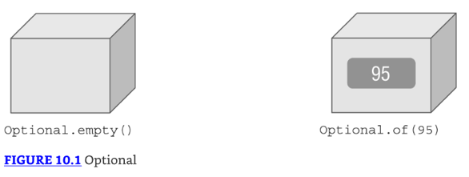

# Streams

### Retornando un Optional

* ¿Cómo expresamos esta respuesta "no sabemos" o "no aplicable" en Java?
* Usamos el tipo Optional. Un Optional se crea usando una factory. 
* Puedes solicitar un Optional vacío o pasar un valor para que el Optional lo envuelva. 
* Piensa en un Optional como una caja que podría tener algo dentro o podría estar vacía. Figure 10.1 muestra ambas opciones.



### Creando un Optional

Así es cómo codificar nuestro método average:

```java
10: public static Optional<Double> average(int... scores) {
11:   if(scores.length == 0) return Optional.empty();
12:   int sum = 0;
13:   for(int score: scores) sum += score;
14:   return Optional.of((double) sum / scores.length);
15: }
```

* La línea 11 retorna un Optional vacío cuando no podemos calcular un promedio. 
* Las líneas 12 y 13 suman las calificaciones. 
* De hecho, el método completo podría escribirse en una línea, pero eso no te enseñaría cómo funciona Optional. 
* La línea 14 crea un Optional para envolver el promedio.

Llamar al método muestra qué hay en nuestras dos cajas:

```java
System.out.println(average(90, 100)); // Optional[95.0]
System.out.println(average());        // Optional.empty
```

* Puedes ver que un Optional contiene un valor y el otro está vacío. 
* Normalmente, queremos verificar si un valor está presente y/o sacarlo de la caja. Aquí hay una manera de hacer eso:

```java
Optional<Double> opt = average(90, 100);
if(opt.isPresent())
  System.out.println(opt.get()); // 95.0
```

* Primero verificamos si el Optional contiene un valor. Luego lo imprimimos. 
* ¿Qué pasa si no hiciéramos la verificación, y el Optional estuviera vacío?

```java
Optional<Double> opt = average();
System.out.println(opt.get()); // NoSuchElementException
```

Obtendríamos una excepción, ya que no hay valor dentro del Optional.

`java.util.NoSuchElementException: No value present`

Al crear un Optional, es común querer usar `empty()` cuando el valor es `null`. 
Puedes hacer esto con un if statement o un operador ternario. 
Usamos el operador ternario `(? :)` para simplificar el código.

```java
Optional o = (value == null) ? Optional.empty() : Optional.of(value);
```

Si value es `null`, o se asigna el Optional vacío. De lo contrario, envolvemos el valor. 
Como este es un patrón tan común, Java proporciona un método factory para hacer lo mismo.

```java
Optional o = Optional.ofNullable(value);
```


* Los otros métodos te permiten escribir código que usa un `Optional` en una línea sin tener que usar el operador ternario. 
* En lugar de usar un `if statement`, que usamos cuando verificamos el average anteriormente, podemos especificar un `Consumer` para ejecutar cuando hay un valor dentro del `Optional`. 
* Cuando no lo hay, el método simplemente salta ejecutar él `Consumer`.

```java
Optional<Double> opt = average(90, 100);
opt.ifPresent(System.out::println);
```

Continuar en página 3