# Exceptions & Localization

## Understanding Exceptions

Un programa puede fallar por casi cualquier razón. Algunas posibilidades:

* El código intenta conectarse a un sitio web, pero la conexión a Internet está caída
* Se cometió un error de programación e intentaste acceder a un índice inválido en un array
* Un método llama a otro con un valor que el método no soporta

* Algunos de estos son errores de programación. Otros están completamente fuera de tu control. 
* Tu programa no puede evitar que la conexión a Internet se caiga. Lo que puede hacer es lidiar con la situación.

### El rol de las excepciones (Exceptions)

Una `exception` es la forma en que Java dice "Me rindo. No sé qué hacer ahora. 
Tú lídialo." Cuando escribes un método, puedes lidiar con la excepción o hacer que sea problema del código que llama.

---------------------------------------------------------------------
**Return Codes vs. Exceptions**

* Las excepciones se usan cuando "algo sale mal". Sin embargo, la palabra **wrong** es subjetiva. 
* El siguiente código retorna `-1` en lugar de lanzar una excepción si no se encuentra coincidencia:

```java
public int indexOf(String[] names, String name) {
    for (int i = 0; i < names.length; i++) {
        if (names[i].equals(name)) { return i; }
    }
    return -1;
}
```

* Aunque es común para ciertas tareas como búsqueda, los códigos de retorno generalmente deberían evitarse. 
* Después de todo, Java proporcionó un framework de excepciones, ¡así que deberías usarlo!
---------------------------------------------------------------------

### Understanding Exception Types

Una excepción es un evento que altera el flujo del programa. Java tiene una clase `Throwable` para todos los objetos que representan estos eventos. 
No todos ellos tienen la palabra exception en el nombre de su clase, lo cual puede ser confuso. La Figura 11.1 muestra las subclases clave de Throwable.

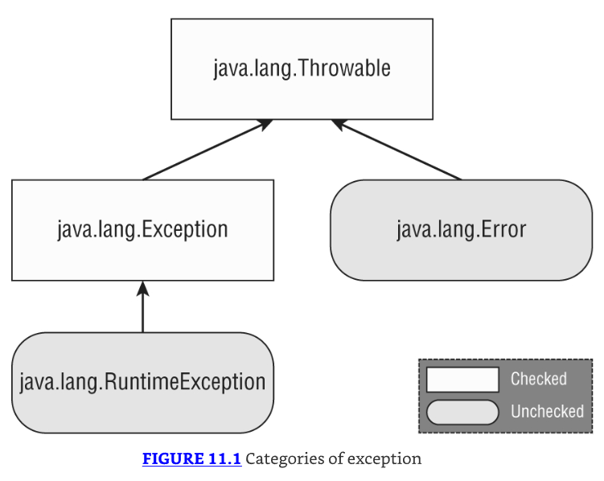

### Checked Exceptions

* Una checked exception es una excepción que debe ser declarada o manejada por el código de aplicación donde es lanzada. 
* En Java, las checked exceptions heredan de Exception pero no de RuntimeException. 
* Las checked exceptions tienden a ser más anticipadas—por ejemplo, intentar leer un archivo que no existe.

---------------------------------------------------------------------
Nota sobre `Checked Exceptions`
Las `checked exceptions` también incluyen cualquier clase que herede de `Throwable` pero no de `Error` o `RuntimeException`, como una clase que directamente extiende `Throwable`. 
Para el examen, solo necesitas saber sobre `checked exceptions` que extienden `Exception`.
---------------------------------------------------------------------

* ¿Checked exceptions? ¿Qué estamos chequeando? Java tiene una regla llamada handle or declare rule. 
* La handle or declare rule significa que todas las `checked exceptions` que podrían ser lanzadas dentro de un método están envueltas en bloques `try` y `catch` compatibles o declaradas en la firma del método.
* Como las `checked exceptions` tienden a ser anticipadas, Java fuerza la regla de que el programador debe hacer algo para mostrar que la excepción fue considerada.
* Tal vez fue manejada en el método. O tal vez el método declara que no puede manejar la excepción y alguien más debería.

Veamos un ejemplo. El siguiente método `fall()` declara que podría lanzar una `IOException`, que es una `checked exception`:

```java
void fall(int distance) throws IOException {
    if(distance> 10) {
        throw new IOException();
    }
}
```

Nota que estás usando dos palabras clave diferentes aquí. La palabra clave `throw` le dice a Java que quieres lanzar una `Exception`, mientras que la palabra clave `throws` simplemente declara que el método podría lanzar una `Exception`. También podría no hacerlo.

Ahora que sabes cómo declarar una excepción, ¿cómo la manejas? La siguiente versión alternativa del método `fall()` maneja la excepción:

```java
void fall(int distance) {
    try {
        if(distance> 10) {
            throw new IOException();
        }
    } catch (Exception e) {
        e.printStackTrace();
    }
}
```

* Nota que la declaración `catch` usa `Exception`, no `IOException`. Como `IOException` es una subclase de `Exception`, el bloque catch está permitido para capturarla. 
* Cubriremos los bloques `try` y `catch` con más detalle más adelante en este capítulo.

### Unchecked Exceptions

Una `unchecked exception` es cualquier excepción que no necesita ser declarada o manejada por el código de aplicación donde es lanzada. 
Las `unchecked exceptions` a menudo son referidas como runtime exceptions, aunque en Java, las `unchecked exceptions` incluyen cualquier clase que hereda `RuntimeException` o `Error`.

---------------------------------------------------------------------
**Tip sobre Unchecked Exceptions**
* Es permisible manejar o declarar una unchecked exception. 
* Dicho esto, es mejor documentar las unchecked exceptions que los llamadores deberían conocer en un comentario Javadoc en lugar de declarar una unchecked exception.
---------------------------------------------------------------------

* Una runtime exception se define como la clase RuntimeException y sus subclases. 
* Las runtime exceptions tienden a ser inesperadas pero no necesariamente fatales. 
* Por ejemplo, acceder a un índice de array inválido es inesperado. Aunque heredan de la clase Exception, no son checked exceptions.

* Una unchecked exception puede ocurrir en casi cualquier línea de código, ya que no se requiere que sea manejada o declarada. 
* Por ejemplo, una `NullPointerException` puede ser lanzada en el cuerpo del siguiente método si la referencia de entrada es `null`:

```java
void fall(String input) {
    System.out.println(input.toLowerCase());
}
```

* Trabajamos con objetos en Java tan frecuentemente que una `NullPointerException` puede ocurrir casi en cualquier lugar. 
* Si tuvieras que declarar `unchecked exceptions` en todas partes, ¡cada método individual tendría ese desorden! 
* El código compilará si declaras una unchecked exception. Sin embargo, es redundante.

### Error and Throwable

* Error significa que algo salió tan terriblemente mal que tu programa no debería intentar recuperarse de ello. 
* Por ejemplo, el disco duro "desapareció" o el programa se quedó sin memoria. 
* Estas son condiciones anormales que no es probable que encuentres y de las cuales no puedes recuperarte.

* Para el examen, lo único que necesitas saber sobre `Throwable` es que es la clase padre de todas las excepciones, incluyendo la clase `Error`. 
* Mientras puedes manejar excepciones `Throwable` y `Error`, no se recomienda que lo hagas en tu código de aplicación. 
* Cuando nos referimos a excepciones en este capítulo, generalmente queremos decir cualquier clase que hereda Throwable, aunque casi siempre estamos trabajando con la clase `Exception` o subclases de ella.

### Reviewing Exception Types

* Asegúrate de estudiar cuidadosamente todo en la Tabla 11.1. Para el examen, recuerda que un `Throwable` es ya sea una `Exception` o un `Error`. 
* No deberías capturar Throwable directamente en tu código.

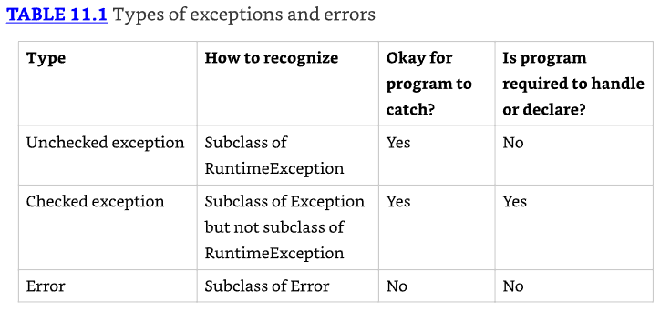

### Throwing an Exception

* Cualquier código Java puede lanzar una excepción; esto incluye código que escribes. Algunas excepciones son proporcionadas con Java. 
* Podrías encontrar una excepción que fue inventada para el examen. Esto está bien. 
* La pregunta lo hará obvio que es una excepción al hacer que el nombre de la clase termine con Exception. 
* Por ejemplo, `MyMadeUpException` es claramente una excepción.

En el examen, verás dos tipos de código que resultan en una excepción. El primero es código que está mal. Aquí hay un ejemplo:

```java
String[] animals = new String[0];
System.out.println(animals[0]); // ArrayIndexOutOfBoundsException
```

* Este código lanza una `ArrayIndexOutOfBoundsException` ya que el array no tiene elementos. 
* Eso significa que las preguntas sobre excepciones pueden estar ocultas en preguntas que parecen ser sobre algo más.

---------------------------------------------------------------------
**Nota sobre preguntas del examen**
* En el examen, algunas preguntas tienen una opción sobre no compilar y sobre lanzar una excepción. 
* Presta atención especial al código que llama un método en una referencia null o que referencia un índice inválido de array o List. 
* Si detectas esto, sabes que la respuesta correcta es que el código lanza una excepción en tiempo de ejecución.
---------------------------------------------------------------------

* La segunda forma en que el código resulta en una excepción es solicitar explícitamente a Java que lance una. 
* Java te permite escribir declaraciones como estas:

```java
throw new Exception();
throw new Exception("Ow! I fell.");
throw new RuntimeException();
throw new RuntimeException("Ow! I fell.");
```

* La palabra clave throw le dice a Java que quieres que alguna otra parte del código maneje la excepción. 
* Esto es lo mismo que la niña pequeña llorando por su papá. Alguien más necesita averiguar qué hacer sobre la excepción.

---------------------------------------------------------------------
**throw vs. throws**
Cada vez que veas throw o throws en el examen, asegúrate de que se esté usando el correcto. 
La palabra clave throw se usa como una declaración dentro de un bloque de código para lanzar una nueva excepción o relanzar una excepción existente, mientras que la palabra clave throws se usa solo al final de una declaración de método para indicar qué excepciones soporta.
---------------------------------------------------------------------

* Cuando creas una excepción, usualmente puedes pasar un parámetro String con un mensaje, o puedes no pasar parámetros y usar los valores por defecto. 
* Decimos usually porque esto es una convención. Alguien ha declarado un constructor que toma un String. 
* Alguien también podría crear una clase de excepción que no tenga un constructor que tome un mensaje.

Adicionalmente, deberías saber que una Exception es un Object. Esto significa que puedes almacenarla en una referencia de objeto, y esto es legal:

```java
var e = new RuntimeException();
throw e;
```

* El código instancia una excepción en una línea y luego la lanza en la siguiente. 
* La excepción puede venir de cualquier lugar, incluso pasada a un método. Mientras sea una excepción válida, puede ser lanzada.

El examen también podría intentar engañarte. ¿Ves por qué este código no compila?

```java
throw RuntimeException(); // DOES NOT COMPILE
```

Si tu respuesta es que falta una palabra clave, tienes absolutamente razón. La excepción nunca es instanciada con la palabra clave `new`.

Veamos otro lugar donde el examen podría intentar engañarte. ¿Puedes ver por qué lo siguiente no compila?

```java
3: try {
4:     throw new RuntimeException();
5:     throw new ArrayIndexOutOfBoundsException(); // DOES NOT COMPILE
6: } catch (Exception e) {}
```

* Como la línea 4 se lanza una excepción, la línea 5 nunca puede ser alcanzada durante runtime. 
* El compilador reconoce esto y reporta un error de código inalcanzable.

### Calling Methods That Throw Exceptions

Cuando estás llamando un método que lanza una excepción, las reglas son las mismas que dentro de un método. ¿Ves por qué lo siguiente no compila?

```java
class NoMoreCarrotsException extends Exception {}

public class Bunny {
    public static void main(String[] args) {
        eatCarrot(); // DOES NOT COMPILE
    }
    private static void eatCarrot() throws NoMoreCarrotsException {}
}
```

* El problema es que `NoMoreCarrotsException` es una checked exception. Las checked exceptions deben ser manejadas o declaradas. 
* El código compilaría si cambiaras el método `main()` a cualquiera de estos:

```java
public static void main(String[] args) throws NoMoreCarrotsException {
    eatCarrot();
}
```

```java
public static void main(String[] args) {
    try {
        eatCarrot();
    } catch (NoMoreCarrotsException e) {
        System.out.print("sad rabbit");
    }
}
```

* Podrías haber notado que `eatCarrot()` no lanzó una excepción; solo declaró que podría hacerlo. 
* Esto es suficiente para que el compilador requiera que el llamador maneje o declare la excepción.
* El compilador todavía está buscando código inalcanzable. Declarar una excepción no utilizada no se considera código inalcanzable. 
* Le da al método la opción de cambiar la implementación para lanzar esa excepción en el futuro. ¿Ves el problema aquí?

```java
public void bad() {
    try {
        eatCarrot();
    } catch (NoMoreCarrotsException e) { // DOES NOT COMPILE
        System.out.print("sad rabbit");
    }
}

private void eatCarrot() {}
```

Java sabe que `eatCarrot()` no puede lanzar una checked exception—lo que significa que no hay forma de que el bloque catch en `bad()` sea alcanzado.

---------------------------------------------------------------------
**Nota sobre checked exceptions en bloques catch**
* Cuando veas una checked exception declarada dentro de un bloque catch en el examen, asegúrate de que el código en el bloque try asociado sea capaz de lanzar la excepción o una subclase de la excepción. 
* Si no, el código es inalcanzable y no compila. Recuerda que esta regla no se extiende a unchecked exceptions o excepciones declaradas en una firma de método.
---------------------------------------------------------------------

### Overriding Methods with Exceptions

* Cuando introdujimos la sobrescritura de métodos en el Capítulo 6, "Class Design", incluimos una regla relacionada con excepciones. 
* Un método sobrescrito no puede declarar ninguna excepción checked nueva o más amplia que el método que hereda. Por ejemplo, este código no está permitido:

```java
class CanNotHopException extends Exception {}

class Hopper {
    public void hop() {}
}

class Bunny extends Hopper {
    public void hop() throws CanNotHopException {} // DOES NOT COMPILE
}
```

* Java sabe que `hop()` no está permitido lanzar ninguna checked exception porque el método `hop()` en la superclase Hopper no declara ninguna. 
* Imagina qué pasaría si las versiones de los métodos de las subclases pudieran agregar checked exceptions—podrías escribir código que llame al método `hop()` de Hopper y no manejar ninguna excepción. 
* Entonces, si Bunny fuera usado en su lugar, el código no sabría manejar o declarar `CanNotHopException`.
* Un método sobrescrito en una subclase está permitido declarar menos excepciones que la superclase o interfaz. 
* Esto es legal porque los llamadores ya las están manejando.

```java
class Hopper {
    public void hop() throws CanNotHopException {}
}

class Bunny extends Hopper {
    public void hop() {} // This is fine
}
```

* Un método sobrescrito que no declara una de las excepciones lanzadas por el método padre es similar al método que declara que lanza una excepción que nunca lanza realmente. 
* Esto es perfectamente legal. Similarmente, una clase está permitida declarar una subclase de un tipo de excepción. 
* La idea es la misma. La superclase o interfaz ya ha cuidado de un tipo más amplio.

### Printing an Exception

* Hay tres formas de imprimir una excepción. Puedes dejar que Java la imprima, imprimir solo el mensaje, o imprimir de dónde viene el stack trace. 
* Este ejemplo muestra los tres enfoques:

```java
5: public static void main(String[] args) {
6:     try {
7:         hop();
8:     } catch (Exception e) {
9:         System.out.println(e + "\n");
10:        System.out.println(e.getMessage()+ "\n");
11:        e.printStackTrace();
12:    }
13: }
14: private static void hop() {
15:    throw new RuntimeException("cannot hop");
16: }

// Este código imprime lo siguiente:
// java.lang.RuntimeException: cannot hop
// cannot hop
// java.lang.RuntimeException: cannot hop
//     at Handling.hop(Handling.java:15)
//     at Handling.main(Handling.java:7)
```

* La primera línea muestra lo que Java imprime por defecto: el tipo de excepción y el mensaje. 
* La segunda línea muestra solo el mensaje. El resto muestra un stack trace. 
* El stack trace usualmente es el más útil porque muestra la jerarquía de llamadas a métodos que fueron hechas para alcanzar la línea que lanzó la excepción.

## Recognizing Exception Classes

* Necesitas reconocer tres grupos de clases de excepción para el examen: RuntimeException, checked Exception, y Error. 
* Miramos ejemplos comunes de cada tipo. Para el examen, necesitarás reconocer qué tipo de excepción es y si es lanzada por la Java Virtual Machine (JVM) o por un programador. 
* Para algunas excepciones, también necesitas saber cuáles son heredadas de una a otra.

### RuntimeException Classes

* RuntimeException y sus subclases son unchecked exceptions que no tienen que ser manejadas o declaradas. 
* Pueden ser lanzadas por el programador o la JVM. Las clases de unchecked exception comunes están listadas en la Tabla 11.2.


### ArithmeticException

Intentar dividir un int por cero da un resultado indefinido. Cuando esto ocurre, la JVM lanzará una `ArithmeticException`:

```java
int answer = 11 / 0;

// Ejecutar este código resulta en la siguiente salida:
// Exception in thread "main" java.lang.ArithmeticException: / by zero
```

* Java no deletrea la palabra divide. Eso está bien, sin embargo, porque sabemos que / es el operador de división y que Java está intentando decirte que ocurrió una división por cero.
* El thread "main" te está diciendo que el código fue llamado directa o indirectamente desde un programa con un método main. 
* En el examen, esto es toda la salida que verás. Luego viene el nombre de la excepción, seguido por información extra (si hay alguna) que va con la excepción.

### ArrayIndexOutOfBoundsException

Ya sabes ahora que los índices de array empiezan con 0 y van hasta 1 menos que la longitud del array—lo que significa que este código lanzará una `ArrayIndexOutOfBoundsException`:

```java
int[] countsOfMoose = new int[3];
System.out.println(countsOfMoose[-1]);
```

Este es un problema porque no existe tal cosa como un índice de array negativo. Ejecutar este código produce la siguiente salida:

`Exception in thread "main" java.lang.ArrayIndexOutOfBoundsException: Index -1 out of bounds for length 3`

### ClassCastException

Java intenta protegerte de casts imposibles. Este código no compila porque Integer no es una subclase de String:

```java
String type = "moose";
Integer number = (Integer) type; // DOES NOT COMPILE
```

Código más complicado frustra los intentos de Java de protegerte. Cuando el cast falla en runtime, Java lanzará una `ClassCastException`:

```java
String type = "moose";
Object obj = type;
Integer number = (Integer) obj; // ClassCastException
```

El compilador ve un cast de Object a Integer. Esto podría estar bien. El compilador no se da cuenta de que hay un String en ese Object. Cuando el código se ejecuta, produce la siguiente salida:

```java
Exception in thread "main" java.lang.ClassCastException: java.base/
java.lang.String
cannot be cast to java.lang.base/java.lang.Integer
```

Java te dice ambos tipos que estuvieron involucrados en el problema, haciendo evidente qué está mal.

### NullPointerException

Las variables de instancia y los métodos deben ser llamados en una referencia no-null. Si la referencia es null, la JVM lanzará una NullPointerException.

```java
1: public class Frog {
2:     public void hop(String name, Integer jump) {
3:         System.out.print(name.toLowerCase() + " " + jump.intValue());
4:     }
5:
6:     public static void main(String[] args) {
7:         new Frog().hop(null, 1);
8:     }
}
```

Ejecutar este código resulta en la siguiente salida:

```java
Exception in thread "main" java.lang.NullPointerException: Cannot invoke
"String.toLowerCase()" because "<parameter1>" is null
```

* Si eres nuevo en Java 17, deberías haber notado algo especial sobre la salida. 
* La JVM ahora te dice la referencia de objeto que desencadenó la `NullPointerException`. 
* Esta nueva característica se llama Helpful `NullPointerExceptions`.

Como otro ejemplo, supón que cambiamos la línea 7:

`7: new Frog().hop("Kermit", null);`

Entonces la salida en runtime cambia como sigue:

`Exception in thread "main" java.lang.NullPointerException: Cannot invoke "java.lang.Integer.intValue()" because "<parameter2>" is null`

---------------------------------------------------------------------
**Tip sobre NullPointerException**
* Por defecto, una `NullPointerException` en una variable local o parámetro de método se imprime con un número indicando el orden en el que aparece en el método, como `<local2>` o `<parameter4>`. 
* Si eres como nosotros y quieres que el nombre de variable real sea mostrado, compila el código con el flag `-g:vars`, que agrega información de debug. 
* En los ejemplos previos, `<parameter1>` y `<parameter2>` son entonces reemplazados con name y jump, respectivamente.
---------------------------------------------------------------------

Como esta es una nueva característica en Java, es posible que la veas en una pregunta del examen.

---------------------------------------------------------------------
**Enabling/Disabling Helpful NullPointerExceptions**

Cuando las helpful `NullPointerExceptions` fueron agregadas en Java 14, la característica estaba deshabilitada por defecto y tenía que ser habilitada vía un argumento de línea de comando `ShowCodeDetailsInExceptionMessages` a la JVM: `java -XX:+ShowCodeDetailsInExceptionMessages Frog`

En Java 15 y posteriores, el comportamiento por defecto fue cambiado para que esté habilitado por defecto, aunque todavía puede ser deshabilitado vía el argumento de línea de comando. `java -XX:-ShowCodeDetailsInExceptionMessages Frog`
---------------------------------------------------------------------

### IllegalArgumentException

IllegalArgumentException es una forma en que tu programa se protege a sí mismo. 
Quieres decirle al llamador que algo está mal—preferiblemente de una manera obvia que el llamador no pueda ignorar para que el programador arregle el problema. 
Ver que el código termina con una excepción es un gran recordatorio de que algo está mal. 
Considera este ejemplo cuando es llamado como `setNumberEggs(-2)`:

```java
public void setNumberEggs(int numberEggs) {
    if (numberEggs < 0)
        throw new IllegalArgumentException("# eggs must not be negative");
    this.numberEggs = numberEggs;
}
```

El programa lanza una excepción cuando no está contento con los valores de parámetro. La salida se ve así:

```java
Exception in thread "main"
java.lang.IllegalArgumentException: // eggs must not be negative
```

Claramente, este es un problema que debe ser arreglado si el programador quiere que el programa haga algo útil.

### NumberFormatException

* Java proporciona métodos para convertir strings a números. Cuando estos reciben un valor inválido, lanzan una NumberFormatException. 
* La idea es similar a IllegalArgumentException. Como este es un problema común, Java le da una clase separada. 
* De hecho, NumberFormatException es una subclase de IllegalArgumentException. Aquí hay un ejemplo de intentar convertir algo no-numérico en un int:

`Integer.parseInt("abc");`

La salida se ve así:

```java
Exception in thread "main"
java.lang.NumberFormatException: For input string: "abc"
```

* Para el examen, necesitas saber que NumberFormatException es una subclase de IllegalArgumentException. 
* Cubriremos más sobre por qué eso es importante más adelante en el capítulo.

### Checked Exception Classes

* Las checked exceptions tienen Exception en su jerarquía pero no RuntimeException. Deben ser manejadas o declaradas. 
* Las checked exceptions comunes están listadas en la Tabla 11.3.

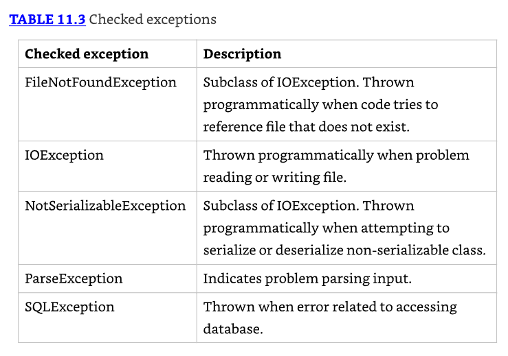

* Para el examen, necesitas saber que todas estas son checked exceptions que deben ser manejadas o declaradas. 
* También necesitas saber que FileNotFoundException y NotSerializableException son subclases de IOException.
* Ves estas tres clases en el Capítulo 14, "I/O," y SQLException en el Capítulo 15, "JDBC."

### Error Classes

* Errors son unchecked exceptions que extienden la clase Error. Son lanzados por la JVM y no deberían ser manejados o declarados. 
* Errors son raros, pero podrías ver los listados en la Tabla 11.4.

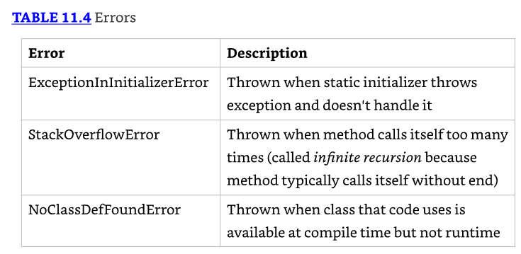

Para el examen, solo necesitas saber que estos errors son unchecked y el código a menudo es incapaz de recuperarse de ellos.

## Handling Exceptions

### Using try and catch Statements

* Se explica que Java usa un try statement para separar la lógica que podría lanzar una excepción de la lógica que maneja esa excepción. 
* Se hace referencia a la Figura 11.2 que muestra la sintaxis de un try statement.

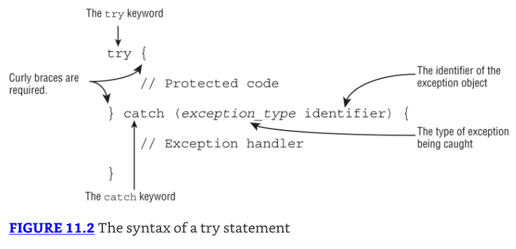

* El código en el bloque try se ejecuta normalmente. 
* Si alguno de los statements lanza una excepción que puede ser capturada por el tipo de excepción listado en el bloque catch, el bloque try deja de ejecutarse y la ejecución va al catch statement. 
* Si ninguno de los statements en el bloque try lanza una excepción que pueda ser capturada, la cláusula catch no se ejecuta.

* Se aclara que las palabras "block" y "clause" se usan intercambiablemente en el examen. Block es correcto porque hay llaves presentes. 
* Clause es correcto porque es parte de un try statement.

```java
3: void explore() {
4:     try {
5:         fall();
6:         System.out.println("never get here");
7:     } catch (RuntimeException e) {
8:         getUp();
9:     }
10:     seeAnimals();
11: }
12: void fall() { throw new RuntimeException(); }
```

* La línea 5 llama al método `fall()`. La línea 12 lanza una excepción. Esto significa que Java salta directamente al bloque catch, omitiendo la línea 6. 
* La niña se levanta en la línea 8. Ahora el try statement ha terminado, y la ejecución continúa normalmente con la línea 10.

Ahora veamos el siguiente ejemplo e identifiquemos el error:

```java
try // DOES NOT COMPILE
    fall();
catch (Exception e)
    System.out.println("get up");
```

El problema es que faltan las llaves `{}`. Los try statements son como métodos en que las llaves rizadas son requeridas incluso si hay solo un statement dentro de los bloques de código, mientras que los if statements y loops son especiales y te permiten omitir las llaves rizadas.

Ahora veamos este otro ejemplo: 

```java
try { // DOES NOT COMPILE
    fall();
}
```

* Este código no compila porque el bloque try no tiene nada después de él. El punto de un try statement es que algo suceda si se lanza una excepción. 
* Sin otra cláusula, el try statement está solo. Como verás en breve, hay un tipo especial de try statement que incluye un implicit finally block, aunque la sintaxis es bastante diferente de este ejemplo.

### Chaining catch Blocks

* Para el examen, te pueden dar clases de excepción y necesitas entender cómo funcionan. Aquí está cómo abordarlas. 
* Primero, debes ser capaz de reconocer si la excepción es checked o unchecked. 
* Segundo, necesitas determinar si alguna de las excepciones son subclases de las otras.

```java
class AnimalsOutForAWalk extends RuntimeException {}

class ExhibitClosed extends RuntimeException {}

class ExhibitClosedForLunch extends ExhibitClosed {}
```

* En este ejemplo, hay tres excepciones personalizadas. Todas son excepciones unchecked porque directa o indirectamente extienden RuntimeException. 
* Ahora encadenamos ambos tipos de excepciones con dos bloques catch y las manejamos imprimiendo el mensaje apropiado:

```java
public void visitPorcupine() {
    try {
        seeAnimal();
    } catch (AnimalsOutForAWalk e) { // first catch block
        System.out.print("try back later");
    } catch (ExhibitClosed e) { // second catch block
        System.out.print("not today");
    }
}
```

* Hay tres posibilidades cuando se ejecuta este código. Si seeAnimal() no lanza una excepción, no se imprime nada. 
* Si el animal está fuera para un paseo, solo se ejecuta el primer bloque catch. Si la exhibición está cerrada, solo se ejecuta el segundo bloque catch. 
* No es posible que ambos bloques catch se ejecuten cuando están encadenados juntos de esta manera.

* Existe una regla para el orden de los bloques catch. Java los mira en el orden en que aparecen. 
* Si es imposible que uno de los bloques catch se ejecute, ocurre un error de compilador sobre código unreachable. 
* Por ejemplo, esto sucede cuando un bloque catch de superclase aparece antes que un bloque catch de subclase. 
* Recuerda, te advertimos que prestes atención a cualquier excepción de subclase.

* En el ejemplo del puercoespín, el orden de los bloques catch podría revertirse porque las excepciones no heredan una de la otra. 
* Y sí, hemos visto un puercoespín ser sacado a pasear con una correa.
* El siguiente ejemplo muestra tipos de excepción que sí heredan uno del otro:

```java
public void visitMonkeys() {
    try {
        seeAnimal();
    } catch (ExhibitClosedForLunch e) { // Subclass exception
        System.out.print("try back later");
    } catch (ExhibitClosed e) { // Superclass exception
        System.out.print("not today");
    }
}
```

* Si se lanza la excepción más específica ExhibitClosedForLunch, se ejecuta el primer bloque catch. 
* Si no, Java verifica si se lanza la superclase ExhibitClosed exception y la captura. 
* Esta vez, el orden de los bloques catch sí importa. El reverso no funciona.

```java
public void visitMonkeys() {
    try {
        seeAnimal();
    } catch (ExhibitClosed e) {
        System.out.print("not today");
    } catch (ExhibitClosedForLunch e) { // DOES NOT COMPILE
        System.out.print("try back later");
    }
}
```

* Si se lanza la excepción más específica ExhibitClosedForLunch, el bloque catch para ExhibitClosed se ejecuta—lo que significa que no hay manera de que el segundo bloque catch se ejecute jamás. 
* Java correctamente te dice que hay un bloque catch unreachable. Intentemos este una vez más. ¿Ves por qué este código no compila?

```java
public void visitSnakes() {
    try {
    } catch (IllegalArgumentException e) {
    } catch (NumberFormatException e) { // DOES NOT COMPILE
    }
}
```

* Recuerda que dijimos anteriormente que necesitabas saber que NumberFormatException es una subclase de IllegalArgumentException
* Este ejemplo es la razón por qué. Dado que NumberFormatException es una subclase, siempre será capturada por el primer bloque catch, haciendo el segundo bloque catch unreachable code que no compila. 
* Del mismo modo, para el examen, necesitas saber que FileNotFoundException es una subclase de IOException y no puede ser usada de manera similar.

* Para revisar múltiples bloques catch, recuerda que como máximo un bloque catch se ejecutará, y será el primer bloque catch que pueda manejar la excepción. 
* También, recuerda que una excepción definida por el catch statement está solo in scope para ese bloque catch. 
* Por ejemplo, lo siguiente causa un error de compilador, ya que intenta usar el objeto de excepción fuera del bloque para el cual fue definido:

```java
public void visitManatees() {
    try {
    } catch (NumberFormatException e1) {
        System.out.println(e1);
    } catch (IllegalArgumentException e2) {
        System.out.println(e1); // DOES NOT COMPILE
    }
}
```

### Applying a Multi-catch Block

* A menudo, queremos que el resultado de una excepción que se lanza sea el mismo, sin importar qué excepción particular se lanza. 
* Por ejemplo, echa un vistazo a este método:

```java
public static void main(String args[]) {
    try {
        System.out.println(Integer.parseInt(args[1]));
    } catch (ArrayIndexOutOfBoundsException e) {
        System.out.println("Missing or invalid input");
    } catch (NumberFormatException e) {
        System.out.println("Missing or invalid input");
    }
}
```

* Observa que tenemos el mismo statement println() para dos bloques catch diferentes. 
* Podemos manejar esto más elegantemente usando un bloque multi-catch. 
* Un bloque multi-catch permite que múltiples tipos de excepción sean capturados por el mismo bloque catch. 
* Reescribamos el ejemplo anterior usando un bloque multi-catch:

```java
public static void main(String[] args) {
    try {
        System.out.println(Integer.parseInt(args[1]));
    } catch (ArrayIndexOutOfBoundsException | NumberFormatException e)
    {
        System.out.println("Missing or invalid input");
    }
}
```

* Esto es mucho mejor. No hay código duplicado, la lógica común está toda en un lugar, y la lógica está exactamente donde esperarías encontrarla. 
* Si quisieras, aún podrías tener un segundo bloque catch para Exception en caso de que quieras manejar otros tipos de excepciones de manera diferente.
* Figure 11.3 muestra la sintaxis de multi-catch. Es como una cláusula catch regular, excepto que dos o más tipos de excepción están especificados, separados por un pipe. 
* El pipe (|) también se usa como el operador "or", haciendo fácil recordar que puedes usar either/or de los tipos de excepción. 
* Observa cómo hay solo un nombre de variable en la cláusula catch. Java está diciendo que la variable llamada `e` puede ser de tipo Exception1 o Exception2.

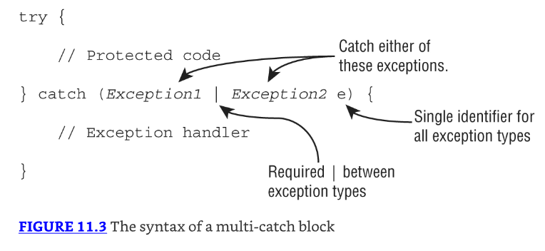

* El examen podría intentar engañarte con sintaxis inválida. Recuerda que las excepciones pueden ser listadas en cualquier orden dentro de la cláusula catch. 
* Sin embargo, el nombre de variable debe aparecer solo una vez y al final. ¿Ves por qué estos son válidos o inválidos?

```java
catch(Exception1 e | Exception2 e | Exception3 e) // DOES NOT COMPILE

catch(Exception1 e1 | Exception2 e2 | Exception3 e3) // DOES NOT COMPILE

catch(Exception1 | Exception2 | Exception3 e)
```

* La primera línea es incorrecta porque el nombre de variable aparece tres veces. Solo porque resulta ser el mismo nombre de variable no hace que esté bien. 
* La segunda línea es incorrecta porque el nombre de variable de nuevo aparece tres veces. Usar diferentes nombres de variable no lo hace mejor. 
* La tercera línea sí compila. Muestra la sintaxis correcta para especificar tres excepciones.

* Java pretende que multi-catch sea usado para excepciones que no están relacionadas, y te previene de especificar tipos redundantes en un multi-catch. 
* ¿Ves qué está mal aquí?

```java
try {
    throw new IOException();
} catch (FileNotFoundException | IOException p) {} // DOES NOT COMPILE
```

* Especificar excepciones relacionadas en el multi-catch es redundante, y el compilador da un mensaje como este:
* The exception FileNotFoundException is already caught by the alternative IOException
* Dado que FileNotFoundException es una subclase de IOException, este código no compilará. 
* Un bloque multi-catch sigue reglas similares a encadenar bloques catch juntos, lo cual viste en la sección anterior. 
* Por ejemplo, ambos desencadenan errores de compilador cuando encuentran código unreachable o duplicate
* La única diferencia entre los bloques multicatch y el encadenamiento de bloques catch es que el orden no importa para un bloque multicatch dentro de una sola expresión catch.

Regresando al ejemplo, el código correcto es simplemente eliminar la referencia a la subclase extraña, como se muestra aquí:

```java
try {
    throw new IOException();
} catch (IOException e) {}
```

* El try statement también te permite ejecutar código al final con una cláusula finally, sin importar si se lanza una excepción. 
* Figure 11.4 muestra la sintaxis de un try statement con esta funcionalidad extra.

* Hay dos caminos a través del código con tanto un catch como un finally. 
* Si se lanza una excepción, el bloque finally se ejecuta después del bloque catch. 
* Si no se lanza ninguna excepción, el bloque finally se ejecuta después de que el bloque try se completa.
* Regresemos a nuestro ejemplo de la niña pequeña, esta vez con finally:

```java
12: void explore() {
13:     try {
14:         seeAnimals();
15:     fall();
16: } catch (Exception e) {
17:     getHugFromDaddy();
18: } finally {
19:     seeMoreAnimals();
20: }
21: goHome();
22: }
```

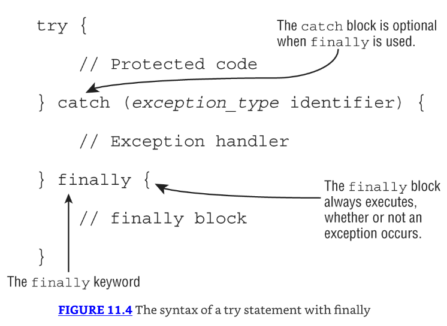

* La niña cae en la línea 15. Si se levanta por sí misma, el código continúa al bloque finally y ejecuta la línea 19. 
* Luego el try statement ha terminado, y el código procede en la línea 21. Si la niña no se levanta por sí misma, lanza una excepción. 
* El bloque catch se ejecuta, y ella recibe un abrazo en la línea 17. Con ese abrazo, está lista para ver más animales en la línea 19. 
* Luego el try statement ha terminado, y el código procede en la línea 21. 
* De cualquier manera, el final es el mismo. El bloque finally se ejecuta, y la ejecución continúa después del try statement.

El examen intentará engañarte con cláusulas faltantes o cláusulas en el orden incorrecto. ¿Ves por qué los siguientes sí o no compilan?

```java
25: try { // DOES NOT COMPILE
26:     fall();
27: } finally {
28:     System.out.println("all better");
29: } catch (Exception e) {
30:     System.out.println("get up");
31: }
32:
33: try { // DOES NOT COMPILE
34:     fall();
35: }
36:
37: try {
38:     fall();
39: } finally {
40:     System.out.println("all better");
41: }
```

* El primer ejemplo (líneas 25-31) no compila porque los bloques catch y finally están en el orden incorrecto. 
* El segundo ejemplo (líneas 33-35) no compila porque debe haber un bloque catch o finally. 
* El tercer ejemplo (líneas 37-41) está bien. El bloque catch no es requerido si finally está presente.

La mayoría de los ejemplos que encuentres en el examen con finally van a verse forzados. Por ejemplo, te harán preguntas como qué imprime este código:

```java
public static void main(String[] unused) {
    StringBuilder sb = new StringBuilder();
    try {
        sb.append("t");
    } catch (Exception e) {
        sb.append("c");
    } finally {
        sb.append("f");
    }
    sb.append("a");
    System.out.print(sb.toString());
}
```

* La respuesta es tfa. El bloque try se ejecuta. Dado que no se lanza ninguna excepción, Java va directo al bloque finally. 
* Luego el código después del try statement se ejecuta. Sabemos que este es un ejemplo tonto, pero puedes esperar ver ejemplos como este en el examen.
* Hay una regla adicional que deberías saber para los bloques finally. 
* Si se entra a un try statement con un bloque finally, entonces el bloque finally siempre será ejecutado, sin importar si el código se completa exitosamente. 
* Echa un vistazo al siguiente método goHome(). Asumiendo que una excepción puede o no puede ser lanzada en la línea 14, 
* ¿cuáles son los posibles valores que este método podría imprimir? También, ¿cuál sería el valor de retorno en cada caso?

```java
12: int goHome() {
13:     try {
14:         // Optionally throw an exception here
15:         System.out.print("1");
16:         return -1;
17:     } catch (Exception e) {
18:     System.out.print("2");
19:     return -2;
20:     } finally {
21:     System.out.print("3");
22:     return -3;
23:     }
24: }
```

* Si no se lanza una excepción en la línea 14, entonces la línea 15 será ejecutada, imprimiendo 1. 
* Antes de que el método retorne, sin embargo, el bloque finally se ejecuta, imprimiendo 3. 
* Si se lanza una excepción, entonces las líneas 15 y 16 serán omitidas y las líneas 17-19 serán ejecutadas, imprimiendo 2, seguido por 3 del bloque finally. 
* Mientras que el primer valor impreso puede diferir, el método siempre imprime 3 al final, ya que está en el bloque finally.
* ¿Cuál es el valor de retorno del método goHome()? En este caso, siempre es -3. Porque el bloque finally se ejecuta poco antes de que el método se complete, interrumpe el return statement desde dentro tanto del bloque try como del catch.
* Para el examen, necesitas recordar que un bloque finally siempre será ejecutado. Dicho esto, puede no completarse exitosamente. 
* Echa un vistazo al siguiente código snippet. ¿Qué pasaría si info fuera null en la línea 32?

```java
31: } finally {
32:     info.printDetails();
33:     System.out.print("Exiting");
34:     return "zoo";
35: }
```

* Si info fuera null, entonces el bloque finally sería ejecutado, pero se detendría en la línea 32 y lanzaría una NullPointerException. 
* Las líneas 33 y 34 no serían ejecutadas. En este ejemplo, ves que mientras un bloque finally siempre será ejecutado, puede que no termine.

---------------------------------------------------------------------
**System.exit():**
* Hay una excepción a la regla "the finally block will always be executed": Java define un método que llamas como System.exit(). 
* Toma un parámetro entero que representa el código de estado que se retorna.

```java
try {
    System.exit(0);
} finally {
    System.out.print("Never going to get here"); // Not printed
}
```

System.exit() le dice a Java, "Stop. End the program right now. Do not pass Go. Do not collect $200." 
Cuando `System.exit()` es llamado en el bloque try o catch, el bloque finally no se ejecuta.
---------------------------------------------------------------------

## Automating Resource Management

A menudo, tu aplicación trabaja con archivos, bases de datos, y varios objetos de conexión. 
Comúnmente, estas fuentes de datos externas son referidas como resources.

* En muchos casos, tú abres una conexión al recurso, ya sea sobre la red o dentro de un sistema de archivos. 
* Luego lees/escribes los datos que quieres. Finalmente, cierras el recurso para indicar que has terminado con él.
* ¿Qué pasa si no cierras un recurso cuando has terminado con él? En resumen, muchas cosas malas podrían pasar. 
* Si te estás conectando a una base de datos, podrías usar todas las conexiones disponibles, lo que significa que nadie puede hablar con la base de datos hasta que liberes tus conexiones. 
* Aunque comúnmente escuchas sobre memory leaks causando que los programas fallen, un resource leak es igual de malo y ocurre cuando un programa falla al liberar sus conexiones a un recurso, resultando en que el recurso se vuelve inaccesible. 
* Esto podría significar que tu programa ya no puede hablar con la base de datos o, incluso peor, todos los programas son incapaces de alcanzar la base de datos
* Para el examen, un resource es típicamente un archivo o base de datos que requiere algún tipo de stream o conexión para leer o escribir datos. 
* En Chapter 14 y Chapter 15, creas numerosos recursos que necesitarán ser cerrados cuando hayas terminado con ellos.

### Introducing Try-with-Resources

Echemos un vistazo a un método que abre un archivo, lee los datos, y lo cierra:

```java
4: public void readFile(String file) {
5:     FileInputStream is = null;
6:     try {
7:         is = new FileInputStream("myfile.txt");
8:         // Read file data
9:     } catch (IOException e) {
10:        e.printStackTrace();
11:    } finally {
12:        if(is != null) {
13:            try {
14:                is.close();
15:            } catch (IOException e2) {
16:                e2.printStackTrace();
17:            }
18:        }
19:    }
20: }
```

* Wow, ¡ese es un método largo! ¿Por qué tenemos dos bloques try y catch? 
* Bueno, las líneas 7 y 14 ambas incluyen llamadas checked IOException, y esas necesitan ser capturadas en el método o relanzadas por el método. 
* La mitad de las líneas de código en este método son solo para cerrar un recurso. Y mientras más recursos tengas, el código más largo como este se vuelve. 
* Por ejemplo, podrías tener múltiples recursos que necesitan ser cerrados en un orden particular. 
* Tampoco quieres que una excepción causada al cerrar un recurso prevenga el cierre de otro recurso.

* Para resolver esto, Java incluye el try-with-resources statement para cerrar automáticamente todos los recursos abiertos en una cláusula try. 
* Esta característica también es conocida como automatic resource management, porque Java automáticamente se encarga del cierre.

Echemos un vistazo a nuestro mismo ejemplo usando un try-with-resources statement:

```java
4: public void readFile(String file) {
5:     try (FileInputStream is = new FileInputStream("myfile.txt")) {
6:         // Read file data
7:     } catch (IOException e) {
8:         e.printStackTrace();
9:     }
10: }
```

* Funcionalmente, son similares, pero nuestra nueva versión tiene la mitad de líneas. 
* Más importante aún, sin embargo, al usar un try-with-resources statement, garantizamos que tan pronto como una conexión pasa fuera de alcance, Java intentará cerrarla dentro del mismo método.
* Detrás de escenas, el compilador reemplaza un bloque try-with-resources con un bloque try y finally. 
* Nos referimos a este bloque finally "oculto" como un implicit finally block, ya que es creado y usado por el compilador automáticamente. 
* Aún puedes crear un bloque finally definido por el programador cuando uses un try-with-resources statement; solo ten presente que el implícito será llamado primero.

---------------------------------------------------------------------
* A diferencia del garbage collection, los recursos no se cierran automáticamente cuando salen fuera de alcance. 
* Por lo tanto, se recomienda que cierres los recursos en el mismo bloque de código que los abre. 
* Al usar un try-with-resources statement para abrir todos tus recursos, esto ocurre automáticamente.
---------------------------------------------------------------------

### Basics of Try-with-Resources

* Figure 11.5 muestra cómo se ve un try-with-resources statement. Observa que uno o más recursos pueden ser abiertos en la cláusula try. 
* Cuando múltiples recursos son abiertos, se cierran en el reverse del orden en el cual fueron creados. 
* También, nota que los paréntesis se usan para listar esos recursos, y los punto y coma se usan para separar las declaraciones. 
* Esto funciona justo como declarar múltiples índices en un for loop.

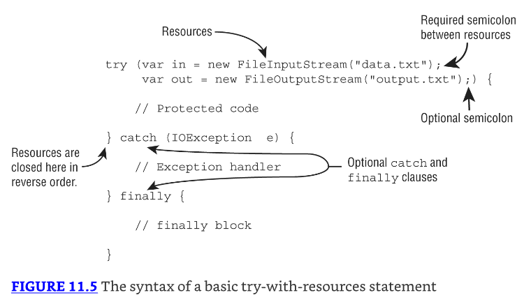

¿Qué pasó con el bloque catch en Figure 11.5? Bueno, resulta que un bloque catch es opcional con un try-with-resources statement. 
Por ejemplo, podemos reescribir el ejemplo readFile() anterior de modo que el método declare la excepción para hacerlo incluso más corto:

```java
4: public void readFile(String file) throws IOException {
5:     try (FileInputStream is = new FileInputStream("myfile.txt")) {
6:         // Read file data
7:     }
8: }
```

* Anteriormente en el capítulo, aprendiste que un try statement debe tener uno o más bloques catch o un bloque finally. 
* Un try-with-resources statement difiere de un try statement en que ninguno de estos es requerido, aunque un desarrollador puede agregar ambos. 
* Para el examen, necesitas saber que el implicit finally block se ejecuta before cualquiera definido por el programador.

### Constructing Try-with-Resources Statements

Solo las clases que implementan la interfaz AutoCloseable pueden ser usadas en un try-with-resources statement. 
Por ejemplo, lo siguiente no compila ya que String no implementa la interfaz AutoCloseable:

`try (String reptile = "lizard") {}`

Heredar AutoCloseable requiere implementar un método close() compatible.

```java
interface AutoCloseable {
    public void close() throws Exception;
}
```

Desde tus estudios de method overriding, esto significa que la versión implementada de close() puede elegir lanzar Exception o una subclase o no lanzar ninguna excepción en absoluto.

A lo largo del resto de esta sección, usamos la siguiente clase de recurso personalizada que simplemente imprime un mensaje cuando se llama al método close():

```java
public class MyFileClass implements AutoCloseable {
    private final int num;
    public MyFileClass(int num) { this.num = num; }
    @Override public void close() {
        System.out.println("Closing: " + num);
    }
}
```

---------------------------------------------------------------------
* En Chapter 14, encuentras recursos que implementan Closeable en lugar de AutoCloseable. 
* Dado que Closeable extiende AutoCloseable, ambos son soportados en try-with-resources statements. 
* La única diferencia entre los dos es que el método close() de Closeable declara IOException, mientras que el método close() de AutoCloseable declara Exception.
---------------------------------------------------------------------

### Declaring Resources

* Mientras que try-with-resources sí soporta declarar múltiples variables, cada variable debe ser declarada en un statement separado. 
* Por ejemplo, lo siguiente no compila:

```java
try (MyFileClass is = new MyFileClass(1), // DOES NOT COMPILE
    os = new MyFileClass(2)) {
}

try (MyFileClass ab = new MyFileClass(1), // DOES NOT COMPILE
    MyFileClass cd = new MyFileClass(2)) {
}
```

* El primer ejemplo no compila porque le falta el tipo de dato, y usa una coma `(,)` en lugar de un punto y coma `(;)`. 
* El segundo ejemplo no compila porque también usa una coma `(,)` en lugar de un punto y coma `(;)`. 
* Cada recurso debe incluir el tipo de dato y ser separado por un punto y coma `(;)`.
* Puedes declarar un recurso usando var como el tipo de dato en un try-with-resources statement, dado que los recursos son variables locales.

```java
try (var f = new BufferedInputStream(new FileInputStream("it.txt"))) {
    // Process file
}
```

Declarar recursos es una situación común donde usar var es bastante útil, ya que acorta la línea de código ya larga.

### Scope of Try-with-Resources

* Los recursos creados en la cláusula try están in scope solo dentro del bloque try. 
* Esta es otra forma de recordar que el implicit finally se ejecuta antes que cualquier bloque catch/finally que codifiques tú mismo. 
* El implicit close ya se ha ejecutado, y el recurso ya no está disponible. ¿Ves por qué las líneas 6 y 8 no compilan en este ejemplo?

```java
3: try (Scanner s = new Scanner(System.in)) {
4:     s.nextLine();
5: } catch(Exception e) {
6:     s.nextInt(); // DOES NOT COMPILE
7: } finally {
8:     s.nextInt(); // DOES NOT COMPILE
9: }
```

* El problema es que Scanner ha salido fuera de scope al final de la cláusula try. Las líneas 6 y 8 no tienen acceso a él. 
* Esta es una buena característica. No puedes usar accidentalmente un objeto que ha sido cerrado. 
* En un try statement tradicional, la variable tiene que ser declarada antes del try statement para que tanto los bloques try como finally puedan acceder a ella, lo cual tiene el efecto secundario desagradable de hacer que la variable esté in scope para el resto del método, simplemente invitándote a llamarla por accidente.

### Following Order of Operations

* Cuando trabajas con try-with-resources statements, es importante saber que los recursos se cierran en el reverse del orden en el cual fueron creados. 
* Usando nuestra MyFileClass personalizada, ¿puedes descifrar qué imprime este método?

```java
public static void main(String... xyz) {
    try (MyFileClass bookReader = new MyFileClass(1);
        MyFileClass movieReader = new MyFileClass(2)) {
        System.out.println("Try Block");
        throw new RuntimeException();
    } catch (Exception e) {
        System.out.println("Catch Block");
    } finally {
        System.out.println("Finally Block");
    }
}

// la salida es:
// Try Block
// Closing: 2
// Closing: 1
// Catch Block
// Finally Block
```

* Para el examen, asegúrate de entender por qué el método imprime los statements en este orden. 
* Recuerda, los recursos se cierran en el reverse del orden en el cual son declarados, y el implicit finally se ejecuta antes del finally definido por el programador.

### Applying Effectively Final

* Mientras que los recursos a menudo son creados en el try-with-resources statement, es posible declararlos con anticipación, siempre que estén marcados final o effectively final. 
* La sintaxis usa el nombre del recurso en lugar de la declaración del recurso, separado por un punto y coma `(;)`. Intentemos otro ejemplo:

```java
11: public static void main(String... xyz) {
12:     final var bookReader = new MyFileClass(4);
13:     MyFileClass movieReader = new MyFileClass(5);
14:     try (bookReader;
15:         var tvReader = new MyFileClass(6);
16:         movieReader) {
17:     System.out.println("Try Block");
18:     } finally {
19:       System.out.println("Finally Block");
20:   }
21: }
// la salida es:
// Try Block
// Closing: 2
// Closing: 1
// Closing: 4
// Finally Block
```

* Tomemos este una línea a la vez. La línea 12 declara una variable final bookReader, mientras que la línea 13 declara una variable effectively final movieReader. 
* Ambos de estos recursos pueden ser usados en un try-with-resources statement. 
* Sabemos que movieReader es effectively final porque es una variable local que se le asigna un valor solo una vez. 
* Recuerda, la prueba para effectively final es que si insertamos la palabra clave final cuando la variable se declara, el código aún compila.

* Las líneas 14 y 16 usan la nueva sintaxis para declarar recursos en un try-with-resources statement, usando solo el nombre de la variable y separando los recursos con un punto y coma `(;)`. 
* La línea 15 usa la sintaxis normal para declarar un nuevo recurso dentro de la cláusula try.

* Si encuentras una pregunta en el examen que usa un try-with-resources statement con una variable no declarada en la cláusula try, asegúrate de que es effectively final. 
* Por ejemplo, lo siguiente no compila:

```java
31: var writer = Files.newBufferedWriter(path);
32: try (writer) { // DOES NOT COMPILE
33:     writer.append("Welcome to the zoo!");
34: }
35: writer = null;
```

* La variable writer es reasignada en la línea 35, resultando en que el compilador no la considere effectively final. 
* Dado que no es una variable effectively final, no puede ser usada en un try-with-resources statement en la línea 32.
* El otro lugar donde el examen podría intentar engañarte es accediendo a un recurso después de que ha sido cerrado. Considera lo siguiente:

```java
41: var writer = Files.newBufferedWriter(path);
42: writer.append("This write is permitted but a really bad idea!");
43: try (writer) {
44:   writer.append("Welcome to the zoo!");
45: }
46: writer.append("This write will fail!"); // IOException
```

Este código compila, pero lanza una excepción en la línea 46 con el mensaje Stream closed. 
Mientras que es posible escribir al recurso antes del try-with-resources statement, no lo es después.

### Understanding Suppressed Exceptions

* Concluimos nuestra discusión de excepciones con probablemente el tema más confuso: suppressed exceptions. 
* ¿Qué pasa si el método close() lanza una excepción? Intentemos un ejemplo ilustrativo:

```java
public class TurkeyCage implements AutoCloseable {
    public void close() {
        System.out.println("Close gate");
    }
    public static void main(String[] args) {
        try (var t = new TurkeyCage()) {
            System.out.println("Put turkeys in");
        }
    }
}
```

* Si el TurkeyCage no se cierra, los pavos podrían escapar todos. Claramente, necesitamos manejar tal condición. 
* Ya sabemos que los recursos se cierran antes de que cualquier bloque catch codificado por el programador se ejecute. 
* Esto significa que podemos capturar la excepción lanzada por close() si queremos. 
* Alternativamente, podemos permitir que el llamador la maneje.

Expandamos nuestro ejemplo con una nueva implementación JammedTurkeyCage, mostrada aquí:

```java
1: public class JammedTurkeyCage implements AutoCloseable {
2:     public void close() throws IllegalStateException {
3:         throw new IllegalStateException("Cage door does not close");
4:     }
5:     public static void main(String[] args) {
6:         try (JammedTurkeyCage t = new JammedTurkeyCage()) {
7:             System.out.println("Put turkeys in");
8:         } catch (IllegalStateException e) {
9:             System.out.println("Caught: " + e.getMessage());
10:        }
11:    }
12: }

// Caught: Cage door does not close
```

* El método close() es automáticamente llamado por try-with-resources. 
* Lanza una excepción, la cual es capturada por nuestro bloque catch e imprime lo siguiente:

* Esto parece lo suficientemente razonable. ¿Qué pasa si el bloque try también lanza una excepción? 
* Cuando se lanzan múltiples excepciones, todas excepto la primera son llamadas suppressed exceptions. 
* La idea es que Java trata la primera excepción como la primaria y agrega cualquiera que surja mientras cierra automáticamente.

¿Qué crees que imprime la siguiente implementación de nuestro método main()?

```java
5:     public static void main(String[] args) {
6:         try (JammedTurkeyCage t = new JammedTurkeyCage()) {
7:             throw new IllegalStateException("Turkeys ran off");
8:         } catch (IllegalStateException e) {
9:             System.out.println("Caught: " + e.getMessage());
10:            for (Throwable t: e.getSuppressed())
11:                System.out.println("Suppressed: "+t.getMessage());
12:        }
13:    }
```

* La línea 7 lanza la excepción primaria. En este punto, la cláusula try termina, y Java automáticamente llama al método close(). 
* La línea 3 de JammedTurkeyCage lanza una IllegalStateException, la cual es agregada como una excepción suprimida. 
* Luego la línea 8 captura la excepción primaria. La línea 9 imprime el mensaje para la excepción primaria. 
* Las líneas 10 y 11 iteran a través de cualquier excepción suprimida `e` las imprimen. El programa imprime lo siguiente:

```java
Caught: Turkeys ran off
Suppressed: Cage door does not close
```

Ten en cuenta que el bloque catch busca coincidencias en la excepción primaria. ¿Qué crees que imprime este código?

```java
5:     public static void main(String[] args) {
6:         try (JammedTurkeyCage t = new JammedTurkeyCage()) {
7:             throw new RuntimeException("Turkeys ran off");
8:         } catch (IllegalStateException e) {
9:             System.out.println("caught: " + e.getMessage());
10:        }
11:    }
```

* La línea 7 nuevamente lanza la excepción primaria. Java llama al método close() y agrega una excepción suprimida. 
* La línea 8 capturaría la IllegalStateException. Sin embargo, no tenemos una de esas. La excepción primaria es una RuntimeException. 
* Dado que esto no coincide con la cláusula catch, la excepción se lanza al llamador. Eventualmente, el método main() imprimiría algo como lo siguiente:

```java
Exception in thread "main" java.lang.RuntimeException: Turkeys ran off
    at JammedTurkeyCage.main(JammedTurkeyCage.java:7)
    Suppressed: java.lang.IllegalStateException:
        Cage door does not close
        at JammedTurkeyCage.close(JammedTurkeyCage.java:3)
        at JammedTurkeyCage.main(JammedTurkeyCage.java:8)
```

Java recuerda las excepciones suprimidas que van con una excepción primaria incluso si no las manejamos en el código.

---------------------------------------------------------------------
* Si más de dos recursos lanzan una excepción, la primera en ser lanzada se convierte en la excepción primaria, y el resto se agrupan como excepciones suprimidas. 
* Y dado que los recursos se cierran en el reverse del orden en el cual fueron declarados, la excepción primaria estará en el último recurso declarado que lanza una excepción.
---------------------------------------------------------------------

* Ten en cuenta que las excepciones suprimidas se aplican solo a excepciones lanzadas en la cláusula try. 
* El siguiente ejemplo no lanza una excepción suprimida:

```java
5:     public static void main(String[] args) {
6:         try (JammedTurkeyCage t = new JammedTurkeyCage()) {
7:         throw new IllegalStateException("Turkeys ran off");
8:     } finally {
9:         throw new RuntimeException("and we couldn't find them");
10:    }
11: }
```

* La línea 7 lanza una excepción. Luego Java intenta cerrar el recurso y le agrega una excepción suprimida. Ahora tenemos un problema. 
* El bloque finally se ejecuta después de todo esto. Dado que la línea 9 también lanza una excepción, la excepción previa de la línea 7 se pierde, con el código imprimiendo lo siguiente:

```java
Exception in thread "main" java.lang.RuntimeException:
    and we couldn't find them
    at JammedTurkeyCage.main(JammedTurkeyCage.java:9)
```

* Esto siempre ha sido y continúa siendo una mala práctica de programación. 
* ¡No queremos perder excepciones! Aunque está fuera del alcance del examen, la razón de esto tiene que ver con backward compatibility. 
* Este comportamiento existía antes de que se agregara el automatic resource management.

## Formatting Values

* Ahora cambiamos de marcha un poco y hablamos sobre cómo formatear datos para los usuarios. 
* En esta sección, vamos a estar trabajando con números, fechas y tiempos. 
* Esto es especialmente importante en la siguiente sección cuando expandamos la personalización a diferentes idiomas y locales. 
* Quizás quieras revisar Chapter 4, "Core API," si necesitas un repaso sobre la creación de varios objetos date/time.

### Formatting Numbers

* En Chapter 4, viste cómo controlar la salida de un número usando el método String.format(). 
* Eso es útil para cosas simples, pero a veces necesitas un control más fino. 
* Con eso, introducimos la interfaz NumberFormat, que tiene dos métodos comúnmente usados:

```java
public final String format(double number)
public final String format(long number)
```

* Dado que NumberFormat es una interfaz, necesitamos la clase concreta DecimalFormat para usarla. 
* Incluye un constructor que toma un String pattern:

```java
public DecimalFormat(String pattern)
```

Los patrones pueden volverse bastante complejos. Pero afortunadamente, para el examen solo necesitas saber sobre dos caracteres de formateo, mostrados en Table 11.5.

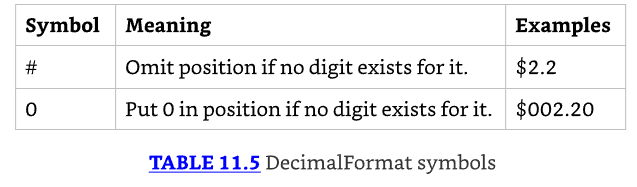

Estos ejemplos deberían ayudar a iluminar cómo funcionan estos símbolos:

```java
12: double d = 1234.567;
13: NumberFormat f1 = new DecimalFormat("###,###,###.0");
14: System.out.println(f1.format(d)); // 1,234.6
15:
16: NumberFormat f2 = new DecimalFormat("000,000,000.00000");
17: System.out.println(f2.format(d)); // 000,001,234.56700
18:
19: NumberFormat f3 = new DecimalFormat("Your Balance $#,###,###.##");
20: System.out.println(f3.format(d)); // Your Balance $1,234.57
```

* La línea 14 muestra los dígitos en el número, redondeando al décimo más cercano después del decimal. 
* Las posiciones extra a la izquierda se omiten porque usamos #. 
* La línea 17 agrega ceros iniciales y finales para hacer que la salida tenga la longitud deseada. 
* La línea 20 muestra prefijar un carácter sin formato junto con el redondeo porque se imprimen menos dígitos de los que están disponibles. 
* Observa que las comas se eliminan automáticamente si se usan entre símbolos #.
* Como verás en la sección de localización, hay una segunda clase concreta que hereda NumberFormat que necesitarás conocer para el examen.

### Formatting Dates and Times

Las clases date y time soportan muchos métodos para obtener datos de ellas.

```java
LocalDate date = LocalDate.of(2022, Month.OCTOBER, 20);
System.out.println(date.getDayOfWeek()); // THURSDAY
System.out.println(date.getMonth());  // OCTOBER
System.out.println(date.getYear());   // 2022
System.out.println(date.getDayOfYear()); // 293
```

Java proporciona una clase llamada DateTimeFormatter para mostrar formatos estándar.

```java
LocalDate date = LocalDate.of(2022, Month.OCTOBER, 20);
LocalTime time = LocalTime.of(11, 12, 34);
LocalDateTime dt = LocalDateTime.of(date, time);

System.out.println(date.format(DateTimeFormatter.ISO_LOCAL_DATE));
System.out.println(time.format(DateTimeFormatter.ISO_LOCAL_TIME));
System.out.println(dt.format(DateTimeFormatter.ISO_LOCAL_DATE_TIME));

// se imprime
// 2022-10-20
// 11:12:34
// 2022-10-20T11:12:34
```

El DateTimeFormatter lanzará una excepción si encuentra un tipo incompatible. 
Por ejemplo, cada uno de los siguientes producirá una excepción at runtime, ya que intenta formatear una fecha con un valor de tiempo, y viceversa:

```java
date.format(DateTimeFormatter.ISO_LOCAL_TIME); // RuntimeException
time.format(DateTimeFormatter.ISO_LOCAL_DATE); // RuntimeException
```

### Customizing the Date/Time Format

Si no quieres usar uno de los formatos predefinidos, DateTimeFormatter soporta un formato personalizado usando un date format String.

```java
var f = DateTimeFormatter.ofPattern("MMMM dd, yyyy 'at' hh:mm");
System.out.println(dt.format(f)); // October 20, 2022 at 11:12
```

* Desglosemos esto un poco. Java asigna a cada letra o símbolo una parte específica de date/time. 
* Por ejemplo, M se usa para month, mientras que y se usa para year. ¡Y el caso importa! Usar `m` en lugar de M significa que retornará el minuto de la hora, no el mes del año.
* ¿Qué pasa con el número de símbolos? El número a menudo dicta el formato de la parte date/time. 
* Usar M por sí solo produce el número mínimo de caracteres para un mes, como 1 para January, mientras que usar MM siempre produce dos dígitos, como 01. Además, usar MMM imprime la abreviación de tres letras, como Jul para July, mientras que MMMM imprime el nombre completo del mes.

---------------------------------------------------------------------
Es posible, aunque improbable, encontrarse con preguntas en el examen que usan SimpleDateFormat en lugar del más útil DateTimeFormatter. 
Si lo ves en el examen usado con un objeto `java.util.Date` antiguo, solo debes saber que los formatos personalizados que probablemente aparecerán en el examen serán compatibles con ambos.
---------------------------------------------------------------------

### Learning the Standard Date/Time Symbols

* Para el examen, deberías estar lo suficientemente familiarizado con los varios símbolos para que puedas mirar un date/time String y tener una buena idea de cuál será la salida. 
* Table 11.6 incluye los símbolos con los que deberías estar familiarizado para el examen.

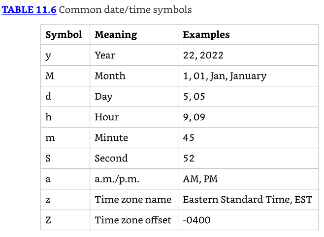

Intentemos algunos ejemplos. ¿Qué crees que imprime lo siguiente?

```java
var dt = LocalDateTime.of(2022, Month.OCTOBER, 20, 6, 15, 30);

var formatter1 = DateTimeFormatter.ofPattern("MM/dd/yyyy hh:mm:ss");
System.out.println(dt.format(formatter1)); // 10/20/2022 06:15:30

var formatter2 = DateTimeFormatter.ofPattern("MM_yyyy_-_dd");
System.out.println(dt.format(formatter2)); // 10_2022_-_20

var formatter3 = DateTimeFormatter.ofPattern("h:mm z");
System.out.println(dt.format(formatter3)); // DateTimeException
```

* El primer ejemplo imprime la fecha, con el mes antes del día, seguido por el tiempo. 
* El segundo ejemplo imprime la fecha en un formato extraño con caracteres extra que simplemente se muestran como parte de la salida.
* El tercer ejemplo lanza una excepción at runtime porque el LocalDateTime subyacente no tiene una time zone especificada. 
* Si ZonedDateTime fuera usado en su lugar, el código se completaría exitosamente e imprimiría algo como 06:15 EDT, dependiendo de la time zone.

* Como viste en el ejemplo anterior, necesitas asegurarte de que el format String sea compatible con el tipo date/time subyacente. 
* Table 11.7 muestra qué símbolos puedes usar con cada uno de los objetos date/time.
* Asegúrate de saber qué símbolos son compatibles con qué tipos date/time. Por ejemplo, intentar formatear un mes para un LocalTime o una hora para un LocalDate resultará en una runtime exception.

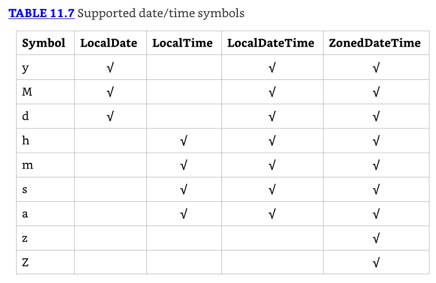

### Selecting a format() Method

* Las clases date/time contienen un método format() que tomará un formatter, mientras que las clases formatter contienen un método format() que tomará un valor date/time. 
* El resultado es que cualquiera de los siguientes es aceptable:

```java
var dateTime = LocalDateTime.of(2022, Month.OCTOBER, 20, 6, 15, 30);
var formatter = DateTimeFormatter.ofPattern("MM/dd/yyyy hh:mm:ss");

System.out.println(dateTime.format(formatter)); // 10/20/2022 06:15:30
System.out.println(formatter.format(dateTime)); // 10/20/2022 06:15:30
```

Estos statements imprimen el mismo valor at runtime. Qué sintaxis uses depende de ti.

### Adding Custom Text Values

* ¿Qué pasa si quieres que tu formato incluya algunos valores de texto personalizados? Si simplemente los escribes como parte del format String, el formatter interpretará cada carácter como un símbolo date/time. 
* En el mejor caso, mostrará datos extraños basados en símbolos extra que ingreses. 
* En el peor caso, lanzará una excepción porque los caracteres contienen símbolos inválidos. ¡Ninguno es deseable!
* Una forma de abordar esto sería dividir el formatter en múltiples formatters más pequeños y luego concatenar los resultados.

```java
var dt = LocalDateTime.of(2022, Month.OCTOBER, 20, 6, 15, 30);

var f1 = DateTimeFormatter.ofPattern("MMMM dd, yyyy ");
var f2 = DateTimeFormatter.ofPattern(" hh:mm");
System.out.println(dt.format(f1) + "at" + dt.format(f2));
// Esto imprime:  October 20, 2022 at 06:15 at runtime.
```

* Aunque esto funciona, podría volverse difícil si muchos valores de texto y símbolos de fecha están entremezclados. 
* Afortunadamente, Java incluye una solución mucho más simple. Puedes escape el texto rodeándolo con un par de comillas simples `(')`. 
* Escapar texto instruye al formatter a ignorar los valores dentro de las comillas simples y simplemente insertarlos como parte del valor final.

```java
var f = DateTimeFormatter.ofPattern("MMMM dd, yyyy 'at' hh:mm");
System.out.println(dt.format(f)); // October 20, 2022 at 06:15
```

* Pero ¿qué pasa si necesitas mostrar una comilla simple en la salida también? 
* Bienvenido a la diversión de escapar caracteres Java soporta esto poniendo dos comillas simples una al lado de la otra.
* Concluimos nuestra discusión de date formatting con algunos ejemplos de formatos y su salida que dependen de valores de texto, mostrados aquí:

```java
var g1 = DateTimeFormatter.ofPattern("MMMM dd', Party''s at' hh:mm");
System.out.println(dt.format(g1)); // October 20, Party's at 06:15

var g2 = DateTimeFormatter.ofPattern("'System format, hh:mm: 'hh:mm");
System.out.println(dt.format(g2)); // System format, hh:mm: 06:15

var g3 = DateTimeFormatter.ofPattern("'NEW! 'yyyy', yay!'");
System.out.println(dt.format(g3)); // NEW! 2022, yay!
```

Si no escapas los valores de texto con comillas simples, se lanzará una excepción at runtime si el texto no puede interpretarse como un símbolo date/time.

```java
DateTimeFormatter.ofPattern("The time is hh:mm"); // Exception thrown
```

Esta línea lanza una excepción, ya que T es un símbolo desconocido. El examen también podría presentarte una secuencia de escape incompleta.

```java
DateTimeFormatter.ofPattern("'Time is: hh:mm: "); // Exception thrown
```

Fallar en terminar una secuencia de escape desencadenará una excepción at runtime.

## Supporting Internationalization and Localization

* Muchas aplicaciones necesitan trabajar en diferentes países y con diferentes idiomas. 
* Por ejemplo, considera la oración "The zoo is holding a special event on 4/1/22 to look at animal behaviors." 
* ¿Cuándo es el evento? En Estados Unidos, es el 1 de abril. Sin embargo, un lector británico interpretaría esto como el 4 de enero. 
* Un lector británico también podría preguntarse por qué no escribimos "behaviours." 
* Si estamos haciendo un sitio web o programa que será usado en múltiples países, queremos usar el idioma y formato correctos.
* Internationalization es el proceso de diseñar tu programa para que pueda ser adaptado. 
* Esto involucra colocar strings en un archivo de propiedades y asegurar que los formateadores de datos apropiados sean usados. 
* Localization significa dar soporte a múltiples locales o regiones geográficas. Puedes pensar en un locale como un emparejamiento de idioma y país. 
* La localización incluye traducir strings a diferentes idiomas. También incluye mostrar fechas y números en el formato correcto para ese locale.

---------------------------------------------------------------------
* Inicialmente, tu programa no necesita dar soporte a múltiples locales. 
* La clave es hacer tu aplicación preparada para el futuro usando estas técnicas. 
* De esta manera, cuando tu producto se vuelva exitoso, puedes agregar soporte para nuevos idiomas o regiones sin reescribir todo.
* En esta sección, vemos cómo definir un locale y usarlo para formatear fechas, números y strings.
---------------------------------------------------------------------

### Picking a Locale

* Mientras Oracle define un locale como "una región geográfica, política o cultural específica," solo verás idiomas y países en el examen. 
* Oracle ciertamente no va a profundizar en regiones políticas que no son países. ¡Eso es demasiado controversial para un examen!
* La clase Locale está en el paquete java.util. El primer Locale útil para encontrar es el locale actual del usuario. 
* Intenta ejecutar el siguiente código en tu computadora:

```java
Locale locale = Locale.getDefault();
System.out.println(locale);
```

* Cuando lo ejecutamos, imprime en_US. Podría ser diferente para ti. 
* Esta salida predeterminada nos dice que nuestras computadoras están usando inglés y están ubicadas en Estados Unidos.

* Observe el formato. Primero viene el código de idioma en minúsculas. El idioma siempre es obligatorio. Luego viene un guion bajo seguido del código de país en mayúsculas. 
* El país es opcional. La Figura 11.6 muestra los dos formatos de los objetos Locale que debe recordar.

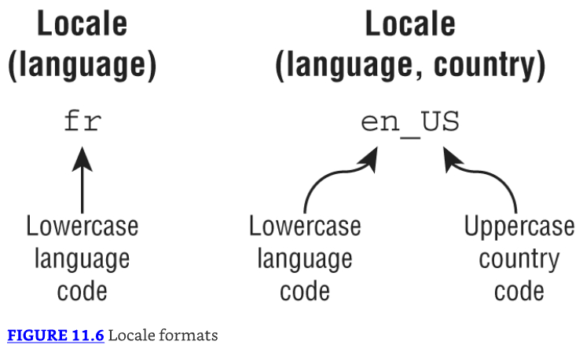

Como práctica, asegúrese de comprender por qué cada uno de estos identificadores de configuración regional no es válido:

US // No puede tener país sin idioma
enUS // Falta el guion bajo
US_en // El país y el idioma están invertidos
EN // El idioma debe estar en minúsculas

---------------------------------------------------------------------
* No necesitas memorizar códigos de idioma o país. El examen te informará sobre cualquiera que esté siendo usado. 
* Sí necesitas reconocer formatos válidos e inválidos. Presta atención a mayúsculas/minúsculas y al guion bajo. 
* Por ejemplo, si ves un locale expresado como es_CO, entonces deberías saber que el idioma es y el país es CO, incluso si no sabías que representan español y Colombia, respectivamente.
---------------------------------------------------------------------

* Como desarrollador, a menudo necesitas escribir código que selecciona un locale distinto al predeterminado. 
* Hay tres formas comunes de hacer esto. La primera es usar las constantes integradas en la clase Locale, disponibles para algunos locales comunes.

```java
System.out.println(Locale.GERMAN); // de
System.out.println(Locale.GERMANY); // de_DE
```

* El primer ejemplo selecciona el idioma alemán, que se habla en muchos países, incluyendo Austria (de_AT) y Liechtenstein (de_LI). 
* El segundo ejemplo selecciona tanto alemán el idioma como Alemania el país. Aunque estos ejemplos pueden lucir similares, no son lo mismo. 
* Solo uno incluye un código de país.

* La segunda forma de seleccionar un Locale es usar los constructores para crear un nuevo objeto. 
* Puedes pasar solo un idioma, o tanto un idioma como un país:

```java
System.out.println(new Locale("fr"));     // fr
System.out.println(new Locale("hi", "IN")); // hi_IN
```

* El primero es el idioma francés, y el segundo es hindi en India. Nuevamente, no necesitas memorizar los códigos. 
* Hay otro constructor que te permite ser aún más específico sobre el locale. Por suerte, proporcionar un valor variant no está en el examen.

* Java te permitirá crear un Locale con un idioma o país inválido, como xx_XX. 
* Sin embargo, no coincidirá con el Locale que quieres usar, y tu programa no se comportará como se espera.

* Hay una tercera forma de crear un Locale que es más flexible. 
* El patrón de diseño builder te permite establecer todas las propiedades que te interesan y luego construir el Locale al final. 
* Esto significa que puedes especificar las propiedades en cualquier orden. Los siguientes dos valores de Locale ambos representan en_US:

```java
Locale l1 = new Locale.Builder()
  .setLanguage("en")
  .setRegion("US")
  .build();

Locale l2 = new Locale.Builder()
  .setRegion("US")
  .setLanguage("en")
  .build();
```

Cuando estás probando un programa, podrías necesitar usar un Locale distinto al predeterminado de tu computadora.

* Pruébalo, y no te preocupes—el Locale cambia solo para ese único programa Java. No cambia ninguna configuración en tu computadora. 
* Ni siquiera cambia futuras ejecuciones del mismo programa.


```java

```

---------------------------------------------------------------------
Loading Properties with Resource Bundles
Summary