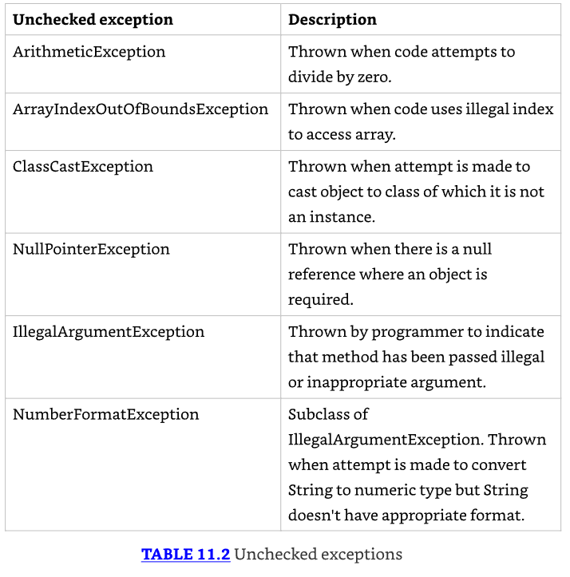

# Exceptions & Localization

## Understanding Exceptions

Un programa puede fallar por casi cualquier razón. Algunas posibilidades:

* El código intenta conectarse a un sitio web, pero la conexión a Internet está caída
* Se cometió un error de programación e intentaste acceder a un índice inválido en un array
* Un método llama a otro con un valor que el método no soporta

* Algunos de estos son errores de programación. Otros están completamente fuera de tu control. 
* Tu programa no puede evitar que la conexión a Internet se caiga. Lo que puede hacer es lidiar con la situación.

### El rol de las excepciones (Exceptions)

Una `exception` es la forma en que Java dice "Me rindo. No sé qué hacer ahora. 
Tú lídialo." Cuando escribes un método, puedes lidiar con la excepción o hacer que sea problema del código que llama.

---------------------------------------------------------------------
**Return Codes vs. Exceptions**

* Las excepciones se usan cuando "algo sale mal". Sin embargo, la palabra **wrong** es subjetiva. 
* El siguiente código retorna `-1` en lugar de lanzar una excepción si no se encuentra coincidencia:

```java
public int indexOf(String[] names, String name) {
    for (int i = 0; i < names.length; i++) {
        if (names[i].equals(name)) { return i; }
    }
    return -1;
}
```

* Aunque es común para ciertas tareas como búsqueda, los códigos de retorno generalmente deberían evitarse. 
* Después de todo, Java proporcionó un framework de excepciones, ¡así que deberías usarlo!
---------------------------------------------------------------------

### Understanding Exception Types

Una excepción es un evento que altera el flujo del programa. Java tiene una clase `Throwable` para todos los objetos que representan estos eventos. 
No todos ellos tienen la palabra exception en el nombre de su clase, lo cual puede ser confuso. La Figura 11.1 muestra las subclases clave de Throwable.


### Checked Exceptions

* Una checked exception es una excepción que debe ser declarada o manejada por el código de aplicación donde es lanzada. 
* En Java, las checked exceptions heredan de Exception pero no de RuntimeException. 
* Las checked exceptions tienden a ser más anticipadas—por ejemplo, intentar leer un archivo que no existe.

---------------------------------------------------------------------
Nota sobre `Checked Exceptions`
Las `checked exceptions` también incluyen cualquier clase que herede de `Throwable` pero no de `Error` o `RuntimeException`, como una clase que directamente extiende `Throwable`. 
Para el examen, solo necesitas saber sobre `checked exceptions` que extienden `Exception`.
---------------------------------------------------------------------

* ¿Checked exceptions? ¿Qué estamos chequeando? Java tiene una regla llamada handle or declare rule. 
* La handle or declare rule significa que todas las `checked exceptions` que podrían ser lanzadas dentro de un método están envueltas en bloques `try` y `catch` compatibles o declaradas en la firma del método.
* Como las `checked exceptions` tienden a ser anticipadas, Java fuerza la regla de que el programador debe hacer algo para mostrar que la excepción fue considerada.
* Tal vez fue manejada en el método. O tal vez el método declara que no puede manejar la excepción y alguien más debería.

Veamos un ejemplo. El siguiente método `fall()` declara que podría lanzar una `IOException`, que es una `checked exception`:

```java
void fall(int distance) throws IOException {
    if(distance> 10) {
        throw new IOException();
    }
}
```

Nota que estás usando dos palabras clave diferentes aquí. La palabra clave `throw` le dice a Java que quieres lanzar una `Exception`, mientras que la palabra clave `throws` simplemente declara que el método podría lanzar una `Exception`. También podría no hacerlo.

Ahora que sabes cómo declarar una excepción, ¿cómo la manejas? La siguiente versión alternativa del método `fall()` maneja la excepción:

```java
void fall(int distance) {
    try {
        if(distance> 10) {
            throw new IOException();
        }
    } catch (Exception e) {
        e.printStackTrace();
    }
}
```

* Nota que la declaración `catch` usa `Exception`, no `IOException`. Como `IOException` es una subclase de `Exception`, el bloque catch está permitido para capturarla. 
* Cubriremos los bloques `try` y `catch` con más detalle más adelante en este capítulo.

### Unchecked Exceptions

Una `unchecked exception` es cualquier excepción que no necesita ser declarada o manejada por el código de aplicación donde es lanzada. 
Las `unchecked exceptions` a menudo son referidas como runtime exceptions, aunque en Java, las `unchecked exceptions` incluyen cualquier clase que hereda `RuntimeException` o `Error`.

---------------------------------------------------------------------
**Tip sobre Unchecked Exceptions**
* Es permisible manejar o declarar una unchecked exception. 
* Dicho esto, es mejor documentar las unchecked exceptions que los llamadores deberían conocer en un comentario Javadoc en lugar de declarar una unchecked exception.
---------------------------------------------------------------------

* Una runtime exception se define como la clase RuntimeException y sus subclases. 
* Las runtime exceptions tienden a ser inesperadas pero no necesariamente fatales. 
* Por ejemplo, acceder a un índice de array inválido es inesperado. Aunque heredan de la clase Exception, no son checked exceptions.

* Una unchecked exception puede ocurrir en casi cualquier línea de código, ya que no se requiere que sea manejada o declarada. 
* Por ejemplo, una `NullPointerException` puede ser lanzada en el cuerpo del siguiente método si la referencia de entrada es `null`:

```java
void fall(String input) {
    System.out.println(input.toLowerCase());
}
```

* Trabajamos con objetos en Java tan frecuentemente que una `NullPointerException` puede ocurrir casi en cualquier lugar. 
* Si tuvieras que declarar `unchecked exceptions` en todas partes, ¡cada método individual tendría ese desorden! 
* El código compilará si declaras una unchecked exception. Sin embargo, es redundante.

### Error and Throwable

* Error significa que algo salió tan terriblemente mal que tu programa no debería intentar recuperarse de ello. 
* Por ejemplo, el disco duro "desapareció" o el programa se quedó sin memoria. 
* Estas son condiciones anormales que no es probable que encuentres y de las cuales no puedes recuperarte.

* Para el examen, lo único que necesitas saber sobre `Throwable` es que es la clase padre de todas las excepciones, incluyendo la clase `Error`. 
* Mientras puedes manejar excepciones `Throwable` y `Error`, no se recomienda que lo hagas en tu código de aplicación. 
* Cuando nos referimos a excepciones en este capítulo, generalmente queremos decir cualquier clase que hereda Throwable, aunque casi siempre estamos trabajando con la clase `Exception` o subclases de ella.

### Reviewing Exception Types

* Asegúrate de estudiar cuidadosamente todo en la Tabla 11.1. Para el examen, recuerda que un `Throwable` es ya sea una `Exception` o un `Error`. 
* No deberías capturar Throwable directamente en tu código.


### Throwing an Exception

* Cualquier código Java puede lanzar una excepción; esto incluye código que escribes. Algunas excepciones son proporcionadas con Java. 
* Podrías encontrar una excepción que fue inventada para el examen. Esto está bien. 
* La pregunta lo hará obvio que es una excepción al hacer que el nombre de la clase termine con Exception. 
* Por ejemplo, `MyMadeUpException` es claramente una excepción.

En el examen, verás dos tipos de código que resultan en una excepción. El primero es código que está mal. Aquí hay un ejemplo:

```java
String[] animals = new String[0];
System.out.println(animals[0]); // ArrayIndexOutOfBoundsException
```

* Este código lanza una `ArrayIndexOutOfBoundsException` ya que el array no tiene elementos. 
* Eso significa que las preguntas sobre excepciones pueden estar ocultas en preguntas que parecen ser sobre algo más.

---------------------------------------------------------------------
**Nota sobre preguntas del examen**
* En el examen, algunas preguntas tienen una opción sobre no compilar y sobre lanzar una excepción. 
* Presta atención especial al código que llama un método en una referencia null o que referencia un índice inválido de array o List. 
* Si detectas esto, sabes que la respuesta correcta es que el código lanza una excepción en tiempo de ejecución.
---------------------------------------------------------------------

* La segunda forma en que el código resulta en una excepción es solicitar explícitamente a Java que lance una. 
* Java te permite escribir declaraciones como estas:

```java
throw new Exception();
throw new Exception("Ow! I fell.");
throw new RuntimeException();
throw new RuntimeException("Ow! I fell.");
```

* La palabra clave throw le dice a Java que quieres que alguna otra parte del código maneje la excepción. 
* Esto es lo mismo que la niña pequeña llorando por su papá. Alguien más necesita averiguar qué hacer sobre la excepción.

---------------------------------------------------------------------
**throw vs. throws**
Cada vez que veas throw o throws en el examen, asegúrate de que se esté usando el correcto. 
La palabra clave throw se usa como una declaración dentro de un bloque de código para lanzar una nueva excepción o relanzar una excepción existente, mientras que la palabra clave throws se usa solo al final de una declaración de método para indicar qué excepciones soporta.
---------------------------------------------------------------------

* Cuando creas una excepción, usualmente puedes pasar un parámetro String con un mensaje, o puedes no pasar parámetros y usar los valores por defecto. 
* Decimos usually porque esto es una convención. Alguien ha declarado un constructor que toma un String. 
* Alguien también podría crear una clase de excepción que no tenga un constructor que tome un mensaje.

Adicionalmente, deberías saber que una Exception es un Object. Esto significa que puedes almacenarla en una referencia de objeto, y esto es legal:

```java
var e = new RuntimeException();
throw e;
```

* El código instancia una excepción en una línea y luego la lanza en la siguiente. 
* La excepción puede venir de cualquier lugar, incluso pasada a un método. Mientras sea una excepción válida, puede ser lanzada.

El examen también podría intentar engañarte. ¿Ves por qué este código no compila?

```java
throw RuntimeException(); // DOES NOT COMPILE
```

Si tu respuesta es que falta una palabra clave, tienes absolutamente razón. La excepción nunca es instanciada con la palabra clave `new`.

Veamos otro lugar donde el examen podría intentar engañarte. ¿Puedes ver por qué lo siguiente no compila?

```java
3: try {
4:     throw new RuntimeException();
5:     throw new ArrayIndexOutOfBoundsException(); // DOES NOT COMPILE
6: } catch (Exception e) {}
```

* Como la línea 4 se lanza una excepción, la línea 5 nunca puede ser alcanzada durante runtime. 
* El compilador reconoce esto y reporta un error de código inalcanzable.

### Calling Methods That Throw Exceptions

Cuando estás llamando un método que lanza una excepción, las reglas son las mismas que dentro de un método. ¿Ves por qué lo siguiente no compila?

```java
class NoMoreCarrotsException extends Exception {}

public class Bunny {
    public static void main(String[] args) {
        eatCarrot(); // DOES NOT COMPILE
    }
    private static void eatCarrot() throws NoMoreCarrotsException {}
}
```

* El problema es que `NoMoreCarrotsException` es una checked exception. Las checked exceptions deben ser manejadas o declaradas. 
* El código compilaría si cambiaras el método `main()` a cualquiera de estos:

```java
public static void main(String[] args) throws NoMoreCarrotsException {
    eatCarrot();
}
```

```java
public static void main(String[] args) {
    try {
        eatCarrot();
    } catch (NoMoreCarrotsException e) {
        System.out.print("sad rabbit");
    }
}
```

* Podrías haber notado que `eatCarrot()` no lanzó una excepción; solo declaró que podría hacerlo. 
* Esto es suficiente para que el compilador requiera que el llamador maneje o declare la excepción.
* El compilador todavía está buscando código inalcanzable. Declarar una excepción no utilizada no se considera código inalcanzable. 
* Le da al método la opción de cambiar la implementación para lanzar esa excepción en el futuro. ¿Ves el problema aquí?

```java
public void bad() {
    try {
        eatCarrot();
    } catch (NoMoreCarrotsException e) { // DOES NOT COMPILE
        System.out.print("sad rabbit");
    }
}

private void eatCarrot() {}
```

Java sabe que `eatCarrot()` no puede lanzar una checked exception—lo que significa que no hay forma de que el bloque catch en `bad()` sea alcanzado.

---------------------------------------------------------------------
**Nota sobre checked exceptions en bloques catch**
* Cuando veas una checked exception declarada dentro de un bloque catch en el examen, asegúrate de que el código en el bloque try asociado sea capaz de lanzar la excepción o una subclase de la excepción. 
* Si no, el código es inalcanzable y no compila. Recuerda que esta regla no se extiende a unchecked exceptions o excepciones declaradas en una firma de método.
---------------------------------------------------------------------

### Overriding Methods with Exceptions

* Cuando introdujimos la sobrescritura de métodos en el Capítulo 6, "Class Design", incluimos una regla relacionada con excepciones. 
* Un método sobrescrito no puede declarar ninguna excepción checked nueva o más amplia que el método que hereda. Por ejemplo, este código no está permitido:

```java
class CanNotHopException extends Exception {}

class Hopper {
    public void hop() {}
}

class Bunny extends Hopper {
    public void hop() throws CanNotHopException {} // DOES NOT COMPILE
}
```

* Java sabe que `hop()` no está permitido lanzar ninguna checked exception porque el método `hop()` en la superclase Hopper no declara ninguna. 
* Imagina qué pasaría si las versiones de los métodos de las subclases pudieran agregar checked exceptions—podrías escribir código que llame al método `hop()` de Hopper y no manejar ninguna excepción. 
* Entonces, si Bunny fuera usado en su lugar, el código no sabría manejar o declarar `CanNotHopException`.
* Un método sobrescrito en una subclase está permitido declarar menos excepciones que la superclase o interfaz. 
* Esto es legal porque los llamadores ya las están manejando.

```java
class Hopper {
    public void hop() throws CanNotHopException {}
}

class Bunny extends Hopper {
    public void hop() {} // This is fine
}
```

* Un método sobrescrito que no declara una de las excepciones lanzadas por el método padre es similar al método que declara que lanza una excepción que nunca lanza realmente. 
* Esto es perfectamente legal. Similarmente, una clase está permitida declarar una subclase de un tipo de excepción. 
* La idea es la misma. La superclase o interfaz ya ha cuidado de un tipo más amplio.

### Printing an Exception

* Hay tres formas de imprimir una excepción. Puedes dejar que Java la imprima, imprimir solo el mensaje, o imprimir de dónde viene el stack trace. 
* Este ejemplo muestra los tres enfoques:

```java
5: public static void main(String[] args) {
6:     try {
7:         hop();
8:     } catch (Exception e) {
9:         System.out.println(e + "\n");
10:        System.out.println(e.getMessage()+ "\n");
11:        e.printStackTrace();
12:    }
13: }
14: private static void hop() {
15:    throw new RuntimeException("cannot hop");
16: }

// Este código imprime lo siguiente:
// java.lang.RuntimeException: cannot hop
// cannot hop
// java.lang.RuntimeException: cannot hop
//     at Handling.hop(Handling.java:15)
//     at Handling.main(Handling.java:7)
```

* La primera línea muestra lo que Java imprime por defecto: el tipo de excepción y el mensaje. 
* La segunda línea muestra solo el mensaje. El resto muestra un stack trace. 
* El stack trace usualmente es el más útil porque muestra la jerarquía de llamadas a métodos que fueron hechas para alcanzar la línea que lanzó la excepción.

## Recognizing Exception Classes

* Necesitas reconocer tres grupos de clases de excepción para el examen: RuntimeException, checked Exception, y Error. 
* Miramos ejemplos comunes de cada tipo. Para el examen, necesitarás reconocer qué tipo de excepción es y si es lanzada por la Java Virtual Machine (JVM) o por un programador. 
* Para algunas excepciones, también necesitas saber cuáles son heredadas de una a otra.

### RuntimeException Classes

* RuntimeException y sus subclases son unchecked exceptions que no tienen que ser manejadas o declaradas. 
* Pueden ser lanzadas por el programador o la JVM. Las clases de unchecked exception comunes están listadas en la Tabla 11.2.



### ArithmeticException

Intentar dividir un int por cero da un resultado indefinido. Cuando esto ocurre, la JVM lanzará una `ArithmeticException`:

```java
int answer = 11 / 0;

// Ejecutar este código resulta en la siguiente salida:
// Exception in thread "main" java.lang.ArithmeticException: / by zero
```

* Java no deletrea la palabra divide. Eso está bien, sin embargo, porque sabemos que / es el operador de división y que Java está intentando decirte que ocurrió una división por cero.
* El thread "main" te está diciendo que el código fue llamado directa o indirectamente desde un programa con un método main. 
* En el examen, esto es toda la salida que verás. Luego viene el nombre de la excepción, seguido por información extra (si hay alguna) que va con la excepción.

### ArrayIndexOutOfBoundsException

Ya sabes ahora que los índices de array empiezan con 0 y van hasta 1 menos que la longitud del array—lo que significa que este código lanzará una `ArrayIndexOutOfBoundsException`:

```java
int[] countsOfMoose = new int[3];
System.out.println(countsOfMoose[-1]);
```

Este es un problema porque no existe tal cosa como un índice de array negativo. Ejecutar este código produce la siguiente salida:

`Exception in thread "main" java.lang.ArrayIndexOutOfBoundsException: Index -1 out of bounds for length 3`

### ClassCastException

Java intenta protegerte de casts imposibles. Este código no compila porque Integer no es una subclase de String:

```java
String type = "moose";
Integer number = (Integer) type; // DOES NOT COMPILE
```

Código más complicado frustra los intentos de Java de protegerte. Cuando el cast falla en runtime, Java lanzará una `ClassCastException`:

```java
String type = "moose";
Object obj = type;
Integer number = (Integer) obj; // ClassCastException
```

El compilador ve un cast de Object a Integer. Esto podría estar bien. El compilador no se da cuenta de que hay un String en ese Object. Cuando el código se ejecuta, produce la siguiente salida:

```java
Exception in thread "main" java.lang.ClassCastException: java.base/
java.lang.String
cannot be cast to java.lang.base/java.lang.Integer
```

Java te dice ambos tipos que estuvieron involucrados en el problema, haciendo evidente qué está mal.

### NullPointerException

Las variables de instancia y los métodos deben ser llamados en una referencia no-null. Si la referencia es null, la JVM lanzará una NullPointerException.

```java
1: public class Frog {
2:     public void hop(String name, Integer jump) {
3:         System.out.print(name.toLowerCase() + " " + jump.intValue());
4:     }
5:
6:     public static void main(String[] args) {
7:         new Frog().hop(null, 1);
8:     }
}
```


```java

```


Handling Exceptions
Automating Resource Management
Formatting Values
Supporting Internationalization and Localization
Loading Properties with Resource Bundles
Summary