# Módulos

## Introducing Modules

* Al escribir código para el examen, generalmente ves clases pequeñas. Después de todo, las preguntas del examen tienen que caber en una sola pantalla.
* Cuando trabajas en programas reales, son mucho más grandes. Un proyecto real consistirá de cientos o miles de clases agrupadas en paquetes. 
* Estos paquetes se agrupan en archivos Java (JAR). Un JAR es un archivo ZIP con algo de información extra, y la extensión es .jar.
* Además del código escrito por tu equipo, la mayoría de las aplicaciones también usan código escrito por otros. 
* Open source es software con el código suministrado y a menudo es gratuito de usar. 
* Java tiene una vibrante comunidad de software de código abierto (OSS), y esas bibliotecas también se suministran como archivos JAR. 
* Por ejemplo, hay bibliotecas para leer archivos, conectarse a una base de datos, y mucho más.
* Algunos proyectos de código abierto incluso dependen de funcionalidad en otros proyectos de código abierto. 
* Por ejemplo, Spring es un framework comúnmente usado, y JUnit es una biblioteca de pruebas comúnmente usada. 
* Para usar cualquiera de ellas, necesitas asegurarte de tener versiones compatibles de todos los JARs relevantes disponibles en tiempo de ejecución. 
* Esta compleja cadena de dependencias y versiones mínimas es a menudo referida por la comunidad como JAR hell. 
* Hell es una excelente manera de describir la versión incorrecta de una clase siendo cargada o incluso una `ClassNotFoundException` en tiempo de ejecución.

* El Java Platform Module System (JPMS) agrupa código a un nivel más alto. 
* El propósito principal de un módulo es proporcionar grupos de paquetes relacionados que ofrecen a los desarrolladores un conjunto particular de funcionalidad. 
* Es como un archivo JAR, excepto que un desarrollador elige qué paquetes son accesibles fuera del módulo. 
* Veamos qué son los módulos y qué problemas están diseñados para resolver.

El Sistema de Módulos de la Plataforma Java incluye lo siguiente:
* Un formato para archivos JAR de módulos
* Particionamiento del JDK en módulos
* Opciones adicionales de línea de comandos para herramientas Java

### Explorando un Módulo

En Capítulo 1, "Building Blocks," tuvimos una pequeña aplicación Zoo. Tenía solo una clase y simplemente imprimía una cosa. 
Ahora imagina que teníamos todo un equipo de programadores y estábamos automatizando las operaciones del zoológico. 
Muchas cosas necesitan ser codificadas, incluyendo las interacciones con los animales, visitantes, el sitio web público, y alcance comunitario.
Un module es un grupo de uno o más paquetes más un archivo especial llamado `module-info.java`. 
Los contenidos de este archivo son la `module declaration`.
Decidimos enfocarnos en las interacciones con los animales en nuestro ejemplo. 
El zoológico completo podría fácilmente tener una docena de módulos. 
En Figure 12.1, nota que hay flechas entre muchos de los módulos. 
Estas representan dependencies, donde un módulo depende del código en otro. 
El personal necesita alimentar a los animales para mantener sus trabajos. La línea desde `zoo.staff` a `zoo.animal.feeding` muestra que el primero depende del último.


* Ahora profundicemos en uno de estos módulos. Figure 12.2 muestra qué hay dentro del módulo `zoo.animal.talks`. 
* Hay tres paquetes con dos clases cada uno. (Es un zoológico pequeño.) 
* También hay un archivo extraño llamado `module-info.java`. Este archivo es requerido para estar dentro de todos los módulos. 
* Explicamos esto con más detalle más adelante en el capítulo.


### Benefits of Modules

Los módulos parecen otra capa de cosas que necesitas conocer para programar. 
Aunque usar módulos es opcional, es importante entender los problemas que están diseñados para resolver:

* Better access control: Además de los niveles de control de acceso cubiertos en Chapter 5, "Methods," puedes tener paquetes que solo son accesibles a otros paquetes en el módulo.
* Clearer dependency management: Dado que los módulos especifican en qué dependen, Java puede quejarse sobre un JAR faltante al iniciar el programa en lugar de cuando es accedido por primera vez en tiempo de ejecución.
* Custom Java builds: Puedes crear un Java runtime que tiene solo las partes del JDK que tu programa necesita en lugar del completo de más de 150 MB.
* Improved security: Dado que puedes omitir partes del JDK de tu construcción personalizada, no tienes que preocuparte sobre vulnerabilidades descubiertas en una parte que no usas.
* Improved performance: Otro beneficio de un paquete Java más pequeño es un tiempo de inicio mejorado y un requerimiento de memoria menor.
* Unique package enforcement: Dado que los módulos especifican paquetes expuestos, Java puede asegurar que cada paquete proviene de solo un módulo y evitar confusión sobre qué está siendo ejecutado.

## Creating and Running a Modular Program

* En esta sección, creamos, construimos, y ejecutamos el módulo zoo.animal.feeding. 
* Elegimos este para comenzar porque todos los otros módulos dependen de él. Figure 12.3 muestra el diseño de este módulo. 
* Además del archivo `module-info.java`, tiene un paquete con una clase dentro.


En las siguientes secciones, creamos, compilamos, ejecutamos, y empaquetamos el módulo zoo.animal.feeding.

### Creating the Files

Primero tenemos una clase realmente simple que imprime una línea en un método main(). Sabemos, eso no es mucho de una implementación. 
Todos esos programadores que contratamos pueden llenarlo con lógica de negocio. 
En este libro, nos enfocamos en lo que necesitas conocer para el examen. Entonces, creemos una clase simple.

```java
package zoo.animal.feeding;

public class Task {
  public static void main(String... args) {
    System.out.println("All fed!");
  }
}
```

A continuación viene el archivo `module-info.java`. Este es el más simple posible:

```java
module zoo.animal.feeding {
}
```

Hay unas pocas diferencias clave entre una declaración de módulo y una declaración de clase Java regular:

* El archivo `module-info.java` debe estar en el directorio raíz de tu módulo. Las clases Java regulares deberían estar en paquetes.
* La declaración de módulo debe usar la palabra clave `module` en lugar de class, interface, o enum.
* El nombre del módulo sigue las reglas de nomenclatura para nombres de paquetes. A menudo incluye puntos (.) en su nombre. Los nombres de clases y paquetes regulares no están permitidos tener guiones (-). Los nombres de módulos siguen la misma regla.

* Eso es un montón de reglas para el archivo más simple posible. Habrá muchas más reglas cuando desarrollemos este archivo más adelante en el capítulo.
* El siguiente paso es asegurarse de que los archivos estén en la estructura de directorios correcta. Figure 12.4 muestra la estructura de directorios esperada.


* En particular, feeding es el directorio del módulo, y el archivo `module-info.java` está directamente bajo él. 
* Justo como con un archivo JAR regular, también tenemos el paquete zoo.animal.feeding con una sub carpeta por porción del nombre. 
* La clase Task está en la sub carpeta apropiada para su paquete.
* También, nota que creamos un directorio llamado mods al mismo nivel que el módulo.
* Lo usamos para almacenar los artefactos del módulo un poco más adelante en el capítulo. 
* Este directorio puede ser nombrado de cualquier manera, pero mods es un nombre común. 
* Si estás siguiendo junto con el ejemplo de código en línea, nota que el directorio mods no está incluido, porque está vacío.

### Compiling Our First Module

Antes de que podamos ejecutar código modular, necesitamos compilarlo. Aparte de la opción module-path, este código debería verse familiar desde Chapter 1:

```java
javac --module-path mods
  -d feeding
  feeding/zoo/animal/feeding/*.java feeding/module-info.java
```

---------------------------------------------------------------------
Cuando estás ingresando comandos en la línea de comandos, deberían ser escritos todos en una línea. 
Usamos saltos de línea en el libro para hacer los comandos más fáciles de leer y estudiar. 
Si quieres usar múltiples líneas en el símbolo del sistema, el enfoque varía según el sistema operativo. 
Linux usa una barra invertida (\) para escapar el salto de línea.
---------------------------------------------------------------------

* Como revisión, la opción -d especifica el directorio en el cual colocar los archivos de clase. 
* El final del comando es una lista de los archivos `.java` a compilar. 
* Puedes listar los archivos individualmente o usar un comodín para todos los archivos `.java` en un subdirectorio.
* La parte nueva es module-path. Esta opción indica la ubicación de cualquier archivo de módulo personalizado. 
* En este ejemplo, module-path podría haber sido omitido dado que no hay dependencias. 
* Puedes pensar en module-path como reemplazando la opción classpath cuando estás trabajando en un programa modular.

---------------------------------------------------------------------
What about the classpath?
La opción classpath tiene tres formas posibles: -cp, --class-path, y -classpath. Todavía puedes usar estas opciones. 
De hecho, es común hacerlo cuando escribes programas no modulares.
---------------------------------------------------------------------

* Justo como classpath, puedes usar una abreviación en el comando. La sintaxis --module-path y -p son equivalentes. 
* Eso significa que podríamos haber escrito muchos otros comandos en lugar del comando previo. 
* Los siguientes cuatro comandos muestran la opción -p:

```java
javac -p mods -d feeding
  feeding/zoo/animal/feeding/*.java feeding/*.java

javac -p mods -d feeding
  feeding/zoo/animal/feeding/*.java feeding/module-info.java

javac -p mods -d feeding
  feeding/zoo/animal/feeding/Task.java feeding/module-info.java
  
javac -p mods -d feeding
  feeding/zoo/animal/feeding/Task.java feeding/*.java
```

* Aunque puedes usar el que gustes mejor, asegúrate de que puedes reconocer todas las formas válidas para el examen. 
* Table 12.1 lista las opciones que necesitas conocer bien cuando compilas módulos. 
* Hay muchas más opciones que puedes pasar al comando javac, pero estas son las que puedes esperar que sean evaluadas.


---------------------------------------------------------------------
**Building Modules**
* Incluso sin módulos, es raro ejecutar comandos javac y java manualmente en un proyecto real. 
* Se vuelven largos y complicados muy rápidamente. La mayoría de los desarrolladores usan una herramienta de construcción como Maven o Gradle. 
* Estas herramientas de construcción sugieren directorios en los cuales colocar los archivos de clase, como target/classes.
* Es probable que la única vez que necesites conocer la sintaxis de estos comandos sea cuando tomes el examen. 
* Los conceptos en sí mismos son útiles, independientemente.
* Asegúrate de memorizar la sintaxis del comando `module`. Serás evaluado en ello en el examen. 
* Te damos muchas preguntas de práctica sobre la sintaxis para reforzarlo.
---------------------------------------------------------------------

### Running Our First Module

* Antes de que empaquetemos nuestro módulo, deberíamos asegurarnos de que funcione ejecutándolo. 
* Para hacer eso, necesitamos aprender la sintaxis completa. Supón que hay un módulo llamado `book.module`. 
* Dentro de ese módulo hay un paquete llamado com.sybex, el cual tiene una clase llamada OCP con un método main(). 
* Figure 12.5 muestra la sintaxis para ejecutar un módulo. Presta atención especial a la parte `book.module/com.sybex.OCP`. 
* Es importante recordar que especificas el nombre del módulo seguido por una barra (/) seguida por el nombre de clase completamente calificado.


* Ahora que hemos visto la sintaxis, podemos escribir el comando para ejecutar la clase Task en el paquete zoo.animal.feeding. 
* En el siguiente ejemplo, el nombre del paquete y el nombre del módulo son los mismos. 
* Es común que el nombre del módulo coincida con el nombre completo del paquete o el comienzo de él.

```java
java --module-path feeding
  --module zoo.animal.feeding/zoo.animal.feeding.Task
```

* Dado que ya viste que --module-path usa la forma corta de -p, apostamos que no te sorprenderás aprender que hay una forma corta de --module también. 
* La opción corta es -m. Eso significa que el siguiente comando es equivalente:

```java
java -p feeding
  -m zoo.animal.feeding/zoo.animal.feeding.Task
```

* En estos ejemplos, usamos feeding como el module path porque ahí es donde compilamos el código. 
* Esto cambiará una vez que empaquetemos el módulo y lo ejecutemos.
* Table 12.2 lista las opciones que necesitas conocer para el comando `java`.


### Packaging Our First Module

* Un módulo no es de mucha utilidad si solo podemos ejecutarlo en la carpeta en la que fue creado. 
* Nuestro siguiente paso es empaquetarlo. Asegúrate de crear un directorio mods antes de ejecutar este comando:

```java
jar -cvf mods/zoo.animal.feeding.jar -C feeding/ .
```

* No hay nada específico de módulos aquí. Estamos empaquetando todo bajo el directorio feeding y almacenándolo en un archivo JAR llamado zoo.animal.feeding.jar bajo la carpeta mods. 
* Este representa cómo el JAR del módulo se verá para otro código que quiera usarlo.
* Ahora ejecutemos el programa de nuevo, pero esta vez usando el directorio mods en lugar de las clases sueltas:

```java
java -p mods
  -m zoo.animal.feeding/zoo.animal.feeding.Task
```

* Podrías notar que este comando se ve idéntico al de la sección previa excepto por el directorio. En el ejemplo previo, era feeding. 
* En este, es el module path de mods. Dado que el module path es usado, un JAR de módulo está siendo ejecutado.

## Updating Our Example for Multiple Modules

* Ahora que nuestro módulo zoo.animal.feeding es sólido, podemos empezar a pensar sobre nuestros otros módulos. 
* Como puedes ver en Figure 12.6, los tres otros módulos en nuestro sistema dependen del módulo zoo.animal.feeding.


### Updating the Feeding Module

* Dado que tendremos nuestros otros módulos llamando código en el paquete zoo.animal.feeding, necesitamos declarar esta intención en la declaración del módulo.
* La directiva exports es usada para indicar que un módulo intenta que esos paquetes sean usados por código Java fuera del módulo. 
* Como podrías esperar, sin una directiva exports, el módulo solo está disponible para ser ejecutado desde la línea de comandos por sí mismo. 
* En el siguiente ejemplo, exportamos un paquete:

```java
module zoo.animal.feeding {
  exports zoo.animal.feeding;
}
```

* Recompilar y reempaquetar el módulo actualizará el archivo `module-info.class` dentro de nuestro archivo zoo.animal.feeding.jar. 
* Estos son los mismos comandos javac y jar que ejecutaste previamente:

```java
javac -p mods
  -d feeding
  feeding/zoo/animal/feeding/*.java feeding/module-info.java

jar -cvf mods/zoo.animal.feeding.jar -C feeding/ .
```

### Creating a Care Module

* A continuación, creemos el módulo zoo.animal.care. Esta vez, vamos a tener dos paquetes. 
* El paquete zoo.animal.care.medical tendrá las clases y métodos que están destinados para uso por otros módulos. 
* El paquete zoo.animal.care.details solo va a ser usado por este módulo. No será exportado desde el módulo. 
* Piensa en ello como privacidad de salud para los animales.

Figure 12.7 muestra los contenidos de este módulo. Recuerda que todos los módulos deben tener un archivo module-info.java.


El módulo contiene dos paquetes básicos y clases además del archivo `module-info.java`:

```java
// HippoBirthday.java
package zoo.animal.care.details;
import zoo.animal.feeding.*;

public class HippoBirthday {
    private Task task;
}

// Diet.java
package zoo.animal.care.medical;
public class Diet { }
```

Esta vez el archivo `module-info.java` especifica tres cosas:

```java
1: module zoo.animal.care {
2:   exports zoo.animal.care.medical;
3:   requires zoo.animal.feeding;
4: }
```

* Line 1 especifica el nombre del módulo. Line 2 lista el paquete que estamos exportando para que pueda ser usado por otros módulos. 
* Hasta ahora, esto es similar al módulo zoo.animal.feeding.
* En line 3, vemos una nueva directiva. La declaración requires especifica que un módulo es necesario. 
* El módulo zoo.animal.care depende del módulo zoo.animal.feeding.
* A continuación, necesitamos determinar la estructura de directorios. Crearemos dos paquetes. 
* El primero es zoo.animal.care.details y contiene una clase llamada HippoBirthday. 
* El segundo es zoo.animal.care.medical, el cual contiene una clase llamada Diet. 
* Intenta dibujar la estructura de directorios en papel o créala en tu computadora. 
* Si estás tratando de ejecutar estos ejemplos sin usar el código en línea, simplemente crea clases sin variables o métodos para todo excepto los archivos module-info.java.

* Podrías haber notado que los paquetes comienzan con el mismo prefijo que el nombre del módulo. Esto es intencional. 
* Puedes pensar en ello como si el nombre del módulo "reclama" el paquete coincidente y todos los sub paquetes.
* Para revisar, ahora compilamos y empaquetamos el módulo:

```java
javac -p mods
  -d care
  care/zoo/animal/care/details/*.java
  care/zoo/animal/care/medical/*.java
  care/module-info.java
```

* Compilamos tanto los paquetes como el archivo module-info.java. En el mundo real, usarás una herramienta de construcción en lugar de hacer esto a mano. 
* Para el examen, simplemente lista todos los paquetes y/o archivos que quieres compilar.

Ahora que hemos compilado código, es tiempo de crear el JAR del módulo:

```java
jar -cvf mods/zoo.animal.care.jar -C care/ .
```

### Creating the Talks Module

* Hasta ahora, hemos usado solo una declaración exports y requires en un módulo. 
* Ahora aprenderás cómo manejar la exportación de múltiples paquetes o requerir múltiples módulos. 
* En Figure 12.8, observa que el módulo zoo.animal.talks depende de dos módulos: zoo.animal.feeding y zoo.animal.care. 
* Esto significa que debe haber dos declaraciones requires en el archivo module-info.java.

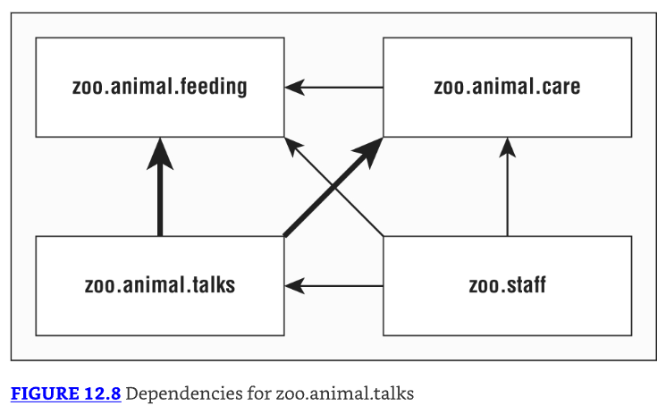

Figure 12.9 muestra los contenidos de este módulo. Vamos a exportar los tres paquetes en este módulo.

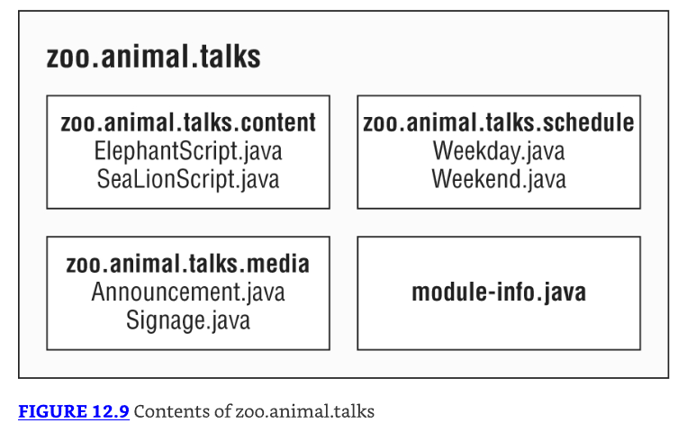

Primero veamos el archivo `module-info.java` para zoo.animal.talks:

```java
1: module zoo.animal.talks {
2:   exports zoo.animal.talks.content;
3:   exports zoo.animal.talks.media;
4:   exports zoo.animal.talks.schedule;
5:
6:   requires zoo.animal.feeding;
7:   requires zoo.animal.care;
8: }
```

* Line 1 muestra el nombre del módulo. Lines 2–4 permiten a otros módulos referenciar los tres paquetes. L
* ines 6 and 7 especifican los dos módulos de los cuales este módulo depende.
* Luego tenemos las seis clases, como se muestra aquí:

```java
// ElephantScript.java
package zoo.animal.talks.content;
public class ElephantScript { }

// SeaLionScript.java
package zoo.animal.talks.content;
public class SeaLionScript { }

// Announcement.java
package zoo.animal.talks.media;
public class Announcement {
  public static void main(String[] args) {
    System.out.println("We will be having talks");
  }
}

// Signage.java
package zoo.animal.talks.media;
public class Signage { }

// Weekday.java
package zoo.animal.talks.schedule;
public class Weekday { }

// Weekend.java
package zoo.animal.talks.schedule;
public class Weekend {}
```

Si todavía estás siguiendo en tu computadora, crea estas clases en los paquetes. Los siguientes son los comandos para compilar y construir el módulo:

```java
javac -p mods
  -d talks
  talks/zoo/animal/talks/content/*.java talks/zoo/animal/talks/media/*.java
  talks/zoo/animal/talks/schedule/*.java talks/module-info.java
  
jar -cvf mods/zoo.animal.talks.jar -C talks/ .
```

### Creating the Staff Module

Nuestro módulo final es `zoo.staff`. Figure 12.10 muestra que solo hay un paquete dentro. No estaremos exponiendo este paquete fuera del módulo.

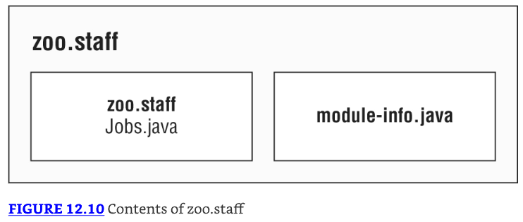

Basándose en Figure 12.11, ¿sabes qué debería ir en el module-info?

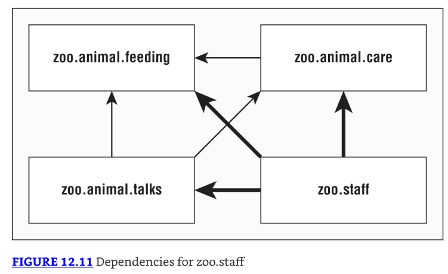

Hay tres flechas en Figure 12.11 apuntando desde `zoo.staff` a otros módulos. Estas representan los tres módulos que son requeridos. 
Dado que ningún paquete debe ser expuesto desde `zoo.staff`, no hay declaraciones exports. Esto nos da:

```java
module zoo.staff {
  requires zoo.animal.feeding;
  requires zoo.animal.care;
  requires zoo.animal.talks;
}
```

En este módulo, tenemos una sola clase en el archivo Jobs.java:

```java
package zoo.staff;
public class Jobs { }
```

* Para aquellos de ustedes que están siguiendo en su computadora, creen una clase en el paquete. 
* Los siguientes son los comandos para compilar y construir el módulo:

```java
javac -p mods
  -d staff
  staff/zoo/staff/*.java staff/module-info.java

jar -cvf mods/zoo.staff.jar -C staff/ .
```

## Diving into the Module Declaration

* Ahora que hemos creado exitosamente módulos, podemos aprender más sobre la declaración de módulo. 
* En estas secciones, vemos exports, requires, y opens. En la siguiente sección sobre servicios, exploramos provides y uses. 
* Ahora sería un buen momento para mencionar que estas directivas pueden aparecer en cualquier orden en la declaración del módulo.

### Exporting a Package

* Ya hemos visto cómo exports packageName exporta un paquete a otros módulos. También es posible exportar un paquete a un módulo específico. 
* Supón que el zoológico decide que solo los miembros del personal deberían tener acceso a las charlas. 
* Podríamos actualizar la declaración del módulo como sigue:

```java
module zoo.animal.talks {
  exports zoo.animal.talks.content to zoo.staff;
  exports zoo.animal.talks.media;
  exports zoo.animal.talks.schedule;
  
  requires zoo.animal.feeding;
  requires zoo.animal.care;
}
```

* Desde el módulo `zoo.staff`, nada ha cambiado. Sin embargo, ningún otro módulo estaría permitido acceder a ese paquete.
* Podrías haber notado que ninguno de nuestros otros módulos requiere zoo.animal.talks en primer lugar. 
* Sin embargo, no sabemos qué otros módulos existirán en el futuro. Es importante considerar el uso futuro al
* diseñar módulos. Dado que queremos solo que el único módulo tenga acceso, solo permitimos acceso para ese módulo.

---------------------------------------------------------------------
**Exported Types**
* Hemos estado hablando sobre exportar un paquete. ¿Pero qué significa eso, exactamente? 
* Todas las clases públicas, interfaces, enums, y records son exportados. 
* Además, cualquier campo y método público y protegido en esos archivos son visibles.
* Los campos y métodos que son privados no son visibles porque no son accesibles fuera de la clase. 
* De manera similar, los campos y métodos de paquete no son visibles porque no son accesibles fuera del paquete.
---------------------------------------------------------------------

La directiva exports esencialmente nos da más niveles de control de acceso. Table 12.3 lista las opciones completas de control de acceso.

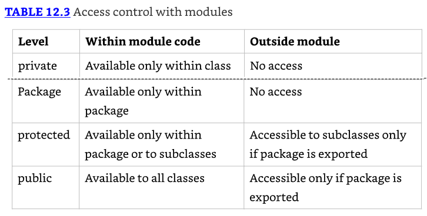

### Requiring a Module Transitively

* Como viste anteriormente en este capítulo, requires moduleName especifica que el módulo actual depende de moduleName. 
* También hay un requires transitive moduleName, que significa que cualquier módulo que requiera este módulo también dependerá de moduleName.
* Bueno, eso fue un bocado. Veamos un ejemplo. Figure 12.12 muestra los módulos con líneas discontinuas para las relaciones redundantes y líneas sólidas para relaciones especificadas en él `module-info`. 
* Esto muestra cómo se verían las relaciones del módulo si solo usáramos dependencias transitivas.

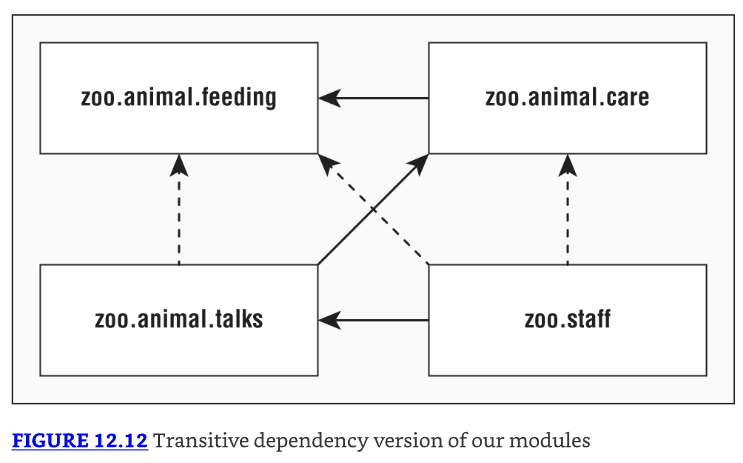

* Por ejemplo, zoo.animal.talks depende de zoo.animal.care, que depende de zoo.animal.feeding. 
* Eso significa que la flecha entre zoo.animal.talks y zoo.animal.feeding ya no aparece en Figure 12.12.
* Ahora veamos las cuatro declaraciones de módulo. El primer módulo permanece sin cambios. 
* Estamos exportando un paquete a cualquier paquete que use el módulo.

```java
module zoo.animal.feeding {
  exports zoo.animal.feeding;
}
```

* El módulo zoo.animal.care es la primera oportunidad para mejorar las cosas. 
* En lugar de forzar a todos los módulos restantes a especificar explícitamente zoo.animal.feeding, el código usa requires transitive.

```java
module zoo.animal.care {
  exports zoo.animal.care.medical;
  requires transitive zoo.animal.feeding;
}
```

* En el módulo zoo.animal.talks, hacemos un cambio similar y no forzamos a otros módulos a especificar zoo.animal.care. 
* También ya no necesitamos especificar zoo.animal.feeding, así que esa línea está comentada.

```java
module zoo.animal.talks {
  exports zoo.animal.talks.content to zoo.staff;
  exports zoo.animal.talks.media;
  exports zoo.animal.talks.schedule;
  // no longer needed requires zoo.animal.feeding;
  // no longer needed requires zoo.animal.care;
  requires transitive zoo.animal.care;
}
```

Finalmente, en el módulo `zoo.staff`, podemos deshacernos de dos declaraciones requires.

```java
module zoo.staff {
  // no longer needed requires zoo.animal.feeding;
  // no longer needed requires zoo.animal.care;
  requires zoo.animal.talks;
}
```

* Mientras más módulos tengas, mayores los beneficios del requires transitive compuesto. 
* También es más conveniente para quien llama. Si estuvieras tratando de trabajar con este zoológico, podrías simplemente requerir `zoo.staff` y tener las dependencias restantes inferidas automáticamente.

### Effects of requires transitive

* Dadas nuestras nuevas declaraciones de módulo, y usando Figure 12.12, ¿cuál es el efecto de aplicar el modificador transitive a la declaración requires en nuestro módulo zoo.animal.care? 
* Aplicar los modificadores transitive tiene los siguientes efectos:
  * Module zoo.animal.talks puede opcionalmente declarar que requiere el módulo zoo.animal.feeding, pero no es requerido. 
  * Module zoo.animal.care no puede ser compilado o ejecutado sin acceso al módulo zoo.animal.feeding.
  * Module zoo.animal.talks no puede ser compilado o ejecutado sin acceso al módulo zoo.animal.feeding.

* Estas reglas se mantienen incluso si los módulos zoo.animal.care y zoo.animal.talks no referencian explícitamente ningún paquete en el módulo zoo.animal.feeding. 
* Por otro lado, sin el modificador transitive en nuestra declaración de módulo de zoo.animal.care, los otros módulos tendrían que usar explícitamente requires para referenciar cualquier paquete en el módulo zoo.animal.feeding.

### Duplicate requires Statements

Un lugar donde el examen podría intentar engañarte es mezclando requires y requires transitive. ¿Puedes pensar en una razón por la que este código no compila?

```java
module bad.module {
  requires zoo.animal.talks;
  requires transitive zoo.animal.talks;
}
```

* Java no te permite repetir el mismo módulo en una cláusula requires. Es redundante y muy probablemente un error en la codificación. 
* Ten en cuenta que requires transitive es como requires más algún comportamiento extra.

### Opening a Package

* Java permite a los llamadores inspeccionar y llamar código en tiempo de ejecución con una técnica llamada reflection. 
* Este es un enfoque poderoso que permite llamar código que podría no estar disponible en tiempo de compilación. 
* Incluso puede ser usado para subvertir el control de acceso. No te preocupes, no necesitas saber cómo escribir código usando reflexión para el examen.

* La directiva opens es usada para habilitar reflexión de un paquete dentro de un módulo. 
* Solo necesitas estar consciente de que la directiva opens existe más que entenderlo en detalle para el examen.

* Dado que la reflexión puede ser peligrosa, el sistema de módulos requiere que los desarrolladores permitan explícitamente reflexión en la declaración del módulo si quieren que los módulos llamantes puedan usarlo. 
* Lo siguiente muestra cómo habilitar reflexión para dos paquetes en el módulo zoo.animal.talks:

```java
module zoo.animal.talks {
  opens zoo.animal.talks.schedule;
  opens zoo.animal.talks.media to zoo.staff;
}
```

* El primer ejemplo permite que cualquier módulo que use este pueda usar reflexión. 
* El segundo ejemplo solo le da ese privilegio al módulo `zoo.staff`. Hay dos directivas más que necesitas conocer para el examen—provides y uses—que se cubren en la siguiente sección.

---------------------------------------------------------------------
**Real World Scenario - Opening an Entire Module**
En el ejemplo previo, abrimos dos paquetes en el módulo zoo.animal.talks, pero supón que en su lugar queríamos abrir todos los paquetes para reflexión. 
No hay problema. Podemos usar el modificador `open module`, en lugar de la directiva opens (nota la diferencia de s):

```java
open module zoo.animal.talks {
}
```

Con este modificador de módulo, Java sabe que queremos todos los paquetes en el módulo para que estén abiertos. ¿Qué pasa si aplicas ambos juntos?

```java
open module zoo.animal.talks {
  opens zoo.animal.talks.schedule; // DOES NOT COMPILE
}
```
Esto no compila porque un modificador que usa el modificador open no está permitido usar la directiva opens. 
Después de todo, ¡los paquetes ya están abiertos!
---------------------------------------------------------------------

## Creating a Service

* En esta sección, aprendes cómo crear un servicio. Un service está compuesto de una interfaz, cualquier clase que la interfaz referencia, y una forma de buscar implementaciones de la interfaz. 
* Las implementaciones no son parte del servicio.
* Estaremos usando una aplicación de tour en la sección de servicios. Tiene cuatro módulos mostrados en Figure 12.13. 
* En este ejemplo, los módulos zoo.tours.api y zoo.tours.reservations conforman el servicio dado que consisten de la interfaz y la funcionalidad de búsqueda.

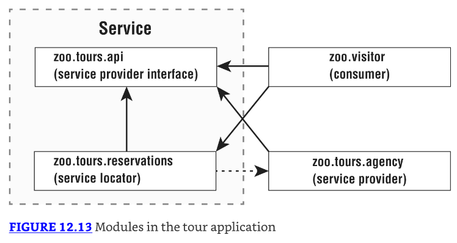

---------------------------------------------------------------------
No se requiere tener cuatro módulos separados. Lo hacemos para ilustrar los conceptos. 
Por ejemplo, la interfaz del proveedor de servicio y el localizador de servicio podrían estar en el mismo módulo.
---------------------------------------------------------------------

### Declaring the Service Provider Interface

Primero, el módulo zoo.tours.api define un objeto Java llamado Souvenir. Es considerado parte del servicio porque será referenciado por la interfaz.

```java
// Souvenir.java
package zoo.tours.api;

public record Souvenir(String description) { }
```

* A continuación, el módulo contiene un tipo de interfaz Java. 
* Esta interfaz se llama service provider interface porque especifica qué comportamiento tendrá nuestro servicio. 
* En este caso, es una API simple con tres métodos.

```java
// Tour.java
package zoo.tours.api;

public interface Tour {
  String name();
  int length();
  Souvenir getSouvenir();
}
```

Los tres métodos usan el modificador public implícito. Dado que estamos trabajando con módulos, también necesitamos crear un archivo module-info.java para que nuestra definición de módulo exporte el paquete que contiene la interfaz.

```java
// module-info.java
module zoo.tours.api {
  exports zoo.tours.api;
}
```

Ahora que tenemos ambos archivos, podemos compilar y empaquetar este módulo.

```java
javac -d serviceProviderInterfaceModule
  serviceProviderInterfaceModule/zoo/tours/api/*.java
  serviceProviderInterfaceModule/module-info.java

jar -cvf mods/zoo.tours.api.jar -C serviceProviderInterfaceModule/ .
```

---------------------------------------------------------------------
* Una "interfaz" de proveedor de servicio puede ser una clase abstracta en lugar de una interfaz real. 
* Dado que solo la verás como una interfaz en el examen, usamos ese término en el libro.
---------------------------------------------------------------------

* Para revisar, el servicio incluye la interfaz del proveedor de servicio y las clases de soporte que referencia. 
* El servicio también incluye la funcionalidad de búsqueda, que definimos a continuación.

### Creating a Service Locator

* Para completar nuestro servicio, necesitamos un localizador de servicio. 
* Un service locator puede encontrar cualquier clase que implemente una interfaz de proveedor de servicio.
* Afortunadamente, Java proporciona una clase ServiceLoader para ayudar con esta tarea. 
* Pasas el tipo de interfaz de proveedor de servicio a su método load(), y Java devolverá cualquier servicio de implementación que pueda encontrar. 
* La siguiente clase lo muestra en acción:

```java
// TourFinder.java
package zoo.tours.reservations;

import java.util.*;
import zoo.tours.api.*;

public class TourFinder {

  public static Tour findSingleTour() {
    ServiceLoader<Tour> loader = ServiceLoader.load(Tour.class);
    for (Tour tour : loader)
      return tour;
    return null;
  }
    public static List<Tour> findAllTours() {
        List<Tour> tours = new ArrayList<>();
        ServiceLoader<Tour> loader = ServiceLoader.load(Tour.class);
        for (Tour tour : loader)
            tours.add(tour);
        return tours;
    }
}
```

* Como puedes ver, proporcionamos dos métodos de búsqueda. El primero es un método de conveniencia si estás esperando exactamente un Tour para ser devuelto. 
* El otro devuelve una List, que acomoda cualquier número de proveedores de servicio. 
* En tiempo de ejecución, puede haber muchos proveedores de servicio (o ninguno) que son encontrados por el localizador de servicio.

---------------------------------------------------------------------
* La llamada a ServiceLoader es relativamente costosa. 
* Si estás escribiendo una aplicación real, es mejor almacenar en caché el resultado.
---------------------------------------------------------------------

Nuestra definición de módulo exporta el paquete con la clase de búsqueda TourFinder. 
Requiere el paquete de interfaz de proveedor de servicio. También tiene la directiva uses dado que buscará un servicio.

```java
// module-info.java
module zoo.tours.reservations {
  exports zoo.tours.reservations;
  requires zoo.tours.api;
  uses zoo.tours.api.Tour;
}
```

Recuerda que tanto requires como uses son necesarios, uno para compilación y uno para búsqueda. Finalmente, compilamos y empaquetamos el módulo.

```java
javac -p mods -d serviceLocatorModule
  serviceLocatorModule/zoo/tours/reservations/*.java
  serviceLocatorModule/module-info.java

jar -cvf mods/zoo.tours.reservations.jar -C serviceLocatorModule/ .
```

---------------------------------------------------------------------
**Using ServiceLoader**
Hay dos métodos en ServiceLoader que necesitas conocer para el examen. La declaración es la siguiente, sin la implementación completa:

```java
public final class ServiceLoader<S> implements Iterable<S> {

  public static <S> ServiceLoader<S> load(Class<S> service) { ... }
  
  public Stream<Provider<S>> stream() { ... }
  
  // Additional methods
}
```

* Como ya vimos, llamar a `ServiceLoader.load()` devuelve un objeto que puedes iterar normalmente. 
* Sin embargo, solicitar un Stream te da un tipo diferente. La razón de esto es que un Stream controla cuándo los elementos son evaluados. 
* Por lo tanto, un ServiceLoader devuelve un Stream de objetos Provider. Tienes que llamar a get() para recuperar el valor que querías de cada Provider, como en este ejemplo:

```java
ServiceLoader.load(Tour.class)
  .stream()
  .map(Provider::get)
  .mapToInt(Tour::length)
  .max()
  .ifPresent(System.out::println);
```
---------------------------------------------------------------------

### Invoking from a Consumer

* Lo siguiente es llamar al localizador de servicio por un consumidor. Un consumer (or client) se refiere a un módulo que obtiene y usa un servicio. 
* Una vez que el consumidor ha adquirido un servicio vía el localizador de servicio, es capaz de invocar los métodos proporcionados por la interfaz del proveedor de servicio.

```java
// Tourist.java
package zoo.visitor;

import java.util.*;
import zoo.tours.api.*;
import zoo.tours.reservations.*;

public class Tourist {
    public static void main(String[] args) {
        Tour tour = TourFinder.findSingleTour();
        System.out.println("Single tour: " + tour);

        List<Tour> tours = TourFinder.findAllTours();
        System.out.println("# tours: " + tours.size());
    }
}
```

Nuestra definición de módulo no necesita saber nada sobre las implementaciones dado que el módulo zoo.tours.reservations está manejando la búsqueda.

```java
// module-info.java
module zoo.visitor {
  requires zoo.tours.api;
  requires zoo.tours.reservations;
}
```

Esta vez, llegamos a ejecutar un programa después de compilar y empaquetar.

```java
javac -p mods -d consumerModule
  consumerModule/zoo/visitor/*.java consumerModule/module-info.java

jar -cvf mods/zoo.visitor.jar -C consumerModule/ .

java -p mods -m zoo.visitor/zoo.visitor.Tourist
```

El programa produce la siguiente salida:

`Single tour: null`
`# tours: 0`

Bueno, eso tiene sentido. No hemos escrito una clase que implemente la interfaz aún.

### Adding a Service Provider

* Un service provider es la implementación de una interfaz de proveedor de servicio. 
* Como dijimos anteriormente, en tiempo de ejecución es posible tener múltiples clases de implementación o módulos. Nos limitaremos a uno aquí por simplicidad.
* Nuestro proveedor de servicio es el paquete zoo.tours.agency porque hemos subcontratado la operación de tours a un tercero.

```java
// TourImpl.java
package zoo.tours.agency;
import zoo.tours.api.*;

public class TourImpl implements Tour {
    public String name() {
        return "Behind the Scenes";
    }
    public int length() {
        return 120;
    }
    public Souvenir getSouvenir() {
        return new Souvenir("stuffed animal");
    }
}
```

Nuevamente, necesitamos un archivo `module-info.java` para crear un módulo.

```java
// module-info.java
module zoo.tours.agency {
  requires zoo.tours.api;
  provides zoo.tours.api.Tour with zoo.tours.agency.TourImpl;
}
```

* La declaración del módulo requiere el módulo que contiene la interfaz como una dependencia. 
* No exportamos el paquete que implementa la interfaz dado que no queremos que los llamadores se refieran a él directamente. 
* En su lugar, usamos la directiva provides. Esto nos permite especificar que proporcionamos una implementación de la interfaz con una clase de implementación específica. La sintaxis se ve así:

`provides interfaceName with className;`

---------------------------------------------------------------------
No hemos exportado el paquete que contiene la implementación. 
En su lugar, hemos hecho la implementación disponible a un proveedor de servicio usando la interfaz.
---------------------------------------------------------------------

Finalmente, lo compilamos y empaquetamos.

```java
javac -p mods -d serviceProviderModule
  serviceProviderModule/zoo/tours/agency/*.java
  serviceProviderModule/module-info.java
jar -cvf mods/zoo.tours.agency.jar -C serviceProviderModule/ .
```

Ahora viene la parte genial. Podemos ejecutar el programa Java nuevamente.

`java -p mods -m zoo.visitor/zoo.visitor.Tourist`

Esta vez, vemos la siguiente salida:

`Single tour: zoo.tours.agency.TourImpl@1936f0f5`
`# tours: 1`

* Nota cómo no recompilamos zoo.tours.reservations o zoo.visitor. El localizador de servicio fue capaz de observar que ahora había una implementación de proveedor de servicio disponible y encontrarla por nosotros.
* Esto es útil cuando tienes funcionalidad que cambia independientemente del resto de la base de código. Por ejemplo, podrías tener informes personalizados o registro.

---------------------------------------------------------------------
* En desarrollo de software, el concepto de separar diferentes componentes en piezas independientes se refiere como loose coupling. 
* Una ventaja del código débilmente acoplado es que puede ser fácilmente intercambiado o reemplazado con cambios mínimos (o cero) al código que lo usa. 
* Confiar en una estructura débilmente acoplada permite que los módulos de servicio sean fácilmente extensibles en tiempo de ejecución.
---------------------------------------------------------------------

### Reviewing Directives and Services

* Table 12.4 resume lo que hemos cubierto en la sección sobre servicios. 
* Recomendamos aprender realmente bien qué se necesita cuando cada artefacto está en un módulo separado. 
* Eso es lo más probable que veas en el examen y asegurará que entiendas los conceptos. 
* Table 12.5 lista todas las directivas que necesitas conocer para el examen.

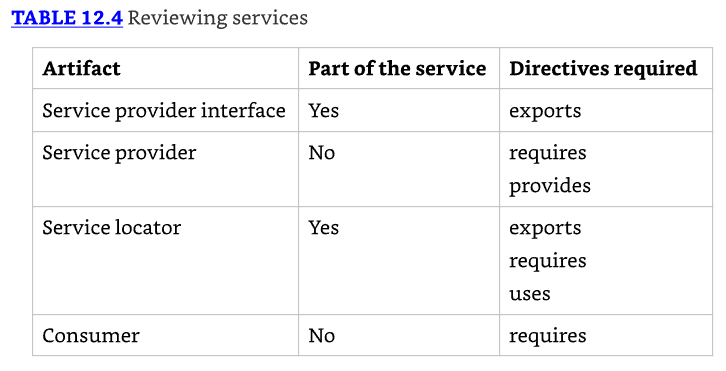

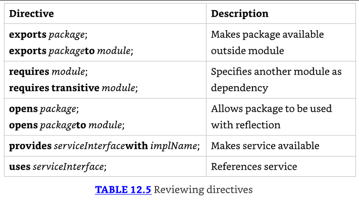

## Discovering Modules

* Hasta ahora, hemos estado trabajando con módulos que escribimos. Incluso las clases incorporadas en el JDK están modularizadas. 
* En esta sección, te mostramos cómo usar comandos para aprender sobre módulos.
* No necesitas conocer la salida de los comandos en esta sección. Sin embargo, necesitas conocer la sintaxis de los comandos y qué hacen. 
* Incluimos la salida donde facilita recordar qué está sucediendo. Pero no necesitas memorizar eso (lo cual libera más espacio en tu cabeza para memorizar opciones de línea de comandos).

### Identifying Built-in Modules

* El módulo más importante para conocer es `java.base`. Contiene la mayoría de los paquetes sobre los que has estado aprendiendo para el examen. 
* De hecho, es tan importante que ni siquiera tienes que usar la directiva requires; está disponible para todas las aplicaciones modulares. 
* Tu archivo `module-info.java` aún compilará si explícitamente requieres `java.base`. Sin embargo, es redundante, así que es mejor omitirlo. 
* Table 12.6 lista algunos módulos comunes y qué contienen.

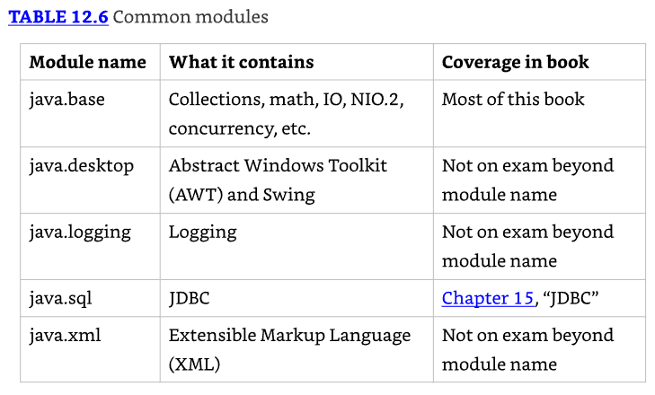

* Los creadores del examen sienten que es importante reconocer los nombres de módulos suministrados por el JDK. 
* Aunque no necesitas conocer los nombres de memoria, necesitas ser capaz de seleccionarlos de una lista.
* Para el examen, necesitas saber que los nombres de módulos comienzan con java para APIs que es probable uses y con jdk para APIs que son específicas del JDK. 
* Table 12.7 lista todos los módulos que comienzan con java.

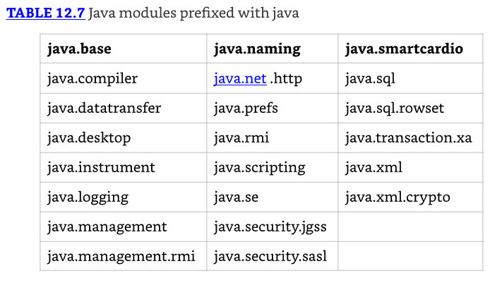

* Table 12.8 lista todos los módulos que comienzan con jdk. 
* Recomendamos revisar esto justo antes del examen para aumentar las posibilidades de que suenen familiares. 
* Recuerda que no tienes que memorizarlos.

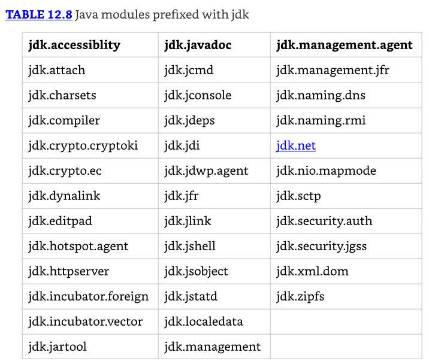

### Getting Details with java

El comando `java` tiene tres opciones relacionadas con módulos. Una describe un módulo, otra lista los módulos disponibles, y la tercera muestra la lógica de resolución del módulo.

---------------------------------------------------------------------
* También es posible añadir módulos, exportaciones, y más en la línea de comandos. Pero por favor no lo hagas. 
* Es confuso y difícil de mantener. Nota que estas banderas están disponibles en java pero no en todos los comandos.
---------------------------------------------------------------------

### Describing a Module

* Supón que te dan el archivo JAR del módulo zoo.animal.feeding y quieres conocer sobre su estructura de módulo. 
* Podrías "descomprimirlo" y abrir el archivo `module-info.java`. Esto te mostraría que el módulo exporta un paquete y no requiere explícitamente ningún módulo.

```java
module zoo.animal.feeding {
  exports zoo.animal.feeding;
}
```

* Sin embargo, hay una manera más fácil. El comando `java` tiene una opción para describir un módulo. 
* Los siguientes dos comandos son equivalentes:

```java
java -p mods
  -d zoo.animal.feeding

java -p mods
  --describe-module zoo.animal.feeding
```

Cada uno imprime información sobre el módulo. Por ejemplo, podría imprimir esto:

```java
zoo.animal.feeding file:///absolutePath/mods/zoo.animal.feeding.jar
exports zoo.animal.feeding
requires java.base mandated
```

* La primera línea es el módulo sobre el que preguntamos: zoo.animal.feeding. La segunda línea comienza con información sobre el módulo. 
* En nuestro caso, es la misma declaración de exportación de paquete que teníamos en el archivo de declaración del módulo.
* En la tercera línea, vemos requires `java.base` mandated. Ahora, espera un minuto. 
* La declaración del módulo claramente no especifica ningún módulo que zoo.animal.feeding tenga como dependencias.
* Recuerda, el módulo `java.base` es especial. Es automáticamente añadido como una dependencia a todos los módulos. 
* Este módulo tiene paquetes frecuentemente usados como java.util. Eso es sobre lo que trata el mandated. 
* Obtienes `java.base` independientemente de si lo pediste o no.
* En las clases, el paquete `java.lang` es importado automáticamente ya sea que lo escribas o no. 
* El módulo `java.base` funciona de la misma manera. Está automáticamente disponible para todos los otros módulos.

---------------------------------------------------------------------
**More about Describing Modules**
Solo necesitas saber cómo ejecutar --describe-module para el examen en lugar de interpretar la salida. 
Sin embargo, podrías encontrar algunas sorpresas al experimentar con esta característica, así que las describimos con un poco más de detalle aquí.
Asume lo siguiente son los contenidos de `module-info.java` en zoo.animal.care:

```java
module zoo.animal.care {
  exports zoo.animal.care.medical to zoo.staff;
  requires transitive zoo.animal.feeding;
}
```

Ahora tenemos el comando para describir el módulo y la salida.

```java
java -p mods -d zoo.animal.care
zoo.animal.care file:///absolutePath/mods/zoo.animal.care.jar
requires zoo.animal.feeding transitive
requires java.base mandated
qualified exports zoo.animal.care.medical to zoo.staff
contains zoo.animal.care.details
```
* La primera línea de la salida es la ruta absoluta del archivo del módulo. Las dos líneas de requires deberían verse familiares también. 
* La primera está en él `module-info`, y la otra se añade a todos los módulos. 
* A continuación viene algo nuevo. Los qualified exports es el nombre completo del paquete que estamos exportando a un módulo específico.
* Finalmente, los contains significa que hay un paquete en el módulo que no es exportado en absoluto. 
* Esto es cierto. Nuestro módulo tiene dos paquetes, y uno está disponible solo para código dentro del módulo.
---------------------------------------------------------------------

### Listing Available Modules

* Además de describir módulos, puedes usar el comando `java` para listar los módulos que están disponibles. 
* La forma más simple lista los módulos que son parte del JDK.

`java --list-modules`

Cuando lo ejecutamos, la salida continuó por 70 líneas y se veía así:

```java
java.base@17
java.compiler@17
java.datatransfer@17
```

* Esta es una lista de todos los módulos que vienen con Java y sus números de versión. 
* Puedes decir que estábamos usando Java 17 cuando probamos este ejemplo.
* Más interesante, puedes usar este comando con código personalizado. 
* Intentemos de nuevo con el directorio que contiene nuestros módulos zoo.

`java -p mods --list-modules`

* ¿Cuántas líneas esperas que estén en la salida esta vez? Hay 78 líneas ahora: los 70 módulos integrados más los 8 que hemos creado en este capítulo. 
* Dos de las líneas personalizadas se ven así:

```java
zoo.animal.care file:///absolutePath/mods/zoo.animal.care.jar
zoo.animal.feeding file:///absolutePath/mods/zoo.animal.feeding.jar
```

* Dado que estos son módulos personalizados, obtenemos una ubicación en el sistema de archivos. 
* Si el proyecto tuviera un número de versión de módulo, tendría tanto el número de versión como la ruta del sistema de archivos.

Nota que `--list-modules` sale tan pronto como imprime los módulos observables. No ejecuta el programa.

### Showing Module Resolution

* Si listar los módulos no te da suficiente salida, también puedes usar la opción --show-module-resolution. 
* Puedes pensar en ella como una forma de depurar módulos. Escupe mucha salida cuando el programa se inicia. Luego ejecuta el programa.

```java
java --show-module-resolution
  -p feeding
  -m zoo.animal.feeding/zoo.animal.feeding.Task
```

Afortunadamente, no necesitas entender esta salida. Dicho esto, haberla visto hará que sea más fácil recordar. Aquí hay un fragmento de la salida:

```java
root zoo.animal.feeding file:///absolutePath/feeding/
java.base binds java.desktop jrt:/java.desktop
java.base binds jdk.jartool jrt:/jdk.jartool
...
jdk.security.auth requires java.naming jrt:/java.naming
jdk.security.auth requires java.security.jgss jrt:/java.security.jgss
...
All fed!
```

Comienza listando el módulo raíz. Ese es el que estamos ejecutando: zoo.animal.feeding. 
Luego lista muchas líneas de paquetes incluidos por el módulo `java.base` obligatorio. 
Después de un rato, lista los módulos que tienen dependencias. Finalmente, produce la salida del programa: All fed!.

### Describing with jar

Como el comando `java`, el comando jar puede describir un módulo. Estos comandos son equivalentes:

```java
jar -f mods/zoo.animal.feeding.jar -d
jar --file mods/zoo.animal.feeding.jar --describe-module
```

La salida es ligeramente diferente de cuando usamos el comando `java` para describir el módulo. Con jar, produce lo siguiente:

```java
zoo.animal.feeding jar:file:///absolutePath/mods/zoo.animal.feeding.jar
/!module-info.class
exports zoo.animal.feeding
requires java.base mandated
```

* La versión JAR incluye él module-info.class en el nombre del archivo, lo cual no es una diferencia particularmente significativa en el esquema de las cosas. 
* No necesitas conocer esta diferencia. Necesitas saber que ambos comandos pueden describir un módulo.

### Learning about Dependencies with jdeps

* El comando jdeps te da información sobre dependencias dentro de un módulo. A diferencia de describir un módulo, examina el código además de la declaración del módulo. 
* Esto te dice qué dependencias se usan realmente en lugar de simplemente declaradas. 
* Afortunadamente, no se espera que memorices todas las opciones para el examen.
* Se espera que entiendas cómo usar jdeps con proyectos que aún no han sido modularizados para ayudar en la identificación de dependencias y problemas. 
* Primero, crearemos un archivo JAR desde esta clase. Si estás siguiendo, siéntete libre de copiar la clase de los ejemplos en línea referenciados al comienzo del capítulo en lugar de escribirla.

```java
// Animatronic.java
package zoo.dinos;

import java.time.*;
import java.util.*;
import sun.misc.Unsafe;

public class Animatronic {
    private List<String> names;
    private LocalDate visitDate;

    public Animatronic(List<String> names, LocalDate visitDate) {
        this.names = names;
        this.visitDate = visitDate;
    }
    public void unsafeMethod() {
        Unsafe unsafe = Unsafe.getUnsafe();
    }
}
```

* Este ejemplo es tonto. Usa varias clases no relacionadas. 
* El Bronx Zoo realmente tuvo dinosaurios electrónicos en movimiento por un tiempo, así que al menos la idea de tener dinosaurios en un zoológico no está más allá del reino de posibilidad.

* Ahora podemos compilar este archivo. Podrías haber notado que no hay un archivo `module-info.java`. Eso es porque no estamos creando un módulo. 
* Estamos viendo qué dependencias necesitaremos cuando modularicemos este JAR.

`javac zoo/dinos/*.java`

* Compilar funciona, pero te da algunas advertencias sobre Unsafe siendo una API interna. 
* No te preocupes por esas por ahora—discutiremos eso en breve. (Tal vez los dinosaurios se extinguieron porque hicieron algo inseguro.)
* A continuación, creamos un archivo JAR.

`jar -cvf zoo.dino.jar .`

* Podemos ejecutar el comando jdeps contra este JAR para aprender sobre sus dependencias. 
* Primero, ejecutemos el comando sin ninguna opción. En las primeras dos líneas, el comando imprime los módulos que necesitaríamos añadir con una directiva requires para migrar al sistema de módulos. 
* También imprime una tabla mostrando qué paquetes se usan y a qué módulos corresponden.

```java
jdeps zoo.dino.jar

zoo.dino.jar -> java.base
zoo.dino.jar -> jdk.unsupported
zoo.dinos -> java.lang    java.base
zoo.dinos -> java.time    java.base
zoo.dinos -> java.util    java.base
zoo.dinos -> sun.misc     JDK internal API (jdk.unsupported)
```

* Nota que `java.base` está siempre incluido. También dice qué módulos contienen las clases usadas por el JAR. 
* Si ejecutamos en modo resumen, solo vemos la primera parte donde jdeps lista los módulos. Hay dos formatos para la bandera de resumen:

```java
jdeps -s zoo.dino.jar
jdeps -summary zoo.dino.jar

zoo.dino.jar -> java.base
zoo.dino.jar -> jdk.unsupported
```

* Para un proyecto real, la lista de dependencias podría incluir docenas o incluso cientos de paquetes. 
* Es útil ver el resumen de solo los módulos. Este enfoque también hace más fácil ver si jdk.unsupported está en la lista.
* También hay una opción --module-path que puedes usar si quieres buscar módulos fuera del JDK. 
* A diferencia de otros comandos, no hay forma corta para esta opción en jdeps.

---------------------------------------------------------------------
* Podrías haber notado que jdk.unsupported no está en la lista de módulos que viste en Table 12.8. 
* Es especial porque contiene bibliotecas internas que los desarrolladores en versiones previas de Java fueron desalentados de usar, aunque muchas personas ignoraron esta advertencia. 
* No deberías referenciarla, ya que puede desaparecer en futuras versiones de Java.
---------------------------------------------------------------------

### Using the --jdk-internals Flag

El comando jdeps tiene una opción para proporcionar detalles sobre estas APIs no soportadas. La salida se ve algo así:

```java
jdeps --jdk-internals zoo.dino.jar

zoo.dino.jar -> jdk.unsupported
  zoo.dinos.Animatronic -> sun.misc.Unsafe
    JDK internal API (jdk.unsupported)

Warning: <omitted warning>
```

JDK Internal API    Suggested Replacement
---------------     ----------------------
sun.misc.Unsafe     See http://openjdk.java.net/jeps/260

* La opción --jdk-internals lista cualquier clase que estés usando que llame a una API interna junto con qué API. 
* Al final, proporciona una tabla sugiriendo qué deberías hacer al respecto. Si escribiste el código llamando a la API interna, este mensaje es útil. 
* Si no, el mensaje sería útil para el equipo que escribió el código. Tú, por otro lado, podrías necesitar actualizar o reemplazar ese archivo JAR completamente con uno que corrija el problema. 
* Nota que -jdkinternals es equivalente a --jdk-internals.

---------------------------------------------------------------------
**Real World Scenario**
**About `sun.misc.Unsafe`**
* Antes del Java Platform Module System, las clases tenían que ser públicas si querías que fueran usadas fuera del paquete. 
* Era razonable usar la clase en código JDK dado que ese es código de bajo nivel que ya está estrechamente acoplado al JDK. 
* Dado que era necesario en múltiples paquetes, la clase fue hecha pública. 
* Sun incluso la nombró Unsafe, calculando que eso evitaría que alguien la usara fuera del JDK.
* Sin embargo, los desarrolladores son astutos y usaron la clase dado que estaba disponible. 
* Varias bibliotecas de código abierto ampliamente usadas comenzaron a usar Unsafe. 
* Aunque es bastante improbable que estés usando esta clase en tu proyecto directamente, probablemente uses una biblioteca de código abierto que la está usando.
* El comando jdeps te permite ver estos JARs para ver si tendrás algún problema cuando Oracle finalmente prevenga el uso de esta clase. 
* Si encuentras algún uso, puedes ver si hay una versión posterior del JAR a la que puedas actualizar.
---------------------------------------------------------------------

### Using Module Files with `jmod`

* El comando final que necesitas conocer para el examen es `jmod`. Podrías pensar que un archivo JMOD es un archivo de módulo Java. 
* No exactamente. Oracle recomienda usar archivos JAR para la mayoría de los módulos. 
* Los archivos JMOD se recomiendan solo cuando tienes bibliotecas nativas o algo que no puede ir dentro de un archivo JAR. 
* Esto es improbable que te afecte en el mundo real.

* Lo más importante a recordar es que `jmod` es solo para trabajar con los archivos JMOD. 
* Convenientemente, no tienes que memorizar la sintaxis para `jmod`. Table 12.9 lista los modos comunes.

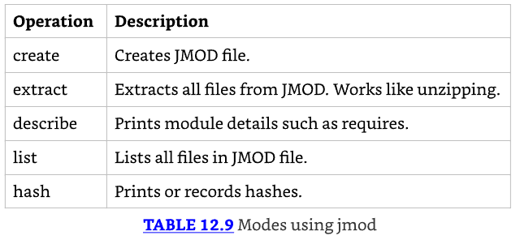

### Creating Java Runtimes with jlink

* Uno de los beneficios de los módulos es ser capaz de suministrar solo las partes de Java que necesitas. 
* Nuestro ejemplo de zoo desde el comienzo del capítulo no tiene muchas dependencias. 
* Si el usuario ya no tiene Java o está en un dispositivo sin mucha memoria, descargar un JDK que es más de 150 MB es una gran petición. 
* Veamos qué tan grande necesita ser el paquete realmente. Este comando crea nuestra distribución más pequeña:

`jlink --module-path mods --add-modules zoo.animal.talks --output zooApp`

* Primero especificamos dónde encontrar los módulos personalizados con -p o --module-path. 
* Luego especificamos nuestros nombres de módulo con --add-modules. Esto incluirá las dependencias que requiere siempre que puedan ser encontradas. 
* Finalmente, especificamos el nombre de carpeta de nuestro JDK más pequeño con --output. 
* El directorio de salida contiene los directorios bin, conf, include, legal, lib, y man junto con un archivo de lanzamiento. 
* Estos deberían verse familiares, ya que los encuentras en el JDK completo también. 
* Cuando ejecutamos este comando y comprimimos el directorio zooApp, el archivo es solo de 15 MB. Esto es un orden de magnitud más pequeño que el JDK completo. 
* ¿De dónde vino este ahorro de espacio? Hay muchos módulos en el JDK que no necesitamos. 
* Adicionalmente, herramientas de desarrollo como javac no necesitan estar en una distribución en tiempo de ejecución. 
* Hay muchos más elementos para personalizar este proceso que no necesitas conocer para el examen. 
* Por ejemplo, puedes omitir generar la documentación de ayuda y ahorrar aún más espacio.

### Reviewing Command-Line Options

* Esta sección presenta varias tablas que cubren lo que necesitas saber sobre ejecutar opciones de línea de comandos para el examen.
* Table 12.10 muestra las operaciones de línea de comandos que deberías esperar encontrar en el examen. 
* Hay muchas más opciones en la documentación. Por ejemplo, hay una opción `--module` en javac que limita la compilación a ese módulo. 
* Afortunadamente, no necesitas conocer esas para el examen.

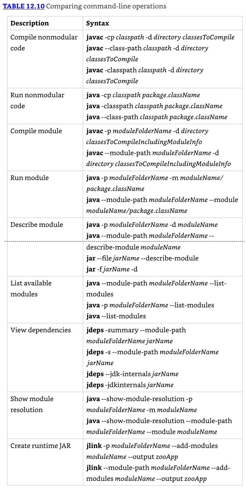

* Table 12.11 muestra las opciones para javac, Table 12.12 muestra las opciones para java, Table 12.13 muestra las opciones para jar, y Table 12.14 muestra las opciones para jdeps. 
* Finalmente, Table 12.15 muestra las opciones para jlink.

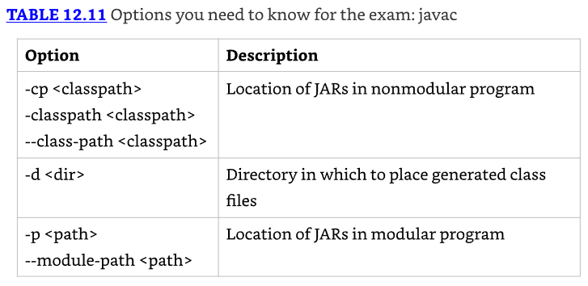


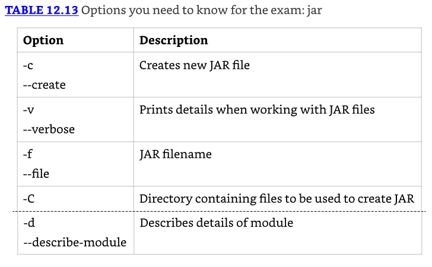

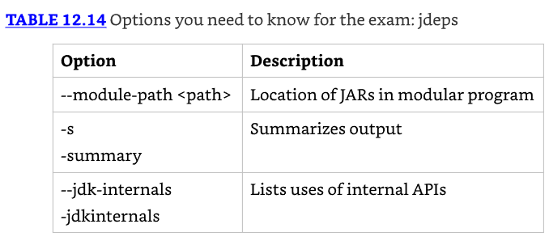

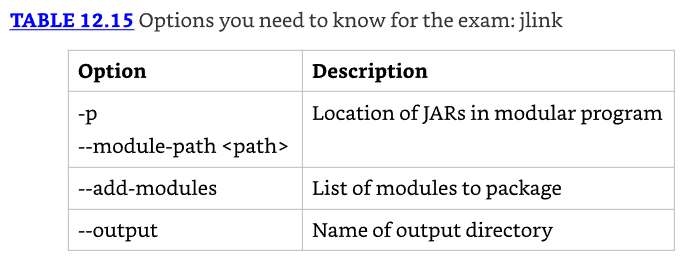

## Comparing Types of Modules

* Todos los módulos que hemos usado hasta ahora en este capítulo se llaman módulos nombrados. 
* Hay dos otros tipos de módulos: módulos automáticos y módulos sin nombre. En esta sección, describimos estos tres tipos de módulos. 
* En el examen, necesitarás ser capaz de compararlos.

### Named Modules

* Un named module es uno que contiene un archivo module-info.java. Para revisar, este archivo aparece en la raíz del JAR junto con uno o más paquetes. 
* A menos que se especifique de otra manera, un módulo es un módulo nombrado. Los módulos nombrados aparecen en el module path en lugar del classpath. 
* Más adelante, aprenderás qué sucede si un JAR que contiene un archivo module-info.java está en el classpath. 
* Por ahora, solo debes saber que no se considera un módulo nombrado porque no está en el module path.
* Como una forma de recordar esto, un módulo nombrado tiene el name dentro del archivo module-info.java y está en el module path.

Recuerda del Chapter 7, "Beyond Classes," que la única manera para que subclases de clases selladas estén en un paquete diferente es estar dentro del módulo con el mismo nombre.

### Automatic Modules

* Un automatic module aparece en el module path, pero no contiene un archivo module-info.java. 
* Es simplemente un archivo JAR regular que se coloca en el module path y se trata como un módulo.
* Como una forma de recordar esto, Java automatically determina el nombre del módulo. 
* El código que referencia un módulo automático lo trata como si hubiera un archivo module-info.java presente. 
* Automáticamente, exporta todos los paquetes. También determina el nombre del módulo. ¿Cómo determina el nombre del módulo, preguntas? Excelente pregunta.
* Para responder esto, necesitamos proporcionar un poco de historia sobre archivos JAR y adopción de módulos. 
* Cada archivo JAR contiene una carpeta especial llamada META-INF y, dentro de ella, un archivo de texto llamado `MANIFEST.MF`. 
* Puede ser creado automáticamente cuando el JAR es creado o a mano por el autor del JAR. 
* Regresando a módulos, muchas bibliotecas Java no estaban del todo listas para modularizarse cuando la característica fue introducida. 
* Los autores fueron alentados a declarar el nombre que pretendían usar para el módulo añadiendo una propiedad llamada Automatic-Module-Name a su archivo `MANIFEST.MF`.

---------------------------------------------------------------------
**About the MANIFEST.MF File**

* Un archivo JAR contiene un archivo de texto especial llamado `META-INF/MANIFEST.MF` que contiene información sobre el JAR. 
* Ha existido significativamente más tiempo que los módulos—desde los primeros días de Java y JARs, para ser exactos. 
* La figura muestra cómo el manifest encaja en la estructura de directorios de un archivo JAR.

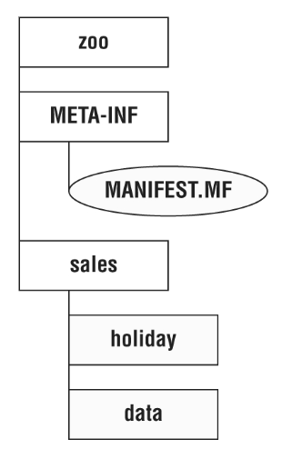

* El manifest contiene información extra sobre el archivo JAR. Por ejemplo, a menudo contiene la versión de Java usada para construir el archivo JAR. 
* Para programas de línea de comandos, la clase con el método main() comúnmente se especifica.
* Cada línea en el manifest es un par clave/valor separado por dos puntos. Puedes pensar en el manifest como un mapa de nombres de propiedades y valores. 
* El manifest predeterminado en Java 17 se ve así:

`Manifest-Version: 1.0`
`Created-By: 17 (Oracle Corporation)`
---------------------------------------------------------------------

* Especificar una sola propiedad en el manifest permitió a los proveedores de bibliotecas hacer las cosas más fáciles para las aplicaciones que querían usar su biblioteca en una aplicación modular. 
* Puedes pensar en ello como una promesa de que cuando la biblioteca se convierta en un módulo nombrado, usará el nombre de módulo especificado.
* Si el archivo JAR no especifica un nombre de módulo automático, Java todavía te permitirá usarlo en el module path. 
* En este caso, Java determinará el nombre del módulo por ti. Diríamos que esto sucede automáticamente, pero la broma probablemente se está gastando para ahora.

* Java determina el nombre del módulo automático basándose en el nombre de archivo del archivo JAR. Revisemos las reglas comenzando con un ejemplo. 
* Supón que tenemos un archivo JAR llamado holiday-calendar-1.0.0.jar.

* Primero Java eliminará la extensión .jar del nombre. Luego Java eliminará la versión del final del nombre de archivo JAR. 
* Esto es importante porque queremos que los nombres de módulo sean consistentes. 
* Tener un nombre de módulo automático diferente cada vez que actualizaste a una nueva versión no sería bueno. 
* Después de todo, esto te forzaría a cambiar la declaración de módulo de tu aplicación limpia y modularizada cada vez que integraras una versión posterior del JAR de calendario de vacaciones.

* Eliminar la versión y extensión nos da holiday-calendar. Esto nos deja con un problema. 
* Los guiones (-) no están permitidos en nombres de módulo. Java resuelve este problema convirtiendo cualquier carácter especial en el nombre a puntos (.). 
* Como resultado, el nombre del módulo es `holiday.calendar`. Cualquier carácter que no sean letras y números se considera un carácter especial en este reemplazo. 
* Finalmente, cualquier punto adyacente o puntos al principio/final son eliminados.

Dado que eso es un número de reglas, revisemos el algoritmo en una lista para determinar el nombre de un módulo automático:

* Si él `MANIFEST.MF` especifica un Automatic-Module-Name, úsalo. De lo contrario, procede con las reglas restantes.
* Elimina la extensión de archivo del nombre JAR.
* Elimina cualquier información de versión del final del nombre. Una versión son dígitos y puntos con posible información extra al final: por ejemplo, -1.0.0 o -1.0-RC.
* Reemplaza cualquier carácter restante que no sean letras y números con puntos.
* Reemplaza cualquier secuencia de puntos con un solo punto.
* Elimina el punto si es el primer o último carácter del resultado.

Table 12.16 muestra cómo aplicar estas reglas a dos ejemplos donde no hay un nombre de módulo automático especificado en el manifest.

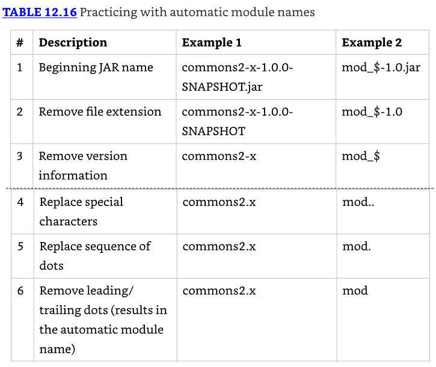

* Aunque el algoritmo para crear nombres de módulo automáticos hace su mejor esfuerzo, no siempre puede llegar a un buen nombre. 
* Por ejemplo, 1.2.0-calendar-1.2.2-good-1.jar no es conducente. Afortunadamente, tales nombres son raros y fuera del alcance del examen.

### Unnamed Modules

* Un `unnamed module` aparece en el classpath. Como un módulo automático, es un JAR regular. 
* A diferencia de un módulo automático, está en el classpath en lugar del module path. 
* Esto significa que un módulo sin nombre es tratado como código antiguo y un ciudadano de segunda clase a los módulos.
* Un módulo sin nombre normalmente no contiene un archivo `module-info.java`. 
* Si sucede que contiene uno, ese archivo será ignorado dado que está en el classpath.
* Los módulos sin nombre no exportan ningún paquete a módulos nombrados o automáticos. 
* El módulo sin nombre puede leer de cualquier JAR en el classpath o module path. 
* Puedes pensar en un módulo sin nombre como código que funciona de la manera en que Java funcionaba antes de los módulos. 
* Sí, sabemos que es confuso que algo que realmente no es un módulo tenga la palabra module en su nombre.

### Reviewing Module Types

* Puedes esperar obtener preguntas en el examen comparando los tres tipos de módulos. 
* Por favor estudia Table 12.17 exhaustivamente y prepárate para responder preguntas sobre estos elementos en cualquier combinación. 
* Un punto clave a recordar es que el código en el classpath puede acceder al module path. 
* Por contraste, el código en el module path es incapaz de leer del classpath.


## Migrating an Application

* Muchas aplicaciones no fueron diseñadas para usar el Java Platform Module System porque fueron escritas antes de que fuera creado o eligieron no usarlo. 
* Idealmente, fueron al menos diseñadas con proyectos en lugar de como una gran bola de lodo. 
* Esta sección te da una visión general de estrategias para migrar una aplicación existente para usar módulos. 
* Cubrimos ordenar módulos, migración de abajo hacia arriba, migración de arriba hacia abajo, y cómo dividir un proyecto existente.

---------------------------------------------------------------------
**Real World Scenario**
**Migrating Your Applications at Work**
* El examen existe en un universo pretendido donde no hay dependencias de código abierto y las aplicaciones son muy pequeñas. 
* Estos escenarios hacen el aprendizaje y la discusión de migración mucho más fáciles. 
* En el mundo real, las aplicaciones tienen bibliotecas que no han sido actualizadas en 10 o más años, grafos de dependencias complejos, y todo tipo de sorpresas.
* Nota que puedes usar todas las características de Java 17 sin convertir tu aplicación a módulos (excepto las características en este capítulo de módulos, por supuesto). 
* Por favor asegúrate de tener una razón para la migración y no pienses que es requerido.
* Este capítulo hace un gran trabajo enseñándote lo que necesitas saber para el examen. 
* Sin embargo, no te prepara adecuadamente para convertir aplicaciones reales para usar módulos. 
* Si te encuentras en esa situación, considera leer The Java Module System por Nicolai Parlog (Manning Publications, 2019).
---------------------------------------------------------------------

### Determining the Order

* Antes de que podamos migrar nuestra aplicación para usar módulos, necesitamos saber cómo los paquetes y bibliotecas en la aplicación existente están estructurados. 
* Supón que tenemos una aplicación simple con tres archivos JAR, como se muestra en Figure 12.14. Las dependencias entre proyectos forman un grafo. 
* Ambas representaciones en Figure 12.14 son equivalentes. Las flechas muestran las dependencias apuntando desde el proyecto que requerirá la dependencia al que la hace disponible. 
* En el lenguaje de módulos, la flecha irá desde requires a exports.

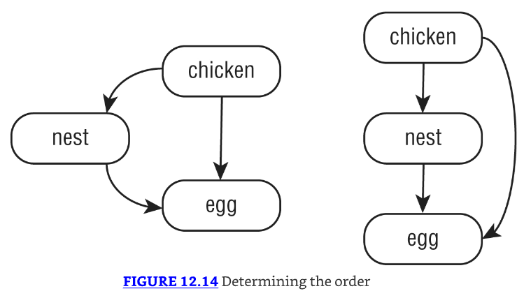

* El lado derecho del diagrama hace más fácil identificar la parte superior e inferior a la que se refieren la migración de arriba hacia abajo y de abajo hacia arriba. 
* Los proyectos que no tienen dependencias están en la parte inferior. Los proyectos que sí tienen dependencias están en la parte superior.
* En este ejemplo, solo hay un orden de arriba hacia abajo que honra todas las dependencias. Figure 12.15 muestra que el orden no siempre es único. 
* Dado que dos de los proyectos no tienen una flecha entre ellos, cualquier orden está permitido al decidir el orden de migración.

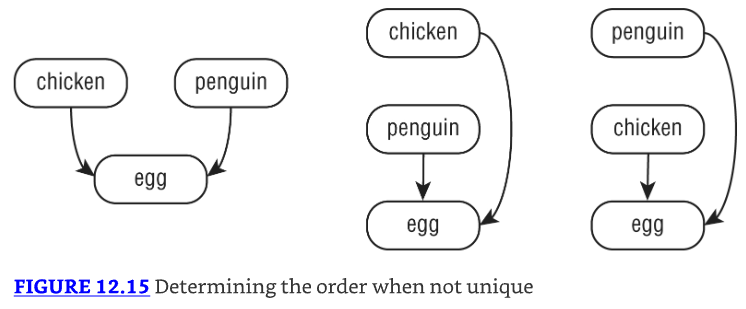


```java

```

---------------------------------------------------------------------
