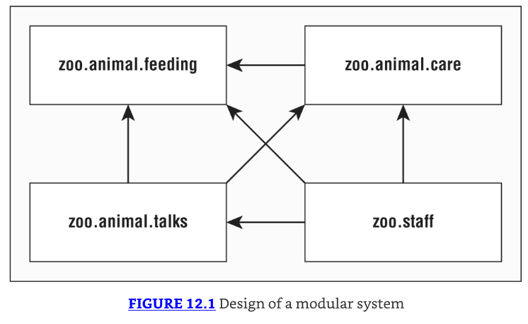
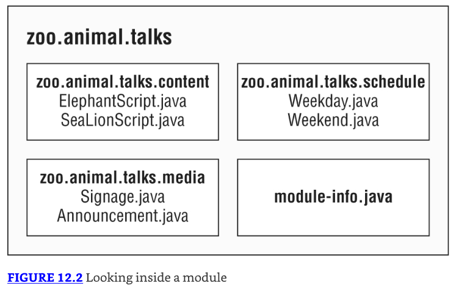
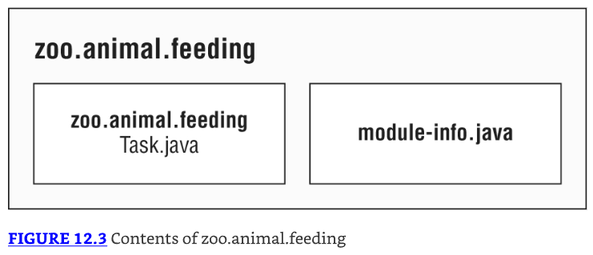
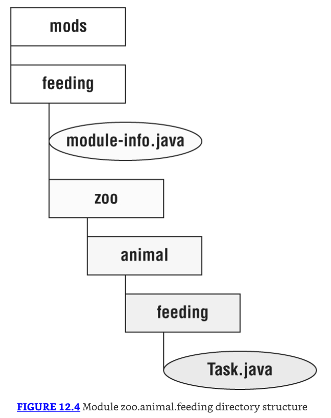
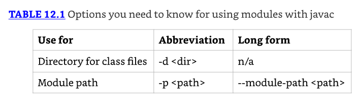
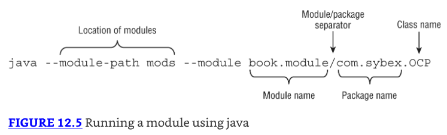
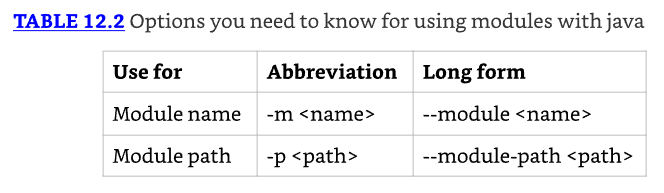
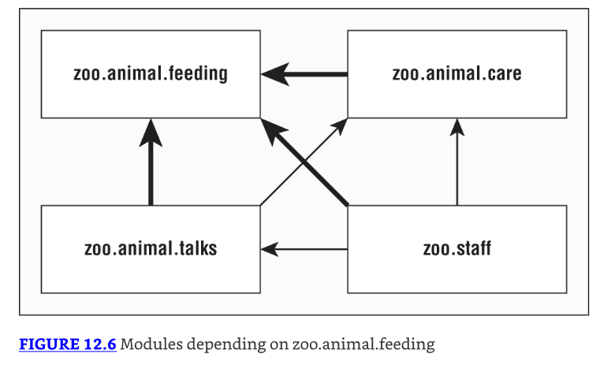
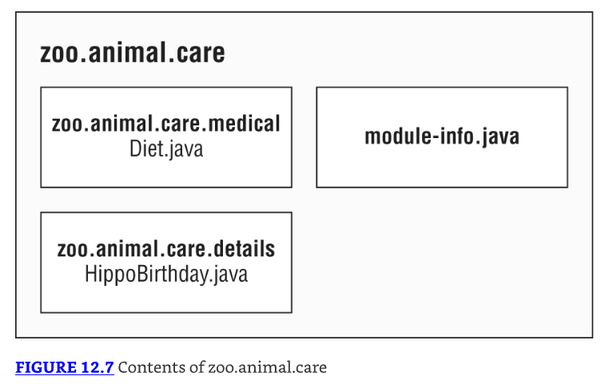

# Módulos

## Introducing Modules

* Al escribir código para el examen, generalmente ves clases pequeñas. Después de todo, las preguntas del examen tienen que caber en una sola pantalla.
* Cuando trabajas en programas reales, son mucho más grandes. Un proyecto real consistirá de cientos o miles de clases agrupadas en paquetes. 
* Estos paquetes se agrupan en archivos Java (JAR). Un JAR es un archivo ZIP con algo de información extra, y la extensión es .jar.
* Además del código escrito por tu equipo, la mayoría de las aplicaciones también usan código escrito por otros. 
* Open source es software con el código suministrado y a menudo es gratuito de usar. 
* Java tiene una vibrante comunidad de software de código abierto (OSS), y esas bibliotecas también se suministran como archivos JAR. 
* Por ejemplo, hay bibliotecas para leer archivos, conectarse a una base de datos, y mucho más.
* Algunos proyectos de código abierto incluso dependen de funcionalidad en otros proyectos de código abierto. 
* Por ejemplo, Spring es un framework comúnmente usado, y JUnit es una biblioteca de pruebas comúnmente usada. 
* Para usar cualquiera de ellas, necesitas asegurarte de tener versiones compatibles de todos los JARs relevantes disponibles en tiempo de ejecución. 
* Esta compleja cadena de dependencias y versiones mínimas es a menudo referida por la comunidad como JAR hell. 
* Hell es una excelente manera de describir la versión incorrecta de una clase siendo cargada o incluso una `ClassNotFoundException` en tiempo de ejecución.

* El Java Platform Module System (JPMS) agrupa código a un nivel más alto. 
* El propósito principal de un módulo es proporcionar grupos de paquetes relacionados que ofrecen a los desarrolladores un conjunto particular de funcionalidad. 
* Es como un archivo JAR, excepto que un desarrollador elige qué paquetes son accesibles fuera del módulo. 
* Veamos qué son los módulos y qué problemas están diseñados para resolver.

El Sistema de Módulos de la Plataforma Java incluye lo siguiente:
* Un formato para archivos JAR de módulos
* Particionamiento del JDK en módulos
* Opciones adicionales de línea de comandos para herramientas Java

### Explorando un Módulo

En Capítulo 1, "Building Blocks," tuvimos una pequeña aplicación Zoo. Tenía solo una clase y simplemente imprimía una cosa. 
Ahora imagina que teníamos todo un equipo de programadores y estábamos automatizando las operaciones del zoológico. 
Muchas cosas necesitan ser codificadas, incluyendo las interacciones con los animales, visitantes, el sitio web público, y alcance comunitario.
Un module es un grupo de uno o más paquetes más un archivo especial llamado `module-info.java`. 
Los contenidos de este archivo son la `module declaration`.
Decidimos enfocarnos en las interacciones con los animales en nuestro ejemplo. 
El zoológico completo podría fácilmente tener una docena de módulos. 
En Figure 12.1, nota que hay flechas entre muchos de los módulos. 
Estas representan dependencies, donde un módulo depende del código en otro. 
El personal necesita alimentar a los animales para mantener sus trabajos. La línea desde `zoo.staff` a `zoo.animal.feeding` muestra que el primero depende del último.



* Ahora profundicemos en uno de estos módulos. Figure 12.2 muestra qué hay dentro del módulo `zoo.animal.talks`. 
* Hay tres paquetes con dos clases cada uno. (Es un zoológico pequeño.) 
* También hay un archivo extraño llamado `module-info.java`. Este archivo es requerido para estar dentro de todos los módulos. 
* Explicamos esto con más detalle más adelante en el capítulo.



### Benefits of Modules

Los módulos parecen otra capa de cosas que necesitas conocer para programar. 
Aunque usar módulos es opcional, es importante entender los problemas que están diseñados para resolver:

* Better access control: Además de los niveles de control de acceso cubiertos en Chapter 5, "Methods," puedes tener paquetes que solo son accesibles a otros paquetes en el módulo.
* Clearer dependency management: Dado que los módulos especifican en qué dependen, Java puede quejarse sobre un JAR faltante al iniciar el programa en lugar de cuando es accedido por primera vez en tiempo de ejecución.
* Custom Java builds: Puedes crear un Java runtime que tiene solo las partes del JDK que tu programa necesita en lugar del completo de más de 150 MB.
* Improved security: Dado que puedes omitir partes del JDK de tu construcción personalizada, no tienes que preocuparte sobre vulnerabilidades descubiertas en una parte que no usas.
* Improved performance: Otro beneficio de un paquete Java más pequeño es un tiempo de inicio mejorado y un requerimiento de memoria menor.
* Unique package enforcement: Dado que los módulos especifican paquetes expuestos, Java puede asegurar que cada paquete proviene de solo un módulo y evitar confusión sobre qué está siendo ejecutado.

## Creating and Running a Modular Program

* En esta sección, creamos, construimos, y ejecutamos el módulo zoo.animal.feeding. 
* Elegimos este para comenzar porque todos los otros módulos dependen de él. Figure 12.3 muestra el diseño de este módulo. 
* Además del archivo `module-info.java`, tiene un paquete con una clase dentro.



En las siguientes secciones, creamos, compilamos, ejecutamos, y empaquetamos el módulo zoo.animal.feeding.

### Creating the Files

Primero tenemos una clase realmente simple que imprime una línea en un método main(). Sabemos, eso no es mucho de una implementación. 
Todos esos programadores que contratamos pueden llenarlo con lógica de negocio. 
En este libro, nos enfocamos en lo que necesitas conocer para el examen. Entonces, creemos una clase simple.

```java
package zoo.animal.feeding;

public class Task {
  public static void main(String... args) {
    System.out.println("All fed!");
  }
}
```

A continuación viene el archivo `module-info.java`. Este es el más simple posible:

```java
module zoo.animal.feeding {
}
```

Hay unas pocas diferencias clave entre una declaración de módulo y una declaración de clase Java regular:

* El archivo `module-info.java` debe estar en el directorio raíz de tu módulo. Las clases Java regulares deberían estar en paquetes.
* La declaración de módulo debe usar la palabra clave `module` en lugar de class, interface, o enum.
* El nombre del módulo sigue las reglas de nomenclatura para nombres de paquetes. A menudo incluye puntos (.) en su nombre. Los nombres de clases y paquetes regulares no están permitidos tener guiones (-). Los nombres de módulos siguen la misma regla.

* Eso es un montón de reglas para el archivo más simple posible. Habrá muchas más reglas cuando desarrollemos este archivo más adelante en el capítulo.
* El siguiente paso es asegurarse de que los archivos estén en la estructura de directorios correcta. Figure 12.4 muestra la estructura de directorios esperada.



* En particular, feeding es el directorio del módulo, y el archivo `module-info.java` está directamente bajo él. 
* Justo como con un archivo JAR regular, también tenemos el paquete zoo.animal.feeding con una sub carpeta por porción del nombre. 
* La clase Task está en la sub carpeta apropiada para su paquete.
* También, nota que creamos un directorio llamado mods al mismo nivel que el módulo.
* Lo usamos para almacenar los artefactos del módulo un poco más adelante en el capítulo. 
* Este directorio puede ser nombrado de cualquier manera, pero mods es un nombre común. 
* Si estás siguiendo junto con el ejemplo de código en línea, nota que el directorio mods no está incluido, porque está vacío.

### Compiling Our First Module

Antes de que podamos ejecutar código modular, necesitamos compilarlo. Aparte de la opción module-path, este código debería verse familiar desde Chapter 1:

```java
javac --module-path mods
  -d feeding
  feeding/zoo/animal/feeding/*.java feeding/module-info.java
```

---------------------------------------------------------------------
Cuando estás ingresando comandos en la línea de comandos, deberían ser escritos todos en una línea. 
Usamos saltos de línea en el libro para hacer los comandos más fáciles de leer y estudiar. 
Si quieres usar múltiples líneas en el símbolo del sistema, el enfoque varía según el sistema operativo. 
Linux usa una barra invertida (\) para escapar el salto de línea.
---------------------------------------------------------------------

* Como revisión, la opción -d especifica el directorio en el cual colocar los archivos de clase. 
* El final del comando es una lista de los archivos `.java` a compilar. 
* Puedes listar los archivos individualmente o usar un comodín para todos los archivos `.java` en un subdirectorio.
* La parte nueva es module-path. Esta opción indica la ubicación de cualquier archivo de módulo personalizado. 
* En este ejemplo, module-path podría haber sido omitido dado que no hay dependencias. 
* Puedes pensar en module-path como reemplazando la opción classpath cuando estás trabajando en un programa modular.

---------------------------------------------------------------------
What about the classpath?
La opción classpath tiene tres formas posibles: -cp, --class-path, y -classpath. Todavía puedes usar estas opciones. 
De hecho, es común hacerlo cuando escribes programas no modulares.
---------------------------------------------------------------------

* Justo como classpath, puedes usar una abreviación en el comando. La sintaxis --module-path y -p son equivalentes. 
* Eso significa que podríamos haber escrito muchos otros comandos en lugar del comando previo. 
* Los siguientes cuatro comandos muestran la opción -p:

```java
javac -p mods -d feeding
  feeding/zoo/animal/feeding/*.java feeding/*.java

javac -p mods -d feeding
  feeding/zoo/animal/feeding/*.java feeding/module-info.java

javac -p mods -d feeding
  feeding/zoo/animal/feeding/Task.java feeding/module-info.java
  
javac -p mods -d feeding
  feeding/zoo/animal/feeding/Task.java feeding/*.java
```

* Aunque puedes usar el que gustes mejor, asegúrate de que puedes reconocer todas las formas válidas para el examen. 
* Table 12.1 lista las opciones que necesitas conocer bien cuando compilas módulos. 
* Hay muchas más opciones que puedes pasar al comando javac, pero estas son las que puedes esperar que sean evaluadas.



---------------------------------------------------------------------
**Building Modules**
* Incluso sin módulos, es raro ejecutar comandos javac y java manualmente en un proyecto real. 
* Se vuelven largos y complicados muy rápidamente. La mayoría de los desarrolladores usan una herramienta de construcción como Maven o Gradle. 
* Estas herramientas de construcción sugieren directorios en los cuales colocar los archivos de clase, como target/classes.
* Es probable que la única vez que necesites conocer la sintaxis de estos comandos sea cuando tomes el examen. 
* Los conceptos en sí mismos son útiles, independientemente.
* Asegúrate de memorizar la sintaxis del comando `module`. Serás evaluado en ello en el examen. 
* Te damos muchas preguntas de práctica sobre la sintaxis para reforzarlo.
---------------------------------------------------------------------

### Running Our First Module

* Antes de que empaquetemos nuestro módulo, deberíamos asegurarnos de que funcione ejecutándolo. 
* Para hacer eso, necesitamos aprender la sintaxis completa. Supón que hay un módulo llamado `book.module`. 
* Dentro de ese módulo hay un paquete llamado com.sybex, el cual tiene una clase llamada OCP con un método main(). 
* Figure 12.5 muestra la sintaxis para ejecutar un módulo. Presta atención especial a la parte `book.module/com.sybex.OCP`. 
* Es importante recordar que especificas el nombre del módulo seguido por una barra (/) seguida por el nombre de clase completamente calificado.



* Ahora que hemos visto la sintaxis, podemos escribir el comando para ejecutar la clase Task en el paquete zoo.animal.feeding. 
* En el siguiente ejemplo, el nombre del paquete y el nombre del módulo son los mismos. 
* Es común que el nombre del módulo coincida con el nombre completo del paquete o el comienzo de él.

```java
java --module-path feeding
  --module zoo.animal.feeding/zoo.animal.feeding.Task
```

* Dado que ya viste que --module-path usa la forma corta de -p, apostamos que no te sorprenderás aprender que hay una forma corta de --module también. 
* La opción corta es -m. Eso significa que el siguiente comando es equivalente:

```java
java -p feeding
  -m zoo.animal.feeding/zoo.animal.feeding.Task
```

* En estos ejemplos, usamos feeding como el module path porque ahí es donde compilamos el código. 
* Esto cambiará una vez que empaquetemos el módulo y lo ejecutemos.
* Table 12.2 lista las opciones que necesitas conocer para el comando java.



### Packaging Our First Module

* Un módulo no es de mucha utilidad si solo podemos ejecutarlo en la carpeta en la que fue creado. 
* Nuestro siguiente paso es empaquetarlo. Asegúrate de crear un directorio mods antes de ejecutar este comando:

```java
jar -cvf mods/zoo.animal.feeding.jar -C feeding/ .
```

* No hay nada específico de módulos aquí. Estamos empaquetando todo bajo el directorio feeding y almacenándolo en un archivo JAR llamado zoo.animal.feeding.jar bajo la carpeta mods. 
* Este representa cómo el JAR del módulo se verá para otro código que quiera usarlo.
* Ahora ejecutemos el programa de nuevo, pero esta vez usando el directorio mods en lugar de las clases sueltas:

```java
java -p mods
  -m zoo.animal.feeding/zoo.animal.feeding.Task
```

* Podrías notar que este comando se ve idéntico al de la sección previa excepto por el directorio. En el ejemplo previo, era feeding. 
* En este, es el module path de mods. Dado que el module path es usado, un JAR de módulo está siendo ejecutado.

## Updating Our Example for Multiple Modules

* Ahora que nuestro módulo zoo.animal.feeding es sólido, podemos empezar a pensar sobre nuestros otros módulos. 
* Como puedes ver en Figure 12.6, los tres otros módulos en nuestro sistema dependen del módulo zoo.animal.feeding.



### Updating the Feeding Module

* Dado que tendremos nuestros otros módulos llamando código en el paquete zoo.animal.feeding, necesitamos declarar esta intención en la declaración del módulo.
* La directiva exports es usada para indicar que un módulo intenta que esos paquetes sean usados por código Java fuera del módulo. 
* Como podrías esperar, sin una directiva exports, el módulo solo está disponible para ser ejecutado desde la línea de comandos por sí mismo. 
* En el siguiente ejemplo, exportamos un paquete:

```java
module zoo.animal.feeding {
  exports zoo.animal.feeding;
}
```

* Recompilar y reempaquetar el módulo actualizará el archivo `module-info.class` dentro de nuestro archivo zoo.animal.feeding.jar. 
* Estos son los mismos comandos javac y jar que ejecutaste previamente:

```java
javac -p mods
  -d feeding
  feeding/zoo/animal/feeding/*.java feeding/module-info.java

jar -cvf mods/zoo.animal.feeding.jar -C feeding/ .
```

### Creating a Care Module

* A continuación, creemos el módulo zoo.animal.care. Esta vez, vamos a tener dos paquetes. 
* El paquete zoo.animal.care.medical tendrá las clases y métodos que están destinados para uso por otros módulos. 
* El paquete zoo.animal.care.details solo va a ser usado por este módulo. No será exportado desde el módulo. 
* Piensa en ello como privacidad de salud para los animales.

Figure 12.7 muestra los contenidos de este módulo. Recuerda que todos los módulos deben tener un archivo module-info.java.



El módulo contiene dos paquetes básicos y clases además del archivo `module-info.java`:

```java
// HippoBirthday.java
package zoo.animal.care.details;
import zoo.animal.feeding.*;

public class HippoBirthday {
    private Task task;
}

// Diet.java
package zoo.animal.care.medical;
public class Diet { }
```

Esta vez el archivo `module-info.java` especifica tres cosas:

```java
1: module zoo.animal.care {
2:   exports zoo.animal.care.medical;
3:   requires zoo.animal.feeding;
4: }
```

* Line 1 especifica el nombre del módulo. Line 2 lista el paquete que estamos exportando para que pueda ser usado por otros módulos. 
* Hasta ahora, esto es similar al módulo zoo.animal.feeding.
* En line 3, vemos una nueva directiva. La declaración requires especifica que un módulo es necesario. 
* El módulo zoo.animal.care depende del módulo zoo.animal.feeding.
* A continuación, necesitamos determinar la estructura de directorios. Crearemos dos paquetes. 
* El primero es zoo.animal.care.details y contiene una clase llamada HippoBirthday. 
* El segundo es zoo.animal.care.medical, el cual contiene una clase llamada Diet. 
* Intenta dibujar la estructura de directorios en papel o créala en tu computadora. 
* Si estás tratando de ejecutar estos ejemplos sin usar el código en línea, simplemente crea clases sin variables o métodos para todo excepto los archivos module-info.java.


```java

```

---------------------------------------------------------------------

Diving into the Module Declaration
Creating a Service
Discovering Modules
Comparing Types of Modules
Migrating an Application
Summary