# Concurrencia

* En este capítulo, se introduce el concepto de threads y se proporcionan numerosas formas de gestionar threads usando la Concurrency API. 
* Los threads y la concurrencia son temas desafiantes para muchos programadores, ya que los problemas con threads pueden ser frustrantes incluso para desarrolladores veteranos. 
* En la práctica, los problemas de concurrencia están entre los más difíciles de diagnosticar y resolver.

## Introducing Threads

* Se revisa la terminología común asociada con threads. Un thread es la unidad más pequeña de ejecución que puede ser programada por el sistema operativo. 
* Un process es un grupo de threads asociados que se ejecutan en el mismo entorno compartido. 
* Se deduce entonces que un single-threaded es uno que contiene exactamente un thread, mientras que un multithreaded process soporta más de un thread.

* Por shared environment (entorno compartido), se refiere a que los threads en el mismo proceso comparten el mismo espacio de memoria y pueden comunicarse directamente unos con otros. 
* Se hace referencia a la Figure 13.1 para una visión general de los threads y su entorno compartido dentro de un proceso.

* Por shared environment (entorno compartido), se refiere a que los threads en el mismo proceso comparten el mismo espacio de memoria y pueden comunicarse directamente unos con otros. 
* Se hace referencia a la Figure 13.1 para una visión general de los threads y su entorno compartido dentro de un proceso.
* Esta figura muestra un único proceso con tres threads. También muestra cómo están mapeados a un número arbitrario de `n` CPU disponibles dentro del sistema. 
* Se debe mantener este diagrama en mente cuando se discutan los task schedulers más adelante en esta sección.

* En este capítulo, se habla mucho sobre tasks y sus relaciones con los threads. Un task es una única unidad de trabajo realizada por un thread. 
* A lo largo de este capítulo, un task comúnmente será implementado como una lambda expression. 
* Un thread puede completar múltiples tasks independientes pero solo un task a la vez.

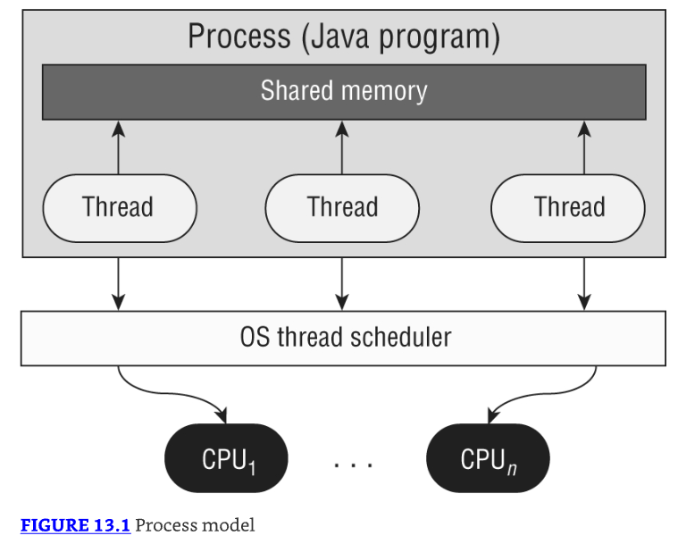

* Por shared memory en la Figure 13.1, generalmente se está refiriendo a variables estáticas así como a variables de instancia y locales pasadas a un thread. 
* Sí, finalmente se ve cómo las variables estáticas pueden ser útiles para realizar tasks complejas y multithreaded. 
* Se recuerda del Chapter 5, "Methods," que los métodos estáticos y las variables están definidas en un único objeto de clase que todas las instancias comparten. 
* Por ejemplo, si un thread actualiza el valor de un objeto estático, esta información está inmediatamente disponible para que otros threads dentro del proceso la lean.

### Understanding Thread Concurrency

* La propiedad de ejecutar múltiples threads y procesos al mismo tiempo se refiere como concurrency. 
* ¿Cómo decide el sistema qué ejecutar cuando hay más threads disponibles que CPU? 
* Los sistemas operativos usan un thread scheduler para determinar qué threads deberían estar ejecutándose actualmente, como se muestra en Figure 13.1. 
* Por ejemplo, un thread scheduler puede emplear un round-robin schedule en el cual cada thread disponible recibe un número igual de ciclos de CPU con los cuales ejecutar, con los threads visitados en un orden circular.

* Cuando el tiempo asignado de un thread está completo, pero el thread no ha terminado de procesar, ocurre un context switch. 
* Un context switch es el proceso de almacenar el estado actual de un thread y posteriormente restaurar el estado del thread para continuar la ejecución. 
* Se debe tener en cuenta que a menudo hay un costo asociado con un context switch debido al tiempo perdido y a tener que recargar el estado de un thread. 
* Los thread schedulers inteligentes hacen su mejor esfuerzo para minimizar el número de context switches mientras mantienen una aplicación ejecutándose suavemente.

* Finalmente, un thread puede interrumpir o reemplazar a otro thread si tiene una prioridad de thread más alta que el otro thread. 
* Un thread priority es un valor numérico asociado con un thread que es tomado en consideración por el thread scheduler al determinar qué threads deberían estar ejecutándose actualmente. 
* En Java, las prioridades de thread se especifican como valores enteros.

### Creating a Thread

* Una de las formas más comunes de definir un task para un thread es usando la instancia Runnable. 
* Runnable es una interfaz funcional que no toma argumentos y no retorna datos.

```java
@FunctionalInterface public interface Runnable {
    void run();
}
```

Con esto, es fácil crear e iniciar un thread. De hecho, puedes hacerlo en una línea de código usando la clase Thread:

```java
new Thread(() -> System.out.print("Hello")).start();
System.out.print("World");
```

* La primera línea crea un nuevo objeto Thread y luego lo inicia con el método start(). ¿Este código imprime HelloWorld o WorldHello? 
* La respuesta es que no lo sabemos. Dependiendo de la prioridad del thread/scheduler, cualquiera es posible. 
* Se debe recordar que el orden de ejecución de threads no está garantizado a menudo. 
* El examen comúnmente presenta preguntas en las cuales múltiples tasks se inician al mismo tiempo, y debes determinar el resultado.

Echemos un vistazo a un ejemplo más complejo:

```java
Runnable printInventory = () -> System.out.println("Printing zoo inventory");
Runnable printRecords = () -> {
  for (int i = 0; i < 3; i++)
    System.out.println("Printing record: " + i);
};
```

Dadas estas instancias, ¿cuál es la salida de lo siguiente?

```java
3: System.out.println("begin");
4: new Thread(printInventory).start();
5: new Thread(printRecords).start();
6: new Thread(printInventory).start();
7: System.out.println("end");
```

La respuesta es que es desconocido hasta el tiempo de ejecución. Lo siguiente es solo una posible salida:

begin
Printing record: 0
Printing zoo inventory
end
Printing record: 1
Printing zoo inventory
Printing record: 2

* Este ejemplo usa un total de cuatro threads: el thread usuario main() y tres threads adicionales creados en las líneas 4–6. 
* Cada thread creado en estas líneas es ejecutado como un asynchronous task. 
* Por asynchronous, se refiere a que el thread que ejecuta el método main() no espera los resultados de cada thread recién creado antes de continuar. 
* Por ejemplo, las líneas 5 y 6 pueden ser ejecutadas antes de que el thread creado en la línea 4 termine. 
* Lo opuesto a este comportamiento es un synchronous task en el cual el programa espera (o blocks) en la línea 4 para que el thread termine de ejecutarse antes de moverse a la siguiente línea. 
* La gran mayoría de las llamadas a métodos usadas en este libro han sido sincrónicas hasta este capítulo.

* Mientras que el orden de ejecución de threads es indeterminado una vez que los threads han sido iniciados, el orden dentro de un único thread es aún lineal. 
* En particular, el loop for() sigue estando ordenado. También, begin siempre aparece antes de end.

---------------------------------------------------------------------
**Calling run() Instead of start()**
* En el examen, se debe tener cuidado con código que intenta iniciar un thread llamando a run() en lugar de start(). 
* Llamar a run() en un Thread o un Runnable does not start a new thread. 
* Mientras que los siguientes fragmentos de código compilarán, ninguno ejecutará un task en un thread separado:

```java
System.out.println("begin");
new Thread(printInventory).run();
new Thread(printRecords).run();
new Thread(printInventory).run();
System.out.println("end");
```

* A diferencia del ejemplo anterior, cada línea de este código esperará hasta que el método run() esté completo antes de moverse a la siguiente línea. 
* También a diferencia del programa anterior, la salida para este ejemplo de código será la misma cada vez que se ejecute.
---------------------------------------------------------------------

Más generalmente, podemos crear un Thread y su task asociado de una de dos maneras en Java:

Lado derecho:
* Provide a Runnable object or lambda expression to the Thread constructor.
* Create a class that extends Thread and overrides the run() method.

* A lo largo de este libro, se prefiere crear tasks con lambda expressions. 
* Después de todo, es mucho más fácil, especialmente cuando llegamos a la Concurrency API. 
* Crear una clase que extiende Thread es relativamente poco común y solo debería hacerse bajo ciertas circunstancias, como si necesitas sobrescribir otros métodos de thread.

### Distinguishing Thread Types

* Puede sorprenderte que todas las aplicaciones Java, incluyendo todas las que hemos presentado en este libro, son multithreaded porque incluyen system threads. 
* Un system thread es creado por la Java Virtual Machine (JVM) y se ejecuta en el fondo de la aplicación. 
* Por ejemplo, garbage collection es gestionado por un system thread creado por la JVM.

* Alternativamente, un user-defined thread es uno creado por el desarrollador de aplicación para llevar a cabo un task específico. 
* La mayoría de los programas que hemos presentado hasta ahora han contenido solo un user-defined thread, el cual llama al método main(). 
* Por simplicidad, comúnmente nos referimos a programas que contienen solo un único user-defined thread como single-threaded applications.

* Tanto los system threads como los user-defined threads pueden ser creados como daemon threads. 
* Un daemon thread es uno que no impedirá que la JVM salga cuando el programa termine. 
* Una aplicación Java termina cuando los únicos threads que están ejecutándose son daemon threads. 
* Por ejemplo, si garbage collection es el único thread que queda ejecutándose, la JVM se apagará automáticamente.

Echemos un vistazo a un ejemplo. ¿Qué crees que este código produce como salida?

```java
1: public class Zoo {
2:   public static void pause() {        // Defines the thread task
3:     try {
4:       Thread.sleep(10_000);            // Wait for 10 seconds
5:     } catch (InterruptedException e) {}
6:     System.out.println("Thread finished!");
7:   }
8:
9:   public static void main(String[] unused) {
10:    var job = new Thread(() -> pause());  // Create thread
11:
12:    job.start();                        // Start thread
13:    System.out.println("Main method finished!");
14:  } }
```

El programa producirá dos declaraciones aproximadamente con 10 segundos de diferencia:

Main method finished!
--- 10 second wait ---
Thread finished!

* Eso es correcto. Aunque el método main() está terminado, la JVM esperará a que el user thread esté hecho antes de finalizar el programa. 
* ¿Qué pasa si cambiamos job para que sea un daemon thread agregando esto a la línea 11?

`11:    job.setDaemon(true);`

El programa imprimirá la primera declaración y terminará sin nunca imprimir la segunda línea.

`Main method finished!`

Para el examen, solo hay que recordar que por defecto, los user-defined threads no son daemons, y el programa esperará a que terminen.

### Managing a Thread's Life Cycle

Después de que un thread ha sido creado, está en uno de seis estados, mostrado en Figure 13.2. 
Puedes consultar el estado de un thread llamando a getState() en el objeto thread.

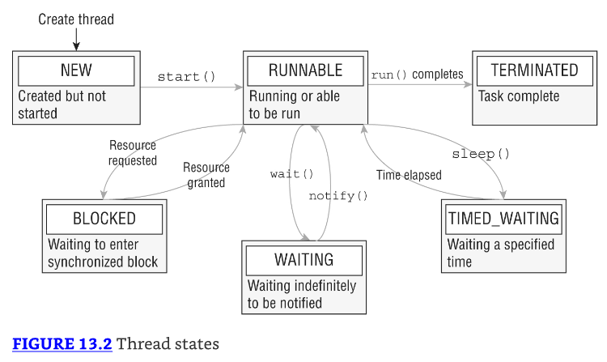

* Cada thread es inicializado con un estado NEW. Tan pronto como se llama a start(), el thread se mueve a un estado RUNNABLE. 
* ¿Significa eso que está realmente ejecutándose? No exactamente: puede estar ejecutándose, o puede no estarlo. 
* El estado RUNNABLE solo significa que el thread es capaz de ejecutarse. 
* Una vez que el trabajo para el thread está completo o se lanza una excepción no capturada, el estado del thread se convierte en TERMINATED, y no se realiza más trabajo.

* Mientras está en un estado RUNNABLE, el thread puede hacer transición a uno de tres estados donde pausa su trabajo: BLOCKED, WAITING, o TIMED_WAITING.

* Esta figura incluye transiciones comunes entre estados de thread, pero hay otras posibilidades. 
* Por ejemplo, un thread en un estado WAITING puede ser disparado por notifyAll(). 
* De manera similar, un thread que es interrumpido por otro thread saldrá de TIMED_WAITING y volverá directamente a RUNNABLE.

* Cubrimos algunas (pero no todas) de estas transiciones en este capítulo. 
* Algunos métodos relacionados con threads—como wait(), notify(), y join()—están más allá del alcance del examen y, francamente, son difíciles de usar bien. 
* Deberías evitarlos y usar la Concurrency API tanto como sea posible. Se requiere una gran cantidad de habilidad (y algo de suerte). 
* Para usar estos métodos correctamente.

### Polling with Sleep

* Aunque la programación multithreaded te permite ejecutar múltiples tasks al mismo tiempo, un thread a menudo necesita esperar los resultados de otro thread para proceder. 
* Una solución es usar polling. Polling es el proceso de verificar datos intermitentemente en algún intervalo fijo.

Digamos que tienes un thread que modifica un valor de contador estático compartido, y tú thread main() está esperando a que el thread alcance 1 millón:

```java
public class CheckResults {
  private static int counter = 0;
  public static void main(String[] args) {
    new Thread(() -> {
        for(int i = 0; i < 1_000_000; i++) counter++;
    }).start();
      while(counter < 1_000_000) {
          System.out.println("Not reached yet");
      }
      System.out.println("Reached: "+counter);
  } }
```

* ¿Cuántas veces imprime este programa "Not reached yet"? La respuesta es, no lo sabemos. Podría producir 0, 10, o un millón de veces. 
* Usar un loop while() para verificar datos sin algún tipo de retraso es considerado una mala práctica de codificación, ya que consume recursos de CPU sin razón.

Podemos mejorar este resultado usando el método Thread.sleep() para implementar polling y dormir por 1,000 milisegundos, también conocido como 1 segundo:

```java
public class CheckResultsWithSleep {
  private static int counter = 0;
  public static void main(String[] a) {
    new Thread(() -> {
      for(int i = 0; i < 1_000_000; i++) counter++;
    }).start();
    while(counter < 1_000_000) {
      System.out.println("Not reached yet");
        try {
            Thread.sleep(1_000); // 1 SECOND
        } catch (InterruptedException e) {
            System.out.println("Interrupted!");
        }
    }
      System.out.println("Reached: "+counter);
  } }
```

* Mientras que un segundo puede parecer una cantidad pequeña, ahora hemos liberado la CPU para hacer otro trabajo en lugar de verificar la variable counter infinitamente dentro de un loop. 
* Nota que el thread main() alterna entre TIMED_WAITING y RUNNABLE cuando sleep() es ingresado y salido, respectivamente.

* ¿Cuántas veces ejecuta el loop while() en esta clase revisada? Aún desconocido. 
* Mientras que polling previene que la CPU sea sobrecargada con un loop potencialmente infinito, no garantiza cuándo el loop terminará. 
* Por ejemplo, el thread separado podría estar perdiendo tiempo de CPU ante un proceso de mayor prioridad, resultando en múltiples ejecuciones del loop while() antes de que finalice.

* Otro problema del que hay que preocuparse es la variable counter compartida. 
* ¿Qué pasa si un thread está leyendo la variable counter mientras otro thread la está escribiendo? 
* El thread que lee la variable compartida puede terminar con un valor inválido o valor inesperado
* . Discutimos estos problemas en detalle en la próxima sección sobre, escribir código thread-safe.

### Interrupting a Thread

* Mientras que nuestra solución anterior previno que la CPU esperara infinitamente en un loop while(), sí llegó al costo de insertar retrasos de un segundo en nuestro programa. 
* Si el task toma 2.1 segundos para ejecutarse, el programa usará los 3 segundos completos, desperdiciando 0.9 segundos.

Una forma de mejorar este programa es permitir que el thread interrumpa el thread main() cuando haya terminado:

```java
public class CheckResultsWithSleepAndInterrupt {
  private static int counter = 0;
  public static void main(String[] a) {
    final var mainThread = Thread.currentThread();
    new Thread(() -> {
      for(int i = 0; i < 1_000_000; i++) counter++;
      mainThread.interrupt();
    }).start();
    while(counter < 1_000_000) {
      System.out.println("Not reached yet");
      try {
          Thread.sleep(1_000); // 1 SECOND
      } catch (InterruptedException e) {
          System.out.println("Interrupted!");
      }
    }
      System.out.println("Reached: "+counter);
  } }
```

* Esta versión mejorada incluye tanto sleep(), para evitar consumir la CPU, como interrupt(), por lo que el trabajo del thread termina sin retrasar el programa. 
* Como antes, el estado del thread main() alterna entre TIMED_WAITING y RUNNABLE. 
* Llamar a interrupt() en un thread en el estado TIMED_WAITING o WAITING causa que el thread main() se vuelva RUNNABLE nuevamente, disparando una InterruptedException. 
* El thread también puede moverse a un estado BLOCKED si necesita readquirir recursos cuando se despierta.

---------------------------------------------------------------------
* Llamar a interrupt() en un thread que ya está en un estado RUNNABLE no cambia el estado. 
* De hecho, solo cambia el comportamiento si el thread está verificando periódicamente el valor de estado de Thread.isInterrupted().
---------------------------------------------------------------------

## Creating Threads with the Concurrency API

* Java incluye el paquete java.util.concurrent, al cual nos referimos como la Concurrency API, para manejar el trabajo complicado de gestionar threads por ti. 
* La Concurrency API incluye la interfaz ExecutorService, la cual define servicios que crean y gestionan threads.

* Primero obtienes una instancia de una interfaz ExecutorService, y luego envías los tasks del servicio para ser procesados. 
* El framework incluye numerosas características útiles, como thread pooling y scheduling. 
* Se recomienda que uses este framework cada vez que necesites crear y ejecutar un task separado, incluso si necesitas solo un único thread.

---------------------------------------------------------------------
* Cuando se escriben programas multithreaded en la práctica, a menudo es mejor usar la Concurrency API (o algún otro SDK multithreaded) en lugar de trabajar con objetos Thread directamente. 
* Las bibliotecas son mucho más robustas, y es más fácil manejar interacciones complejas.
---------------------------------------------------------------------

### Introducing the Single-Thread Executor

* Dado que ExecutorService es una interfaz, ¿cómo obtienes una instancia de ella? 
* La Concurrency API incluye la clase factory Executors que puede ser usada para crear instancias del objeto ExecutorService. 
* Reescribamos nuestro ejemplo anterior con las dos instancias Runnable para usar un ExecutorService.

```java
ExecutorService service = Executors.newSingleThreadExecutor();
try {
  System.out.println("begin");
  service.execute(printInventory);
  service.execute(printRecords);
  service.execute(printInventory);
  System.out.println("end");
} finally {
  service.shutdown();
}
```

* En este ejemplo, usamos el método newSingleThreadExecutor() para crear el service. 
* A diferencia de nuestro ejemplo anterior, en el cual teníamos cuatro threads (un main() y tres threads nuevos), tenemos solo dos threads (un main() y un thread nuevo). 
* Esto significa que la salida, aunque todavía impredecible, tendrá menos variación que antes. Por ejemplo, lo siguiente es una posible salida:

begin
Printing zoo inventory
Printing record: 0
Printing record: 1
end
Printing record: 2
Printing zoo inventory

* Nota que el loop printRecords ya no es interrumpido por otros tasks Runnable enviados al thread executor. 
* Con un single-thread executor, los tasks están garantizados de ser ejecutados secuencialmente. 
* Nota que el texto end es producido mientras nuestros tasks del thread executor todavía están ejecutándose. 
* Esto es porque el método main() sigue siendo un thread independiente del ExecutorService.

### Shutting Down a Thread Executor

* Una vez que has terminado de usar un thread executor, es importante que llames al método shutdown(). 
* Un thread executor crea un thread non-daemon en el primer task que es ejecutado, por lo que fallar al llamar a shutdown() resultará en que tu aplicación never terminating.

* El proceso de shutdown para un thread executor involucra primero rechazar cualquier task nuevo enviado al thread executor mientras continúa ejecutando cualquier task previamente enviado. 
* Durante este tiempo, llamar a isShutdown() retornará true, mientras que isTerminated() retornará false. 
* Si un nuevo task es enviado al thread executor mientras se está apagando, una RejectedExecutionException será lanzada. 
* Una vez que todos los tasks activos han sido completados, isShutdown() e isTerminated() retornarán ambos true. 
* Figure 13.3 muestra el ciclo de vida de un objeto ExecutorService.

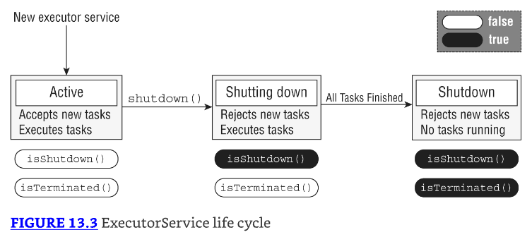

Para el examen, debes estar consciente de que shutdown() no detiene ningún task que ya haya sido enviado al thread executor.

* ¿Qué pasa si quieres cancelar todos los tasks en ejecución y próximos? 
* El ExecutorService proporciona un método llamado shutdownNow(), el cual attempts to stop todos los tasks en ejecución y descarta cualquiera que no haya sido iniciado aún. 
* No está garantizado que tenga éxito porque es posible crear un thread que nunca terminará, por lo que cualquier intento de interrumpirlo puede ser ignorado.

---------------------------------------------------------------------
Como aprendiste en Chapter 11, "Exceptions and Localization," los recursos como thread executors deberían ser cerrados apropiadamente para prevenir memory leaks. 
Desafortunadamente, la interfaz ExecutorService no extiende la interfaz AutoCloseable, por lo que no puedes usar una declaración try-with-resources. 
Aún puedes usar un bloque finally, como lo hacemos a lo largo de este capítulo. 
Mientras que no estás obligado a usar un bloque finally, se considera una buena práctica hacerlo.
---------------------------------------------------------------------

### Submitting Tasks

* Puedes enviar tasks a una instancia ExecutorService de múltiples maneras. 
* El primer método que presentamos, execute(), es heredado de la interfaz Executor, la cual la interfaz ExecutorService extiende. 
* El método execute() toma una instancia Runnable y completa el task asincrónicamente. 
* Porque el tipo de retorno del método es void, no nos dice nada sobre el resultado del task. 
* Es considerado un método "fire-and-forget", ya que una vez que es enviado, los resultados no están directamente disponibles para el thread que llama.

* Afortunadamente, los escritores de Java agregaron métodos submit() a la interfaz ExecutorService, los cuales, como execute(), pueden ser usados para completar tasks asincrónicamente. 
* A diferencia de execute(), sin embargo, submit() retorna una instancia Future que puede ser usada para determinar si el task está completo. 
* También puede ser usada para retornar un objeto de resultado genérico después de que el task ha sido completado.

* Table 13.1 muestra los cinco métodos, incluyendo execute() y dos métodos submit(), que deberías conocer para el examen. 
* No te preocupes si no has visto Future o Callable antes; los discutimos en detalle en la próxima sección.

En la práctica, usar el método submit() es bastante similar a usar el método execute(), excepto que el método submit() retorna una instancia Future que puede ser usada para determinar si el task ha completado su ejecución.

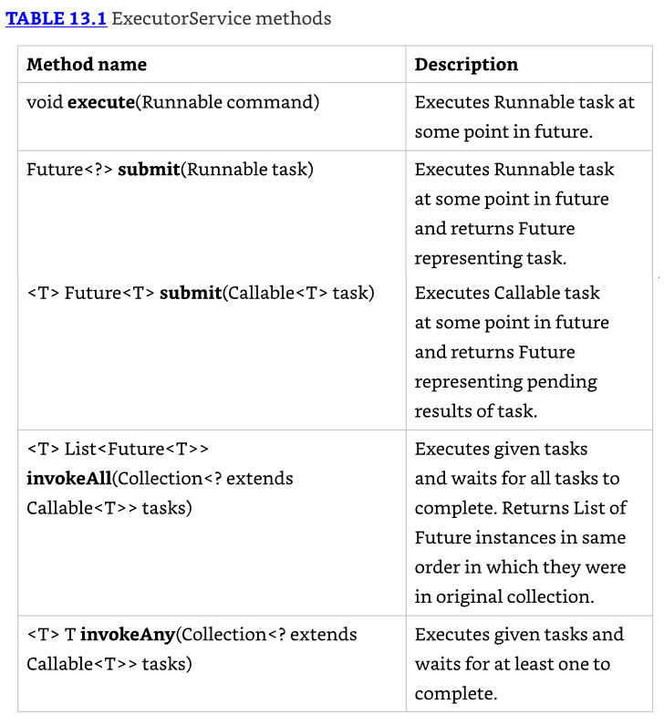

---------------------------------------------------------------------
**"Submitting Tasks: execute() vs. submit()":**
* Como podrías haber notado, los métodos execute() y submit() son casi idénticos cuando se aplican a expresiones Runnable. 
* El método submit() tiene la ventaja obvia de hacer lo mismo que execute() hace, pero con un objeto de retorno que puede ser usado para rastrear el resultado. 
* Debido a esta ventaja y al hecho de que execute() no soporta expresiones Callable, tendemos a preferir submit() sobre execute(), incluso si no almacenamos la referencia Future.

* Para el examen, necesitas estar familiarizado tanto con execute() como con submit(), pero en tu propio código recomendamos submit() sobre execute() cuando sea posible.
---------------------------------------------------------------------

### Waiting for Results

* ¿Cómo sabemos cuándo un task enviado a un ExecutorService está completo? 
* Como se mencionó en la sección anterior, el método submit() retorna una instancia Future<V> que puede ser usada para determinar este resultado.

`Future<?> future = service.submit(() -> System.out.println("Hello"));`

* El tipo Future es en realidad una interfaz. Para el examen, no necesitas conocer ninguna de las clases que implementan Future, solo que una instancia Future es retornada por varios métodos de la API. 
* Table 13.2 incluye métodos útiles para determinar el estado de un task.

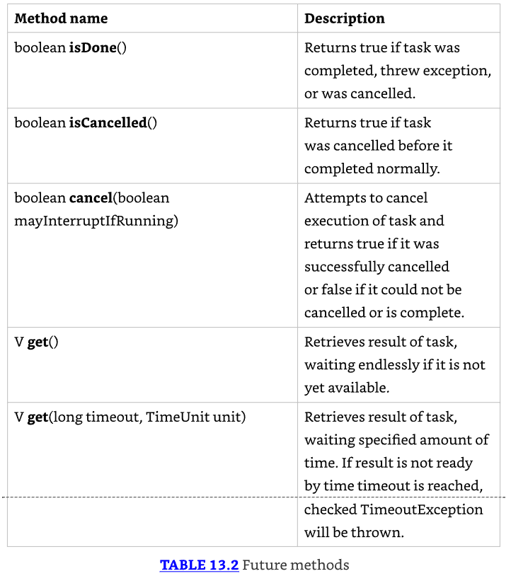

Lo siguiente es una versión actualizada de nuestro ejemplo anterior de polling, la clase CheckResults, que usa una instancia Future para esperar los resultados:

```java
import java.util.concurrent.*;
public class CheckResults {
  private static int counter = 0;
  public static void main(String[] unused) throws Exception {
    ExecutorService service = Executors.newSingleThreadExecutor();
    try {
      Future<?> result = service.submit(() -> {
        for(int i = 0; i < 1_000_000; i++) counter++;
      });
      result.get(10, TimeUnit.SECONDS); // Returns null for Runnable
      System.out.println("Reached!");
    } catch (TimeoutException e) {
      System.out.println("Not reached in time");
    } finally {
      service.shutdown();
    } } }
```

* Este ejemplo es similar a nuestra implementación de polling anterior, pero no usa la clase Thread directamente. 
* En parte, esta es la esencia de la Concurrency API: hacer cosas complejas con threads sin tener que gestionar threads directamente. 
* También espera como máximo 10 segundos, lanzando una TimeoutException en la llamada a result.get() si el task no está terminado.

* ¿Cuál es el valor de retorno de este task? Como Future<V> es una interfaz genérica, el tipo V es determinado por el tipo de retorno del método Runnable. 
* Dado que el tipo de retorno de Runnable.run() es void, el método get() siempre retorna null cuando se trabaja con expresiones Runnable.

* El método Future.get() puede tomar un valor opcional y un tipo enum `java.util.concurrent.TimeUnit`. 
* Table 13.3 presenta la lista completa de valores TimeUnit dado que numerosos métodos en la Concurrency API usan este enum.

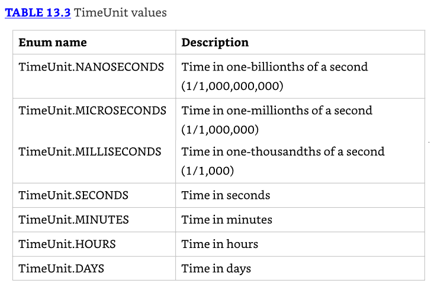

### Introducing Callable

* La interfaz funcional `java.util.concurrent.Callable` es similar a Runnable excepto que su método call() retorna un valor y puede lanzar una excepción verificada. 
* Lo siguiente es la definición de la interfaz Callable:

```java
@FunctionalInterface public interface Callable<V> {
  V call() throws Exception;
}
```

* La interfaz Callable a menudo es preferible sobre Runnable, ya que permite que más detalles sean recuperados fácilmente del task después de que está completado. 
* Dicho esto, usamos ambas interfaces a lo largo de este capítulo, ya que son intercambiables en situaciones donde la lambda no lanza una excepción, y no hay tipo de retorno. 
* Afortunadamente, el ExecutorService incluye una versión sobrecargada del método submit() que toma un objeto Callable y retorna una instancia genérica Future<T>.
* A diferencia de Runnable, en el cual los métodos get() siempre retornan null, los métodos get() en una instancia Future retornan el tipo genérico coincidente (que también podría ser un valor null).

Echemos un vistazo a un ejemplo usando Callable:

```java
var service = Executors.newSingleThreadExecutor();
try {
  Future<Integer> result = service.submit(() -> 30 + 11);
  System.out.println(result.get()); // 41
} finally {
  service.shutdown();
}
```

Podríamos reescribir este ejemplo usando Runnable, algún objeto compartido, y un interrupt() o timed wait, pero esta implementación es mucho más fácil de codificar y entender. 
En esencia, ese es el espíritu de la Concurrency API, dándote las herramientas para escribir código multithreaded que es thread-safe, eficiente, y fácil de seguir.

### Waiting for All Tasks to Finish

* Después de enviar un conjunto de tasks a un thread executor, es común esperar los resultados. Como viste en las secciones anteriores, una solución es llamar a get() en cada objeto Future retornado por el método submit(). 
* Si no necesitamos los resultados de los tasks y están terminados usando nuestro thread executor, hay un enfoque más simple.

* Primero, apagamos el thread executor usando el método shutdown(). Luego, usamos el método awaitTermination() disponible para todos los thread executors. 
* El método espera el tiempo especificado para completar todos los tasks, retornando antes si todos los tasks terminan o una InterruptedException es detectada. 
* Puedes ver un ejemplo de esto en el siguiente fragmento de código:

```java
ExecutorService service = Executors.newSingleThreadExecutor();
try {
  // Add tasks to the thread executor
  ...
} finally {
  service.shutdown();
}
service.awaitTermination(1, TimeUnit.MINUTES);

// Check whether all tasks are finished
if(service.isTerminated()) System.out.println("Finished!");
else System.out.println("At least one task is still running");
```

* En este ejemplo, enviamos un número de tasks al thread executor y luego apagamos el thread executor y esperamos hasta un minuto para los resultados. 
* Nota que podemos llamar a isTerminated() después de que el método awaitTermination() termina para confirmar que todos los tasks están finalizados.

### Scheduling Tasks

* A menudo en Java, necesitamos programar un task para que ocurra en algún momento futuro. 
* Incluso podríamos necesitar programar el task para que ocurra repetidamente, en algún intervalo establecido. 
* Por ejemplo, imagina que queremos verificar el suministro de comida para los animales del zoológico una vez por hora y llenarlo según sea necesario. 
* ScheduledExecutorService, que es una sub interfaz de ExecutorService, puede ser usada para justo tal task.

Como ExecutorService, obtenemos una instancia de ScheduledExecutorService usando un método factory en la clase Executors, como se muestra en el siguiente fragmento:

```java
ScheduledExecutorService service
  = Executors.newSingleThreadScheduledExecutor();
```

Podríamos almacenar una instancia de ScheduledExecutorService en una variable ExecutorService, aunque hacerlo significaría que tendríamos que hacer un cast del objeto para llamar a cualquier método de scheduling.

Consulta Table 13.4 para nuestro resumen de los métodos de ScheduledExecutorService. Cada uno de estos métodos retorna un objeto ScheduledFuture.

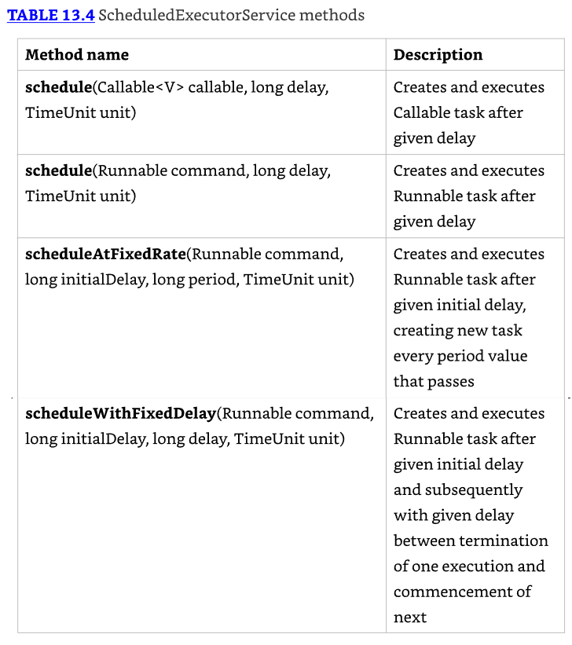

* En la práctica, estos métodos están entre los más convenientes en la Concurrency API, ya que realizan tasks relativamente complejas con una única línea de código. 
* Los parámetros delay y period se basan en el argumento TimeUnit para determinar el formato del valor, como segundos o milisegundos.

* Los primeros dos métodos schedule() en Table 13.4 toman un Callable o Runnable, respectivamente; realizan el task después de algún retraso; y retornan una instancia ScheduledFuture. 
* La interfaz ScheduledFuture es idéntica a la interfaz Future, excepto que incluye un método getDelay() que retorna el retraso restante. 
* Lo siguiente usa el método schedule() con tasks Callable y Runnable:

```java
ScheduledExecutorService service
  = Executors.newSingleThreadScheduledExecutor();
Runnable task1 = () -> System.out.println("Hello Zoo");
Callable<String> task2 = () -> "Monkey";
ScheduledFuture<?> r1 = service.schedule(task1, 10, TimeUnit.SECONDS);
ScheduledFuture<?> r2 = service.schedule(task2, 8, TimeUnit.MINUTES);
```

El primer task está programado 10 segundos en el futuro, mientras que el segundo task está programado 8 minutos en el futuro.

---------------------------------------------------------------------
* Mientras que estos tasks están programados en el futuro, la ejecución real puede ser retrasada. 
* Por ejemplo, puede no haber threads disponibles para realizar los tasks, en cuyo punto simplemente esperarán en la cola. 
* También, si el ScheduledExecutorService es apagado para el momento en que el tiempo de ejecución del task programado es alcanzado, entonces estos tasks serán descartados.
---------------------------------------------------------------------

* Cada uno de los métodos de ScheduledExecutorService es importante y tiene aplicaciones del mundo real. 
* Por ejemplo, puedes usar el comando schedule() para verificar el estado de limpieza de la jaula de un león. 
* Entonces puede enviar notificaciones si no está terminado o incluso llamar a schedule() para verificar de nuevo más tarde.

* Los últimos dos métodos en Table 13.4 podrían ser un poco confusos si no los has visto antes. 
* Conceptualmente, son similares, ya que ambos realizan el mismo task repetidamente después de un retraso inicial. 
* La diferencia está relacionada con el timing del proceso y cuándo el siguiente task inicia.

* El método scheduleAtFixedRate() crea un nuevo task y lo envía al executor cada periodo, independientemente de si el task anterior finalizó. 
* El siguiente ejemplo ejecuta un task Runnable cada minuto, siguiendo un retraso inicial de cinco minutos:

`service.scheduleAtFixedRate(command, 5, 1, TimeUnit.MINUTES);`

* El método scheduleAtFixedRate() es útil para tasks que necesitan ejecutarse en intervalos específicos, como verificar la salud de los animales una vez al día. 
* Incluso si toma dos horas examinar un animal el lunes, esto no significa que el examen del martes deba comenzar más tarde en el día.

---------------------------------------------------------------------
* Cosas malas pueden suceder con scheduleAtFixedRate() si cada task consistentemente toma más tiempo en ejecutarse que el intervalo de ejecución.
* Imagina si tu jefe vino a tu escritorio cada minuto y dejó un pedazo de papel. 
* Ahora imagina que te tomó cinco minutos leer cada pedazo de papel. 
* En poco tiempo, te estarías ahogando en pilas de papel. Así es como se siente un executor. 
* Dado suficiente tiempo, el programa enviaría más tasks al servicio executor de los que podrían caber en memoria, causando que el programa se bloquee.
---------------------------------------------------------------------

* Por otro lado, el método scheduleWithFixedDelay() crea un nuevo task solo después de que el task anterior ha terminado. 
* Por ejemplo, si un task se ejecuta a las 12:00 y toma cinco minutos en terminar, con un periodo entre ejecuciones de dos minutos, el siguiente task comenzará a las 12:07.

`service.scheduleWithFixedDelay(task1, 0, 2, TimeUnit.MINUTES);`

* El método scheduleWithFixedDelay() es útil para procesos que quieres que sucedan repetidamente, pero cuyo tiempo específico no es importante. 
* Por ejemplo, imagina que tenemos un trabajador de cafetería del zoológico que periódicamente repone la barra de ensaladas a lo largo del día. 
* El proceso puede tomar 20 minutos o más, ya que requiere que el trabajador transporte un gran número de artículos desde la sala trasera. 
* Una vez que el trabajador ha llenado la barra de ensaladas con comida fresca, no necesita verificar en algún momento específico, solo después de que suficiente tiempo haya pasado para que vuelva a estar baja en stock.

### Increasing Concurrency with Pools

* Todos nuestros ejemplos hasta ahora han sido con un single-thread executor, el cual, aunque interesante, no era particularmente útil. 
* Después de todo, el nombre de este capítulo es "Concurrency," y no puedes hacer mucho de eso con un single-thread executor

* Ahora presentamos tres métodos factory adicionales en la clase Executors que actúan sobre un pool de threads en lugar de sobre un único thread. 
* Un thread pool es un grupo de threads reusable pre-instanciados que están disponibles para realizar un conjunto de tasks arbitrarias. 
* Table 13.5 incluye nuestros dos métodos previos de single-thread executor, junto con los nuevos que deberías conocer para el examen.

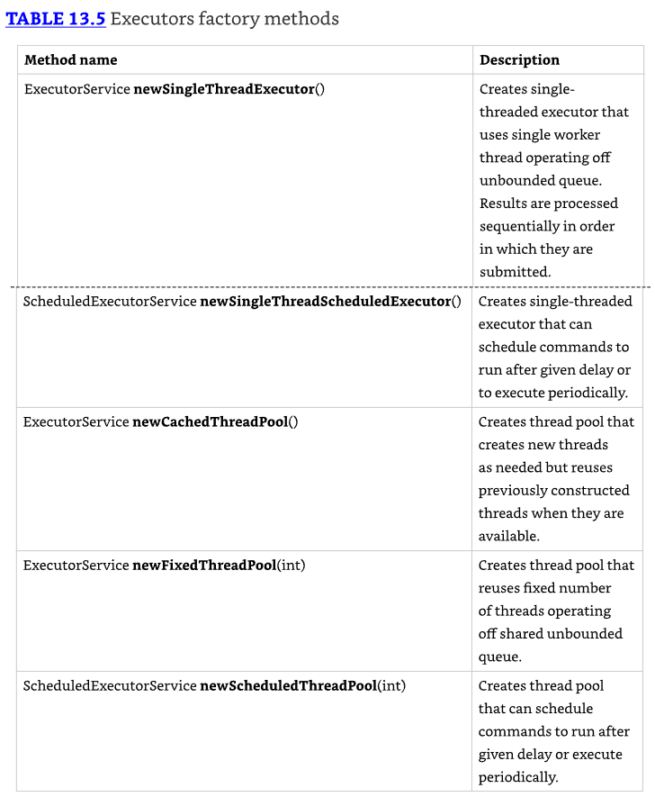

* Como se muestra en Table 13.5, estos métodos retornan los mismos tipos de instancias, ExecutorService y ScheduledExecutorService, que usamos anteriormente en este capítulo. 
* En otras palabras, todos nuestros ejemplos previos son compatibles con estos nuevos pooled-thread executors

* La diferencia entre un single-thread y un pooled-thread executor es lo que sucede cuando un task ya está ejecutándose. 
* Mientras que un single-thread executor esperará a que el thread esté disponible antes de ejecutar el siguiente task, un pooled-thread executor puede ejecutar el siguiente task concurrentemente. 
* Si el pool se queda sin threads disponibles, el task será puesto en cola por el thread executor y esperará a ser completado.

## Writing Thread-Safe Code

* Thread-safety es la propiedad de un objeto que garantiza ejecución segura por múltiples threads al mismo tiempo. 
* Dado que los threads se ejecutan en un entorno compartido y espacio de memoria, ¿cómo prevenimos que dos threads interfieran entre sí? 
* Debemos organizar el acceso a los datos de manera que no terminemos con resultados inválidos o inesperados.

En esta parte del capítulo, mostramos cómo usar una variedad de técnicas para proteger datos, incluyendo clases atómicas, bloques sincronizados, el framework Lock, y barreras cíclicas.

### Understanding Thread-Safety

* Imagina que nuestro zoológico tiene un programa para contar ovejas, preferiblemente uno que no ponga a los trabajadores del zoológico a dormir
* Cada trabajador del zoológico sale a un campo, añade una nueva oveja al rebaño, cuenta el número total de ovejas, y regresa a nosotros para reportar los resultados. 
* Presentamos el siguiente código para representar esto conceptualmente, eligiendo un tamaño de thread pool de manera que todos los tasks puedan ejecutarse concurrentemente:

```java
1: import java.util.concurrent.*;
2: public class SheepManager {
3:   private int sheepCount = 0;
4:   private void incrementAndReport() {
5:     System.out.print((++sheepCount)+" ");
6:   }
7:   public static void main(String[] args) {
8:     ExecutorService service = Executors.newFixedThreadPool(20);
9:     try {
10:       SheepManager manager = new SheepManager();
11:       for(int i = 0; i < 10; i++)
12:         service.submit(() -> manager.incrementAndReport());
13:     } finally {
14:       service.shutdown();
15:   } } }
```

* ¿Qué produce este programa como salida? Podrías pensar que producirá números del 1 al 10, en orden, pero eso está lejos de estar garantizado. 
* Puede producir en un orden diferente. Peor aún, puede imprimir algunos números dos veces y no imprimir algunos números en absoluto.
* Las siguientes son posibles salidas de este programa:

1 2 3 4 5 6 7 8 9 10
1 9 8 7 3 **6** **6** 2 4 5
1 8 7 3 **2** 6 5 4 **2** 9

* Entonces, ¿qué salió mal? En este ejemplo, usamos el operador de pre-incremento (++) para actualizar la variable sheepCount. 
* Un problema ocurre cuando dos threads ambos ejecutan el lado derecho de la expresión, leyendo el valor "old" antes de que cualquier thread escriba el valor "new" de la variable. 
* Las dos asignaciones se vuelven redundantes; ambas asignan el mismo valor nuevo, con un thread sobrescribiendo los resultados del otro. 
* Figure 13.4 demuestra este problema con dos threads, asumiendo que sheepCount tiene un valor inicial de 1.


* Puedes ver en Figure 13.4 que ambos threads leen y escriben los mismos valores, causando que una de las dos operaciones ++sheepCount se pierda. 
* Por lo tanto, el operador de incremento ++ no es thread-safe. Como verás más adelante en este capítulo, el resultado inesperado de dos tasks ejecutándose al mismo tiempo se refiere como una race condition.

* Conceptualmente, la idea aquí es que algunos trabajadores del zoológico pueden correr más rápido en su camino al campo, pero más lentamente en su camino de regreso y reportar tarde. 
* Otros trabajadores pueden llegar al campo de últimos pero de alguna manera ser los primeros en regresar para reportar los resultados.

### Accessing Data with volatile

* La palabra clave volatile es usada para garantizar que el acceso a datos dentro de la memoria es consistente. 
* Por ejemplo, es posible (aunque improbable) que nuestro ejemplo SheepManager usando ++sheepCount retorne un valor inesperado debido a acceso inválido a memoria mientras el código está ejecutando una sección crítica. 
* Conceptualmente, esto corresponde a uno de nuestros empleados del zoológico tropezando en el camino de regreso del campo y alguien preguntándoles el número actual de ovejas mientras todavía están intentando levantarse.

* El atributo volatile asegura que solo un thread está modificando una variable en un momento y que los datos leídos entre múltiples threads son consistentes. 
* De esta manera, no interrumpimos a uno de nuestros trabajadores del zoológico en medio de la ejecución. Entonces, ¿provee volatile thread-safety? No exactamente. 
* Considera este reemplazo a nuestra aplicación anterior:

```java
3:  private volatile int sheepCount = 0;
4:  private void incrementAndReport() {
5:    System.out.print((++sheepCount)+" ");
6:  }
```

Desafortunadamente, este código no es thread-safe y todavía podría resultar en números siendo perdidos:

```java
**2** 6 1 7 5 3 **2** 9 4 8
```

* La razón por la que este código no es thread-safe es que ++sheepCount es todavía dos operaciones distintas. 
* Dicho de otra manera, si el operador de incremento representa la expresión sheepCount = sheepCount + 1, entonces cada operación de lectura y escritura es thread-safe, pero la operación combinada no lo es. 
* Refiriéndonos a nuestro ejemplo de ovejas, no interrumpimos al empleado mientras está corriendo, pero todavía podríamos tener múltiples personas en el campo al mismo tiempo.

---------------------------------------------------------------------
En la práctica, volatile es raramente usado. 
Solo lo cubrimos porque se ha sabido que aparece en el examen de vez en cuando.
---------------------------------------------------------------------

### Protecting Data with Atomic Classes

* En nuestras aplicaciones SheepManager previas, los mismos valores fueron impresos dos veces, con el contador más alto siendo 9 en lugar de 10. 
* Como vimos, el operador de incremento ++ no es thread-safe, incluso cuando volatile es usado. 
* No es thread-safe porque la operación no es atómica, llevando a cabo dos tasks, lectura y escritura, que pueden ser interrumpidas por otros threads.

* Atomic es la propiedad de una operación de ser llevada a cabo como una única unidad de ejecución sin ninguna interferencia de otro thread. 
* Una versión thread-safe atómica del operador de incremento realizaría la lectura y escritura de la variable como una única operación, no permitiendo que ningún otro thread acceda a la variable durante la operación. 
* Figure 13.5 muestra el resultado de hacer la variable sheepCount atómica.

* En este caso, cualquier thread intentando acceder a la variable sheepCount mientras una operación atómica está en proceso tendrá que esperar hasta que la operación atómica en la variable esté completa. 
* Conceptualmente, esto es como establecer una regla para nuestros trabajadores del zoológico de que solo puede haber un empleado en el campo en un momento, aunque puede que no reporten sus resultados en orden.

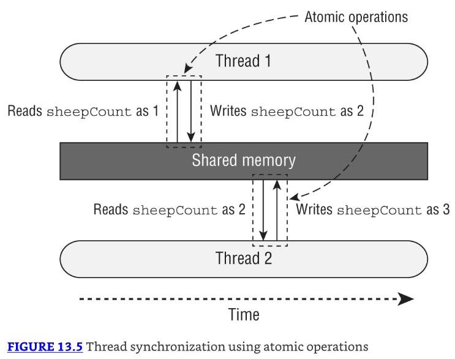

* Dado que acceder a primitivos y referencias es común en Java, la Concurrency API incluye numerosas clases útiles en el paquete `java.util.concurrent.atomic`. 
* Table 13.6 lista las clases atómicas con las cuales deberías estar familiarizado para el examen. 
* Como con muchas de las clases en la Concurrency API, estas clases existen para hacer tu vida más fácil.

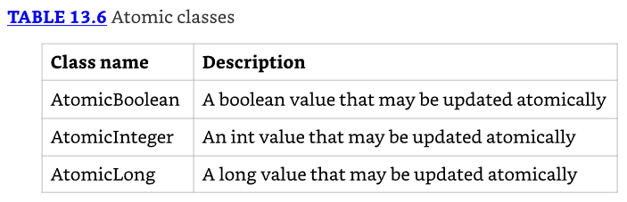

* ¿Cómo usamos una clase atómica? Cada clase incluye numerosos métodos que son equivalentes a muchos de los operadores built-in primitivos que usamos en primitivos, como el operador de asignación (=) y los operadores de incremento (++). 
* Describimos los métodos atómicos comunes que deberías conocer para el examen en Table 13.7. El type es determinado por la clase.

En el siguiente ejemplo, asume que importamos el paquete atomic y luego actualizamos nuestra clase SheepManager con un AtomicInteger:

```java
3:  private AtomicInteger sheepCount = new AtomicInteger(0);
4:  private void incrementAndReport() {
5:    System.out.print(sheepCount.incrementAndGet()+" ");
6:  }
```

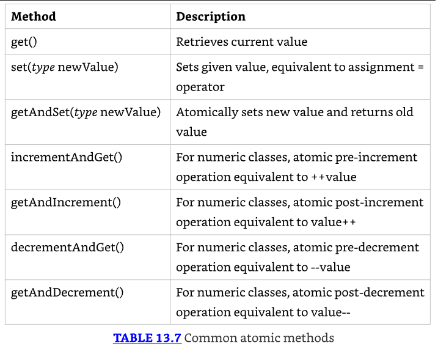

¿Cómo difiere esta implementación de nuestros ejemplos previos? Cuando ejecutamos esta modificación, obtenemos salidas variables, como las siguientes:

2 3 1 4 5 6 7 8 9 **10**
1 4 3 2 5 6 7 8 9 **10**
1 4 3 5 6 2 7 8 **10** 9

* A diferencia de nuestra salida de ejemplo previa, los números del 1 al 10 siempre se imprimirán, aunque el orden todavía no está garantizado. 
* No te preocupes; abordaremos ese problema en breve. 
* La clave en esta sección es que usar las clases atómicas asegura que los datos son consistentes entre workers y que no se pierden valores debido a modificaciones concurrentes.

### Improving Access with synchronized Blocks

* Mientras que las clases atómicas son excelentes para proteger una única variable, no son particularmente útiles si necesitas ejecutar una serie de comandos o llamar a un método. 
* Por ejemplo, no podemos usarlas para actualizar dos variables atómicas al mismo tiempo. 
* ¿Cómo mejoramos los resultados para que cada worker sea capaz de incrementar y reportar los resultados en orden?

* La técnica más común es usar un monitor para sincronizar el acceso. 
* Un monitor, también llamado lock, es una estructura que soporta mutual exclusion, que es la propiedad de que como máximo un thread está ejecutando un segmento particular de código en un momento dado.

En Java, cualquier Object puede ser usado como un monitor, junto con la palabra clave synchronized, como se muestra en el siguiente ejemplo:

```java
var manager = new SheepManager();
synchronized(manager) {
// Work to be completed by one thread at a time
}
```

* Este ejemplo se refiere como un synchronized block. Cada thread que llega primero verificará si algún thread ya está ejecutando el bloque. 
* Si el lock no está disponible, el thread hará transición a un estado BLOCKED hasta que pueda "acquire the lock." 
* Si el lock está disponible (o el thread ya tiene el lock), el único thread entrará al bloque, previniendo que todos los otros threads entren. 
* Una vez que el thread termina de ejecutar el bloque, liberará el lock, permitiendo que uno de los threads en espera proceda.

---------------------------------------------------------------------
* Para sincronizar acceso a través de múltiples threads, cada thread debe tener acceso al same Object. 
* Si cada thread sincroniza en objetos diferentes, el código no es thread-safe.
---------------------------------------------------------------------

* Revisitemos nuestro ejemplo SheepManager que usó ++sheepCount y veamos si podemos mejorar los resultados para que cada worker incremente y produzca el contador en orden. 
* Digamos que reemplazamos nuestro loop for() con la siguiente implementación:

```java
11: for(int i = 0; i < 10; i++) {
12:   synchronized(manager) {
13:     service.submit(() -> manager.incrementAndReport());
14:   }
15: }
```

* ¿Esta solución arregla el problema? No, ¡no lo hace! ¿Puedes identificar el problema? 
* Hemos sincronizado la creation de los threads pero no la execution de los threads. 
* En este ejemplo, los threads serían creados uno a la vez, pero podrían todos todavía ejecutar y realizar su trabajo simultáneamente, resultando en el mismo tipo de salida que viste anteriormente. 
* Dijimos que diagnosticar y resolver problemas de threads es difícil en la práctica.

Ahora presentamos una versión corregida de la clase SheepManager que ordena a los workers:

```java
1: import java.util.concurrent.*;
2: public class SheepManager {
3:   private int sheepCount = 0;
4:   private void incrementAndReport() {
5:     synchronized(this) {
6:       System.out.print((++sheepCount)+" ");
7:     }
8:   }
9:   public static void main(String[] args) {
10:    ExecutorService service = Executors.newFixedThreadPool(20);
11:    try {
12:      var manager = new SheepManager();
13:      for(int i = 0; i < 10; i++)
14:        service.submit(() -> manager.incrementAndReport());
15:    } finally {
16:      service.shutdown();
17:    } } }
```

Cuando este código se ejecuta, consistentemente producirá la siguiente salida:

1 2 3 4 5 6 7 8 9 10

* Aunque todos los threads todavía son creados y ejecutados al mismo tiempo, cada uno espera en el bloque sincronizado para que el worker incremente y reporte el resultado antes de entrar. 
* De esta manera, cada zoo worker espera a que el zoo worker anterior regrese antes de salir al campo. 
* Aunque es aleatorio qué zoo worker saldrá después, está garantizado que habrá como máximo uno en el campo y que los resultados serán reportados en orden.

Podríamos haber sincronizado en cualquier objeto, siempre y cuando fuera el mismo objeto. Por ejemplo, el siguiente fragmento de código también funcionaría:

```java
4:  private final Object herd = new Object();
5:  private void incrementAndReport() {
6:    synchronized(herd) {
7:      System.out.print((++sheepCount)+" ");
8:    }
9:  }
```

Aunque no necesitábamos hacer la variable herd final, hacerlo asegura que no sea reasignada después de que los threads comiencen a usarla.

### Synchronizing on Methods

* En el ejemplo anterior, establecimos nuestro monitor usando synchronized(this) alrededor del cuerpo del método. 
* Java proporciona un mejoramiento conveniente del compilador para hacer esto. 
* Podemos agregar el modificador synchronized a cualquier método de instancia para sincronizar automáticamente en el objeto mismo. 
* Por ejemplo, las siguientes dos definiciones de método son equivalentes:

```java
void sing() {
  synchronized(this) {
    System.out.print("La la la!");
  }
}
synchronized void sing() {
    System.out.print("La la la!");
}
```

El primero usa un bloque synchronized, mientras que el segundo usa el modificador synchronized del método. El que uses depende completamente de ti.

* También podemos aplicar el modificador synchronized a métodos estáticos. ¿Qué objeto se usa como monitor cuando sincronizamos en un método estático? 
* El objeto de clase, ¡por supuesto! Por ejemplo, los siguientes dos métodos son equivalentes para sincronización estática dentro de nuestra clase SheepManager:

```java
static void dance() {
  synchronized(SheepManager.class) {
    System.out.print("Time to dance!");
  }
}
static synchronized void dance() {
  System.out.print("Time to dance!");
}
```

* Como antes, el primero usa un bloque synchronized, con el segundo ejemplo usando el modificador synchronized. 
* Puedes usar sincronización estática si necesitas ordenar el acceso de threads a través de todas las instancias en lugar de una única instancia.

### Understanding the Lock Framework

* Un bloque synchronized soporta solo un conjunto limitado de funcionalidad. Por ejemplo, ¿qué pasa si queremos verificar si un lock está disponible y, si no lo está, realizar algún otro task? 
* Además, si el lock nunca está disponible y sincronizamos en él, podríamos esperar para siempre.

* La Concurrency API incluye la interfaz Lock, que es conceptualmente similar a usar la palabra clave synchronized pero con muchas más campanas y silbatos. 
* En lugar de sincronizar en cualquier Object, aunque, podemos hacer "lock" solo en un objeto que implementa la interfaz Lock.

### Applying a ReentrantLock

* La interfaz Lock es bastante fácil de usar. Cuando necesitas proteger una pieza de código del procesamiento multithreaded, crea una instancia de Lock a la que todos los threads tengan acceso. 
* Cada thread entonces llama a lock() antes de que entre al código protegido y llama a unlock() antes de que salga del código protegido.

* En contraste, lo siguiente muestra dos implementaciones, una con un bloque synchronized y una con una instancia Lock. 
* Aunque más larga, la solución Lock tiene un número de características no disponibles para el bloque synchronized.

```java
// Implementation #1 with a synchronized block
Object object = new Object();

synchronized(object) {
    // Protected code
}

// Implementation #2 with a Lock
Lock lock = new ReentrantLock();
try {
    lock.lock();
    // Protected code
} finally {
    lock.unlock();
}
```

* Estas dos implementaciones son conceptualmente equivalentes. 
* La clase ReentrantLock es un monitor simple que implementa la interfaz Lock y soporta mutual exclusion. 
* En otras palabras, como máximo un thread está permitido tener un lock en cualquier momento dado.

---------------------------------------------------------------------
Aunque ciertamente no es requerido, es una buena práctica usar un bloque try/finally con instancias Lock. 
Hacer esto asegura que cualquier lock adquirido sea liberado apropiadamente.
---------------------------------------------------------------------

* La clase ReentrantLock asegura que una vez que un thread ha llamado a lock() y obtenido el lock, todos los otros threads que llaman a lock() esperarán hasta que el primer thread llame a unlock(). 
* Qué thread obtiene el lock a continuación depende de los parámetros usados para crear el objeto Lock.

* La clase ReentrantLock incluye un constructor que toma un único boolean y establece un parámetro "fairness". 
* Si el parámetro se establece en true, el lock usualmente será otorgado a cada thread en el orden en que fue solicitado. 
* Es false por defecto cuando se usa el constructor sin argumentos. 
* En la práctica, deberías habilitar fairness solo cuando el ordenamiento es absolutamente requerido, ya que podría llevar a una desaceleración significativa.

* Además de asegurarte siempre de liberar un lock, también necesitas asegurarte de que solo liberas un lock que tienes. 
* Si intentas liberar un lock que no tienes, obtendrás una excepción en tiempo de ejecución.

```java
Lock lock = new ReentrantLock();
lock.unlock(); // IllegalMonitorStateException
```

La interfaz Lock incluye cuatro métodos que deberías conocer para el examen, como se lista en Table 13.8.

### Attempting to Acquire a Lock

* Mientras que la clase ReentrantLock te permite esperar por un lock, hasta ahora sufre del mismo problema que un bloque synchronized. 
* Un thread podría terminar esperando para siempre para obtener un lock. 
* Afortunadamente, Table 13.8 incluye dos métodos adicionales que hacen que la interfaz Lock sea mucho más segura de usar que un bloque synchronized.

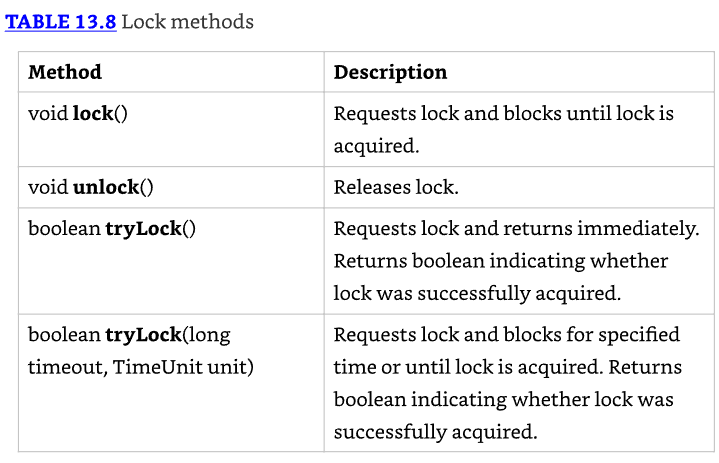

Por conveniencia, usamos el siguiente método printHello() para el código en esta sección:

```java
public static void printHello(Lock lock) {
  try {
    lock.lock();
    System.out.println("Hello");
  } finally {
    lock.unlock();
  } }
```

### tryLock()

* El método tryLock() intentará adquirir un lock e inmediatamente retornará un resultado booleano indicando si el lock fue obtenido. 
* A diferencia del método lock(), no espera si otro thread ya tiene el lock. Retorna inmediatamente, sin importar si un lock está disponible.

Lo siguiente es una implementación de ejemplo usando el método tryLock():

```java
Lock lock = new ReentrantLock();
new Thread(() -> printHello(lock)).start();
if(lock.tryLock()) {
  try {
      System.out.println("Lock obtained, entering protected code");
  } finally {
      lock.unlock();
  }
} else {
    System.out.println("Unable to acquire lock, doing something else");
}
```

* Cuando ejecutas este código, podría producir ya sea el mensaje if o el else, dependiendo del orden de ejecución. 
* Siempre imprimirá Hello, aunque, ya que la llamada a lock() en printHello() esperará indefinidamente a que el lock esté disponible. 
* Un ejercicio divertido es insertar algunos retrasos Thread.sleep() en este fragmento para fomentar que un mensaje particular sea mostrado.

* Como lock(), el método tryLock() debería ser usado con un bloque try/finally. Afortunadamente, solo necesitas liberar el lock si fue adquirido exitosamente. 
* Por esta razón, es común usar la salida de tryLock() en una declaración if, de manera que unlock() es llamado solo cuando el lock es obtenido.

---------------------------------------------------------------------
Es imperativo que tu programa siempre verifique el valor de retorno del método tryLock(). 
Le dice a tu programa si es seguro proceder con la operación y si el lock necesita ser liberado más tarde.
---------------------------------------------------------------------

### tryLock(long,TimeUnit)

* La interfaz Lock incluye una versión sobrecargada de `tryLock(long,TimeUnit)` que actúa como un híbrido de lock() y tryLock(). 
* Como los otros dos métodos, si un lock está disponible, retornará inmediatamente con él. 
* Si un lock no está disponible, sin embargo, esperará hasta el límite de tiempo especificado para el lock.

El siguiente fragmento de código usa la versión sobrecargada de `tryLock(long,TimeUnit)`:

```java
Lock lock = new ReentrantLock();
new Thread(() -> printHello(lock)).start();
if(lock.tryLock(10,TimeUnit.SECONDS)) {
  try {
    System.out.println("Lock obtained, entering protected code");
  } finally {
    lock.unlock();
  }
} else {
  System.out.println("Unable to acquire lock, doing something else");
}
```

El código es el mismo que antes, excepto que esta vez, uno de los threads espera hasta 10 segundos para adquirir el lock.

### Acquiring the Same Lock Twice

* La clase ReentrantLock mantiene un contador del número de veces que un lock ha sido otorgado exitosamente a un thread. 
* Para liberar el lock para que otros threads lo usen, unlock() debe ser llamado el mismo número de veces que el lock fue otorgado. 
* El siguiente fragmento de código contiene un error. ¿Puedes identificarlo?

```java
Lock lock = new ReentrantLock();
if(lock.tryLock()) {
  try {
    lock.lock();
    System.out.println("Lock obtained, entering protected code");
  } finally {
    lock.unlock();
  } }
```

* El thread obtiene el lock dos veces, pero lo libera solo una vez. 
* Puedes verificar esto generando un nuevo thread después de que este código se ejecute que intente obtener un lock. 
* Lo siguiente imprime false:

`new Thread(() -> System.out.print(lock.tryLock())).start(); // false`

continuar en la 32


```java

```

---------------------------------------------------------------------
Using Concurrent Collections
Identifying Threading Problems
Working with Parallel Streams