# I/O

Este capítulo se enfoca en usar APIs de I/O (entrada/salida) y NIO.2 (I/O no bloqueante) para interactuar con archivos y streams de I/O. 
El enfoque preferido para trabajar con archivos y directorios en aplicaciones de software más nuevas es usar NIO.2 en lugar de I/O donde sea posible.

---------------------------------------------------------------------
El texto dice: NIO significa non-blocking input/output API y a veces se refiere como new I/O. El examen cubre NIO versión 2. 
Hubo una versión 1 que cubría canales, pero no está en el examen.
---------------------------------------------------------------------

## Referencing Files and Directories

* Termina con el inicio de un párrafo que dice: Comenzamos este capítulo revisando qué son los archivos y directorios dentro de un sistema de archivos sistema. 
* También presentamos la clase File y la interfaz Path junto con cómo crearlas.

### Conceptualizando el Sistema de Archivos

* Comenzamos con lo básico. Los datos se almacenan en dispositivos de almacenamiento persistente, como discos duros y tarjetas de memoria. 
* Un file dentro del dispositivo de almacenamiento contiene datos. Los archivos se organizan en jerarquías usando directorios. 
* Un directory es una ubicación que puede contener archivos así como otros directorios. 
* Cuando trabajamos con directorios en Java, frecuentemente los tratamos como archivos. 
* De hecho, usamos muchas de las mismas clases e interfaces para operar sobre archivos y directorios. 
* Por ejemplo, un archivo y un directorio pueden ser renombrados con el mismo método Java. 
* Nota que a menudo decimos file para significar file or directory en este capítulo.

* Para interactuar con archivos, necesitamos conectarnos al sistema de archivos. 
* El file system está a cargo de leer y escribir datos dentro de una computadora. 
* Diferentes sistemas operativos usan diferentes sistemas de archivos para gestionar sus datos. 
* Por ejemplo, los sistemas basados en Windows usan un sistema de archivos diferente que los basados en Unix. 
* Para el examen, solo necesitas saber cómo emitir comandos usando las APIs de Java. 
* La JVM se conectará automáticamente al sistema de archivos local, permitiéndote realizar las mismas operaciones a través de múltiples plataformas.

* A continuación, el root directory es el directorio superior en el sistema de archivos, del cual todos los archivos y directorios heredan. 
* En Windows, se denota con una letra de unidad como C:, mientras que en Linux, se denota con una sola barra diagonal, /.

* Un path es una representación de un archivo o directorio dentro de un sistema de archivos. 
* Cada sistema de archivos define su propio carácter separador de ruta que se usa entre entradas de directorio. 
* El valor a la izquierda de un separador es el padre del valor a la derecha del separador. 
* Por ejemplo, el valor de ruta /user/home/zoo.txt significa que el archivo zoo.txt está dentro del directorio home, con el directorio home dentro del directorio user.

---------------------------------------------------------------------
**Separadores de Archivo del Sistema Operativo**
* Diferentes sistemas operativos varían en su formato de nombres de ruta. 
* Por ejemplo, los sistemas basados en Unix usan la barra diagonal, /, para rutas, mientras que los sistemas basados en Windows usan la barra invertida, /, carácter. 
* Dicho esto, muchos lenguajes de programación y sistemas de archivos soportan ambos tipos de barras cuando se escriben declaraciones de ruta. 
* Java ofrece una propiedad del sistema para recuperar el carácter separador local para el entorno actual:
`System.out.print(System.getProperty("file.separator"));`
---------------------------------------------------------------------

Mostramos cómo un directorio y sistema de archivos está organizado de manera jerárquica en Figure 14.1.

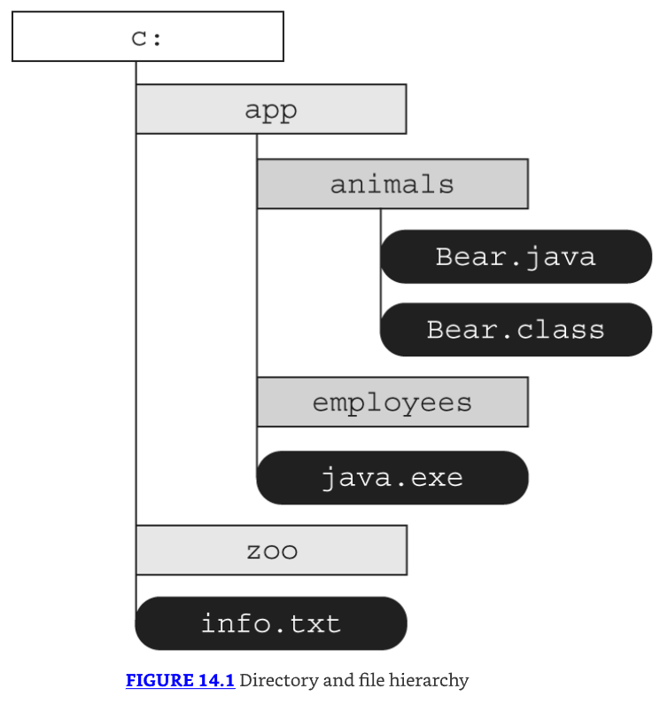

* Este diagrama muestra el directorio raíz, c:, como conteniendo dos directorios, app y zoo, junto con el archivo info.txt. 
* Dentro del directorio app, hay dos carpetas más, animals y employees, junto con el archivo `java.exe`. Finalmente, el directorio animals contiene dos archivos, Bear.java y Bear.class.

* Usamos tanto rutas absolutas como relativas al archivo o directorio dentro del sistema de archivos. 
* La absolute path de un archivo o directorio es la ruta completa desde el directorio raíz al archivo o directorio, incluyendo todos los subdirectorios que contienen el archivo o directorio. 
* Alternativamente, la relative path de un archivo o directorio es la ruta desde el directorio de trabajo actual al archivo o directorio. 
* Por ejemplo, lo siguiente es una ruta absoluta al archivo Bear.java:

`C:\app\animals\Bear.java`

Lo siguiente es una ruta relativa al mismo archivo, asumiendo que el directorio actual del usuario está establecido en `C:\app`:

`animals\Bear.java`

* Determinar si una ruta es relativa o absoluta es dependiente del sistema de archivos. 
* Para coincidir con el examen, adoptamos las siguientes convenciones:

1. Si una ruta comienza con una barra diagonal `(/)`, es absoluta, con `/` como el directorio raíz, tal como `/bird/parrot.png`.
2. Si una ruta comienza con una letra de unidad `(c:)`, es absoluta, con la letra de unidad como el directorio raíz, tal como `C:/bird/info`.
3. De lo contrario, es una ruta relativa, tal como `bird/parrot.png`.

* Las rutas absolutas y relativas pueden contener símbolos de ruta. 
* Un path symbol es una serie reservada de caracteres con significado especial en algunos sistemas de archivos. 
* Para el examen, hay dos símbolos de ruta que necesitas conocer, como se lista en Table 14.1.

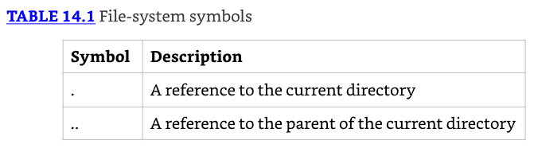

* Mirando a Figure 14.2, supón que el directorio actual es `/fish/shark/hammerhead`. 
* En este caso, `../swim.txt` es una ruta relativa válida equivalente a `/fish/shark/swim.txt`. 
* De igual manera, `./play.png` se refiere a `play.png` en el directorio actual. 
* Estos símbolos también pueden ser combinados para mayor efecto. 
* Por ejemplo, `../../clownfish` es una ruta relativa equivalente a `/fish/clownfish` dentro del sistema de archivos.

* A veces verás símbolos de ruta que son redundantes o innecesarios. 
* Por ejemplo, la ruta absoluta `/fish/clownfish/../shark/./swim.txt` puede ser simplificada a `/fish/shark/swim.txt`. 
* Vemos cómo manejar estas redundancias más adelante en el capítulo cuando cubramos `normalize()`.

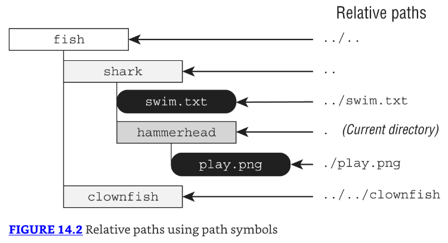

* Un symbolic link es un archivo especial dentro de un sistema de archivos que sirve como una referencia o puntero a otro archivo o directorio. 
* Supón que tenemos un enlace simbólico desde `/zoo/user/favorite` a `/fish/shark`. La carpeta shark y sus elementos pueden ser accedidos directamente o vía el enlace simbólico. 
* Por ejemplo, las siguientes rutas referencian el mismo archivo:

```java
/fish/shark/swim.txt
/zoo/user/favorite/swim.txt
```

* En general, los enlaces simbólicos son transparentes para el usuario, ya que el sistema operativo se encarga de resolver la referencia al archivo real. 
* Mientras las APIs de I/O no soportan enlaces simbólicos, NIO.2 incluye soporte completo para crear, detectar y navegar enlaces simbólicos dentro del sistema de archivos.

### Creating a File or Path

* Para hacer cualquier cosa útil, primero necesitas un objeto que represente la ruta a un archivo o directorio particular en el sistema de archivos. 
* Usando I/O legacy, esta es la clase `java.io.File`, mientras que con NIO.2, es la interfaz `java.nio.file.Path`. 
* La clase File y la interfaz Path no pueden leer o escribir datos dentro de un archivo, aunque son pasadas como una referencia a otras clases, como verás en este capítulo.

### Creating a File

La clase File es creada llamando a su constructor. Este código muestra tres constructores diferentes:

```java
File zooFile1 = new File("/home/tiger/data/stripes.txt");
File zooFile2 = new File("/home/tiger", "data/stripes.txt");

File parent = new File("/home/tiger");
File zooFile3 = new File(parent, "data/stripes.txt");

System.out.println(zooFile1.exists());
```

* Los tres crean un objeto File que apunta a la misma ubicación en el disco. 
* Si pasamos null como el padre al constructor final, sería ignorado, y el método se comportaría de la misma manera que el constructor de String único. 
* Por diversión, también mostramos cómo decir si el archivo existe en el sistema de archivos.

### Creating a Path

* Dado que Path es una interfaz, no podemos crear una instancia directamente. 
* Después de todo, ¡las interfaces no tienen constructores! Java proporciona un número de clases y métodos que puedes usar para obtener objetos Path.
* La manera más simple y directa de obtener un objeto Path es usar un método factory estático definido en Path o Paths. 
* Los cuatro de estos ejemplos apuntan a la misma referencia en el disco:

```java
Path zooPath1 = Path.of("/home/tiger/data/stripes.txt");
Path zooPath2 = Path.of("/home", "tiger", "data", "stripes.txt");

Path zooPath3 = Paths.get("/home/tiger/data/stripes.txt");
Path zooPath4 = Paths.get("/home", "tiger", "data", "stripes.txt");

System.out.println(Files.exists(zooPath1));
```

* Ambos métodos permiten pasar un parámetro varargs para pasar elementos de ruta adicionales. 
* Los valores son combinados y automáticamente separados por el separador de archivo dependiente del sistema operativo. 
* También mostramos la clase helper Files, que puede verificar si el archivo existe en el sistema de archivos.

* Como puedes ver, hay dos maneras de hacer lo mismo aquí. El método Path.of() fue introducido en Java 11 como un método estático en la interfaz. 
* La clase factory Paths también proporciona un método get() para hacer lo mismo. Nota la `s` al final de la clase Paths para distinguirla de la interfaz Path. 
* Usamos Path.of() y Paths.get() intercambiablemente en este capítulo.

---------------------------------------------------------------------
* Podrías notar que tanto las clases I/O como NIO.2 pueden interactuar con una URI. 
* Un uniform resource identifier (URI) es una cadena de caracteres que identifica un recurso. 
* Comienza con un esquema que indica el tipo de recurso, seguido por un valor de ruta tal como file:// para sistemas de archivos locales y http://, https://, y ftp:// para sistemas de archivos remotos.
---------------------------------------------------------------------

### Switching between File and Path

* Dado que File y Path ambos referencian ubicaciones en el disco, es útil ser capaz de convertir entre ellos. 
* Afortunadamente, Java hace esto fácil proporcionando métodos para hacer justo eso:

```java
File file = new File("rabbit");
Path nowPath = file.toPath();
File backToFile = nowPath.toFile();
```

* Muchas librerías antiguas usan File, haciendo conveniente ser capaz de obtener un File desde un Path y viceversa. 
* Cuando trabajas con aplicaciones más nuevas, deberías confiar en la interfaz Path de NIO.2, ya que contiene muchas más características. 
* Por ejemplo, solo NIO.2 proporciona soporte FileSystem, como estamos a punto de discutir.

### Obtaining a Path from the FileSystems Class

* NIO.2 hace uso extensivo de crear objetos con clases factory. La clase FileSystems crea instancias de la clase abstracta FileSystem. 
* Esta última incluye métodos para trabajar con el sistema de archivos directamente. Tanto Paths.get() como Path.of() son atajos para este método FileSystem. 
* Reescribamos nuestros ejemplos anteriores una vez más para ver cómo obtener una instancia Path de la manera larga:

```java
Path zooPath1 = FileSystems.getDefault()
    .getPath("/home/tiger/data/stripes.txt");
Path zooPath2 = FileSystems.getDefault()
    .getPath("/home", "tiger", "data", "stripes.txt");
```

### Reviewing I/O and NIO.2 Relationships

* El modelo para I/O es más pequeño, y solo necesitas entender la clase File. 
* En contraste, NIO.2 tiene más características y hace uso extensivo del patrón factory. Deberías familiarizarte con este enfoque. 
* Muchas de tus interacciones con NIO.2 requerirán dos tipos: una clase o interfaz abstracta y una clase factory o helper. 
* Figure 14.3 muestra las relaciones entre las clases e interfaz que hemos usado en este capítulo hasta ahora.

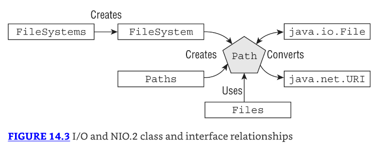

* Revisa Figure 14.3 cuidadosamente. En particular, mantén un ojo en sí el nombre de la clase es singular o plural. 
* Las clases con nombres plurales incluyen métodos para crear u operar sobre instancias de clase/interfaz con nombres singulares. 
* Recuerda, como una conveniencia (y fuente de confusión), un Path también puede ser creado desde la interfaz Path usando el método factory estático of().

---------------------------------------------------------------------
* El `java.io.File` es la clase I/O, mientras Files es una clase helper NIO.2. Files opera sobre instancias Path, no instancias `java.io.File`. 
* Sabemos que esto es confuso, ¡pero son de APIs completamente diferentes!
---------------------------------------------------------------------

* Table 14.2 revisa las APIs que hemos cubierto para crear objetos `java.io.File` y `java.nio.file.Path`. 
* Cuando lees la tabla, recuerda que los métodos estáticos operan sobre la clase/interfaz, mientras los métodos de instancia requieren una instancia de un objeto. 
* Asegúrate de saber esto bien antes de proceder con el resto del capítulo.

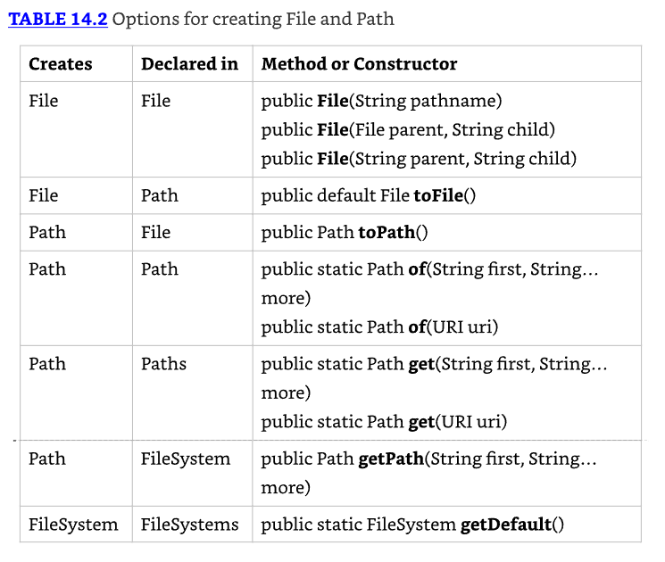

## Operating on File and Path

Ahora que sabemos cómo crear objetos File y Path, podemos comenzar a usarlos para hacer cosas útiles. 
En esta sección, exploramos la funcionalidad disponible para nosotros que involucra directorios.

### Using Shared Functionality

* Muchas operaciones pueden ser hechas usando tanto las librerías I/O como NIO.2. 
* Presentamos muchas APIs comunes en Table 14.3 y Table 14.4. 
* Aunque estas tablas pueden parecer como muchos métodos para aprender, muchos de ellos son autoexplicativos. 
* Puedes ignorar los parámetros varargs por ahora. Los explicamos más adelante en el capítulo.

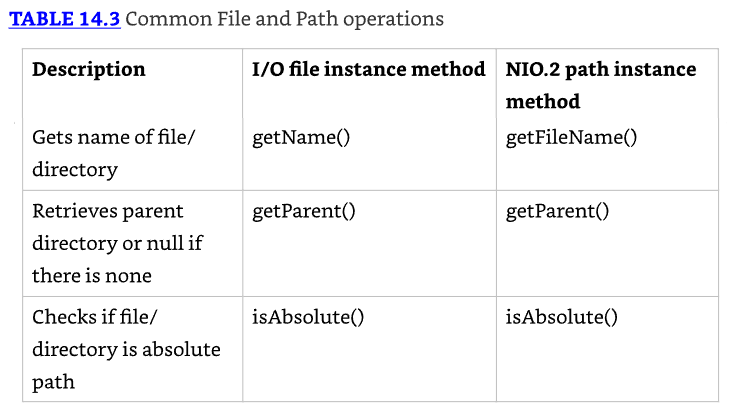

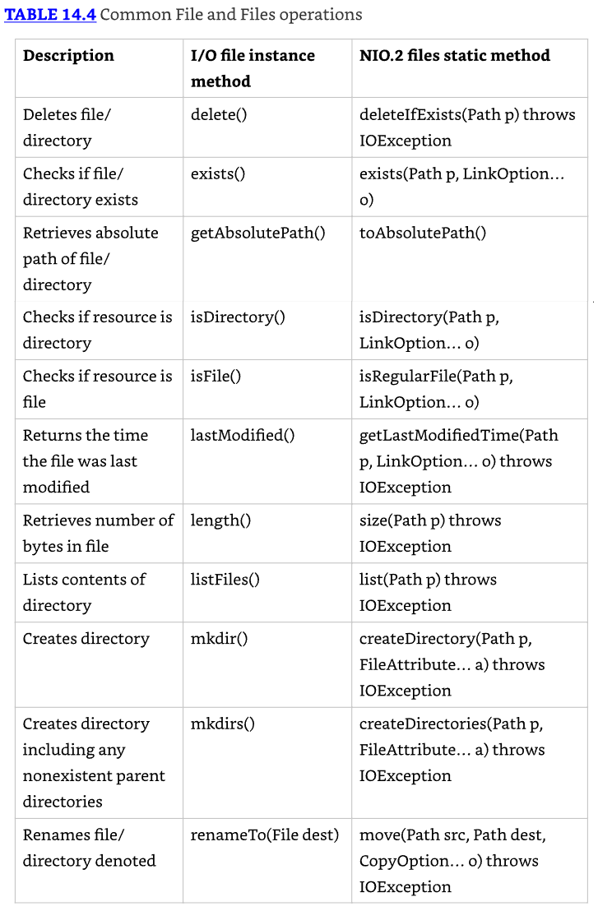

* Ahora intentemos usar algunas de estas APIs. Lo siguiente es un programa de muestra usando solo APIs I/O legacy. 
* Dada una ruta de archivo, genera información sobre el archivo o directorio, tal como si existe, qué archivos están contenidos dentro de él, y así sucesivamente:

```java
10: public static void io() {
11:   var file = new File("C:\\data\\zoo.txt");
12:   if (file.exists()) {
13:     System.out.println("Absolute Path: " + file.getAbsolutePath());
14:     System.out.println("Is Directory: " + file.isDirectory());
15:     System.out.println("Parent Path: " + file.getParent());
16:     if (file.isFile()) {
17:       System.out.println("Size: " + file.length());
18:       System.out.println("Last Modified: " + file.lastModified());
19:     } else {
20:       for (File subfile : file.listFiles()) {
21:         System.out.println("  " + subfile.getName());
22:     } } } }
```

Si la ruta proporcionada apunta a un archivo válido, el programa genera algo similar a lo siguiente debido a la declaración if en la línea 16:

Absolute Path: C:\data\zoo.txt
Is Directory: false
Parent Path: C:\data
Size: 12382
Last Modified: 1650610000000

Finalmente, si la ruta proporcionada apunta a un directorio válido, tal como `C:\data`, el programa genera algo similar a lo siguiente, gracias al bloque else:

Absolute Path: C:\data
Is Directory: true
Parent Path: C:\
 employees.txt
 zoo.txt
 zoo-backup.txt

En estos ejemplos, ves que la salida de un programa basado en I/O es completamente dependiente de los directorios y archivos disponibles en tiempo de ejecución en el sistema de archivos subyacente.

* En el examen, podrías ver rutas que parecen archivos, pero son directorios o viceversa. 
* Por ejemplo, /data/zoo.txt podría ser un archivo o un directorio, incluso aunque tiene una extensión de archivo. 
* ¡No asumas que es alguno a menos que la pregunta te lo diga!

---------------------------------------------------------------------
En el ejemplo anterior, usamos dos barras invertidas `(\\)` en el String de ruta, tal como `C:\\data\\zoo.txt`. 
Cuando el compilador ve un `\\` dentro de una expresión String, lo interpreta como un valor `\` único.
---------------------------------------------------------------------

```java
25: public static void nio() throws IOException {
26:   var path = Path.of("C:\\data\\zoo.txt");
27:   if (Files.exists(path)) {
28:     System.out.println("Absolute Path: " + path.toAbsolutePath());
29:     System.out.println("Is Directory: " + Files.isDirectory(path));
30:     System.out.println("Parent Path: " + path.getParent());
31:     if (Files.isRegularFile(path)) {
32:       System.out.println("Size: " + Files.size(path));
33:       System.out.println("Last Modified: "
34:         + Files.getLastModifiedTime(path));
35:     } else {
36:       try (Stream<Path> stream = Files.list(path)) {
37:         stream.forEach(p ->
38:           System.out.println("  " + p.getName()));
39:     } } } }
```

* La mayor parte de este ejemplo es equivalente y reemplaza las llamadas al método I/O en las tablas anteriores con las versiones NIO.2. 
* Sin embargo, hay diferencias clave. Primero, la línea 25 declara una excepción chequeada. Más APIs en NIO.2 lanzan IOException que las APIs I/O. 
* En este caso, Files.size(), Files.getLastModifiedTime(), y Files.list() lanzan una IOException.

* Segundo, las líneas 36-39 usan un Stream y una lambda en lugar de un loop. 
* Dado que los streams usan evaluación lazy, esto significa que el método cargará cada elemento de ruta según sea necesario, en lugar del directorio completo de una vez.

---------------------------------------------------------------------
**Closing the Stream**
* ¿Notaste que en la última muestra de código, pusimos nuestro objeto Stream dentro de un try-with-resources? 
* Los métodos basados en stream de NIO.2 abren una conexión al sistema de archivos that must be properly closed; de lo contrario, podría ocurrir una fuga de recursos. 
* Una fuga de recursos dentro del sistema de archivos significa que la ruta puede estar bloqueada de modificación mucho después de que el proceso que la usó se complete.

* Si asumiste que la operación terminal de un stream cerraría automáticamente los recursos del sistema de archivos subyacentes, estarías equivocado. 
* Hubo mucho de debate sobre este comportamiento cuando fue presentado por primera vez; en resumen, requerir a los desarrolladores cerrar el stream ganó.

* En el lado positivo, no todos los streams necesitan ser cerrados: solo aquellos que abren recursos, como los encontrados en NIO.2. 
* Por ejemplo, no necesitas cerrar ninguno de los streams con los que trabajaste en Chapter 10, "Streams."

* Finalmente, el examen no siempre cierra apropiadamente los recursos NIO.2. 
* Para coincidir con el examen, a veces omitimos cerrar recursos NIO.2 en preguntas de revisión y práctica. 
* Siempre usa declaraciones try-with-resources con estos métodos NIO.2 en tu propio código.
---------------------------------------------------------------------

* Para el resto de esta sección, solo discutimos los métodos NIO.2, porque son más importantes. 
* También hay más para saber sobre ellos, y es más probable que aparezcan en el examen.

### Handling Methods That Declare IOException

Muchos de los métodos presentados en este capítulo declaran IOException. Las causas comunes de que un método lance esta excepción incluyen lo siguiente:
* Pérdida de comunicación con el sistema de archivos subyacente.
* El archivo o directorio existe, pero no puede ser accedido o modificado.
* El archivo existe, pero no puede ser sobreescrito.
* El archivo o directorio es requerido pero no existe.

* Los métodos que acceden o cambian archivos y directorios, tal como aquellos en la clase Files, frecuentemente declaran IOException. 
* Hay excepciones a esta regla, como veremos. Por ejemplo, el método Files.exists() no declara IOException. 
* Si lanzara una excepción cuando el archivo no existe, ¡nunca sería capaz de retornar false! 
* Como regla general, si un método NIO.2 declara una IOException, usually requiere que las rutas sobre las que opera existan.

### Providing NIO.2 Optional Parameters

* Muchos de los métodos NIO.2 en este capítulo incluyen un varargs que toma una lista opcional de valores. 
* Table 14.5 presenta los argumentos con los que deberías estar familiarizado para el examen.

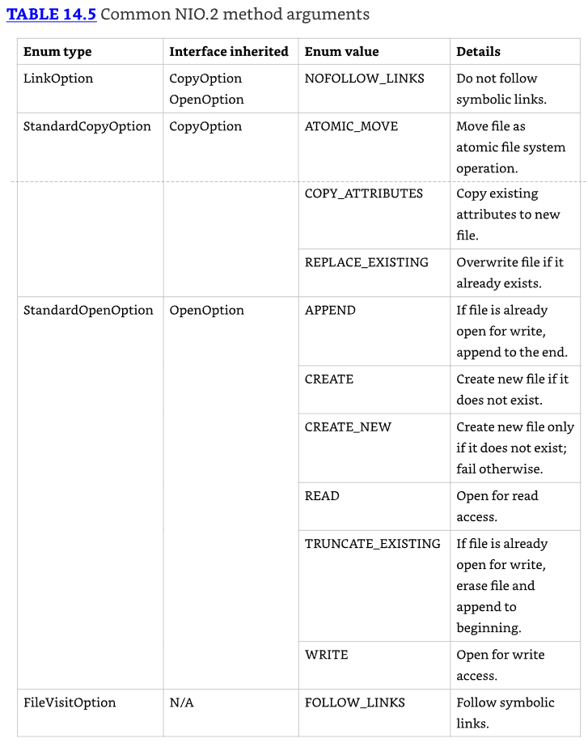

* Con las excepciones de Files.copy() y Files.move(), no discutiremos estos parámetros varargs cada vez que presentemos un método. 
* Su comportamiento debería ser directo, sin embargo. 
* Por ejemplo, ¿puedes descifrar qué hace la siguiente llamada a Files.exists() con el LinkOption en el siguiente fragmento de código?

```java
Path path = Paths.get("schedule.xml");
boolean exists = Files.exists(path, LinkOption.NOFOLLOW_LINKS);
```

* El Files.exists() simplemente verifica si un archivo existe. 
* Pero si el parámetro es un enlace simbólico, el método verifica si el objetivo del enlace simbólico existe, en su lugar. 
* Proporcionar LinkOption.NOFOLLOW_LINKS significa que el comportamiento predeterminado será anulado, y el método verificará si el enlace simbólico en sí existe.

* Nota que algunos de los enums en Table 14.5 heredan una interfaz. 
* Eso significa que algunos métodos aceptan una variedad de tipos enum. 
* Por ejemplo, el método Files.move() toma un varargs CopyOption, por lo que puede tomar enums de diferentes tipos, y más opciones pueden ser añadidas con el tiempo.

```java
void copy(Path source, Path target) throws IOException {
  Files.move(source, target,
    LinkOption.NOFOLLOW_LINKS,
    StandardCopyOption.ATOMIC_MOVE);
}
```

### Interacting with NIO.2 Paths

Justo como los valores String, las instancias Path son inmutables. 
En el siguiente ejemplo, la operación Path en la segunda línea se pierde, ya que `p` es inmutable:

```java
Path p = Path.of("whale");
p.resolve("krill");
System.out.println(p); // whale
```

* Muchos de los métodos disponibles en la interfaz Path transforman el valor de ruta de alguna manera y retornan un nuevo objeto Path, permitiendo que los métodos sean encadenados. 
* Demostramos el encadenamiento en el siguiente ejemplo, los detalles de lo cual discutimos en esta sección del capítulo:

`Path.of("/zoo/../home").getParent().normalize().toAbsolutePath();`

### Viewing the Path

* La interfaz Path contiene tres métodos para recuperar información básica sobre la representación de ruta. 
* El método toString() retorna una representación String de la ruta completa. De hecho, es el único método en la interfaz Path para retornar un String. 
* Muchos de los otros métodos en la interfaz Path retornan instancias Path.

* Los métodos getNameCount() y getName() son frecuentemente usados juntos para recuperar el número de elementos en la ruta y una referencia a cada elemento, respectivamente. 
* Estos dos métodos no incluyen el directorio raíz como parte de la ruta.

```java
Path path = Paths.get("/land/hippo/harry.happy");
System.out.println("The Path Name is: " + path);
for(int i=0; i<path.getNameCount(); i++)
  System.out.println(" Element " + i + " is: " + path.getName(i));
```

* Nota que no llamamos `toString()` explícitamente en la segunda línea. Recuerda, Java llama `toString()` en cualquier Object como parte de la concatenación de strings. 
* Usamos esta característica a lo largo de los ejemplos en este capítulo.

El código imprime lo siguiente:

The Path Name is: /land/hippo/harry.happy
Element 0 is: land
Element 1 is: hippo
Element 2 is: harry.happy

```java
var p = Path.of("/");
System.out.print(p.getNameCount()); // 0
System.out.print(p.getName(0)); // IllegalArgumentException
```

Nota que si intentas llamar getName() con un índice inválido, lanzará una excepción en tiempo de ejecución.

---------------------------------------------------------------------
Nuestros ejemplos imprimen `/` como el carácter separador de archivo porque el sistema que estamos usando. 
Tu salida real puede variar a lo largo de este capítulo.
---------------------------------------------------------------------

### Creating Part of the Path

* La interfaz Path incluye el método subpath() para seleccionar porciones de una ruta. 
* Toma dos parámetros: un beginIndex inclusivo y un endIndex exclusivo. 
* Esto debería sonar familiar, ya que es como funciona el método substring() de String, como viste en Chapter 4, "Core APIs."

* El siguiente fragmento de código muestra cómo funciona subpath(). 
* También imprimimos los elementos del Path usando getName() para que puedas ver cómo los índices son usados.

```java
var p = Paths.get("/mammal/omnivore/raccoon.image");
System.out.println("Path is: " + p);
for (int i = 0; i < p.getNameCount(); i++) {
  System.out.println(" Element " + i + " is: " + p.getName(i));
}
System.out.println();
System.out.println("subpath(0,3): " + p.subpath(0, 3));
System.out.println("subpath(1,2): " + p.subpath(1, 2));
System.out.println("subpath(1,3): " + p.subpath(1, 3));
```

La salida de este fragmento de código es la siguiente:

Path is: /mammal/omnivore/raccoon.image
  Element 0 is: mammal
  Element 1 is: omnivore
  Element 2 is: raccoon.image

```java
subpath(0,3): mammal/omnivore/raccoon.image
subpath(1,2): omnivore
subpath(1,3): omnivore/raccoon.image
```

* Como getNameCount() y getName(), subpath() está indexado en cero y no incluye la raíz. 
* También como getName(), subpath() lanza una excepción si se proporcionan índices inválidos.

```java
var q = p.subpath(0, 4); // IllegalArgumentException
var x = p.subpath(1, 1); // IllegalArgumentException
```

* El primer ejemplo lanza una excepción en tiempo de ejecución, ya que el valor de índice máximo permitido es 3. 
* El segundo ejemplo lanza una excepción, ya que los índices de inicio y fin son los mismos, llevando a un valor de ruta vacío.

### Accessing Path Elements

* La interfaz Path contiene numerosos métodos para recuperar elementos particulares de un Path, retornados como objetos Path ellos mismos. 
* El método getFileName() retorna el elemento Path del archivo o directorio actual, mientras getParent() retorna la ruta completa del directorio contenedor. 
* El método getParent() retorna null si se opera sobre la ruta raíz o en la parte superior de una ruta relativa. 
* El método getRoot() retorna el elemento raíz del archivo dentro del sistema de archivos, o null si la ruta es una ruta relativa.

Considera el siguiente método, que imprime varios elementos Path:

```java
public void printPathInformation(Path path) {
  System.out.println("Filename is: " + path.getFileName());
  System.out.println(" Root is: " + path.getRoot());
  Path currentParent = path;
  while((currentParent = currentParent.getParent()) != null)
    System.out.println(" Current parent is: " + currentParent);
  System.out.println();
}
```

* El bucle while en el método printPathInformation() continúa hasta que getParent() retorna null. 
* Aplicamos este método a las siguientes tres rutas:

```java
printPathInformation(Path.of("zoo"));
printPathInformation(Path.of("/zoo/armadillo/shells.txt"));
printPathInformation(Path.of("./armadillo/../shells.txt"));
```

Esta aplicación de muestra produce la siguiente salida:

Filename is: zoo
  Root is: null

Filename is: shells.txt
  Root is: /

Current parent is: /zoo/armadillo
Current parent is: /zoo
Current parent is: /

Filename is: shells.txt
Root is: null
Current parent is: ./armadillo/..
Current parent is: ./armadillo
Current parent is: .

* Revisando la salida de muestra, puedes ver la diferencia en el comportamiento de getRoot() en rutas absolutas y relativas. 
* Como puedes ver en los ejemplos primero y último, el método getParent() no recorre rutas relativas fuera del directorio de trabajo actual.

* También ves que estos métodos no resuelven los símbolos de ruta y los tratan como una parte distinta de la ruta. 
* Mientras la mayoría de los métodos en esta parte del capítulo tratan los símbolos de ruta como parte de la ruta, presentamos uno en breve que limpia los símbolos de ruta.

### Resolving Paths

* Supón que quieres concatenar rutas de una manera similar a cómo concatenamos strings. 
* El método resolve() proporciona versiones sobrecargadas que te permiten pasar ya sea un Path o un parámetro String. 
* El objeto sobre el cual se invoca el método resolve() se convierte en la base del nuevo objeto Path, con el argumento de entrada siendo añadido a la ruta. 
* Veamos qué sucede si aplicamos resolve() a una ruta absoluta y una ruta relativa:

```java
Path path1 = Path.of("/cats/../panther");
Path path2 = Path.of("food");
System.out.println(path1.resolve(path2));
```

El fragmento de código genera la siguiente salida:

`/cats/../panther/food`

* Como los otros métodos que hemos visto, resolve() no limpia símbolos de ruta. 
* En este ejemplo, el argumento de entrada al método resolve() era una ruta relativa, pero ¿qué si hubiera sido una ruta absoluta?

```java
Path path3 = Path.of("/turkey/food");
System.out.println(path3.resolve("/tiger/cage"));
```

Dado que el parámetro de entrada es una ruta absoluta, la salida sería la siguiente:

`/tiger/cage`

* Para el examen, deberías ser consciente de mezclar rutas absolutas y relativas con el método resolve(). 
* Si se proporciona una ruta absoluta como entrada al método, ese es el valor retornado. 
* Dicho simplemente, no puedes combinar dos rutas absolutas usando resolve().

* En el examen, cuando veas resolve(), piensa en concatenación.

### Relativizing a Path

* La interfaz Path incluye un método relativize() para construir la ruta relativa desde un Path a otro, frecuentemente usando símbolos de ruta. 
* ¿Qué piensas que imprimirán los siguientes ejemplos?

```java
var path1 = Path.of("fish.txt");
var path2 = Path.of("friendly/birds.txt");
System.out.println(path1.relativize(path2));
System.out.println(path2.relativize(path1));
```

Los ejemplos imprimen lo siguiente:

../friendly/birds.txt
../../fish.txt

* La idea es esta: si estás apuntando a una ruta en el sistema de archivos, ¿qué pasos necesitarías tomar para alcanzar la otra ruta? 
* Por ejemplo, para llegar a fish.txt desde friendly/birds.txt, necesitas subir dos niveles (el archivo en sí cuenta como un nivel) y luego seleccionar fish.txt.

* Si ambos valores de ruta son relativos, el método relativize() calcula las rutas como si estuvieran en el mismo directorio de trabajo actual. 
* Alternativamente, si ambos valores de ruta son absolutos, el método calcula la ruta relativa desde una ubicación absoluta a otra, independientemente del directorio de trabajo actual. 
* El siguiente ejemplo demuestra esta propiedad cuando se ejecuta en una computadora Windows:

```java
Path path3 = Paths.get("E:\\habitat");
Path path4 = Paths.get("E:\\sanctuary\\raven\\poe.txt");
System.out.println(path3.relativize(path4));
System.out.println(path4.relativize(path3));
```

Este fragmento de código produce la siguiente salida:

..\sanctuary\raven\poe.txt
..\..\..\habitat

El método relativize() requiere que ambas rutas sean absolutas o relativas y lanza una excepción si los tipos están mezclados.

```java
Path path1 = Paths.get("/primate/chimpanzee");
Path path2 = Paths.get("bananas.txt");
path1.relativize(path2); // IllegalArgumentException
```

* En sistemas basados en Windows, también requiere que si se usan rutas absolutas, ambas rutas deben tener el mismo directorio raíz o letra de unidad. 
* Por ejemplo, lo siguiente también lanzaría una IllegalArgumentException en un sistema basado en Windows:

```java
Path path3 = Paths.get("C:\\primate\\chimpanzee");
Path path4 = Paths.get("D:\\storage\\bananas.txt");
path3.relativize(path4); // IllegalArgumentException
```

### Normalizing a Path

* Hasta ahora, hemos presentado un número de ejemplos que incluían símbolos de ruta que eran innecesarios. 
* Afortunadamente, Java proporciona el método normalize() para eliminar redundancias innecesarias en una ruta.

* Recuerda, el símbolo de ruta `..` se refiere al directorio padre, mientras el símbolo de ruta. 
* Se refiere al directorio actual. Podemos aplicar normalize() a algunas de nuestras rutas anteriores.

```java
var p1 = Path.of("./armadillo/../shells.txt");
System.out.println(p1.normalize()); // shells.txt

var p2 = Path.of("/cats/../panther/food");
System.out.println(p2.normalize()); // /panther/food

var p3 = Path.of("../../fish.txt");
System.out.println(p3.normalize()); // ../../fish.txt
```

Los primeros dos ejemplos aplican los símbolos de ruta para remover las redundancias, pero ¿qué sobre el último? Eso está tan simplificado como puede ser. 
El método normalize() no remueve todos los símbolos de ruta, solo aquellos que pueden ser reducidos.

El método normalize() también nos permite comparar rutas equivalentes. Considera el siguiente ejemplo:

```java
var p1 = Paths.get("/pony/../weather.txt");
var p2 = Paths.get("/weather.txt");
System.out.println(p1.equals(p2)); // false
System.out.println(p1.normalize().equals(p2.normalize())); // true
```

* El método equals() retorna true si dos rutas representan el mismo valor. 
* En la primera comparación, los valores de ruta son diferentes. 
* En la segunda comparación, los valores de ruta han sido ambos reducidos al mismo valor normalizado, /weather.txt. 
* Esta es la función primaria del método normalize(): permitirnos comparar mejor diferentes rutas.

### Retrieving the Real File System Path

* Mientras trabajar con rutas teóricas es útil, a veces quieres verificar que la ruta existe dentro del sistema de archivos usando toRealPath(). 
* Este método es similar a normalize() en que elimina cualquier símbolo de ruta redundante. 
* También es similar a toAbsolutePath(), en que unirá la ruta con el directorio de trabajo actual si la ruta es relativa.

* A diferencia de esos dos métodos, sin embargo, toRealPath() lanzará una excepción si la ruta no existe. 
* Además, seguirá enlaces simbólicos, con un parámetro varargs LinkOption opcional para ignorarlos.

* Digamos que tenemos un sistema de archivos en el cual tenemos un enlace simbólico desde /zebra a /horse. 
* ¿Qué piensas que imprimirá lo siguiente, dado un directorio de trabajo actual de /horse/schedule?

```java
System.out.println(Paths.get("/zebra/food.txt").toRealPath());
System.out.println(Paths.get("../../food.txt").toRealPath());
```

La salida de ambas líneas es la siguiente:

/horse/food.txt

* En este ejemplo, las rutas absolutas y relativas ambas resuelven al mismo archivo absoluto, ya que el enlace simbólico apunta a un archivo real dentro del sistema de archivos. 
* También podemos usar el método toRealPath() para ganar acceso al directorio de trabajo actual como un objeto Path.

`System.out.println(Paths.get(".").toRealPath());`

### Reviewing NIO.2 Path APIs

Hemos cubierto muchos métodos de instancia en Path en esta sección. Table 14.6 los lista para revisión.

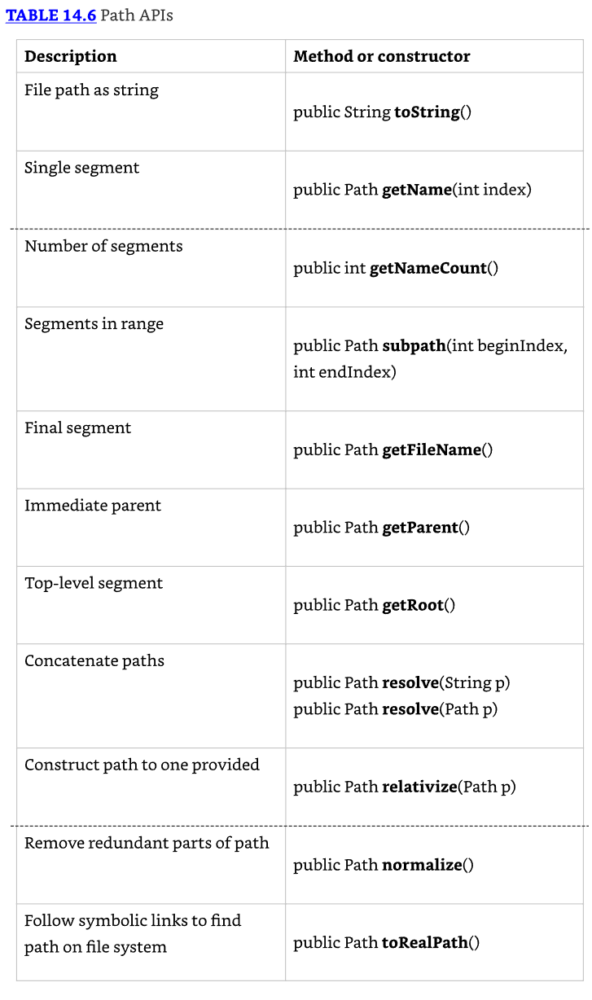

### Creating, Moving, and Deleting Files and Directories

Dado que crear, mover y eliminar tienen algo de matiz, los desarrollamos en esta sección.

### Making Directories

Para crear un directorio, usamos estos métodos Files:

```java
public static Path createDirectory(Path dir,
  FileAttribute<?>... attrs) throws IOException

public static Path createDirectories(Path dir,
  FileAttribute<?>... attrs) throws IOException
```

* El método createDirectory() creará un directorio y lanzará una excepción si ya existe o si las rutas que conducen al directorio no existen. 
* El método createDirectories() crea el directorio objetivo junto con cualquier directorio padre no existente que conduce a la ruta. 
* Si todos los directorios ya existen, createDirectories() simplemente completará sin hacer nada. 
* Esto es útil en situaciones donde quieres asegurar que un directorio existe y crearlo si no existe.

* Ambos de estos métodos también aceptan una lista opcional de valores FileAttribute<?> para aplicar al directorio o directorios recién creados. 
* Discutimos atributos de archivo hacia el final del capítulo.

Lo siguiente muestra cómo crear directorios:

```java
Files.createDirectory(Path.of("/bison/field"));
Files.createDirectories(Path.of("/bison/field/pasture/green"));
```

* El primer ejemplo crea un nuevo directorio, field, en el directorio /bison, asumiendo que /bison existe; de lo contrario, se lanza una excepción. 
* Contrasta esto con el segundo ejemplo, que crea el directorio green junto con cualquiera de los siguientes directorios padre si no existen ya, incluyendo bison, field, y pasture.

### Copying Files

La clase Files proporciona un método para copiar archivos y directorios dentro del sistema de archivos.

```java
public static Path copy(Path source, Path target,
  CopyOption... options) throws IOException
```

* El método copia un archivo o directorio desde una ubicación a otra usando objetos Path. 
* Lo siguiente muestra un ejemplo de copiar un archivo y un directorio:

```java
Files.copy(Paths.get("/panda/bamboo.txt"),
  Paths.get("/panda-save/bamboo.txt"));

Files.copy(Paths.get("/turtle"), Paths.get("/turtleCopy"));
```

* Cuando los directorios son copiados, la copia es superficial. 
* Un shallow copy significa que los archivos y subdirectorios dentro del directorio no son copiados. 
* Un deep copy significa que el árbol completo es copiado, incluyendo todo su contenido y subdirectorios. 
* Una deep copy típicamente requiere recursion, donde un método se llama a sí mismo.

```java
public void copyPath(Path source, Path target) {
  try {
    Files.copy(source, target);
    if(Files.isDirectory(source))
      try (Stream<Path> s = Files.list(source)) {
        s.forEach(p -> copyPath(p,
                target.resolve(p.getFileName())));
      }
  } catch(IOException e) {
   // Handle exception
  }
}
```

* El método primero copia la ruta, ya sea un archivo o un directorio. Si es un directorio, solo se realiza una shallow copy. 
* Luego, verifica si la ruta es un directorio y, si lo es, realiza una copia recursiva de cada uno de sus elementos. 
* ¿Qué pasa si el método se encuentra con un enlace simbólico? No te preocupes: la JVM no seguirá enlaces simbólicos cuando usa el método list().

### Copying and Replacing Files

* Por defecto, si el objetivo ya existe, el método copy() lanzará una excepción. 
* Puedes cambiar este comportamiento proporcionando el valor enum StandardCopyOption REPLACE_EXISTING al método. 
* La siguiente llamada al método sobrescribirá el archivo movie.txt si ya existe:

```java
Files.copy(Paths.get("book.txt"), Paths.get("movie.txt"),
  StandardCopyOption.REPLACE_EXISTING);
```

Para el examen, necesitas saber que sin la opción REPLACE_EXISTING, este método lanzará una excepción si el archivo ya existe.

### Copying Files with I/O Streams

La clase Files incluye dos métodos copy() que operan con streams I/O.

```java
public static long copy(InputStream in, Path target,
  CopyOption... options) throws IOException

public static long copy(Path source, OutputStream out)
  throws IOException
```

* El primer método lee los contenidos de un stream I/O y escribe la salida a un archivo. 
* El segundo método lee los contenidos de un archivo y escribe la salida a un stream I/O. 
* Estos métodos son bastante convenientes si necesitas rápidamente leer/escribir datos desde/hacia disco.

Los siguientes son ejemplos de cada método copy():

```java
try (var is = new FileInputStream("source-data.txt")) {
  // Write I/O stream data to a file
  Files.copy(is, Paths.get("/mammals/wolf.txt"));
}

Files.copy(Paths.get("/fish/clown.xsl"), System.out);
```

* Mientras usamos FileInputStream en el primer ejemplo, el stream I/O podría haber sido cualquier stream I/O válido incluyendo conexiones a sitios web, recursos de stream en memoria, y así sucesivamente. 
* El segundo ejemplo imprime los contenidos de un archivo directamente al stream `System.out`.

### Copying Files into a Directory

* Para el examen, es importante que entiendas cómo el método copy() opera sobre archivos y directorios. 
* Por ejemplo, digamos que tenemos un archivo, food.txt, y un directorio, /enclosure. 
* Tanto el archivo como el directorio existen. ¿Qué piensas que es el resultado de ejecutar el siguiente proceso?

```java
var file = Paths.get("food.txt");
var directory = Paths.get("/enclosure");
Files.copy(file, directory);
```

* Si dijiste que crearía un nuevo archivo en /enclosure/food.txt, estás muy equivocado. 
* Lanza una excepción. El comando intenta crear un nuevo archivo llamado /enclosure. 
* Dado que la ruta /enclosure ya existe, se lanza una excepción en tiempo de ejecución.

* Por otro lado, si el directorio no existiera, el proceso crearía un nuevo archivo con los contenidos de food.txt, pero el archivo se llamaría /enclosure. 
* Recuerda, dijimos que los archivos pueden no necesitar tener extensiones, y en este ejemplo, importa.

* Este comportamiento se aplica tanto a los métodos copy() como move(), este último del cual cubrimos a continuación. 
* En caso de que tengas curiosidad, la manera correcta de copiar el archivo al directorio es hacer lo siguiente:

```java
var file = Paths.get("food.txt");
var directory = Paths.get("/enclosure/food.txt");
Files.copy(file, directory);
```

### Moving or Renaming Paths with move()

La clase Files proporciona un método útil para mover o renombrar archivos y directorios.

```java
public static Path move(Path source, Path target,
  CopyOption... options) throws IOException
```

El siguiente código de muestra usa el método move():

```java
Files.move(Path.of("C:\\zoo"), Path.of("C:\\zoo-new"));
Files.move(Path.of("C:\\user\\addresses.txt"),
  Path.of("C:\\zoo-new\\addresses2.txt"));
```

* El primer ejemplo renombra el directorio zoo a un directorio zoo-new, manteniendo todos los contenidos originales del directorio fuente. 
* El segundo ejemplo mueve el archivo addresses.txt desde el directorio user al directorio zoo-new y lo renombra a addresses2.txt.

### Similarities between move() and copy()

* Como copy(), move() requiere REPLACE_EXISTING para sobrescribir el objetivo si existe; de lo contrario, lanzará una excepción. 
* También como copy(), move() no pondrá un archivo en un directorio si la fuente es un archivo y el objetivo es un directorio. 
* En su lugar, creará un nuevo archivo con el nombre del directorio.

### Performing an Atomic Move

Otro valor enum que necesitas conocer para el examen cuando trabajas con el método move() es el valor StandardCopyOption ATOMIC_MOVE.

```java
Files.move(Path.of("mouse.txt"), Path.of("gerbil.txt"),
  StandardCopyOption.ATOMIC_MOVE);
```

* Puedes recordar la propiedad atomic desde Chapter 13, "Concurrency," y el principio de un atomic move es similar. 
* Un atomic move es uno en el cual un archivo se mueve dentro del sistema de archivos como una sola operación indivisible. 
* Dicho de otra manera, cualquier proceso monitoreando el sistema de archivos nunca ve un archivo incompleto o parcialmente escrito. 
* Si el sistema de archivos no soporta esta característica, se lanzará una AtomicMoveNotSupportedException.

Nota que aunque ATOMIC_MOVE está disponible como un miembro del tipo StandardCopyOption, probablemente lanzará una excepción si se pasa a un método copy().

### Deleting a File with delete() and deleteIfExists()

La clase Files incluye dos métodos que eliminan un archivo o directorio vacío dentro del sistema de archivos.

```java
public static void delete(Path path) throws IOException

public static boolean deleteIfExists(Path path) throws IOException
```

* Para eliminar un directorio, debe estar vacío. Ambos de estos métodos lanzan una excepción si se opera sobre un directorio no vacío. 
* Además, si la ruta es un enlace simbólico, el enlace simbólico será eliminado, no la ruta a la que el enlace simbólico apunta.

* Los métodos difieren en cómo manejan una ruta que no existe. 
* El método delete() lanza una excepción si la ruta no existe, mientras el método deleteIfExists() retorna true si la eliminación fue exitosa o false de lo contrario. 
* Similar a createDirectories(), deleteIfExists() es útil en situaciones donde quieres asegurar que una ruta no existe y eliminarla si existe.

Aquí proporcionamos código de muestra que realiza operaciones delete():

```java
Files.delete(Paths.get("/vulture/feathers.txt"));
Files.deleteIfExists(Paths.get("/pigeon"));
```

* El primer ejemplo elimina el archivo feathers.txt en el directorio vulture, y lanza una NoSuchFileException si el archivo o directorio no existe. 
* El segundo ejemplo elimina el directorio pigeon, asumiendo que está vacío. Si el directorio pigeon no existe, la segunda línea no lanzará una excepción.

### Comparing Files with isSameFile() and mismatch()

* Dado que una ruta puede incluir símbolos de ruta y enlaces simbólicos dentro de un sistema de archivos, el método `equals()` no puede ser confiable para saber si dos instancias Path se refieren al mismo archivo. 
* Afortunadamente, existe el método `isSameFile()`. Este método toma dos objetos Path como entrada, resuelve todos los símbolos de ruta, y sigue enlaces simbólicos. 
* A pesar del nombre, el método también puede ser usado para determinar si dos objetos Path se refieren al mismo directorio.

* Mientras la mayoría de usos de `isSameFile()` lanzarán una excepción si las rutas no existen, hay un caso especial en el cual no lo hace. 
* Si los dos objetos path son iguales en términos de `equals()`, el método simplemente retornará true sin verificar si el archivo existe.

Asume que el sistema de archivos existe, como se muestra en Figure 14.4, con un enlace simbólico desde /animals/snake a /animals/cobra.


Dada la estructura definida en Figure 14.4, ¿qué genera lo siguiente?

```java
System.out.println(Files.isSameFile(
  Path.of("/animals/cobra"),
  Path.of("/animals/snake")));

System.out.println(Files.isSameFile(
  Path.of("/animals/monkey/ears.png"),
  Path.of("/animals/wolf/ears.png")));
```

* Dado que snake es un enlace simbólico a cobra, el primer ejemplo genera true. 
* En el segundo ejemplo, las rutas se refieren a diferentes archivos, por lo que se imprime false.

* A veces quieres comparar los contenidos del archivo en lugar de si es físicamente el mismo archivo. 
* Por ejemplo, podríamos tener dos archivos con texto hello. El método mismatch() fue introducido en Java 12 para ayudarnos aquí. 
* Toma dos objetos Path como entrada. El método retorna -1 si los archivos son los mismos; de lo contrario, retorna el índice de la primera posición en el archivo que difiere.

```java
System.out.println(Files.mismatch(
  Path.of("/animals/monkey.txt"),
  Path.of("/animals/wolf.txt")));
```

* Supón que monkey.txt contiene el nombre Harold y wolf.txt contiene el nombre Howler. 
* El código anterior imprime 1 en ese caso porque la segunda posición es diferente, y usamos indexación basada en cero en Java. 
* Dados esos valores, ¿qué piensas que imprime este código?

```java
System.out.println(Files.mismatch(
  Path.of("/animals/wolf.txt"),
  Path.of("/animals/monkey.txt")));
```

* La respuesta es la misma que el ejemplo anterior. El código imprime 1 de nuevo. 
* El método mismatch() es simétrico y retorna el mismo resultado independientemente del orden de los parámetros.

## Introducing I/O Streams

* Ahora que tenemos lo básico fuera del camino, pasemos a los streams I/O, que son mucho más interesantes. 
* En esta sección, te mostramos cómo usar streams I/O para leer y escribir datos. 
* El "I/O" se refiere a la naturaleza de cómo los datos son accedidos, ya sea leyendo los datos desde un recurso (input) o escribiendo los datos a un recurso (output).

---------------------------------------------------------------------
* Cuando nos referimos a I/O streams en este capítulo, nos estamos refiriendo a los encontrados en la API java.io. 
* Si solo decimos streams, significa los de Chapter 10. ¡Aceptamos que el nombramiento puede ser un poco confuso!
---------------------------------------------------------------------

### Understanding I/O Stream Fundamentals

* Los contenidos de un archivo pueden ser accedidos o escritos vía un I/O stream, que es una lista de elementos de datos presentados secuencialmente. 
* Un stream I/O puede ser conceptualmente pensado como un largo, casi interminable stream de agua con datos presentados una ola a la vez.

* Demostramos este principio en Figure 14.5. El stream I/O es tan grande que una vez que comenzamos a leerlo, no tenemos idea de dónde está el principio o el final. 
* Solo tenemos un puntero a nuestra posición actual en el stream I/O y leemos datos un bloque a la vez.

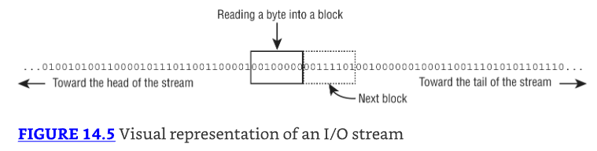

* Cada tipo de stream I/O segmenta datos en una ola o bloque de una manera particular. 
* Por ejemplo, algunas clases de stream I/O leen o escriben datos como bytes individuales. 
* Otras clases de stream I/O leen o escriben caracteres individuales o strings de caracteres. 
* Además de eso, algunas clases de stream I/O leen o escriben grupos más grandes de bytes o caracteres a la vez, específicamente aquellas con la palabra Buffered en su nombre.

---------------------------------------------------------------------
* Aunque la API java.io está llena de streams I/O que manejan caracteres, strings, grupos de bytes, y así sucesivamente, casi todos están construidos sobre leer o escribir un byte individual o un array de bytes a la vez. 
* Los streams I/O de nivel superior existen por conveniencia así como por desempeño.
---------------------------------------------------------------------

* Aunque los streams I/O son comúnmente usados con I/O de archivos, son más generalmente usados para manejar la lectura/escritura de cualquier fuente de datos secuencial. 
* Por ejemplo, podrías construir una aplicación Java que envía datos a un sitio web usando un output stream y lee el resultado vía un input stream.

---------------------------------------------------------------------
**I/O Streams Can Be Big**
* Cuando escribes código donde no sabes qué tan grande será el stream I/O en tiempo de ejecución, puede ser útil visualizar un stream I/O como siendo tan grande que todos los datos contenidos en él no podrían posiblemente caber en memoria. 
* Por ejemplo, un archivo de 1 TB no podría ser almacenado enteramente en memoria por la mayoría de sistemas de computadora (al momento en que este libro está siendo escrito). 
* El archivo todavía puede ser leído y escrito por un programa con muy poca memoria, ya que el stream I/O permite a la aplicación enfocarse en solo una pequeña porción del stream I/O general en cualquier momento dado.
---------------------------------------------------------------------

### Learning I/O Stream Nomenclature

La API java.io proporciona numerosas clases para crear, acceder, y manipular streams I/O—tantas que tiende a abrumar a muchos nuevos desarrolladores Java. 
¡Mantén la calma! Revisamos las principales diferencias entre cada clase de stream I/O y te mostramos cómo distinguir entre ellas.

Incluso si te encuentras con un stream I/O particular en el examen que no reconoces, el nombre del stream I/O frecuentemente te da suficiente información para entender exactamente qué hace.

* El objetivo de esta sección es familiarizarte con la terminología común y convenciones de nombramiento usadas con streams I/O. 
* No te preocupes si no reconoces los nombres de clases de stream particulares usados en esta sección o su función; cubrimos cómo usarlos en detalle en este capítulo.

### Storing Data as Bytes

* Los datos se almacenan en un sistema de archivos (y memoria) como un 0 o 1, llamado un bit. 
* Dado que es realmente difícil para los humanos leer/escribir datos que son solo `0s` y `1s`, están agrupados en un conjunto de 8 bits, llamado un byte.

¿Qué sobre el tipo primitivo byte de Java? Como aprenderás más adelante, cuando usamos streams I/O, los valores son frecuentemente leídos o escritos usando valores byte y arrays.

### Byte Streams vs. Character Streams

* La API java.io define dos conjuntos de clases de stream I/O para leer y escribir streams I/O: byte I/O streams y character I/O streams. 
* Usamos ambos tipos de streams I/O a lo largo de este capítulo.

### Differences between Byte and Character I/O Streams

1. Los streams I/O de byte leen/escriben datos binarios (`0s` y `1s`) y tienen nombres de clase que terminan en InputStream u OutputStream.
2. Los streams I/O de carácter leen/escriben datos de texto y tienen nombres de clase que terminan en Reader o Writer.

* La API frecuentemente incluye clases similares para ambos streams I/O de byte y carácter, tal como FileInputStream y FileReader. 
* La diferencia entre las dos clases está basada en cómo los bytes son leídos o escritos.
* Es importante recordar que aunque los streams I/O de carácter no contienen la palabra Stream en su nombre de clase, todavía son streams I/O. 
* El uso de Reader/Writer en el nombre es solo para distinguirlos de los streams de byte.

A lo largo del capítulo, nos referimos tanto a InputStream como a Reader como input streams, y nos referimos tanto a OutputStream como a Writer como output streams.

* Los streams I/O de byte son usados principalmente para trabajar con datos binarios, tal como una imagen o archivo ejecutable, mientras los streams I/O de carácter son usados para trabajar con archivos de texto. 
* Por ejemplo, puedes usar una clase Writer para generar un valor String a un archivo sin necesariamente tener que preocuparte sobre la codificación de caracteres subyacente del archivo.

* El character encoding determina cómo los caracteres son codificados y almacenados en bytes en un stream I/O y luego leídos de vuelta o decodificados como caracteres. 
* Aunque esto puede sonar simple, Java soporta una amplia variedad de codificaciones de caracteres, desde las que pueden usar un byte para caracteres latinos, UTF-8 y ASCII por ejemplo, hasta usar dos o más bytes por carácter, tal como UTF-16. 
* Para el examen, no necesitas memorizar las codificaciones de caracteres, pero deberías estar familiarizado con los nombres.

---------------------------------------------------------------------
**Character Encoding in Java**
En Java, la codificación de caracteres puede ser especificada usando la clase Charset pasando un valor de nombre al método estático Charset.forName(), tal como en los siguientes ejemplos:

```java
Charset usAsciiCharset = Charset.forName("US-ASCII");
Charset utf8Charset = Charset.forName("UTF-8");
Charset utf16Charset = Charset.forName("UTF-16");
```

Java soporta numerosas codificaciones de caracteres, cada una especificada por un valor de nombre estándar diferente.
---------------------------------------------------------------------

### Input vs. Output Streams

* La mayoría de clases InputStream tienen una clase OutputStream correspondiente, y viceversa. 
* Por ejemplo, la clase FileOutputStream escribe datos que pueden ser leídos por un FileInputStream. 
* Si entiendes las características de una clase Input u Output stream particular, deberías saber naturalmente qué hace su clase complementaria.

* Se sigue, entonces, que la mayoría de clases Reader tienen una clase Writer correspondiente. 
* Por ejemplo, la clase FileWriter escribe datos que pueden ser leídos por un FileReader.

* Hay excepciones a esta regla. Para el examen, deberías saber que PrintWriter no tiene una clase PrintReader acompañante. 
* De igual manera, el PrintStream es un OutputStream que no tiene un InputStream correspondiente. 
* Tampoco tiene Output en su nombre. Discutimos estas clases más adelante en este capítulo.

### Low-Level vs. High-Level Streams

Otra manera en que puedes familiarizarte con la API java.io es segmentando los streams I/O en low-level y high-level streams.

* Un low-level stream se conecta directamente con la fuente de los datos, tal como un archivo, un array, o un String. 
* Los streams I/O de low-level procesan los datos crudos o recurso y son accedidos de manera directa y no filtrada. 
* Por ejemplo, un FileInputStream es una clase que lee datos de archivo un byte a la vez. 
* Alternativamente, un high-level stream está construido sobre otro stream I/O usando wrapping. 
* Wrapping es el proceso por el cual una instancia es pasada al constructor de otra clase, y las operaciones sobre la instancia resultante son filtradas y aplicadas a la instancia original. 
* Por ejemplo, echa un vistazo a los objetos FileReader y BufferedReader en el siguiente código de muestra:

```java
try (var br = new BufferedReader(new FileReader("zoo-data.txt"))) {
  System.out.println(br.readLine());
}
```

* En este ejemplo, FileReader es el stream I/O de low-level, mientras BufferedReader es el stream I/O de high-level que toma un FileReader como input. 
* Muchas operaciones en el stream I/O de high-level pasan a través como operaciones al stream I/O de low-level subyacente, tal como read() o close(). 
* Otras operaciones sobrescriben o añaden nueva funcionalidad a los métodos del stream I/O de low-level. 
* El stream I/O de high-level puede añadir nuevos métodos, tal como readLine(), así como mejoras de desempeño para leer y filtrar los datos de low-level.

* Los streams I/O de high-level también pueden tomar otros streams I/O de high-level como input. 
* Por ejemplo, aunque el siguiente código puede parecer un poco extraño al principio, el estilo de wrapping un stream I/O es bastante común en la práctica:

```java
try (var ois = new ObjectInputStream(
  new BufferedInputStream(
    new FileInputStream("zoo-data.txt")))) {
  System.out.print(ois.readObject());
}
```

* En este ejemplo, el FileInputStream de low-level interactúa directamente con el archivo, que está wrapped por un BufferedInputStream de high-level para mejorar el desempeño. 
* Finalmente, el objeto completo está wrapped por otro ObjectInputStream de high-level, que nos permite interpretar los datos como un objeto Java.

* Para el examen, las únicas clases de stream de low-level con las que necesitas estar familiarizado son las que operan sobre archivos. 
* El resto de las clases de stream no abstractas son todas streams de high-level.

### Stream Base Classes

La librería java.io define cuatro clases abstractas que son los padres de todas las clases de stream I/O definidas dentro de la API: InputStream, OutputStream, Reader, y Writer.

* Los constructores de los streams I/O de high-level frecuentemente toman una referencia a la clase abstracta. 
* Por ejemplo, BufferedWriter toma un objeto Writer como input, lo que le permite tomar cualquier subclase de Writer.

* Un área común donde al examen le gusta jugar trucos contigo es mezclando y emparejando clases de stream I/O que no son compatibles entre sí. 
* Por ejemplo, echa un vistazo a cada uno de los siguientes ejemplos y ve si puedes determinar por qué no compilan:

```java
new BufferedInputStream(new FileReader("z.txt")); // DOES NOT COMPILE
new BufferedWriter(new FileOutputStream("z.txt")); // DOES NOT COMPILE
new ObjectInputStream(
  new FileOutputStream("z.txt"));      // DOES NOT COMPILE
new BufferedInputStream(new InputStream());  // DOES NOT COMPILE
```

* Los primeros dos ejemplos no compilan porque mezclan clases Reader/Writer con clases InputStream/OutputStream, respectivamente. 
* El tercer ejemplo no compila porque estamos mezclando un OutputStream con un InputStream. 
* Aunque es posible leer datos desde un InputStream y escribirlo a un OutputStream, wrapping el stream I/O no es la manera de hacerlo. 
* Como verás más adelante en este capítulo, los datos deben ser copiados. 
* Finalmente, el último ejemplo no compila porque InputStream es una clase abstracta, y por lo tanto no puedes crear una instancia de ella.

### Decoding I/O Class Names

* Presta mucha atención al nombre de la clase I/O en el examen, ya que decodificarla frecuentemente te da pistas de contexto sobre qué hace la clase. 
* Por ejemplo, sin necesidad de buscarlo, debería ser claro que FileReader es una clase que lee datos desde un archivo como caracteres o strings. 
* Además, ObjectOutputStream suena como una clase que escribe datos de objeto a un byte stream.

Table 14.7 lista las clases base abstractas de las que todos los streams I/O heredan.

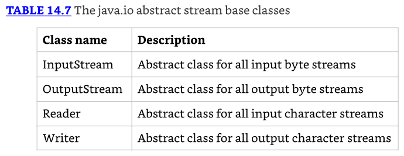

* Table 14.8 lista los streams I/O concretos con los que deberías estar familiarizado para el examen. 
* Nota que la mayor parte de la información sobre cada stream I/O, tal como si es un input u output stream o si accede datos usando bytes o caracteres, puede ser decodificada solo por el nombre.

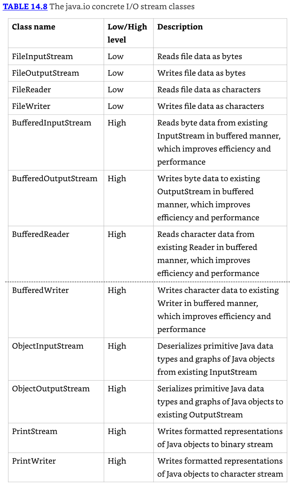

* Mantén Table 14.7 y Table 14.8 a mano mientras aprendes más sobre streams I/O en este capítulo. 
* Los discutimos con más detalle, incluyendo ejemplos de cada uno.

## Reading and Writing Files

Hay un número de maneras de leer y escribir desde un archivo. Las mostramos en esta sección copiando un archivo a otro.

### Using I/O Streams

* Los streams I/O son todo sobre leer/escribir datos, por lo que no debería ser una sorpresa que los métodos más importantes sean read() y write(). 
* Tanto InputStream como Reader declaran un método read() para leer datos de byte desde un stream I/O. 
* De igual manera, OutputStream y Writer ambos definen un método write() para escribir un byte al stream:

* Los siguientes métodos copyStream() muestran un ejemplo de leer todos los valores de un InputStream y Reader y escribiéndolos a un OutputStream y Writer, respectivamente. 
* En ambos ejemplos, -1 se usa para indicar el final del stream.

```java
void copyStream(InputStream in, OutputStream out) throws IOException {
  int b;
  while ((b = in.read()) != -1) {
    out.write(b);
  }
}

void copyStream(Reader in, Writer out) throws IOException {
  int b;
  while ((b = in.read()) != -1) {
      out.write(b);
  }
}
```

* Espera. Dijimos que estamos leyendo y escribiendo bytes, ¿entonces por qué los métodos usan int en lugar de byte? 
* Recuerda, el tipo de dato byte tiene un rango de 256 caracteres. Necesitaban un valor extra para indicar el final de un stream I/O. 
* Los autores de Java decidieron usar un tipo de dato más grande, int, para que valores especiales como -1 pudieran indicar el final de un stream I/O. 
* Las clases de output stream usan int también, para ser consistentes con las clases de input stream.

* Leer y escribir un byte a la vez no es una manera particularmente eficiente de hacer esto. 
* Afortunadamente, hay métodos sobrecargados para leer y escribir múltiples bytes a la vez. Los valores offset y length son aplicados al array en sí. 
* Por ejemplo, un offset de 3 y length de 5 indica que el stream debería leer hasta cinco bytes/caracteres de datos y ponerlos en el array comenzando con la posición 3. Veamos un ejemplo:

```java
10: void copyStream(InputStream in, OutputStream out) throws
IOException {
11:   int batchSize = 1024;
12:   var buffer = new byte[batchSize];
13:   int lengthRead;
14:   while ((lengthRead = in.read(buffer, 0, batchSize)) > 0) {
15:     out.write(buffer, 0, lengthRead);
16:     out.flush();
17: }
```

* En lugar de leer los datos un byte a la vez, leemos y escribimos hasta 1024 bytes a la vez en la línea 14. 
* El valor de retorno lengthRead es crítico para determinar si estamos al final del stream y saber cuántos bytes deberíamos escribir en nuestro output stream.

* A menos que nuestro archivo sea un múltiplo de 1024 bytes, la última iteración del bucle while escribirá algún valor menor que 1024 bytes. 
* Por ejemplo, si el tamaño del buffer es 1,024 bytes y el tamaño del archivo es 1,054 bytes, la última lectura será solo 30 bytes. 
* Si ignoráramos este valor de retorno y en su lugar escribiéramos 1,024 bytes, 994 bytes del loop anterior serían escritos al final del archivo.

* También añadimos un método flush() en la línea 16 para reducir la cantidad de datos perdidos si la aplicación termina inesperadamente. 
* Cuando los datos son escritos a un output stream, el sistema operativo subyacente no garantiza que los datos llegarán al sistema de archivos inmediatamente. 
* El método flush() solicita que todos los datos acumulados sean escritos inmediatamente a disco. Sin embargo, no es sin costo. 
* Cada vez que se usa, puede causar un retraso notable en la aplicación, especialmente para archivos grandes. 
* A menos que los datos que estás escribiendo sean extremadamente críticos, el método flush() debería ser usado solo intermitentemente. 
* Por ejemplo, no debería ser necesariamente llamado después de cada escritura, como lo es en este ejemplo.

* Métodos equivalentes existen en Reader y Writer, pero usan char en lugar de byte, haciendo el método copyStream() equivalente muy similar.
* El ejemplo anterior hace que leer y escribir un archivo parezca mucho para pensar. 
* Eso es porque solo usa streams I/O de low-level. Intentemos de nuevo usando streams de high-level.

```java
26: void copyTextFile(File src, File dest) throws IOException {
27:   try (var reader = new BufferedReader(new FileReader(src));
28:     var writer = new BufferedWriter(new FileWriter(dest))) {
29:     String line = null;
30:     while ((line = reader.readLine()) != null) {
31:       writer.write(line);
32:       writer.newLine();
33:   } } }
```

* La clave es elegir las clases de high-level más útiles. En este caso, estamos tratando con un File, así que queremos usar un FileReader y FileWriter. 
* Ambas clases tienen constructores que pueden tomar ya sea un String representando la ubicación o un File directamente.

* Si el archivo fuente no existe, se lanzará una FileNotFoundException, que hereda IOException. 
* Si el archivo de destino ya existe, esta implementación lo sobrescribirá. 
* Podemos pasar un parámetro boolean segundo opcional a FileWriter para un flag append si queremos cambiar este comportamiento.

* También elegimos usar un BufferedReader y BufferedWriter para que podamos leer una línea completa a la vez. 
* Esto nos da los beneficios de leer lotes de caracteres en la línea 30 sin tener que escribir lógica personalizada. 
* La línea 31 escribe la línea completa de datos de una vez. Dado que leer una línea quita los saltos de línea, los añadimos de vuelta en la línea 32. 
* Las líneas 27 y 28 demuestran encadenar constructores. El constructor try-with-resources se encarga de cerrar todos los objetos en la cadena.

* Ahora imagina que queríamos datos de byte en lugar de caracteres. 
* Necesitaríamos elegir diferentes clases de high-level: BufferedInputStream, BufferedOutputStream, FileInputStream, y FileOuputStream. 
* Llamaríamos readAllBytes() en lugar de readLine() y almacenar el resultado en un byte[] en lugar de un String. 
* Finalmente, no necesitaríamos manejar nuevas líneas, ya que los datos son binarios.

* Podemos hacer un poco mejor que BufferedOutputStream y BufferedWriter usando un PrintStream y PrintWriter. 
* Estas clases contienen cuatro métodos clave. Los métodos print() y println() imprimen datos con y sin una nueva línea, respectivamente. 
* También están los métodos format() y printf(), que describimos en la sección sobre interacciones de usuario.

```java
void copyTextFile(File src, File dest) throws IOException {
  try (var reader = new BufferedReader(new FileReader(src));
    var writer = new PrintWriter(new FileWriter(dest))) {
    String line = null;
    while ((line = reader.readLine()) != null)
      writer.println(line);
  }
}
```

* Mientras usamos un String, hay numerosas versiones sobrecargadas de println(), que toman todo desde primitivos y valores String hasta objetos. 
* Bajo las cubiertas, estos métodos frecuentemente solo realizan String.valueOf().

* Las clases print stream tienen la distinción de ser las únicas clases de stream I/O que cubrimos que no tienen clases de input stream correspondientes. 
* Y a diferencia de otras clases OutputStream, PrintStream no tiene Output en su nombre.

---------------------------------------------------------------------
Puede sorprenderte que has estado usando regularmente un PrintStream a lo largo de este libro. 
Tanto `System.out` como System.err son objetos PrintStream. 
De igual manera, System.in, frecuentemente útil para leer entrada de usuario, es un InputStream.
---------------------------------------------------------------------

* A diferencia de la mayoría de los otros streams I/O que hemos cubierto, los métodos en las clases print stream no lanzan ninguna excepción chequeada. 
* Si lo hicieran, se te requeriría atrapar una excepción chequeada cada vez que llamaras System.out.print()

* El separador de línea es \n o \r\n, dependiendo de tu sistema operativo. 
* El método println() se encarga de esto por ti. 
* Si necesitas obtener el carácter directamente, cualquiera de los siguientes lo retornará para ti:

```java
System.getProperty("line.separator");
System.lineSeparator();
```

### Enhancing with Files

Las APIs NIO.2 proporcionan maneras incluso más fáciles de leer y escribir un archivo usando la clase Files. 
Comencemos mirando tres maneras de copiar un archivo leyendo los datos y escribiéndolos de vuelta:

```java
private void copyPathAsString(Path input, Path output) throws IOException
{
    String string = Files.readString(input);
    Files.writeString(output, string);
}

private void copyPathAsBytes(Path input, Path output) throws IOException {
    byte[] bytes = Files.readAllBytes(input);
    Files.write(output, bytes);
}

private void copyPathAsLines(Path input, Path output) throws IOException {
    List<String> lines = Files.readAllLines(input);
    Files.write(output, lines);
}
```

* ¡Eso es bastante conciso! Puedes leer un Path como un String, un byte array, o una List. 
* Ten en cuenta que el archivo completo es leído de una vez para los tres de estos, por lo tanto, almacenando todos los contenidos del archivo en memoria al mismo tiempo. 
* Si el archivo es significativamente grande, puedes disparar un OutOfMemoryError al intentar cargar todo en memoria. 
* Afortunadamente, hay una alternativa. Esta vez, imprimimos el archivo mientras lo leemos.


```java

```

---------------------------------------------------------------------
Serializing Data
Interacting with Users
Working with Advanced APIs
Review of Key APIs
Summary