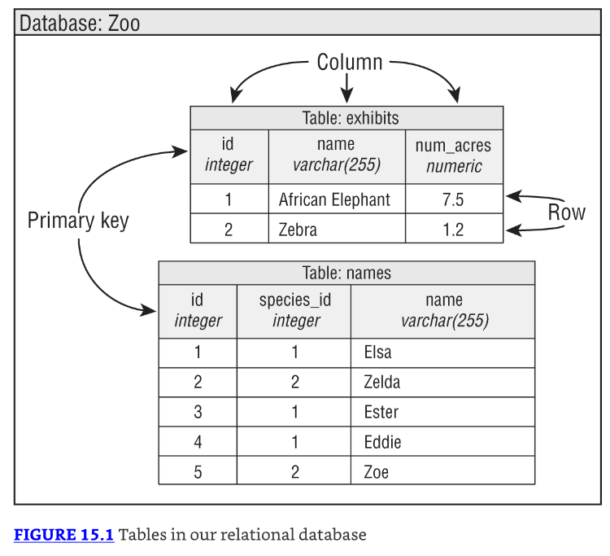
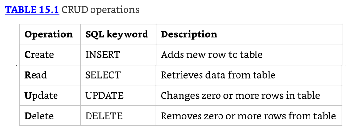
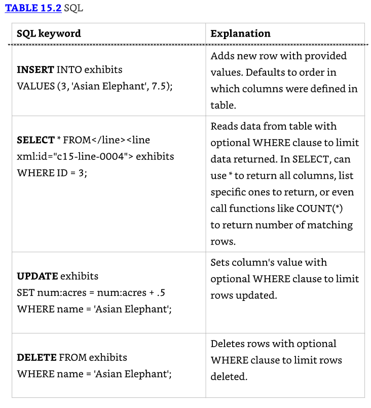

# JDBC

* JDBC significa Java Database Connectivity. Este capítulo te introduce a los conceptos básicos de acceder a bases de datos desde Java. 
* Cubrimos las interfaces clave para cómo conectarse, realizar consultas, procesar los resultados y trabajar con transacciones.

## Introducing Relational Databases and SQL

* Data es información. Una pieza de data es un hecho, como tu primer nombre. 
* Una database es una colección organizada de data. 
* En el mundo real, un archivador es un tipo de base de datos. 
* Tiene carpetas de archivo, cada una de las cuales contiene piezas de papel. 
* Las carpetas de archivo están organizadas de alguna manera, a menudo alfabéticamente. 
* Cada pieza de papel es como una pieza de data. De manera similar, las carpetas en tu computadora son como una base de datos. 
* Las carpetas proporcionan organización, y cada archivo es una pieza de data.

* Una relational database es una base de datos que está organizada en tablas, que consisten de filas y columnas. 
* Puedes pensar en una tabla como una hoja de cálculo. Hay dos formas principales de acceder a una base de datos relacional desde Java:
  * Java Database Connectivity (JDBC): Accede a data como filas y columnas. JDBC es la API cubierta en este capítulo.
  * Java Persistence API (JPA): Accede a data a través de objetos Java usando un concepto llamado object-relational mapping (ORM). 

* La idea es que no tienes que escribir tanto código, y obtienes tu data en objetos Java. 
* JPA no está en el examen, y por lo tanto no está cubierto en este capítulo.

* Una base de datos relacional se accede a través de Structured Query Language (SQL). 
* SQL es un lenguaje de programación usado para interactuar con registros de bases de datos. 
* JDBC funciona enviando un comando SQL a la base de datos y luego procesando la respuesta.

* Además de las bases de datos relacionales, hay otro tipo de base de datos llamada NoSQL database. 
* Estas bases de datos almacenan su data en un formato distinto a tablas, como key/value, document stores, y bases de datos basadas en grafos. 
* NoSQL está fuera del alcance del examen también.

* En las siguientes secciones, introducimos una pequeña base de datos relacional que usaremos para los ejemplos en este capítulo y presentamos el SQL para acceder a ella. 
* También cubrimos algo de vocabulario que necesitas conocer.

### Identifying the Structure of a Relational Database

* Nuestra base de datos de ejemplo tiene dos tablas. Una tiene una fila por cada especie que está en nuestro zoológico. 
* La otra tiene una fila por cada animal. Estas dos se relacionan entre sí porque un animal pertenece a una especie. 
* Estas relaciones son por qué este tipo de base de datos se llama una base de datos relacional. 
* Figure 15.1 muestra la estructura de nuestra base de datos.



* Como puedes ver en Figure 15.1, tenemos dos tablas. Una se llama exhibits, y la otra se llama names. 
* Cada tabla tiene una primary key, que nos da una forma única de referenciar cada fila. 
* Después de todo, dos animales podrían tener el mismo nombre, pero no pueden tener el mismo ID. 
* No necesitas saber sobre keys para el examen. Los mencionamos para darte un poco de contexto. 
* En nuestro ejemplo, sucede que la primary key es solo una columna. En algunas situaciones, es una combinación de columnas llamada compound key. 
* Por ejemplo, un identificador de estudiante y un año podrían ser una compound key.

* Hay dos filas y tres columnas en la tabla exhibits y cinco filas y tres columnas en la tabla names. 
* Necesitas saber sobre filas y columnas para el examen.

### Writing Basic SQL Statements

* Lo más importante que necesitas saber sobre SQL para el examen es que hay cuatro tipos de statements para trabajar con la data en tablas. 
* Se les refiere como CRUD (Create, Read, Update, Delete). 
* Las palabras clave SQL no coinciden con el acrónimo, así que presta atención a la palabra clave SQL para cada una en Table 15.1.



* Eso es todo. No se espera que determines si los statements SQL son correctos. 
* No se espera que detectes errores de sintaxis en statements SQL. No se espera que escribas statements SQL. ¿Notas un tema?

* A diferencia de Java, las palabras clave SQL no distinguen entre mayúsculas y minúsculas. 
* Esto significa select, SELECT, y Select son todas equivalentes. Al igual que los tipos primitivos de Java, SQL tiene una cantidad de tipos de data. 
* La mayoría son autoexplicativos, como INTEGER. También hay DECIMAL, que funciona mucho como un double en Java. El más extraño es VARCHAR, que significa "variable character," que es como un String en Java. 
* La parte variable significa que la base de datos debería usar solo tanto espacio como necesite para almacenar el valor.

Aunque no tienes que saber cómo escribirlos, presentamos los cuatro statements SQL básicos en Table 15.2, ya que aparecen en muchas preguntas.



## Introducing the Interfaces of JDBC

* Para el examen, necesitas conocer cinco interfaces clave de JDBC. Las interfaces están declaradas en el JDK. 
* Son justo como todas las otras interfaces y clases que has visto en este libro. 
* Por ejemplo, en Chapter 9, "Collections and Generics," trabajaste con la interface List y la clase concreta ArrayList.

* Con JDBC, las clases concretas vienen del driver JDBC. Cada base de datos tiene un archivo JAR diferente con estas clases. 
* Por ejemplo, el JAR de PostgreSQL se llama algo como postgresql-9.4–1201.jdbc4.jar. 
* El JAR de MySQL se llama algo como mysql-connector-java-5.1.36.jar. El nombre exacto depende del vendor y la versión del JAR del driver.

* Este JAR del driver contiene una implementación de estas interfaces clave junto con una cantidad de otras interfaces. 
* La clave es que las implementaciones provistas saben cómo comunicarse con una base de datos. 
* También hay diferentes tipos de drivers; afortunadamente, no necesitas saber sobre esto para el examen.

* Figure 15.2 muestra las cinco interfaces clave que necesitas conocer. 
* También muestra que la implementación es provista por un driver JAR imaginario Foo. Inteligentemente, pegan el nombre Foo en todas las clases.


```java

```

---------------------------------------------------------------------

Connecting to a Database
Working with a PreparedStatement
Getting Data from a ResultSet
Calling a CallableStatement
Controlling Data with Transactions
Closing Database Resources
Summary
Exam Essentials
