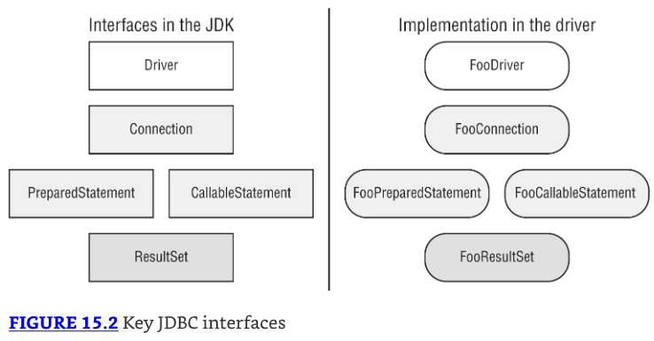
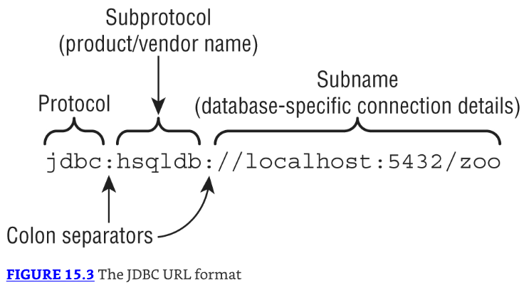
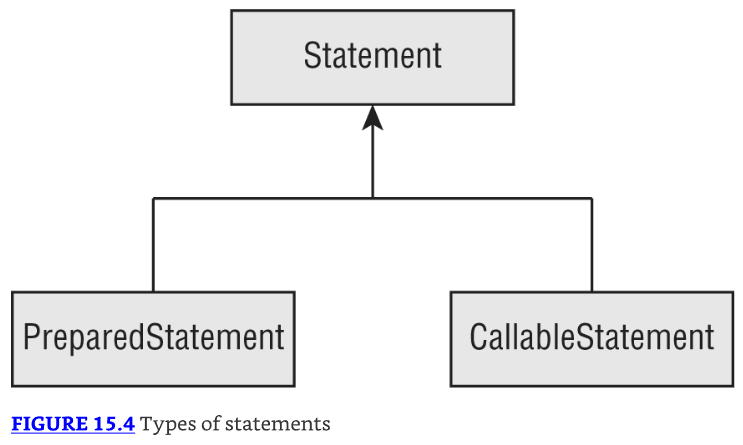
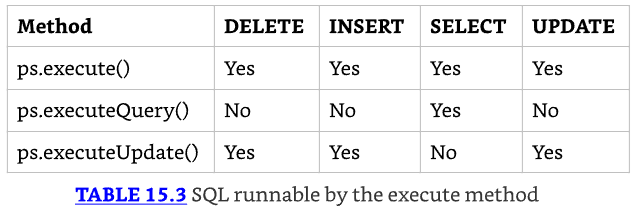
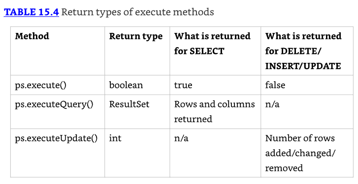
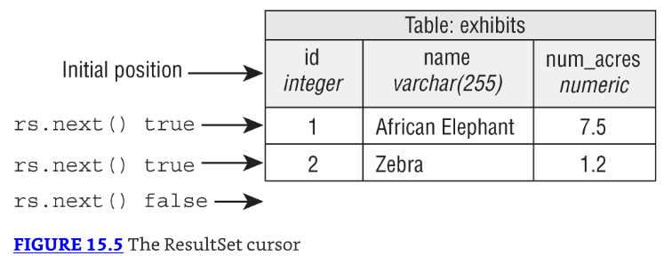
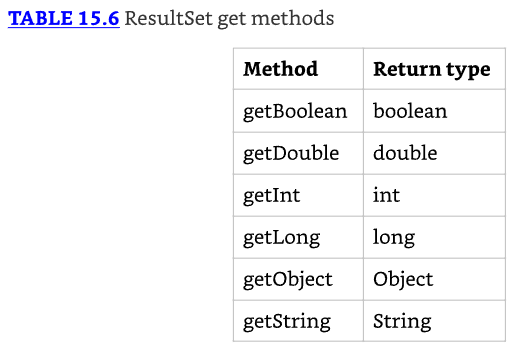
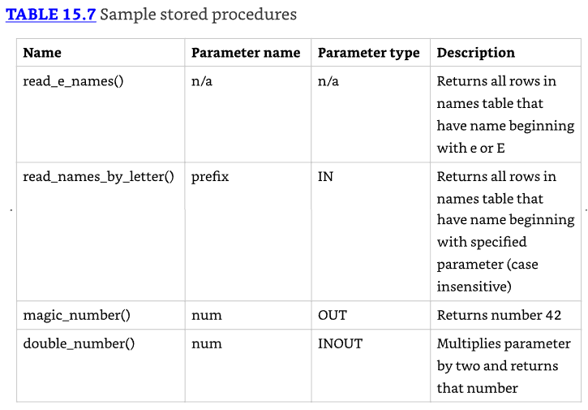
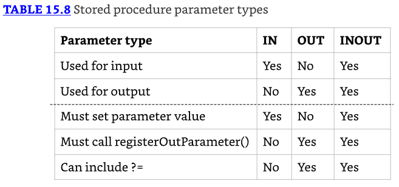
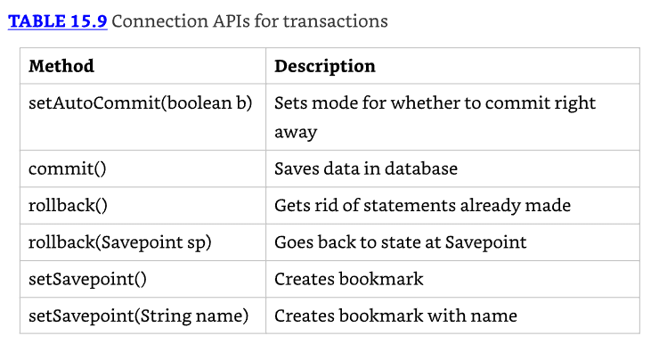

# JDBC

* JDBC significa Java Database Connectivity. Este capítulo te introduce a los conceptos básicos de acceder a bases de datos desde Java. 
* Cubrimos las interfaces clave para cómo conectarse, realizar consultas, procesar los resultados y trabajar con transacciones.

## Introducing Relational Databases and SQL

* Data es información. Una pieza de data es un hecho, como tu primer nombre. 
* Una database es una colección organizada de data. 
* En el mundo real, un archivador es un tipo de base de datos. 
* Tiene carpetas de archivo, cada una de las cuales contiene piezas de papel. 
* Las carpetas de archivo están organizadas de alguna manera, a menudo alfabéticamente. 
* Cada pieza de papel es como una pieza de data. De manera similar, las carpetas en tu computadora son como una base de datos. 
* Las carpetas proporcionan organización, y cada archivo es una pieza de data.

* Una relational database es una base de datos que está organizada en tablas, que consisten de filas y columnas. 
* Puedes pensar en una tabla como una hoja de cálculo. Hay dos formas principales de acceder a una base de datos relacional desde Java:
  * Java Database Connectivity (JDBC): Accede a data como filas y columnas. JDBC es la API cubierta en este capítulo.
  * Java Persistence API (JPA): Accede a data a través de objetos Java usando un concepto llamado object-relational mapping (ORM). 

* La idea es que no tienes que escribir tanto código, y obtienes tu data en objetos Java. 
* JPA no está en el examen, y por lo tanto no está cubierto en este capítulo.

* Una base de datos relacional se accede a través de Structured Query Language (SQL). 
* SQL es un lenguaje de programación usado para interactuar con registros de bases de datos. 
* JDBC funciona enviando un comando SQL a la base de datos y luego procesando la respuesta.

* Además de las bases de datos relacionales, hay otro tipo de base de datos llamada NoSQL database. 
* Estas bases de datos almacenan su data en un formato distinto a tablas, como key/value, document stores, y bases de datos basadas en grafos. 
* NoSQL está fuera del alcance del examen también.

* En las siguientes secciones, introducimos una pequeña base de datos relacional que usaremos para los ejemplos en este capítulo y presentamos el SQL para acceder a ella. 
* También cubrimos algo de vocabulario que necesitas conocer.

### Identifying the Structure of a Relational Database

* Nuestra base de datos de ejemplo tiene dos tablas. Una tiene una fila por cada especie que está en nuestro zoológico. 
* La otra tiene una fila por cada animal. Estas dos se relacionan entre sí porque un animal pertenece a una especie. 
* Estas relaciones son por qué este tipo de base de datos se llama una base de datos relacional. 
* Figure 15.1 muestra la estructura de nuestra base de datos.


* Como puedes ver en Figure 15.1, tenemos dos tablas. Una se llama exhibits, y la otra se llama names. 
* Cada tabla tiene una primary key, que nos da una forma única de referenciar cada fila. 
* Después de todo, dos animales podrían tener el mismo nombre, pero no pueden tener el mismo ID. 
* No necesitas saber sobre keys para el examen. Los mencionamos para darte un poco de contexto. 
* En nuestro ejemplo, sucede que la primary key es solo una columna. En algunas situaciones, es una combinación de columnas llamada compound key. 
* Por ejemplo, un identificador de estudiante y un año podrían ser una compound key.

* Hay dos filas y tres columnas en la tabla exhibits y cinco filas y tres columnas en la tabla names. 
* Necesitas saber sobre filas y columnas para el examen.

### Writing Basic SQL Statements

* Lo más importante que necesitas saber sobre SQL para el examen es que hay cuatro tipos de statements para trabajar con la data en tablas. 
* Se les refiere como CRUD (Create, Read, Update, Delete). 
* Las palabras clave SQL no coinciden con el acrónimo, así que presta atención a la palabra clave SQL para cada una en Table 15.1.


* Eso es todo. No se espera que determines si los statements SQL son correctos. 
* No se espera que detectes errores de sintaxis en statements SQL. No se espera que escribas statements SQL. ¿Notas un tema?

* A diferencia de Java, las palabras clave SQL no distinguen entre mayúsculas y minúsculas. 
* Esto significa select, SELECT, y Select son todas equivalentes. Al igual que los tipos primitivos de Java, SQL tiene una cantidad de tipos de data. 
* La mayoría son autoexplicativos, como INTEGER. También hay DECIMAL, que funciona mucho como un double en Java. El más extraño es VARCHAR, que significa "variable character," que es como un String en Java. 
* La parte variable significa que la base de datos debería usar solo tanto espacio como necesite para almacenar el valor.

Aunque no tienes que saber cómo escribirlos, presentamos los cuatro statements SQL básicos en Table 15.2, ya que aparecen en muchas preguntas.


## Introducing the Interfaces of JDBC

* Para el examen, necesitas conocer cinco interfaces clave de JDBC. Las interfaces están declaradas en el JDK. 
* Son justo como todas las otras interfaces y clases que has visto en este libro. 
* Por ejemplo, en Chapter 9, "Collections and Generics," trabajaste con la interface List y la clase concreta ArrayList.

* Con JDBC, las clases concretas vienen del driver JDBC. Cada base de datos tiene un archivo JAR diferente con estas clases. 
* Por ejemplo, el JAR de PostgreSQL se llama algo como postgresql-9.4–1201.jdbc4.jar. 
* El JAR de MySQL se llama algo como mysql-connector-java-5.1.36.jar. El nombre exacto depende del vendor y la versión del JAR del driver.

* Este JAR del driver contiene una implementación de estas interfaces clave junto con una cantidad de otras interfaces. 
* La clave es que las implementaciones provistas saben cómo comunicarse con una base de datos. 
* También hay diferentes tipos de drivers; afortunadamente, no necesitas saber sobre esto para el examen.

* Figure 15.2 muestra las cinco interfaces clave que necesitas conocer. 
* También muestra que la implementación es provista por un driver JAR imaginario Foo. Inteligentemente, pegan el nombre Foo en todas las clases.

* Probablemente, has notado que no te dijimos cómo se llaman las clases de implementación en ninguna base de datos real. 
* El punto principal es que no deberías saberlo. Con JDBC, usas solo las interfaces en tu código y nunca las clases de implementación directamente. 
* De hecho, podrían ni siquiera ser clases públicas.

¿Qué hacen estas cinco interfaces? A un nivel muy alto, tenemos lo siguiente:

* Driver: Establece una conexión a la base de datos
* Connection: Envía comandos a una base de datos
* PreparedStatement: Ejecuta una query SQL
* CallableStatement: Ejecuta comandos almacenados en la base de datos
* ResultSet: Lee los resultados de una query



Todas las interfaces de base de datos están en el paquete `java.sql`, así que a menudo omitimos los imports a lo largo de este capítulo.

* En este siguiente ejemplo, te mostramos cómo se ve el código JDBC, de principio a fin. 
* Si eres nuevo en JDBC, solo nota que tres de las cinco interfaces están en el código. 
* Si eres experimentado, recuerda que el examen usa la clase DriverManager en lugar de la interface DataSource.

```java
public class MyFirstDatabaseConnection {
  public static void main(String[] args) throws SQLException {
    String url = "jdbc:hsqldb:file:zoo";
    try (Connection conn = DriverManager.getConnection(url);
         PreparedStatement ps = conn.prepareStatement(
                 "SELECT name FROM exhibits");
         ResultSet rs = ps.executeQuery()) {
        while (rs.next())
            System.out.println(rs.getString(1));
    }}}
```

* Si el URL estuviera usando nuestro driver imaginario Foo, DriverManager retornaría una instancia de FooConnection. 
* Llamar a prepareStatement() entonces retornaría una instancia de FooPreparedStatement, y llamar a executeQuery() retornaría una instancia de FooResultSet. 
* Dado que el URL usa hsqldb en su lugar, retorna las implementaciones que HyperSQL ha provisto para estas interfaces. 
* No necesitas saber sus nombres. En el resto del capítulo, explicamos cómo usar las cinco interfaces y entramos en más detalle sobre lo que hacen. 
* Al final del capítulo, estarás escribiendo código como este tú mismo.

---------------------------------------------------------------------
**Compiling with Modules**

* Casi todos los paquetes en el examen están en el módulo `java.base`. 
* Como podrías recordar de Chapter 12, "Modules," este módulo se incluye automáticamente cuando ejecutas tu aplicación como un módulo.

* En contraste, las clases JDBC están todas en el módulo `java.sql`. También están en el paquete `java.sql`. 
* Los nombres son los mismos, así que deberían ser fáciles de recordar. Cuando trabajas con SQL, necesitas el módulo `java.sql` y hacer `import java.sql.*`.

* Recomendamos separar tus estudios para JDBC y módulos. 
* Puedes usar el classpath cuando trabajas con JDBC y reservar tu práctica con el module path para cuando estés estudiando módulos.

Dicho eso, si quieres usar código JDBC con módulos, recuerda actualizar tu archivo module-info para incluir lo siguiente:

`requires java.sql;`
---------------------------------------------------------------------

## Connecting to a Database

* El primer paso para hacer cualquier cosa con una base de datos es conectarse a ella. 
* Primero te mostramos cómo construir el JDBC URL. 
* Luego te mostramos cómo usarlo para obtener una Connection a la base de datos.

### Building a JDBC URL

* Para acceder a un sitio web, necesitas conocer su URL. Para acceder a tu correo electrónico, necesitas conocer tu nombre de usuario y contraseña. 
* JDBC no es diferente. Para acceder a una base de datos, necesitas conocer esta información sobre ella.

* A diferencia de los URL web, los URL JDBC tienen una variedad de formatos. 
* Tienen tres partes en común, como se muestra en Figure 15.3. La primera pieza es siempre la misma. 
* Es el protocolo jdbc. La segunda parte es el subprotocol, que es el nombre de la base de datos, como hsqldb, mysql, o postgres. 
* La tercera parte es el subname, que es un formato específico de la base de datos. Dos puntos `(:)` separan las tres partes.

* El subname típicamente contiene información sobre la base de datos como su ubicación y/o nombre. La sintaxis varía. 
* Necesitas conocer sobre las tres partes principales. No necesitas memorizar los formatos de subname. ¡Uf! Ya has visto un URL así:

`jdbc:hsqldb:file:zoo`



* Nota las tres partes. Comienza con jdbc, y luego viene el subprotocol hsqldb. 
* Termina con el subname, que nos dice que estamos usando el sistema de archivos. 
* La ubicación es entonces el nombre de la base de datos.

Otros ejemplos de subnames se muestran aquí:

```java
jdbc:postgresql://localhost/zoo
jdbc:oracle:thin:@123.123.123.123:1521:zoo
jdbc:mysql://localhost:3306
jdbc:mysql://localhost:3306/zoo?profileSQL=true
```

* Puedes ver que cada uno de estos URL JDBC comienza con jdbc, seguido por dos puntos, seguido por el nombre del vendor/producto. 
* Después de eso, los URL varían. Nota cómo todos ellos incluyen la ubicación de la base de datos: localhost, 123.123.123.123:1521, y localhost:3306. 
* También, nota que el puerto es opcional cuando se usa la ubicación predeterminada.

### Getting a Database Connection

* Hay dos formas principales de obtener una Connection: DriverManager y DataSource. DriverManager es el que se cubre en el examen.
* No uses un DriverManager en código que alguien te está pagando para escribir. Un DataSource tiene más características que DriverManager.
* Por ejemplo, puede hacer pool de conexiones o almacenar la información de conexión de la base de datos fuera de la aplicación.

* La clase DriverManager está en el JDK, ya que es una API que viene con Java. Usa el patrón factory, lo que significa que llamas a un método estático para obtener una Connection en lugar de llamar a un constructor. 
* Como viste en Chapter 11, "Exceptions and Localization," el patrón factory significa que puedes obtener cualquier implementación de la interface al llamar al método. 
* La buena noticia es que el método tiene un nombre fácil de recordar: getConnection().

Para obtener una Connection desde la base de datos HyperSQL, escribes lo siguiente:

```java
import java.sql.*;
public class TestConnect {
  public static void main(String[] args) throws SQLException {
      try (Connection conn =
                   DriverManager.getConnection("jdbc:hsqldb:file:zoo")) {
          System.out.println(conn);
      }}}
```

* Como en Chapter 11, usamos un statement try-with-resources para asegurar que los recursos de la base de datos se cierren. 
* Cubrimos el cierre de recursos de base de datos con más detalle más adelante en el capítulo. 
* También lanzamos el checked SQLException, que significa que algo salió mal. 
* Por ejemplo, podrías haber olvidado configurar la ubicación del driver de base de datos en tu classpath.

Asumiendo que el programa se ejecuta exitosamente, imprime algo como esto:

`org.hsqldb.jdbc.JDBCConnection@3dfc5fb8`

Los detalles del output no son importantes. Solo nota que la clase no es Connection. Es una implementación de vendor de Connection.

También hay una signature que toma un username y password.

```java
import java.sql.*;
public class TestExternal {
  public static void main(String[] args) throws SQLException {
    try (Connection conn = DriverManager.getConnection(
          "jdbc:postgresql://localhost:5432/ocp-book",
          "username",
          "Password20182")) {
      System.out.println(conn);
    }}}
```

* Nota los tres parámetros que se pasan a getConnection(). El primero es el JDBC URL que aprendiste en la sección anterior. 
* El segundo es el username para acceder a la base de datos, y el tercero es el password para acceder a la base de datos. 
* No hace falta decir que nuestro password no es Password20182. También, no pongas tu password en código real. 
* Es una práctica horrible. Siempre cárgala desde algún tipo de configuración, idealmente una que mantenga el valor almacenado encriptado.

Si fueras a ejecutar esto con el JAR del driver Postgres, imprimiría algo como esto:

`org.postgresql.jdbc4.Jdbc4Connection@eed1f14`

* De nuevo, nota que es una clase de implementación específica del driver. Puedes darte cuenta por el nombre del paquete. 
* Dado que el paquete es org.postgresql.jdbc4, es parte del driver PostgreSQL.

* A menos que el examen especifique una línea de comandos, puedes asumir que el JAR del driver JDBC correcto está en el classpath. 
* Los creadores del examen explícitamente preguntan sobre el JAR del driver si quieren que pienses sobre ello.

* Lo bueno sobre el patrón factory es que se encarga de la lógica de crear una clase por ti. 
* No necesitas conocer el nombre de la clase que implementa Connection, y no necesitas saber cómo se crea. 
* Probablemente, estés un poco curioso, sin embargo.

* DriverManager revisa a través de cualquier driver que pueda encontrar para ver si pueden manejar el JDBC URL. 
* Si es así, crea una Connection usando ese Driver. Si no, se rinde y lanza un SQLException.

Podrías ver `Class.forName()` en código. Se requería con drivers más antiguos (que fueron diseñados para versiones más antiguas de JDBC) antes de obtener una Connection.

## Working with a PreparedStatement

En Java, tienes una opción de trabajar con un Statement, PreparedStatement, o CallableStatement. 
Los últimos dos son subinterfaces of Statement, como se muestra en Figure 15.4.



* Más adelante en el capítulo, aprenderás sobre usar CallableStatement para queries que están dentro de la base de datos. 
* En esta sección, vemos PreparedStatement.

* ¿Qué hay de Statement, preguntas? Es una interface que tanto PreparedStatement como CallableStatement extienden. 
* Un Statement y un PreparedStatement son similares entre sí, excepto que un PreparedStatement toma parámetros, mientras que un Statement no. 
* Un Statement simplemente ejecuta cualquier query SQL que le des.

Aunque es posible ejecutar SQL directamente con Statement, no deberías. PreparedStatement es mucho superior por las siguientes razones:

* Performance: En la mayoría de los programas, ejecutas queries similares múltiples veces. Cuando usas PreparedStatement, el software de base de datos a menudo diseña un plan para ejecutar bien la query y lo recuerda.
* Security: Estás protegido contra un ataque llamado SQL injection cuando usas un PreparedStatement correctamente.
* Readability: Es agradable no tener que lidiar con concatenación de strings al construir un string de query con muchos parámetros.
* Future use: Incluso si tu query se está ejecutando solo una vez o no tiene ningún parámetro, deberías usar un PreparedStatement de todas formas. De esa manera, los editores futuros del código no agregarán una variable y tendrán que recordar cambiar a PreparedStatement entonces.

* Usar la interface Statement directamente no está en el alcance del examen JDBC, así que no lo cubrimos en este libro. 
* En las siguientes secciones, cubrimos obtener un PreparedStatement, ejecutar uno, trabajar con parámetros, y ejecutar múltiples updates.

### Obtaining a PreparedStatement

Para ejecutar SQL, necesitas decirle a un PreparedStatement sobre ello. Obtener un PreparedStatement desde una Connection es fácil.

```java
try (PreparedStatement ps = conn.prepareStatement(
  "SELECT * FROM exhibits")) {
  // work with ps
}
```

* Una instancia de un PreparedStatement representa un statement SQL que quieres ejecutar usando la Connection. 
* No ejecuta la query todavía. Llegamos a eso en breve.

Pasar un statement SQL cuando se crea el objeto es obligatorio. Podrías ver un truco en el examen.

```java
try (var ps = conn.prepareStatement()) { // DOES NOT COMPILE
}
```

* El ejemplo anterior no compila, porque SQL no se proporciona en el momento en que se solicita un PreparedStatement. 
* También usamos var en este ejemplo. Escribimos código JDBC tanto usando var como los nombres de clase reales para que te acostumbres a ambos enfoques.

* Hay signatures sobrecargadas que te permiten especificar un tipo ResultSet y modo de concurrencia. 
* En el examen, solo necesitas saber cómo usar las opciones predeterminadas, que procesan los resultados en orden.

### Executing a PreparedStatement

* Ahora que tenemos un PreparedStatement, podemos ejecutar el statement SQL. 
* El método para ejecutar SQL varía dependiendo de qué tipo de statement SQL es. 
* Recuerda que no se espera que seas capaz de leer SQL, pero sí necesitas saber qué significa la primera palabra clave.

### Modifying Data with executeUpdate()

* Empecemos con statements que cambian la data en una tabla. Esos son statements SQL que comienzan con DELETE, INSERT, o UPDATE. 
* Típicamente, usan un método llamado executeUpdate(). El nombre es un poco engañoso porque el statement SQL UPDATE no es el único statement que usa este método.

* El método toma el statement SQL para ejecutar como un parámetro. Retorna el número de filas que fueron insertadas, eliminadas, o cambiadas. 
* Aquí hay un ejemplo de los tres tipos de update:

```java
10: var insertSql = "INSERT INTO exhibits VALUES(10, 'Deer', 3)";
11: var updateSql = "UPDATE exhibits SET name = " " +
12:   "WHERE name = 'None'";
13: var deleteSql = "DELETE FROM exhibits WHERE id = 10";
14:
15: try (var ps = conn.prepareStatement(insertSql)) {
16:   int result = ps.executeUpdate();
17:   System.out.println(result); // 1
18: }
19:
20: try (var ps = conn.prepareStatement(updateSql)) {
21:   int result = ps.executeUpdate();
22:   System.out.println(result); // 0
23: }
24:
25: try (var ps = conn.prepareStatement(deleteSql)) {
26:   int result = ps.executeUpdate();
27:   System.out.println(result); // 1
28: }
```

* Para el examen, no necesitas leer SQL. La pregunta te dirá cuántas filas son afectadas si necesitas saberlo. 
* Nota cómo cada statement SQL distinto necesita su propia llamada a prepareStatement().

* La línea 15 crea el statement insert, y la línea 16 ejecuta ese statement para insertar una fila. 
* El resultado es 1 porque una fila fue afectada. La línea 20 crea el statement update, y la línea 21 verifica toda la tabla para registros coincidentes a actualizar. Dado que no hay registros coincidentes, el resultado es 0. 
* La línea 25 crea el statement delete, y la línea 26 elimina la fila creada en la línea 16. De nuevo, una fila es afectada, así que el resultado es 1.

### Reading Data with executeQuery()

A continuación, veamos un statement SQL que comienza con SELECT. Esta vez, usamos el método e`xecuteQuery()`.

```java
30: var sql = "SELECT * FROM exhibits";
31: try (var ps = conn.prepareStatement(sql);
32:   ResultSet rs = ps.executeQuery()) {
33:
34:   // work with rs
35: }
```

* En la línea 31, creamos un PreparedStatement para nuestra query SELECT. En la línea 32, lo ejecutamos. 
* Dado que estamos ejecutando una query para obtener un resultado, el tipo de retorno es ResultSet. 
* En la siguiente sección, te mostramos cómo procesar el ResultSet.

### Processing Data with execute()

* Hay un tercer método llamado execute() que puede ejecutar ya sea una query o un update. 
* Retorna un boolean para que sepamos si hay un ResultSet. De esa manera, podemos llamar al método apropiado para obtener más detalle. 
* El patrón luce así:

```java
boolean isResultSet = ps.execute();
if (isResultSet) {
  try (ResultSet rs = ps.getResultSet()) {
    System.out.println("ran a query");
  }
} else {
  int result = ps.getUpdateCount();
  System.out.println("ran an update");
}
```

* Si el PreparedStatement se refiere a sql que es un SELECT, el boolean es true, y podemos obtener el ResultSet. 
* Si no es un SELECT, podemos obtener el número de filas actualizadas.

### Using the Correct Method

¿Qué crees que pasa si usamos el método incorrecto para un statement SQL? Echemos un vistazo:

```java
var sql = "SELECT * FROM names";
try (var ps = conn.prepareStatement(sql)) {

  var result = ps.executeUpdate();
}
```

Esto lanza un SQLException similar al siguiente:

```java
Exception in thread "main" java.sql.SQLException:
statement does not generate a row count
```

* No podemos obtener un error del compilador dado que el SQL es un String. 
* Podemos obtener una exception, sin embargo, y sí la obtenemos. 
* También obtenemos un SQLException cuando usamos executeQuery() con SQL que cambia la base de datos.

```java
Exception in thread "main" java.sql.SQLException:
statement does not generate a result set
```

De nuevo, obtenemos una exception porque el driver no puede traducir la query al tipo de retorno esperado.

### Reviewing PreparedStatement Methods

* Para revisar, asegúrate de que conoces Table 15.3 y Table 15.4 bien. 
* Table 15.3 muestra qué statements SQL pueden ser ejecutados por cada uno de los tres métodos clave en PreparedStatement. 
* Table 15.4 muestra qué es retornado por cada método.





### Working with Parameters

Supongamos que nuestro zoológico adquiere un nuevo elefante y queremos registrarlo en nuestra tabla names. 
Ya hemos aprendido suficiente para hacer esto.

```java
public static void register(Connection conn) throws SQLException {
  var sql = "INSERT INTO names VALUES(6, 1, 'Edith')";
  
  try (var ps = conn.prepareStatement(sql)) {
    ps.executeUpdate();
  }
}
```

* Sin embargo, todo está hard-coded. Queremos poder pasar los valores como parámetros. 
* Afortunadamente, un PreparedStatement nos permite configurar parámetros. 
* En lugar de especificar los tres valores en el SQL, podemos usar un signo de interrogación `(?)`. 
* Un bind variable es un placeholder que te permite especificar los valores reales en runtime. 
* Una bind variable es como un parámetro, y verás que las bind variables se referencian tanto como variables como parámetros. 
* Podemos reescribir nuestro statement SQL usando bind variables.

`String sql = "INSERT INTO names VALUES(?, ?, ?)";`

* Las bind variables hacen que el SQL sea más fácil de leer dado que ya no necesitas usar comillas alrededor de los valores String en el SQL. 
* Ahora podemos pasar los parámetros al método mismo.

```java
14: public static void register(Connection conn, int key,
15:   int type, String name) throws SQLException {
16:
17:   String sql = "INSERT INTO names VALUES(?, ?, ?)";
18:
19:   try (PreparedStatement ps = conn.prepareStatement(sql)) {
20:     ps.setInt(1, key);
21:     ps.setString(3, name);
22:     ps.setInt(2, type);
23:     ps.executeUpdate();
24:   }
25: }
```

* La línea 19 crea un PreparedStatement usando nuestro SQL que contiene tres bind variables. Las líneas 20–22 configuran esas variables. 
* Puedes pensar en las bind variables como una lista de parámetros, donde cada uno se configura por turno. 
* Nota cómo las bind variables pueden configurarse en cualquier orden. La línea 23 ejecuta la query y ejecuta el update.

Nota cómo las bind variables se cuentan empezando con 1 en lugar de 0. Esto es realmente importante, así que lo repetiremos.

Recuerda que JDBC comienza a contar columnas con 1 en lugar de 0. ¡Una pregunta común del examen prueba que sabes esto!

* En el ejemplo anterior, configuramos los parámetros fuera de orden. 
* Eso está perfectamente bien. La regla es solo que se configure cada uno antes de que se ejecute la query. 
* Veamos qué pasa si no configuras todas las bind variables.

```java
var sql = "INSERT INTO names VALUES(?, ?, ?)";
try (var ps = conn.prepareStatement(sql)) {
  ps.setInt(1, key);
  ps.setInt(2, type);
  // missing the set for parameter number 3
  ps.executeUpdate();
}
```

El código compila, y obtienes un SQLException. El mensaje puede variar según tu driver de base de datos.

`Exception in thread "main" java.sql.SQLException: Parameter not set`

¿Qué hay si intentas configurar más valores de los que tienes como bind variables?

```java
var sql = "INSERT INTO names VALUES(?, ?)";
try (var ps = conn.prepareStatement(sql)) {
  ps.setInt(1, key);
  ps.setInt(2, type);
  ps.setString(3, name);
  ps.executeUpdate();
}
```

De nuevo, obtienes un SQLException, esta vez con un mensaje diferente. En HyperSQL, ese mensaje fue el siguiente:

```java
Exception in thread "main" java.sql.SQLException:
row column count mismatch in statement [INSERT INTO names
VALUES(?, ?)]
```

* Table 15.5 muestra los métodos que necesitas conocer para el examen para configurar bind variables. 
* Los que necesitas conocer para el examen son fáciles de recordar dado que se llaman set seguido del nombre del tipo que estás configurando. 
* Hay muchos otros, como dates, que están fuera del alcance del examen.


* La primera columna muestra el nombre del método, y la segunda columna muestra el tipo que Java usa. 
* La tercera columna muestra el nombre del tipo que podría estar en la base de datos. 
* Hay alguna variación por bases de datos, así que verifica la documentación de tu base de datos específica. 
* Necesitas conocer solo las primeras dos columnas para el examen.

* El método setNull() toma un parámetro int que representa el tipo de columna en la base de datos. 
* No necesitas conocer estos tipos. Nota que el método setObject() funciona con cualquier tipo Java. 
* Si pasas un primitivo, será autoboxeado en un tipo wrapper. Eso significa que podemos reescribir nuestro ejemplo como sigue:

```java
String sql = "INSERT INTO names VALUES(?, ?, ?)";
try (PreparedStatement ps = conn.prepareStatement(sql)) {
  ps.setObject(1, key);
  ps.setObject(2, type);
  ps.setObject(3, name);
  ps.executeUpdate();
}
```

* Java manejará la conversión de tipo por ti. 
* Todavía es mejor llamar a los métodos setter más específicos dado que eso te dará un error en tiempo de compilación si pasas el tipo incorrecto en lugar de un error en runtime.

### Updating Multiple Records

Supongamos que obtenemos dos nuevos elefantes y queremos agregar ambos. Podemos usar el mismo objeto PreparedStatement.

```java
var sql = "INSERT INTO names VALUES(?, ?, ?)";

try (var ps = conn.prepareStatement(sql)) {

  ps.setInt(1, 20);
  ps.setInt(2, 1);
  ps.setString(3, "Ester");
  ps.executeUpdate();
  ps.setInt(1, 21);
  ps.setString(3, "Elias");
  ps.executeUpdate();
}

```

* Nota que configuramos los tres parámetros cuando agregamos `Ester` pero solo dos para Elias. 
* El PreparedStatement es lo suficientemente inteligente para recordar los parámetros que ya fueron configurados y retenerlos. 
* Solo tienes que configurar los que son diferentes.

---------------------------------------------------------------------
**Batching Statements**

* JDBC soporta batching para que puedas ejecutar múltiples statements en menos viajes a la base de datos. 
* A menudo la base de datos está ubicada en una máquina diferente a la que el código Java se ejecuta. 
* Guardar viajes a la base de datos ahorra tiempo porque las llamadas de red pueden ser costosas. 
* Por ejemplo, si necesitas insertar 1,000 registros en la base de datos, insertarlos como una sola llamada de red (en oposición a 1,000 llamadas de red) es usualmente a lot más rápido.
* No necesitas conocer los métodos addBatch() y executeBatch() para el examen, pero son útiles en la práctica.

```java
public static void register(Connection conn, int firstKey,
  int type, String... names) throws SQLException {
  
  var sql = "INSERT INTO names VALUES(?, ?, ?)";
  var nextIndex = firstKey;
  
  try (var ps = conn.prepareStatement(sql)) {
    ps.setInt(2, type);
    
    for(var name: names) {
      ps.setInt(1, nextIndex);
      ps.setString(3, name);
      ps.addBatch();
      
      nextIndex++;
    }
    int[] result = ps.executeBatch();
    System.out.println(Arrays.toString(result));
  }
}
register(conn, 100, 1, "Elias", "Ester");
```

El output muestra que el array tiene dos elementos dado que hay dos ítems diferentes en el batch. Cada uno agregó una fila en la base de datos.

```java
[1, 1]
```

* Puedes usar batching para dividir operaciones grandes, como insertar 10 millones de registros en grupos de 100. 
* En la práctica, toma un poco de trabajo determinar un tamaño de batch apropiado, pero el rendimiento de usar batch normalmente es mucho mejor que insertar una fila a la vez (o los diez millones a la vez).
---------------------------------------------------------------------

## Getting Data from a ResultSet

* Una base de datos no es útil si no puedes obtener tu data. Empezamos mostrándote cómo recorrer un ResultSet. 
* Luego recorremos los diferentes métodos para obtener columnas por tipo.

### Reading a ResultSet

Cuando trabajas con un ResultSet, la mayor parte del tiempo, escribirás un loop para mirar cada fila. El código luce así:

```java
20: String sql = "SELECT id, name FROM exhibits";
21: var idToNameMap = new HashMap<Integer, String>();
22:
23: try (var ps = conn.prepareStatement(sql);
24:   ResultSet rs = ps.executeQuery()) {
25:
26:   while (rs.next()) {
27:     int id = rs.getInt("id");
28:     String name = rs.getString("name");
29:     idToNameMap.put(id, name);
30:   }
31:   System.out.println(idToNameMap);
32: }
```

Esto genera:

```java
{1=African Elephant, 2=Zebra}
```

* Hay algunas cosas que notar aquí. Primero, usamos el método executeQuery() en la línea 24, dado que queremos que se retorne un ResultSet. 
* En la línea 26, hacemos un loop a través de los resultados. Cada vez a través del loop representa una fila en el ResultSet. 
* Las líneas 27 y 28 te muestran la mejor manera de obtener las columnas para una fila dada.

Un ResultSet tiene un cursor, que apunta a la ubicación actual en la data. Figure 15.5 muestra la posición mientras hacemos el loop.



* En la línea 24, el cursor empieza apuntando a la ubicación antes de la primera fila en el ResultSet. 
* En la primera iteración del loop, rs.next() retorna true, y el cursor se mueve para apuntar a la primera fila de data. 
* En la segunda iteración del loop, rs.next() retorna true de nuevo, y el cursor se mueve para apuntar a la segunda fila de data. 
* La siguiente llamada a rs.next() retorna false. El cursor avanza más allá del final de la data. 
* El false significa que no hay más data disponible para obtener.

* Dijimos que la "mejor manera" de obtener data era con nombres de columna. Hay otra forma de acceder a las columnas. 
* Puedes usar un índice, contando desde 1 en lugar de un nombre de columna.

```java
27:   int id = rs.getInt(1);
28:   String name = rs.getString(2);
```

* Ahora puedes ver las posiciones de columna. Nota cómo las columnas se cuentan empezando con 1 en lugar de 0. 
* Justo como con un PreparedStatement, JDBC empieza a contar en 1 en un ResultSet.

* El nombre de columna es mejor porque es más claro qué está pasando cuando lees el código. 
* También te permite cambiar el SQL para reordenar las columnas.

---------------------------------------------------------------------
En el examen, ya sea se te dirán los nombres de las columnas en una tabla, o puedes asumir que son correctos. 
De manera similar, puedes asumir que todo el SQL es correcto.
---------------------------------------------------------------------

* A veces quieres obtener solo una fila de la tabla. Tal vez necesitas solo una pieza de data. 
* O tal vez el SQL está simplemente retornando el número de filas en la tabla. 
* Cuando quieres solo una fila, usas un statement if en lugar de un loop while.

```java
var sql = "SELECT count(*) FROM exhibits";

try (var ps = conn.prepareStatement(sql);
  var rs = ps.executeQuery()) {
  
  if (rs.next()) {
    int count = rs.getInt(1);
    System.out.println(count);
  }
}
```

* Es importante verificar que rs.next() retorna true antes de intentar llamar a un getter en el ResultSet. 
* Si una query no retornó ninguna fila, lanzaría un SQLException, así que el statement if verifica que es seguro llamarlo. 
* Alternativamente, puedes usar el nombre de columna.

`var count = rs.getInt("count");`

Intentemos leer una columna que no existe.

```java
var sql = "SELECT count(*) AS count FROM exhibits";

try (var ps = conn.prepareStatement(sql);
  var rs = ps.executeQuery()) {
  
  if (rs.next()) {
    var count = rs.getInt("total");
    System.out.println(count);
  }
}
```

Esto lanza un SQLException con un mensaje como este:

```java
Exception in thread "main" java.sql.SQLException: Column not found: total
```

* Intentar acceder a un nombre de columna o índice que no existe lanza un SQLException, como lo hace obtener data de un ResultSet cuando no está apuntando a una fila válida. 
* Necesitas ser capaz de reconocer tal código. Aquí hay algunos ejemplos a tener cuidado. ¿Ves qué está mal cuando no hay filas coincidentes?

```java
var sql = "SELECT * FROM exhibits where name='Not in table'";

try (var ps = conn.prepareStatement(sql);

var rs = ps.executeQuery()) {

        rs.next();
  rs.getInt(1); // SQLException
}
```

* Llamar a rs.next() funciona. Retorna false. Sin embargo, llamar a un getter después lanza un SQLException porque el cursor del result set no apunta a una posición válida. 
* Si se hubiera retornado una coincidencia, este código habría funcionado. ¿Ves qué está mal con lo siguiente?

```java
var sql = "SELECT count(*) FROM exhibits";

try (var ps = conn.prepareStatement(sql);
  var rs = ps.executeQuery()) {
  
  rs.getInt(1); // SQLException
}
```

No llamar a rs.next() en absoluto es un problema. El cursor del result set todavía está apuntando a una ubicación antes de la primera fila, así que el getter no tiene nada a lo cual apuntar.

Para resumir esta sección, es importante recordar lo siguiente:
* Siempre usa un statement if o loop while cuando llames a rs.next().
* Los índices de columna comienzan con 1.

### Getting Data for a Column

* Hay muchos métodos get en la interface ResultSet. Table 15.6 muestra los métodos get que necesitas conocer. 
* Estos son los equivalentes getter de los setters en Table 15.5.



* Podrías notar que no todos los tipos primitivos están en Table 15.6. Hay métodos getByte() y getFloat(), pero no necesitas saber sobre ellos para el examen. 
* No hay un método getChar(). Afortunadamente, no necesitas recordar esto. El examen no intentará engañarte usando un nombre de método get que no existe para JDBC. 
* ¿No es agradable de parte de los creadores del examen?

El método getObject() puede retornar cualquier tipo. Para un primitivo, usa la clase wrapper. Veamos el siguiente ejemplo:

```java
16: var sql = "SELECT id, name FROM exhibits";
17: try (var ps = conn.prepareStatement(sql);
18:   var rs = ps.executeQuery()) {
19:
20:   while (rs.next()) {
21:     Object idField = rs.getObject("id");
22:     Object nameField = rs.getObject("name");
23:     if (idField instanceof Integer id)
24:       System.out.println(id);
25:     if (nameField instanceof String name)
26:       System.out.println(name);
27:   }
28: }
```

* Las líneas 21 y 22 obtienen la columna como cualquier tipo de Object que sea más apropiado. 
* Las líneas 23–26 usan pattern matching para obtener los tipos reales. 
* Tú probablemente no usarías getObject() cuando escribes código para un trabajo, pero es bueno saber sobre ello para el examen.

### Using Bind Variables

* Hemos estado creando el PreparedStatement y ResultSet en el mismo statement try-with-resources. 
* Esto no funciona si tienes bind variables porque necesitan ser configuradas en el medio. 
* Afortunadamente, podemos anidar try-with-resources para manejar esto. Este código imprime el ID para cualquier exhibits que coincidan con un nombre dado:

```java
30: var sql = "SELECT id FROM exhibits WHERE name = ?";
31:
32: try (var ps = conn.prepareStatement(sql)) {
33:   ps.setString(1, "Zebra");
34:
35:   try (var rs = ps.executeQuery()) {
36:     while (rs.next()) {
37:       int id = rs.getInt("id");
38:       System.out.println(id);
39:     }
40:   }
41: }
```

* Presta atención al flujo aquí. Primero creamos el PreparedStatement en la línea 32. Luego configuramos la bind variable en la línea 33. 
* Es solo después de que ambas están hechas que tenemos un try-with-resources anidado en la línea 35 para crear el ResultSet.

## Calling a CallableStatement

* En algunas situaciones, es útil almacenar queries SQL en la base de datos en lugar de empaquetarlas con el código Java. 
* Esto es particularmente útil cuando hay muchas queries complejas. 
* Un stored procedure es código que se compila por adelantado y se almacena en la base de datos. 
* Los stored procedures se escriben comúnmente en una variante específica de base de datos de SQL, que varía entre proveedores de software de bases de datos.

* Usar un stored procedure reduce los viajes de ida y vuelta de red. También permite a los expertos en bases de datos poseer esa parte del código. 
* Sin embargo, los stored procedures son específicos de base de datos e introducen complejidad en mantener tu aplicación. 
* En el examen, necesitas saber cómo llamar a un stored procedure, pero no decidir cuándo usar uno.

* No necesitas saber cómo leer o escribir un stored procedure para el examen. Por lo tanto, no hemos incluido ninguno en el libro. 
* Están en el código de configuración de la base de datos de ejemplo si tienes curiosidad.

---------------------------------------------------------------------
No necesitas aprender nada específico de base de datos para el examen. 
Dado que estudiar stored procedures puede ser bastante complicado, recomendamos limitar tu estudio de CallableStatement a lo que está en este libro.
---------------------------------------------------------------------

* Usaremos cuatro stored procedures en esta sección. Table 15.7 resume lo que necesitas saber sobre ellos. 
* En el mundo real, ninguno de estos sería buena implementación dado que no son lo suficientemente complejos para justificar ser stored procedures. 
* Como puedes ver en la tabla, los stored procedures permiten que los parámetros sean para input solamente, output solamente, o ambos.



En las siguientes cuatro secciones, vemos cómo llamar a cada uno de estos stored procedures.

### Calling a Procedure without Parameters

Nuestro stored procedure read_e_names() no toma ningún parámetro. Retorna un ResultSet. 
Dado que trabajamos con un ResultSet en la sección PreparedStatement, aquí podemos enfocarnos en cómo se llama el stored procedure.

```java
12: String sql = "{call read_e_names()}";
13: try (CallableStatement cs = conn.prepareCall(sql);
14:   ResultSet rs = cs.executeQuery()) {
15:
16:   while (rs.next()) {
17:     System.out.println(rs.getString(3));
18:   }
19: }
```

* La línea 12 introduce un nuevo bit de sintaxis. Un stored procedure se llama poniendo la palabra call y el nombre del procedimiento entre llaves ({}). 
* La línea 13 crea un objeto CallableStatement. Cuando creamos un PreparedStatement, usamos el método prepareStatement(). 
* Aquí, usamos el método prepareCall() en su lugar.

* Las líneas 14–18 deberían verse familiares. Son la lógica estándar que hemos estado usando para obtener un ResultSet y hacer un loop a través de él. 
* Este stored procedure retorna la tabla subyacente, así que las columnas son las mismas.

### Passing an IN Parameter

* Un stored procedure que siempre retorna lo mismo es solo algo útil. Hemos creado una nueva versión de ese stored procedure que es más genérica. 
* El stored procedure read_names_by_letter() toma un parámetro para el prefijo o primera letra del stored procedure. Un parámetro IN se usa para input.

Hay dos diferencias al llamarlo comparado con nuestro stored procedure anterior.

```java
25: var sql = "{call read_names_by_letter(?)}";
26: try (var cs = conn.prepareCall(sql)) {
27:   cs.setString("prefix", "Z");
28:
29:   try (var rs = cs.executeQuery()) {
30:     while (rs.next()) {
31:       System.out.println(rs.getString(3));
32:     }
33:   }
34: }
```

* En la línea 25, tenemos que pasar un `?` para mostrar que tenemos un parámetro. Esto debería ser familiar de las bind variables con un PreparedStatement.
* En la línea 27, configuramos el valor de ese parámetro. A diferencia de PreparedStatement, podemos usar ya sea el número de parámetros (empezando con 1) o el nombre del parámetro. 
* Eso significa que estos dos statements son equivalentes:

```java
cs.setString(1, "Z");
cs.setString("prefix", "Z");
```

### Returning an OUT Parameter

* En nuestros ejemplos previos, retornamos un ResultSet. Algunos stored procedures
* retornan otra información. Afortunadamente, los stored procedures pueden tener parámetros OUT para output. 
* El stored procedure magic_number() configura su parámetro OUT a 42. Hay algunas diferencias aquí:

```java
40: var sql = "{?= call magic_number(?)}";
41: try (var cs = conn.prepareCall(sql)) {
42:   cs.registerOutParameter(1, Types.INTEGER);
43:   cs.execute();
44:   System.out.println(cs.getInt("num"));
45: }
```

* En la línea 40, incluimos dos caracteres especiales (?=) para especificar que el stored procedure tiene un valor de output. 
* Esto es opcional dado que tenemos el parámetro OUT, pero ayuda en legibilidad.

* En la línea 42, registramos el parámetro OUT. Esto es importante. Permite a JDBC recuperar el valor en la línea 44. 
* Recuerda siempre llamar registerOutParameter() para cada parámetro OUT o INOUT (que cubrimos a continuación).

En la línea 43, llamamos a execute() en lugar de executeQuery() dado que no estamos retornando un ResultSet de nuestro stored procedure.

---------------------------------------------------------------------
**Database-Specific Behavior**

* Algunas bases de datos son indulgentes sobre ciertas cosas que este capítulo dice que son requeridas. 
* Por ejemplo, algunas bases de datos te permiten omitir lo siguiente:
  * Braces ({})
  * Bind variable (?) si es un parámetro OUT
  * Call to registerOutParameter()

* Para el examen, necesitas responder de acuerdo con los requisitos completos, que están descritos en este libro. 
* Por ejemplo, deberías responder preguntas del examen como si las llaves fueran requeridas.
---------------------------------------------------------------------

### Working with an INOUT Parameter

* Finalmente, es posible usar el mismo parámetro para tanto input como output. 
* A medida que lees este código, ve si puedes detectar qué líneas son requeridas para la parte IN y cuáles son requeridas para la parte OUT:

```java
50: var sql = "{call double_number(?)}";
51: try (var cs = conn.prepareCall(sql)) {
52:   cs.setInt(1, 8);
53:   cs.registerOutParameter(1, Types.INTEGER);
54:   cs.execute();
55:   System.out.println(cs.getInt("num"));
56: }
```

* Para un parámetro IN, la línea 52 es requerida dado que configura el valor. Para un parámetro OUT, la línea 53 es requerida para registrarlo. 
* La línea 54 usa execute() de nuevo porque no estamos retornando un ResultSet.

Recuerda que un parámetro INOUT actúa como tanto un parámetro IN como un parámetro OUT, así que tiene todos los requisitos de ambos.

### Comparing Callable Statement Parameters

Table 15.8 revisa los diferentes tipos de parámetros. Necesitas conocer esto bien para el examen.



### Using Additional Options

* Hasta ahora, hemos estado creando PreparedStatement y CallableStatement con las opciones predeterminadas. 
* Ambos soportan opciones de tipo ResultSet y concurrencia. No todas las opciones están disponibles en todas las bases de datos. 
* Afortunadamente, solo tienes que ser capaz de reconocerlas como válidas en el examen.

Hay tres valores integer de tipo ResultSet:
* ResultSet.TYPE_FORWARD_ONLY: Can go through the ResultSet only one row at a time
* ResultSet.TYPE_SCROLL_INSENSITIVE: Can go through the ResultSet in any order but will not see changes made to the underlying database table
* ResultSet.TYPE_SCROLL_SENSITIVE: Can go through the ResultSet in any order and will see changes made to the underlying database table

Hay dos valores integer de modo de concurrencia ResultSet:
* ResultSet.CONCUR_READ_ONLY: The ResultSet cannot be updated.
* ResultSet.CONCUR_UPDATABLE: The ResultSet can be updated.

Estas opciones son valores integer, no valores enum, lo que significa que los pasas como parámetros adicionales después del SQL.

```java
conn.prepareCall(sql, ResultSet.TYPE_FORWARD_ONLY,
  ResultSet.CONCUR_READ_ONLY);

conn.prepareStatement(sql, ResultSet.TYPE_SCROLL_INSENSITIVE,
  ResultSet.CONCUR_UPDATABLE);
```

---------------------------------------------------------------------
Si ves estas opciones en el examen, presta atención a cómo se usan. 
Recuerda que type siempre viene primero. 
También, los métodos que toman type también toman concurrency mode, así que ten cuidado con cualquier pregunta que pasa solo una opción.
---------------------------------------------------------------------

## Controlling Data with Transactions

* Hasta ahora, cualquier cambio que hicimos a la base de datos tuvo efecto inmediatamente. 
* Un commit es como guardar un archivo. En el examen, los cambios se confirman automáticamente a menos que se especifique lo contrario. 
* Sin embargo, puedes cambiar este comportamiento para controlar los commits tú mismo. 
* Una transaction es cuando uno o más statements se agrupan con los resultados finales confirmados o revertidos. 
* Rollback es como cerrar un archivo sin guardarlo. Todos los cambios desde el inicio de la transacción se descartan. 
* Primero, vemos escribir código para hacer commit y roll back. Luego vemos cómo controlar tus puntos de rollback.

### Committing and Rolling Back

* Nuestro zoológico está renovando y ha decidido dar más espacio a los elefantes. 
* Sin embargo, solo tenemos tanto espacio, así que el exhibit de zebras necesitará hacerse más pequeño. 
* Dado que no podemos inventar espacio de la nada, queremos asegurar que la cantidad total de espacio permanece igual. 
* Si ya sea agregar espacio para los elefantes o remover espacio para las zebras falla, queremos que nuestra transacción haga roll back. 
* En interés de simplicidad, asumimos que la tabla de base de datos está en un estado válido antes de ejecutar este código. 
* Ahora, examinemos el código para este escenario:

```java
5: public static void main(String[] args) throws SQLException {
6:   try (Connection conn =
7:     DriverManager.getConnection("jdbc:hsqldb:file:zoo")) {
8:
9:     conn.setAutoCommit(false);
10:
11:   var elephantRowsUpdated = updateRow(conn, 5, "African Elephant");
12:   var zebraRowsUpdated = updateRow(conn, -5, "Zebra");
13:
14:   if (! elephantRowsUpdated || ! zebraRowsUpdated)
15:     conn.rollback();
16:   else {
17:     String selectSql = """"
18:       SELECT COUNT(*)
19:       FROM exhibits
20:       WHERE num:acres <= 0"""";
21:     try (PreparedStatement ps = conn.prepareStatement(selectSql);
22:       ResultSet rs = ps.executeQuery()) {
23:
24:       rs.next();
25:       int count = rs.getInt(1);
26:       if (count == 0)
27:         conn.commit();
28:       else
29:         conn.rollback();
30:   }}}}
31:
32: private static boolean updateRow(Connection conn,
33:   int numToAdd, String name)
34:
35:   throws SQLException {
36:
37:   String updateSql = """"
38:     UPDATE exhibits
39:     SET num:acres = num:acres + ?
40:     WHERE name = ?"""";
41:
42:   try (PreparedStatement ps = conn.prepareStatement(updateSql)) {
43:     ps.setInt(1, numToAdd);
44:     ps.setString(2, name);
45:     return ps.executeUpdate()> 0;
46:   }}
```

* Lo primero interesante en este ejemplo está en la línea 9, donde desactivamos el modo autocommit y declaramos que manejaremos las transacciones nosotros mismos. 
* La mayoría de las bases de datos soportan deshabilitar el modo autocommit. 
* Si una base de datos no lo hace, lanzará un SQLException en la línea 9. 
* Luego intentamos actualizar el número de acres asignados a cada animal. 
* Si no tenemos éxito y no se actualizan filas, hacemos roll back de la transacción en la línea 15, causando que el estado de la base de datos permanezca sin cambios.

* Asumiendo que al menos una fila se actualiza, verificamos exhibits y nos aseguramos de que ninguna de las filas contiene un valor `num:acres` inválido. 
* Si esto fuera una aplicación real, tendríamos más lógica para asegurarnos de que la cantidad de espacio tiene sentido. 
* En las líneas 26-30, decidimos si hacer commit de la transacción a la base de datos o hacer roll back de todos los updates hechos a la tabla exhibits.

---------------------------------------------------------------------
**Autocommit Edge Cases**

* Necesitas conocer dos casos extremos para el examen. 
* Primero, llamar a setAutoCommit(true) automáticamente activará un commit cuando no estés ya en modo autocommit. 
* Después de eso, el modo autocommit toma efecto, y cada statement se confirma automáticamente.

* El otro caso extremo es qué pasa si tienes autocommit configurado a `false` y cierras tú `connection` sin hacer roll back o confirmar tus cambios. 
* La respuesta es que el comportamiento es indefinido. Puede hacer commit o roll back, dependiendo únicamente del driver. 
* No dependas de este comportamiento; recuerda hacer commit o roll back al final de una transacción.
---------------------------------------------------------------------

### Bookmarking with Savepoints

Hasta ahora, hemos hecho roll back al punto donde autocommit fue desactivado. 
Puedes usar `savepoints` para tener más control del punto de rollback. Considera el siguiente ejemplo:

```java
20: conn.setAutoCommit(false);
21: Savepoint sp1 = conn.setSavepoint();
22: // database code
23: Savepoint sp2 = conn.setSavepoint("second savepoint");
24: // database code
25: conn.rollback(sp2);
26: // database code
27: conn.rollback(sp1);
```

* La línea 20 es importante. Solo puedes usar savepoints cuando estás controlando la transacción. 
* Las líneas 21 y 23 muestran cómo crear un Savepoint. El nombre es opcional y típicamente se incluye en el toString() si imprimes la referencia del savepoint.

* La línea 25 muestra el primer rollback. Eso se deshace de cualquier cambio hecho desde que ese savepoint fue creado: en este caso, el código en la línea 24. 
* Luego la línea 27 muestra el segundo rollback deshaciéndose del código en la línea 22.

* El orden importa. Si invirtamos las líneas 25 y 27, el código lanzaría una exception. 
* Hacer rollback a sp1 se deshace de cualquier cambio hecho después de eso, lo cual incluye el segundo savepoint. 
* De manera similar, llamar a conn.rollback() en la línea 25 anularía ambos savepoints, y la línea 27 nuevamente lanzaría una exception.

### Reviewing Transaction APIs

No hay muchos métodos para trabajar con transacciones, pero necesitas conocer todos los que están en Table 15.9.




## Closing Database Resources

* Como viste en Chapter 14, "I/O," es importante cerrar recursos cuando has terminado con ellos. 
* Esto es verdad para recursos JDBC también. Los recursos JDBC, como a Connection, son costosos de crear. 
* No cerrarlos crea una fuga de recursos que eventualmente ralentizará tu programa.

* A lo largo del capítulo, hemos estado usando la sintaxis try-with-resources de Chapter 11. 
* Los recursos necesitan cerrarse en un orden específico. 
* El ResultSet se cierra primero, seguido por el PreparedStatement (o CallableStatement) y luego la Connection.

* Aunque es un buen hábito cerrar los tres recursos, no es estrictamente necesario. 
* Cerrar un recurso JDBC debería cerrar cualquier recurso que creó. En particular, lo siguiente es verdadero:
  * Closing a Connection also closes PreparedStatement (or CallableStatement) and ResultSet.
  * Closing a PreparedStatement (or CallableStatement) also closes the ResultSet.

Es importante cerrar recursos en el orden correcto. Esto evita tanto fugas de recursos como exceptions.

---------------------------------------------------------------------
**Writing a Resource Leak**

En Chapter 11, aprendiste que es posible declarar un tipo antes de un statement try-with-resources. ¿Ves por qué este método es malo?

```java
40: public void bad() throws SQLException {
41:   var url = "jdbc:hsqldb:zoo";
42:   var sql = "SELECT not_a_column FROM names";
43:   var conn = DriverManager.getConnection(url);
44:   var ps = conn.prepareStatement(sql);
45:   var rs = ps.executeQuery();
46:
47:   try (conn; ps; rs) {
48:     while (rs.next())
49:       System.out.println(rs.getString(1));
50:   }
51: }
```

Supongamos que se lanza una exception en la línea 45. 
El bloque try-with-resources nunca se ingresa, así que no nos beneficiamos del cierre automático de recursos.
Eso significa que este código tiene una fuga de recursos si falla. No escribas código como este.
---------------------------------------------------------------------

* Hay otra forma de cerrar un ResultSet. JDBC automáticamente cierra un ResultSet cuando ejecutas otro statement SQL desde el mismo Statement. 
* Esto podría ser un PreparedStatement o un CallableStatement.

---------------------------------------------------------------------
**Dealing with Exceptions**

En la mayor parte de este capítulo, hemos vivido en un mundo perfecto. 
Claro, mencionamos que un checked SQLException podría ser lanzado por cualquier método JDBC—pero nunca lo capturamos. 
Simplemente, lo declaramos y dejamos que el llamador lidiara con él. Ahora capturemos la exception.

```java
var sql = "SELECT not_a_column FROM names";
var url = "jdbc:hsqldb:zoo";
try (var conn = DriverManager.getConnection(url);
  var ps = conn.prepareStatement(sql);
  var rs = ps.executeQuery()) {
while (rs.next())
    System.out.println(rs.getString(1));
} catch (SQLException e) {
  System.out.println(e.getMessage());
  System.out.println(e.getSQLState());
  System.out.println(e.getErrorCode());

}
```

El output luce así:

```java
Column 'NOT_A_COLUMN' is either not in any table ...
42X04
30000
```

* Cada uno de estos métodos te da una pieza diferente de información. El método getMessage() retorna un mensaje legible por humanos sobre lo que salió mal. 
* Solo hemos incluido el comienzo de él aquí. El método getSQLState() retorna un código sobre qué salió mal. 
* Puedes buscar en Google el nombre de tu base de datos y el SQL state para obtener más información sobre el error. 
* En comparación, getErrorCode() es un código específico de base de datos. En esta base de datos, no hace nada.
---------------------------------------------------------------------

