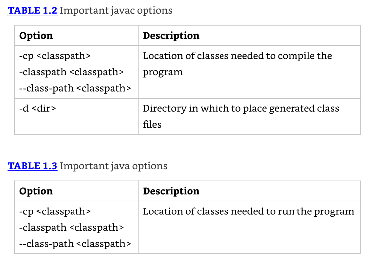
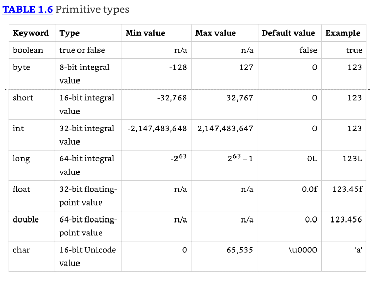
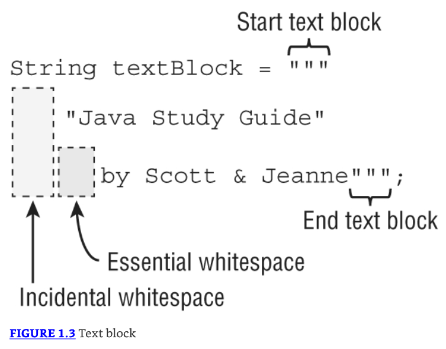
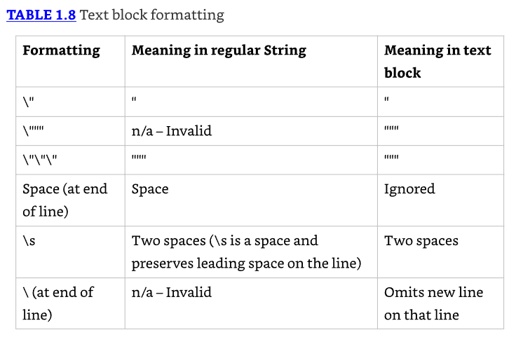

# Building Blocks

## Learning about the Environment

El Java Development Kit (JDK) contiene el software mínimo que necesitas para hacer desarrollo Java. Los comandos clave incluyen:

* javac: Convierte archivos fuente .java en `bytecode .class`
* java: Ejecuta el programa
* jar: Empaqueta archivos juntos
* javadoc: Genera documentación

* El programa javac genera instrucciones en un formato especial llamado **bytecode** que el comando java puede ejecutar. 
* Luego java lanza la Java Virtual Machine (JVM) antes de ejecutar el código. La JVM sabe cómo ejecutar bytecode en el equipo real en la que está. 
* Puedes pensar en la JVM como una caja especial en el equipo que sabe cómo ejecutar un **archivo.class** que es el resultado de compilar un **archivo.java**. 

---------------------------------------------------------------------
**Where Did the JRE Go?**

* En Java 8 y versiones anteriores, podías descargar un Java Runtime Environment (JRE) en lugar del JDK completo. 
* El JRE era un subconjunto del JDK que se usaba para ejecutar un programa, pero no podía compilar uno. 
* Ahora, las personas pueden usar el JDK completo cuando ejecutan un programa Java. 
---------------------------------------------------------------------

### Downloading a JDK

* Cada seis meses, Oracle lanza una nueva versión de Java. Java 17 salió en septiembre 2021. 
* Hay muchos JDK disponibles, el más popular de los cuales, además del JDK de Oracle, es OpenJDK.


## Understanding the Class Structure

* En programas Java, las clases (class) son los bloques de construcción básicos. 
* Cuando defines una clase, describes todas las partes y características de uno de esos bloques de construcción. 

* Para usar la mayoría de las clases, tienes que crear objetos (objects). 
* Un objeto es una instancia en tiempo de ejecución de una clase en memoria. 
* Un objeto es frecuentemente referido como una instancia, ya que representa una única representación de la clase. 
* El conjunto de todos los varios objetos de todas las diferentes clases representan el estado de tu programa. 
* Una reference es una variable que apunta a un objeto.

### Fields and Methods

* Las clases Java tienen dos elementos primarios: métodos (methods), a menudo llamados funciones y campos (fields), más generalmente conocidos como variables. 
* Juntos son llamados los miembros (members) de la clase. Las variables mantienen el estado del programa, y los métodos operan sobre ese estado. 

La clase Java más simple que puedes escribir se ve así:

```java
1: public class Animal {
2: }
```

* Java llama a una palabra con significado especial un **keyword**.
* La línea 1 incluye el keyword `public`, que permite a otras clases usarla. El keyword `class` indica que estás definiendo una clase. 
* Animal da el nombre de la clase. 

```java
1: public class Animal {
2:    String name;
3: }
```

En la línea 2, definimos una variable llamada name. También declaramos el tipo de esa variable para que sea String. 
Un `String` es un valor en el que podemos poner texto.
Luego podemos agregar methods.

```java
1: public class Animal {
2:    String name;
3:    public String getName() {
4:       return name;
5:    }
6:    public void setName(String newName) {
7:       name = newName;
8:    }
9: }
```

* En las líneas 3–5, definimos un método. Un método es una operación que puede ser llamada. 
* Nuevamente, `public` es usado para significar que este método puede ser llamado desde otras clases. 
* Luego viene el tipo de retorno, en este caso, el método retorna un String. 
* En las líneas 6–8 hay otro método. Este tiene un tipo de retorno especial llamado void. 
* El keyword `void` significa que ningún valor en absoluto es retornado. 
* Este método requiere que información sea suministrada a él desde el método que llama; esta información es llamada un `parameter`. 
* El método `setName()` tiene un parámetro llamado newName, y es de tipo String. 
* Esto significa que quien utiliza este método debería pasar un parámetro String y esperar que nada sea retornado. 
* El nombre del método y los tipos de parámetros se llaman la firma del método. 

```java
public int numberVisitors(int month) {
  return 10;
}
```

* El nombre del método es numberVisitors. 
* Hay un parámetro llamado month, que es de tipo int, el cual es un tipo numérico. 
* Por lo tanto, **la firma del método es** `numberVisitors(int)`.

### Comments

* Otra parte común del código se llama un comentario (comment). 
* Debido a que los comentarios no son código ejecutable, puedes colocarlos en muchos lugares. 
* Los comentarios pueden hacer que tu código sea más fácil de leer. 
* Hay tres tipos de comentarios en Java. El primero se llama comentario de una sola línea:

`// comment until end of line`

El compilador ignora cualquier cosa que escribas después de eso en la misma línea. 
A continuación viene el comentario multilínea:

```java
/* Multiple
 * line comment
 */
```

* Un comentario multilínea incluye cualquier cosa que comience desde el símbolo /* hasta el símbolo */. 
* A menudo escriben un asterisco (*) al comienzo de cada línea de un comentario multilínea para hacerlo más fácil de leer, pero no tienes que hacerlo. 
* Finalmente, tenemos un comentario Javadoc:

```java
/**
 * Javadoc multiple-line comment
 * @author Jeanne and Scott
 */
```

Este comentario es similar a un comentario multilínea, excepto que comienza con /**. 
Esta sintaxis especial le indica a la herramienta Javadoc que preste atención al comentario. 
Los comentarios Javadoc tienen una estructura específica que la herramienta Javadoc sabe cómo leer.

### Classes and Source Files

* La mayor parte del tiempo, cada clase Java se define en su propio archivo **.java**.
* Una clase de nivel superior (la clase asociada al nombre del archivo .java) a menudo es `public`, lo que significa que cualquier código puede llamarla. 
* Curiosamente, Java no requiere que el tipo sea public. Por ejemplo, esta clase está bien:

```java
1: class Animal {
2:    String name;
3: }
```

Incluso puedes poner dos clases de nivel superior en el mismo archivo. 
Cuando lo haces, una de estas puede ser `public`. Eso significa que un archivo que contiene lo siguiente también está bien:

```java
1: public class Animal {
2:    private String name;
3: }
4: class Animal2 {}
```

Cuando una clase tiene un tipo `public`, necesita que coincida con el nombre del archivo. 

## Writing a main() Method

Un programa Java comienza la ejecución con su método `main()`. 
El método `main()` a menudo se llama un punto de entrada al programa, porque es el punto de inicio que la JVM busca cuando comienza a ejecutar un nuevo programa.

### Creating a main() Method

El método main() permite que la JVM llame a nuestro código. La clase más simple posible con un método main() se ve así:

```java
1: public class Zoo {
2:    public static void main(String[] args) {
3:    System.out.println("Hello World");
4:    }
5: }
```

Para compilar código Java con el comando `javac`, el archivo debe tener la extensión **.java**. 
El nombre del archivo debe coincidir con el nombre de la clase public. 
El resultado es un archivo de bytecode con el mismo nombre pero con una extensión de nombre de archivo **.class**. 
Recuerda que el bytecode consiste en instrucciones que la JVM sabe cómo ejecutar.

Las reglas para lo que un archivo Java contiene, y en qué orden, son más detalladas de lo que hemos explicado hasta ahora (hay más sobre este tema más adelante en el capítulo). 
Para mantener las cosas simples por ahora, seguimos este subconjunto de las reglas:
* Cada archivo puede contener solo una clase public.
* El nombre del archivo debe coincidir con el nombre de la clase, incluyendo mayúsculas y minúsculas, y tener una extensión .**java**.
* Si la clase Java es un punto de entrada para el programa, debe contener un método `main()` válido.

* Primero revisemos las palabras en la firma del método `main()`, una a la vez. 
* La palabra clave `public` es lo que se llama un **access modifier**. 
* Declara el nivel de exposición de este método a los llamadores potenciales en el programa. 
* Naturalmente, public significa acceso completo desde cualquier lugar en el programa.
* La palabra clave `static` vincula un método a su clase para que pueda ser llamado solo por el nombre de la clase, como en, por ejemplo, `Zoo.main()`. 
* Java no necesita crear un objeto para llamar al método main() lo cual es bueno, ya que aún no has aprendido sobre crear objetos. 
* De hecho, la JVM hace esto, más o menos, cuando carga el nombre de la clase dado a ella. 
* Si un método main() no tiene las palabras clave correctas, obtendrás un error tratando de ejecutarlo.

* La palabra clave `void` representa el tipo de retorno (return type). 
* Un método que no devuelve datos retorna el control al invocador silenciosamente. 
* En general, es una buena práctica usar void para métodos que cambian el estado de un objeto. 
* En ese sentido, el método main() cambia el estado del programa de iniciado ha finalizado.
* Finalmente, llegamos a la lista de parámetros del método main(), representada como un array de objetos `java.lang.String`. 
* Puedes usar cualquier nombre de variable válido junto con cualquiera de estos tres formatos:

```java
String[] args
String options[]
String... friends
```

* El compilador acepta cualquiera de estos. 
* El nombre de variable `args` es común porque sugiere que esta lista contiene valores que fueron leídos (argumentos) cuando la JVM se inició. 
* Los caracteres `[]` son corchetes y representan un array. Un **array** es una lista de tamaño fijo de elementos que son todos del mismo tipo. 
* Los caracteres `...` se llaman varargs (listas de argumentos variables). 

### Passing Parameters to a Java Program

Veamos cómo enviar datos al método main() de nuestro programa. Primero, modificamos el programa Zoo para imprimir los primeros dos argumentos pasados:

```java
public class Zoo {
    public static void main(String[] args) {
        System.out.println(args[0]);
        System.out.println(args[1]);
    }
}
```

El código `args[0]` accede al primer elemento del array. Eso es correcto: los índices de array comienzan con 0 en Java. Para ejecutarlo, escribe esto:

```java
javac Zoo.java
java Zoo Bronx Zoo
```

* El programa identifica correctamente las primeras dos "palabras" como los argumentos. 
* Los espacios se usan para separar los argumentos. Si quieres espacios dentro de un argumento, necesitas usar comillas como en este ejemplo:

```java
javac Zoo.java
java Zoo "San Diego" Zoo
```

Ahora tenemos un espacio en la salida:

```
San Diego
Zoo
```

Finalmente, ¿qué sucede si no pasas suficientes argumentos?

```java
javac Zoo.java
java Zoo Zoo
```

Se lee bien `args[0]`, y Zoo se imprime. Luego Java entra en pánico. ¡No hay un segundo argumento! 
¿Qué hacer? Java imprime una excepción diciéndote que no tiene idea qué hacer con este argumento en la posición 1. 

```java
Zoo
Exception in thread "main" java.lang.ArrayIndexOutOfBoundsException: Index 1 out of bounds for length 1
    at Zoo.main(Zoo.java:4)
```

## Understanding Package Declarations and Imports

Java pone las clases en packages (carpetas para manejar un orden). Estas son agrupaciones lógicas para las clases.
Supón que intentas compilar este código:

```java
public class NumberPicker {
  public static void main(String[] args) {
    Random r = new Random(); // DOES NOT COMPILE
    System.out.println(r.nextInt(10));
  }
}
```

El compilador Java útilmente te da un error que se ve así: `error: cannot find symbol`

La causa de este error es omitir una declaración (statement) `import`, la cual le dice a Java donde buscar la clase `Random`.

```java
import java.util.Random; // import tells us where to find Random
public class NumberPicker {
  public static void main(String[] args) {
    Random r = new Random();
    System.out.println(r.nextInt(10)); // a number 0-9
  }
}
```

Ahora el código se ejecuta; imprime un número aleatorio entre 0 y 9. Igual que los arrays, a Java le gusta comenzar a contar con 0.

### Packages

* Los paquetes al agrupar clases tienen la característica de ser jerárquicos, por ejemplo si empieza con java. 
* Esto significa que vino del JDK si usa otro nombre por lo general denota de qué aplicación viene por ejemplo com.wiley.java.book

### Wildcards

Las clases en el mismo paquete son frecuentemente importadas juntas. Puedes importar todas las clases de un paquete usando *

```java
import java.util.*; // imports java.util.Random among other things
public class NumberPicker {
  public static void main(String[] args) {
    Random r = new Random();
    System.out.println(r.nextInt(10));
  }
}
```

* Cada clase en el paquete java.util está disponible para este programa cuando Java lo compila. 
* La declaración import no trae paquetes hijos, campos, o métodos; importa solo clases directamente bajo el paquete definido con el wildcard. 

Digamos que querías usar la clase `AtomicInteger` del paquete `java.util.concurrent.atomic`. ¿Qué import o imports soportan esto?

```java
import java.util.*;
import java.util.concurrent.*;
import java.util.concurrent.atomic.*;
```

Solo el último import permite que la clase sea reconocida porque los paquetes hijos no están incluidos con los primeros dos.

* Podrías pensar que incluir tantas clases ralentiza la ejecución de tu programa, pero no es así. El compilador determina qué se necesita realmente.
* Listar las clases usadas hace el código más fácil de leer, especialmente para nuevos programadores. 
* Usar el wildcard puede acortar la lista de import. Verás ambos enfoques en el examen.

### Redundant Imports

* Hay un paquete especial en el mundo Java llamado `java.lang`. Este paquete es especial, ya que se importa automáticamente. 
* Puedes escribir este paquete en una declaración import, pero no tienes que hacerlo. 
* En el siguiente código, ¿cuántos de los imports crees que son redundantes?

```java
1: import java.lang.System;
2: import java.lang.*;
3: import java.util.Random;
4: import java.util.*;
5: public class NumberPicker {
6:   public static void main(String[] args) {
7:     Random r = new Random();
8:     System.out.println(r.nextInt(10));
9:   }
10: }
```

* La respuesta es que tres de los imports son redundantes. Las líneas 1 y 2 son redundantes porque todo en `java.lang` se importa automáticamente. 
* La línea 4 también es redundante en este ejemplo porque Random ya se importó desde `java.util.Random`. 
* Si la línea 3 no estuviera presente, `java.util.*` no sería redundante.

* Echemos un vistazo a un ejemplo más para asegurarnos de que entiendes los casos límite para imports. 
* Para este ejemplo, Files y Paths están ambos en el paquete `java.nio.file`. 
* ¿Qué declaraciones import crees que funcionarían para compilar este código?

```java
public class InputImports {
  public void read(Files files) {
    Paths.get("name");
  }
}
```

Hay dos respuestas posibles. La más corta es usar un wildcard para importar ambas al mismo tiempo.

`import java.nio.file.*;`

La otra respuesta es importar ambas clases explícitamente.

```java
import java.nio.file.Files;
import java.nio.file.Paths;
```

Ahora consideremos algunos imports que no funcionan.

```java
import java.nio.*;     // NO GOOD - a wildcard only matches class names, not "file.Files"

import java.nio.*.*;   // NO GOOD - you can only have one wildcar and it must be at the end

import java.nio.file.Paths.*; // NO GOOD - you cannot import methods only class names
```

### Naming Conflicts

* Una de las razones para usar paquetes es para que los nombres de clase no tengan que ser únicos en todo Java. 
* Esto significa que a veces querrás importar una clase que puede encontrarse en múltiples lugares. 

* Un ejemplo común de esto es la clase Date. Java proporciona implementaciones de `java.util.Date` y `java.sql.Date`. 
* ¿Qué declaración import podemos usar si queremos la versión `java.util.Date`?

* La respuesta debería ser fácil ahora. Puedes escribir ya sea `import java.util.*;` o `import java.util.Date;`. 
* Los casos difíciles surgen cuando otros imports están presentes.

```java
import java.util.*;
import java.sql.*; // causes Date declaration to not compile
```

* Cuando el nombre de clase se encuentra en múltiples paquetes, Java te da un error de compilador. 
* En nuestro ejemplo, la solución fácil es eliminar el import `java.sql.*` que no necesitamos. 
* ¿Pero qué hacemos si necesitamos un montón entero de otras clases en el paquete java.sql?

```java
import java.util.Date;
import java.sql.*;
```

* Si importas explícitamente un nombre de clase, toma precedencia sobre cualquier wildcard presente. 
* Java piensa, "El programador realmente quiere que asuma el uso de la clase `java.util.Date`"

---------------------------------------------------------------------
**If You Really Need to Use Two Classes with the Same Name**

A veces realmente quieres usar Date de dos paquetes diferentes. 
Cuando esto sucede, puedes elegir uno para usar en la declaración import y usar el nombre de clase completamente calificado (fully qualified class name) del otro. 
O puedes eliminar ambas declaraciones import y siempre usar el nombre de clase completamente calificado.

```java
public class Conflicts {
  java.util.Date date;
  java.sql.Date sqlDate;
}
```
---------------------------------------------------------------------

### Creating a New Package

* Hasta ahora, todo el código que hemos escrito en este capítulo ha estado en el **default package**. 
* Este es un paquete especial sin nombre que solo deberías usar para código desechable. 
* Puedes decir que el código está en el paquete por defecto porque no hay nombre de paquete. 
* En el examen, verás el paquete por defecto usado mucho para ahorrar espacio en los listados de código. 
* En la vida real, siempre nombra tus paquetes para evitar conflictos de nombres y para permitir que otros reutilicen tu código.

* Ahora es momento de crear un nuevo paquete. La estructura de directorios en tu computadora está relacionada con el nombre del paquete. 
* Supón que tenemos estas dos clases:

```java
package packagea;
public class ClassA {}

package packageb;
import packagea.ClassA;
public class ClassB {
    public static void main(String[] args) {
        ClassA a;
        System.out.println("Got it");
    }
}
```

* Cuando ejecutas un programa, Java sabe dónde buscar esos nombres de paquete. 
* En este caso, ejecutar desde `C:\temp` funciona porque tanto `packagea` como `packageb` están debajo de él.

### Compiling and Running Code with Packages

* El primer paso es crear los dos archivos de la sección anterior, la tabla 1.1 muestra los nombres de archivo. 


* Ahora es momento de compilar el código. Afortunadamente, esto es lo mismo sin importar el sistema operativo. 
* Para compilar, escribe el siguiente comando:

`javac packagea/ClassA.java packageb/ClassB.java`

Si el comando funciona, dos nuevos archivos serán creados: **packagea/ClassA.class** y **packageb/ClassB.class**

Ahora que tu código ha compilado, puedes ejecutarlo escribiendo el siguiente comando:

`java packageb.ClassB`

* Si funciona, verás **Got it** impreso. 
* Podrías haber notado que escribimos `ClassB` en lugar de `ClassB.class`.  
* Como se discutió anteriormente, no pasas la extensión cuando ejecutas un programa. 

### Compiling to Another Directory

* Por defecto, el comando javac coloca las clases compiladas en el mismo directorio que el código fuente. 
* También proporciona una opción para colocar los archivos de clase en un directorio diferente. 
* La opción `-d` especifica este directorio objetivo.

Si estás siguiendo el ejemplo, elimina los archivos ClassA.class y ClassB.class que fueron creados en la sección anterior. 

¿Dónde crees que este comando creará el archivo ClassA.class?

`javac -d classes packagea/ClassA.java packageb/ClassB.java`

La respuesta correcta está en `classes/packagea/ClassA.class`. La estructura de paquete se preserva bajo el directorio objetivo solicitado. 

* Para ejecutar el programa, especificas el classpath para que Java sepa dónde encontrar las clases. 
* Hay tres opciones que puedes usar. Las tres hacen lo mismo:

```java
java -cp classes packageb.ClassB
java -classpath classes packageb.ClassB
java --class-path classes packageb.ClassB
```



### Compiling with JAR Files

* Tal como el directorio **classes** en el ejemplo anterior, también puedes especificar la ubicación de los otros archivos explícitamente usando un classpath. 
* Esta técnica es útil cuando los archivos con las clases están ubicados en otro lugar o en archivos JAR especiales. 
* Un Java archive (JAR) es como un archivo ZIP de principalmente archivos de clase Java.

En Windows, escribes lo siguiente:

`java -cp ".;C:\temp\someOtherLocation;c:\temp\myJar.jar" myPackage.MyClass`

Y en macOS/Linux, escribes esto:

`java -cp ".:/tmp/someOtherLocation:/tmp/myJar.jar" myPackage.MyClass`

* El punto (.) indica que quieres incluir el directorio actual en el classpath. 
* El resto del comando dice buscar archivos de clase sueltos (o paquetes) en **someOtherLocation** y dentro de **myJar.jar**. 
* Windows usa el (;) para separar partes del classpath; otros sistemas operativos usan (:).

Igual que cuando estás compilando, puedes usar un wildcard (*) para coincidir con todos los JARs en un directorio. Aquí hay un ejemplo:

`java -cp "C:\temp\directoryWithJars\*" myPackage.MyClass`

* Este comando agregará al classpath todos los JARs que están en **directoryWithJars**. 
* No incluirá ningún JAR en el classpath que esté en un subdirectorio de **directoryWithJars**.

### Creating a JAR File

* Puedes crear un archivo JAR tú mismo. Para hacerlo, usas el comando jar. 
* Los comandos más simples crean un jar conteniendo los archivos en el directorio actual. 
* Puedes usar la forma corta o larga para cada opción.

```java
jar -cvf myNewFile.jar .
jar --create --verbose --file myNewFile.jar .
```

Alternativamente, puedes especificar un directorio en lugar de usar el directorio actual.

`jar -cvf myNewFile.jar -C dir .`

Table 1.4 lista las opciones que necesitas usar el comando jar para crear un archivo JAR. 


Ahora que has visto las partes más comunes de una clase, echemos un vistazo al orden correcto para escribirlas en un archivo. 
Los comentarios pueden ir en cualquier lugar del código. Pero el orden de la siguiente tabla debe ser memorizado para el examen.

| Elemento                              | Ejemplo               | Requerido | Donde debe ir                                                           |
|---------------------------------------|-----------------------|-----------|-------------------------------------------------------------------------|
| Declaración de paquete                | `package abc; `       | No        | Primera línea en el archivo (excluyendo comentarios o líneas en blanco) |
| Declaraciones import                  | `import java.util.*;` | No        | Inmediatamente después del paquete (si está presente)                   |
| Declaración de tipo de nivel superior | `public class C  `    | Sí        | Inmediatamente después del import (si hay alguno)                       |
| Declaraciones de campos               | `int value;`          | No        | Cualquier elemento de nivel superior dentro de una clase                |
| Declaraciones de métodos              | `void method()`       | No        | Cualquier elemento de nivel superior dentro de una clase                |


Veamos algunos ejemplos para ayudarte a recordar esto. El primer ejemplo contiene uno de cada elemento:

```java
package structure;  // package must be first non-comment
import java.util.*;  // import must come after package
public class Meerkat { // then comes the class
  double weight;  // fields and methods can go in either order
  public double getWeight() {
    return weight; 
  }
  double height;  // another field - they don't need to be together
}
```

Hasta ahora, todo bien. Este es un patrón común con el que deberías estar familiarizado. ¿Qué tal este?

```java
/* header */

package structure;

// class Meerkat
public class Meerkat { }
```

* Todavía bien. Podemos poner comentarios en cualquier lugar, las líneas en blanco son ignoradas, y los imports son opcionales. 
* En el siguiente ejemplo, tenemos un problema:

```java
import java.util.*;
package structure;  // DOES NOT COMPILE
String name;      // DOES NOT COMPILE
public class Meerkat { } // DOES NOT COMPILE
```

* Hay dos problemas aquí. Uno es que las declaraciones package e import están invertidas. 
* Aunque ambas son opcionales, package debe venir antes de import si está presente. 
* El otro problema es que un field intenta una declaración fuera de una clase. 
* Esto no está permitido. Los fields y métodos deben estar dentro de una clase.

## Creating Objects

* Recuerda que un objeto es una instancia de una clase. 
* En las siguientes secciones, examinamos constructores, object fields, instance initializers, y el orden en el cual los valores son inicializados.

### Calling Constructors

Para crear una instancia de una clase, todo lo que tienes que hacer es escribir `new` antes del nombre de la clase y agregar paréntesis después de él. 

`Park p = new Park();`

Hay que ver que `Park()` se le denomina un método constructor, que es un tipo especial de método que crea un nuevo objeto. 

```java
public class Chick {
   public Chick() {
      System.out.println("in constructor");
   }
}
```

Hay dos puntos clave a notar sobre el constructor: el nombre del constructor coincide con el nombre de la clase, y no hay tipo de retorno. 

---------------------------------------------------------------------
Puedes ver un método como este en el examen:

```java
public class Chick {
    public void Chick() {} // NOT A CONSTRUCTOR
}
```

Cuando veas un nombre de método que tiene el nombre de la clase y tiene un tipo de retorno, presta especial atención. 
No es un constructor, ya que tiene un tipo de retorno. Es un método regular que compila, pero no será llamado cuando escribas `new Chick()`.
---------------------------------------------------------------------

* El propósito de un constructor es inicializar campos, aunque puedes poner cualquier código allí. 
* Otra forma de inicializar campos es hacerlo directamente en la línea en la que se declaran. Este ejemplo muestra ambos enfoques:

```java
public class Chicken {
    int numEggs = 12; // initialize on line
    String name;
    
    public Chicken() {
        name = "Duke"; // initialize in constructor
    }
}
```

Para la mayoría de las clases, no tienes que codificar un constructor el compilador te suministra un constructor predeterminado que «no hace nada». 

### Reading and Writing Member Fields

Es posible leer y escribir variables de instancia directamente desde donde se invocan el objeto.

```java
public class Swan {
    int numberEggs; // instance variable
    
    public static void main(String[] args) {
        Swan mother = new Swan();
        mother.numberEggs = 1;    // set variable
        System.out.println(mother.numberEggs); // read variable
    }
}
```

El "caller" en este caso es el método main(), el cual podría estar en la misma clase o en otra clase. 
Esta clase establece numberEggs a 1 y luego lee numberEggs directamente para imprimirlo. 

Incluso puedes leer valores de campos ya inicializados en una línea, inicializando un nuevo campo:

```java
1: public class Name {
2:   String first = "Theodore";
3:   String last = "Moose";
4:   String full = first + last;
5: }
```

Las líneas 2 y 3 ambas escriben un campo. La línea 4 tanto lee como escribe datos. Lee los campos first y last. Luego escribe el campo full.

### Executing Instance Initializer Blocks

* Cuando aprendiste sobre métodos, viste llaves ({}). El código entre las llaves se le denomina un bloque de código (code block). 
* A veces los bloques de código están dentro de un método. Estos se ejecutan cuando el método es llamado. 
* Otras veces, los bloques de código aparecen fuera de un método. Estos se llaman inicializadores de instancia (instance initializers). 
  * Su propósito principal es ejecutar código de inicialización cada vez que se crea una nueva instancia (objeto) de la clase.

¿Cuántos bloques ves en el siguiente ejemplo? ¿Cuántos instance initializers ves?

```java
1: public class Bird {
2:   public static void main(String[] args) {
3:     { System.out.println("Feathers"); }
4:   }
5:   { System.out.println("Snowy"); }
6: }
```

* Hay cuatro bloques de código en este ejemplo: una definición de clase, una declaración de método, un bloque interno, y un instance initializer.
* Contar bloques de código es fácil: solo cuentas el número de pares de llaves. 
* Si no hay el mismo número de llaves abiertas `({)` y cerradas `(})` o no están definidas en el orden apropiado, el código no compila.

* Cuando estás contando instance initializers, ten en mente que no pueden existir dentro de un método. 
* La línea 5 es un instance initializer, con sus llaves fuera de un método. 
* Por otro lado, la línea 3 no es un instance initializer, ya que solo se llama cuando el método main() es ejecutado.
* Hay un conjunto adicional de llaves en las líneas 1 y 6 que constituyen la declaración de clase.

### Following the Order of Initialization

Cuando escribes código que inicializa campos en múltiples lugares, tienes que llevar el registro del orden de inicialización. 
Este es simplemente el orden en el cual diferentes métodos, constructores, o bloques son llamados cuando una instancia de la clase es creada. 

Los campos y bloques instance initializer se ejecutan en el orden en el cual aparecen en el archivo.
El constructor se ejecuta después de que todos los fields y bloques instance initializer hayan sido ejecutados.

```java
1: public class Chick {
2:   private String name = "Fluffy";
3:   { System.out.println("setting field"); }
4:   public Chick() {
5:     name = "Tiny";
6:     System.out.println("setting constructor");
7:   }
8:   public static void main(String[] args) {
9:     Chick chick = new Chick();
10:    System.out.println(chick.name);} }
```

Ejecutar este ejemplo imprime esto:

```java
setting field
setting constructor
Tiny
```

* Veamos qué está sucediendo aquí. Comenzamos con el método main() porque ahí es donde Java inicia la ejecución. 
* En la línea 9, llamamos al constructor de Chick. Java crea un nuevo objeto. 
* Primero inicializa name a "Fluffy" en la línea 2. 
* Luego ejecuta la declaración println() en el instance initializer en la línea 3. 
* Una vez que todos los fields e instance initializers han sido ejecutados, Java retorna al constructor. 
* La línea 5 cambia el valor de `name` a "Tiny", y la línea 6 imprime otra declaración. 
* En este punto, el constructor está terminado, y luego la ejecución regresa a la declaración println() en la línea 10.

El orden importa para los fields y bloques de código. No puedes referirte a una variable antes de que haya sido definida:

```java
{ System.out.println(name); } // DOES NOT COMPILE
private String name = "Fluffy";
```

## Understanding Data Types

Las aplicaciones Java contienen dos tipos de datos: **primitive types** y **reference types**. 
En esta sección, discutimos las diferencias entre un primitive type y un reference type.

### Using Primitive Types

* Java tiene ocho tipos de datos incorporados, referidos como los **primitive types** de Java. 
* Estos ocho tipos de datos representan los bloques de construcción para objetos Java, porque todos los objetos Java son simplemente una colección compleja de estos tipos de datos primitivos. 
* Dicho esto, un primitivo no es un objeto en Java, ni representa un objeto. 
* Un primitivo es simplemente un único valor en memoria, tal como un número o carácter.

### The Primitive Types

* El examen asume que estás bien versado en los ocho tipos de datos primitivos, sus tamaños relativos, y qué puede almacenarse en ellos. 
* Table 1.6 muestra los tipos primitivos Java junto con su tamaño en bits y el rango de valores que cada uno almacena.



* Los tipos byte, short, int, y long se usan para valores enteros sin puntos decimales.
* Cada tipo numérico usa el doble de bits que el tipo similar más pequeño. Por ejemplo, short usa el doble de bits que byte.
* Todos los tipos numéricos están firmados y reservan uno de sus bits para cubrir un rango negativo. 
  * Por ejemplo, en lugar de que byte cubra 0 a 255 (o incluso 1 a 256) en realidad cubre -128 a 127.
* Un float requiere la letra f o F después del número para que Java sepa que es un float. 
  * Sin una f o F, Java interpreta un valor decimal como un double.
* Un long requiere la letra l o L después del número para que Java sepa que es un long. 
  * Sin una l o L, Java interpreta un número sin punto decimal como un int en la mayoría de escenarios.

---------------------------------------------------------------------
**Signed and Unsigned: short and char**

Para el examen, deberías estar consciente de que short y char están estrechamente relacionados, ya que ambos se almacenan como tipos integrales con la misma longitud de 16 bits. 
La diferencia primaria es que short está signed, lo que significa que divide su rango entre los enteros positivos y negativos. 
Alternativamente, char es unsigned, lo que significa que su rango es estrictamente positivo, incluyendo 0.
---------------------------------------------------------------------

### Writing Literals

* Hay algunas cosas más que deberías saber sobre primitivos numéricos. Cuando un número está presente en el código, se llama un literal. 
* Por defecto, Java asume que estás definiendo un valor int con un literal numérico. 
* En el siguiente ejemplo, el número listado es más grande de lo que cabe en un int.

`long max = 3123456789; // DOES NOT COMPILE`

Java se queja de que el número está fuera de rango. Y lo está para un int. Sin embargo, no tenemos un int. La solución es agregar el carácter `L` al número:

`long max = 3123456789L; // Now Java knows it is a long`

Alternativamente, podrías agregar una l minúscula al número. Pero please usa la L mayúscula. La l minúscula se ve como el número 1.

### Literals and the Underscore Character

Lo último que necesitas saber sobre literales numéricos es que puedes tener guiones bajos en números para hacerlos más fáciles de leer:

```java
int million1 = 1000000;
int million2 = 1_000_000;
```

* Preferiríamos estar leyendo el último porque los ceros no se juntan. 
* Puedes agregar guiones bajos en cualquier lugar excepto al inicio de un literal, el final de un literal, justo antes de un punto decimal, o justo después de un punto decimal. 
* Incluso puedes colocar múltiples caracteres de guion bajo uno al lado del otro, aunque no se recomienda.

```java
double notAtStart = _1000.00;      // DOES NOT COMPILE
double notAtEnd = 1000.00_;        // DOES NOT COMPILE
double notByDecimal = 1000_.00;    // DOES NOT COMPILE
double annoyingButLegal = 1_00_0.0_0; // Ugly, but compiles
double reallyUgly = 1__________2;  // Also compiles
```

### Using Reference Types

* Un reference type se refiere a un objeto (una instancia de una clase). 
* A diferencia de los tipos primitivos que mantienen sus valores en la memoria donde la variable está asignada, las referencias no mantienen el valor del objeto al que se refieren. 
* En su lugar, una referencia "apunta" a un objeto almacenando la dirección de memoria donde el objeto está ubicado, un concepto referido como un puntero. 
* A diferencia de otros lenguajes, Java no te permite aprender cuál es la dirección de memoria física. Solo puedes usar la referencia para referirte al objeto.

Echemos un vistazo a algunos ejemplos que declaran e inicializan reference types. Supón que declaramos una referencia de tipo String:

`String greeting;`

La variable greeting es una referencia que solo puede apuntar a un objeto String. Un valor se asigna a una referencia en una de dos maneras:

* Una referencia puede ser asignada a otro objeto del mismo tipo o compatible.
* Una referencia puede ser asignada a un nuevo objeto usando la palabra clave new.

Por ejemplo, la siguiente declaración asigna esta referencia a un nuevo objeto:

`greeting = new String("How are you");`

* La referencia greeting apunta a un nuevo objeto String, "How are you". 
* El objeto String no tiene un nombre y solo puede ser accedido vía una referencia correspondiente.

### Distinguishing between Primitives and Reference Types

* Hay algunas diferencias importantes que deberías conocer entre primitivos y reference types. 
* Primero, nota que todos los tipos primitivos tienen nombres de tipo en minúsculas. 
* Todas las clases que vienen con Java comienzan con mayúscula. 
* Aunque no es requerido, es una práctica estándar, y deberías seguir esta convención para las clases que crees también.

* Luego, los reference types pueden ser usados para llamar métodos, asumiendo que la referencia no es null. 
* Los primitivos no tienen métodos declarados en ellos. 
* En este ejemplo, podemos llamar un método en reference, ya que es de un reference type. 
* Puedes decir que length es un método porque tiene () después de él. Ve si puedes entender por qué el siguiente fragmento no compila: 

```java
4: String reference = "hello";
5: int len = reference.length();
6: int bad = len.length(); // DOES NOT COMPILE
```

La línea 6 es un sinsentido. No existen métodos en `len` porque es un primitivo int. Los primitivos no tienen métodos. 

* Finalmente, los reference types pueden ser asignados null, lo que significa que actualmente no se refieren a un objeto. 
* Los tipos primitivos te darán un error de compilador si intentas asignarles null. 

```java
int value = null; // DOES NOT COMPILE
String name = null;
```

### Creating Wrapper Classes

* Cada tipo primitivo tiene una clase wrapper, que es un tipo objeto que corresponde al primitivo. 
* Table 1.7 lista todas las clases wrapper junto con cómo crearlas.


También hay una variante valueOf() que convierte un String en la clase wrapper. Por ejemplo:

```java
int primitive = Integer.parseInt("123");
Integer wrapper = Integer.valueOf("123");
```

La primera línea convierte un String a un primitivo int. La segunda convierte un String a una clase wrapper Integer.

* Todas las clases numéricas en Table 1.7 extienden la clase Number, lo que significa que todas vienen con algunos métodos auxiliares útiles: byteValue(), shortValue(), intValue(), longValue(), floatValue(), y doubleValue(). Las clases wrapper Boolean y Character incluyen booleanValue() y charValue(), respectivamente.
* Como probablemente adivinaste, estos métodos devuelven el valor primitivo de una instancia wrapper, en el tipo solicitado.

```java
Double apple = Double.valueOf("200.99");
System.out.println(apple.byteValue()); // -56
System.out.println(apple.intValue()); // 200
System.out.println(apple.doubleValue()); // 200.99
```

Estos métodos auxiliares hacen su mejor esfuerzo para convertir valores, pero pueden resultar en una pérdida de precisión. 
En el primer ejemplo, no hay 200 en byte, así que se envuelve alrededor a -56. 
En el segundo ejemplo, el valor se trunca, lo que significa que todos los números después del decimal se eliminan. 

### Defining Text Blocks

* Anteriormente, vimos un String simple con el valor "hello". 
* ¿Qué pasa si queremos tener un String con algo más complicado? Por ejemplo, averigüemos cómo crear un String con este valor:

"Java Study Guide"
 by Scott & Jeanne

* La sintaxis `\"` te permite decir que quieres un `"` en lugar de terminar el String, y `\n` dice que quieres una nueva línea. 
* Ambos se llaman escape characters porque la barra invertida proporciona un significado especial. Con estas dos nuevas habilidades, podemos escribir:

`String eyeTest = "\"Java Study Guide\"\n by Scott & Jeanne";`

* Aunque esto funciona, es difícil de leer. Afortunadamente, Java tiene text blocks, también conocidos como multiline strings. 
* Ve Figure 1.3 para el equivalente de text block.



Un text block comienza y termina con tres comillas dobles `(""")`, y el contenido no necesita ser escapado. 
Esto es mucho más fácil de leer. 

* Podrías haber notado las palabras **incidental** y **essential whitespace** en la figura. 
* ¿Qué es eso? essential whitespace es parte de tu String y es importante para ti. 
* Los incidental whitespace simplemente sucede estar ahí para hacer el código más fácil de leer. 
* Puedes reformatear tu código y cambiar la cantidad de incidental whitespace sin ningún impacto en tu valor String.

Intentemos un ejemplo. Cuántas líneas produce este output, y cuántos caracteres incidental y essential whitespace comienzan cada línea.

```java
14: String pyramid = """
15:   *
16:  **
17: ***
18: """;
19: System.out.print(pyramid);
```

* Hay cuatro líneas de output. Las líneas 15–17 tienen estrellas. La línea 18 es una línea sin ningún carácter. 
* El triple `"""` de cierre habría necesitado estar en la línea 17 si no quisiéramos esa línea en blanco. No hay caracteres incidental whitespace.  
* El `"""` de cierre en la línea 18 son los caracteres más a la izquierda, entonces la línea se dibuja en la posición más a la izquierda. 
* La línea 15 tiene dos essential whitespace caracteres para comenzar la línea, y la línea 16 tiene uno. 

La Table 1.8 muestra algunas secuencias de formateo especiales y compara cómo funcionan en un String regular y un text block.



Intentemos algunos ejemplos. ¿Primero, ves por qué este no compila?

`String block = """doe"""; // DOES NOT COMPILE`

Los text blocks requieren un salto de línea después del """ de apertura, haciendo este inválido. 

Ahora intentemos uno válido. ¿Cuántas líneas crees que hay en este text block?

```java
String block = """
  doe \
  deer""";
```

Solo una. El output es `doe deer` ya que el `\` le dice a Java que no agregue una nueva línea antes de deer. 

Intentemos determinar el número de líneas en otro text block:

```java
String block = """
  doe \n
  deer
  """;
```

* Esta vez tenemos cuatro líneas. Ya que el text block tiene el `"""` de cierre en una línea separada. 
* Tenemos tres líneas para las líneas en el text block más el `\n` explícito. 

Intentemos uno más. ¿Qué crees que esto produce?

```java
String block = """
  "doe\"\"\"
  \"deer\"""
        """;
System.out.print("*"+ block + "*");
```

La respuesta es: 

```java
*"doe"""
"deer"""
*
```

* Todos los `\"` escapan el `"`. Hay un espacio de essential whitespace en el doe y las líneas deer. 
* Todo el otro leading whitespace es incidental whitespace.

## Declaring Variables

* Una variable es un nombre para una pieza de memoria que almacena datos. 
* Cuando declaras una variable, necesitas establecer el tipo de variable junto con darle un nombre. 
* Dar a una variable un valor se llama initializing una variable. 

`String zooName = "The Best Zoo";`

En las siguientes secciones, examinamos cómo definir variables apropiadamente en una o múltiples líneas.

### Identifying Identifiers

* Probablemente, no te sorprende que Java tenga reglas precisas sobre nombres de identificadores. 
* Un **identifier** es el nombre de una variable, método, clase, interfaz, o paquete. 
* Afortunadamente, las reglas para identificadores para variables se aplican a todos los otros tipos que eres libre de nombrar.

Solo hay cuatro reglas para recordar para identificadores legales:

* Los identificadores deben comenzar con una letra, un símbolo de moneda, o un símbolo _. 
  * Los símbolos de moneda incluyen dólar ($), yuan (¥), euro (€), y así sucesivamente.
* Los identificadores pueden incluir números pero no comenzar con ellos.
* Un único guion bajo _ no está permitido como identificador.
* No puedes usar el mismo nombre que una palabra reservada de Java. Una palabra reservada (reserved word) es una palabra especial que Java ha apartado para que no estés permitido usarla. 
  * Recuerda que Java distingue mayúsculas de minúsculas, entonces puedes usar versiones de las palabras clave que solo difieren en mayúsculas. 

Hay otros nombres que no puedes usar. Por ejemplo, true, false, y null son valores literales, entonces no pueden ser nombres de variables. 

Ejemplo correctos: 

```java
long okidentifier;
float $OK2Identifier;
boolean _alsoOK1d3ntifi3r;
char __$StillOkbutKnotsonice$;
```

Ejemplos incorrectos:

```java
int 3DPointClass; // identifiers cannot begin with a number
byte hollywood@vine; // @ is not a letter, digit, $ or _
String *$coffee; // * is not a letter, digit, $ or __
double public; // public is a reserved word
short _; // a single underscore is not allowed
```

---------------------------------------------------------------------
**camelCase and snake_case**

Java tiene convenciones para que el código sea legible y consistente. 

* Por ejemplo, camelCase tiene la primera letra de cada palabra capitalizada. 
  * Los nombres de métodos y variables se escriben típicamente en camelCase con la primera letra en minúscula, como toUpper(). 
  * Los nombres de clase e interfaz también se escriben en camelCase, con la primera letra en mayúscula, como ArrayList.

* Otro estilo se llama snake_case. Simplemente, usa un guion bajo (_) para separar palabras. 
  * Java generalmente usa snake_case en mayúsculas para constantes y valores enum, como NUMBER_FLAGS.
---------------------------------------------------------------------

### Declaring Multiple Variables

* También puedes declarar e inicializar múltiples variables en la misma declaración. 
* Cuántas variables crees que se declaran e inicializan en el siguiente ejemplo:

```java
void sandFence() {
  String s1, s2;
  String s3 = "yes", s4 = "no";
}
```

* Cuatro variables String fueron declaradas: s1, s2, s3, y s4. 
* Puedes declarar muchas variables en la misma declaración siempre y cuando todas sean del mismo tipo. 
* También puedes inicializar cualquiera o todas esas variables en línea. En el ejemplo anterior, tenemos dos variables inicializadas: s3 y s4. 
* Las otras dos variables permanecen declaradas pero aún no inicializadas.

¿Cuántas variables crees que se declaran e inicializan en el siguiente código?

```java
void paintFence() {
  int i1, i2, i3 = 0;
}
```

* Como deberías esperar, tres variables fueron declaradas: i1, i2, e i3. Sin embargo, solo uno de esos valores fue inicializado: i3. 
* Los otros dos permanecen declarados pero aún no inicializados. Ese es el truco. Cada fragmento separado por una coma es una pequeña declaración propia. 
* La inicialización de i3 solo se aplica a i3. No tiene nada que ver con i1 o i2 a pesar de estar en la misma declaración. 

Otra manera en que el examen podría intentar engañarte es mostrarte código como esta línea:

`int num, String value; // DOES NOT COMPILE`

* Este código no compila porque intenta declarar múltiples variables de tipos diferentes en la misma declaración. 
* El atajo para declarar múltiples variables en la misma declaración es legal solo cuando comparten un tipo.

## Initializing Variables

* Antes de que puedas usar una variable, necesita un valor. 
* Algunos tipos de variables obtienen este valor establecido automáticamente, y otros requieren que el programador lo especifique. 
* En las siguientes secciones, examinamos las diferencias entre los valores por defecto para variables locales, de instancia, y de clase.

### Creating Local Variables

Una local variable es una variable definida dentro de un constructor, método, o bloque inicializador. 
Por simplicidad, nos enfocamos principalmente en variables locales dentro de métodos en esta sección, aunque las reglas para los otros son las mismas.

### Final Local Variables

La palabra clave `final` puede ser aplicada a variables locales y es equivalente a declarar constantes en otros lenguajes. Considera este ejemplo:

```java
5: final int y = 10;
6: int x = 20;
7: y = x + 10; // DOES NOT COMPILE
```

* Ambas variables están establecidas, pero `y` usa la palabra clave `final`. 
* Por esta razón, la línea 7 dispara un error de compilador, ya que el valor no puede ser modificado.

El modificador `final` también puede ser aplicado a referencias de variables locales. 
El siguiente ejemplo usa un objeto array `int[]`, el cual aprendes en Chapter 4.

```java
5: final int[] favoriteNumbers = new int[10];
6: favoriteNumbers[0] = 10;
7: favoriteNumbers[1] = 20;
8: favoriteNumbers = null; // DOES NOT COMPILE
```

* Nota que podemos modificar el contenido, o datos, en el array. 
* El error del compilador no es hasta la línea 8, cuando intentamos cambiar el valor de la referencia favoriteNumbers.

### Uninitialized Local Variables

* Las variables locales no tienen un valor por defecto y deben ser inicializadas antes de usarse. 
* Además, el compilador reportará un error si intentas leer un valor no inicializado. 
* Por ejemplo, el siguiente código genera un error de compilador:

```java
4: public int notValid() {
5:   int y = 10;
6:   int x;
7:   int reply = x + y; // DOES NOT COMPILE
8:   return reply;
9: }
```

La variable `y` se inicializa a 10. Por contraste, `x` no se inicializa antes de usarse en la expresión en la línea 7, y el compilador genera un error. 
El compilador es lo suficientemente inteligente para reconocer variables que han sido inicializadas después de su declaración, pero antes de que sean usadas. 

### Passing Constructor and Method Parameters

* Las variables pasadas a un constructor o método se llaman constructor parameters o method parameters, respectivamente. 
* Estos parámetros deben ser variables locales que han sido pre-inicializadas. 
* Las reglas para inicializar parámetros de constructor y método son las mismas, entonces nos enfocamos principalmente en parámetros de método.

Echa un vistazo al siguiente método checkAnswer() en la misma clase:

```java
public void checkAnswer() {
  boolean value;
  findAnswer(value); // DOES NOT COMPILE
}
```

* La llamada a findAnswer() no compila porque intenta usar una variable que no está inicializada. 
* Mientras que el llamador de un método checkAnswer() necesita estar preocupado sobre la variable siendo inicializada, una vez dentro del método findAnswer(), podemos asumir que la variable local ha sido inicializada a algún valor.

### Defining Instance and Class Variables

* Las variables que no son variables locales se definen ya sea como instance variables o como class variables. 
* Una instance variable, frecuentemente llamada un campo (field), es un valor definido dentro de una instancia específica de un objeto. 
* Digamos que tenemos una clase Person con una variable de instancia `name` de tipo String. 
* Cada instancia de la clase tendría su propio valor para `name`, como Elysia o Sarah. 
* Dos instancias podrían tener el mismo valor para `name`, pero cambiar el valor para uno no modifica el otro.

* Por otro lado, una class variable es una que se define en el nivel de clase y se comparte entre todas las instancias de la clase. 
* Incluso puede ser públicamente accesible a clases fuera de la clase y no requiere una instancia para usar. 
* En nuestro ejemplo anterior de Person, una variable de clase compartida podría usarse para representar la lista de personas en el zoológico hoy. 
* Puedes decir que una variable es una variable de clase porque tiene la palabra clave `static` antes de ella. 

* Las variables de instancia y clase no requieren que las inicialices. 
* Tan pronto como declaras estas variables, se les da un valor por defecto.
* El compilador no sabe qué valor usar y entonces quiere el valor más simple que puede dar al tipo: null para un objeto, cero para los tipos numéricos, y false para un boolean. 
* No necesitas conocer el valor por defecto para char, pero en caso de que tengas curiosidad, es '\u0000' (NUL).

### Inferring the Type with var

Tienes la opción de usar la palabra clave `var` en lugar del tipo cuando declaras variables locales bajo ciertas condiciones. 
Para usar esta característica, simplemente escribes var en lugar del tipo primitivo o de referencia. Aquí hay un ejemplo:

```java
public class Zoo {
    public void whatTypeAmI() {
        var name = "Hello";
        var size = 7;
    }
}
```

* El nombre formal de esta característica es local variable type inference. 
* Separémoslo. Primero viene local variable. Esto significa justo lo que suena. 
* Solo puedes usar esta característica para variables locales. 
* El examen puede intentar engañarte con código como este:

```java
public class VarKeyword {
  var tricky = "Hello"; // DOES NOT COMPILE
}
```

La variable tricky es una instance variable. La inferencia de tipo de variable local funciona con variables locales y no con instance variables.

### Type Inference of var

Ahora que entiendes la parte de local variable, es momento de pasar a qué significa type inference. 
La buena noticia es que esto también significa lo que suena. 
Cuando escribes var, le estás instruyendo al compilador a determinar el tipo por ti. 
El compilador mira el código en la línea de la declaración y lo usa para inferir el tipo. Echa un vistazo a este ejemplo:

```java
7: public void reassignment() {
8:   var number = 7;
9:   number = 4;
10:  number = "five"; // DOES NOT COMPILE
11: }
```

* En la línea 8, el compilador determina que queremos una variable int. 
* En la línea 9, no tenemos problema asignando un int diferente a ella. 
* En la línea 10, Java tiene un problema. Hemos pedido que asigne un String a una variable int. Esto no está permitido. 

* Por simplicidad cuando discutimos var, vamos a asumir que una declaración de variable se completa en una sola línea. 
* Podrías insertar un salto de línea entre el nombre de la variable y su valor de inicialización, como en el siguiente ejemplo:

```java
7: public void breakingDeclaration() {
8:   var silly
9:     = 1;
10: }
```

Este ejemplo es válido y compila, pero consideramos que la declaración e inicialización de silly están ocurriendo en la misma línea.

Pasemos por algunos escenarios más para que el examen no te engañe en este tema. ¿Crees que lo siguiente compila?

```java
3: public void doesThisCompile(boolean check) {
4:   var question;
5:   question = 1;
6:   var answer;
7:   if (check) {
8:     answer = 2;
9:   } else {
10:    answer = 3;
11:  }
12:  System.out.println(answer);
13: }
```

* El código no compila. Recuerda que para inferencia de tipo de variable local, el compilador solo mira la línea con la declaración. 
* Ya que `question` y `answer` no tienen valores asignados en las líneas donde están definidos, el compilador no sabe qué hacer con ellos. 
* Por esta razón, ambas líneas 4 y 6 no compilan.

* Ahora sabemos que el valor inicial usado para determinar el tipo necesita ser parte de la misma declaración. 
* ¿Puedes descifrar por qué estas dos declaraciones no compilan?

```java
4: public void twoTypes() {
5:   int a, var b = 3; // DOES NOT COMPILE
6:   var n = null;  // DOES NOT COMPILE
7: }
```

* La línea 5 no funcionaría incluso si reemplazaras var con un tipo real. 
  * Todos los tipos declarados en una sola línea deben ser del mismo tipo y compartir la misma declaración. 
  * No podríamos escribir int a, int v = 3; tampoco.

* La línea 6 es una sola línea. Se le está pidiendo al compilador que infiera el tipo de null. 
  * Esto podría ser cualquier tipo de referencia. La única elección que el compilador podría hacer es Object. 
  * Sin embargo, eso es casi con certeza no lo que el autor del código pretendía. 
  * Los diseñadores de Java decidieron que sería mejor no permitir `var` para `null` que tener que adivinar la intención.

Intentemos otro ejemplo. ¿Ves por qué esto no compila?

```java
public int addition(var a, var b) { // DOES NOT COMPILE
  return a + b;
}
```

* En este ejemplo, a y b son parámetros de método. Estos no son variables locales. 
* Estate atento a var usado con constructores, parámetros de método, o variables de instancia. 
* Recuerda que var solo se usa para inferencia de tipo de variable local

* Hay una última regla que deberías conocer: var no es una palabra reservada y está permitido usarse como identificador. 
* Se considera un nombre de tipo reservado (reserved type name) que significa que no puede usarse para definir un tipo, como una clase, interfaz, o enum. 

¿Crees que esto es legal?

```java
package var;

public class Var {
public void var() {
var var = "var";
}
public void Var() {
Var var = new Var();
}
}
```

* Lo creas o no, este código compila. Java distingue mayúsculas de minúsculas, entonces Var no introduce ningún conflicto como nombre de clase. 
* Nombrar una variable local var es legal.

---------------------------------------------------------------------
**var in the Real World**

La palabra clave var es genial para autores de exámenes porque hace más fácil escribir código engañoso. Cuando trabajas en un proyecto real, quieres que el código sea fácil de leer.

Una vez que comienzas a tener código que se ve como el siguiente, es momento de considerar usar var:

`PileOfPapersToFileInFilingCabinet pileOfPapersToFile = new PileOfPapersToFileInFilingCabinet();`

Puedes ver cómo acortar esto sería una mejora sin perder ninguna información:

`var pileOfPapersToFile = new PileOfPapersToFileInFilingCabinet();`
---------------------------------------------------------------------

## Managing Variable Scope

* Has aprendido que las variables locales se declaran dentro de un bloque de código. 
* ¿Cuántas variables ves que tienen scope en este método?

```java
public void eat(int piecesOfCheese) {
  int bitesOfCheese = 1;
}
```

Hay dos variables con scope local. La variable `bitesOfCheese` está declarada dentro del método. 
La variable `piecesOfCheese` es un parámetro de método. Ninguna variable puede ser usada fuera de donde está definida.

### Limiting Scope

* Las variables locales nunca pueden tener un scope más grande que el método en el que están definidas. 
* Sin embargo, pueden tener un scope más pequeño. Considera este ejemplo:

```java
3: public void eatIfHungry(boolean hungry) {
4:   if (hungry) {
5:     int bitesOfCheese = 1;
6:   } // bitesOfCheese goes out of scope here
7:   System.out.println(bitesOfCheese); // DOES NOT COMPILE
8: }
```

* La variable `hungry` tiene un scope de todo el método, mientras que la variable `bitesOfCheese` tiene un scope más pequeño. 
* Solo está disponible para uso en la declaración if porque está declarada dentro de ella. 
* Cuando ves un conjunto de llaves ({}) en el código, significa que has entrado a un nuevo bloque de código. 
* Cada bloque de código tiene su propio scope. Cuando hay múltiples bloques, los emparejas desde adentro hacia afuera. 
* En nuestro caso, el bloque de la declaración if comienza en la línea 4 y termina en la línea 6. 
* El bloque del método comienza en la línea 3 y termina en la línea 8. 
* Ya que `bitesOfCheese` está declarada en un bloque de declaración if, el scope está limitado a ese bloque. 
* Cuando el compilador llega a la línea 7, se queja de que no sabe nada sobre esta cosa bitesOfCheese y da un error.

* Recuerda que los bloques pueden contener otros bloques. 
* Estos bloques contenidos más pequeños pueden referenciar variables definidas en los bloques de scope más grandes, pero no viceversa. 
* Aquí hay un ejemplo:

```java
16: public void eatIfHungry(boolean hungry) {
17:   if (hungry) {
18:     int bitesOfCheese = 1;
19:     {
20:       var teenyBit = true;
21:       System.out.println(bitesOfCheese);
22:     }
23:   }
24:   System.out.println(teenyBit); // DOES NOT COMPILE
25: }
```

* La variable definida en la línea 18 está en scope hasta que el bloque termina en la línea 23. 
* Usarla en el bloque más pequeño desde las líneas 19 a 22 está bien. La variable definida en la línea 20 sale de scope en la línea 22. 
* Usarla en la línea 24 no está permitido.

### Tracing Scope

El examen intentará engañarte con varias preguntas sobre scope. En qué línea cada una de las cinco variables locales entra y sale de scope:

```java
11: public void eatMore(boolean hungry, int amountOfFood) {
12:   int roomInBelly = 5;
13:   if (hungry) {
14:     var timeToEat = true;
15:     while (amountOfFood > 0) {
16:       int amountEaten = 2;
17:       roomInBelly = roomInBelly - amountEaten;
18:       amountOfFood = amountOfFood - amountEaten;
19:     }
20:   }
21:   System.out.println(amountOfFood);
22: }
```

* Este método compila. El primer paso para descifrar el scope es identificar los bloques de código. En este caso, hay tres bloques. 
* Puedes decir esto porque hay tres conjuntos de llaves. 
* Comenzando desde el conjunto más interno, podemos ver dónde comienza y termina el bloque del bucle while. 
* Repite este proceso a medida que continúas para el bloque de la declaración if y el bloque del método. 

* Ahora que sabemos dónde están los bloques, podemos ver el scope de cada variable. 
* Para `hungry` y `amountOfFood` son parámetros de método, entonces están disponibles para todo el método. 
* Esto significa que su scope es las líneas 11 a 22. 
* La variable `roomInBelly` entra en scope en la línea 12 porque ahí es donde está declarada. Permanece en scope por el resto del método y sale de scope en la línea 22. 
* La variable `timeToEat` entra en scope en la línea 14 donde está declarada. Sale de scope en la línea 20 donde termina el bloque if. 
* Finalmente, la variable `amountEaten` entra en scope en la línea 16 donde está declarada. Sale de scope en la línea 19 donde termina el bloque while.

### Applying Scope to Classes

* La regla para variables de instancia es sencilla; están disponibles tan pronto como se definen y duran por todo el tiempo de vida del objeto mismo. 
* La regla para variables de clase, también conocidas como static, es incluso más fácil: entran en scope cuando se declaran como los otros tipos de variables. 
  * Sin embargo, permanecen en scope por toda la vida del programa.

```java
1: public class Mouse {
2:   final static int MAX_LENGTH = 5;
3:   int length;
4:   public void grow(int inches) {
5:     if (length < MAX_LENGTH) {
6:       int newSize = length + inches;
7:       length = newSize;
8:     }
9:   }
10: }
```

En esta clase, tenemos una variable de clase, MAX_LENGTH; una variable de instancia, length; y dos variables locales, inches y newSize. 
La variable MAX_LENGTH es una class variable porque tiene la palabra clave static en


---------------------------------------------------------------------
**Palabra** cuando es una palabra en inglés importante que tiene sentido traducirla, pero no es una palabra reservada 

() version en ingles de la palabra anterior

`   `  solo cúando es una línea de código o una palabra reservada que va a ser explicada

```java

```

Destroying Objects