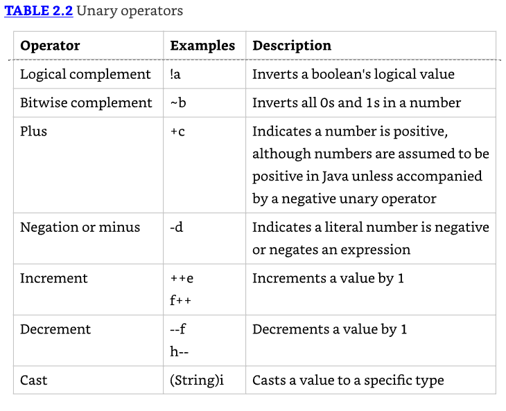
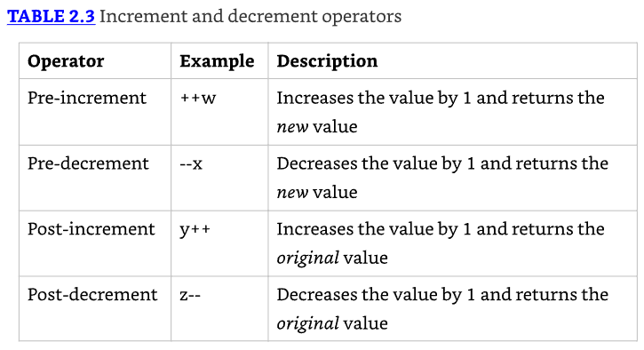
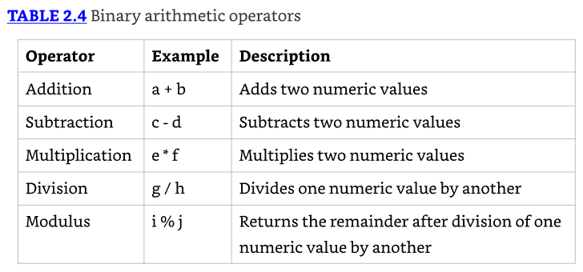
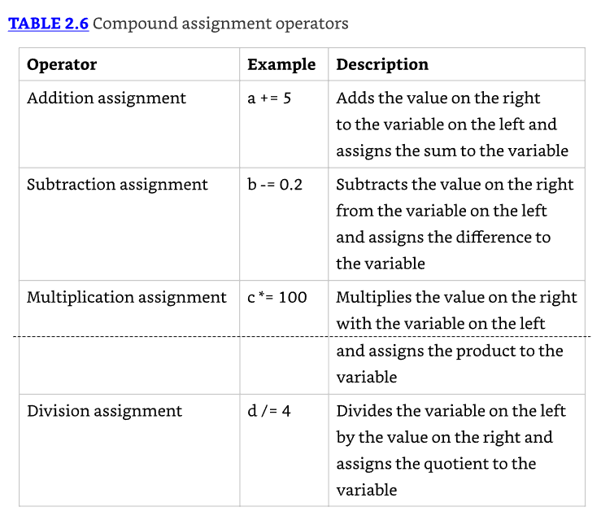
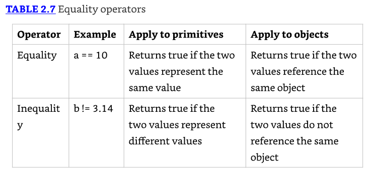
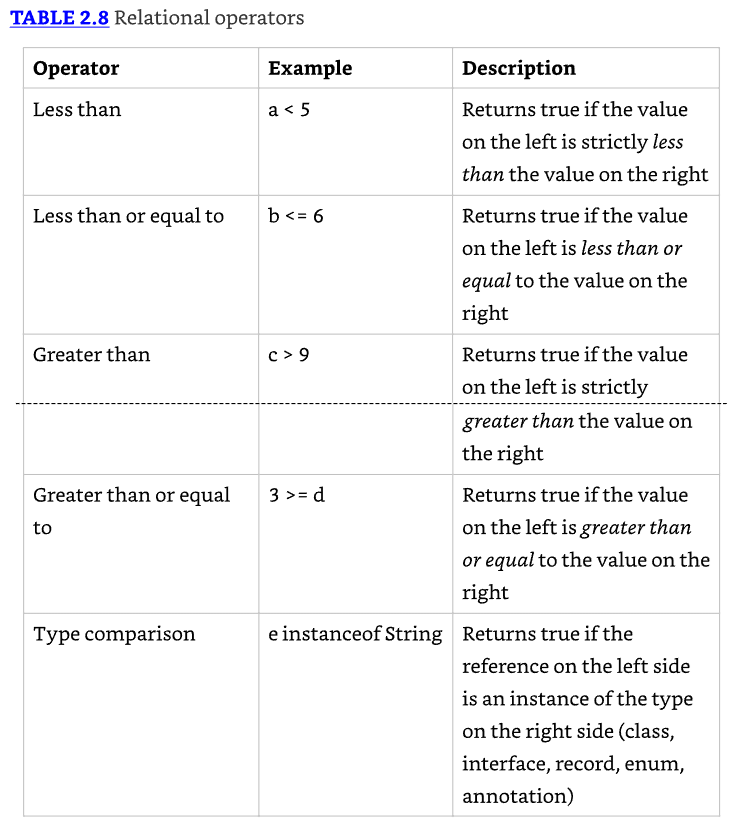

# Operators

## Understanding Java Operators

Un operator de Java es un símbolo especial que puede ser aplicado a un conjunto de variables, valores, o literales y que retorna un resultado

### Types of Operators

* Java soporta tres tipos de operadores: unary, binary, y ternary. 
* Estos tipos de operadores pueden ser aplicados a uno, dos, o tres operands, respectivamente. 

* Los operadores Java no son necesariamente evaluados de izquierda a derecha. 
* En este siguiente ejemplo, la segunda expresión es en realidad evaluada de derecha a izquierda, dados los operadores específicos involucrados:

```java
int cookies = 4;
double reward = 3 + 2 * --cookies;
System.out.print("Zoo animal receives: "+reward+" reward points");
```

En este ejemplo, primero decrementas cookies a 3, luego multiplicas el valor resultante por 2, y finalmente sumas 3. 
El valor entonces es automáticamente promovido de 9 a 9.0 y asignado a reward. 
Los valores finales de reward y cookies son 9.0 y 3, respectivamente.

### Operator Precedence

En matemáticas, ciertos operadores pueden sobreescribir otros operadores y ser evaluados primero. 
Determinar qué operadores son evaluados en qué orden es referido como operator precedence. 
De esta manera, Java sigue más de cerca las reglas para matemáticas. Considera la siguiente expresión:

`var perimeter = 2 * height + 2 * length;`

* El operador de multiplicación (*) tiene una mayor precedencia que el operador de adición (+), así que height y length son ambos multiplicados por 2 antes de ser sumados juntos. 
* El operador de asignación (=) tiene el menor orden de precedencia, así que la asignación a la variable perimeter es realizada al último.

A menos que sea sobreescrito con paréntesis, los operadores Java siguen el orden de operación, listados en Table 2.1, por orden decreciente de precedencia de operador. 
Si dos operadores tienen el mismo nivel de precedencia, entonces Java garantiza evaluación de izquierda a derecha para la mayoría de operadores distintos a los marcados en la tabla.


## Applying Unary Operators

* Por definición, un operador unary es uno que requiere exactamente una variable, para funcionar. 
* Como se muestra en Table 2.2, a menudo realizan tareas simples, tales como incrementar una variable numérica por uno o negar un valor boolean.



### Complement and Negation Operators

* El operador complemento (!) voltea el valor de una expresión boolean. 
* Por ejemplo, si el valor es true, será convertido a false, y viceversa. 

```java
boolean isAnimalAsleep = false;
System.out.print(isAnimalAsleep); // false
isAnimalAsleep = !isAnimalAsleep;
System.out.print(isAnimalAsleep); // true
```

Para el examen, también necesitas conocer sobre el operador bitwise (~), que voltea todos los 0 y 1 en un número. 
Solo puede ser aplicado a tipos numéricos enteros tales como byte, short, char, int, y long. Intentemos un ejemplo. 
Por simplicidad, solo mostramos los últimos cuatro bits (en lugar de todos los 32 bits).

```java
int value = 3;        // Stored as 0011
int complement = ~value;    // Stored as 1100
System.out.println(value);  // 3
System.out.println(complement); // -4
```

Para saber el valor de complemento de un numero al cual se le aplico bitwise solo debes; multiplícalo por uno negativo y luego resta uno.

```java
System.out.println(-1*value - 1);  // -4
System.out.println(-1*complement - 1); // 3
```

Pasando a operadores más comunes, el negation operator (-) revierte el signo de una expresión numérica, como se muestra en estos statements:

```java
double zooTemperature = 1.21;
System.out.println(zooTemperature); // 1.21
zooTemperature = -zooTemperature;
System.out.println(zooTemperature); // -1.21
```

Por ejemplo, ninguna de las siguientes líneas de código compilará:

```java
int pelican = !5;    // DOES NOT COMPILE
boolean penguin = -true; // DOES NOT COMPILE
boolean peacock = !0;  // DOES NOT COMPILE
```

* La primera sentencia no compilará porque en Java no puedes negar un valor numérico y asignarlo a un entero. 
* La segunda sentencia no compila porque no puedes negar numéricamente un valor boolean; necesitas usar el operador logical inverse. 
* Finalmente, la última sentencia no compila porque no puedes tomar el complemento lógico de un valor numérico, ni puedes asignar un entero a una variable boolean.

### Increment and Decrement Operators

* Los operadores incremento y decremento, **++** y **--**, respectivamente, pueden ser aplicados a variables numéricas y tienen un alto orden de precedencia comparados con operadores binarios.
* Se debe tener un cuidado especial porque el orden en el cual están adjuntos a su variable asociada puede hacer una diferencia en cómo una expresión es procesada.



El siguiente fragmento de código ilustra esta distinción:

```java
int parkAttendance = 0;
System.out.println(parkAttendance);  // 0
System.out.println(++parkAttendance); // 1
System.out.println(parkAttendance);  // 1
System.out.println(parkAttendance--); // 1
System.out.println(parkAttendance);  // 0
```

* El primer operador pre-increment actualiza el valor para parkAttendance y muestra el nuevo valor de 1. 
* El siguiente operador post-decrement también actualiza el valor de parkAttendance, pero muestra el valor antes de que ocurra el decremento.

## Working with Binary Arithmetic Operators

### Arithmetic Operators

Los Arithmetic operators son aquellos que operan en valores numéricos. Son mostrados en Table 2.4.



`int price = 2 * 5 + 3 * 4 - 8;`

Primero, evalúas el 2 * 5 y 3 * 4, lo cual reduce la expresión a esto:

`int price = 10 + 12 - 8;`

Luego, evalúas los términos restantes en orden de izquierda a derecha, resultando en un valor de price de 14. 

El siguiente fragmento de código contiene los mismos valores y operadores, en el mismo orden, pero con dos sets de paréntesis agregados:

`int price = 2 * ((5 + 3) * 4 - 8);`

Esta vez evaluarías el operador addition 5 + 3, lo cual reduce la expresión a lo siguiente:

`int price = 2 * (8 * 4 - 8);`

`short robin = 3 + [(4 * 2) + 4];   // DOES NOT COMPILE`

Este ejemplo no compila porque Java, a diferencia de algunos otros lenguajes de programación, no permite corchetes, [], para ser usados en lugar de paréntesis.

### Division and Modulus Operators

* El operador modulus, algunas veces llamado el remainder operator, es simplemente el residuo cuando dos números son divididos. 
* Por ejemplo, 9 dividido por 3 divide equitativamente y no tiene residuo; por lo tanto, el resultado de 9 % 3 es 0. 
* Por otro lado, 11 dividido por 3 no divide equitativamente; por lo tanto, el resultado de 11 % 3 es 2.

```java
System.out.println(10 / 3); // 3
System.out.println(10 % 3); // 1
```

* Para valores enteros, la división resulta en el floor value del entero más cercano que cumple la operación, mientras que modulus es el valor residuo. 
* Si escuchas la frase **floor value**, solo significa el valor sin nada después del punto decimal. 
* Por ejemplo, el floor value es 4 para cada uno de los valores 4.0, 4.5, y 4.9999999.

### Numeric Promotion Rules

1. Si dos valores tienen diferentes tipos de datos, Java promoverá automáticamente uno de los valores al mayor de los dos tipos de datos.
2. Si uno de los valores es entero y el otro es punto flotante, Java automáticamente promoverá el valor entero a punto flotante.
3. Los tipos de datos más pequeños, específicamente, byte, short, y char, son primero promovidos a int en cualquier momento que son usados con un operador aritmético binario de Java con una variable (en oposición a un valor), incluso si ninguno de los operandos es int.
4. Después de que toda la promoción ha ocurrido y los operandos tienen el mismo tipo de dato, el valor resultante tendrá el mismo tipo de dato que sus operandos promovidos.

Para la tercera regla, nota que los operadores unarios están excluidos de esta regla. Por ejemplo, aplicar ++ a un valor short resulta en un valor short.

```java
int x = 1;
long y = 33;
var z = x * y;
```

* En este caso, seguimos la primera regla. Ya que uno de los valores es int y el otro es long, y long es mayor que int, el valor int `x` es primero promovido a un long. 
* El resultado `z` es entonces un valor long.

```java
double x = 39.21;
float y = 2.1;
var z = x + y;
```

* Esta es en realidad una pregunta trampa, ¡ya que la segunda línea no compila! 
* Los literales de punto flotante se asumen que son double a menos que sean post fijados con un f, como en 2.1f. 
* Si el valor de `y` fuera establecido apropiadamente a 2.1f, entonces ambos operandos se promueven a un double, y el resultado `z` sería un valor double.

```java
short w = 14;
float x = 13;
double y = 30;
var z = w * x / y;
```

* Primero, `w` será automáticamente promovido a int solamente porque es un short y está siendo usado en una operación binaria aritmética. 
* El valor `w` promovido será entonces automáticamente promovido a un float para que pueda ser multiplicado con `x`. 
* El resultado de `w * x` será entonces automáticamente promovido a un double para que pueda ser dividido por `y`, resultando en un valor double.

### Assigning Values

### Assignment Operator

* Un operador de asignación es un operador binario que modifica, o asigna, la variable en el lado izquierdo del operador con el resultado del valor en el lado derecho de la ecuación. 
* A diferencia de la mayoría de otros operadores Java, el operador assignment es evaluado de derecha a izquierda.
* El operador de asignación más simple es el = assignment, que ya has visto:

`int herd = 1;`

### Casting Values

Casting es una operación unaria donde un tipo de dato es explícitamente interpretado como otro tipo de dato. 
El Casting es opcional e innecesario cuando se convierte a un tipo de dato más grande o widening, pero es requerido cuando se convierte a un tipo de dato más pequeño o narrowing. 
Sin casting, el compilador generará un error cuando trate de poner un tipo de dato más grande dentro de uno más pequeño.

```java
int fur = (int)5;
int hair = (short) 2;
String type = (String) "Bird";
short tail = (short)(4 + 10);
long feathers = 10(long); // DOES NOT COMPILE
```

Los espacios entre el cast y el valor son opcionales. 
El último ejemplo no compila porque el tipo está en el lado equivocado del valor.

```java
float egg = 2.0 / 9;    // DOES NOT COMPILE
int tadpole = (int)5 * 2L; // DOES NOT COMPILE
short frog = 3 - 2.0;   // DOES NOT COMPILE
```

Todos estos ejemplos anteriores involucran poner un valor más grande en un tipo de dato más pequeño. 

### Reviewing Primitive Assignments

```java
int fish = 1.0;     // DOES NOT COMPILE
short bird = 1921222; // DOES NOT COMPILE
int mammal = 9f;    // DOES NOT COMPILE
long reptile = 192_301_398_193_810_323; // DOES NOT COMPILE
```

* La primera sentencia no compila porque estás tratando de asignar un double 1.0 a un valor integer. 
* La segunda sentencia no compila porque el valor literal 1921222 está fuera del rango de short, y el compilador detecta esto. 
* La tercera sentencia no compila porque la `f` agregada al final del número instruye al compilador a tratar el número como un valor de punto flotante, pero la asignación es a un int. 
* Finalmente, la última sentencia no compila porque Java interpreta el literal como un int y nota que el valor es más grande de lo que permite int. El literal necesitaría un postfix L o l para ser considerado un long.

Recuerda, hacer cast a primitivos hace que vayas de un tipo de dato numérico más grande a un tipo de dato numérico más pequeño, o convirtiendo de un número de punto flotante a entero.

`long reptile = (long)192301398193810323; // DOES NOT COMPILE`

* Esto todavía no compila porque el valor es primero interpretado como un int por el compilador y está fuera de rango. 
* Lo siguiente arregla este código sin requerir casting:

`long reptile = 192301398193810323L;`

### Compound Assignment Operators

Además de =, Java soporta varios operadores de asignación compuesta que combinan una operación aritmética con la asignación.



```java
int camel = 2, giraffe = 3;
camel = camel * giraffe;  // Simple assignment operator
camel *= giraffe;   // Compound assignment operator
```

* El lado izquierdo del operador compuesto puede ser aplicado solo a una variable que ya está definida y no puede ser usado para declarar una nueva variable. 
* En este ejemplo, si camel no estuviera ya definido, la expresión camel *= giraffe no compilaría.

```java
long goat = 10;
int sheep = 5;
sheep = sheep * goat;  // DOES NOT COMPILE
```

* Estamos tratando de asignar un valor long a una variable int. 
* Esta última línea podría ser arreglada con un cast explícito a (int), pero hay una mejor manera usando el operador de asignación compuesto:

```java
long goat = 10;
int sheep = 5;
sheep *= goat;
```

El operador compuesto primero hará cast de sheep a un long, aplicará la multiplicación de dos valores long, y luego hará cast del resultado de vuelta a un int.

### Return Value of Assignment Operators

* Una última cosa que saber sobre operadores de asignación es que el resultado de una asignación es igual al valor de la asignación. 
* Por ejemplo, el siguiente fragmento de código es perfectamente válido, si un poco extraño:

```java
long wolf = 5;
long coyote = (wolf=3);
System.out.println(wolf); // 3
System.out.println(coyote); // 3
```

## Comparing Values

### Equality Operators

* Determinar igualdad en Java puede ser un esfuerzo no trivial, ya que hay una diferencia semántica entre "2 objetos son iguales" y "2 objetos son equivalentes"
* Se complica aún más por el hecho de que para primitivos numéricos y boolean, no existe tal distinción.



* El operador igualdad puede ser aplicado a valores numéricos, valores boolean, y objetos (incluyendo String y null). 
* Cuando se aplica el operador equality, no puedes mezclar estos tipos. Cada uno de los siguientes resulta en un error del compilador:

```java
boolean monkey = true == 3;   // DOES NOT COMPILE
boolean ape = false != "Grape"; // DOES NOT COMPILE
boolean gorilla = 10.2 == "Koko"; // DOES NOT COMPILE
```

* Para comparación de objetos, el operador igualdad es aplicado a las referencias de los objetos, no a los objetos a los que apuntan. 
* Dos referencias son iguales si y solo si apuntan al mismo objeto o ambos apuntan a null. Echemos un vistazo a algunos ejemplos:

```java
var monday = new File("schedule.txt");
var tuesday = new File("schedule.txt");
var wednesday = tuesday;
System.out.println(monday == tuesday);  // false
System.out.println(tuesday == wednesday); // true
```

Aunque todas las variables apuntan a la misma información de archivo, solo dos referencias, `tuesday` y `wednesday`, son iguales en términos de ==, ya que apuntan al mismo objeto.

### Relational Operators

Ahora pasamos a relational operators, que comparan dos expresiones y retornan un valor boolean.




---------------------------------------------------------------------
**Palabra** cuando es una palabra en inglés importante que tiene sentido traducirla, pero no es una palabra reservada

() version en ingles de la palabra anterior

`   `  solo cúando es una línea de código o una palabra reservada que va a ser explicada

```java

```


Making Decisions with the Ternary Operator
