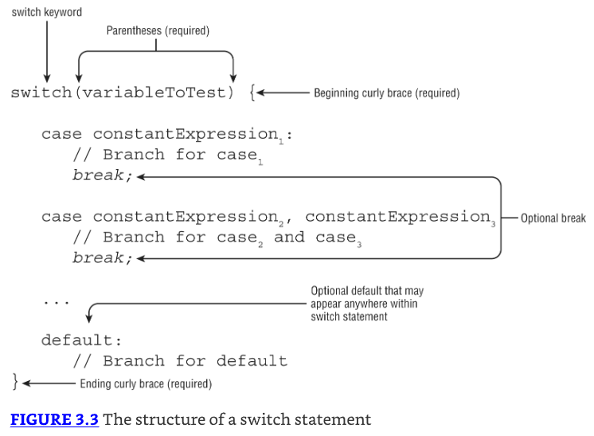
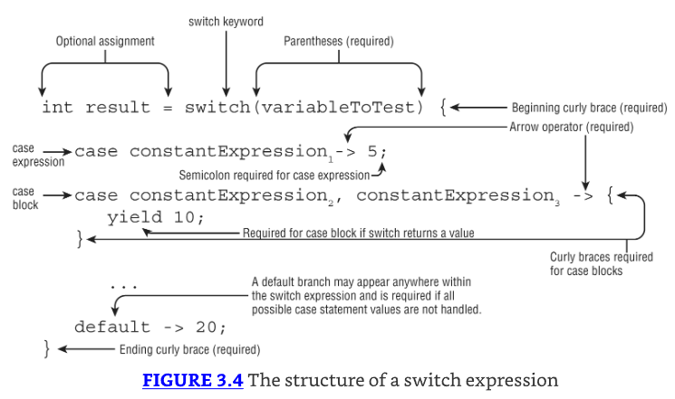
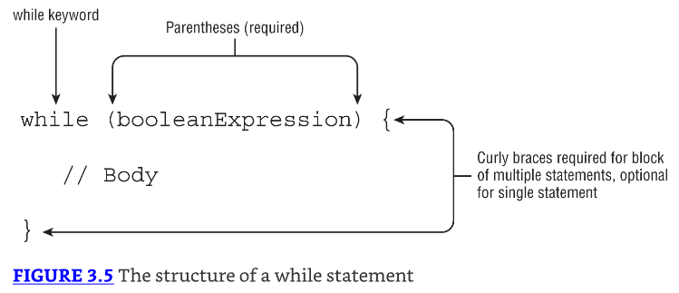
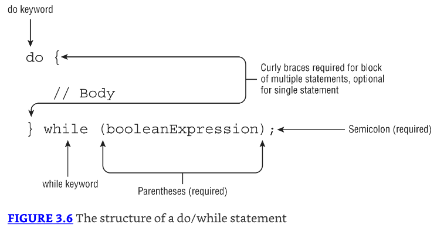
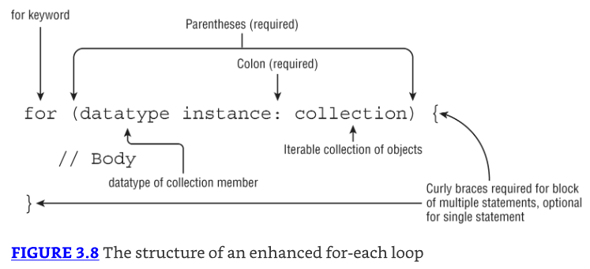
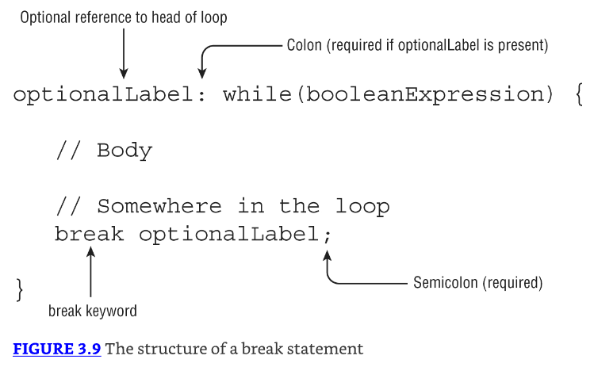

# Making Decision

## Creating Decision-Making Statements

### The if Statement

la sentencia `if` statement permite que nuestra aplicación ejecute un bloque particular de código si y solo si una expresión booleana se evalúa a true en tiempo de ejecución.


```java
if(hourOfDay < 11)
    System.out.println("Good Morning");

if(hourOfDay < 11) {
    System.out.println("Good Morning");
    morningGreetingCount++;
}
```

Ambas opciones son válidas. La segunda opción usa llaves `{}` para agrupar múltiples declaraciones en un solo bloque.

### The else Statement


```java
if(hourOfDay < 11) {
    System.out.println("Good Morning");
} else System.out.println("Good Afternoon");

if(hourOfDay < 11) {
        System.out.println("Good Morning");
} else if(hourOfDay < 15) {
        System.out.println("Good Afternoon");
} else {
        System.out.println("Good Evening");
}
```

* El operador else toma una sentencia o bloque de sentencias, de la misma manera que la sentencia if.
* Podemos agregar sentencias if adicionales a un bloque else para llegar a un ejemplo más refinado

### Shortening Code with Pattern Matching

* Java 16 oficialmente introdujo pattern matching con sentencias if y el operador instanceof. 
* Pattern matching es una técnica de controlar el flujo del programa que solo ejecuta una sección de código que cumple ciertos criterios. 
* Es usado en conjunto con sentencias if para mayor control del programa.

* Pattern matching es una nueva herramienta a tu disposición para reducir boilerplate en tu código. 
* Boilerplate code es código que tiende a ser duplicado a través de una sección de código una y otra vez de manera similar. 

```java
void compareIntegers(Number number) {
    if(number instanceof Integer) {
        Integer data = (Integer)number;
        System.out.print(data.compareTo(5));
    }
}
```

* El cast es necesario, ya que el método compareTo() está definido en Integer, pero no en Number.
* Código que primero verifica si una variable es de un tipo particular y luego inmediatamente la castea a Integer. 
* Es tan común que los autores de Java decidieron implementar una sintaxis más corta para ello:

```java
void compareIntegers(Number number) {
    if(number instanceof Integer data) {
        System.out.print(data.compareTo(5));
    }
}
```

* La variable **data** en este ejemplo es referida como la **pattern variable**. 
* Nota que este código también evita cualquier ClassCastException potencial porque la operación de cast es ejecutada solo si el operador instanceof implícito retorna true.

### Pattern Variables and Expressions

Pattern matching incluye expresiones que pueden ser usadas para filtrar datos, como en el siguiente ejemplo:

```java
void printIntegersGreaterThan5(Number number) {
    if(number instanceof Integer data && data.compareTo(5)>0)
        System.out.print(data);
}
```

* Podemos aplicar un número de filtros, o patrones, para que la sentencia if sea ejecutada solo en circunstancias específicas. 
* Nota que estamos usando la variable de patrón en una expresión en la misma línea en la cual es declarada.

### Subtypes

El tipo de la variable de patrón debe ser un subtipo de la variable en el lado izquierdo de la expresión. Tampoco puede ser el mismo tipo.

```java
Integer value = 123;
if(value instanceof Integer) {}
if(value instanceof Integer data) {} // DOES NOT COMPILE
```

Mientras que la segunda línea compila, la última línea no compila porque pattern matching requiere que el tipo de dato de la variable sea un subtipo estricto de Integer.

### Flow Scoping

* El compilador aplica flow scoping cuando trabaja con pattern matching. 
* Flow scoping significa que la variable solo está en alcance cuando el compilador puede determinar definitivamente su tipo. 

```java
void printIntegersOrNumbersGreaterThan5(Number number) {
    if(number instanceof Integer data || data.compareTo(5)>0)
        System.out.print(data);
}
```

* Si la entrada no hereda Integer, la variable data es indefinida. 
* Ya que el compilador no puede garantizar que data es una instancia de Integer, data no está en alcance, y el código no compila.

```java
void printIntegerTwice(Number number) {
    if (number instanceof Integer data)
        System.out.print(data.intValue());
    System.out.print(data.intValue()); // DOES NOT COMPILE
}
```

Ya que la entrada podría no haber heredado Integer, data ya no está en alcance después de la sentencia if. 
Oh, entonces podrías estar pensando que la variable de patrón está entonces solo en alcance dentro de la sentencia if, 

## Applying switch Statements

### The switch Statement

* Una sentencia switch, es una estructura compleja de toma de decisiones en la cual un valor único es evaluado y el flujo es redirigido a la primera rama coincidente, conocida como una sentencia case. 
* Si no se encuentra tal sentencia case que coincida con el valor, una sentencia default opcional será llamada.
* Si no está disponible tal opción default, la sentencia switch entera será omitida. 



```java
int month = 5;

switch month { // DOES NOT COMPILE
    case 1: System.out.print("January");
}

switch(month) // DOES NOT COMPILE
    case 1: System.out.print("January");

switch(month) {
    case 1: 2: System.out.print("January"); // DOES NOT COMPILE
}
```

* La primera sentencia switch no compila porque le faltan paréntesis alrededor de la variable switch. 
* La segunda sentencia no compila porque le faltan llaves alrededor del cuerpo del switch. 
* La tercera sentencia no compila porque una coma `(,)` debería ser usada para separar sentencias case combinadas, no dos puntos (:).

* Una última nota de la que deberías estar consciente para el examen: una sentencia switch no está obligada a contener ninguna sentencia case. 
* Por ejemplo, esta sentencia es perfectamente válida:

`switch(month) {}`

### Exiting with break Statements

* Una sentencia break termina la sentencia switch y retorna el control de flujo al proceso que la encierra. 
* Las sentencias break son opcionales, pero sin ellas el código ejecutará cada rama siguiendo una sentencia case coincidente, incluyendo cualquier sentencia default que encuentre. 

* ¿Qué piensas que imprime lo siguiente cuando printSeason(2) es llamado?

```java
public void printSeason(int month) {
    switch(month) {
        case 1, 2, 3:  System.out.print("Winter");
        case 4, 5, 6:  System.out.print("Spring");
        default:    System.out.print("Unknown");
        case 7, 8, 9:  System.out.print("Summer");
        case 10, 11, 12: System.out.print("Fall");
    }
}
```

Imprime todo: WinterSpringUnknownSummerFall

* Coincide con la primera sentencia case y ejecuta todas las ramas en el orden en que se encuentran, incluyendo la sentencia default. 
* Es común, aunque ciertamente no requerido, usar una sentencia break después de cada sentencia case.

### Selecting switch Data Types

Como se muestra en Figure 3.3, una sentencia switch tiene una variable objetiva que no es evaluada hasta tiempo de ejecución. 
La siguiente es una lista de todos los tipos de datos soportados por sentencias switch:

* int and Integer
* byte and Byte
* short and Short
* char and Character
* String
* enum values
* var (si el tipo es resuelto en pasos previos)

Para este capítulo, solo necesitas saber que una enumeración, o enum, representa un conjunto fijo de constantes, como días de la semana, meses del año, y así sucesivamente. 

### Determining Acceptable Case Values

* Primero, los valores en cada sentencia `case` deben ser valores constantes en tiempo de compilación del mismo tipo de datos que el valor switch. 
* Por ejemplo, no puedes tener un valor de sentencia case que requiera ejecutar un método en tiempo de ejecución, incluso si ese método siempre retorna el mismo valor. 

```java
final int getCookies() { return 4; }
void feedAnimals() {
    final int bananas = 1;
    int apples = 2;
    int numberOfAnimals = 3;
    final int cookies = getCookies();
    switch(numberOfAnimals) {
        case bananas:
        case apples:     // DOES NOT COMPILE
        case getCookies(): // DOES NOT COMPILE
        case cookies :  // DOES NOT COMPILE
        case 3 * 5 :
    }
}
```

* La variable bananas está marcada final, y su valor es conocido en tiempo de compilación, así que es válida. 
* La variable apples no está marcada final, incluso aunque su valor es conocido, así que no está permitida. 
* Las siguientes dos sentencias case, con valores getCookies() y cookies, no compilan porque los métodos no son evaluados hasta tiempo de ejecución, así que no pueden ser usados como el valor de una sentencia case, incluso si uno de los valores está almacenado en una variable final. 
* La última sentencia case, con valor 3 * 5, compila, ya que las expresiones están permitidas como valores case, siempre que el valor pueda ser resuelto en tiempo de compilación. 
* También deben ser capaces de caber en el tipo de datos switch sin un cast explícito. 

* Siguiente, el tipo de datos para sentencias case debe coincidir con el tipo de datos de la variable switch. 
* Por ejemplo, no puedes tener una sentencia case de tipo String si la variable de la sentencia switch es de tipo int, ya que los tipos son incomparables.

### The switch Expression

Una expresión switch es una forma mucho más compacta de una sentencia switch, capaz de retornar un valor. 



* Para empezar, ahora podemos asignar el resultado de una expresión switch a una variable result. 
* Para que esto funcione, todas las ramas case y default deben retornar un tipo de datos que sea compatible con la asignación. 
* La expresión switch soporta dos tipos de ramas: una expresión y un bloque. Cada una tiene reglas sintácticas diferentes sobre cómo debe ser creada. 

* Como una sentencia switch tradicional, una expresión switch soporta cero o muchas ramas case y una rama default opcional. 
* Ambas también soportan la nueva característica que permite que valores case sean combinados con una sola sentencia case usando comas. 
* A diferencia de una sentencia switch tradicional, las expresiones switch tienen reglas especiales alrededor de cuándo la rama default es requerida.

Podemos reescribir nuestro método printDayOfWeek() previo de una manera mucho más concisa usando expresiones case:

```java
public void printDayOfWeek(int day) {
    var result = switch(day) {
        case 0 -> "Sunday";
        case 1 -> "Monday";
        case 2 -> "Tuesday";
        case 3 -> "Wednesday";
        case 4 -> "Thursday";
        case 5 -> "Friday";
        case 6 -> "Saturday";
        default -> "Invalid value";
    };
    System.out.print(result);
}
```

* Nota que un punto y coma es requerido después de cada expresión switch. 

Por ejemplo, el siguiente código no compila. ¿Cuántos puntos y coma le faltan?

```java
var result = switch(bear) {
    case 30 -> "Grizzly"
    default -> "Panda"
}
```

La respuesta es tres. Cada expresión case o default requiere un punto y coma así como la asignación misma. Lo siguiente arregla el código:

```java
var result = switch(bear) {
    case 30 -> "Grizzly";
    default -> "Panda";
};
```

Como se muestra en Figure 3.4, las sentencias case pueden tomar múltiples valores, separados por comas. 

Reescribamos nuestro método printSeason() de antes usando una expresión switch:

```java
public void printSeason(int month) {
    switch(month) {
        case 1, 2, 3  -> System.out.print("Winter");
        case 4, 5, 6  -> System.out.print("Spring");
        case 7, 8, 9  -> System.out.print("Summer");
        case 10, 11, 12 -> System.out.print("Fall");
    }
}
```

Llamar printSeason(2) imprime el valor único Winter. Esta vez no tenemos que preocuparnos sobre sentencias break, ya que solo una rama es ejecutada.

Todas las reglas previas alrededor de tipos de datos switch y valores case todavía aplican, aunque tenemos algunas reglas nuevas: 

1. Todas las ramas de una expresión switch que no lanzan una excepción deben retornar un tipo de datos consistente (si la expresión switch retorna un valor).
2. Si la expresión switch retorna un valor, entonces cada rama que no es una expresión debe producir (yield) un valor.
3. Una rama default es requerida a menos que todos los casos estén cubiertos o no se retorna ningún valor.

### Returning Consistent Data Types

* La primera regla de usar una expresión switch es probablemente la más fácil. 
* No puedes retornar tipos de datos incompatibles o aleatorios. 

```java
int measurement = 10;
int size = switch(measurement) {
    case 5 -> 1;
    case 10 -> (short)2;
    default -> 5;
    case 20 -> "3";  // DOES NOT COMPILE
    case 40 -> 4L;   // DOES NOT COMPILE
    case 50 -> null; // DOES NOT COMPILE
};
```

* Nota que la segunda expresión case retorna un short, pero eso puede ser implícitamente casteado a un int. 
* De esta manera, los valores tienen que ser consistentes con size, pero no todos tienen que ser del mismo tipo de datos. 
* Las últimas tres expresiones case no compilan porque cada una retorna un tipo que no puede ser asignado a la variable int.

### Applying a case Block

* Una expresión switch soporta tanto una expresión como un bloque en las ramas case y default. 
* Como un bloque regular, un bloque case es uno que está rodeado por llaves ({}). 
* También incluye una sentencia `yield` si la expresión switch retorna un valor. 

```java
int fish = 5;
int length = 12;
var name = switch(fish) {
    case 1 -> "Goldfish";
    case 2 -> {yield "Trout";}
    case 3 -> {
        if(length > 10) yield "Blobfish";
        else yield "Green";
    }
    default -> "Swordfish";
};
```

* La palabra clave `yield` es equivalente a una sentencia `return` dentro de una expresión switch.
* Es usada para evitar ambigüedad sobre si quieres salir del bloque o del método alrededor de la expresión switch.

Refiriéndonos a nuestra segunda regla para expresiones switch, las sentencias yield no son opcionales si la sentencia switch retorna un valor. 

```java
10: int fish = 5;
11: int length = 12;
12: var name = switch(fish) {
13:     case 1 -> "Goldfish";
14:     case 2 -> {} // DOES NOT COMPILE
15:     case 3 -> {
16:         if(length > 10) yield "Blobfish";
17:     } // DOES NOT COMPILE
18:     default -> "Swordfish";
19: };
```

* La línea 14 no compila porque no retorna un valor usando yield. 
* La línea 17 tampoco compila. Aunque el código retorna un valor para length mayor que 10, no retorna un valor si length es menor que o igual a 10. 
* No importa que length esté configurado para ser 12; todas las ramas deben producir (yield) un valor dentro del bloque case.

### Covering All Possible Values

* La última regla dice; una expresión switch que retorna un valor debe manejar todos los valores de entrada posibles. 
* Y como viste anteriormente, cuando no retorna un valor, es opcional.

```java
String type = switch(canis) { // DOES NOT COMPILE
    case 1 -> "dog";
    case 2 -> "wolf";
    case 3 -> "coyote";
};
```

* No hay una rama case para cubrir 5 (o 4, -1, 0, etc.), entonces ¿debería la expresión switch retornar null, el string vacío, undefined, o algún otro valor? 
* Cada expresión switch debe manejar todos los valores posibles de la variable switch. Como desarrollador, hay dos maneras de abordar esto:

* Agregar una rama default. 
* Si la expresión switch toma un valor enum, agrega una rama case para cada posible valor enum.

* En la práctica, la primera solución es la que se usa más frecuentemente. 
* La segunda solución aplica solo a expresiones switch que toman un enum. 

* Para enums, la segunda solución funciona bien cuando el número de valores enum es relativamente pequeño. 
* Por ejemplo, considera la siguiente definición de enum y método:

```java
enum Season {WINTER, SPRING, SUMMER, FALL}

String getWeather(Season value) {
    return switch(value) {
        case WINTER -> "Cold";
        case SPRING -> "Rainy";
        case SUMMER -> "Hot";
        case FALL -> "Warm";
    };
}
```

* Ya que todas las permutaciones posibles de Season están cubiertas, una rama default no es requerida en esta expresión switch. 
* Puedes incluir una rama default opcional, sin embargo, incluso si cubres todos los valores conocidos.

## Writing while Loops

### The while Statement

* La estructura de control repetitiva más simple en Java es la sentencia while, descrita en Figure 3.5. 
* Tiene una condición de terminación, implementada como una expresión booleana, que continuará mientras la expresión se evalúe a true.



```java
int roomInBelly = 5;
public void eatCheese(int bitesOfCheese) {
    while (bitesOfCheese > 0 && roomInBelly > 0) {
        bitesOfCheese--;
        roomInBelly--;
    }
    System.out.println(bitesOfCheese+" pieces of cheese left");
}
```

* Con cada iteración del bucle, el ratón "come" una mordida de comida y pierde un espacio en su barriga. 
* Usando una sentencia booleana compuesta, te aseguras de que el bucle while pueda terminar por cualquiera de las condiciones.

### The do/while Statement

Un bucle do/while, es como un bucle while, es una estructura de control de repetición con una condición de terminación y sentencia.



A diferencia de un bucle while, sin embargo, un bucle do/while garantiza que la sentencia o bloque será ejecutado al menos una vez.

```java
int lizard = 0;
do {
    lizard++;
} while(false);
System.out.println(lizard); // 1
```

* Java ejecutará el bloque de sentencias primero y luego verificará la condición del bucle. 
* Aunque el bucle sale inmediatamente, el bloque de sentencias todavía se ejecuta una vez, y el programa imprime 1.

## Constructing for Loops

### The for Loop

Un bucle for básico tiene la misma expresión booleana condicional y sentencia, o bloque de sentencias, que los bucles while, así como dos nuevas secciones: un initialization block y una sentencia update. 


```java
for(int i=0; i < 10; i++)
    System.out.println("Value is: "+i);
System.out.println(i); // DOES NOT COMPILE
```

Este código no compila porque la variable de bucle `i` es referenciada fuera del bucle.

```java
for (var counter = 4; counter>= 0; counter--) {
    System.out.print(counter + " ");
}
```

¡Finalmente! Ahora tenemos código que imprime 4 3 2 1 0 y coincide con el reverso de nuestro ejemplo de bucle for en la sección previa.

### Working with for Loops

* Deberías familiarizarte con los siguientes cinco ejemplos; variaciones de estos es probable que se vean en el examen.
* Abordemos algunos ejemplos con propósitos ilustrativos:

**Creating an Infinite Loop**

```java
for(;;)
    System.out.println("Hello World");
```

* Aunque este bucle for puede parecer que no compila, de hecho compilará y se ejecutará sin problema. 
* Es en realidad un bucle infinito que imprimirá la misma sentencia repetidamente.

**Adding Multiple Terms to the for Statement**

```java
int x = 0;
for(long y = 0, z = 4; x < 5 && y < 10; x++, y++) {
    System.out.print(y + " "); }
System.out.print(x + " ");
```

* Este código demuestra tres variaciones del bucle for que podrías no haber visto. 
* Primero, puedes declarar una variable, como `x` en este ejemplo, antes de que el bucle comience y usarla después de que se complete. 
* Segundo, tu bloque de inicialización, expresión booleana, y sentencias de actualización pueden incluir variables extra que pueden o no referenciar unas a otras. 
* Por ejemplo, `z` es definida en el bloque de inicialización y nunca es usada. 
* Finalmente, la sentencia de actualización puede modificar múltiples variables. 

Este código imprimirá lo siguiente cuando se ejecute: 0 1 2 3 4 5

**Redeclaring a Variable in the Initialization Block**

```java
int x = 0;
for(int x = 4; x < 5; x++)  // DOES NOT COMPILE
    System.out.print(x + " ");
```

Este ejemplo se ve similar al previo, pero no compila debido al bloque de inicialización. 
La diferencia es que `x` es repetido en el bloque de inicialización después de ya haber sido declarado antes del bucle, resultando en que el compilador se detenga debido a una declaración de variable duplicada. 
Podemos arreglar este bucle removiendo la declaración de `x` del bucle for como sigue:

```java
int x = 0;
for(x = 0; x < 5; x++)
    System.out.print(x + " ");
```

Nota que esta variación ahora compilará porque el bloque de inicialización simplemente asigna un valor a x y no lo declara.

**Using Incompatible Data Types in the Initialization Block**

```java
int x = 0;
for(long y = 0, int z = 4; x < 5; x++) // DOES NOT COMPILE
    System.out.print(y + " ");
```

* Las variables en el bloque de inicialización deben todas ser del mismo tipo. 
* En el ejemplo de múltiples términos, `y` y `z` eran ambas long, así que el código compiló sin problema; pero en este ejemplo, tienen tipos diferentes, así que el código no compilará.

**Using Loop Variables Outside the Loop**

```java
for(long y = 0, x = 4; x < 5 && y < 10; x++, y++)
    System.out.print(y + " ");
System.out.print(x); // DOES NOT COMPILE
```

* Si notas, `x` es definida en el bloque de inicialización del bucle y luego usada después de que el bucle termina. 
* Ya que `x` solo estaba en el alcance del bucle, usarla fuera del bucle causará un error del compilador.

### The for-each Loop

El bucle for-each es una estructura especializada diseñada para iterar sobre arrays y varias clases Collections Framework, como se presenta en Figure 3.8.



* La declaración del bucle for-each está compuesta de una sección de inicialización y un objeto sobre el cual iterar. 
* El lado derecho del bucle for-each debe ser uno de los siguientes:
1. Un tipo Array
2. Un objeto que implemente `java.lang.Iterable`


* Se necesita saber que el lado derecho debe ser un array o colección de elementos, como una List o un Set.
* Para el examen, deberías saber que esto no incluye todas las clases o interfaces de Collections Framework, sino solo aquellas que implementan o extienden esa interfaz Collection. 
* Por ejemplo, Map no está soportado en un bucle for-each, aunque Map incluye métodos que retornan instancias Collection.

* El lado izquierdo del bucle for-each debe incluir una declaración para una variable de instancia cuyo tipo es compatible con el tipo del array o colección en el lado derecho de la sentencia. 
* En cada iteración del bucle, la variable nombrada en el lado izquierdo de la sentencia se le asigna un nuevo valor del array o colección en el lado derecho de la sentencia.

Compara estos dos métodos que ambos imprimen los valores de un array, uno usando un bucle for tradicional y el otro usando un bucle for-each:

```java
public void printNames(String[] names) {
    for(int counter=0; counter<names.length; counter++)
        System.out.println(names[counter]);
}

public void printNames(String[] names) {
    for(var name : names)
        System.out.println(name);
}
```

* Los bucles for-each están diseñados para reducir código boilerplate, haciendo que el código sea más fácil de leer/escribir.
* También podemos usar un bucle for-each en una List, ya que implementa Iterable.

```java
public void printNames(List<String> names) {
    for(var name : names)
        System.out.println(name);
}
```

* Para este capítulo, solo necesitas saber que en cada iteración, un bucle for-each asigna una variable con el mismo tipo que el argumento genérico. 
* En este caso, `name` es de tipo String.

```java
String birds = "Jay";
for(String bird : birds) // DOES NOT COMPILE
    System.out.print(bird + " ");

String[] sloths = new String[3];
for(int sloth : sloths)  // DOES NOT COMPILE
    System.out.print(sloth + " ");
```

* El primer bucle for-each no compila porque String no puede ser usado en el lado derecho de la sentencia. 
* Aunque un String puede representar una lista de caracteres, tiene que ser en realidad un array o implementar Iterable. 
* El segundo ejemplo no compila porque el tipo de bucle en el lado izquierdo de la sentencia es int y no coincide con el tipo esperado de String.

## Controlling Flow with Branching

Los tipos finales de estructuras de control de flujo que cubrimos en este capítulo son sentencias de ramificación. 
Hasta ahora, hemos estado tratando con bucles únicos que terminaban solo cuando su expresión booleana se evaluaba a false. 
Ahora te mostramos otras maneras en que los bucles podrían terminar, o ramificarse, y ves que el camino tomado durante tiempo de ejecución puede no ser tan directo como en los ejemplos previos.

### Nested Loops

Antes de que pasemos a las sentencias de ramificación, necesitamos introducir el concepto de bucles anidados. 
Un nested loop es un bucle que contiene otro bucle, incluyendo while, do/while, for, y bucles for-each. 
Por ejemplo, considera el siguiente código que itera sobre un array bidimensional, que es un array que contiene otros arrays como sus miembros. 

```java
int[][] myComplexArray = {{5,2,1,3},{3,9,8,9},{5,7,12,7}};

for(int[] mySimpleArray : myComplexArray) {
    for(int i=0; i<mySimpleArray.length; i++) {
        System.out.print(mySimpleArray[i]+"\t");
    }
    System.out.println();
}
```

* Nota que intencionalmente mezclamos un bucle for y un bucle for-each en este ejemplo. 
* El bucle externo se ejecutará un total de tres veces. Cada vez que el bucle externo se ejecuta, el bucle interno se ejecuta cuatro veces. 
* Cuando ejecutamos este código, vemos la siguiente salida:

5    2    1    3
3    9    8    9
5    7    12   7

Los bucles anidados pueden incluir bucles while y do/while, como se muestra en este ejemplo. Ve si puedes determinar qué producirá este código:

```java
int hungryHippopotamus = 8;
while(hungryHippopotamus>0) {
    do {
        hungryHippopotamus -= 2;
    } while (hungryHippopotamus>5);
    hungryHippopotamus--;
    System.out.print(hungryHippopotamus+", ");
}
```

* La primera vez que este bucle se ejecuta, el bucle interno se repite hasta que el valor de hungryHippopotamus es 4. 
* El valor será entonces decrementado a 3, y ese será la salida al final de la primera iteración del bucle externo.

* En la segunda iteración del bucle externo, el bucle interno do/while será ejecutado una vez, aunque hungryHippopotamus ya no es mayor que 5. 
* Como podrás recordar, las sentencias do/while siempre ejecutan el cuerpo al menos una vez. 
* Esto reducirá el valor a 1, que será reducido aún más por el operador de decremento en el bucle externo a 0. 
* Una vez que el valor alcanza 0, el bucle externo terminará. El resultado es que el código producirá lo siguiente:

3, 0,

### Adding Optional Labels

* Una cosa que intencionalmente omitimos cuando presentamos sentencias if, sentencias switch, y bucles es que todos pueden tener etiquetas opcionales. 
* Un label es un puntero opcional a la cabeza de una sentencia que permite que el flujo de la aplicación salte a ella o se rompa desde ella. 
* Es un identificador único que es seguido por dos puntos (:). Por ejemplo, podemos agregar etiquetas opcionales a uno de los ejemplos previos:

```java
int[][] myComplexArray = {{5,2,1,3},{3,9,8,9},{5,7,12,7}};

OUTER_LOOP: for(int[] mySimpleArray : myComplexArray) {
    INNER_LOOP: for(int i=0; i<mySimpleArray.length; i++) {
        System.out.print(mySimpleArray[i]+"\t");
    }
    System.out.println();
}
```

* Las etiquetas siguen las mismas reglas de formato que los identificadores. 
* Por legibilidad, comúnmente se expresan usando letras mayúsculas en snake_case con guiones bajos entre palabras. 

### The break Statement

* Como viste cuando trabajabas con sentencias switch, una sentencia break transfiere el flujo de control fuera de la sentencia que la encierra. 
* Lo mismo es cierto para una sentencia break que aparece dentro de un bucle while, do/while, o for, ya que terminará el bucle temprano, como se muestra en Figure 3.9.



* Nota en Figure 3.9 que la sentencia break puede tomar un parámetro label opcional. 
* Sin un parámetro de etiqueta, la sentencia break terminará el bucle interno más cercano en el que se encuentra actualmente en el proceso de ejecutar. 
* El parámetro de etiqueta opcional nos permite salir de un bucle de nivel superior externo. 
* En el siguiente ejemplo, buscamos la primera posición de índice de array `(x,y)` de un número dentro de un array bidimensional no ordenado:

```java
public class FindInMatrix {
    public static void main(String[] args) {
        int[][] list = {{1,13},{5,2},{2,2}};
        int searchValue = 2;
        int positionX = -1;
        int positionY = -1;
        
        PARENT_LOOP: for(int i=0; i<list.length; i++) {
            for(int j=0; j<list[i].length; j++) {
                if(list[i][j]==searchValue) {
                    positionX = i;
                    positionY = j;
                    break PARENT_LOOP;
                }
            }
        }
        
        if(positionX==-1 || positionY==-1) {
            System.out.println("Value "+searchValue+" not found");
        } else {
            System.out.println("Value "+searchValue+" found at: " +
                "("+positionX+","+positionY+")");
        }
    }
}
```

Cuando se ejecuta, este código producirá la siguiente salida: Value 2 found at: (1,1)

* En particular, echa un vistazo a la sentencia break PARENT_LOOP. 
* Esta sentencia saldrá de toda la estructura de bucle tan pronto como se encuentre el primer valor coincidente. 
* Ahora, imagina qué pasaría si reemplazáramos el cuerpo del bucle interno con lo siguiente:

```java
if(list[i][j]==searchValue) {
    positionX = i;
    positionY = j;
    break;
}
```

* ¿Cómo cambiaría esto nuestro flujo, y cambiaría la salida? 
* En lugar de salir cuando se encuentra el primer valor coincidente, el programa ahora solo saldría del bucle interno cuando se cumpliera la condición. 
* En otras palabras, la estructura encontraría el primer valor coincidente del último bucle interno que contuviera el valor.

Resultando en la siguiente salida: Value 2 found at: (2,0)

Finalmente, ¿qué tal si removimos el break por completo?

```java
if(list[i][j]==searchValue) {
    positionX = i;
    positionY = j;
}
```

En este caso, el código buscaría el último valor en toda la estructura que tuviera el valor coincidente. 

La salida se vería así: Value 2 found at: (2,1)

Puedes ver de este ejemplo que usar una sentencia break en un bucle anidado, o no usar la sentencia break en absoluto, puede causar que la estructura de bucle se comporte de manera bastante diferente.

### The continue Statement

Ahora extendamos nuestra discusión de control de bucle avanzado con la sentencia `continue`, una sentencia que causa que el flujo termine la ejecución de la iteración de bucle actual, como se muestra en Figure 3.10.


---------------------------------------------------------------------
**Palabra** cuando es una palabra en inglés importante que tiene sentido traducirla, pero no es una palabra reservada

() version en ingles de la palabra anterior

`   `  solo cúando es una línea de código o una palabra reservada que va a ser explicada

```java

```

