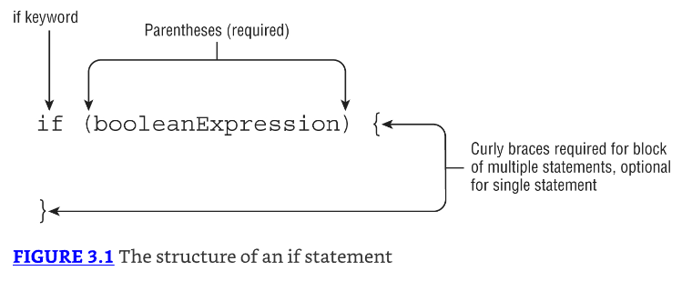
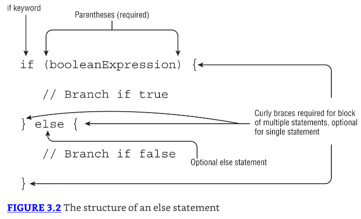

# Making Decision

## Creating Decision-Making Statements

### The if Statement

la sentencia `if` statement permite que nuestra aplicación ejecute un bloque particular de código si y solo si una expresión booleana se evalúa a true en tiempo de ejecución.



```java
if(hourOfDay < 11)
    System.out.println("Good Morning");

if(hourOfDay < 11) {
    System.out.println("Good Morning");
    morningGreetingCount++;
}
```

Ambas opciones son válidas. La segunda opción usa llaves `{}` para agrupar múltiples declaraciones en un solo bloque.

### The else Statement




---------------------------------------------------------------------
**Palabra** cuando es una palabra en inglés importante que tiene sentido traducirla, pero no es una palabra reservada

() version en ingles de la palabra anterior

`   `  solo cúando es una línea de código o una palabra reservada que va a ser explicada

```java

```


Applying switch Statements
Writing while Loops
Writing while Loops
Constructing for Loops
Controlling Flow with Branching