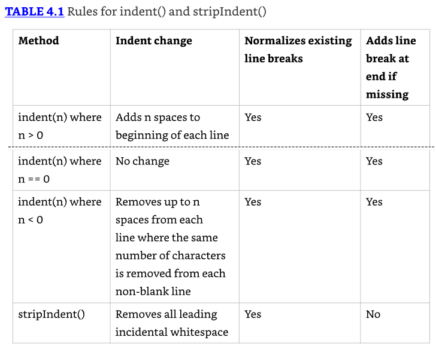
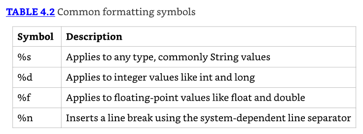
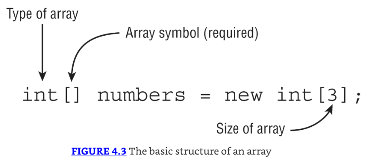
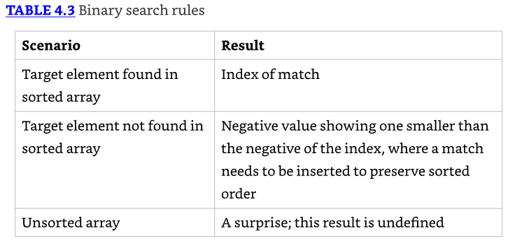
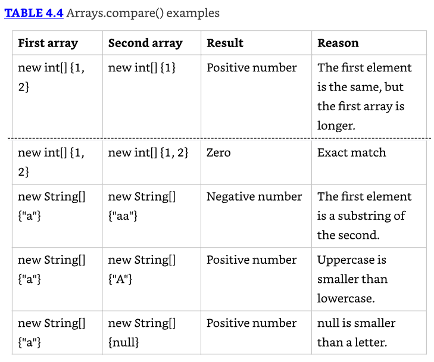
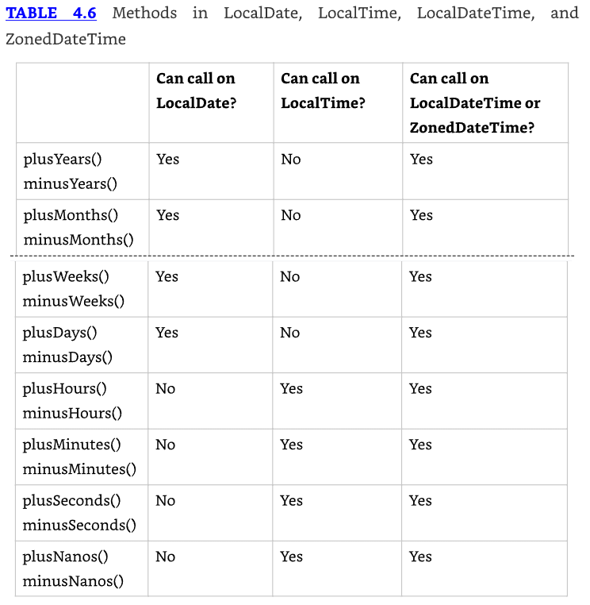

# Core APIs

## Creating and Manipulating Strings

Un string es básicamente una secuencia de caracteres; aquí hay un ejemplo:

```java
String name = "Fluffy";
String name = new String("Fluffy");
```

* Ambos te dan una variable de referencia llamada name apuntando al objeto String "Fluffy". 
* Por ahora, solo recuerda que la clase String es especial y no necesita ser instanciada con new.

Además, los bloques de texto son otra forma de crear un String. Para repasar, este bloque de texto es el mismo que las variables anteriores:

```java
String name = """
    Fluffy""";
```

* Dado que un String es una secuencia de caracteres, probablemente no te sorprenderá escuchar que implementa la interfaz CharSequence. 
* Esta interfaz es una forma general de representar varias clases, incluyendo String y StringBuilder.

### Concatenating

Colocar un String antes del otro String y combinarlos se llama string concatenation. 
No hay muchas reglas que conocer para esto, pero tienes que conocerlas bien:

1. Si ambos operando son numéricos se realiza una adición. 
2. Si uno de los operandos es un String, + significa concatenación.
3. La expresión se evalúa de izquierda a derecha.

```java
System.out.println(1 + 2);        // 3
System.out.println("a" + "b");    // ab
System.out.println("a" + "b" + 3); // ab3
System.out.println(1 + 2 + "c");  // 3c
System.out.println("c" + 1 + 2);  // c12
System.out.println("c" + null);   // cnull
```

* Hay una cosa más que saber sobre concatenación, pero es fácil. 
* En este ejemplo, solo tienes que recordar qué hace +=. Ten en cuenta, s += "2" significa lo mismo que s = s + "2".

```java
4: var s = "1"; // s currently holds "1"
5: s += "2"; // s currently holds "12"
6: s += 3; // s currently holds "123"
7: System.out.println(s);  // 123
```

* En la línea 5, estamos "sumando" dos strings, lo que significa que los concatenamos. 
* La línea 6 intenta engañarte agregando un número, pero es justo como escribimos s = s + 3. 
* Sabemos que un string "más" cualquier otra cosa significa usar concatenación.

### Important String Methods

* Para todos estos métodos, necesitas recordar que un string es una secuencia de caracteres y Java cuenta desde 0 cuando se indexa.
* También necesitas saber que un String es inmutable, o no modificable. 
* Esto significa que llamar a un método en un String devolverá un objeto String diferente en lugar de cambiar el valor de la referencia. 

### Determining the Length

El método `length()` devuelve el número de caracteres en el String

```java
// firma: public int length() 

var name = "animals";
System.out.println(name.length()); // 7
```

### Getting a Single Character

El método `charAt()` te permite consultar el string para averiguar qué carácter está en un índice específico.

```java
// firma: public char charAt(int index)

var name = "animals";
System.out.println(name.charAt(0)); // a
System.out.println(name.charAt(6)); // s
System.out.println(name.charAt(7)); // exception
```

### Finding an Index

* El método `indexOf()` mira los caracteres en el string y encuentra el primer índice que coincide con el valor deseado. 
* El método indexOf puede trabajar con un carácter individual o un String completo como entrada. 
* También puede comenzar desde una posición solicitada. 
* Recuerda que un char puede ser pasado a un parámetro de tipo int. En el examen, solo verás un char pasado a los parámetros llamados ch.

```java
// firma: public int indexOf(int ch)
// firma: public int indexOf(int ch, int fromIndex)
// firma: public int indexOf(String str)
// firma: public int indexOf(String str, int fromIndex)

var name = "animals";
System.out.println(name.indexOf('a'));     // 0
System.out.println(name.indexOf("al"));    // 4
System.out.println(name.indexOf('a', 4));  // 4
System.out.println(name.indexOf("al", 5)); // -1
```

A diferencia de charAt(), el método indexOf() no lanza una excepción si no puede encontrar una coincidencia, en su lugar devuelve -1

### Getting a Substring

* El método substring() devuelve partes del string. 
* El primer parámetro es el índice con el que comenzar para el string devuelto. 
* Hay un segundo parámetro opcional, que es el índice final en el que quieres detenerte.

```java
// firma: public String substring(int beginIndex)
// firma: public String substring(int beginIndex, int endIndex)

var name = "animals";
System.out.println(name.substring(3));                    // mals
System.out.println(name.substring(name.indexOf('m'))); // mals
System.out.println(name.substring(3, 4));                 // m
System.out.println(name.substring(3, 7));                 // mals
System.out.println(name.substring(3, 3)); // empty string
System.out.println(name.substring(3, 2)); // exception
System.out.println(name.substring(3, 8)); // exception
```

Estos métodos hacen fácil convertir tus datos. Las firmas de los métodos son las siguientes:

```java
//firma: public String toUpperCase()
//firma: public String toLowerCase()

var name = "animals";
System.out.println(name.toUpperCase()); // ANIMALS
System.out.println("Abc123".toLowerCase()); // abc123
```

El método `equals()` verifica si dos objetos String contienen exactamente los mismos caracteres en el mismo orden. 
El método `equalsIgnoreCase()` verifica si dos objetos String contienen los mismos caracteres, ignorando si están en mayúsculas o minúsculas.

```java
// firma: public boolean equals(Object obj)
// firma: public boolean equalsIgnoreCase(String str)

System.out.println("abc".equals("ABC"));               // false
System.out.println("ABC".equals("ABC"));               // true
System.out.println("abc".equalsIgnoreCase("ABC")); // true
```

---------------------------------------------------------------------
* El método `toString()` es llamado cuando intentas imprimir un objeto o concatenar el objeto con un String. 
* Es comúnmente sobrescrito con una versión que imprime una descripción única de la instancia usando sus campos de instancia.

* El método `equals(Object)` es usado para comparar objetos, con la implementación predeterminada simplemente usando el operador ==. 
* Deberías sobrescribir el método equals(Object) cada vez que quieras comparar elementos convenientemente por igualdad, especialmente si esto requiere verificar numerosos campos.

* Cada vez que sobrescribas `equals(Object)`, debes sobrescribir `hashCode()` para ser consistente. 
* Esto significa que para cualesquiera dos objetos, si a.equals(b) es true, entonces a.hashCode()==b.hashCode() también debe ser true. 
* Si no son consistentes, esto podría llevar a datos inválidos y efectos secundarios en colecciones basadas en hash como HashMap y HashSet.
---------------------------------------------------------------------

### Searching for Substrings

* Los métodos startsWith() y endsWith() miran si el valor proporcionado coincide con parte del String. 
* El método contains() no es tan particular; busca coincidencias en cualquier lugar del String.

```java
//firma: public boolean startsWith(String prefix)
//firma: public boolean endsWith(String suffix)
//firma: public boolean contains(CharSequence charSeq)

System.out.println("abc".startsWith("a")); // true
System.out.println("abc".startsWith("A")); // false

System.out.println("abc".endsWith("c")); // true
System.out.println("abc".endsWith("a")); // false

System.out.println("abc".contains("b")); // true
System.out.println("abc".contains("B")); // false
```

### Replacing Values

El método `replace()` hace una búsqueda y reemplazo simple en el string.

```java
// firma: public String replace(char oldChar, char newChar)
// firma: public String replace(CharSequence target, CharSequence replacement)

System.out.println("abcabc".replace('a', 'A')); // AbcAbc
System.out.println("abcabc".replace("a", "A")); // AbcAbc
```

* El primer ejemplo usa la primera firma del método, pasando parámetros char. 
* El segundo ejemplo usa la segunda firma del método, pasando parámetros String.

### Removing Whitespace

* Estos métodos remueven espacio en blanco del principio y/o fin de un String. 
* Los métodos `strip()` y `trim()` remueven espacios en blanco del principio y fin de un String. 
* En términos del examen, espacios en blanco consiste de espacios junto con los caracteres \t (tab) y \n (newline). 
* Otros caracteres, como \r (carriage return), también se incluyen en lo que se recorta. 
* El método strip() hace todo lo que trim() hace, pero soporta Unicode.
* Adicionalmente, el método `stripLeading()` remueve whitespace del principio del String, pero deja los del final. 
* El método `stripTrailing()` hace lo opuesto. Remueve whitespace del final del String, pero deja los del principio.

```java
// firma: public String strip()
// firma: public String stripLeading()
// firma: public String stripTrailing()
// firma: public String trim()

System.out.println("abc".strip());           // abc
System.out.println("\t a b c\n".strip());    // a b c

String text = " abc\t ";
System.out.println(text.trim().length());         // 3
System.out.println(text.strip().length());        // 3
System.out.println(text.stripLeading().length()); // 5
System.out.println(text.stripTrailing().length()); // 4
```

### Working with Indentation

* El método `indent()` agrega el mismo número de espacios en blanco al principio de cada línea si pasas un número positivo. 
* Si pasas un número negativo, intenta remover ese número de caracteres en espacios en blanco del principio de la línea. 
* Si pasas cero, la indentación no cambiará.

* Sin embargo, indent() también normaliza caracteres de espacios en blanco. ¿Qué significa normalizar whitespace, preguntas? 
* Primero, se agrega un salto de línea al final del string si no está ya ahí.
* Segundo, cualquier salto de línea se convierte al formato \n. Sin importar si tu sistema operativo usa \r\n (Windows) o\n (Mac/Unix), Java estandarizará en \n para ti.

* El método stripIndent() es útil cuando un String fue construido con concatenación en lugar de usar un bloque de texto. 
* Se deshace de todo los espacios en blanco incidentales. 
* Esto significa que todas las líneas no en blanco se desplazan a la izquierda para que el mismo número de caracteres de espacios en blanco se remueva de cada línea y el primer carácter que permanece no sea en blanco. 
* Como indent(), \r\n se convierte en \n. Sin embargo, el método stripIndent() no agrega un salto de línea final si falta.



```java
// firma: public String indent(int numberSpaces)
// firma: public String stripIndent()

10: var block = """
11:      a
12:       b
13:      c""";
14: var concat = " a\n"
15:      + " b\n"
16:      + " c";
17: System.out.println(block.length());      // 6
18: System.out.println(concat.length());     // 9
19: System.out.println(block.indent(1).length());    // 10
20: System.out.println(concat.indent(-1).length());  // 7
21: System.out.println(concat.indent(-4).length());  // 6
22: System.out.println(concat.stripIndent().length()); // 6
```

### Translating Escapes

Cuando escapamos caracteres, usamos un solo backslash. Por ejemplo, \t es un tab. 
Si no queremos este comportamiento, agregamos otro backslash para escapar el backslash, así que \\t es el string literal \t. 
El método `translateEscapes()` toma estos literales y los convierte en el carácter escapado equivalente. 

```java
// firma: public String translateEscapes()

var str = "1\\t2";
System.out.println(str);                      // 1\t2
System.out.println(str.translateEscapes()); // 1   2
```

* La primera línea imprime el string literal \t porque el backslash está escapado. 
* La segunda línea imprime un tab real, ya que tradujimos el escape. 
* Este método puede ser usado para secuencias de escape como \t (tab), \n (new line), \s (space), `"` (double quote) y `'` (single quote.)

### Checking for Empty or Blank Strings

Java proporciona métodos de conveniencia para ver si un String tiene una longitud de cero o contiene solo caracteres whitespace.

```java
// firma: public boolean isEmpty()
// firma: public boolean isBlank()

System.out.println(" ".isEmpty()); // false
System.out.println("".isEmpty()); // true
System.out.println(" ".isBlank()); // true
System.out.println("".isBlank()); // true
```

### Formatting Values

* Hay métodos para formatear valores String usando flags de formateo. 
* Dos de los métodos toman el string de formato como parámetro, y el otro usa una instancia para ese valor. 
* Los parámetros del método se usan para construir un String formateado en una sola llamada al método.

```java
//firma: public static String format(String format, Object args...)
//firma: public static String format(Locale loc, String format, Object args...)
//firma: public String formatted(Object args...)

var name = "Kate";
var orderId = 5;
// All print: Hello Kate, order 5 is ready
System.out.println("Hello "+name+", order "+orderId+" is ready");
System.out.println(String.format("Hello %s, order %d is ready", name, orderId));
System.out.println("Hello %s, order %d is ready".formatted(name, orderId));
```

En las operaciones format() y formatted(), los parámetros se insertan y formatean vía símbolos en el orden en que se proporcionan en el vararg. 



```java
var name = "James";
var score = 90.25;
var total = 100;
System.out.println("%s:%n  Score: %f out of %d".formatted(name, score, total));
```

Esto imprime lo siguiente:

```java
James:
  Score: 90.250000 out of 100
```

* Mezclar tipos de datos puede causar excepciones en tiempo de ejecución. 
* Por ejemplo, lo siguiente lanza una excepción porque un número de punto flotante se usa cuando se espera un valor entero:

`var str = "Food: %d tons".formatted(2.0); //IllegalFormatConversionException`

### Method Chaining

* En el examen, hay una tendencia a meter tanto código como sea posible en un espacio pequeño. 
* Verás código usando una técnica llamada method chaining. Aquí hay un ejemplo:

```java
String result = "AniMaL ".trim().toLowerCase().replace('a', 'A');
System.out.println(result);
```

* Para leer código que usa method chaining, se inicia en la izquierda y evalúa el primer método. 
* Luego llama el siguiente método sobre el valor devuelto del primer método. Continúa hasta que llegues al punto y coma.

## Using the StringBuilder Class

* Un programa pequeño puede crear muchos objetos String muy rápidamente. 
* Por ejemplo, ¿cuántos objetos piensas que esta pieza de código crea?

```java
10: String alpha = "";
11: for(char current = 'a'; current <= 'z'; current++)
12:   alpha += current;
13: System.out.println(alpha);
```

* El String vacío en la línea 10 se instancia, y luego la línea 12 agrega una "a". Sin embargo, como el objeto String es inmutable, un nuevo objeto String se asigna a alpha, y el objeto `""` se vuelve elegible para garbage collection. 
* La próxima vez a través del loop, alpha se asigna un nuevo objeto String, "ab", y el objeto "a" se vuelve elegible para garbage collection. 
* La siguiente iteración asigna alpha a "abc", y el objeto "ab" se vuelve elegible para garbage collection, y así sucesivamente.

* Esta secuencia de eventos continúa, y después de 26 iteraciones a través del loop, a total of 27 objetos son instanciados, la mayoría de los cuales son inmediatamente elegibles para garbage collection.
* Esto es muy ineficiente. Afortunadamente, Java tiene una solución. 
* La clase StringBuilder crea un String sin almacenar todos esos valores String intermedios. 
* A diferencia de la clase String, StringBuilder no es inmutable.

```java
15: StringBuilder alpha = new StringBuilder();
16: for(char current = 'a'; current <= 'z'; current++)
17:   alpha.append(current);
18: System.out.println(alpha);
```

* En la línea 15, se instancia un nuevo objeto StringBuilder. 
* La llamada a append() en la línea 17 agrega un carácter al objeto StringBuilder cada vez a través del loop for, agregando el valor de current al final de alpha. 
* Este código reúsa el mismo StringBuilder sin crear un String intermedio cada vez.

### Mutability and Chaining

* Cuando encadenamos llamadas a métodos String, el resultado era un nuevo String con la respuesta. 
* Encadenar métodos StringBuilder no funciona de esta manera. 
* En su lugar, el StringBuilder cambia su propio estado y devuelve una referencia a sí mismo. 

```java
4: StringBuilder sb = new StringBuilder("start");
5: sb.append("+middle");  // sb = "start+middle"
6: StringBuilder same = sb.append("+end"); // "start+middle+end"
```

* La línea 5 agrega texto al final de sb. 
* También devuelve una referencia a sb, que se ignora. 
* La línea 6 también agrega texto al final de sb y devuelve una referencia a sb. 
* Esta vez la referencia se almacena en same. 
* Esto significa sb y same apuntan al mismo objeto e imprimirían el mismo valor.

### Creating a StringBuilder

Hay tres formas de construir un StringBuilder:

```java
StringBuilder sb1 = new StringBuilder();
StringBuilder sb2 = new StringBuilder("animal");
StringBuilder sb3 = new StringBuilder(10);
```

Estos cuatro métodos funcionan exactamente igual que en la clase String:

```java
var sb = new StringBuilder("animals");
String sub = sb.substring(sb.indexOf("a"), sb.indexOf("al"));
int len = sb.length();
char ch = sb.charAt(6);
System.out.println(sub + " " + len + " " + ch);
```

* La respuesta correcta es anim 7 s. 
* El método indexOf() devuelve 0 y 4, respectivamente. 
* El método substring() devuelve el String comenzando con el índice 0 y terminando justo antes del índice 4.
* El método length() devuelve 7 porque es el número de caracteres en el StringBuilder en lugar de un índice. 
* Finalmente, charAt() devuelve el carácter en el índice 6. 

* Nota que substring() devuelve un String en lugar de un StringBuilder. Es por eso que sb no se cambia. 
* El método substring() es realmente solo un método que consulta sobre el estado del StringBuilder.

### Appending Values

el método `append()` agrega el valor proporcionado al final del StringBuilder.

```java
// firma: public StringBuilder append(String str) 
// este método tiene  unas 10 firmas diferentes para varios tipos de datos primitivos

var sb = new StringBuilder().append(1).append('c');
sb.append("-").append(true);
System.out.println(sb);  // 1c-true
```

### Inserting Data

El método `insert()` agrega caracteres al StringBuilder en el índice solicitado y devuelve una referencia al StringBuilder actual.

```java
// firma: public StringBuilder insert(int offset, String str)
// este método tiene unas 10 firmas diferentes para varios tipos de datos primitivos

3: var sb = new StringBuilder("animals");
4: sb.insert(7, "-");      // sb = animals-
5: sb.insert(0, "-");      // sb = -animals-
6: sb.insert(4, "-");      // sb = -ani-mals-
7: System.out.println(sb);
```

### Deleting Contents

El método delete() remueve caracteres de la secuencia y devuelve una referencia al StringBuilder actual. 
El método deleteCharAt() es conveniente cuando quieres eliminar solo un carácter.

```java
//firma: public StringBuilder delete(int startIndex, int endIndex)
//firma: public StringBuilder deleteCharAt(int index)

var sb = new StringBuilder("abcdef");
sb.delete(1, 3);        // sb = adef
sb.deleteCharAt(5);     // exception
```

* El método delete() es más flexible que algunos otros cuando se trata de índices de array. 
* Si especificas un segundo parámetro que está más allá del final del StringBuilder, Java simplemente asumirá que querías decir el final. 

```java
var sb = new StringBuilder("abcdef");
sb.delete(1, 100);      // sb = a
```

### Replacing Portions

El método replace() funciona de manera diferente para StringBuilder de lo que hizo para String

```java
// firma: public StringBuilder replace(int startIndex, int endIndex, String newString)

var builder = new StringBuilder("pigeon dirty");
builder.replace(3, 6, "sty");
System.out.println(builder); // pigsty dirty
```

* Primero, Java elimina los caracteres comenzando con el índice 3 y terminando justo antes del índice 6. 
* Esto nos da pig dirty. Luego Java inserta el valor "sty" en esa posición.
* En este ejemplo, el número de caracteres removidos e insertados son los mismos. 

```java
var builder = new StringBuilder("pigeon dirty");
builder.replace(3, 100, "");
System.out.println(builder);
```

* Imprime "pig". Recuerda, el método primero está haciendo un delete lógico. 
* El método replace() permite especificar un segundo parámetro que está más allá del final del StringBuilder. 
* Eso significa que solo permanecen los primeros tres caracteres.

### Reversing

El método reverse() hace justo lo que suena: invierte los caracteres en las secuencias y devuelve una referencia al StringBuilder actual.

```java
// firma: public StringBuilder reverse()

var sb = new StringBuilder("ABC");
sb.reverse();
System.out.println(sb);
```

Como se esperaba, esto imprime CBA. 

## Understanding Equality

### Comparing equals() and ==

Considera el siguiente código que usa == con objetos:

```java
var one = new StringBuilder();
var two = new StringBuilder();
var three = one.append("a");
System.out.println(one == two); // false
System.out.println(one == three); // true
```

* Dado que este ejemplo no está tratando con primitivos, debemos buscar si las referencias se refieren al mismo objeto. 
* Las variables one y two son ambos objetos StringBuilder completamente separados, dándonos dos objetos. 
* Por lo tanto, el primer statement de impresión nos da false. La variable three es más interesante. 
* ¿Recuerda cómo a los métodos StringBuilder les gusta devolver la referencia actual para encadenar? 
* Esto significa que one y three ambos apuntan al mismo objeto, y el segundo statement de impresión nos da true.

Viste anteriormente que equals() usa igualdad lógica en lugar de igualdad de objetos para objetos String:

```java
var x = "Hello World";
var z = " Hello World".trim();
System.out.println(x.equals(z)); // true
```

* Esto funciona porque la clase String implementa el método equals() para verificar los valores dentro del String en lugar de la referencia del string en sí. 
* Si una clase no tiene un método equals(), Java determina si las referencias apuntan al mismo objeto, que es exactamente lo que == hace.

* En caso de que te estés preguntando, los autores de StringBuilder no implementaron equals(). 
* Si llamas equals() en dos instancias StringBuilder, verificará igualdad de referencia. 
* Puedes llamar a toString() en StringBuilder para obtener un String para verificar igualdad en su lugar.

### The String Pool

* Java se da cuenta de que muchos strings se repiten en el programa y resuelve este problema reutilizando los comunes. 
* El string pool, también conocido como intern pool, es una ubicación en la Java Virtual Machine (JVM) que recolecta todos estos strings.

* El string pool contiene valores literales y constantes que aparecen en tu programa. 
* Por ejemplo, "name" es un literal y, por lo tanto, va al string pool. 
* El método `myObject.toString()` devuelve un string, pero no un literal, así que no va al string pool.

Ahora visitemos el escenario más complejo y confuso, igualdad de String, hecho así en parte debido a la forma en que la JVM reúsa literales String.

```java
var x = "Hello World";
var y = "Hello World";
System.out.println(x == y); // true
```

* Recuerda que un String es inmutable y los literales se agrupan. 
* La JVM creó solo un literal en memoria. Las variables x e y ambos apuntan a la misma ubicación en memoria; por lo tanto, el statement imprime true. 

Se pone aún más complicado. Considera este código:

```java
var x = "Hello World";
var z = " Hello World".trim();
System.out.println(x == z); // false
```

* En este ejemplo, no tenemos dos del mismo literal String. 
* Aunque x y z sucede que evalúan al mismo string, uno se calcula en tiempo de ejecución. 
* Dado que no es lo mismo en tiempo de compilación, se crea un nuevo objeto String. 

Intentemos otro. ¿Qué piensas que se imprime aquí?

```java
var singleString = "hello world";
var concat = "hello ";
concat += "world";
System.out.println(singleString == concat); // false
```

Esto imprime false. Llamar += es justo como llamar a un método y resulta en un nuevo String. 

Puedes decirle a Java que use el string pool. El método intern() usará un objeto en el string pool si uno está presente.

```java
// firma: public String intern()

var name = "Hello World";
var name2 = new String("Hello World").intern();
System.out.println(name == name2); // true
```

* Primero le decimos a Java que use el string pool normalmente para name. 
* Luego, para name2, le decimos a Java que cree un nuevo objeto usando el constructor, pero que lo interne y use el string pool de todos modos. 
* Dado que ambas variables apuntan a la misma referencia en el string pool, podemos usar el operador ==.

## Understanding Arrays

* Un array es un área de memoria en el heap con espacio para un número designado de elementos. 
* Un String está implementado como un array con algunos métodos que podrías querer usar cuando trabajes con caracteres específicamente.

### Creating an Array of Primitives

* La forma más común de crear un array se muestra en Figure 4.3. 
* Especifica el tipo del array (int) y el tamaño (3). Los corchetes te dicen que esto es un array.



* Cuando usas esta forma para instanciar un array, todos los elementos se establecen al valor predeterminado para ese tipo. 
* Como aprendiste en Chapter 1, el valor predeterminado de un int es 0. 
* Dado que numbers es una variable de referencia, apunta al objeto array. 
* Además, los índices comienzan con 0 y cuentan hacia arriba, justo como lo hicieron para un String.

Otra forma de crear un array es especificar todos los elementos con los que debería comenzar:

`int[] moreNumbers = new int[] {42, 55, 99};`

* En este ejemplo, también creamos un array int de tamaño 3. 
* Esta vez, especificamos los valores iniciales de esos tres elementos en lugar de usar los valores predeterminados.

* Java reconoce que esta expresión es redundante. 
* Dado que estás especificando el tipo del array en el lado izquierdo del signo de iguales, Java ya conoce el tipo.
* Y dado que estás especificando los valores iniciales, ya conoce el tamaño. Como atajo, Java te permite escribir esto:

`int[] moreNumbers = {42, 55, 99};`

Este enfoque se llama un anonymous array. Es anónimo porque no especificas el tipo y tamaño.

* Finalmente, puedes escribir los [] antes o después del nombre, y agregar un espacio es opcional. 
* Esto significa que los cinco de estos statements hacen exactamente lo mismo:

```java
int[] numAnimals;
int [] numAnimals2;
int []numAnimals3;
int numAnimals4[];
int numAnimals5 [];
```

### Creating an Array with Reference Variables

* Puedes elegir cualquier tipo Java para ser el tipo del array. 
* Esto incluye clases que creas tú mismo.
* Echemos un vistazo a un tipo incorporado con String:

```java
String[] bugs = { "cricket", "beetle", "ladybug" };
String[] alias = bugs;
System.out.println(bugs.equals(alias)); // true
System.out.println(bugs.toString()); // [Ljava.lang.String;@160bc7c0
```

* Podemos llamar a equals() porque un array es un objeto. 
* Devuelve true debido a igualdad de referencia. 
* El método equals() en arrays no mira los elementos del array. Recuerda, esto funcionaría incluso en un int[] también. 
* El tipo int es un primitivo; int[] es un objeto.

* El segundo statement de impresión es aún más interesante. ¿Qué demonios es `[Ljava.lang.String;@160bc7c0`? 
* No tienes que saber esto para el examen, pero `[L` significa que es un array, `java.lang.String` es el tipo de referencia, y `160bc7c0` es el código hash. 
* Obtendrás diferentes números y letras cada vez que lo ejecutes, ya que esto es una referencia.

```java
public class Names {
   String names[];
}
```

La respuesta es null. El código nunca instanció el array, así que es solo una variable de referencia a null.


```java
public class Names {
    String names[] = new String[2];
}
```

* Es un array porque tiene corchetes. Es un array de tipo String, ya que ese es el tipo mencionado en la declaración. 
* Tiene dos elementos porque la longitud es 2. Cada uno de esos dos slots actualmente es null, pero tiene el potencial de apuntar a un objeto String.

### Using an Array

Ahora que sabes cómo crear un array, intentemos acceder a uno:

```java
4: String[] mammals = {"monkey", "chimp", "donkey"};
5: System.out.println(mammals.length);     // 3
6: System.out.println(mammals[0]);         // monkey
7: System.out.println(mammals[1]);         // chimp
8: System.out.println(mammals[2]);         // donkey
```

* La línea 4 declara e inicializa el array. 
* La línea 5 nos dice cuántos elementos puede contener el array. 
* El resto del código imprime el array. 

* Es muy común usar un loop cuando se lee o escribe en un array. 
* Este loop establece cada elemento de numbers a cinco más que el índice actual:

```java
5: var numbers = new int[10];
6: for (int i = 0; i < numbers.length; i++)
7:    numbers[i] = i + 5;
```

### Sorting

Java hace fácil ordenar un array proporcionando el método Arrays.sort().

Arrays requiere un import. Para usarlo, debes tener uno de los siguientes dos statements en tu clase:

```java
import java.util.*;     // import whole package including Arrays
import java.util.Arrays;  // import just Arrays

int[] numbers = { 6, 9, 1 };
Arrays.sort(numbers);
for (int i = 0; i < numbers.length; i++)
        System.out.print(numbers[i] + " ");

// El resultado es 1 6 9
```

### Searching

Java también proporciona una forma conveniente de buscar, pero solo si el array ya está ordenado.



```java
3: int[] numbers = {2,4,6,8};
4: System.out.println(Arrays.binarySearch(numbers, 2)); // 0
5: System.out.println(Arrays.binarySearch(numbers, 4)); // 1
6: System.out.println(Arrays.binarySearch(numbers, 1)); // -1
7: System.out.println(Arrays.binarySearch(numbers, 3)); // -2
8: System.out.println(Arrays.binarySearch(numbers, 9)); // -5
```

* Toma nota del hecho de que la línea 3 es un array ordenado. Si no lo fuera, no podríamos aplicar ninguna de las otras reglas. 
* La línea 4 busca el índice de 2. La respuesta es índice 0. La línea 5 busca el índice de 4, que es 1.
* La línea 6 busca el índice de 1. Aunque 1 no está en la lista, la búsqueda puede determinar que debería ser insertado en el elemento 0 para preservar el orden ordenado. 
* Dado que 0 ya significa algo para los índices de array, Java necesita restar 1 para darnos la respuesta de –1. 
* La línea 7 es similar. Aunque 3 no está en la lista, necesitaría ser insertado en el elemento 1 para preservar el orden ordenado. Negamos y restamos 1 por consistencia, obteniendo –1 –1, también conocido como –2. 
* Finalmente, la línea 8 quiere decirnos que 9 debería ser insertado en el índice 4. Nuevamente, negamos y restamos 1, obteniendo –4 –1, también conocido como –5.

### Comparing

Hay un montón de reglas que necesitas saber antes de llamar a `compare()`.

Primero necesitas aprender qué significa el valor de retorno. No necesitas saber los valores de retorno exactos, pero sí necesitas saber lo siguiente:

* Un número negativo significa que el primer array es más pequeño que el segundo.
* Un zero significa que los arrays son iguales.
* Un número positivo significa que el primer array es más grande que el segundo.

`System.out.println(Arrays.compare(new int[] {1}, new int[] {2}));`

Este código imprime un número negativo. Debería ser bastante intuitivo que 1 es más pequeño que 2, haciendo el primer array más pequeño.

Ahora que sabes cómo comparar un solo valor, veamos cómo comparar arrays de diferentes longitudes:

* Si ambos arrays tienen la misma longitud y tienen los mismos valores en cada posición en el mismo orden, devuelve cero.
* Si todos los elementos son iguales, pero el segundo array tiene elementos extra al final, devuelve un número negativo.
* Si todos los elementos son iguales, pero el primer array tiene elementos extra al final, devuelve un número positivo.
* Si el primer elemento que difiere es más pequeño en el primer array, devuelve un número negativo.
* Si el primer elemento que difiere es más grande en el primer array, devuelve un número positivo.

Finalmente, ¿qué significa más pequeño? Aquí hay algunas reglas más que aplican aquí y a compareTo()

* El `null` es más pequeño que otro valor
* Para los números, se aplica el orden numérico normal.
* Para las cadenas, uno es más pequeño si es un prefijo de otro.
* Para cadenas/caracteres, los números son más pequeños que las letras.
* Para cadenas/caracteres, las mayúsculas son más pequeñas que las minúsculas.



```java
System.out.println(Arrays.compare(
   new int[] {1}, new String[] {"a"})); // DOES NOT COMPILE
```

Finalmente, este código no compila porque los tipos son diferentes. Cuando comparas dos arrays, deben ser del mismo tipo de array.

### Using mismatch()

Si los arrays son iguales, `mismatch()` devuelve -1. De lo contrario, devuelve el primer índice donde difieren. 

```java
System.out.println(Arrays.mismatch(new int[] {1}, new int[] {1}));
System.out.println(Arrays.mismatch(new String[] {"a"},new String[] {"A"}));
System.out.println(Arrays.mismatch(new int[] {1, 2}, new int[] {1}));
```

* En el primer ejemplo, los arrays son iguales, así que el resultado es -1. 
* En el segundo ejemplo, las entradas en el elemento 0 no son iguales, así que el resultado es 0. 
* En el tercer ejemplo, las entradas en el elemento 0 son iguales, así que seguimos buscando. 
* El elemento en el índice 1 no es igual. O, más específicamente, un array tiene un elemento en el índice 1, y el otro no. 
* Por lo tanto, el resultado es 1.

### Using Methods with Varargs

Cuando uno se pasa a tu método, hay otra manera en que puede verse. Aquí hay tres ejemplos con un método `main()`:

```java
public static void main(String[] args)
public static void main(String args[])
public static void main(String... args) // varargs
```

Puedes usar una variable definida usando varargs como si fuera un array normal. Por ejemplo, `args.length` y `args[0]` son legales.

### Creating a Multidimensional Array

Múltiples separadores de array es todo lo que se necesita para declarar arrays con múltiples dimensiones.

```java
int[][] vars1;      // 2D array
int vars2 [][];     // 2D array
int[] vars3[];      // 2D array
int[] vars4 [], space [][]; // a 2D AND a 3D array
```

El ejemplo final declara dos arrays en la misma línea. Sumando los corchetes, vemos que `vars4` es un array 2D y `space` es un array 3D.

Puedes especificar el tamaño de tu array multidimensional en la declaración si te gusta:

`String [][] rectangle = new String[3][2];`

Puedes pensar en el rango direccionable como `[0][0] `hasta `[2][1]`, pero no pienses en él como una estructura de direcciones como `[0,0]` o `[2,1]`.

Ahora supongamos que establecemos uno de estos valores:  `rectangle[0][1] = "set";`

* Este array está poblado escasamente porque tiene muchos valores null.
* Comienzas en el índice 0 en el array superior. Luego vas al índice 1 en el siguiente array.

`int[][] differentSizes = {{1, 4}, {3}, {9,8,7}};`

* Aún comenzamos con un array de tres elementos. 
* Sin embargo, esta vez los elementos en el siguiente nivel son todos de diferentes tamaños. 
* Uno es de longitud 2, la siguiente longitud 1, y el último longitud 3.

Otra manera de crear un array asimétrico es inicializar solo la primera dimensión de un array y definir el tamaño de cada componente de array en una declaración separada:

```java
int [][] args = new int[4][];
args[0] = new int[5];
args[1] = new int[3];
```

Esta técnica revela lo que realmente obtienes con Java: arrays de arrays que, apropiadamente gestionados, ofrecen un efecto multidimensional.

### Using a Multidimensional Array

La operación más común en un array multidimensional es hacer un loop a través de él. Este ejemplo imprime un array 2D:

```java
var twoD = new int[3][2];
for(int i = 0; i < twoD.length; i++) {
   for(int j = 0; j < twoD[i].length; j++)
      System.out.print(twoD[i][j] + " "); // print element
   System.out.println();      // time for a new row
}
```

## Calculating with Math APIs

### Finding the Minimum and Maximum

Los métodos min() y max() comparan dos valores y devuelven uno de ellos.

```java
public static double min(double a, double b)
public static float min(float a, float b)
public static int min(int a, int b)
public static long min(long a, long b)

int first = Math.max(3, 7); // 7
int second = Math.min(7, -9); // -9
```

### Rounding Numbers

* El método `round()` se deshace de la porción decimal del valor, eligiendo el siguiente número más alto si es apropiado. 
* Si la parte fraccionaria es .5 o mayor, redondeamos hacia arriba.

```java
public static long round(double num)
public static int round(float num)

long low = Math.round(123.45);  // 123
long high = Math.round(123.50);  // 124
int fromFloat = Math.round(123.45f); // 123
```

### Determining the Ceiling and Floor

* El método `ceil()` toma un valor double. Si es un número entero, devuelve el mismo valor.
* Si tiene algún valor fraccionario, redondea hacia arriba al siguiente número entero. 
* Por el contrario, el método `floor()` descarta cualquier valor después del decimal.

```java
public static double ceil(double num)
public static double floor(double num)

double c = Math.ceil(3.14); // 4.0
double f = Math.floor(3.14); // 3.0
```

### Calculating Exponents

* El método `pow()` maneja exponentes.
* Los exponentes fraccionarios también están permitidos. Dieciséis a la potencia .5 significa la raíz cuadrada de 16, que es 4. 

```java
public static double pow(double number, double exponent)

double squared = Math.pow(5, 2); // 25.0
```

### Generating Random Numbers

El método `random()` devuelve un valor mayor que o igual a 0 y menor que 1. La firma de método es la siguiente:

```java
public static double random()

double num = Math.random();
```

## Working with Dates and Times

Necesitas una declaración import para trabajar con las clases modernas de fecha y hora. Para usarla, añade este import a tu programa:

`import java.time.*; // import time classes`

### Creating Dates and Times

Cuando trabajas con fechas y tiempos, lo primero que hay que hacer es decidir cuánta información necesitas. El examen te da cuatro opciones:

**LocalDate** Contiene solo una fecha—no hay hora y no hay zona horaria. 

**LocalTime** Contiene solo una hora—no hay fecha y no hay zona horaria. 

**LocalDateTime** Contiene tanto una fecha como una hora, pero no hay zona horaria. 

**ZonedDateTime** Contiene una fecha, hora, y zona horaria. 

```java
System.out.println(LocalDate.now());
System.out.println(LocalTime.now());
System.out.println(LocalDateTime.now());
System.out.println(ZonedDateTime.now());

// 2021-10-25
// 09:13:07.768
// 2021-10-25T09:13:07.768
// 2021-10-25T09:13:07.769-05:00[America/New_York]
```

* Ambos pasan el año, mes, y fecha. Aunque es bueno usar las constantes Month (para hacer el código más fácil de leer), puedes pasar el número int del mes directamente. 
* Solo usa el número del mes de la misma manera que lo harías si estuvieras escribiendo la fecha en la vida real.

```java
public static LocalDate of(int year, int month, int dayOfMonth)
public static LocalDate of(int year, Month month, int dayOfMonth)

var date1 = LocalDate.of(2022, Month.JANUARY, 20);
var date2 = LocalDate.of(2022, 1, 20);
```

* Cuando creas una hora, puedes elegir qué tan detallado quieres ser. Puedes especificar solo la hora y minuto, o puedes incluir el número de segundos. 
* Incluso puedes incluir nanosegundos si quieres ser muy preciso. 

```java
public static LocalDate of(int year, int month, int dayOfMonth)
public static LocalDate of(int year, Month month, int dayOfMonth)

var time1 = LocalTime.of(6, 15);         // hour and minute
var time2 = LocalTime.of(6, 15, 30);     // + seconds
var time3 = LocalTime.of(6, 15, 30, 200); // + nanoseconds
```

Puedes combinar fechas y tiempos en un objeto:

```java
public static LocalDateTime of(int year, int month, int dayOfMonth, int hour, int minute)
public static LocalDateTime of(int year, int month, int dayOfMonth, int hour, int minute, int second)
public static LocalDateTime of(int year, int month, int dayOfMonth, int hour, int minute, int second, int nanos)

public static LocalDateTime of(int year, Month month, int dayOfMonth, int hour, int minute)
public static LocalDateTime of(int year, Month month, int dayOfMonth, int hour, int minute, int second)
public static LocalDateTime of(int year, Month month, int dayOfMonth, int hour, int minute, int second, int nanos)

public static LocalDateTime of(LocalDate date, LocalTime time)
    
var dateTime1 = LocalDateTime.of(2022, Month.JANUARY, 20, 6, 15, 30);
var dateTime2 = LocalDateTime.of(date1, time1);
```

Para crear un ZonedDateTime, primero necesitamos obtener la zona horaria deseada. Usaremos US/Eastern en nuestros ejemplos:

```java
public static ZonedDateTime of(int year, int month, int dayOfMonth, int hour, int minute, int second, int nanos, ZoneId zone)
public static ZonedDateTime of(LocalDate date, LocalTime time, ZoneId zone)
public static ZonedDateTime of(LocalDateTime dateTime, ZoneId zone)

var zone = ZoneId.of("US/Eastern");
var zoned1 = ZonedDateTime.of(2022, 1, 20, 6, 15, 30, 200, zone);
var zoned2 = ZonedDateTime.of(date1, time1, zone);
var zoned3 = ZonedDateTime.of(dateTime1, zone);
```

* Nota que no hay una opción para pasar el enum Month. Además, no usamos un constructor en ninguno de los ejemplos. 
* Las clases de fecha y hora tienen constructores privados junto con métodos estáticos que devuelven instancias. 
* Esto se conoce como el factory pattern. Los creadores del examen pueden lanzarte algo como esto:

`var d = new LocalDate(); // DOES NOT COMPILE`

* No caigas en esto. No se te permite construir un objeto de fecha o hora directamente.
* Otro truco es qué sucede cuando pasas números inválidos a of(), por ejemplo:

`var d = LocalDate.of(2022, Month.JANUARY, 32) // java.time.DateTimeException: Invalid value for DayOfMonth (valid values 1-28/31): 32`

### Manipulating Dates and Times

* Añadir a una fecha es fácil. Las clases de fecha y hora son inmutables. 
* Recuerda asignar los resultados de estos métodos a una variable de referencia para que no se pierdan.

```java
12: var date = LocalDate.of(2022, Month.JANUARY, 20);
13: System.out.println(date);  // 2022-01-20
14: date = date.plusDays(2);
15: System.out.println(date);  // 2022-01-22
16: date = date.plusWeeks(1);
17: System.out.println(date);  // 2022-01-29
18: date = date.plusMonths(1);
19: System.out.println(date);  // 2022-02-28
20: date = date.plusYears(5);
21: System.out.println(date);  // 2027-02-28
```

También hay métodos agradables y fáciles para retroceder en el tiempo. Esta vez, trabajemos con LocalDateTime:

```java
22: var date = LocalDate.of(2024, Month.JANUARY, 20);
23: var time = LocalTime.of(5, 15);
24: var dateTime = LocalDateTime.of(date, time);
25: System.out.println(dateTime);   // 2024-01-20T05:15
26: dateTime = dateTime.minusDays(1);
27: System.out.println(dateTime);   // 2024-01-19T05:15
28: dateTime = dateTime.minusHours(10);
29: System.out.println(dateTime);   // 2024-01-18T19:15
30: dateTime = dateTime.minusSeconds(30);
31: System.out.println(dateTime);   // 2024-01-18T19:14:30
```

* Es común que los métodos de fecha y hora se encadenen. 
* Por ejemplo, sin las declaraciones print, el ejemplo anterior podría reescribirse de la siguiente manera:

```java
var date = LocalDate.of(2024, Month.JANUARY, 20);
var time = LocalTime.of(5, 15);
var dateTime = LocalDateTime.of(date, time)
   .minusDays(1).minusHours(10).minusSeconds(30);
```



### Working with Periods

```java
public static void main(String[] args) {
   var start = LocalDate.of(2022, Month.JANUARY, 1);
    var end = LocalDate.of(2022, Month.MARCH, 30);
    performAnimalEnrichment(start, end);
}
private static void performAnimalEnrichment(LocalDate start, LocalDate end) {
    var upTo = start;
    while (upTo.isBefore(end)) { // check if still before end
        System.out.println("give new toy: " + upTo);
        upTo = upTo.plusMonths(1); // add a month
    } }
```

* Este código funciona bien. Añade un mes a la fecha hasta que alcanza la fecha final. 
* El problema es que este método no puede reutilizarse.

* Afortunadamente, Java tiene una clase Period que podemos pasar. 
* Este código hace lo mismo que el ejemplo anterior:

```java
public static void main(String[] args) {
   var start = LocalDate.of(2022, Month.JANUARY, 1);
   var end = LocalDate.of(2022, Month.MARCH, 30);
   var period = Period.ofMonths(1); // create a period
   performAnimalEnrichment(start, end, period);
}
private static void performAnimalEnrichment(LocalDate start, LocalDate end, Period period) { // uses the generic period
   var upTo = start;
   while (upTo.isBefore(end)) {
      System.out.println("give new toy: " + upTo);
      upTo = upTo.plus(period); // adds the period
   } }
```

* El método puede añadir un período arbitrario de tiempo que se pasa. 
* Esto nos permite reutilizar el mismo método para diferentes períodos de tiempo.

Hay cinco formas de crear una clase Period:


---------------------------------------------------------------------
**Palabra** cuando es una palabra en inglés importante que tiene sentido traducirla, pero no es una palabra reservada

() version en ingles de la palabra anterior

`   `  solo cúando es una línea de código o una palabra reservada que va a ser explicada

```java

```


Working with Dates and Times