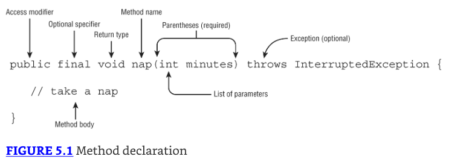
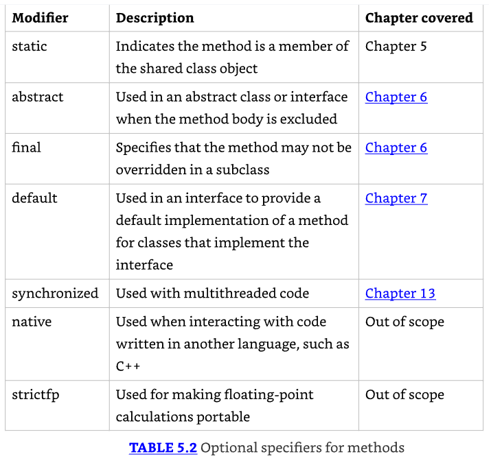
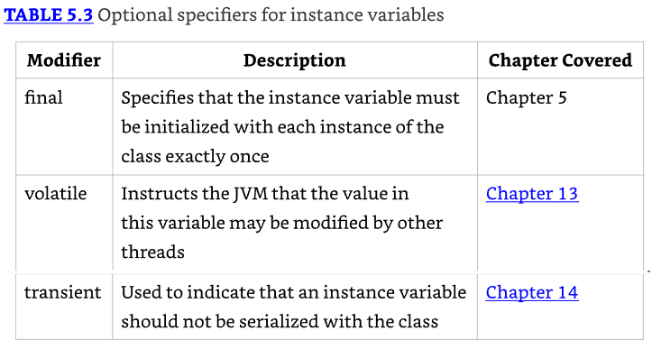
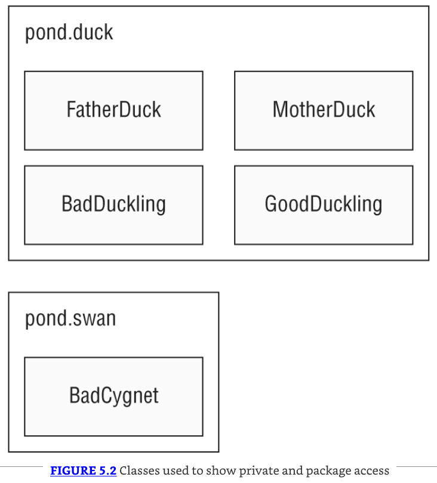
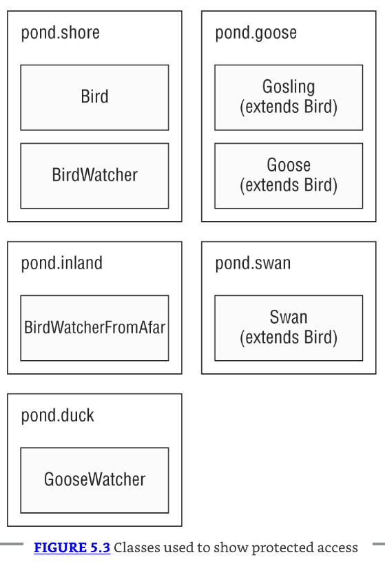
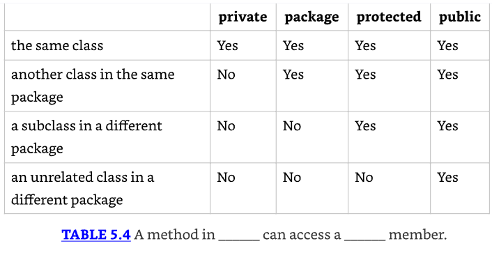
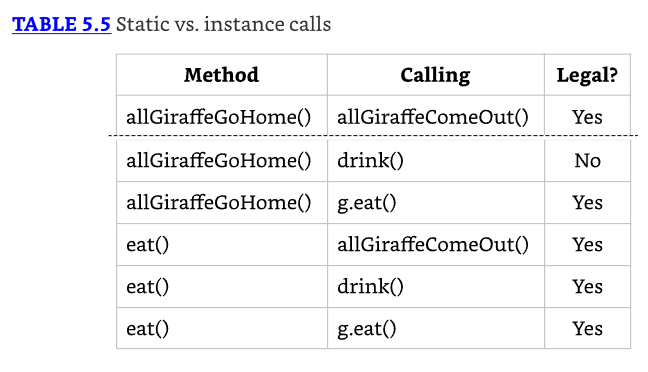

# Methods

## Designing Methods

Un método tiene la siguiente estructura básica:



*  Dos de las partes—el nombre del método y la lista de parámetros—son llamadas la **method signature**. 
*  La firma del método proporciona instrucciones para cómo los llamadores pueden referenciar este método. 
*  La firma del método no incluye el tipo de retorno ni los modificadores de acceso, los cuales controlan dónde el método puede ser referenciado.


### Access Modifiers

* Los modificadores de acceso ayudan a hacer cumplir cuándo estos componentes tienen permitido hablar entre sí. 

El modificador `private` significa que el método puede ser llamado solo desde dentro de la misma clase.

* El modificador  `Package` significa que el método puede ser llamado solo desde una clase en el mismo paquete. 
* Este es complicado porque no hay keyword. Simplemente, omites el modificador de acceso. 
* El acceso de paquete a veces se refiere como package-private o default access (¡incluso dentro de este libro!).

El modificador  `protected` significa que el método puede ser llamado solo desde una clase en el mismo paquete o una subclase.

El modificador  `public` significa que el método puede ser llamado desde cualquier lugar.

```java
public class ParkTrip {
    public void skip1() {}
    default void skip2() {} // DOES NOT COMPILE
    void public skip3() {} // DOES NOT COMPILE
    void skip4() {}
}
```

* El método skip1() es una declaración válida con acceso public. 
* El método skip4() es una declaración válida con acceso de paquete. 
* El método skip2() no compila porque default no es un modificador de acceso válido. 
* Hay una keyword default, la cual es usada en sentencias switch e interfaces, pero default nunca es usada como un modificador de acceso. 
* El método skip3() no compila porque el modificador de acceso está especificado después del tipo de retorno.

### Optional Specifiers

* Hay un número de especificadores opcionales para métodos, mostrados en Table 5.2. 
* A diferencia de los modificadores de acceso, puedes tener múltiples especificadores en el mismo método (aunque no todas las combinaciones son legales). 
* Cuando esto sucede, puedes especificarlos en cualquier orden. 
* Y dado que estos especificadores son opcionales, tienes permitido no tener ninguno de ellos en absoluto.



```java
public class Exercise {
    public void bike1() {}
    public final void bike2() {}
    public static final void bike3() {}
    public final static void bike4() {}
    public modifier void bike5() {}     // DOES NOT COMPILE
    public void final bike6() {}        // DOES NOT COMPILE
    final public void bike7() {}
}
```

* El método bike1() es una declaración válida sin especificador opcional. Esto está bien—es opcional, después de todo. 
* El método bike2() es una declaración válida, con final como el especificador opcional. 
* Los métodos bike3() y bike4() son declaraciones válidas con tanto final como static como especificadores opcionales. El orden de estas dos keywords no importa. 
* El método bike5() no compila porque modifier no es un especificador opcional válido. 
* El método bike6() no compila porque el especificador opcional está después del tipo de retorno. 
* El método bike7() sí compila. 

* Java permite que los especificadores opcionales aparezcan antes del modificador de acceso. 
* Este es un caso extraño y no uno que necesitas conocer para el examen. 
* Lo estamos mencionando para que no te confundas cuando practiques.

### Return Type

* El siguiente elemento en una declaración de método es el tipo de retorno. 
* Debe aparecer después de cualquier modificador de acceso o especificadores opcionales y antes del nombre del método. 
* El tipo de retorno podría ser un tipo Java real como String o int. Si no hay tipo de retorno, la keyword `void` es usada.

```java
public class Hike {
    public void hike1() {}
    public void hike2() { return; }
    public String hike3() { return ""; }
    public String hike4() {}           // DOES NOT COMPILE
    public hike5() {}                  // DOES NOT COMPILE
    public String int hike6() { }      // DOES NOT COMPILE
    String hike7(int a) {              // DOES NOT COMPILE
        if(1 < 2) return "orange";
    }
}
```

* Dado que el tipo de retorno del método hike1() es void, la sentencia return es opcional. 
* El método hike2() muestra la sentencia return opcional que correctamente no devuelve nada. 
* El método hike3() es una declaración válida con un tipo de retorno String y una sentencia return que devuelve un String. 
* El método hike4() no compila porque la sentencia return falta. 
* El método hike5() no compila porque el tipo de retorno falta. 
* El método hike6() no compila porque intenta usar dos tipos de retorno. Obtienes solo un tipo de retorno.
* El método hike7() es un poco complicado. Hay una sentencia return, pero no siempre se ejecuta. 
* Aunque 1 es siempre menor que 2, el compilador no evaluará completamente la sentencia if y requiere una sentencia return si esta condición es falsa. 

### Method Name

* Los nombres de método siguen las mismas reglas que practicamos con nombres de variable.
* Por convención, los métodos comienzan con una letra minúscula, pero no están obligados a hacerlo.

```java
public class BeachTrip {
    public void jog1() {}
    public void 2jog() {} // DOES NOT COMPILE
    public jog3 void() {} // DOES NOT COMPILE
    public void Jog_$() {}
    public _() {}         // DOES NOT COMPILE
    public void() {}      // DOES NOT COMPILE
}
```

* El método `jog1()` es una declaración válida con un nombre tradicional. 
* El método `2jog()` no compila porque los identificadores no tienen permitido comenzar con números. 
* El método `jog3()` no compila porque el nombre del método está antes del tipo de retorno. 
* El método `Jog_$()` es una declaración válida. Mientras que ciertamente no es una buena práctica comenzar un nombre de método con una letra mayúscula y terminar con puntuación, es legal. 
* El método `_` no está permitido, ya que consiste de un solo guion bajo. 
* La línea final de código no compila porque el nombre del método falta.

### Parameter List

* Aunque la lista de parámetros es requerida, no tiene que contener ningún parámetro. 
* Esto significa que puedes tener simplemente un par vacío de paréntesis después del nombre del método, como sigue:

```java
public class PhysicalEducation {
    public void run1() {}
    public void run2 {}            // DOES NOT COMPILE
    public void run3(int a) {}
    public void run4(int a; int b) {} // DOES NOT COMPILE
    public void run5(int a, int b) {}
}
```

* El método run1() es una declaración válida sin ningún parámetro. 
* El método run2() no compila porque le faltan los paréntesis alrededor de la lista de parámetros. 
* El método run3() es una declaración válida con un parámetro. 
* El método run4() no compila porque los parámetros están separados por un punto y coma en lugar de una coma. 
* Los puntos y coma son para separar sentencias, no para listas de parámetros. 
* El método run5() es una declaración válida con dos parámetros.

### Method Signature

* Una firma de método, compuesta del nombre del método y la lista de parámetros, es lo que Java usa para determinar de manera única exactamente qué método estás intentando llamar. 
* Una vez que determina qué método estás intentando llamar, entonces determina si la llamada está permitida.
* Es importante notar que los nombres de los parámetros en la firma del método no son usados como parte de una firma de método. 
* La lista de parámetros trata sobre los tipos de parámetros y su orden. Por ejemplo, los siguientes dos métodos tienen exactamente la misma firma:

```java
public class Trip {
    public void visitZoo(String name, int waitTime) {}
    public void visitZoo(String attraction, int rainFall) {} // DOES NOT COMPILE
}
```

A pesar de tener nombres de parámetro diferentes, estos dos métodos tienen la misma firma y no pueden ser declarados dentro de la misma clase. 
Cambiar el orden de los tipos de parámetro sí permite que el método compile, sin embargo:

```java
public class Trip {
    public void visitZoo(String name, int waitTime) {}
    public void visitZoo(int rainFall, String attraction) {}
}
```

### Exception List

En Java, el código puede indicar que algo salió mal lanzando una excepción solo necesitas saber que es opcional y dónde en la declaración del método va si está presente. 

```java
public class ZooMonorail {
    public void zeroExceptions() {}
    public void oneException() throws IllegalArgumentException {}
    public void twoExceptions() throws IllegalArgumentException, InterruptedException {}
}
```

Mientras que la lista de excepciones es opcional, puede ser requerida por el compilador, dependiendo de lo que aparece dentro del cuerpo del método. 

### Method Body

Un cuerpo de método es simplemente un bloque de código. Tiene llaves que contienen cero o más sentencias Java.

```java
public class Bird {
    public void fly1() {}
    public void fly2()      // DOES NOT COMPILE
    public void fly3(int a) { int name = 5; }
}
```

* El método fly1() es una declaración válida con un cuerpo de método vacío. 
* El método fly2() no compila porque le faltan las llaves alrededor del cuerpo del método vacío. 
* Los métodos están obligados a tener un cuerpo a menos que estén declarados abstract. 
* El método fly3() es una declaración válida con una sentencia en el cuerpo del método.

## Declaring Local and Instance Variables

Las variables locales son aquellas definidas dentro de un método o bloque, mientras que las variables de instancia son aquellas que están definidas como miembro de una clase.

```java
public class Lion {
    int hunger = 4;
    
    public int feedZooAnimals() {
        int snack = 10; // Local variable
        if(snack> 4) {
            long dinnerTime = snack++;
            hunger--;
        }
        return snack;
    }
}
```

* En la clase Lion, `snack` y `dinnerTime` son variables locales accesibles solo dentro de sus respectivos bloques de código. 
* Mientras que `hunger` es una variable de instancia y creada en cada objeto de la clase Lion.

Todas las referencias de variable local son destruidas después de que el bloque es ejecutado, pero los objetos a los que apuntan aún pueden ser accesibles.

### Local Variable Modifiers

* Solo hay un modificador que puede ser aplicado a una variable local: `final`. Fácil de recordar.
* Cuando escriben métodos, los desarrolladores pueden querer establecer una variable que no cambie durante el transcurso del método. 
* En este ejemplo de código, intentar cambiar el valor u objeto al que estas variables hacen referencia resulta en un error del compilador:

```java
public void zooAnimalCheckup(boolean isWeekend) {
    final int rest;
    if(isWeekend) rest = 5; else rest = 20;
    System.out.print(rest);
    
    final var giraffe = new Animal();
    final int[] friends = new int[5];
    
    rest = 10;                          // DOES NOT COMPILE
    giraffe = new Animal();             // DOES NOT COMPILE
    friends = null;                     // DOES NOT COMPILE
}
```

* Como se muestra con la variable rest, no necesitamos asignar un valor cuando una variable final es declarada. 
* La regla es solo que debe ser asignado un valor antes de que pueda ser usado. 
* Incluso podemos usar var y final juntos. Contrasta esto con el siguiente ejemplo:

```java
public void zooAnimalCheckup(boolean isWeekend) {
    final int rest;
    if(isWeekend) rest = 5;
    System.out.print(rest); // DOES NOT COMPILE
}
```

* La variable rest podría no haber sido asignada un valor, tal como si isWeekend es false. 
* Dado que el compilador no permite el uso de variables locales que pueden no haber sido asignadas un valor, el código no compila.

* ¿Usar el modificador final significa que no podemos modificar los datos? No. 
* El atributo final solo se refiere a la referencia de la variable; los contenidos pueden ser libremente modificados (asumiendo que el objeto no es inmutable).

```java
public void zooAnimalCheckup() {
    final int rest = 5;
    final Animal giraffe = new Animal();
    final int[] friends = new int[5];
    
    giraffe.setName("George");
    friends[2] = 2;
}
```

* La variable rest es un primitivo, así que es solo un valor que no puede ser modificado. 
* Por otro lado, los contenidos de las variables giraffe y friends pueden ser libremente modificados, siempre que las variables no sean reasignadas.

### Effectively Final Variables

Una variable local effectively final es una que no es modificada después de que es asignada. 
Esto significa que el valor de una variable no cambia después de que es establecido, sin importar si está explícitamente marcada como final. 
Si no estás seguro si una variable local es effectively final, solo agrega la keyword final. Si el código aún compila, la variable es effectively final.

Dada esta definición, ¿cuál de las siguientes variables es effectively final?

```java
11: public String zooFriends() {
12:     String name = "Harry the Hippo";
13:     var size = 10;
14:     boolean wet;
15:     if(size > 100) size++;
16:     name.substring(0);
17:     wet = true;
18:     return name;
19: }
```

* Recuerda, una prueba rápida de effectively final es solo agregar final a la declaración de variable y ver si aún compila. 
* En este ejemplo, `name` y `wet` son effectively final y pueden ser actualizadas con el modificador final, pero no `size`. 
* La variable name es asignada un valor en la línea 12 y no reasignada. La línea 16 crea un valor que nunca es usado. 
* Recuerda que los strings son inmutables. La variable size no es effectively final porque podría ser incrementada en la línea 15. 
* La variable `wet` es asignada un valor solo una vez y no modificada después.

### Instance Variable Modifiers

Como los métodos, las variables de instancia pueden usar modificadores de acceso, tales como `private`, `package`, `protected`, y `public`. 
Recuerda, el acceso `package` es indicado por la falta de cualquier modificador. 
Cubrimos cada uno de los diferentes modificadores de acceso en breve en este capítulo. 
Las variables de instancia también pueden usar especificadores opcionales, descritos en Table 5.3.



* Si una variable de instancia está marcada como final, entonces debe ser asignada un valor cuando es declarada o cuando el objeto es instanciado. 
* Como una variable final local, no puede ser asignada un valor más de una vez, sin embargo. La siguiente clase PolarBear demuestra estas propiedades:

```java
public class PolarBear {
    final int age = 10;
    final int fishEaten;
    final String name;
    
    { fishEaten = 10; }
    
    public PolarBear() {
        name = "Robert";
    }
}
```

* A la variable `age` se le da un valor cuando es declarada, mientras que la variable `fishEaten` es asignada un valor en un inicializador de instancia. 
* La variable `name` es dada un valor en el constructor sin argumentos. 
* Fallar al inicializar una variable de instancia (o asignar un valor más de una vez) llevará a un error del compilador. 
* Hablamos sobre la inicialización de variables final con más detalle cuando cubrimos constructores en el siguiente capítulo.

## Working with Varargs

### Creating Methods with Varargs

1. Un método puede tener a lo mucho un parámetro varargs.
2. Si un método contiene un parámetro varargs, debe ser el último parámetro en la lista.

```java
public class VisitAttractions {
    public void walk1(int... steps) {}
    public void walk2(int start, int... steps) {}
    public void walk3(int... steps, int start) {}  // DOES NOT COMPILE
    public void walk4(int... start, int... steps) {} // DOES NOT COMPILE
}
```

* El método walk1() es una declaración válida con un parámetro varargs. 
* El método walk2() es una declaración válida con un parámetro int y un parámetro varargs parámetro. 
* Los métodos walk3() y walk4() no compilan porque tienen un parámetro varargs en una posición que no es la última.

### Calling Methods with Varargs

Al llamar a un método con un parámetro varargs, tienes una opción. Puedes pasar un array, o puedes listar los elementos del array y dejar que Java lo cree por ti. 
Dado nuestro método walk1() anterior, que toma un parámetro varargs, podemos llamarlo de dos maneras:

```java
// Pass an array
int[] data = new int[] {1, 2, 3};
walk1(data);

// Pass a list of values
walk1(1,2,3);
```

### Accessing Elements of a Vararg

Acceder a un parámetro varargs es justo como acceder a un array. Usa indexación de arrays.

```java
16: public static void run(int... steps) {
17:     System.out.print(steps[1]);
18: }
19: public static void main(String[] args) {
20:     run(11, 77); // 77
21: }
```

* La línea 20 llama a un método varargs con dos parámetros. 
* Cuando el método es llamado, ve un array de tamaño 2. 
* Ya que los índices están basados en cero, 77 es impreso.

### Using Varargs with Other Method Parameters

¿Puedes descifrar por qué cada llamada a método produce lo que hace?

```java
1: public class DogWalker {
2:     public static void walkDog(int start, int... steps) {
3:         System.out.println(steps.length);
4:     }
5:     public static void main(String[] args) {
6:         walkDog(1);           // 0
7:         walkDog(1, 2);        // 1
8:         walkDog(1, 2, 3);     // 2
9:         walkDog(1, new int[] {4, 5}); // 2
10:    } }
```

* La línea 6 pasa 1 como start pero nada más. Esto significa que Java crea un array de longitud 0 para steps. 
* La línea 7 pasa 1 como start y un valor más. Java convierte este un valor a un array de longitud 1. 
* La línea 8 pasa 1 como start y dos valores más. Java convierte estos dos valores a un array de longitud 2. 
* La línea 9 pasa 1 como start y un array de longitud 2 directamente como steps.

* Has visto que Java creará un array vacío si no se pasan parámetros para un vararg. 
* Sin embargo, aún es posible pasar null explícitamente. El siguiente snippet sí compila:

`walkDog(1, null); // Triggers NullPointerException in walkDog()`

* Ya que null no es un int, Java lo trata como una referencia de array que resulta ser null. 
* Simplemente, pasa el objeto array null a walkDog(). Entonces el método walkDog() lanza una excepción porque intenta determinar la longitud de null.

## Applying Access Modifiers

### Private Access

Solo el código en la misma clase puede llamar métodos `private` o acceder a campos `private`.

* Primero, echa un vistazo a Figure 5.2. Muestra las clases que usarás para explorar el acceso `private` y `package`. 
* Las cajas grandes son los nombres de los paquetes. Las cajas más pequeñas dentro de ellas son las clases en cada paquete. 



Este es código perfectamente legal porque todo es una clase:

```java
1: package pond.duck;
2: public class FatherDuck {
3:     private String noise = "quack";
4:     private void quack() {
5:         System.out.print(noise);     // private access is ok
6:     }
7: }
```

Hasta ahora, todo bien. FatherDuck declara un método `private quack()` y usa la variable de instancia `private noise` en la línea 5.

Ahora agregamos otra clase:

```java
1: package pond.duck;
2: public class BadDuckling {
3:     public void makeNoise() {
4:         var duck = new FatherDuck();
5:         duck.quack();                // DOES NOT COMPILE
6:         System.out.print(duck.noise); // DOES NOT COMPILE
7:     }
8: }
```

* BadDuckling está intentando acceder a una variable de instancia y un método que no tiene permitido tocar. 
* En la línea 5, intenta acceder a un método `private` en otra clase. 
* En la línea 6, intenta acceder a una variable de instancia `private` en otra clase. 

### Package Access

Cuando no hay modificador de acceso, Java asume acceso de paquete.

```java
package pond.duck;
public class MotherDuck {
    String noise = "quack";
    void quack() {
        System.out.print(noise);     // package access is ok
    }
}
```

* MotherDuck puede referirse a noise y llamar quack(). Después de todo, los miembros en la misma clase están ciertamente en el mismo paquete. 
* La gran diferencia es que MotherDuck permite a otras clases en el mismo paquete acceder a los miembros, mientras que FatherDuck no lo hace (debido a ser `private`). 

```java
package pond.duck;
public class GoodDuckling {
    public void makeNoise() {
        var duck = new MotherDuck();
        duck.quack();                    // package access is ok
        System.out.print(duck.noise);    // package access is ok
    }
}
```

* GoodDuckling tiene éxito en aprender a quack() y hacer ruido copiando a su madre. 
* Nota que todas las clases cubiertas hasta ahora están en el mismo paquete, pond.duck. 
* Esto permite que el acceso de paquete funcione.

En este mismo estanque, un cisne acaba de dar a luz a un bebé cisne. Un bebé cisne se llama un cygnet. El cygnet ve a los patitos aprendiendo a quack y decide aprender de MotherDuck también.

```java
package pond.swan;
import pond.duck.MotherDuck;         // import another package
public class BadCygnet {
    public void makeNoise() {
        var duck = new MotherDuck();
        duck.quack();                    // DOES NOT COMPILE
        System.out.print(duck.noise);    // DOES NOT COMPILE
    }
}
```

* ¡Oh, no! MotherDuck solo permite lecciones a otros patos restringiendo el acceso al paquete pond.duck. 
* El pobre pequeño BadCygnet está en el paquete pond.swan, y el código no compila. 

### Protected Access

* El acceso `protected` permite todo lo que el acceso de paquete hace, y más. 
* El modificador de acceso `protected` agrega la habilidad de acceder a miembros de una clase padre. 
* En el siguiente ejemplo, la clase "hijo" ClownFish es una subclase de la clase "padre" Fish, usando la palabra clave extends para conectarlas:

```java
public class Fish {}

public class ClownFish extends Fish {}
```

* Al extender una clase, la subclase gana acceso a todos los miembros protected y public de la clase padre, como si fueran declarados en la subclase. 
* Si las dos clases están en el mismo paquete, entonces la subclase también gana acceso a todos los miembros de paquete.

Figure 5.3 muestra las muchas clases que creamos en esta sección. 



Primero, crea una clase Bird y dale acceso protected a sus miembros:

```java
package pond.shore;
public class Bird {
    protected String text = "floating";
    protected void floatInWater() {
        System.out.print(text);     // protected access is ok
    }
}
```

Siguiente, creamos una subclase:

```java
package pond.goose;        // Different package than Bird
import pond.shore.Bird;
public class Gosling extends Bird { // Gosling is a subclass of Bird
    public void swim() {
        floatInWater();            // protected access is ok
        System.out.print(text);    // protected access is ok
    }
    public static void main(String[] args) {
        new Gosling().swim();
    }
}
```

* Esta es una subclase simple. `extends` la clase Bird. Extending significa crear una subclase que tiene acceso a cualquier miembro protected o public de la clase padre. 
* Ejecutar este programa imprime floating dos veces: una vez desde llamar floatInWater(), y una vez desde el enunciado print en swim(). 
* Ya que Gosling es una subclase de Bird, puede acceder a estos miembros aunque esté en un paquete diferente.

Recuerda que protected también nos da acceso a todo lo que el acceso de paquete hace. 
Esto significa que una clase en el mismo paquete que Bird puede acceder a sus miembros protected.

```java
package pond.shore;            // Same package as Bird
public class BirdWatcher {
    public void watchBird() {
        Bird bird = new Bird();
        bird.floatInWater();       // protected access is ok
        System.out.print(bird.text); // protected access is ok
    }
}
```

* Ya que Bird y BirdWatcher están en el mismo paquete, BirdWatcher puede acceder a los miembros de paquete de la variable bird. 
* La definición de protected permite acceso a subclases y clases en el mismo paquete. Este ejemplo usa la parte de mismo paquete de esa definición.
* Ahora intentemos lo mismo desde un paquete diferente:

```java
package pond.inland;         // Different package than Bird
import pond.shore.Bird;
public class BirdWatcherFromAfar {  // Not a subclass of Bird
    public void watchBird() {
        Bird bird = new Bird();
        bird.floatInWater();         // DOES NOT COMPILE
        System.out.print(bird.text); // DOES NOT COMPILE
    }
}
```

* BirdWatcherFromAfar no está en el mismo paquete que Bird, y no hereda de Bird. Esto significa que no está permitido acceder a los miembros protected de Bird.
* ¿Entendido? Las subclases y las clases en el mismo paquete son las únicas permitidas para acceder a miembros protected.
* Hay una trampa para el acceso protected. Considera esta clase:

```java
1: package pond.swan;        // Different package than Bird
2: import pond.shore.Bird;
3: public class Swan extends Bird { // Swan is a subclass of Bird
4:     public void swim() {
5:         floatInWater();          // protected access is ok
6:         System.out.print(text);  // protected access is ok
7:     }
8:     public void helpOtherSwanSwim() {
9:         Swan other = new Swan();
10:        other.floatInWater();    // subclass access to superclass
11:        System.out.print(other.text); // subclass access to superclass
12:    }
13:    public void helpOtherBirdSwim() {
14:        Bird other = new Bird();
15:        other.floatInWater();    // DOES NOT COMPILE
16:        System.out.print(other.text); // DOES NOT COMPILE
17:    }
18: }
```

* Toma un respiro profundo. Esto es interesante. 
* Swan no está en el mismo paquete que Bird, pero sí la extiende—lo cual implica que tiene acceso a los miembros protected de Bird, ya que es una subclase. 
* Y sí lo tiene. Las líneas 5 y 6 se refieren a miembros protected vía heredarlos.

* Las líneas 10 y 11 también usan exitosamente miembros protected de Bird. 
* Esto está permitido porque estas líneas se refieren a un objeto Swan. Swan hereda de Bird, así que esto está bien. 
* Es como una verificación de dos fases. La clase Swan está permitida de usar miembros protected de Bird, y nos estamos refiriendo a un objeto Swan. 
* Concedido, es un objeto Swan creado en la línea 9 en lugar de uno heredado, pero aún es un objeto Swan.

* Las líneas 15 y 16 no compilan. Espera un minuto. Son casi exactamente iguales a las líneas 10 y 11. Hay una diferencia clave. 
* Esta vez se usa una referencia Bird en lugar de herencia. Es creada en la línea 14. 
* Bird está en un paquete diferente, y este código no está heredando de Bird, así que no llega a usar miembros protected. 
* Di qué, ¿ahora? Acabamos de decir repetidamente que Swan hereda de Bird. Y sí lo hace. Sin embargo, la referencia de variable no es un Swan. 
* El código solo resulta estar en la clase Swan.

* Está bien estar confundido. Este es posiblemente uno de los puntos más confusos en el examen. 
* Mirándolo de una manera diferente, las reglas protected se aplican bajo dos escenarios:

* Un miembro es usado sin referirse a una variable. Este es el caso en las líneas 5 y 6. 
* En este caso, estamos aprovechando la herencia, y el acceso protected está permitido.
* Un miembro es usado a través de una variable. 
* Este es el caso en las líneas 10, 11, 15, y 16. En este caso, las reglas para el tipo de referencia de la variable son lo que importa. 
* Si es una subclase, el acceso protected está permitido. Esto funciona para referencias a la misma clase o una subclase.
* Vamos a intentar esto de nuevo para asegurarnos de que entiendes lo que está pasando. ¿Puedes descifrar por qué estos ejemplos no compilan?

```java
package pond.goose;
import pond.shore.Bird;
public class Goose extends Bird {
    public void helpGooseSwim() {
        Goose other = new Goose();
        other.floatInWater();
        System.out.print(other.text);
    }
    public void helpOtherGooseSwim() {
        Bird other = new Goose();
        other.floatInWater();        // DOES NOT COMPILE
        System.out.print(other.text); // DOES NOT COMPILE
    }
}
```

* El primer método está bien. De hecho, es equivalente al ejemplo Swan. Goose extiende Bird. 
* Ya que estamos en la subclase Goose y refiriéndonos a una referencia Goose, puede acceder a miembros protected. 
* El segundo método es un problema.

* Aunque el objeto resulta ser un Goose, está almacenado en una referencia Bird. 
* No estamos permitidos de referirnos a miembros de la clase Bird, ya que no estamos en el mismo paquete y el tipo de referencia de other no es una subclase de Goose.
* ¿Qué tal este?

```java
package pond.duck;
import pond.goose.Goose;
public class GooseWatcher {
    public void watch() {
        Goose goose = new Goose();
        goose.floatInWater();  // DOES NOT COMPILE
    }
}
```

* Este código no compila porque no estamos en el objeto goose. El método floatInWater() es declarado en Bird. 
* GooseWatcher no está en el mismo paquete que Bird, ni extiende Bird. Goose extiende Bird. 
* Eso solo permite a Goose referirse a floatInWater(), no a los que llaman a Goose.

* Si esto todavía es desconcertante, inténtalo. Escribe el código e intenta hacerlo compilar. 
* Luego vuelve a leer esta sección. No te preocupes—no nos fue obvio la primera vez tampoco.

### Public Access

El último tipo de modificador de acceso es fácil: `public` significa que cualquiera puede acceder al miembro desde cualquier lugar.

```java
package pond.duck;
public class DuckTeacher {
    public String name = "helpful";
    public void swim() {
        System.out.print(name);      // public access is ok
    }
}
```

DuckTeacher permite acceso a cualquier clase que lo quiera. Ahora podemos intentarlo:

```java
package pond.goose;
import pond.duck.DuckTeacher;
public class LostDuckling {
    public void swim() {
        var teacher = new DuckTeacher();
        teacher.swim();                         // allowed
        System.out.print("Thanks" + teacher.name);  // allowed
    }
}
```

LostDuckling es capaz de referirse a swim() y name en DuckTeacher porque son public. 

* Asegúrate de saber por qué todo en Table 5.4 es verdadero. 
* Usa la primera columna para el primer espacio en blanco y la primera fila para el segundo espacio en blanco. 



## Accessing static Data

### Designing static Methods and Variables

* Los métodos y variables declarados `static` no requieren una instancia de la clase. 
* Son compartidos entre todos los usuarios de la clase. Por ejemplo, echa un vistazo a la siguiente clase Penguin:

```java
public class Penguin {
    String name;
    static String nameOfTallestPenguin;
}
```

* En esta clase, cada instancia Penguin tiene su propio nombre como Willy o Lilly, pero solo un Penguin entre todas las instancias es el más alto. 
* Puedes pensar en una variable static como siendo un miembro del objeto de clase única que existe independientemente de cualquier instancia de esa clase. 

```java
public static void main(String[] unused) {
    var p1 = new Penguin();
    p1.name = "Lilly";
    p1.nameOfTallestPenguin = "Lilly";
    var p2 = new Penguin();
    p2.name = "Willy";
    p2.nameOfTallestPenguin = "Willy";
    
    System.out.println(p1.name);                    // Lilly
    System.out.println(p1.nameOfTallestPenguin);    // Willy
    System.out.println(p2.name);                    // Willy
    System.out.println(p2.nameOfTallestPenguin);    // Willy
}
```

* Vemos que cada instancia penguin es actualizada con su propio nombre único. 
* El campo nameOfTallestPenguin es static y, por lo tanto, compartido, así que en cualquier momento que es actualizado, impacta todas las instancias de la clase.

Además de los métodos main(), los métodos static tienen dos propósitos principales:

* Para métodos de utilidad o ayudantes que no requieren ningún estado de objeto. 
* Ya que no hay necesidad de acceder a variables de instancia, tener métodos static elimina la necesidad de que el llamador instancie un objeto solo para llamar al método.
* Para estado que es compartido por todas las instancias de una clase, como un contador. 
* Todas las instancias deben compartir el mismo estado. Los métodos que meramente usan ese estado deberían ser static también.

En las siguientes secciones, veremos algunos ejemplos cubriendo otros conceptos static.

### Accessing a static Variable or Method

Usualmente, acceder a un miembro static es fácil.

```java
public class Snake {
    public static long hiss = 2;
}
```

Solo pones el nombre de la clase antes del método o variable, y listo. Aquí hay un ejemplo:

`System.out.println(Snake.hiss);`

* Agradable y fácil. Hay una regla que es más complicada. 
* Puedes usar una instancia del objeto para llamar a un método static. 
* El compilador verifica el tipo de la referencia y usa eso en lugar del objeto—lo cual es astuto de Java. 
* Este código es perfectamente legal:

```java
5: Snake s = new Snake();
6: System.out.println(s.hiss); // s is a Snake
7: s = null;
8: System.out.println(s.hiss); // s is still a Snake
```

* Créelo o no, este código produce 2 dos veces. La línea 6 ve qué `s` es un Snake y `hiss` es una variable static, así que lee esa variable static. 
* La línea 8 hace lo mismo. Java no le importa que `s` resulte ser `null`. Ya que estamos buscando una variable static, no importa.

### Class vs. Instance Membership

* Un miembro static no puede llamar a un miembro de instancia sin referenciar una instancia de la clase. 
* Esto no debería ser una sorpresa, ya que static no requiere ninguna instancia de la clase para siquiera existir.

El siguiente es un error común para programadores novatos hacer:

```java
public class MantaRay {
    private String name = "Sammy";
    public static void first() { }
    public static void second() { }
    public void third() { System.out.print(name); }
    public static void main(String args[]) {
        first();
        second();
        third();           // DOES NOT COMPILE
    }
}
```

* El compilador te dará un error sobre hacer una referencia static a un método de instancia. 
* Si arreglamos esto agregando static a third(), creamos un nuevo problema. ¿Puedes descifrar qué es?

`public static void third() { System.out.print(name); } // DOES NOT COMPILE`

* Todo lo que esto hace es mover el problema. Ahora, third() se está refiriendo a una variable de instancia name. 
* Hay dos maneras en que podríamos arreglar esto. La primera es agregar static a la variable name también.

```java
public class MantaRay {
    private static String name = "Sammy";
    ...
    public static void third() { System.out.print(name); }
    ...
}
```

La segunda solución habría sido llamar third() como un método de instancia y no usar static para el método o la variable.

```java
public class MantaRay {
    private String name = "Sammy";
    ...
    public void third() { System.out.print(name); }
    public static void main(String args[]) {
        ...
        var ray = new MantaRay();
        ray.third();
    }
}
```

* A los creadores del examen les gusta este tema—mucho. 
* Un método static o un método de instancia puede llamar a un método static porque los métodos static no requieren un objeto para usar. 
* Solo un método de instancia puede llamar a otro método de instancia en la misma clase sin usar una variable de referencia, porque los métodos de instancia sí requieren un objeto. 
* Una lógica similar aplica para variables de instancia y static.
* Supón que tenemos una clase Giraffe:

```java
public class Giraffe {
    public void eat(Giraffe g) {}
    public void drink() {};
    public static void allGiraffeGoHome(Giraffe g) {}
    public static void allGiraffeComeOut() {}
}
```



Intentemos un ejemplo más para que tengas más práctica reconociendo este escenario. ¿Entiendes por qué las siguientes líneas fallan al compilar?

```java
1: public class Gorilla {
2:     public static int count;
3:     public static void addGorilla() { count++; }
4:     public void babyGorilla() { count++; }
5:     public void announceBabies() {
6:         addGorilla();
7:         babyGorilla();
8:     }
9:     public static void announceBabiesToEveryone() {
10:        addGorilla();
11:        babyGorilla();  // DOES NOT COMPILE
12:    }
13:    public int total;
14:    public static double average
15:        = total / count;  // DOES NOT COMPILE
16: }
```

* Las líneas 3 y 4 están bien porque tanto métodos static como de instancia pueden referirse a una variable static. 
* Las líneas 5–8 están bien porque un método de instancia puede llamar a un método static. 
* La línea 11 no compila porque un método static no puede llamar a un método de instancia. 
* De manera similar, la línea 15 no compila porque una variable static está intentando usar una variable de instancia.

Un uso común para variables static es contar el número de instancias:

```java
public class Counter {
    private static int count;
    public Counter() { count++; }
    public static void main(String[] args) {
        Counter c1 = new Counter();
        Counter c2 = new Counter();
        Counter c3 = new Counter();
        System.out.println(count);  // 3
    }
}
```

* Cada vez que el constructor es llamado, incrementa count en uno. 
* Este ejemplo se basa en el hecho de que las variables static (y de instancia) son automáticamente inicializadas al valor por defecto para ese tipo, que es 0 para int. 

* También nota que no escribimos `Counter.count`. Podríamos haberlo hecho. 
* No es necesario porque ya estamos en esa clase, así que el compilador puede inferirlo.

### static Variable Modifiers

* Refiriéndonos de vuelta a Table 5.3, las variables static pueden ser declaradas con los mismos modificadores que las variables de instancia, tales como final, transient, y volatile. 
* Mientras algunas variables static están destinadas a cambiar conforme el programa se ejecuta, como nuestro ejemplo count, otras están destinadas a nunca cambiar. 
* Este tipo de variable static es conocida como una constant. Usa el modificador `final` para asegurar que la variable nunca cambie.

* Las constantes usan el modificador static final y una convención de nomenclatura diferente que otras variables. 
* Usan todas letras mayúsculas con guiones bajos entre "palabras." Aquí hay un ejemplo:

```java
public class ZooPen {
    private static final int NUM_BUCKETS = 45;
    public static void main(String[] args) {
        NUM_BUCKETS = 5; // DOES NOT COMPILE
    }
}
```

* El compilador se asegurará de que no intentes accidentalmente actualizar una variable final. 
* Esto puede ponerse interesante. ¿Crees que lo siguiente compila?

```java
import java.util.*;
public class ZooInventoryManager {
    private static final String[] treats = new String[10];
    public static void main(String[] args) {
        treats[0] = "popcorn";
    }
}
```

* De hecho sí compila, ya que treats es una variable de referencia. 
* Estamos permitidos de modificar el objeto referenciado o los contenidos del array. 
* Todo lo que el compilador puede hacer es verificar que no intentemos reasignar treats para apuntar a un objeto diferente.

Las reglas para variables static final son similares a las variables de instancia final, excepto que no usan constructores static y usan inicializadores static en lugar de inicializadores de instancia.

```java
public class Panda {
    final static String name = "Ronda";
    static final int bamboo;
    static final double height; // DOES NOT COMPILE
    static { bamboo = 5;}
}
```

La variable name es asignada un valor cuando es declarada, mientras que la variable bamboo es asignada un valor en un inicializador static. 
La variable height no es asignada un valor en ningún lugar en la definición de la clase, así que esa línea no compila. 
Recuerda, las variables `final` deben ser inicializadas con un valor. Siguiente, cubrimos los inicializadores static.

### static Initializers

Los inicializadores `static` agregan la palabra clave static para especificar que deberían ejecutarse cuando la clase es cargada por primera vez. 

```java
private static final int NUM_SECONDS_PER_MINUTE;
private static final int NUM_MINUTES_PER_HOUR;
private static final int NUM_SECONDS_PER_HOUR;
static {
    NUM_SECONDS_PER_MINUTE = 60;
    NUM_MINUTES_PER_HOUR = 60;
}
static {
    NUM_SECONDS_PER_HOUR = NUM_SECONDS_PER_MINUTE * NUM_MINUTES_PER_HOUR;
}
```

* Todos los inicializadores static se ejecutan cuando la clase es usada por primera vez, en el orden en que están definidos. 
* Los enunciados en ellos se ejecutan y asignan cualquier variable static según sea necesario. 
* Hay algo interesante sobre este ejemplo. Acabamos de decir que las variables `final` no están permitidas de ser reasignadas. 
* La clave aquí es que el inicializador static es la primera asignación. Y, ya que ocurre al frente, está bien.

Intentemos otro ejemplo para asegurarnos de que entiendes la distinción:

```java
14: private static int one;
15: private static final int two;
16: private static final int three = 3;
17: private static final int four;  // DOES NOT COMPILE
18: static {
19:     one = 1;
20:     two = 2;
21:     three = 3;        // DOES NOT COMPILE
22:     two = 4;          // DOES NOT COMPILE
23: }
```

* La línea 14 declara una variable static que no es final. Puede ser asignada tantas veces como queramos. 
* La línea 15 declara una variable final sin inicializarla. Esto significa que podemos inicializarla exactamente una vez en un bloque static. 
* La línea 22 no compila porque este es el segundo intento. 
* La línea 16 declara una variable final e inicializa al mismo tiempo. No estamos permitidos de asignarla de nuevo, así que la línea 21 no compila. 
* La línea 17 declara una variable final que nunca es inicializada. 
* El compilador da un error de compilación porque sabe que los bloques static son el único lugar donde la variable podría posiblemente ser inicializada. 
* Ya que el programador olvidó, esto es claramente un error.

### static Imports

En Chapter 1, viste que puedes importar una clase específica o todas las clases en un paquete. 

```java
import java.util.ArrayList;
import java.util.*;
```

Podríamos usar esta técnica para importar dos clases:

```java
import java.util.List;
import java.util.Arrays;
public class Imports {
    public static void main(String[] args) {
        List<String> list = Arrays.asList("one", "two");
    }
}
```

* Los imports son convenientes porque no necesitas especificar de dónde viene cada clase cada vez que la usas. 
* Hay otro tipo de import llamado static import. 
* Los imports regulares son para importar clases, mientras que los static imports son para importar miembros static de clases como variables y métodos.

* Justo como los imports regulares, puedes usar un comodín o importar un miembro específico. 
* La idea es que no deberías tener que especificar de dónde viene cada método static o variable cada vez que lo uses. 
* Un ejemplo de cuándo los static imports brillan es cuando te estás refiriendo a muchas constantes en otra clase.

Podemos reescribir nuestro ejemplo anterior para usar un static import. Hacerlo produce lo siguiente:

```java
import java.util.List;
import static java.util.Arrays.asList;  // static import
public class ZooParking {
    public static void main(String[] args) {
        List<String> list = asList("one", "two"); // No Arrays. prefix
    }
}
```

* En este ejemplo, estamos específicamente importando el método asList. 
* Esto significa que en cualquier momento nos refiramos a asList en la clase, llamará Arrays.asList().

* Un caso interesante es qué pasaría si creáramos un método asList en nuestra clase ZooParking. 
* Java le daría preferencia sobre el importado, y el método que codificamos sería usado.

Este ejemplo muestra casi todo lo que puedes hacer mal. ¿Puedes descifrar qué está mal con cada uno?

```java
1: import static java.util.Arrays;  // DOES NOT COMPILE
2: import static java.util.Arrays.asList;
3: static import java.util.Arrays.*;  // DOES NOT COMPILE
4: public class BadZooParking {
5:     public static void main(String[] args) {
6:     Arrays.asList("one");   // DOES NOT COMPILE
7:  }
8: }
```

* La línea 1 intenta usar un static import para importar una clase. Recuerda que los static imports son solo para importar miembros static como un método o variable. 
* Los imports regulares son para importar una clase. La línea 3 intenta ver si estás prestando atención al orden de las palabras clave. 
* La sintaxis es import static y no viceversa. 
* La línea 6 es astuta. El método asList es importado en la línea 2. 
* Sin embargo, la clase Arrays no es importada en ningún lugar. Esto hace que esté bien escribir `asList("one")` y no `Arrays.asList("one")`.

* Solo hay un escenario más con static imports. En Chapter 1, aprendiste que importar dos clases con el mismo nombre da un error de compilador. 
* Esto es verdad para los static imports también. El compilador se quejará si intentas hacer explícitamente un static import de dos métodos con el mismo nombre o dos variables static con el mismo nombre. 

```java
import static zoo.A.TYPE;
import static zoo.B.TYPE;  // DOES NOT COMPILE
```

Afortunadamente, cuando esto sucede, podemos simplemente referirnos a los miembros static vía su nombre de clase en el código en lugar de intentar usar un static import.

## Passing Data among Methods

* Java es un lenguaje "pass-by-value". Esto significa que se hace una copia de la variable y el método recibe esa copia. 
* Las asignaciones hechas en el método no afectan al llamador. Veamos un ejemplo:

```java
2: public static void main(String[] args) {
3:     int num = 4;
4:     newNumber(num);
5:     System.out.print(num);  // 4
6: }
7: public static void newNumber(int num) {
8:     num = 8;
9: }
```

* En la línea 3, `num` es asignado el valor de 4. En la línea 4, llamamos un método. En la línea 8, el parámetro `num` en el método es establecido a 8. 
* Aunque este parámetro tiene el mismo nombre que la variable en la línea 3, esta es una coincidencia. El nombre podría ser cualquier cosa. 
* El examen frecuentemente usará el mismo nombre para intentar confundirte. La variable en la línea 3 nunca cambia porque no se le hacen asignaciones.

### Passing Objects

Ahora que has visto primitivos, intentemos un ejemplo con un tipo de referencia. ¿Qué crees que produce el siguiente código?

```java
public class Dog {
    public static void main(String[] args) {
        String name = "Webby";
        speak(name);
        System.out.print(name);
    }
    public static void speak(String name) {
        name = "Georgette";
    }
}
```

La respuesta correcta es Webby. Justo como en el ejemplo de primitivo, la asignación de variable es solo para el parámetro del método y no afecta al llamador.

* Nota cómo seguimos hablando sobre asignaciones de variables. Esto es porque podemos llamar métodos en los parámetros. 
* Como ejemplo, aquí hay código que llama un método en el StringBuilder pasado al método:

```java
public class Dog {
    public static void main(String[] args) {
        var name = new StringBuilder("Webby");
        speak(name);
        System.out.print(name); // WebbyGeorgette
    }
    public static void speak(StringBuilder s) {
        s.append("Georgette");
    }
}
```

* En este caso, speak() llama un método en el parámetro. No reasigna `s` a un objeto diferente. 
* La variable `s` es una copia de la variable name. 
* Ambas apuntan al mismo StringBuilder, lo que significa que los cambios hechos al StringBuilder están disponibles para ambas referencias.

### Returning Objects

* Obtener datos de vuelta desde un método es más fácil. Se hace una copia del primitivo o referencia y es retornada desde el método. 
* La mayoría del tiempo, este retornado valor es usado. Por ejemplo, podría ser almacenado en una variable. 
* Si el valor retornado no es usado, el resultado es ignorado. 

```java
1: public class ZooTickets {
2:     public static void main(String[] args) {
3:         int tickets = 2;           // tickets = 2
4:         String guests = "abc";     // guests = abc
5:         addTickets(tickets);       // tickets = 2
6:         guests = addGuests(guests);    // guests = abcd
7:         System.out.println(tickets + guests);  // 2abcd
8:     }
9:     public static int addTickets(int tickets) {
10:        tickets++;
11:        return tickets;
12:    }
13:    public static String addGuests(String guests) {
14:        guests += "d";
15:        return guests;
16:    }
17: }
```

* Las líneas 3 y 4 son asignaciones directas. La línea 5 llama un método. 
* La línea 10 incrementa el parámetro del método a 3, pero deja la variable tickets en el método main() como 2. 
* Mientras la línea 11 retorna el valor, el llamador lo ignora. La llamada al método en la línea 6 no ignora el resultado, así que guests se convierte en "abcd". 
* Recuerda que esto está sucediendo debido al valor retornado y no al parámetro del método.

### Autoboxing and Unboxing Variables

Java soporta algunas características útiles alrededor del paso de tipos de datos primitivos y wrapper, tales como int e Integer. 
Recuerda de Chapter 1 que podemos convertir explícitamente entre primitivos y clases wrapper usando métodos integrados.

```java
5: int quack = 5;
6: Integer quackquack = Integer.valueOf(quack);  // Convert int to Integer
7: int quackquackquack = quackquack.intValue();  // Convert Integer to int
```

* Útil, pero un poco verboso. Afortunadamente, Java tiene manejadores integrados en el lenguaje Java que automáticamente convierten entre primitivos y clases wrapper y viceversa. 
* Autoboxing es el proceso de convertir un primitivo en su clase wrapper equivalente, mientras unboxing es el proceso de convertir una clase wrapper en su primitivo equivalente.

```java
5: int quack = 5;
6: Integer quackquack = quack;      // Autoboxing
7: int quackquackquack = quackquack; // Unboxing
```

* El nuevo código es equivalente al código anterior, ya que el compilador está "haciendo el trabajo" de convertir los tipos automáticamente por ti. 
* Autoboxing aplica a todos los primitivos y sus tipos wrapper asociados, tales como el siguiente:

```java
Short tail = 8;                      // Autoboxing
Character p = Character.valueOf('p');
char paw = p;                        // Unboxing
Boolean nose = true;                 // Autoboxing
Integer e = Integer.valueOf(9);
long ears = e;                       // Unboxing, then implicit casting
```

* Cada uno de estos ejemplos compila sin problema. En la última línea, `e` es unboxed a un valor int. 
* Ya que un valor int puede ser almacenado en una variable long vía casting implícito, el compilador permite la asignación.

¿Qué crees que sucede si intentas hacer unbox de un null?

```java
10: Character elephant = null;
11: char badElephant = elephant;  // NullPointerException
```

* En la línea 10, almacenamos null en una referencia Character. Esto es legal porque una referencia null puede ser asignada a cualquier variable de referencia. 
* En la línea 11, intentamos hacer unbox ese null a un primitivo char. Esto es un problema. Java intenta obtener el valor char de null. 
* Ya que llamar cualquier método en null da una `NullPointerException`, eso es justo lo que obtenemos. 
* Ten cuidado cuando veas `null` en relación con el autoboxing y unboxing.

Donde autoboxing y unboxing realmente brillan es cuando los aplicamos a llamadas de métodos.

```java
public class Chimpanzee {
    public void climb(long t) {}
    public void swing(Integer u) {}
    public void jump(int v) {}
    public static void main(String[] args) {
        var c = new Chimpanzee();
        c.climb(123);
        c.swing(123);
        c.jump(123L); // DOES NOT COMPILE
    }
}
```

* En este ejemplo, la llamada a climb() compila porque el valor int puede ser implícitamente casteado a long. 
* La llamada a swing() también está permitida, porque el valor int es autoboxed a un Integer. 
* Por otro lado, la llamada a jump() resulta en un error de compilador porque un long debe ser explícitamente casteado a un int. 
* En otras palabras, Java no automáticamente convertirá a un tipo más estrecho.

Como antes, la misma limitación alrededor de autoboxing y promoción numérica aplica a llamadas de métodos. Por ejemplo, lo siguiente no compila:

```java
public class Gorilla {
    public void rest(Long x) {
        System.out.print("long");
    }
    public static void main(String[] args) {
        var g = new Gorilla();
        g.rest(8); // DOES NOT COMPILE
    }
}
```

Java hará cast o autobox del valor automáticamente, pero no ambos al mismo tiempo.

## Overloading Methods

* Ahora que estás familiarizado con las reglas para declarar y usar métodos, es tiempo de ver la creación de métodos con el mismo nombre en la misma clase. 
* La sobrecarga de métodos (Method overloading) ocurre cuando métodos en la misma clase tienen el mismo nombre, pero diferentes firmas de método, lo que significa que usan diferentes listas de parámetros.

* Hemos estado mostrando cómo llamar métodos sobrecargados por un tiempo. `System.out.println()` y los métodos `append()` de StringBuilder proveen muchas versiones sobrecargadas, así que puedes pasar casi cualquier cosa a ellos sin tener que pensar en ello. 
* En ambos ejemplos, el único cambio fue el tipo del parámetro. Overloading también permite diferentes números de parámetros.

* Todo lo demás que no sea el nombre del método puede variar para métodos con overloading. 
* Esto significa que puede haber diferentes modificadores de acceso, especificadores opcionales (como static), tipos de retorno, y listas de excepciones.

Lo siguiente muestra cinco versiones sobrecargadas del método fly():

```java
public class Falcon {
    public void fly(int numMiles) {}
    public void fly(short numFeet) {}
    public boolean fly() { return false; }
    void fly(int numMiles, short numFeet) {}
    public void fly(short numFeet, int numMiles) throws Exception {}
}
```

* Como puedes ver, podemos sobrecargar cambiando cualquier cosa en la lista de parámetros. 
* Podemos tener un tipo diferente, más tipos, o los mismos tipos en un orden diferente. 
* También nota que el tipo de retorno, modificador de acceso, y lista de excepciones son irrelevantes para overloading. 
* Solo el nombre del método y la lista de parámetros importan.

Ahora veamos un ejemplo que no es un overloading válido:

```java
public class Eagle {
    public void fly(int numMiles) {}
    public int fly(int numMiles) { return 1; }  // DOES NOT COMPILE
}
```

* Este método no compila porque difiere del original solo por tipo de retorno. 
* Las firmas de métodos son las mismas, así que son métodos duplicados hasta donde Java está preocupado.

¿Qué tal estos; por qué no compilan?

```java
public class Hawk {
    public void fly(int numMiles) {}
    public static void fly(int numMiles) {}  // DOES NOT COMPILE
    public void fly(int numKilometers) {}    // DOES NOT COMPILE
}
```

* De nuevo, las firmas de método de estos tres métodos son las mismas. 
* No puedes declarar métodos en la misma clase donde la única diferencia es que uno es un método de instancia y uno es un método static. 
* Tampoco puedes tener dos métodos que tengan listas de parámetros con los mismos tipos de variables y en el mismo orden. 
* Como mencionamos antes, los nombres de los parámetros en la lista no importan al determinar la firma del método.

Llamar métodos sobrecargados es fácil. Solo escribes código, y Java llama al correcto. Por ejemplo, mira estos dos métodos:

```java
public class Dove {
    public void fly(int numMiles) {
        System.out.println("int");
    }
    public void fly(short numFeet) {
        System.out.println("short");
    }
}
```

La llamada `fly((short) 1)` imprime short. Busca tipos coincidentes y llama al método apropiado. Por supuesto, puede ser más complicado que esto.

### Reference Types

Dada la regla sobre Java escogiendo la versión más específica de un método que puede, ¿qué crees que produce este código?

```java
public class Pelican {
    public void fly(String s) {
        System.out.print("string");
    }
    
    public void fly(Object o) {
        System.out.print("object");
    }
    public static void main(String[] args) {
        var p = new Pelican();
        p.fly("test");
        System.out.print("-");
        p.fly(56);
    }
}
```

* La respuesta es string-object. La primera llamada pasa un String y encuentra una coincidencia directa. 
* No hay razón para usar la versión Object cuando hay una coincidencia


---------------------------------------------------------------------
**Palabra** cuando es una palabra en inglés importante que tiene sentido traducirla, pero no es una palabra reservada

() version en ingles de la palabra anterior

`   `  solo cúando es una línea de código o una palabra reservada que va a ser explicada

```java

```

