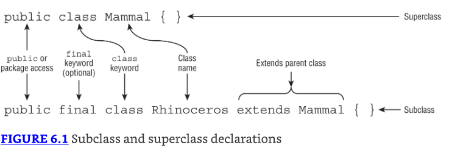
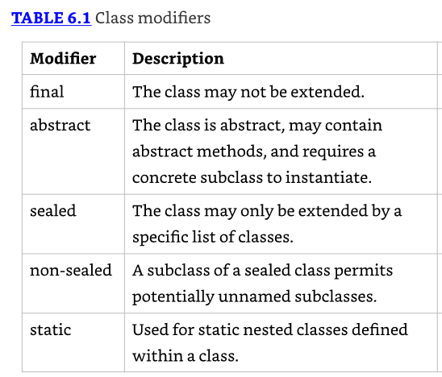
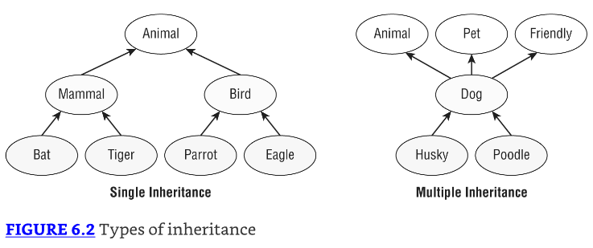

# Class Design

## Understanding Inheritance

* Cuando creas una nueva clase en Java, puedes definir la clase como heredando de una clase existente. 
* Herencia (Inheritance) es el proceso por el cual una subclase automáticamente incluye ciertos miembros de la clase, incluyendo primitivos, objetos, o métodos, definidos en la clase padre.

Para propósitos ilustrativos, nos referimos a cualquier clase que hereda de otra clase como una subclass o **child class**, ya que es considerada un descendiente de esa clase. 
Alternativamente, nos referimos a la clase de la que la clase hija hereda como la superclass o **parent class**, ya que es considerada un ancestro de la clase.

### Declaring a Subclass

Comencemos con la declaración de una clase y su subclase. La Figura 6.1 muestra un ejemplo de una superclase, Mammal, y subclase Rhinoceros.



Indicamos que una clase es una subclase al declararla con la palabra clave `extends`. 
No necesitamos declarar nada en la superclase más que asegurarnos de que no esté marcada como `final`. 

* Un aspecto clave de la herencia es que es transitiva. 
* Dadas tres clases [X, Y, Z], si `X` extends `Y`, y `Y` extends `Z`, entonces `X` es considerada una subclase o descendiente de `Z`. 
* De la misma manera, `Z` es una superclase o ancestro de `X`. 
* A veces usamos el término direct subclass o descendant para indicar que la clase directamente extends la clase padre. 
* Por ejemplo, `X` es un descendiente directo solo de la clase `Y`, no de `Z`.

* Cuando una clase hereda de una clase padre, todos los miembros `public` y `protected` están automáticamente disponibles como parte de la clase hija. 
* Si las dos clases están en el mismo package, entonces los miembros package están disponibles para la clase hija. 
* Por último, pero no menos importante, los miembros `private` están restringidos a la clase en la que están definidos y nunca están disponibles vía herencia. 
* Esto no significa que la clase padre no pueda tener miembros `private` que puedan contener datos o modificar un objeto; solo significa que la subclase no tiene acceso directo a ellos.

Echemos un vistazo a un ejemplo simple:

```java
public class BigCat {
    protected double size;
}

public class Jaguar extends BigCat {
    public Jaguar() {
        size = 10.2;
    }

    public void printDetails() {
        System.out.print(size);
    }
}

public class Spider {
    public void printDetails() {
        System.out.println(size); // DOES NOT COMPILE
    }
}
```

* Jaguar es una subclase de BigCat, lo que la convierte en una superclase o clase madre de Jaguar. 
* En la clase Jaguar, se puede acceder a la propiedad `size` porque está marcada como protegida. 
* Mediante herencia, la subclase Jaguar puede leer o escribir `size` como si fuera su propio miembro. 
* En contraste, la clase Spider no tiene acceso a `size` porque no se hereda.

### Class Modifiers

* Al igual que los métodos y las variables, una declaración de clase puede tener varios modificadores. 
* La Tabla 6.1 lista los modificadores que debes conocer para el examen.



Por ahora, hablemos sobre marcar una clase como final. El modificador final previene que una clase sea extendida más. 
Por ejemplo, lo siguiente no compila:

```java
public final class Rhinoceros extends Mammal { }

public class Clara extends Rhinoceros { } // DOES NOT COMPILE
```

En el examen, presta atención a cualquier clase marcada como final. Si ves otra clase extendiéndola, sabes inmediatamente que el código no compila.

### Single vs. Multiple Inheritance

* Java soporta single inheritance, por el cual una clase puede heredar de solo una clase padre directa. 
* Java también soporta múltiples niveles de herencia, por el cual una clase puede extender otra clase, que a su vez extiende otra clase. 
* Puedes tener cualquier número de niveles de herencia, permitiendo que cada descendiente gane acceso a los miembros de su ancestro.

* Para entender verdaderamente la herencia simple, puede ser útil contrastarla con multiple inheritance, por el cual una clase puede tener múltiples padres directos. 
* Por diseño, Java no soporta herencia múltiple en el lenguaje porque la herencia múltiple puede llevar a modelos de datos complejos, a menudo difíciles de mantener. 
* Java sí permite una excepción a la regla de herencia simple, la cual ves en el Capítulo 7—una clase puede implementar múltiples interfaces.

* La Figura 6.2 ilustra los varios tipos de modelos de herencia. 
* Los elementos de la izquierda se consideran herencia simple porque cada hijo tiene exactamente un padre. 
* Puedes notar que la herencia simple no excluye a los padres de tener múltiples hijos. 
* El lado derecho muestra elementos que tienen herencia múltiple. Como puedes ver, un objeto Dog tiene múltiples designaciones de padre.



Parte de lo que hace que la herencia múltiple sea complicada es determinar de qué padre heredar valores en caso de un conflicto. 
Por ejemplo, si tienes un objeto o método definido en todos los padres, ¿cuál hereda el hijo? 
No hay un ordenamiento natural para los padres en este ejemplo, que es por qué Java evita estos problemas al prohibir por completo la herencia múltiple.

### Inheriting Object

* A lo largo de nuestra discusión de Java en este libro, hemos mencionado la palabra object numerosas veces—y con buena razón. 
* En Java, todas las clases heredan de una sola clase: `java.lang.Object`, u Object para abreviar. 
* Además, Object es la única clase que no tiene una clase padre.

* Podrías estar preguntándote, Ninguna de las clases que he escrito hasta ahora extiende Object, entonces, ¿cómo heredan todas las clases de él?
* La respuesta es que el compilador ha estado automáticamente insertando código en cualquier clase que escribes que no extiende una clase específica. 
* Por ejemplo, las siguientes dos son equivalentes:

```java
public class Zoo { }

public class Zoo extends java.lang.Object { }
```

* La clave es que cuando Java ve que defines una clase que no extiende otra clase, el compilador automáticamente agrega la sintaxis `extends java.lang.Object` a la definición de la clase. 
* El resultado es que cada clase gana acceso a cualquier método accesible en la clase Object. 
* Por ejemplo, los métodos `toString()` y `equals()` están disponibles en Object; por lo tanto, son accesibles en todas las clases. 
* Sin ser sobreescritos en una subclase, aunque, pueden no ser particularmente útiles.

## Creating Classes

### Extending a Class

Creemos dos archivos en el mismo package, `Animal.java` y `Lion.java`.

```java
// Animal.java
public class Animal {
    private int age;
    protected String name;
    public int getAge() {
        return age;
    }
    public void setAge(int newAge) {
        age = newAge;
    }
}

// Lion.java
public class Lion extends Animal {
    protected void setProperties(int age, String n) {
        setAge(age);
        name = n;
    }
    public void roar() {
        System.out.print(name + ", age " + getAge() + ", says: Roar!");
    }
    public static void main(String[] args) {
        var lion = new Lion();
        lion.setProperties(3, "kion");
        lion.roar();
    }
}
```

Hay mucho sucediendo aquí, ¡lo sabemos! La variable age existe en la clase padre Animal y no es directamente accesible en la clase hija Lion. 
Es indirectamente accesible vía el método `setAge()`. La variable `name` es `protected`, así que es heredada en la clase `Lion` y directamente accesible. 
Creamos la instancia Lion en el método `main()` y usamos `setProperties()` para establecer las variables de instancia. 
Finalmente, llamamos al método `roar()`, el cual imprime lo siguiente:

**kion, age 3, says: Roar!**

* Echemos un vistazo a los miembros de la clase Lion. La variable de instancia age está marcada como `private` y no es directamente accesible desde la subclase Lion. 
* Por lo tanto, lo siguiente no compilaría:

```java
public class Lion extends Animal {
    public void roar() {
        System.out.print("Lions age: " + age); // DOES NOT COMPILE
    }
}
```

Recuerda cuando trabajas con subclases que los miembros `private` nunca son heredados, y los miembros package solo son heredados si las dos clases están en el mismo package. 

### Applying Class Access Modifiers

* Como las variables y métodos, puedes aplicar modificadores de acceso a las clases. 
* Como podrías recordar del Capítulo 1, una clase de nivel superior (top-level) es una que no está definida dentro de otra clase. 
* También recuerda que un archivo **.java** puede tener como máximo una clase de nivel superior.

* Aunque solo puedes tener una clase de nivel superior, puedes tener tantas clases (en cualquier orden) con acceso package como quieras. 
* De hecho, ¡ni siquiera necesitas declarar una clase public! Lo siguiente declara tres clases, cada una con acceso package:

```java
// Bear.java
class Bird {}
class Bear {}
class Fish {}
```

Intentar declarar una clase de nivel superior con protected o private class llevará a un error de compilador, aunque:

```java
// ClownFish.java
protected class ClownFish{} // DOES NOT COMPILE
// BlueTang.java
private class BlueTang {} // DOES NOT COMPILE
```

* ¿Eso significa que una clase nunca puede ser declarada como `protected` o `private`? No exactamente. 
* En el Capítulo 7, presentamos tipos anidados (nested types) y mostramos que cuando defines una clase dentro de otra, puede usar cualquier modificador de acceso.

### Accessing the `this` Reference

* ¿Qué sucede cuando un parámetro de método tiene el mismo nombre que una variable de instancia existente? 
* Echemos un vistazo a un ejemplo. ¿Qué crees que imprime el siguiente programa?

```java
public class Flamingo {
    private String color = null;
    public void setColor(String color) {
        color = color;
    }
    public static void main(String... unused) {
        var f = new Flamingo();
        f.setColor("PINK");
        System.out.print(f.color);
    }
}
```

* Si dijiste `null`, entonces estarías en lo correcto. 
* Java usa el alcance más granular, así que cuando ve `color = color`, piensa que estás asignando el valor del parámetro del método a sí mismo (no la variable de instancia). 
* La asignación se completa exitosamente dentro del método, pero el valor de la variable de instancia color nunca es modificado y es `null` cuando se imprime en el método `main()`.

* La solución cuando tienes una variable local con el mismo nombre que una variable de instancia es usar la referencia `this` o palabra clave. 
* La referencia `this` se refiere a la instancia actual de la clase y puede ser usada para acceder a cualquier miembro de la clase, incluyendo miembros heredados. 
* Puede ser usada en cualquier método de instancia, constructor, o bloque inicializador de instancia. 
* No puede ser usada cuando no hay una instancia implícita de la clase, tal como en un método `static` o bloque inicializador `static`. 
* Aplicamos esto a nuestra implementación de método anterior de la siguiente manera:

```java
public void setColor(String color) {
    this.color = color; // Sets the instance variable with method parameter
}
```

* El código corregido ahora imprimirá PINK como se esperaba. En muchos casos, la referencia `this` es opcional. 
* Si Java encuentra una variable o método que no puede encontrar, verificará la jerarquía de clases para ver si está disponible.

### Calling the `super` Reference

* En Java, una variable o método puede ser definido tanto en una clase padre como en una clase hija. 
* Esto significa que la instancia del objeto en realidad contiene dos copias de la misma variable con el mismo nombre subyacente. 
* Cuando esto sucede, ¿cómo referenciamos la versión en la clase padre en lugar de la clase actual? Echemos un vistazo a un ejemplo.

```java
// Reptile.java
1: public class Reptile {
2:     protected int speed = 10;
3: }

// Crocodile.java
1: public class Crocodile extends Reptile {
2:     protected int speed = 20;
3:     public int getSpeed() {
4:     return speed;
5:  }
6:  public static void main(String[] data) {
7:     var croc = new Crocodile();
8:     System.out.println(croc.getSpeed()); // 20
9:  } }
```

* Una de las cosas más importantes para recordar sobre este código es que una instancia de `Crocodile` almacena dos valores separados para `speed`: uno en el nivel `Reptile` y uno en el nivel `Crocodile`. 
* En la línea 4, Java primero verifica si hay una variable local o parámetro de método llamado `speed`. 
* Dado que no lo hay, entonces verifica `this.speed;` y dado que existe, el programa imprime 20.

* ¿Pero qué pasa si queremos que el programa imprima el valor en la clase Reptile? 
* Dentro de la clase `Crocodile`, podemos acceder al valor padre de `speed`, en su lugar, usando la referencia o palabra clave `super`. 
* La referencia `super` es similar a la referencia `this`, excepto que excluye cualquier miembro encontrado en la clase actual. 
* En otras palabras, el miembro debe ser accesible vía herencia.

```java
3:  public int getSpeed() {
4:     return super.speed; // Causes the program to now print 10
5:  }
```

Veamos si has captado la idea de this y super. ¿Qué imprime el siguiente programa?

```java
1: class Insect {
2:     protected int numberOfLegs = 4;
3:     String label = "buggy";
4: }
5:
6: public class Beetle extends Insect {
7:     protected int numberOfLegs = 6;
8:     short age = 3;
9:     public void printData() {
10:        System.out.println(this.label);
11:        System.out.println(super.label);
12:        System.out.println(this.age);
13:        System.out.println(super.age);
14:        System.out.println(numberOfLegs);
15:    }
16:    public static void main(String []n) {
17:        new Beetle().printData();
18:    }
19: }
```

* Esa fue una pregunta trampa—¡este código de programa no compilaría! Revisemos cada línea del método printData(). 
* Dado que label está definido en la clase padre, es accesible vía tanto las referencias `this` como `super`. 
* Por esta razón, las líneas 10 y 11 compilan y ambas imprimirían buggy si la clase compilara. 
* Por otro lado, la variable `age` está definida solo en la clase actual, haciéndola accesible vía `this` pero no `super`. 
* Por esta razón, la línea 12 compila (e imprimiría 3), pero la línea 13 no. 
* Recuerda, mientras `this` incluye miembros actuales y heredados, `super` solo incluye miembros heredados.

* Por último, pero no menos importante, ¿qué imprimiría la línea 14 si la línea 13 estuviera comentada? 
* Aunque ambas variables `numberOfLegs` son accesibles en Beetle, Java verifica hacia afuera, comenzando con el alcance más estrecho. 
* Por esta razón, el valor de `numberOfLegs` en la clase Beetle es usado, y 6 es impreso. 
* En este ejemplo, `this.numberOfLegs` y `super.numberOfLegs` se refieren a diferentes variables con valores distintos.

* Dado que esto incluye miembros heredados, a menudo solo usas `super` cuando tienes un conflicto de nombres vía herencia. 
* Por ejemplo, tienes un método o variable definido en la clase actual que coincide con un método o variable en una clase padre. 
* Esto comúnmente surge en la sobre escritura de métodos y el ocultamiento de variables, que se discuten más adelante en este capítulo.

## Declaring Constructors

### Creating a Constructor

Comencemos con un constructor simple:

```java
public class Bunny {
    public Bunny() {
        System.out.print("hop");
    }
}
```

* El nombre del constructor, Bunny, coincide con el nombre de la clase, Bunny, y no hay tipo de retorno, ni siquiera void. 
* Eso hace que esto sea un constructor. ¿Puedes decir por qué estos dos no son constructores válidos para la clase Bunny?

```java
public class Bunny {
    public bunny() {} // DOES NOT COMPILE
    public void Bunny() {}
}
```

* El primero no coincide con el nombre de la clase porque Java es sensible a mayúsculas y minúsculas (case-sensitive). 
* Dado que no coincide, Java sabe que no puede ser un constructor y se supone que es un método regular. 
* Sin embargo, le falta el tipo de retorno y no compila. 
* El segundo método es un método perfectamente válido, pero no es un constructor porque tiene un tipo de retorno.

Como los parámetros de método, los parámetros de constructor pueden ser cualquier tipo de clase, array, o tipo primitivo válido, incluyendo genéricos, pero no pueden incluir var.

```java
public class Bonobo {
    public Bonobo(var food) { // DOES NOT COMPILE
    }
}
```

* Una clase puede tener múltiples constructores, siempre y cuando cada constructor tenga una firma de constructor única. 
* En este caso, eso significa que los parámetros del constructor deben ser distintos. 
* Como los métodos con el mismo nombre, pero diferentes firmas, declarar múltiples constructores con diferentes firmas se conoce como constructor overloading. 
* La siguiente clase Turtle tiene cuatro constructores sobrecargados distintos:

```java
public class Turtle {
    private String name;
    public Turtle() {
        name = "John Doe";
    }
    public Turtle(int age) {}
    public Turtle(long age) {}
    public Turtle(String newName, String... favoriteFoods) {
        name = newName;
    }
}
```

* Los constructores se utilizan cuando se crea un nuevo objeto. 
* Este proceso se llama instantiation (instanciación) porque crea una nueva instancia de la clase. 
* Un constructor se llama cuando escribimos new seguido del nombre de la clase que queremos instanciar. 

`new Turtle(15)`

Cuando Java ve la palabra clave `new`, asigna memoria para el nuevo objeto. Luego busca un constructor con una firma coincidente y lo llama.

### The Default Constructor

* Cada clase en Java tiene un constructor, ya sea que codifiques uno o no. 
* Si no incluyes ningún constructor en la clase, Java creará uno por ti sin ningún parámetro. 
* Este constructor creado por Java se llama default constructor (constructor por defecto) y se añade cada vez que se declara una clase sin ningún constructor. 
* A menudo nos referimos a él como el constructor sin argumentos por defecto, para mayor claridad. He aquí un ejemplo:

```java
public class Rabbit {
  public static void main(String[] args) {
    new Rabbit(); // Calls the default constructor
  }
}
```

* En la clase Rabbit, Java ve que no se codificó ningún constructor y crea uno. 
* La clase anterior es equivalente a la siguiente, en la cual se proporciona el constructor por defecto y, por lo tanto, no es insertado por el compilador:

```java
public class Rabbit {
  public Rabbit() {}
  public static void main(String[] args) {
    new Rabbit(); // Calls the user-defined constructor
  }
}
```

* El constructor por defecto tiene una lista de parámetros vacía y un cuerpo vacío. Está bien que tú mismo escribas esto. 
* Sin embargo, dado que no hace nada, Java está feliz de generarlo por ti y ahorrarte algo de escritura.

* Seguimos diciendo generated (generado). Esto sucede durante el paso de compilación. 
* Si miras el archivo con la extensión `.java`, el constructor seguirá faltando. 
* Solo hace una aparición en el archivo compilado con la extensión `.class`.

Para el examen, una de las reglas más importantes que necesitas saber es que el compilador solo inserta el constructor por defecto cuando no se definen constructores.


```java
public class Rabbit1 {}

public class Rabbit2 {
    public Rabbit2() {}
}

public class Rabbit3 {
    public Rabbit3(boolean b) {}
}

public class Rabbit4 {
    private Rabbit4() {}
}
```

* Solo `Rabbit1` obtiene un constructor sin argumentos por defecto. 
* No tiene un constructor codificado, así que Java genera un constructor sin argumentos por defecto. 
* Para `Rabbit2` y `Rabbit3` ambos tienen constructores públicos ya. `Rabbit4` tiene un constructor privado. 
* Dado que estas tres clases tienen un constructor definido, el constructor sin argumentos por defecto no se inserta por ti.

Echemos un vistazo rápido a cómo llamar estos constructores:

```java
1: public class RabbitsMultiply {
2:   public static void main(String[] args) {
3:     var r1 = new Rabbit1();
4:     var r2 = new Rabbit2();
5:   var r3 = new Rabbit3(true);
6:   var r4 = new Rabbit4(); // DOES NOT COMPILE
7: } }
```

* La línea 3 llama al constructor sin argumentos por defecto generado. 
* Las líneas 4 y 5 llaman a los constructores proporcionados por el usuario. 
* La línea 6 no compila. Rabbit4 hizo el constructor privado para que otras clases no pudieran llamarlo.

### Calling Overloaded Constructors with `this()`

* Dado que una clase puede contener múltiples constructores sobrecargados, estos constructores en realidad pueden llamarse entre sí. 
* Comencemos con una clase simple que contiene dos constructores sobrecargados:

```java
public class Hamster {
  private String color;
  private int weight;
  public Hamster(int weight, String color) { // First constructor
    this.weight = weight;
    this.color = color;
  }
  public Hamster(int weight) { // Second constructor
    this.weight = weight;
    color = "brown";
  }
}
```

* Uno de los constructores toma un solo parámetro `int`. El otro toma un `int` y un `String`. 
* Estas listas de parámetros son diferentes, por lo que los constructores están sobrecargados exitosamente.

* Hay un poco de duplicación, ya que `this.weight` se asigna de la misma manera en ambos constructores. 
* En programación, incluso un poco de duplicación tiende a convertirse en mucha duplicación a medida que seguimos agregando "solo una cosa más". 
* Por ejemplo, imagina que tenemos cinco variables siendo establecidas como `this.weight`, en lugar de solo una. 
* Lo que realmente queremos es que el primer constructor llame al segundo constructor con dos parámetros. 
* Entonces, ¿cómo puedes hacer que un constructor llame a otro constructor? Podrías estar tentado a reescribir el primer constructor de la siguiente manera:

```java
public Hamster(int weight) { // Second constructor
  Hamster(weight, "brown"); // DOES NOT COMPILE
}
```

* Este intento sí compila. No hace lo que queremos, sin embargo. 
* Cuando este constructor es llamado, crea un nuevo objeto con el peso y color por defecto. 
* Luego construye un objeto diferente con el peso y color deseados. 
* De esta manera, terminamos con dos objetos, uno de los cuales se descarta después de que se crea. Eso no es lo que queremos. 
* Queremos que el peso y color se establezcan en el objeto que estamos tratando de instanciar en primer lugar.

* Java proporciona una solución: `this()`—sí, la misma palabra clave que usamos para referirnos a miembros de instancia, pero con paréntesis. 
* Cuando `this()` se usa con paréntesis, Java llama a otro constructor en la misma instancia de la clase.

```java
public Hamster(int weight) { // Second constructor
  this(weight, "brown");
}
```

* Llamar a `this()` tiene una regla especial que necesitas conocer. 
* Si eliges llamarlo, la llamada a `this()` debe ser la primera declaración en el constructor. 
* El efecto secundario de esto es que solo puede haber una llamada a `this()` en cualquier constructor.

```java
3: public Hamster(int weight) {
4:   System.out.println("chew");
5:   // Set weight and default color
6:   this(weight, "brown");  // DOES NOT COMPILE
7: }
```

* Aunque una declaración de impresión en la línea 4 no cambia ninguna variable, sigue siendo una declaración de Java y no está permitido insertarla antes de la llamada a `this()`. 
* El comentario en la línea 5 está bien. Los comentarios no se consideran declaraciones y están permitidos en cualquier lugar.

Hay una última regla para constructores sobrecargados de la que deberías estar consciente. Considera la siguiente definición de la clase Gopher:

```java
public class Gopher {
  public Gopher(int dugHoles) {
    this(5); // DOES NOT COMPILE
  }
}
```

* El compilador es capaz de detectar que este constructor se está llamando a sí mismo infinitamente. 
* Esto a menudo se conoce como un cycle (ciclo) y es similar a los bucles infinitos que discutimos en Chapter 3, "Making Decisions." 
* Dado que el código nunca puede terminar, el compilador se detiene y reporta esto como un error. Del mismo modo, esto tampoco compila:

```java
public class Gopher {
  public Gopher() {
    this(5); // DOES NOT COMPILE
  }
  public Gopher(int dugHoles) {
    this(); // DOES NOT COMPILE
  }
}
```

En este ejemplo, los constructores se llaman entre sí, y el proceso continúa infinitamente. Dado que el compilador puede detectar esto, reporta un error.

Aquí resumimos las reglas que deberías conocer sobre constructores que cubrimos en esta sección. 

* Una clase puede contener muchos constructores sobrecargados, siempre que la firma de cada uno sea distinta.
* El compilador inserta un constructor sin argumentos por defecto si no se declaran constructores.
* Si un constructor llama a this(), entonces debe ser la primera línea del constructor.
* Java no permite llamadas de constructor cíclicas.

### Calling Parent Constructors with `super()`

Hay un conjunto más de reglas que necesitamos cubrir, sin embargo, para llamar constructores en la clase padre. 
Después de todo, ¿cómo se inicializan los miembros de instancia de la clase padre?

La primera declaración de every (cada) constructor es una llamada a un constructor padre usando `super()` o a otro constructor en la clase usando `this()`. 

Echemos un vistazo a la clase `Animal` y su subclase `Zebra` y veamos cómo sus constructores pueden escribirse correctamente para llamarse entre sí:

```java
public class Animal {
  private int age;
  public Animal(int age) {
    super(); // Refers to constructor in java.lang.Object
    this.age = age;
  }
}

public class Zebra extends Animal {
  public Zebra(int age) {
    super(age); // Refers to constructor in Animal
  }
  public Zebra() {
    this(4); // Refers to constructor in Zebra with int argument
  }
}
```

* En la clase `Animal`, la primera declaración del constructor es una llamada al constructor padre definido en `java.lang.Object`, que no toma argumentos. 
* En la segunda clase, `Zebra`, la primera declaración del primer constructor es una llamada al constructor de `Animal`, que toma un solo argumento. 
* La clase `Zebra` también incluye un segundo constructor sin argumentos que no llama a `super()` sino que en su lugar llama al otro constructor dentro de la clase `Zebra` usando `this(4)`.

* Como llamar a `this()`, llamar a `super()` solo puede usarse como la primera declaración del constructor. 
* Por ejemplo, las siguientes dos definiciones de clase no compilarán:

```java
public class Zoo {
  public Zoo() {
    System.out.println("Zoo created");
    super();  // DOES NOT COMPILE
  }
}

public class Zoo {
  public Zoo() {
    super();
    System.out.println("Zoo created");
    super();  // DOES NOT COMPILE
  }
}
```

* La primera clase no compilará porque la llamada al constructor padre debe ser la primera declaración del constructor. 
* En el segundo fragmento de código, `super()` es la primera declaración del constructor, pero también se usa como la tercera declaración. 
* Dado que `super()` solo puede llamarse una vez como la primera declaración del constructor, el código no compilará.

Si la clase padre tiene más de un constructor, la clase hija puede usar cualquier constructor padre válido en su definición, como se muestra en el siguiente ejemplo:

```java
public class Animal {
  private int age;
  private String name;
  public Animal(int age, String name) {
    super();
    this.age = age;
    this.name = name;
  }
  public Animal(int age) {
    super();
    this.age = age;
    this.name = null;
  }
}

public class Gorilla extends Animal {
    public Gorilla(int age) {
        super(age,"Gorilla"); // Calls the first Animal constructor
    }
    public Gorilla() {
        super(5);      // Calls the second Animal constructor
    }
}
```

* En este ejemplo, el primer constructor hijo toma un argumento, `age`, y llama al constructor padre, que toma dos argumentos, `age` y `name`. 
* El segundo constructor hijo no toma argumentos, y llama al constructor padre, que toma un argumento, `age`. 
* En este ejemplo, observa que los constructores hijo no están obligados a llamar constructores padre coincidentes. 
* Cualquier constructor padre válido es aceptable siempre que se proporcionen los parámetros de entrada apropiados al constructor padre.

### Understanding Compiler Enhancements

* Java inserta automáticamente una llamada al constructor sin argumentos `super()` si no llamas explícitamente a `this()` o `super()` como la primera línea de un constructor. 
* Por ejemplo, las siguientes tres definiciones de clase y constructor son equivalentes, porque el compilador automáticamente las convertirá todas al último ejemplo: 

```java
public class Donkey {}

public class Donkey {
  public Donkey() {}
}

public class Donkey {
  public Donkey() {
    super();
  }
}
```

* Asegúrate de comprender las diferencias entre estas tres definiciones de clase `Donkey` y por qué Java las convertirá automáticamente todas a la última definición. 
* Mientras lees la siguiente sección, ten en mente el proceso que el compilador de Java realiza.

### Default Constructor Tips and Tricks

* Hemos presentado muchas reglas hasta ahora, y podrías haber notado algo. Digamos que tenemos una clase que no incluye un constructor sin argumentos. 
* ¿Qué sucede si definimos una subclase sin constructores, o una subclase con un constructor que no incluye una referencia a `super()`?

```java
public class Mammal {
  public Mammal(int age) {}
}

public class Seal extends Mammal {} // DOES NOT COMPILE

public class Elephant extends Mammal {
  public Elephant() {}     // DOES NOT COMPILE
}
```

* La respuesta es que ninguna subclase compila. Dado que `Mammal` define un constructor, el compilador no inserta un constructor sin argumentos. 
* El compilador insertará un constructor sin argumentos por defecto en `Seal`, sin embargo, pero será una implementación simple que solo llama a un constructor padre por defecto inexistente.

```java
public class Seal extends Mammal {
  public Seal() {
    super(); // DOES NOT COMPILE
  }
}
```

* Del mismo modo, `Elephant` no compilará por razones similares. 
* El compilador no ve una llamada a `super()` o `this()` como la primera línea del constructor, así que inserta una llamada a un `super()` sin argumentos inexistente automáticamente.

En estos casos, el compilador no ayudará, y must (debes) crear al menos un constructor en tu clase hija que llame explícitamente a un constructor padre vía el comando `super()`.

```java
public class Seal extends Mammal {
  public Seal() {
    super(6); // Explicit call to parent constructor
  }
}

public class Elephant extends Mammal {
  public Elephant() {
    super(4); // Explicit call to parent constructor
  }
}
```

* Las subclases pueden incluir constructores sin argumentos incluso si sus clases padre no. 
* Por ejemplo, lo siguiente compila porque `Elephant` incluye un constructor sin argumentos:

`public class AfricanElephant extends Elephant {}`

Para el examen, deberías ser capaz de detectar inmediatamente por qué clases como nuestras primeras implementaciones de `Seal` y `Elephant` no compilaron.

Concluimos esta sección agregando tres reglas de constructor a tu conjunto de habilidades:

* La primera línea de cada constructor es una llamada a un constructor padre usando `super()` o a un constructor sobrecargado usando `this()`.
* Si el constructor no contiene una referencia a `this()` o `super()`, entonces el compilador inserta automáticamente `super()` sin argumentos como la primera línea del constructor.
* Si un constructor llama a `super()`, entonces debe ser la primera línea del constructor.

## Initializing Objects

### Initializing Classes

* Comenzamos nuestra discusión sobre el orden de inicialización con la inicialización de clases. 
* Primero, inicializamos la clase, lo que implica invocar a todos los miembros estáticos en la jerarquía de clases, comenzando con la superclase más alta y trabajando hacia abajo. 
* Esto a veces se conoce como loading (cargar) la clase. La Java Virtual Machine (JVM) controla cuándo se inicializa la clase, aunque puedes asumir que la clase se carga antes de que se use. 
* La clase puede ser inicializada cuando el programa comienza primero, cuando un miembro estático de la clase es referenciado, o poco antes de que una instancia de la clase sea creada.

* Una de las reglas más importantes con la inicialización de clases es que ocurre como máximo una vez para cada clase. 
* La clase también puede nunca cargarse si no se usa en el programa. Resumimos el orden de inicialización para una clase de la siguiente manera:

**Initialize Class X**

1. Si hay una superclase Y de X, entonces inicializa la clase Y primero.
2. Procesa todas las declaraciones de variables estáticas en el orden en que aparecen en la clase.
3. Procesa todos los inicializadores estáticos en el orden en que aparecen en la clase.

Echando un vistazo a un ejemplo, ¿qué imprime el siguiente programa?

```java
public class Animal {
  static { System.out.print("A"); }
}

public class Hippo extends Animal {
  public static void main(String[] grass) {
    System.out.print("C");
    new Hippo();
    new Hippo();
    new Hippo();
  }
  static { System.out.print("B"); }
}
```

* Imprime **ABC** exactamente una vez. 
* Dado que el método `main()` está dentro de la clase `Hippo`, la clase será inicializada primero, comenzando con la superclase e imprimiendo **AB**. 
* Después, el método `main()` es ejecutado, imprimiendo **C**. Aunque el método `main()` crea tres instancias, la clase se carga solo una vez.

### Initializing final Fields

Cuando presentamos las variables de instancia y de clase, dijimos que se les asigna un valor por defecto basado en su tipo si no se especifica ningún valor. 
Por ejemplo, un double se inicializa con 0.0, mientras que una referencia de objeto se inicializa con `null`. 
Un valor por defecto solo se aplica a un campo no final, sin embargo.

* Como viste en Chapter 5, las variables estáticas `final` deben ser asignadas explícitamente un valor exactamente una vez. 
* Los campos marcados como `final` siguen reglas similares. Pueden ser asignados valores en la línea en que se declaran o en un inicializador de instancia.

```java
public class MouseHouse {
  private final int volume;
  private final String name = "The Mouse House"; // Declaration assignment
  {
    volume = 10; // Instance initializer assignment
  }
}
```

* A diferencia de los miembros de clase estáticos, sin embargo, los campos de instancia `final` también pueden establecerse en un constructor. 
* El constructor es parte del proceso de inicialización, por lo que está permitido asignar variables de instancia `final`. 
* Para el examen, necesitas conocer una regla importante: **para cuando el constructor se completa, todas las variables de instancia final deben haber sido asignadas un valor exactamente una vez**.

Intentemos esto en un ejemplo:

```java
public class MouseHouse {
  private final int volume;
  private final String name;
  public MouseHouse() {
    this.name
      = "Empty House"; // Constructor assignment
  }
  {
    volume = 10; // Instance initializer assignment
  }
}
```

* A diferencia de las variables locales `final`, que no están obligadas a tener un valor a menos que sean realmente usadas, las variables de instancia `final` deben ser asignadas un valor. 
* Si no se les asigna un valor cuando se declaran o en un inicializador de instancia, entonces deben ser asignadas un valor en la declaración del constructor. 
* No hacerlo resultará en un error del compilador en la línea que declara el constructor.

```java
public class MouseHouse {
  private final int volume;
  private final String type;
  {
    this.volume = 10;
  }
  public MouseHouse(String type) {
    this.type = type;
  }
  public MouseHouse() { // DOES NOT COMPILE
    this.volume = 2;  // DOES NOT COMPILE
  }
}
```

* En este ejemplo, el primer constructor que toma un argumento String compila. 
* En términos de asignación de valores, cada constructor se revisa individualmente, que es por qué el segundo constructor no compila. 
* Primero, el constructor falla en establecer un valor para la variable `type`. 
* El compilador detecta que un valor nunca se establece para `type` y reporta un error en la línea donde el constructor es declarado. 
* Segundo, el constructor establece un valor para la variable `volume`, aunque ya fue asignado un valor por el inicializador de instancia.

* ¿Qué pasa con las variables de instancia `final` cuando un constructor llama a otro constructor en la misma clase? 
* En ese caso, tienes que seguir el flujo cuidadosamente, asegurándote de que cada variable de instancia `final` sea asignada un valor exactamente una vez. 
* Podemos reemplazar nuestro constructor malo anterior con el siguiente que sí compila:

```java
public MouseHouse() {
  this(null);
}
```

* Este constructor no realiza ninguna asignación a ninguna variable de instancia `final`, pero llama al constructor `MouseHouse(String)`, que nosotros observamos que compila sin problema. 
* Usamos `null` aquí para demostrar que la variable no necesita ser un valor de objeto. Podemos asignar un valor `null` a variables de instancia final siempre que se establezcan explícitamente.

### Initializing Instances

* Primero, comienza en el constructor del nivel más bajo donde se usa la palabra clave `new`. 
* Recuerda, la primera línea de cada constructor es una llamada a `this()` o `super()`, y si se omite, el compilador insertará automáticamente una llamada al constructor sin argumentos padre `super()`. 
* Luego, avanza hacia arriba y nota el orden de los constructores. 
* Finalmente, inicializa cada clase comenzando con la superclase, procesando cada inicializador de instancia y constructor en el orden inverso en que fue llamado. 
* Resumimos el orden de inicialización para una instancia de la siguiente manera: Inicializando una instancia de **X**

1. Inicializa la clase `X` si no ha sido inicializada previamente.
2. Si hay una superclase `Y` de `X`, entonces inicializa la instancia de `Y` primero.
3. Procesa todas las declaraciones de variables de instancia en el orden en que aparecen en la clase.
4. Procesa todos los inicializadores de instancia en el orden en que aparecen en la clase.
5. Inicializa el constructor, incluyendo cualquier constructor sobrecargado referenciado con `this()`.

```java
1: public class ZooTickets {
2:   private String name = "BestZoo";
3:   { System.out.print(name + "-"); }
4:   private static int COUNT = 0;
5:   static { System.out.print(COUNT + "-"); }
6:   static { COUNT += 10; System.out.print(COUNT + "-"); }
7:
8:   public ZooTickets() {
9:     System.out.print("z-");
10:  }
11:
12:  public static void main(String... patrons) {
13:    new ZooTickets();
14:  } }
```

La salida es la siguiente: **0-10-BestZoo-z-**

* Primero, tenemos que inicializar la clase. 
* Dado que no hay superclase declarada, lo que significa que la superclase es `Object`, podemos comenzar con los componentes estáticos de `ZooTickets`. 
* En este caso, las líneas 4, 5, y 6 son ejecutadas, imprimiendo 0- y 10-. A 
* continuación, inicializamos la instancia creada en la línea 13. Nuevamente, dado que no se declara superclase, comenzamos con los componentes de instancia. 
* Las líneas 2 y 3 son ejecutadas, lo que imprime BestZoo-. Finalmente, ejecutamos el constructor en las líneas 8–10, que imprime z-.

```java
class Primate {
  public Primate() {
    System.out.print("Primate-");
  } }

class Ape extends Primate {
    public Ape(int fur) {
        System.out.print("Ape1-");
    }
    public Ape() {
        System.out.print("Ape2-");
    } }

public class Chimpanzee extends Ape {
    public Chimpanzee() {
        super(2);
        System.out.print("Chimpanzee-");
    }
    public static void main(String[] args) {
        new Chimpanzee();
    } }
```

* El compilador inserta el comando `super()` como la primera declaración tanto en el constructor de `Primate` como en el de `Ape`. 
* El código se ejecutará con los constructores padre llamados primero y producirá la siguiente salida: **Primate-Ape1-Chimpanzee-**

* Nota que solo uno de los dos constructores `Ape()` es llamado. 
* Necesitas comenzar con la llamada a `new Chimpanzee()` para determinar qué constructores serán ejecutados. 
* Recuerda, los constructores se ejecutan de abajo hacia arriba, pero dado que la primera línea de cada constructor es una llamada a otro constructor, el flujo termina con el constructor padre ejecutado antes que el constructor hijo.

Concluimos esta sección listando reglas importantes que deberías conocer para el examen:

* Una clase se inicializa como máximo una vez por la JVM antes de que sea referenciada o usada.
* Todas las variables estáticas `final` deben ser asignadas un valor exactamente una vez, ya sea cuando se declaran o en un inicializador estático.
* Todos los campos `final` deben ser asignados un valor exactamente una vez, ya sea cuando se declaran, en un inicializador de instancia, o en un constructor.
* Las variables estáticas y de instancia no finales definidas sin un valor se les asigna un valor por defecto basado en su tipo.
* El orden de inicialización es el siguiente: declaraciones de variables, luego inicializadores, y finalmente constructores.

## Inheriting Members

### Overriding a Method

* ¿Qué pasa si un método con la misma firma está definido tanto en la clase padre como en las clases hijas? 
* Por ejemplo, puedes querer definir una nueva versión del método y hacer que se comporte de manera diferente para esa subclase. 
* La solución es sobrescribir el método en la clase hija. 
* En Java, overriding (sobrescribir) un método ocurre cuando una subclase declara una nueva implementación para un método heredado con la misma firma y tipo de retorno compatible.

* Cuando sobrescribes un método, aún puedes referenciar la versión padre del método usando la palabra clave `super`. 
* De esta manera, las palabras clave `this` y `super` te permiten seleccionar entre las versiones actuales y padre de un método, respectivamente. 
* Ilustramos esto con el siguiente ejemplo:

```java
public class Marsupial {
  public double getAverageWeight() {
    return 50;
  }
}
public class Kangaroo extends Marsupial {
  public double getAverageWeight() {
    return super.getAverageWeight() + 20;
  }
  public static void main(String[] args) {
    System.out.println(new Marsupial().getAverageWeight()); // 50.0
    System.out.println(new Kangaroo().getAverageWeight()); // 70.0
  }
}
```

En este ejemplo, la clase `Kangaroo` sobrescribe el método `getAverageWeight()` pero en el proceso llama a la versión padre usando la referencia `super`.

Para sobrescribir un método, debes seguir una serie de reglas. El compilador realiza las siguientes verificaciones cuando sobrescribes un método:

1. El método en la clase hija debe tener la misma firma que el método en la clase padre.
2. El método en la clase hija debe ser al menos tan accesible como el método en la clase padre.
3. El método en la clase hija no puede declarar una excepción verificada que sea nueva o más amplia que la clase de cualquier excepción declarada en el método de la clase padre.
4. Si el método retorna un valor, debe ser del mismo tipo o un subtipo del método en la clase padre, conocido como covariant return types (tipos de retorno covariantes).

* Aunque estas reglas pueden parecer confusas o arbitrarias al principio, son necesarias para la consistencia. 
* Sin estas reglas en su lugar, es posible crear contradicciones dentro del lenguaje Java.

**Rule #1: Method Signatures**

* La primera regla para sobrescribir un método es algo auto-explicativa. 
* Si dos métodos tienen el mismo nombre, pero firmas diferentes, los métodos están sobrecargados, no sobrescritos. 
* Los métodos sobrecargados se consideran independientes y no comparten las mismas propiedades polimórficas que los métodos sobrescritos.

**Rule #2: Access Modifiers**

¿Cuál es el propósito de la segunda regla sobre modificadores de acceso? Intentemos un ejemplo ilustrativo:

```java
public class Camel {
  public int getNumberOfHumps() {
    return 1;
  } }

public class BactrianCamel extends Camel {
  private int getNumberOfHumps() { // DOES NOT COMPILE
    return 2;
  } }
```

* En este ejemplo, `BactrianCamel` intenta sobrescribir el método `getNumberOfHumps()` definido en la clase padre, pero falla porque el modificador de acceso `private` es más restrictivo que el definido en la versión padre del método. 
* Digamos que se permitiera compilar `BactrianCamel`, sin embargo. ¿Compilaría esta clase?

```java
public class Rider {
  public static void main(String[] args) {
    Camel c = new BactrianCamel();
    System.out.print(c.getNumberOfHumps()); // ???
  } }
```

* La respuesta es, no lo sabemos. El tipo de referencia para el objeto es `Camel`, donde el método está declarado como `public`, pero el objeto en realidad es una instancia del tipo `BactrianCamel`, donde el método está declarado como `private`. 
* Java evita estos tipos de problemas de ambigüedad al limitar la sobrescritura de un método a modificadores de acceso que son tan accesibles o más accesibles que la versión en el método heredado.

**Rule #3: Checked Exceptions**

* La tercera regla dice que sobrescribir un método no puede declarar excepciones verificadas nuevas o excepciones verificadas más amplias que el método heredado. 
* Esto se hace por razones polimórficas similares a limitar modificadores de acceso. 
* En otras palabras, podrías terminar con un objeto que es más restrictivo que el tipo de referencia al que está asignado, resultando en una excepción verificada que no es manejada o declarada. 
* Una implicación de esta regla es que los métodos sobrescritos son libres de declarar cualquier número de nuevas excepciones no verificadas.

Intentemos un ejemplo:

```java
public class Reptile {
  protected void sleep() throws IOException {}

  protected void hide() {}

  protected void exitShell() throws FileNotFoundException {}
}
public class GalapagosTortoise extends Reptile {
    public void sleep() throws FileNotFoundException {}

    public void hide() throws FileNotFoundException {} // DOES NOT COMPILE

    public void exitShell() throws IOException {} // DOES NOT COMPILE
}
```

* En este ejemplo, tenemos tres métodos sobrescritos. 
* Estos métodos sobrescritos usan el modificador más accesible `public`, lo cual está permitido según nuestra segunda regla para métodos sobrescritos. 
* El primer método sobrescrito `sleep()` en `GalapagosTortoise` compila sin problema porque la excepción declarada es más estrecha que la excepción declarada en la clase padre.

* El método sobrescrito `hide()` no compila porque declara una nueva excepción verificada no presente en la declaración padre. 
* El método sobrescrito `exitShell()` tampoco compila, ya que `IOException` es una excepción verificada más amplia que `FileNotFoundException`. 

**Rule #4: Covariant Return Types**

* La cuarta y última regla sobre sobrescribir un método es probablemente la más complicada, ya que requiere conocer las relaciones entre los tipos de retorno. 
* El método sobrescrito debe usar un tipo de retorno que sea covariante con el tipo de retorno del método heredado.

Intentemos un ejemplo con propósitos ilustrativos:

```java
public class Rhino {
  protected CharSequence getName() {
    return "rhino";
  }
  protected String getColor() {
    return "grey, black, or white";
  } }

public class JavanRhino extends Rhino {
  public String getName() {
    return "javan rhino";
  }
  public CharSequence getColor() { // DOES NOT COMPILE
      return "grey";
  } }
```

* La subclase `JavanRhino` intenta sobrescribir dos métodos de Rhino: `getName()` y `getColor()`. 
* Ambos métodos sobrescritos tienen el mismo nombre y firma que los métodos heredados. 
* Los métodos sobrescritos también tienen un modificador de acceso más amplio, `public`, que los métodos heredados. 
* Recuerda, un modificador de acceso más amplio es aceptable en un método sobrescrito.

* Desde Chapter 4, "Core APIs," aprendimos que `String` implementa la interfaz `CharSequence`, haciendo que `String` sea un subtipo de `CharSequence`. 
* Por lo tanto, el tipo de retorno de `getName()` en `JavanRhino` es covariante con el tipo de retorno de `getName()` en `Rhino`.

* Por otro lado, el método sobrescrito `getColor()` no compila porque `CharSequence` no es un subtipo de `String`. 
* Dicho de otra manera, todos los valores `String` son valores `CharSequence`, pero no todos los valores `CharSequence` son valores `String`. 
* Por ejemplo, un `StringBuilder` es un `CharSequence` pero no un `String`. 
* Para el examen, necesitas saber si el tipo de retorno del método sobrescrito es el mismo o un subtipo del tipo de retorno del método heredado.

### Redeclaring private Methods

* ¿Qué sucede si intentas sobrescribir un método `private`? En Java, no puedes sobrescribir métodos `private` ya que no son heredados. 
* Solo porque una clase hija no tiene acceso al método padre no significa que la clase hija no puede definir su propia versión del método. 
* Simplemente, significa, estrictamente hablando, que el nuevo método no es una versión sobrescrita del método de la clase padre.

* ¿Qué sucede si intentas sobrescribir un método `private`? 
* En Java, no puedes sobrescribir métodos `private` ya que no son heredados. 
* Solo porque una clase hija no tiene acceso al método padre no significa que la clase hija no puede definir su propia versión del método. 
* Simplemente, significa, estrictamente hablando, que el nuevo método no es una versión sobrescrita del método de la clase padre.

* Java te permite redeclarar un nuevo método en la clase hija con la misma firma o modificada que el método en la clase padre. 
* Este método en la clase hija es un método separado e independiente, no relacionado con la versión del método padre, así que ninguna de las reglas para sobrescribir métodos se invoca. 
* Por ejemplo, estas dos declaraciones compilan:

```java
public class Beetle {
  private String getSize() {
    return "Undefined";
  } }

public class RhinocerosBeetle extends Beetle {
  private int getSize() {
    return 5;
  } }
```

* Nota que el tipo de retorno difiere en el método hijo de `String` a `int`. 
* En este ejemplo, el método `getSize()` en la clase padre se redeclara, así que el método en la clase hija es un nuevo método y no una sobrescritura del método en la clase padre.

* ¿Qué pasaría si el método `getSize()` fuera declarado `public` en `Beetle`? 
* En este caso, el método en `RhinocerosBeetle` sería una sobrescritura inválida. 
* El modificador de acceso en `RhinocerosBeetle` es más restrictivo, y los tipos de retorno no son covariantes.

### Hiding Static Methods

* Un método estático no puede ser sobrescrito porque los objetos de clase no heredan entre sí de la misma manera que los objetos de instancia.
* Por otro lado, pueden ser ocultados. Un hidden method (método oculto) ocurre cuando una clase hija define un método estático con el mismo nombre y firma que un método estático heredado definido en una clase padre. 
* El ocultamiento de métodos es similar pero no exactamente lo mismo que la sobrescritura de métodos. 
* Las cuatro reglas anteriores para sobrescribir un método deben seguirse cuando un método se oculta. 
* Además, se añade una nueva quinta regla para ocultar un método:

```java
public class Bear {
  public static void eat() {
      System.out.println("Bear is eating");
  }}

public class Panda extends Bear {
    public static void eat() {
        System.out.println("Panda is chewing");
    }
    public static void main(String[] args) {
        eat();
    }
}
```

* En este ejemplo, el código compila y se ejecuta. 
* El método `eat()` en la clase `Panda` oculta el método `eat()` en la clase `Bear`, imprimiendo "Panda is chewing" en tiempo de ejecución. 
* Debido a que ambos están marcados como `static`, esto no se considera un método sobrescrito. Dicho esto, todavía hay algo de herencia en juego. 
* Si eliminas la declaración `eat()` en la clase `Panda`, entonces el programa imprime "Bear is eating" en su lugar.

Observa si puedes descubrir por qué cada una de las declaraciones de métodos en la clase SunBear no compila:

```java
public class Bear {
    public static void sneeze() {
        System.out.println("Bear is sneezing");
    }

    public void hibernate() {
        System.out.println("Bear is hibernating");
    }

    public static void laugh() {
        System.out.println("Bear is laughing");
    }
}

public class SunBear extends Bear {

    public void sneeze() {  // DOES NOT COMPILE
        System.out.println("Sun Bear sneezes quietly");
    }

    public static void hibernate() {  // DOES NOT COMPILE
        System.out.println("Sun Bear is going to sleep");
    }

    protected static void laugh() {  // DOES NOT COMPILE
        System.out.println("Sun Bear is laughing");
    }
}
```

* En este ejemplo, `sneeze()` está marcado como `static` en la clase padre pero no en la clase hija. 
* El compilador detecta que estás intentando sobreescribir usando un método de instancia. 
* Sin embargo, `sneeze()` es un método `static` que debería estar oculto, causando que el compilador genere un error. 
* El segundo método, `hibernate()`, no compila por la razón opuesta. 
* El método está marcado static en la clase hija pero no en la clase padre.

* Finalmente, el método `laugh()` no compila.
* Aunque ambas versiones del método están marcadas `static`, la versión en `SunBear` tiene un modificador de acceso más restrictivo que el que hereda, y rompe la segunda regla para sobreescribir métodos. 
* Recuerda, las cuatro reglas para sobreescribir métodos deben seguirse cuando se ocultan métodos `static`.

### Hiding Variables

* Como viste con la sobreescritura de métodos, hay muchas reglas cuando dos métodos tienen la misma firma y están definidos tanto en la clase padre como en las clases hijas. 
* Afortunadamente, las reglas para variables con el mismo nombre en las clases padre e hijas son mucho más simples. 
* De hecho, Java no permite que las variables sean sobrescritas. Sin embargo, las variables pueden ser ocultadas.

* Una hidden variable ocurre cuando una clase hija define una variable con el mismo nombre que una variable heredada definida en la clase padre. 
* Esto crea dos copias distintas de la variable dentro de una instancia de la clase hija: una instancia definida en la clase padre y una definida en la clase hija.

* Al igual que cuando se oculta un método `static`, no puedes sobreescribir una variable; solo puedes ocultarla. 
* Echemos un vistazo a una variable oculta. ¿Qué crees que imprime la siguiente aplicación?

```java
class Carnivore {
    protected boolean hasFur = false;
}

public class Meerkat extends Carnivore {
    protected boolean hasFur = true;
    
    public static void main(String[] args) {
        Meerkat m = new Meerkat();
        Carnivore c = m;
        System.out.println(m.hasFur); // true
        System.out.println(c.hasFur); // false
    }
}
```

* ¿Confundido acerca de la salida? Ambas clases definen una variable `hasFur`, pero con valores diferentes. 
* Aunque solo un objeto es creado por el método `main()`, ambas variables existen independientemente una de otra. 
* La salida cambia dependiendo de la variable de referencia utilizada.

* Un método reemplaza el método padre en todas las variables de referencia (distintas de `super`). 
* Mientras que ocultar un método o variable reemplaza el miembro solo si se utiliza un tipo de referencia hijo.

## Writing `final` Methods

* Concluimos nuestra discusión sobre herencia de métodos con una regla algo autoexplicativa: los métodos `final` no pueden ser sobrescritos. 
* Al marcar un método `final`, prohíbes que una clase hija reemplace este método. 
* Esta regla está vigente tanto cuando sobrescribes un método como cuando ocultas un método. 
* En otras palabras, no puedes ocultar un método `static` en una clase hija si está marcado `final` en la clase padre.

Echemos un vistazo a un ejemplo:

```java
public class Bird {
    public final boolean hasFeathers() {
        return true;
    }
    public final static void flyAway() {}
}

public class Penguin extends Bird {
    public final boolean hasFeathers() { // DOES NOT COMPILE
        return false;
    }
    public final static void flyAway() {} // DOES NOT COMPILE
}
```

* En este ejemplo, el método de instancia `hasFeathers()` está marcado como `final` en la clase padre `Bird`.
* Por lo que la clase hija `Penguin` no puede sobreescribir el método padre, resultando en un error de compilación. 
* El método `static flyAway()` también está marcado `final`, por lo que no puede ser ocultado en la subclase. 
* En este ejemplo, si el método hijo usa o no la palabra clave `final` es irrelevante, el código no compilará de cualquier manera.

* Esta regla se aplica solo a métodos heredados. 
* Por ejemplo, si los dos métodos estuvieran marcados `private` en la clase padre Bird, entonces la clase Penguin, como está definida, compilaría. 
* En ese caso, los métodos `private` serían redeclarados, no sobrescritos u ocultados.

## Creating Abstract Classes

### Introducing Abstract Classes

* Entremos a las clases abstractas. Una `abstract class` es una clase declarada con el modificador `abstract` que no puede ser instanciada directamente y puede contener métodos abstractos. 
* Echemos un vistazo a un ejemplo basado en el modelo de datos Canine:

```java
public abstract class Canine {}

public class Wolf extends Canine {}

public class Fox extends Canine {}

public class Coyote extends Canine {}
```

En este ejemplo, otros desarrolladores pueden crear instancias de Wolf, Fox, o Coyote, pero no Canine. 
Seguro, pueden pasar una variable de referencia como Canine, pero el objeto subyacente debe ser una subclase de Canine en tiempo de ejecución.

Pero espera, ¡hay más! Una clase abstracta puede contener métodos abstractos. Un abstract method es un método declarado con el modificador abstract que no define un cuerpo. Dicho de otra manera, un método abstract obliga a las subclases a sobreescribir el método.

¿Por qué querríamos esto? Polimorfismo, ¡por supuesto! Al declarar un método abstract, podemos garantizar que alguna versión estará disponible en una instancia sin tener que especificar qué versión está en la clase padre abstracta.

```java
public abstract class Canine {
    public abstract String getSound();
    public void bark() { System.out.println(getSound()); }
}

public class Wolf extends Canine {
    public String getSound() {
        return "Wooooooof!";
    }
}

public class Fox extends Canine {
    public String getSound() {
        return "Squeak!";
    }
}

public class Coyote extends Canine {
    public String getSound() {
        return "Roar!";
    }
}
```

Entonces podemos crear una instancia de Fox y asignarla al tipo padre Canine. El método sobrescrito será usado en tiempo de ejecución.

```java
public static void main(String[] p) {
    Canine w = new Fox();
    w.bark(); // Squeak!
}
```

Fácil hasta ahora. Pero hay algunas reglas que necesitas conocer:

* Solo los métodos de instancia pueden ser marcados abstract dentro de una clase, no variables, constructores, o métodos static.
* Un método abstract solo puede ser declarado en una clase abstracta.
* Una clase no abstracta que extiende una clase abstracta debe implementar todos los métodos abstractos heredados.
* Sobreescribir un método abstract sigue las reglas existentes para sobreescribir métodos que aprendiste anteriormente en el capítulo.

Veamos si puedes identificar por qué cada una de estas declaraciones de clase no compila:

```java
public class FennecFox extends Canine {
    public int getSound() {
        return 10;
    }
}

public class ArcticFox extends Canine {}

public class Direwolf extends Canine {
    public abstract rest();
    public String getSound() {
        return "Roof!";
    }
}

public class Jackal extends Canine {
    public abstract String name;
    public String getSound() {
        return "Laugh";
    }
}
```

* Primero, la clase FennecFox no compila porque es una sobreescritura de método inválida. 
* En particular, los tipos de retorno no son covariantes. 
* La clase `ArcticFox` no compila porque no sobreescribe el método abstract `getSound()`. 
* La clase `Direwolf` no compila porque no es abstracta, pero declara un método abstract `rest()`. 
* Finalmente, la clase Jackal no compila porque las variables no pueden ser marcadas `abstract`.

Una clase abstracta se utiliza más comúnmente cuando quieres que otra clase herede propiedades de una clase en particular, pero quieres que la subclase complete algunos de los detalles de implementación.

* Anteriormente, dijimos que una clase abstracta es una que no puede ser instanciada. 
* Esto significa que si intentas instanciarla, el compilador reportará una excepción, como en este ejemplo:

```java
abstract class Alligator {
    public static void main(String... food) {
        var a = new Alligator(); // DOES NOT COMPILE
    }
}
```

Una clase abstracta puede ser inicializada, pero solo como parte de la instanciación de una subclase no abstracta.

### Declaring Abstract Methods

* Un método abstract siempre se declara sin un cuerpo. 
* También incluye un punto y coma `(;)` después de la declaración del método. 
* Como viste en el ejemplo anterior, una clase abstracta puede incluir métodos no abstractos, en este caso con el método `bark()`. 
* De hecho, una clase abstracta puede incluir todos los mismos miembros que una clase no abstracta, incluyendo variables, métodos static y de instancia, constructores, etc.

* Podría sorprenderte saber que una clase abstracta no está obligada a incluir ningún método abstracto. 
* Por ejemplo, el siguiente código compila aunque no define ningún método abstracto:

```java
public abstract class Llama {
    public void chew() {}
}
```

* Incluso sin métodos `abstract`, la clase no puede ser instanciada directamente. 
* Para el examen, mantén un ojo abierto para métodos abstract declarados fuera de clases abstractas, como el siguiente:

```java
public class Egret { // DOES NOT COMPILE
    public abstract void peck();
}
```

Los creadores del examen les gusta incluir declaraciones de clase inválidas, mezclando clases no abstractas con métodos `abstract`.

Como el modificador final, el modificador `abstract` puede ser colocado antes o después del modificador de acceso en declaraciones de clase y método, como se muestra en esta clase Tiger:

```java
abstract public class Tiger {
    abstract public int claw();
}
```

* El modificador `abstract` no puede ser colocado después de la palabra clave class en una declaración de clase o después del tipo de retorno en una declaración de método. 
* Las siguientes declaraciones `Bear` y `howl()` no compilan por estas razones:


---------------------------------------------------------------------
**Palabra** cuando es una palabra en inglés importante que tiene sentido traducirla, pero no es una palabra reservada

() version en ingles de la palabra anterior

`   `  solo cúando es una línea de código o una palabra reservada que va a ser explicada

```java

```

Creating Immutable Objects